# E-Commerce Browsing System - Architecture Diagrams

> **Rendering Instructions**: These Mermaid diagrams can be rendered as images using:
> - [Mermaid Live Editor](https://mermaid.live/) - Copy/paste diagrams
> - VS Code with "Markdown Preview Mermaid Support" extension
> - GitHub - Renders automatically in markdown files
> - [Mermaid CLI](https://github.com/mermaid-js/mermaid-cli) - `mmdc -i input.md -o output.png`

---

## 1. Complete System Architecture (Bird's Eye View)

```mermaid
flowchart TB
    subgraph internet [Internet]
        Users[("👥 Users<br/>1M+ DAU")]
        CDN[("🌐 CDN<br/>CloudFlare/Fastly")]
    end

    subgraph edge [Edge Layer]
        WAF["🛡️ WAF<br/>Web Application Firewall"]
        GLB["⚖️ Global Load Balancer<br/>DNS-based routing"]
    end

    subgraph ingress [Ingress Layer]
        LB1["Load Balancer 1<br/>Nginx"]
        LB2["Load Balancer 2<br/>Nginx"]
        LB3["Load Balancer 3<br/>Nginx"]
    end

    subgraph api_gateway [API Gateway Cluster]
        Kong1["Kong Gateway 1"]
        Kong2["Kong Gateway 2"]
        Kong3["Kong Gateway 3"]
    end

    subgraph api_servers [API Server Fleet - Kubernetes]
        API1["API Server 1<br/>Go/Rust"]
        API2["API Server 2<br/>Go/Rust"]
        API3["API Server 3<br/>Go/Rust"]
        API4["API Server 4<br/>Go/Rust"]
        APIn["... API Server N"]
    end

    subgraph core_services [Core Microservices]
        BrowseSvc["📦 Browse Service<br/>Product listing & filtering"]
        RankingSvc["📊 Ranking Service<br/>Score merging & sorting"]
        PersonalizationSvc["👤 Personalization Service<br/>User-specific ranking"]
        EventCollector["📡 Event Collector<br/>Clickstream ingestion"]
    end

    subgraph cache_layer [Cache Layer - Redis Cluster]
        direction LR
        Redis1[("Redis Primary 1")]
        Redis2[("Redis Primary 2")]
        Redis3[("Redis Primary 3")]
        RedisR1[("Replica 1")]
        RedisR2[("Replica 2")]
        RedisR3[("Replica 3")]
    end

    subgraph database_layer [Database Layer - PostgreSQL]
        PGPrimary[("PostgreSQL Primary<br/>Writes")]
        PGReplica1[("Read Replica 1")]
        PGReplica2[("Read Replica 2")]
        PGReplica3[("Read Replica 3")]
        PgBouncer["PgBouncer<br/>Connection Pool"]
    end

    subgraph streaming [Streaming Platform - Kafka]
        direction LR
        Broker1["Kafka Broker 1"]
        Broker2["Kafka Broker 2"]
        Broker3["Kafka Broker 3"]
        Broker4["Kafka Broker 4"]
        Broker5["Kafka Broker 5"]
        ZK["ZooKeeper<br/>Cluster"]
    end

    subgraph realtime_processing [Real-Time Processing - Flink]
        FlinkJM["Flink JobManager"]
        FlinkTM1["TaskManager 1"]
        FlinkTM2["TaskManager 2"]
        FlinkTM3["TaskManager 3"]
        FlinkTM4["TaskManager 4"]
    end

    subgraph batch_processing [Batch Processing]
        Airflow["Apache Airflow<br/>Scheduler"]
        SparkMaster["Spark Master"]
        SparkW1["Spark Worker 1"]
        SparkW2["Spark Worker 2"]
        SparkWn["... Worker N"]
    end

    subgraph storage [Data Lake]
        MinIO[("MinIO / S3<br/>Object Storage")]
        Parquet["📁 Parquet Files<br/>Partitioned by date"]
    end

    subgraph observability [Observability Stack]
        Prometheus["Prometheus<br/>Metrics"]
        Grafana["Grafana<br/>Dashboards"]
        Jaeger["Jaeger<br/>Tracing"]
        Loki["Loki<br/>Logs"]
        AlertMgr["AlertManager"]
    end

    %% User Flow
    Users --> CDN
    CDN --> WAF
    WAF --> GLB
    GLB --> LB1 & LB2 & LB3
    LB1 & LB2 & LB3 --> Kong1 & Kong2 & Kong3
    Kong1 & Kong2 & Kong3 --> API1 & API2 & API3 & API4 & APIn

    %% API to Services
    API1 & API2 & API3 & API4 --> BrowseSvc
    API1 & API2 & API3 & API4 --> PersonalizationSvc
    API1 & API2 & API3 & API4 --> EventCollector
    BrowseSvc --> RankingSvc

    %% Services to Cache
    BrowseSvc --> Redis1 & Redis2 & Redis3
    RankingSvc --> Redis1 & Redis2 & Redis3
    PersonalizationSvc --> Redis1 & Redis2 & Redis3
    Redis1 --> RedisR1
    Redis2 --> RedisR2
    Redis3 --> RedisR3

    %% Services to Database
    BrowseSvc --> PgBouncer
    PersonalizationSvc --> PgBouncer
    PgBouncer --> PGPrimary
    PgBouncer --> PGReplica1 & PGReplica2 & PGReplica3
    PGPrimary --> PGReplica1 & PGReplica2 & PGReplica3

    %% Event Flow
    EventCollector --> Broker1 & Broker2 & Broker3
    Broker1 & Broker2 & Broker3 --> ZK
    Broker4 & Broker5 --> ZK

    %% Real-time Processing
    Broker1 & Broker2 --> FlinkJM
    FlinkJM --> FlinkTM1 & FlinkTM2 & FlinkTM3 & FlinkTM4
    FlinkTM1 & FlinkTM2 --> Redis1 & Redis2

    %% Batch Processing
    Broker3 --> MinIO
    MinIO --> Parquet
    Airflow --> SparkMaster
    SparkMaster --> SparkW1 & SparkW2 & SparkWn
    Parquet --> SparkW1 & SparkW2
    SparkW1 & SparkW2 --> PGPrimary
    SparkW1 & SparkW2 --> Redis1 & Redis2

    %% Observability
    API1 & API2 --> Prometheus
    BrowseSvc & RankingSvc --> Prometheus
    FlinkJM --> Prometheus
    Prometheus --> Grafana
    Prometheus --> AlertMgr
    API1 & API2 --> Jaeger
    API1 & API2 --> Loki
```

---

## 2. Detailed Data Flow - Browse Request

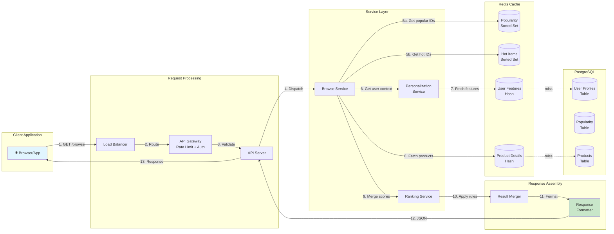

---

## 3. Event Ingestion & Processing Pipeline

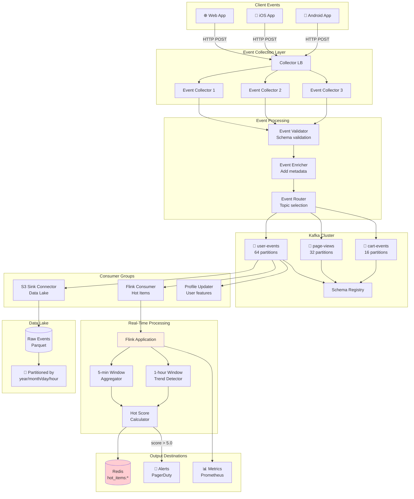

---

## 4. Batch Pipeline - Popularity Computation

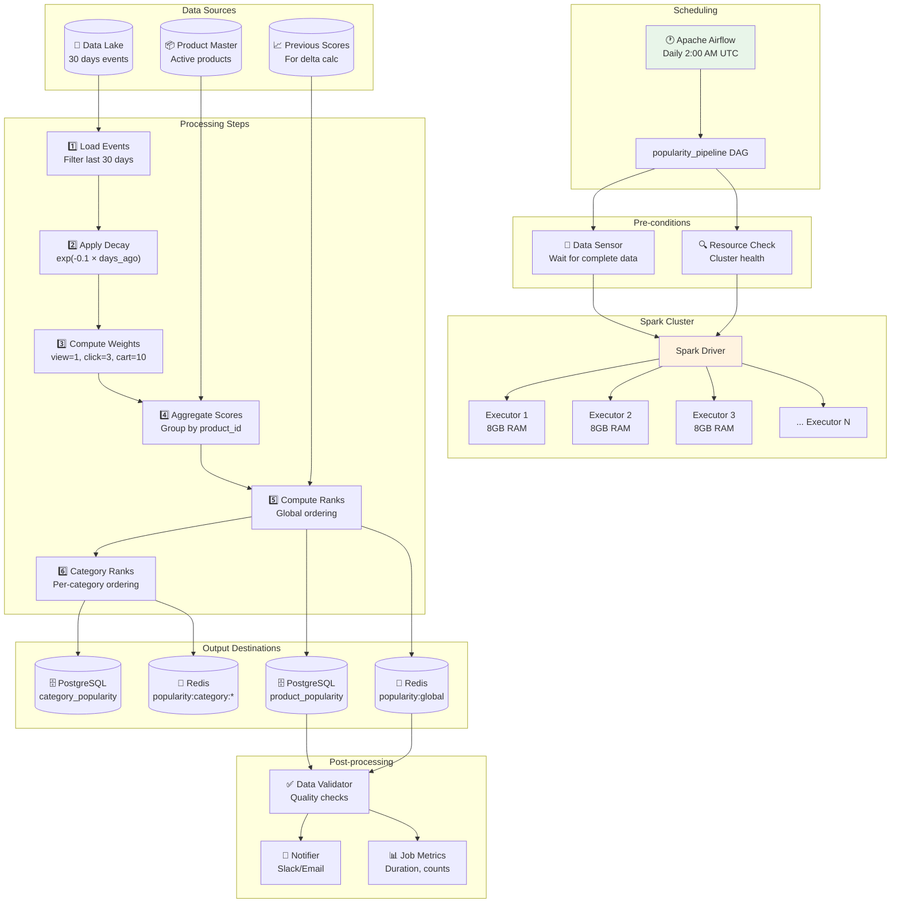

---

## 5. Real-Time Hot Items Detection

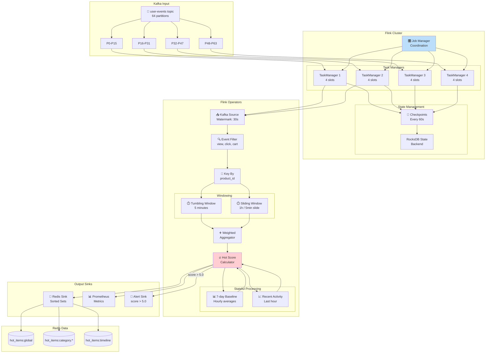

---

## 6. Personalization Engine Architecture

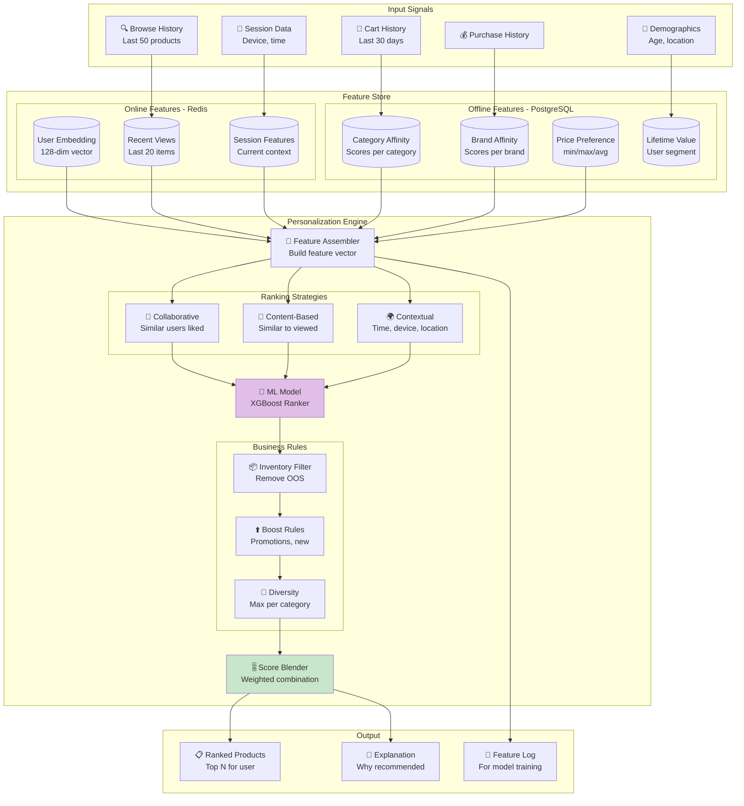

---

## 7. Cold Start Handling Flow

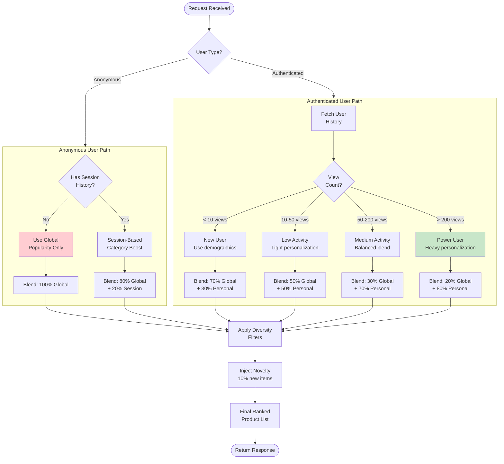

---

## 8. Database Schema Relationships

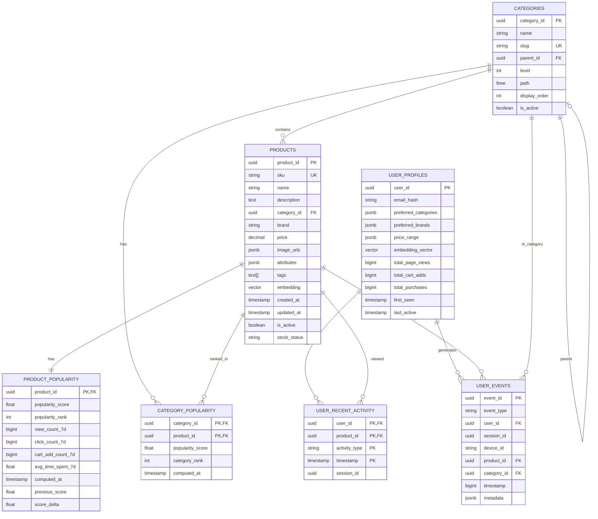

---

## 9. Infrastructure Topology

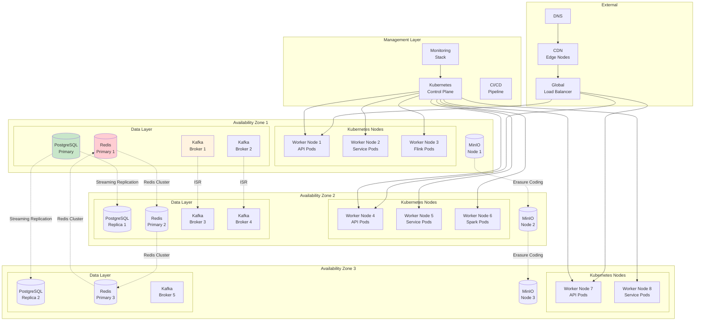

---

## 10. API Request-Response Flow (Detailed Sequence)

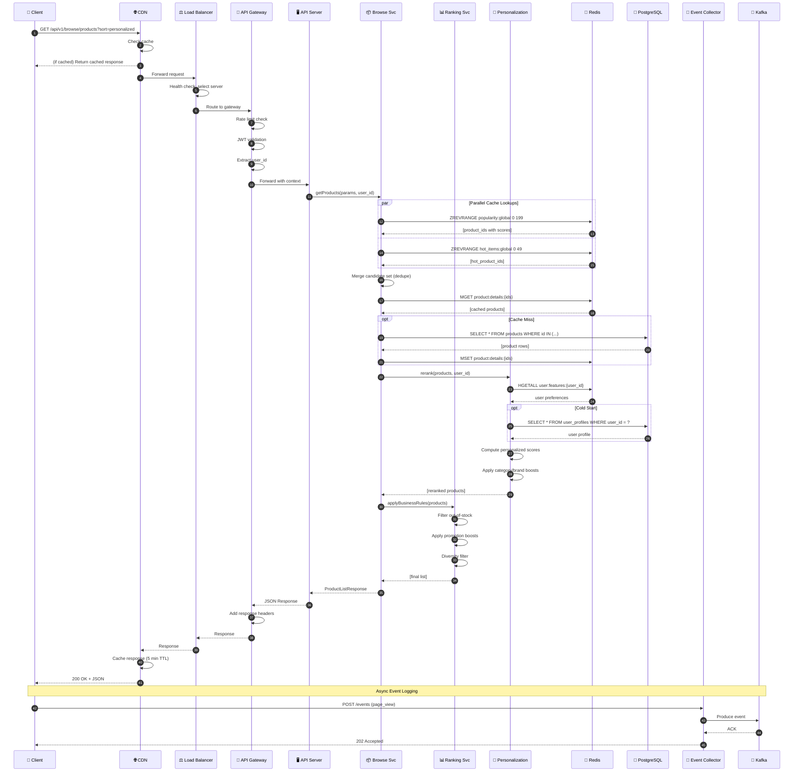

---

## 11. Failure Recovery Scenarios

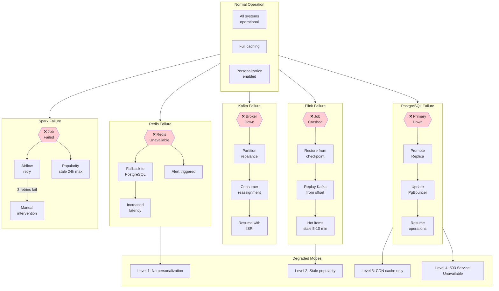

---

## 12. Monitoring & Alerting Dashboard Layout

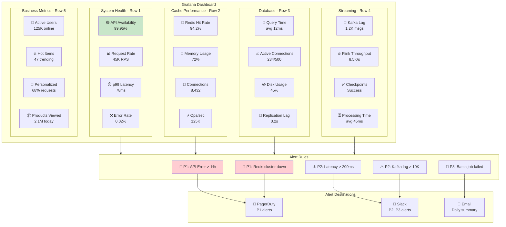

---

## How to Export as Images

### Option 1: Mermaid Live Editor
1. Go to [mermaid.live](https://mermaid.live/)
2. Paste any diagram code
3. Click "Actions" → "Download PNG" or "Download SVG"

### Option 2: Mermaid CLI
```bash
# Install
npm install -g @mermaid-js/mermaid-cli

# Export single diagram
mmdc -i architecture-diagrams.md -o output.png -s 2

# Export with dark theme
mmdc -i architecture-diagrams.md -o output.png -t dark
```

### Option 3: VS Code
1. Install "Markdown Preview Mermaid Support" extension
2. Open this file
3. Press `Cmd+Shift+V` to preview
4. Right-click diagram → "Save as PNG"

### Option 4: Obsidian / Notion
- Both render Mermaid natively
- Copy/paste diagrams directly

