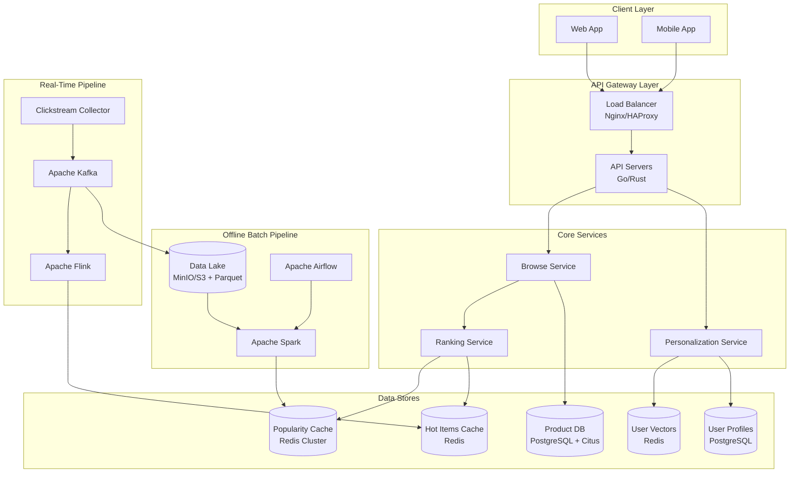
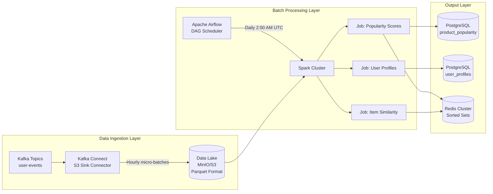
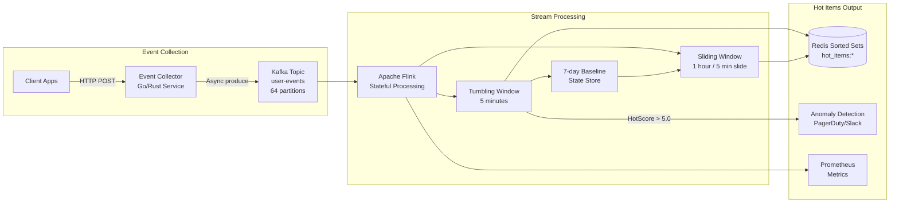
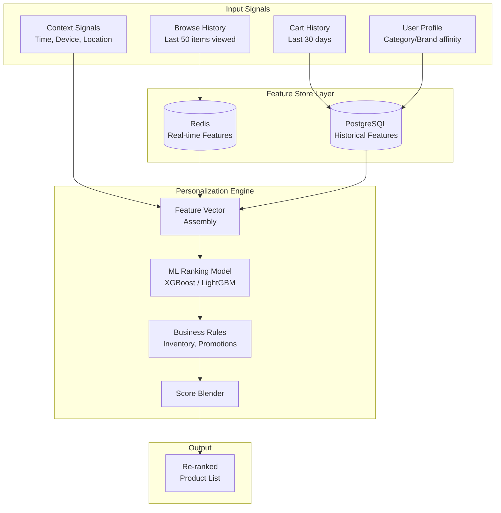
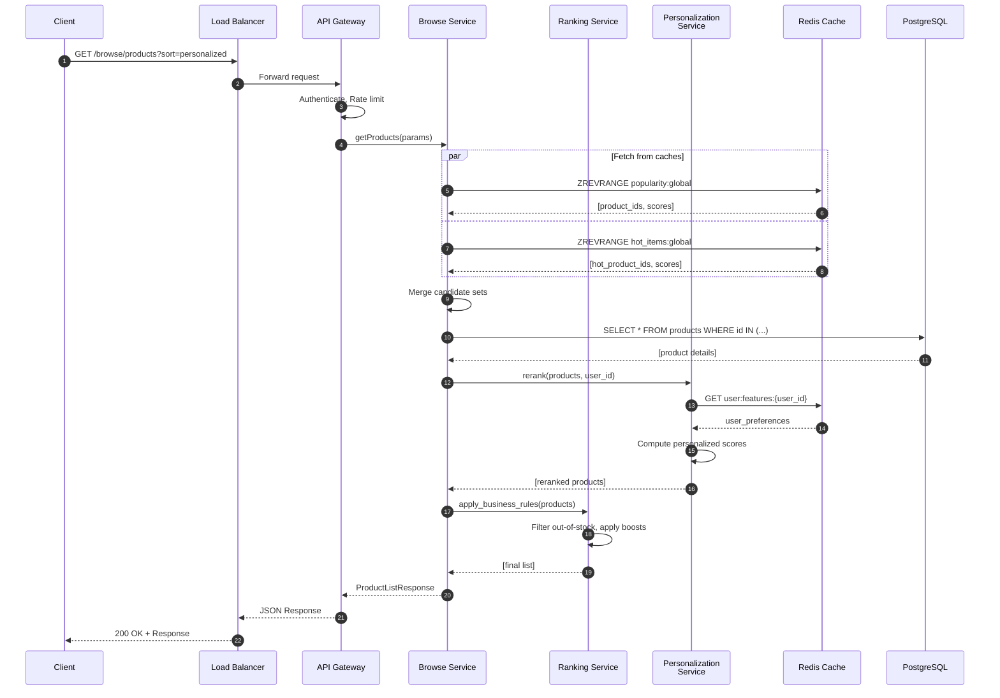
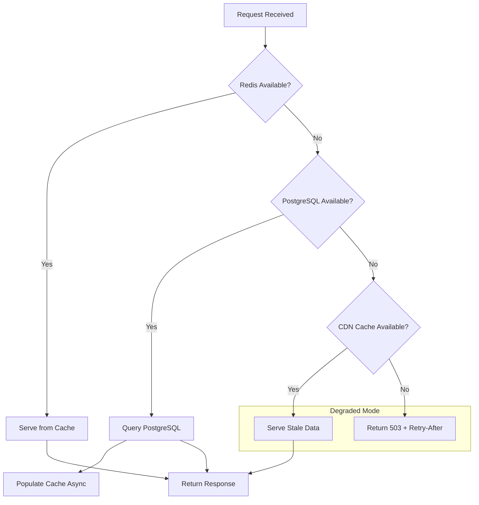

# E-Commerce Merchandise Browsing System - System Design Document

> **Version:** 1.0
> **Last Updated:** December 28, 2025
> **Scale Target:** 1M+ DAU, 100K+ Products
> **Stack:** Cloud-Agnostic (Kafka, Redis, PostgreSQL, Spark, Flink)

---

## Table of Contents

1. [Executive Summary](#1-executive-summary)
2. [Requirements](#2-requirements)
3. [High-Level Architecture](#3-high-level-architecture)
4. [Data Models](#4-data-models)
5. [Offline Batch Pipeline (Popularity)](#5-offline-batch-pipeline-popularity-computation)
6. [Real-Time Pipeline (Hot/Trending)](#6-real-time-pipeline-hottrending-items)
7. [Personalization Service](#7-personalization-service)
8. [API Design](#8-api-design)
9. [Technology Stack & Rationale](#9-technology-stack--rationale)
10. [Scaling Considerations](#10-scaling-considerations)
11. [Failure Mode Analysis](#11-failure-mode-analysis)
12. [Cost Estimation](#12-cost-estimation)
13. [Implementation Phases](#13-implementation-phases)

---

## 1. Executive Summary

This document outlines the architecture for a large-scale e-commerce merchandise browsing system. The system enables users to discover products through:

- **Popularity-based ranking**: Products ranked by historical engagement metrics
- **Real-time trending**: "Hot" items detected through streaming analytics
- **Personalization**: User-specific recommendations based on behavior signals

The architecture prioritizes read performance (<100ms p99 latency), horizontal scalability, and high availability (99.9%+).

---

## 2. Requirements

### 2.1 Functional Requirements

| Requirement | Description |
|-------------|-------------|
| **FR-1** | Display merchandise catalog with popularity-based ranking |
| **FR-2** | Compute "popular" items via offline batch processing (daily) |
| **FR-3** | Compute "hot/trending" items via real-time streaming (5-min windows) |
| **FR-4** | Personalize results per user based on behavior signals |
| **FR-5** | Support category-based filtering and browsing |
| **FR-6** | Handle anonymous users with global recommendations |

### 2.2 Non-Functional Requirements

| Requirement | Target | Rationale |
|-------------|--------|-----------|
| **Latency (p99)** | < 100ms | Optimal user experience for browsing |
| **Availability** | 99.9%+ | 8.76 hours downtime/year max |
| **Throughput** | 50K+ RPS | Peak traffic during sales events |
| **Data Freshness (Hot)** | < 5 min | Real-time trending detection |
| **Data Freshness (Popular)** | < 24 hours | Daily batch updates acceptable |
| **Scalability** | Horizontal | Add capacity without architecture changes |

### 2.3 Capacity Estimates

| Metric | Value | Calculation |
|--------|-------|-------------|
| Daily Active Users | 1,000,000 | Given |
| Products in Catalog | 100,000+ | Given |
| Page Views/Day | 50,000,000 | 50 pages/user avg |
| Events/Second (Peak) | 2,000 | 3x average during peak hours |
| Event Storage/Day | ~50 GB | 1KB avg event × 50M events |
| Monthly Event Storage | ~1.5 TB | 30 days retention |

---

## 3. High-Level Architecture

### 3.1 System Overview



### 3.2 Component Responsibilities

| Component | Responsibility |
|-----------|----------------|
| **Load Balancer** | Traffic distribution, SSL termination, health checks |
| **API Gateway** | Rate limiting, authentication, request routing |
| **Browse Service** | Product fetching, filtering, pagination |
| **Ranking Service** | Merging popularity, hot, and personalized scores |
| **Personalization Service** | User feature retrieval, re-ranking |
| **Batch Pipeline** | Daily popularity score computation |
| **Real-Time Pipeline** | Streaming hot/trending detection |

---

## 4. Data Models

### 4.1 Product Schema (PostgreSQL)

```sql
-- Enable required extensions
CREATE EXTENSION IF NOT EXISTS "uuid-ossp";
CREATE EXTENSION IF NOT EXISTS "ltree";
CREATE EXTENSION IF NOT EXISTS "vector";  -- pgvector for embeddings

-- Core product table
CREATE TABLE products (
    product_id      UUID PRIMARY KEY DEFAULT uuid_generate_v4(),
    sku             VARCHAR(100) UNIQUE NOT NULL,
    name            VARCHAR(500) NOT NULL,
    description     TEXT,
    category_id     UUID NOT NULL REFERENCES categories(category_id),
    brand           VARCHAR(200),
    price           DECIMAL(10,2) NOT NULL,
    currency        CHAR(3) DEFAULT 'USD',
    image_urls      JSONB NOT NULL DEFAULT '[]',
    thumbnail_url   VARCHAR(500),
    attributes      JSONB DEFAULT '{}',  -- color, size, material, etc.
    tags            TEXT[],
    embedding       VECTOR(128),  -- Product embedding for similarity
    created_at      TIMESTAMP WITH TIME ZONE DEFAULT NOW(),
    updated_at      TIMESTAMP WITH TIME ZONE DEFAULT NOW(),
    is_active       BOOLEAN DEFAULT TRUE,
    stock_status    VARCHAR(20) DEFAULT 'in_stock'  -- in_stock, low_stock, out_of_stock
);

-- Category hierarchy using ltree for efficient ancestor/descendant queries
CREATE TABLE categories (
    category_id     UUID PRIMARY KEY DEFAULT uuid_generate_v4(),
    name            VARCHAR(200) NOT NULL,
    slug            VARCHAR(200) UNIQUE NOT NULL,
    parent_id       UUID REFERENCES categories(category_id),
    level           INT NOT NULL DEFAULT 0,
    path            LTREE NOT NULL,  -- e.g., 'electronics.phones.smartphones'
    display_order   INT DEFAULT 0,
    is_active       BOOLEAN DEFAULT TRUE,
    created_at      TIMESTAMP WITH TIME ZONE DEFAULT NOW()
);

-- Precomputed popularity scores (updated by batch pipeline daily)
CREATE TABLE product_popularity (
    product_id          UUID PRIMARY KEY REFERENCES products(product_id) ON DELETE CASCADE,
    popularity_score    FLOAT NOT NULL DEFAULT 0,
    popularity_rank     INT,  -- Global rank (1 = most popular)
    view_count_7d       BIGINT DEFAULT 0,
    click_count_7d      BIGINT DEFAULT 0,
    cart_add_count_7d   BIGINT DEFAULT 0,
    avg_time_spent_7d   FLOAT DEFAULT 0,  -- in seconds
    purchase_count_7d   BIGINT DEFAULT 0,
    computed_at         TIMESTAMP WITH TIME ZONE NOT NULL,
    previous_score      FLOAT,  -- For trend detection
    score_delta         FLOAT   -- Change since last computation
);

-- Category-level popularity (for category pages)
CREATE TABLE category_popularity (
    category_id         UUID NOT NULL REFERENCES categories(category_id),
    product_id          UUID NOT NULL REFERENCES products(product_id),
    popularity_score    FLOAT NOT NULL DEFAULT 0,
    category_rank       INT,
    computed_at         TIMESTAMP WITH TIME ZONE NOT NULL,
    PRIMARY KEY (category_id, product_id)
);

-- Indexes for efficient querying
CREATE INDEX idx_products_category ON products(category_id) WHERE is_active = TRUE;
CREATE INDEX idx_products_brand ON products(brand) WHERE is_active = TRUE;
CREATE INDEX idx_products_price ON products(price) WHERE is_active = TRUE;
CREATE INDEX idx_products_created ON products(created_at DESC) WHERE is_active = TRUE;
CREATE INDEX idx_products_tags ON products USING GIN(tags);
CREATE INDEX idx_products_embedding ON products USING ivfflat(embedding vector_cosine_ops);

CREATE INDEX idx_popularity_score ON product_popularity(popularity_score DESC);
CREATE INDEX idx_popularity_rank ON product_popularity(popularity_rank ASC);
CREATE INDEX idx_category_popularity ON category_popularity(category_id, popularity_score DESC);

CREATE INDEX idx_categories_path ON categories USING GIST(path);
CREATE INDEX idx_categories_parent ON categories(parent_id);
```

### 4.2 User Events Schema (Kafka + Data Lake)

Events are captured in Kafka and persisted to the data lake in Parquet format.

```json
{
  "schema": {
    "type": "struct",
    "fields": [
      {"name": "event_id", "type": "string", "doc": "UUID v4 unique event identifier"},
      {"name": "event_type", "type": "string", "doc": "page_view | click | add_to_cart | remove_from_cart | time_spent | search"},
      {"name": "user_id", "type": "string", "doc": "UUID of authenticated user, null for anonymous"},
      {"name": "session_id", "type": "string", "doc": "UUID for session tracking"},
      {"name": "device_id", "type": "string", "doc": "Fingerprint for anonymous user tracking"},
      {"name": "product_id", "type": "string", "doc": "UUID of the product"},
      {"name": "category_id", "type": "string", "doc": "UUID of the product category"},
      {"name": "timestamp", "type": "long", "doc": "Event timestamp in epoch milliseconds"},
      {"name": "metadata", "type": "map", "doc": "Additional event-specific data"}
    ]
  },
  "example": {
    "event_id": "550e8400-e29b-41d4-a716-446655440000",
    "event_type": "page_view",
    "user_id": "123e4567-e89b-12d3-a456-426614174000",
    "session_id": "987fcdeb-51a2-3bc4-d567-890123456789",
    "device_id": "fp_abc123def456",
    "product_id": "prod_789xyz",
    "category_id": "cat_electronics_phones",
    "timestamp": 1735391400000,
    "metadata": {
      "duration_ms": 45000,
      "device_type": "mobile",
      "os": "iOS",
      "browser": "Safari",
      "referrer": "search",
      "search_query": "wireless headphones",
      "position_in_list": 5,
      "page_url": "/products/wireless-headphones-pro",
      "viewport_width": 390,
      "is_above_fold": true
    }
  }
}
```

**Data Lake Partitioning Strategy:**

```
s3://datalake/events/
├── year=2025/
│   ├── month=12/
│   │   ├── day=28/
│   │   │   ├── hour=00/
│   │   │   │   ├── events_00_part_0001.parquet
│   │   │   │   ├── events_00_part_0002.parquet
│   │   │   │   └── ...
│   │   │   ├── hour=01/
│   │   │   └── ...
│   │   └── ...
│   └── ...
└── ...
```

### 4.3 User Profile Schema

```sql
-- User profile for personalization
CREATE TABLE user_profiles (
    user_id                 UUID PRIMARY KEY,
    email_hash              VARCHAR(64),  -- For deduplication, not PII storage

    -- Behavioral signals (updated by batch pipeline)
    preferred_categories    JSONB DEFAULT '{}',      -- {category_id: affinity_score}
    preferred_brands        JSONB DEFAULT '{}',      -- {brand: affinity_score}
    price_range             JSONB DEFAULT '{}',      -- {min: 0, max: 1000, avg: 150}

    -- Embedding for ML-based similarity
    embedding_vector        VECTOR(128),

    -- Activity tracking
    total_page_views        BIGINT DEFAULT 0,
    total_cart_adds         BIGINT DEFAULT 0,
    total_purchases         BIGINT DEFAULT 0,

    -- Timestamps
    first_seen              TIMESTAMP WITH TIME ZONE DEFAULT NOW(),
    last_active             TIMESTAMP WITH TIME ZONE DEFAULT NOW(),
    profile_updated_at      TIMESTAMP WITH TIME ZONE DEFAULT NOW()
);

-- Recent user activity (for session-based personalization)
CREATE TABLE user_recent_activity (
    user_id             UUID NOT NULL,
    product_id          UUID NOT NULL,
    activity_type       VARCHAR(50) NOT NULL,
    timestamp           TIMESTAMP WITH TIME ZONE DEFAULT NOW(),
    session_id          UUID,
    PRIMARY KEY (user_id, product_id, activity_type, timestamp)
) PARTITION BY RANGE (timestamp);

-- Create partitions for recent activity (rolling 30-day window)
CREATE TABLE user_recent_activity_current PARTITION OF user_recent_activity
    FOR VALUES FROM (CURRENT_DATE - INTERVAL '30 days') TO (CURRENT_DATE + INTERVAL '1 day');

-- Indexes
CREATE INDEX idx_user_profiles_embedding ON user_profiles
    USING ivfflat(embedding_vector vector_cosine_ops);
CREATE INDEX idx_user_profiles_last_active ON user_profiles(last_active DESC);
CREATE INDEX idx_recent_activity_user ON user_recent_activity(user_id, timestamp DESC);
```

---

## 5. Offline Batch Pipeline (Popularity Computation)

### 5.1 Pipeline Architecture



### 5.2 Popularity Scoring Algorithm

The popularity score combines multiple engagement signals with time decay to favor recent activity.

**Formula:**

```
PopularityScore = Σ (weight_i × count_i × decay_factor)

Components:
┌─────────────────────┬────────┬─────────────────────────────────────┐
│ Signal              │ Weight │ Rationale                           │
├─────────────────────┼────────┼─────────────────────────────────────┤
│ Page View           │ 1.0    │ Basic interest indicator            │
│ Click (from list)   │ 3.0    │ Deliberate selection                │
│ Add to Cart         │ 10.0   │ Strong purchase intent              │
│ Time Spent (per sec)│ 0.1    │ Engagement depth (capped at 5 pts)  │
│ Purchase            │ 15.0   │ Strongest signal (if available)     │
└─────────────────────┴────────┴─────────────────────────────────────┘

Time Decay:
- decay_factor = exp(-λ × days_ago)
- λ = 0.1 (gives half-life ≈ 7 days)
- Events older than 30 days are excluded
```

**Decay Factor Visualization:**

```
Days Ago:  0    3    7    10   14   21   30
Factor:   1.0  0.74 0.50 0.37 0.25 0.12 0.05
```

### 5.3 Spark Job Implementation

```python
"""
popularity_computation.py
Daily Spark job to compute product popularity scores.

Scheduled: Daily at 2:00 AM UTC via Airflow
Runtime: ~30 minutes for 50M events
"""

from pyspark.sql import SparkSession
from pyspark.sql.functions import (
    col, sum, when, exp, datediff, current_date,
    least, lit, row_number, coalesce
)
from pyspark.sql.window import Window
from datetime import datetime
import redis

# Configuration
CONFIG = {
    "data_lake_path": "s3a://datalake/events/",
    "lookback_days": 30,
    "weights": {
        "page_view": 1.0,
        "click": 3.0,
        "add_to_cart": 10.0,
        "time_spent_per_sec": 0.1,
        "time_spent_cap": 5.0,
        "purchase": 15.0
    },
    "decay_lambda": 0.1,
    "postgres_url": "jdbc:postgresql://postgres:5432/ecommerce",
    "redis_host": "redis-cluster",
    "redis_port": 6379
}


def create_spark_session():
    """Initialize Spark session with required configurations."""
    return (SparkSession.builder
        .appName("PopularityComputation")
        .config("spark.sql.shuffle.partitions", "200")
        .config("spark.sql.adaptive.enabled", "true")
        .config("spark.sql.adaptive.coalescePartitions.enabled", "true")
        .getOrCreate())


def load_events(spark, config):
    """Load events from the data lake with partition pruning."""
    cutoff_date = f"year={datetime.now().year}/month={datetime.now().month}"

    events_df = (spark.read
        .parquet(config["data_lake_path"])
        .filter(col("timestamp") >= (current_date() - config["lookback_days"]))
        .select(
            "event_id",
            "event_type",
            "product_id",
            "category_id",
            "timestamp",
            col("metadata.duration_ms").alias("duration_ms")
        ))

    return events_df


def compute_decay_factor(events_df, config):
    """Apply exponential time decay to events."""
    return events_df.withColumn(
        "days_ago",
        datediff(current_date(), col("timestamp"))
    ).withColumn(
        "decay_factor",
        exp(-config["decay_lambda"] * col("days_ago"))
    )


def compute_popularity_scores(events_df, config):
    """
    Compute weighted popularity scores per product.

    Returns DataFrame with columns:
    - product_id
    - popularity_score
    - view_count_7d, click_count_7d, cart_add_count_7d, avg_time_spent_7d
    """
    weights = config["weights"]

    # Compute individual signal scores
    scores_df = events_df.groupBy("product_id").agg(
        # View score
        sum(
            when(col("event_type") == "page_view",
                 weights["page_view"] * col("decay_factor"))
            .otherwise(0)
        ).alias("view_score"),

        # Click score
        sum(
            when(col("event_type") == "click",
                 weights["click"] * col("decay_factor"))
            .otherwise(0)
        ).alias("click_score"),

        # Cart add score
        sum(
            when(col("event_type") == "add_to_cart",
                 weights["add_to_cart"] * col("decay_factor"))
            .otherwise(0)
        ).alias("cart_score"),

        # Time spent score (capped)
        sum(
            when(col("event_type") == "time_spent",
                 least(
                     col("duration_ms") / 1000 * weights["time_spent_per_sec"],
                     lit(weights["time_spent_cap"])
                 ) * col("decay_factor"))
            .otherwise(0)
        ).alias("time_score"),

        # Purchase score (if tracked in this system)
        sum(
            when(col("event_type") == "purchase",
                 weights["purchase"] * col("decay_factor"))
            .otherwise(0)
        ).alias("purchase_score"),

        # Raw counts for analytics (last 7 days only)
        sum(when(
            (col("event_type") == "page_view") & (col("days_ago") <= 7), 1
        ).otherwise(0)).alias("view_count_7d"),

        sum(when(
            (col("event_type") == "click") & (col("days_ago") <= 7), 1
        ).otherwise(0)).alias("click_count_7d"),

        sum(when(
            (col("event_type") == "add_to_cart") & (col("days_ago") <= 7), 1
        ).otherwise(0)).alias("cart_add_count_7d"),

        (sum(when(
            (col("event_type") == "time_spent") & (col("days_ago") <= 7),
            col("duration_ms") / 1000
        ).otherwise(0)) /
         sum(when(
             (col("event_type") == "time_spent") & (col("days_ago") <= 7), 1
         ).otherwise(1))).alias("avg_time_spent_7d")
    )

    # Compute total popularity score
    scores_df = scores_df.withColumn(
        "popularity_score",
        col("view_score") + col("click_score") + col("cart_score") +
        col("time_score") + col("purchase_score")
    )

    # Compute global ranking
    rank_window = Window.orderBy(col("popularity_score").desc())
    scores_df = scores_df.withColumn(
        "popularity_rank",
        row_number().over(rank_window)
    )

    # Add computation timestamp
    scores_df = scores_df.withColumn(
        "computed_at",
        lit(datetime.utcnow())
    )

    return scores_df.select(
        "product_id",
        "popularity_score",
        "popularity_rank",
        "view_count_7d",
        "click_count_7d",
        "cart_add_count_7d",
        "avg_time_spent_7d",
        "computed_at"
    )


def compute_category_popularity(events_df, config):
    """Compute popularity scores per category."""
    weights = config["weights"]

    category_scores_df = events_df.groupBy("category_id", "product_id").agg(
        sum(
            when(col("event_type") == "page_view", weights["page_view"] * col("decay_factor"))
            .when(col("event_type") == "click", weights["click"] * col("decay_factor"))
            .when(col("event_type") == "add_to_cart", weights["add_to_cart"] * col("decay_factor"))
            .otherwise(0)
        ).alias("popularity_score")
    )

    # Rank within each category
    category_window = Window.partitionBy("category_id").orderBy(col("popularity_score").desc())
    category_scores_df = category_scores_df.withColumn(
        "category_rank",
        row_number().over(category_window)
    ).withColumn(
        "computed_at",
        lit(datetime.utcnow())
    )

    return category_scores_df


def write_to_postgres(df, table_name, config):
    """Write DataFrame to PostgreSQL with upsert semantics."""
    (df.write
        .format("jdbc")
        .option("url", config["postgres_url"])
        .option("dbtable", table_name)
        .option("user", "ecommerce_app")
        .option("password", "${POSTGRES_PASSWORD}")
        .option("driver", "org.postgresql.Driver")
        .mode("overwrite")  # Full refresh for popularity tables
        .save())


def write_to_redis(df, config):
    """
    Write top products to Redis sorted sets for fast retrieval.

    Redis Keys:
    - popularity:global -> Top 10K products globally
    - popularity:category:{category_id} -> Top 1K per category
    """
    r = redis.Redis(
        host=config["redis_host"],
        port=config["redis_port"],
        decode_responses=True
    )

    # Get top 10K products
    top_products = df.orderBy(col("popularity_score").desc()).limit(10000).collect()

    # Use pipeline for efficient bulk writes
    pipe = r.pipeline()

    # Clear existing data
    pipe.delete("popularity:global")

    # Add to sorted set
    for row in top_products:
        pipe.zadd("popularity:global", {row.product_id: row.popularity_score})

    # Set TTL (25 hours to ensure overlap with next batch)
    pipe.expire("popularity:global", 90000)

    pipe.execute()


def main():
    """Main entry point for the popularity computation job."""
    spark = create_spark_session()

    try:
        # Load and transform events
        events_df = load_events(spark, CONFIG)
        events_with_decay = compute_decay_factor(events_df, CONFIG)

        # Cache for reuse
        events_with_decay.cache()

        # Compute scores
        popularity_df = compute_popularity_scores(events_with_decay, CONFIG)
        category_popularity_df = compute_category_popularity(events_with_decay, CONFIG)

        # Write outputs
        write_to_postgres(popularity_df, "product_popularity", CONFIG)
        write_to_postgres(category_popularity_df, "category_popularity", CONFIG)
        write_to_redis(popularity_df, CONFIG)

        # Log metrics
        total_products = popularity_df.count()
        print(f"Computed popularity for {total_products} products")

    finally:
        spark.stop()


if __name__ == "__main__":
    main()
```

### 5.4 Airflow DAG Definition

```python
"""
dags/popularity_pipeline.py
Airflow DAG for orchestrating the popularity computation pipeline.
"""

from datetime import datetime, timedelta
from airflow import DAG
from airflow.providers.apache.spark.operators.spark_submit import SparkSubmitOperator
from airflow.providers.postgres.operators.postgres import PostgresOperator
from airflow.operators.python import PythonOperator
from airflow.sensors.external_task import ExternalTaskSensor
from airflow.utils.trigger_rule import TriggerRule

default_args = {
    'owner': 'data-engineering',
    'depends_on_past': False,
    'email': ['data-alerts@company.com'],
    'email_on_failure': True,
    'email_on_retry': False,
    'retries': 3,
    'retry_delay': timedelta(minutes=10),
    'execution_timeout': timedelta(hours=2),
}

with DAG(
    dag_id='popularity_computation_pipeline',
    default_args=default_args,
    description='Daily computation of product popularity scores',
    schedule_interval='0 2 * * *',  # 2:00 AM UTC daily
    start_date=datetime(2025, 1, 1),
    catchup=False,
    max_active_runs=1,
    tags=['popularity', 'batch', 'critical'],
) as dag:

    # Wait for data lake to have complete data from previous day
    wait_for_data = ExternalTaskSensor(
        task_id='wait_for_event_ingestion',
        external_dag_id='kafka_to_s3_pipeline',
        external_task_id='hourly_sync_complete',
        timeout=3600,
        poke_interval=300,
    )

    # Run popularity computation Spark job
    compute_popularity = SparkSubmitOperator(
        task_id='compute_popularity_scores',
        application='/opt/spark/jobs/popularity_computation.py',
        conn_id='spark_cluster',
        conf={
            'spark.executor.memory': '8g',
            'spark.executor.cores': '4',
            'spark.executor.instances': '10',
            'spark.driver.memory': '4g',
            'spark.sql.shuffle.partitions': '200',
        },
        application_args=[
            '--date', '{{ ds }}',
            '--config', '/opt/spark/config/popularity_config.yaml'
        ],
    )

    # Compute user profile updates
    compute_user_profiles = SparkSubmitOperator(
        task_id='compute_user_profiles',
        application='/opt/spark/jobs/user_profile_computation.py',
        conn_id='spark_cluster',
        conf={
            'spark.executor.memory': '8g',
            'spark.executor.instances': '5',
        },
    )

    # Validate data quality
    validate_popularity = PostgresOperator(
        task_id='validate_popularity_scores',
        postgres_conn_id='postgres_ecommerce',
        sql="""
            DO $$
            DECLARE
                product_count INT;
                null_scores INT;
            BEGIN
                SELECT COUNT(*) INTO product_count FROM product_popularity;
                SELECT COUNT(*) INTO null_scores
                FROM product_popularity WHERE popularity_score IS NULL;

                IF product_count < 1000 THEN
                    RAISE EXCEPTION 'Too few products with popularity scores: %', product_count;
                END IF;

                IF null_scores > 0 THEN
                    RAISE EXCEPTION 'Found % products with NULL scores', null_scores;
                END IF;
            END $$;
        """,
    )

    # Refresh Redis cache
    def refresh_redis_cache(**context):
        """Trigger Redis cache refresh from PostgreSQL."""
        import redis
        import psycopg2

        # Implementation details...
        pass

    refresh_cache = PythonOperator(
        task_id='refresh_redis_cache',
        python_callable=refresh_redis_cache,
    )

    # Send success notification
    def notify_success(**context):
        """Send Slack/PagerDuty notification on success."""
        pass

    notify = PythonOperator(
        task_id='notify_completion',
        python_callable=notify_success,
        trigger_rule=TriggerRule.ALL_SUCCESS,
    )

    # DAG dependencies
    wait_for_data >> compute_popularity >> validate_popularity >> refresh_cache >> notify
    wait_for_data >> compute_user_profiles >> notify
```

---

## 6. Real-Time Pipeline (Hot/Trending Items)

### 6.1 Pipeline Architecture



### 6.2 Hot Score Algorithm

The "hot score" measures **velocity** - how quickly a product is gaining attention compared to its baseline.

```
┌────────────────────────────────────────────────────────────────────┐
│ Hot Score Formula                                                   │
├────────────────────────────────────────────────────────────────────┤
│                                                                     │
│   HotScore = (events_last_hour / avg_events_hourly_7d) × recency   │
│                                                                     │
│   Where:                                                            │
│   - events_last_hour = weighted events in sliding 1-hour window     │
│   - avg_events_hourly_7d = baseline hourly average (same hour/day)  │
│   - recency_boost = 1 + (events_last_5min / events_last_hour)       │
│                                                                     │
│   Thresholds:                                                       │
│   - HotScore > 2.0  → "Rising" badge                                │
│   - HotScore > 3.0  → "Trending" badge                              │
│   - HotScore > 5.0  → "Hot" badge + alert for marketing             │
│                                                                     │
└────────────────────────────────────────────────────────────────────┘

Example:
- Product normally gets 100 events/hour on Sunday afternoons
- In the last hour, it received 350 events
- In the last 5 minutes, it received 80 events
- recency_boost = 1 + (80 / 350) = 1.23
- HotScore = (350 / 100) × 1.23 = 4.31 → "Trending"
```

### 6.3 Flink Job Implementation

```java
package com.ecommerce.streaming;

import org.apache.flink.api.common.eventtime.WatermarkStrategy;
import org.apache.flink.api.common.state.MapState;
import org.apache.flink.api.common.state.MapStateDescriptor;
import org.apache.flink.api.common.state.ValueState;
import org.apache.flink.api.common.state.ValueStateDescriptor;
import org.apache.flink.configuration.Configuration;
import org.apache.flink.streaming.api.datastream.DataStream;
import org.apache.flink.streaming.api.environment.StreamExecutionEnvironment;
import org.apache.flink.streaming.api.functions.KeyedProcessFunction;
import org.apache.flink.streaming.api.windowing.assigners.SlidingEventTimeWindows;
import org.apache.flink.streaming.api.windowing.assigners.TumblingEventTimeWindows;
import org.apache.flink.streaming.api.windowing.time.Time;
import org.apache.flink.streaming.connectors.kafka.FlinkKafkaConsumer;
import org.apache.flink.util.Collector;

import java.time.Duration;
import java.util.Properties;

/**
 * Flink streaming job for computing hot/trending items in real-time.
 *
 * Input: Kafka topic "user-events" with UserEvent records
 * Output: Redis sorted sets with hot scores per product
 *
 * Windows:
 * - 5-minute tumbling window for short-term counts
 * - 1-hour sliding window (5-min slide) for trend detection
 */
public class HotItemsStreamingJob {

    public static void main(String[] args) throws Exception {
        // Set up execution environment
        StreamExecutionEnvironment env = StreamExecutionEnvironment.getExecutionEnvironment();
        env.setParallelism(16);
        env.enableCheckpointing(60000); // Checkpoint every minute

        // Kafka consumer configuration
        Properties kafkaProps = new Properties();
        kafkaProps.setProperty("bootstrap.servers", "kafka-cluster:9092");
        kafkaProps.setProperty("group.id", "hot-items-processor");
        kafkaProps.setProperty("auto.offset.reset", "latest");

        // Create Kafka source
        FlinkKafkaConsumer<UserEvent> consumer = new FlinkKafkaConsumer<>(
            "user-events",
            new UserEventDeserializationSchema(),
            kafkaProps
        );

        // Define watermark strategy (handle late events up to 30 seconds)
        WatermarkStrategy<UserEvent> watermarkStrategy = WatermarkStrategy
            .<UserEvent>forBoundedOutOfOrderness(Duration.ofSeconds(30))
            .withTimestampAssigner((event, timestamp) -> event.getTimestamp());

        // Main event stream
        DataStream<UserEvent> eventStream = env
            .addSource(consumer)
            .assignTimestampsAndWatermarks(watermarkStrategy)
            .name("Kafka Source");

        // 5-minute tumbling window: Real-time activity counts
        DataStream<ProductActivityCount> fiveMinCounts = eventStream
            .filter(event -> isRelevantEvent(event))
            .keyBy(UserEvent::getProductId)
            .window(TumblingEventTimeWindows.of(Time.minutes(5)))
            .aggregate(new WeightedEventAggregator())
            .name("5-Min Activity Counts");

        // Compute hot scores using stateful processing
        DataStream<HotScore> hotScores = fiveMinCounts
            .keyBy(ProductActivityCount::getProductId)
            .process(new HotScoreCalculator())
            .name("Hot Score Calculator");

        // Sink to Redis
        hotScores
            .addSink(new RedisSortedSetSink("hot_items:global"))
            .name("Redis Sink");

        // Category-specific hot items
        DataStream<HotScore> categoryHotScores = eventStream
            .filter(event -> isRelevantEvent(event))
            .keyBy(event -> event.getCategoryId() + ":" + event.getProductId())
            .window(SlidingEventTimeWindows.of(Time.hours(1), Time.minutes(5)))
            .aggregate(new WeightedEventAggregator())
            .keyBy(count -> count.getCategoryId())
            .process(new CategoryHotScoreCalculator())
            .name("Category Hot Scores");

        categoryHotScores
            .addSink(new RedisCategorySink())
            .name("Redis Category Sink");

        // Alert on spike detection
        hotScores
            .filter(score -> score.getHotScore() > 5.0)
            .addSink(new AlertSink())
            .name("Spike Alert");

        env.execute("Hot Items Detection Pipeline");
    }

    private static boolean isRelevantEvent(UserEvent event) {
        return event.getEventType().equals("page_view") ||
               event.getEventType().equals("click") ||
               event.getEventType().equals("add_to_cart");
    }
}

/**
 * Stateful processor that computes hot scores by comparing
 * current activity to historical baseline.
 */
class HotScoreCalculator extends KeyedProcessFunction<String, ProductActivityCount, HotScore> {

    // State: Rolling 7-day baseline (hourly averages)
    private MapState<Integer, Double> hourlyBaseline;  // hour-of-week -> avg count

    // State: Last hour's activity
    private ValueState<Double> lastHourActivity;

    // State: Last 5 minutes activity
    private ValueState<Double> last5MinActivity;

    @Override
    public void open(Configuration parameters) {
        MapStateDescriptor<Integer, Double> baselineDesc = new MapStateDescriptor<>(
            "hourlyBaseline",
            Integer.class,
            Double.class
        );
        hourlyBaseline = getRuntimeContext().getMapState(baselineDesc);

        ValueStateDescriptor<Double> hourDesc = new ValueStateDescriptor<>(
            "lastHourActivity",
            Double.class
        );
        lastHourActivity = getRuntimeContext().getState(hourDesc);

        ValueStateDescriptor<Double> fiveMinDesc = new ValueStateDescriptor<>(
            "last5MinActivity",
            Double.class
        );
        last5MinActivity = getRuntimeContext().getState(fiveMinDesc);
    }

    @Override
    public void processElement(
            ProductActivityCount count,
            Context ctx,
            Collector<HotScore> out) throws Exception {

        String productId = count.getProductId();
        double currentCount = count.getWeightedCount();
        long timestamp = ctx.timestamp();

        // Get hour of week (0-167) for baseline lookup
        int hourOfWeek = getHourOfWeek(timestamp);

        // Update rolling states
        Double prevHour = lastHourActivity.value();
        if (prevHour == null) prevHour = 0.0;

        Double prev5Min = last5MinActivity.value();
        if (prev5Min == null) prev5Min = 0.0;

        // Update last 5-min (current window)
        last5MinActivity.update(currentCount);

        // Update last hour (accumulate 12 windows worth)
        double newHourActivity = prevHour * 0.917 + currentCount;  // Exponential decay
        lastHourActivity.update(newHourActivity);

        // Get baseline for this hour of week
        Double baseline = hourlyBaseline.get(hourOfWeek);
        if (baseline == null || baseline == 0.0) {
            baseline = currentCount * 12;  // Default baseline if no history
        }

        // Update baseline with exponential moving average
        double newBaseline = baseline * 0.99 + newHourActivity * 0.01;
        hourlyBaseline.put(hourOfWeek, newBaseline);

        // Calculate hot score
        double avgHourly = baseline;
        double recencyBoost = 1.0 + (currentCount / Math.max(newHourActivity, 1.0));
        double hotScore = (newHourActivity / Math.max(avgHourly, 1.0)) * recencyBoost;

        // Determine badge
        String badge = determineBadge(hotScore);

        // Emit hot score
        out.collect(new HotScore(
            productId,
            hotScore,
            badge,
            timestamp,
            newHourActivity,
            avgHourly
        ));
    }

    private String determineBadge(double hotScore) {
        if (hotScore > 5.0) return "hot";
        if (hotScore > 3.0) return "trending";
        if (hotScore > 2.0) return "rising";
        return null;
    }

    private int getHourOfWeek(long timestamp) {
        java.time.Instant instant = java.time.Instant.ofEpochMilli(timestamp);
        java.time.ZonedDateTime zdt = instant.atZone(java.time.ZoneOffset.UTC);
        return zdt.getDayOfWeek().getValue() * 24 + zdt.getHour();
    }
}
```

### 6.4 Redis Data Structures

```bash
# Global hot items - Sorted set with product_id and hot_score
# Updated every 5 minutes by Flink
ZADD hot_items:global <hot_score> <product_id>

# Example:
ZADD hot_items:global 4.31 "prod_abc123" 3.85 "prod_def456" 2.12 "prod_ghi789"

# Retrieve top 50 hot items globally
ZREVRANGE hot_items:global 0 49 WITHSCORES

# Category-specific hot items
ZADD hot_items:category:<category_id> <hot_score> <product_id>

# Example:
ZADD hot_items:category:electronics 5.23 "prod_headphones_001"
ZADD hot_items:category:clothing 3.45 "prod_jacket_002"

# Get top 20 hot items in a category
ZREVRANGE hot_items:category:electronics 0 19 WITHSCORES

# TTL: Expire if not updated within 2 hours (stale data protection)
EXPIRE hot_items:global 7200
EXPIRE hot_items:category:electronics 7200

# Recent hot items with timestamps (for debugging/monitoring)
ZADD hot_items:timeline <timestamp> "<product_id>:<hot_score>"
ZREMRANGEBYSCORE hot_items:timeline 0 <1_hour_ago>  # Keep only last hour
```

---

## 7. Personalization Service

### 7.1 Architecture



### 7.2 Personalization Strategies

#### Strategy 1: Collaborative Filtering (Offline, Batch)

Compute user-user and item-item similarity matrices using Spark.

```python
"""
Item-Item Collaborative Filtering using Spark ALS
Produces: "Users who viewed X also viewed Y"
"""

from pyspark.ml.recommendation import ALS
from pyspark.ml.evaluation import RegressionEvaluator

def train_collaborative_filtering_model(spark, events_df):
    """
    Train ALS model for item-item recommendations.

    Input: User-item interaction events
    Output: Item similarity matrix stored in Redis
    """

    # Prepare training data
    interactions = events_df.groupBy("user_id", "product_id").agg(
        # Implicit rating: weighted sum of interactions
        (sum(when(col("event_type") == "page_view", 1)
            .when(col("event_type") == "click", 2)
            .when(col("event_type") == "add_to_cart", 5)
            .otherwise(0))).alias("rating")
    ).filter(col("user_id").isNotNull())

    # Convert IDs to integers for ALS
    from pyspark.ml.feature import StringIndexer

    user_indexer = StringIndexer(inputCol="user_id", outputCol="user_idx")
    product_indexer = StringIndexer(inputCol="product_id", outputCol="product_idx")

    interactions = user_indexer.fit(interactions).transform(interactions)
    interactions = product_indexer.fit(interactions).transform(interactions)

    # Train ALS model
    als = ALS(
        maxIter=10,
        regParam=0.1,
        userCol="user_idx",
        itemCol="product_idx",
        ratingCol="rating",
        implicitPrefs=True,
        coldStartStrategy="drop"
    )

    model = als.fit(interactions)

    # Extract item factors for similarity computation
    item_factors = model.itemFactors

    # Compute item-item similarity (top 50 similar items per product)
    # Using approximate nearest neighbors for efficiency
    from pyspark.ml.linalg import Vectors
    from pyspark.sql.functions import udf
    from pyspark.sql.types import ArrayType, StructType, StructField, StringType, FloatType

    # Store in Redis
    # Key: similar_items:{product_id}
    # Value: List of (similar_product_id, similarity_score)

    return model
```

#### Strategy 2: Content-Based Filtering (Real-time)

Use product embeddings and user preference vectors for real-time similarity.

```python
def get_content_based_recommendations(user_id: str, limit: int = 20) -> List[Product]:
    """
    Real-time content-based recommendations using embeddings.

    1. Fetch user embedding from PostgreSQL/Redis
    2. Query pgvector for similar products
    3. Return ranked list
    """

    # Get user embedding (128-dim vector)
    user_embedding = get_user_embedding(user_id)

    if user_embedding is None:
        # Cold start: use category/brand preferences instead
        return get_popularity_based_recommendations(user_id, limit)

    # Query pgvector for similar products
    # Uses IVFFlat index for approximate nearest neighbor search
    query = """
        SELECT
            p.product_id,
            p.name,
            p.price,
            p.thumbnail_url,
            1 - (p.embedding <=> $1) as similarity_score
        FROM products p
        WHERE p.is_active = TRUE
        ORDER BY p.embedding <=> $1
        LIMIT $2
    """

    products = db.execute(query, [user_embedding, limit])

    return products
```

#### Strategy 3: Contextual Re-ranking (Real-time)

Apply business logic and contextual signals to re-rank the candidate set.

```python
from dataclasses import dataclass
from typing import List, Dict, Optional
from datetime import datetime

@dataclass
class UserContext:
    user_id: Optional[str]
    session_id: str
    device_type: str  # mobile, desktop, tablet
    hour_of_day: int
    day_of_week: int
    location_country: str
    is_returning_visitor: bool

@dataclass
class UserPreferences:
    category_affinity: Dict[str, float]  # category_id -> score (0-1)
    brand_affinity: Dict[str, float]     # brand -> score (0-1)
    price_range: Dict[str, float]        # {min, max, avg}
    recent_views: List[str]              # Last 20 product_ids viewed


def rerank_for_user(
    products: List[Product],
    user_prefs: UserPreferences,
    context: UserContext
) -> List[Product]:
    """
    Re-rank products based on user preferences and context.

    Scoring weights:
    - Base popularity score: 40%
    - Category affinity: 25%
    - Brand affinity: 15%
    - Recency boost: 15%
    - Context boost: 5%

    Args:
        products: Candidate products (already filtered, max 200)
        user_prefs: User's historical preferences
        context: Current session context

    Returns:
        Re-ranked list of products
    """

    scored_products = []

    for product in products:
        # Base score (normalized 0-1)
        base_score = normalize_score(product.popularity_score)

        # Category affinity (0-1)
        category_boost = user_prefs.category_affinity.get(
            product.category_id, 0.0
        )

        # Brand affinity (0-1)
        brand_boost = user_prefs.brand_affinity.get(
            product.brand, 0.0
        )

        # Price preference penalty
        # Penalize products outside user's typical price range
        price_penalty = compute_price_penalty(
            product.price,
            user_prefs.price_range
        )

        # Recency boost: products in recently viewed categories
        recency_boost = compute_recency_boost(
            product.category_id,
            user_prefs.recent_views
        )

        # Context-based boost
        context_boost = compute_context_boost(product, context)

        # Combine scores with weights
        final_score = (
            base_score * 0.40 +
            category_boost * 0.25 +
            brand_boost * 0.15 +
            recency_boost * 0.15 +
            context_boost * 0.05 -
            price_penalty * 0.10
        )

        scored_products.append((product, final_score))

    # Sort by final score descending
    scored_products.sort(key=lambda x: x[1], reverse=True)

    # Apply diversity: ensure variety in top results
    diversified = apply_diversity_filter(scored_products)

    return [p for p, score in diversified]


def compute_price_penalty(price: float, price_range: Dict[str, float]) -> float:
    """
    Compute penalty for products outside user's price range.

    Returns 0 if within range, up to 0.5 if far outside.
    """
    if not price_range:
        return 0.0

    min_price = price_range.get('min', 0)
    max_price = price_range.get('max', float('inf'))
    avg_price = price_range.get('avg', (min_price + max_price) / 2)

    if min_price <= price <= max_price:
        return 0.0

    # Calculate how far outside the range
    if price < min_price:
        deviation = (min_price - price) / avg_price
    else:
        deviation = (price - max_price) / avg_price

    return min(deviation * 0.25, 0.5)


def compute_recency_boost(category_id: str, recent_views: List[str]) -> float:
    """
    Boost products in recently viewed categories.

    Recent views are weighted by position (most recent = highest weight).
    """
    if not recent_views:
        return 0.0

    # Get categories from recent views
    recent_categories = get_categories_for_products(recent_views)

    boost = 0.0
    for i, cat in enumerate(recent_categories):
        if cat == category_id:
            # Exponential decay by position
            boost += 1.0 * (0.9 ** i)

    return min(boost / 5.0, 1.0)  # Normalize to 0-1


def compute_context_boost(product: Product, context: UserContext) -> float:
    """
    Apply context-based boosts (time of day, device, etc.)
    """
    boost = 0.0

    # Gift-related products boost in evening hours
    if context.hour_of_day >= 18 and 'gift' in product.tags:
        boost += 0.3

    # Mobile users: boost products with good mobile images
    if context.device_type == 'mobile':
        boost += 0.1  # Could check image quality

    # Weekend vs weekday preferences
    if context.day_of_week in [5, 6]:  # Weekend
        if product.category_id in ['entertainment', 'home', 'sports']:
            boost += 0.2

    return min(boost, 1.0)


def apply_diversity_filter(
    scored_products: List[tuple],
    max_per_category: int = 5,
    max_per_brand: int = 3
) -> List[tuple]:
    """
    Ensure diversity in results by limiting items per category/brand.
    """
    result = []
    category_counts = {}
    brand_counts = {}

    for product, score in scored_products:
        cat_count = category_counts.get(product.category_id, 0)
        brand_count = brand_counts.get(product.brand, 0)

        if cat_count < max_per_category and brand_count < max_per_brand:
            result.append((product, score))
            category_counts[product.category_id] = cat_count + 1
            brand_counts[product.brand] = brand_count + 1

    return result
```

### 7.3 Cold Start Handling

| User Type | Signal Availability | Strategy |
|-----------|---------------------|----------|
| **Anonymous** | None | Global popularity ranking |
| **Anonymous + Session** | Current session only | Boost categories from session views |
| **New Registered** | Email, demographics | Demographics-based cohort preferences |
| **Low Activity (<10 views)** | Limited history | Blend: 70% global + 30% personal |
| **Active User (>50 views)** | Rich history | Blend: 30% global + 70% personal |
| **Power User (>200 views)** | Deep history | Heavy personalization + novelty injection |

```python
def get_personalization_blend_ratio(user: User) -> tuple[float, float]:
    """
    Determine blend ratio between global and personal signals.

    Returns (global_weight, personal_weight) that sum to 1.0
    """
    if user.is_anonymous:
        return (1.0, 0.0)

    total_views = user.total_page_views

    if total_views < 10:
        return (0.7, 0.3)
    elif total_views < 50:
        return (0.5, 0.5)
    elif total_views < 200:
        return (0.3, 0.7)
    else:
        return (0.2, 0.8)
```

---

## 8. API Design

### 8.1 Browse Products Endpoint

```yaml
# OpenAPI 3.0 Specification

openapi: 3.0.3
info:
  title: E-Commerce Browse API
  version: 1.0.0

paths:
  /api/v1/browse/products:
    get:
      summary: Browse merchandise catalog
      description: |
        Returns a paginated list of products with optional filtering,
        sorting, and personalization.
      parameters:
        - name: category_id
          in: query
          schema:
            type: string
            format: uuid
          description: Filter by category (includes subcategories)

        - name: sort
          in: query
          schema:
            type: string
            enum: [popular, hot, personalized, new, price_asc, price_desc]
            default: popular
          description: Sort order for results

        - name: limit
          in: query
          schema:
            type: integer
            minimum: 1
            maximum: 100
            default: 20
          description: Number of items per page

        - name: cursor
          in: query
          schema:
            type: string
          description: Pagination cursor (base64 encoded)

        - name: min_price
          in: query
          schema:
            type: number

        - name: max_price
          in: query
          schema:
            type: number

        - name: brands
          in: query
          schema:
            type: array
            items:
              type: string
          description: Filter by brand names

      responses:
        '200':
          description: Successful response
          content:
            application/json:
              schema:
                $ref: '#/components/schemas/ProductListResponse'

components:
  schemas:
    ProductListResponse:
      type: object
      properties:
        products:
          type: array
          items:
            $ref: '#/components/schemas/ProductSummary'
        pagination:
          $ref: '#/components/schemas/Pagination'
        metadata:
          $ref: '#/components/schemas/ResponseMetadata'

    ProductSummary:
      type: object
      properties:
        product_id:
          type: string
          format: uuid
        name:
          type: string
        price:
          type: number
          format: float
        currency:
          type: string
          example: USD
        thumbnail_url:
          type: string
          format: uri
        brand:
          type: string
        category:
          type: object
          properties:
            id:
              type: string
            name:
              type: string
        popularity_score:
          type: number
          description: Normalized popularity score (0-100)
        hot_score:
          type: number
          description: Hot/trending score (>2 = rising)
        badges:
          type: array
          items:
            type: string
            enum: [hot, trending, rising, popular, new]
        stock_status:
          type: string
          enum: [in_stock, low_stock, out_of_stock]

    Pagination:
      type: object
      properties:
        next_cursor:
          type: string
          nullable: true
        has_more:
          type: boolean
        total_count:
          type: integer
          description: Total matching products (may be approximate)

    ResponseMetadata:
      type: object
      properties:
        personalization_applied:
          type: boolean
        personalization_confidence:
          type: number
          description: Confidence in personalization (0-1)
        cache_hit:
          type: boolean
        response_time_ms:
          type: integer
```

### 8.2 Example Response

```json
{
  "products": [
    {
      "product_id": "550e8400-e29b-41d4-a716-446655440000",
      "name": "Wireless Noise-Canceling Headphones Pro",
      "price": 249.99,
      "currency": "USD",
      "thumbnail_url": "https://cdn.example.com/products/headphones-pro-thumb.jpg",
      "brand": "AudioTech",
      "category": {
        "id": "cat_electronics_audio",
        "name": "Audio & Headphones"
      },
      "popularity_score": 92.5,
      "hot_score": 3.2,
      "badges": ["trending", "popular"],
      "stock_status": "in_stock"
    },
    {
      "product_id": "661f9511-f30c-52e5-b827-557766551111",
      "name": "Smart Fitness Watch Series 5",
      "price": 299.00,
      "currency": "USD",
      "thumbnail_url": "https://cdn.example.com/products/fitness-watch-thumb.jpg",
      "brand": "FitGear",
      "category": {
        "id": "cat_electronics_wearables",
        "name": "Wearables"
      },
      "popularity_score": 88.3,
      "hot_score": 5.8,
      "badges": ["hot", "popular"],
      "stock_status": "low_stock"
    }
  ],
  "pagination": {
    "next_cursor": "eyJvZmZzZXQiOjIwLCJzY29yZSI6ODguM30=",
    "has_more": true,
    "total_count": 1523
  },
  "metadata": {
    "personalization_applied": true,
    "personalization_confidence": 0.85,
    "cache_hit": true,
    "response_time_ms": 23
  }
}
```

### 8.3 Request Flow Sequence



---

## 9. Technology Stack & Rationale

### 9.1 API Layer

| Component | Technology | Rationale |
|-----------|------------|-----------|
| **Load Balancer** | Nginx / HAProxy | - Battle-tested, handles 100K+ connections<br>- Supports health checks, circuit breaking<br>- SSL/TLS termination<br>- Layer 7 routing capabilities |
| **API Framework** | Go (Gin/Echo) or Rust (Actix) | - High throughput (100K+ RPS per node)<br>- Low memory footprint<br>- Fast cold starts for autoscaling<br>- Strong concurrency primitives |
| **API Gateway** | Kong / Envoy | - Rate limiting per user/API key<br>- JWT validation<br>- Request/response transformation<br>- Observability (metrics, tracing) |

### 9.2 Data Stores

| Component | Technology | Rationale |
|-----------|------------|-----------|
| **Primary Database** | PostgreSQL + Citus | - ACID compliance for product data<br>- JSONB for flexible attributes<br>- Citus enables horizontal sharding<br>- Rich ecosystem (pgvector, ltree, etc.) |
| **Vector Search** | pgvector extension | - Native PostgreSQL integration<br>- No separate infrastructure<br>- IVFFlat index for ANN search<br>- Good enough for <1M vectors |
| **Cache Layer** | Redis Cluster | - Sub-millisecond latency<br>- Sorted sets for rankings<br>- Cluster mode for HA and scale<br>- Pub/sub for cache invalidation |
| **Search (Optional)** | Elasticsearch / Meilisearch | - Full-text search with relevance scoring<br>- Faceted filtering<br>- Typo tolerance<br>- Meilisearch simpler for smaller scale |

### 9.3 Batch Pipeline

| Component | Technology | Rationale |
|-----------|------------|-----------|
| **Orchestrator** | Apache Airflow | - DAG-based workflow definition<br>- Rich UI for monitoring<br>- Retry/backfill capabilities<br>- Large community, many integrations |
| **Processing** | Apache Spark | - Handles petabyte-scale data<br>- Native Parquet support<br>- MLlib for recommendations<br>- Can run on K8s with dynamic scaling |
| **Data Lake** | MinIO (S3-compatible) | - Self-hosted, avoids cloud lock-in<br>- S3 API compatible<br>- Tiered storage support<br>- Cost-effective for large volumes |
| **File Format** | Apache Parquet | - Columnar format (efficient for analytics)<br>- Excellent compression (up to 90%)<br>- Schema evolution support<br>- Partition pruning |

### 9.4 Real-Time Pipeline

| Component | Technology | Rationale |
|-----------|------------|-----------|
| **Message Broker** | Apache Kafka | - Durability (replicated logs)<br>- High throughput (millions/sec)<br>- Replay capability<br>- Exactly-once semantics<br>- Mature ecosystem (Connect, Streams) |
| **Stream Processor** | Apache Flink | - True event-time processing<br>- Exactly-once state<br>- Sophisticated windowing<br>- Low latency (<100ms)<br>- Stateful processing |
| **CDC Connector** | Debezium | - Captures PostgreSQL changes<br>- Schema registry integration<br>- Consistent snapshots<br>- No polling overhead |

### 9.5 ML & Personalization

| Component | Technology | Rationale |
|-----------|------------|-----------|
| **Feature Store** | Redis + Feast | - Low-latency online serving<br>- Offline/online consistency<br>- Feature versioning<br>- Redis for real-time, Feast for registry |
| **Model Training** | Spark MLlib / XGBoost | - Distributed training<br>- Integrates with batch pipeline<br>- XGBoost for ranking models |
| **Model Serving** | Triton / TorchServe (optional) | - GPU inference support<br>- Request batching<br>- Model versioning<br>- A/B testing support |

### 9.6 Observability

| Component | Technology | Rationale |
|-----------|------------|-----------|
| **Metrics** | Prometheus + Grafana | - Pull-based collection<br>- PromQL for queries<br>- Grafana for visualization<br>- Alertmanager for alerts |
| **Logging** | Loki / ELK Stack | - Loki: lightweight, label-based<br>- ELK: full-text search, rich analysis<br>- Correlation with traces |
| **Tracing** | Jaeger / OpenTelemetry | - Distributed trace visualization<br>- Latency breakdown<br>- OpenTelemetry vendor-neutral |

### 9.7 Infrastructure

| Component | Technology | Rationale |
|-----------|------------|-----------|
| **Container Orchestration** | Kubernetes | - Declarative deployments<br>- Auto-scaling (HPA, VPA)<br>- Self-healing<br>- Service discovery |
| **Service Mesh** | Istio / Linkerd | - mTLS between services<br>- Traffic management (canary, etc.)<br>- Observability<br>- Linkerd simpler, Istio more features |

---

## 10. Scaling Considerations

### 10.1 Read Path Optimization

```
┌─────────────────────────────────────────────────────────────────────────┐
│                        READ PATH OPTIMIZATION                           │
├─────────────────────────────────────────────────────────────────────────┤
│                                                                         │
│  1. CDN Layer (Edge Caching)                                            │
│     ├── Product images: 90% cache hit ratio                             │
│     ├── Static assets: 99% cache hit ratio                              │
│     └── API responses: category pages, 5-min TTL                        │
│                                                                         │
│  2. Redis Caching Strategy                                              │
│     ├── Popularity lists: 25-hour TTL (overlap with batch)              │
│     ├── Hot items: 2-hour TTL (refreshed every 5 min)                   │
│     ├── Product details: 1-hour TTL with lazy refresh                   │
│     └── User features: 30-min TTL, refresh on activity                  │
│                                                                         │
│  3. PostgreSQL Read Replicas                                            │
│     ├── 3+ streaming replicas for browse queries                        │
│     ├── Replica routing via PgBouncer                                   │
│     └── Primary only for writes and strong consistency reads            │
│                                                                         │
│  4. Connection Pooling                                                  │
│     ├── PgBouncer: transaction mode, 10K connections                    │
│     └── Redis: 100 connections per API server                           │
│                                                                         │
└─────────────────────────────────────────────────────────────────────────┘
```

### 10.2 Write Path Optimization

```
┌─────────────────────────────────────────────────────────────────────────┐
│                        WRITE PATH OPTIMIZATION                          │
├─────────────────────────────────────────────────────────────────────────┤
│                                                                         │
│  1. Event Collection                                                    │
│     ├── Async write to Kafka (fire-and-forget)                          │
│     ├── Client-side batching (send every 5s or 10 events)               │
│     └── Collector service buffers 1000 events before produce            │
│                                                                         │
│  2. Kafka Partitioning                                                  │
│     ├── 64 partitions for user-events topic                             │
│     ├── Key: product_id for hot items processing                        │
│     ├── Key: user_id for user profile processing                        │
│     └── Replication factor: 3 for durability                            │
│                                                                         │
│  3. Batch Pipeline Optimization                                         │
│     ├── Spark: dynamic allocation, 10-20 executors                      │
│     ├── Parquet: partition by date, compress with Snappy                │
│     └── Incremental updates where possible                              │
│                                                                         │
│  4. Redis Write Optimization                                            │
│     ├── Pipeline commands (batch 1000 ZADDs)                            │
│     ├── Use ZADD with NX/XX flags for conditional updates               │
│     └── Lua scripts for atomic multi-key updates                        │
│                                                                         │
└─────────────────────────────────────────────────────────────────────────┘
```

### 10.3 Data Partitioning Strategy

```yaml
PostgreSQL Partitioning:
  products:
    strategy: Hash by category_id
    partitions: 16
    rationale: Even distribution, category-based queries efficient

  user_profiles:
    strategy: Hash by user_id
    partitions: 32
    rationale: Even distribution, per-user lookups

  user_recent_activity:
    strategy: Range by timestamp
    partitions: Rolling 30-day windows
    rationale: Time-based pruning, recent data hot

  product_popularity:
    strategy: None (single table)
    rationale: Full table refresh daily, fits in memory

Redis Cluster:
  cluster_size: 6 nodes (3 primary + 3 replica)
  hash_slots: 16384 (default)
  key_distribution:
    popularity:*: ~1000 keys
    hot_items:*: ~500 keys
    user:features:*: ~1M keys (spread across slots)

Kafka Partitioning:
  user-events:
    partitions: 64
    key: product_id (for hot items) or user_id (for profiles)
    retention: 7 days
    cleanup.policy: delete

  product-updates:
    partitions: 16
    key: product_id
    retention: 30 days
    cleanup.policy: compact
```

### 10.4 Estimated Infrastructure (1M DAU)

| Component | Instances | Specs | Monthly Cost (Est.) |
|-----------|-----------|-------|---------------------|
| API Servers | 8-12 | 4 vCPU, 16GB RAM | $2,400 - $3,600 |
| PostgreSQL Primary | 1 | 16 vCPU, 128GB RAM, 1TB NVMe | $2,500 |
| PostgreSQL Replicas | 3 | 8 vCPU, 64GB RAM, 500GB SSD | $2,700 |
| Redis Cluster | 6 nodes | 8 vCPU, 64GB RAM each | $4,800 |
| Kafka Brokers | 5 | 8 vCPU, 32GB RAM, 1TB SSD | $3,000 |
| Flink TaskManagers | 4-8 | 8 vCPU, 32GB RAM | $2,400 - $4,800 |
| Spark Workers | 10-20 (on-demand) | 8 vCPU, 32GB RAM | $1,500 (avg) |
| Kubernetes Nodes | 15-20 | Various sizes | $6,000 |
| Storage (MinIO/S3) | ~5 TB | Object storage | $100 |
| **Total** | | | **~$25,000 - $30,000/mo** |

---

## 11. Failure Mode Analysis

### 11.1 Failure Scenarios and Mitigations

| Failure Scenario | Impact | Detection | Mitigation | RTO |
|------------------|--------|-----------|------------|-----|
| **Redis Cluster Node Down** | Partial cache miss | Sentinel alerts, health checks | Auto-failover via Sentinel, fallback to PostgreSQL | < 30s |
| **PostgreSQL Primary Down** | Write unavailable | PgBouncer health, Patroni | Automatic failover to replica, promote to primary | < 60s |
| **Kafka Broker Down** | Event ingestion degraded | Broker lag metrics | Rebalance partitions, ISR recovery | < 2 min |
| **Flink Job Crash** | Hot items stale | Checkpoint failure alert | Restart from checkpoint, replay Kafka | < 5 min |
| **Spark Job Failure** | Popularity stale (24h) | Airflow alert | Retry job, manual intervention if persistent | < 1 hr |
| **API Server Crash** | Traffic redistribution | K8s liveness probe | Auto-restart, traffic shift to healthy pods | < 10s |
| **Full Redis Cluster Down** | No caching, high DB load | Cluster health metric | Serve from PostgreSQL (degraded), rebuild cache | < 10 min |
| **Full PostgreSQL Down** | Service unavailable | All replicas down | Restore from backup, manual failover | < 30 min |

### 11.2 Graceful Degradation Strategy



**Degradation Levels:**

1. **Normal**: Full caching, personalization, real-time hot items
2. **Degraded L1**: Cache miss → PostgreSQL fallback (latency increase)
3. **Degraded L2**: No personalization, global popularity only
4. **Degraded L3**: Stale data from CDN cache
5. **Unavailable**: 503 with Retry-After header

### 11.3 Data Consistency Guarantees

| Data Type | Consistency Model | Rationale |
|-----------|-------------------|-----------|
| Product catalog | Strong (primary) | Source of truth, ACID guarantees |
| Popularity scores | Eventual (24h) | Batch-computed, staleness acceptable |
| Hot items | Eventual (5 min) | Real-time approximation, quick refresh |
| User preferences | Eventual (30 min) | Batch-updated, cache refresh on activity |
| User session data | Strong (Redis) | Critical for personalization accuracy |

---

## 12. Cost Estimation

### 12.1 Traffic-Based Scaling

| DAU | RPS (Peak) | Infrastructure Cost | Cost per 1K Users |
|-----|------------|---------------------|-------------------|
| 100K | 5K | ~$8,000/mo | $80 |
| 500K | 25K | ~$18,000/mo | $36 |
| 1M | 50K | ~$28,000/mo | $28 |
| 5M | 200K | ~$90,000/mo | $18 |
| 10M | 400K | ~$150,000/mo | $15 |

### 12.2 Cost Breakdown (1M DAU)

```
┌─────────────────────────────────────────────────────────────────────────┐
│                      MONTHLY COST BREAKDOWN (1M DAU)                    │
├─────────────────────────────────────────────────────────────────────────┤
│                                                                         │
│  Compute (API + Services)                                               │
│  ├── API Servers (12 × $300)              $3,600   │████████░░│  13%    │
│  ├── Kubernetes Overhead                  $2,000   │█████░░░░░│   7%    │
│  └── Subtotal                             $5,600                        │
│                                                                         │
│  Data Layer                                                             │
│  ├── PostgreSQL (Primary + 3 Replicas)    $5,200   │██████████│  19%    │
│  ├── Redis Cluster (6 nodes)              $4,800   │█████████░│  17%    │
│  └── Subtotal                            $10,000                        │
│                                                                         │
│  Streaming & Batch                                                      │
│  ├── Kafka Cluster (5 brokers)            $3,000   │███████░░░│  11%    │
│  ├── Flink Cluster (6 TaskManagers)       $3,600   │████████░░│  13%    │
│  ├── Spark (on-demand, avg)               $1,500   │████░░░░░░│   5%    │
│  └── Subtotal                             $8,100                        │
│                                                                         │
│  Storage                                                                │
│  ├── Object Storage (5 TB)                  $100   │░░░░░░░░░░│  <1%    │
│  ├── Block Storage (databases)            $1,000   │███░░░░░░░│   4%    │
│  └── Subtotal                             $1,100                        │
│                                                                         │
│  Networking & Misc                                                      │
│  ├── Load Balancer                          $200   │░░░░░░░░░░│  <1%    │
│  ├── Egress (1 TB)                          $100   │░░░░░░░░░░│  <1%    │
│  ├── Monitoring (Datadog/Grafana Cloud)   $1,500   │████░░░░░░│   5%    │
│  └── Subtotal                             $1,800                        │
│                                                                         │
│  ═══════════════════════════════════════════════════════════════════    │
│  TOTAL                                   $26,600   (+ 15% buffer)       │
│  WITH BUFFER                             $30,600                        │
│                                                                         │
└─────────────────────────────────────────────────────────────────────────┘
```

### 12.3 Cost Optimization Strategies

1. **Reserved Instances**: 30-40% savings on compute with 1-year commitment
2. **Spot Instances**: Use for Spark workers (60-70% savings)
3. **Auto-scaling**: Scale down during off-peak hours (20-30% savings)
4. **Data Tiering**: Move old events to cold storage after 30 days
5. **Right-sizing**: Regular analysis of resource utilization

---

## 13. Implementation Phases

### Phase 1: Foundation (Weeks 1-4)

- [ ] Set up Kubernetes cluster and CI/CD
- [ ] Deploy PostgreSQL with read replicas
- [ ] Deploy Redis Cluster
- [ ] Implement Browse API with basic popularity
- [ ] Set up monitoring (Prometheus, Grafana, Jaeger)

### Phase 2: Batch Pipeline (Weeks 5-8)

- [ ] Deploy Kafka cluster
- [ ] Implement event collection service
- [ ] Set up MinIO/S3 data lake
- [ ] Implement Spark popularity computation job
- [ ] Configure Airflow for scheduling

### Phase 3: Real-Time Pipeline (Weeks 9-12)

- [ ] Deploy Flink cluster
- [ ] Implement hot items streaming job
- [ ] Integrate hot items with Browse API
- [ ] Add anomaly detection and alerting
- [ ] Performance testing and tuning

### Phase 4: Personalization (Weeks 13-16)

- [ ] Implement user profile computation
- [ ] Build feature store integration
- [ ] Implement re-ranking service
- [ ] A/B testing framework
- [ ] Cold start handling

### Phase 5: Production Hardening (Weeks 17-20)

- [ ] Load testing at 2x expected traffic
- [ ] Chaos engineering (failure injection)
- [ ] Security audit
- [ ] Documentation and runbooks
- [ ] Gradual traffic migration

---

## Appendix A: Glossary

| Term | Definition |
|------|------------|
| **DAU** | Daily Active Users |
| **RPS** | Requests Per Second |
| **p99 Latency** | 99th percentile response time |
| **TTL** | Time To Live (cache expiration) |
| **CDC** | Change Data Capture |
| **ANN** | Approximate Nearest Neighbor |
| **ISR** | In-Sync Replicas (Kafka) |
| **HPA** | Horizontal Pod Autoscaler (K8s) |

---

## Appendix B: References

- [Apache Kafka Documentation](https://kafka.apache.org/documentation/)
- [Apache Flink Documentation](https://flink.apache.org/docs/)
- [Apache Spark Documentation](https://spark.apache.org/docs/)
- [Redis Cluster Tutorial](https://redis.io/docs/management/scaling/)
- [PostgreSQL Performance](https://www.postgresql.org/docs/current/performance-tips.html)
- [Designing Data-Intensive Applications](https://dataintensive.net/) by Martin Kleppmann

---

*Document generated: December 28, 2025*

