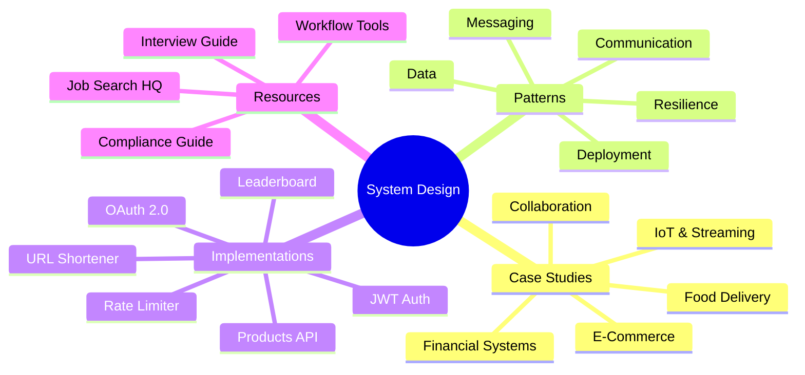
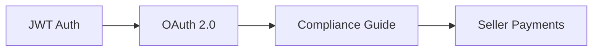
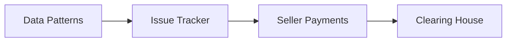
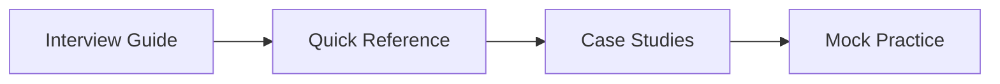

# System Design Knowledge Base

> A comprehensive collection of system design case studies, architectural patterns, production-grade implementations, and interview preparation resources.

---

## 📖 Glossary & Quick Navigation



---

## 🏗️ System Design Case Studies

### Financial Systems

| Topic | Description | Key Concepts | Links |
|-------|-------------|--------------|-------|
| **Financial Clearing House** | Interbank settlement system with multilateral netting achieving 93%+ efficiency | Graph algorithms, Two-phase settlement, Saga pattern | [📘 Overview](./financial-clearing-house/README.md) • [🏛️ Architecture](./financial-clearing-house/clearing-house-settlement-design.md) • [🔄 Flow](./financial-clearing-house/clearing-house-system-flow.md) |
| **Seller Payment System** | E-commerce seller payouts with configurable schedules and fee optimization | Exactly-once semantics, State machines, Idempotency | [📘 Overview](./seller-side-payment-system/README.md) • [🏛️ Architecture](./seller-side-payment-system/design/system-architecture.md) • [💾 Data Models](./seller-side-payment-system/design/data-models.md) |
| **Fintech Data Platform** | End-to-end data architecture with CDC, event streaming, and federated queries | CDC (Debezium), Kafka, HTAP, Data Lake | [📘 Overview](./fintech-data-platform/fintech-data-architecture.md) • [📊 E2E Diagram](./fintech-data-platform/e2e-system-diagram.md) |

### E-Commerce & Marketplace

| Topic | Description | Key Concepts | Links |
|-------|-------------|--------------|-------|
| **Merchandise Browsing** | Large-scale product discovery for 1M+ DAU with real-time trending | Popularity scoring, Flink streaming, Personalization | [📘 Overview](./merchandise-listing/ecommerce-browsing-system-design.md) • [📊 Diagrams](./merchandise-listing/diagrams/architecture-diagrams.md) |
| **Uber Cart System** | Multi-merchant cart with family accounts and offline-first behavior | CRDT sync, Multi-tenant, Event sourcing | [📘 Overview](./uber-cart-design/README.md) • [🏛️ Architecture](./uber-cart-design/architecture/system-overview.md) • [📱 API](./uber-cart-design/api-design/api-contracts.md) |
| **Issue Tracking System** | Multi-tenant Jira-like platform for 50M DAU with 10B issues | Row-level security, Elasticsearch, Tenant isolation | [📘 Overview](./issue-tracking-system/README.md) • [🏛️ Architecture](./issue-tracking-system/01-high-level-architecture.md) • [🔍 Search](./issue-tracking-system/05-search-infrastructure.md) |

### Food Delivery & Logistics

| Topic | Description | Key Concepts | Links |
|-------|-------------|--------------|-------|
| **Uber Eats Feed** | Restaurant feed with H3 spatial indexing handling 10K+ views/sec | H3 hexagonal grid, Geo-sharding, ML ranking | [📘 Overview](./uber-eats-feed-design/README.md) • [🗺️ Spatial Indexing](./uber-eats-feed-design/spatial-indexing.md) • [📊 Ranking](./uber-eats-feed-design/ranking-system.md) |

### Real-Time & Collaboration

| Topic | Description | Key Concepts | Links |
|-------|-------------|--------------|-------|
| **Collaborative Editor** | Google Docs-like editor with CRDTs for 100 concurrent editors | CRDT, WebSocket, Offline-first, Causal consistency | [📘 Overview](./collaborative-editor/README.md) • [🧬 CRDT Design](./collaborative-editor/docs/02-crdt-design.md) • [🔄 Sync Protocol](./collaborative-editor/docs/03-sync-protocol.md) |
| **Real-Time Leaderboard** | Gaming leaderboard for 100M users with global/regional rankings | Redis Sorted Sets, Kafka, WebSocket push | [📘 Overview](./leaderboard/README.md) • [🏛️ Architecture](./leaderboard/docs/architecture.md) • [📊 Redis Deep Dive](./leaderboard/docs/redis-deep-dive.md) |

### IoT & Streaming Systems

| Topic | Description | Key Concepts | Links |
|-------|-------------|--------------|-------|
| **Trucking Crash Detection** | Real-time crash detection for 1M vehicles with <30s notification | Stream processing, ML inference, IoT ingestion | [📘 Overview](./trucking-crash-detection/README.md) • [🏛️ Architecture](./trucking-crash-detection/system-architecture.md) • [🧠 ML Pipeline](./trucking-crash-detection/ml-pipeline.md) |

---

## 📐 Distributed System Patterns

> **[📚 Complete Pattern Reference](./distributed-system-architectural-patterns/README.md)** — Decision flowcharts, trade-off analysis, and implementation examples

### API & Communication Patterns

| Pattern | When to Use | Trade-offs | Link |
|---------|-------------|------------|------|
| **REST API** | Public APIs, CRUD operations | Simple ↔ Over/under-fetching | [📄 Docs](./distributed-system-architectural-patterns/01-api-communication-styles/rest-api.md) |
| **GraphQL** | Mobile apps, complex queries | Flexible ↔ Caching complexity | [📄 Docs](./distributed-system-architectural-patterns/01-api-communication-styles/graphql.md) |
| **gRPC** | Internal microservices, high performance | Fast ↔ Browser support | [📄 Docs](./distributed-system-architectural-patterns/01-api-communication-styles/grpc.md) |
| **WebSockets** | Real-time bidirectional | Low latency ↔ Connection overhead | [📄 Docs](./distributed-system-architectural-patterns/01-api-communication-styles/websockets.md) |

### Gateway & Routing Patterns

| Pattern | When to Use | Trade-offs | Link |
|---------|-------------|------------|------|
| **API Gateway** | Centralized entry point | Single entry ↔ SPOF risk | [📄 Docs](./distributed-system-architectural-patterns/02-api-gateway-patterns/api-gateway.md) |
| **Backend for Frontend** | Multi-platform clients | Optimized UX ↔ Code duplication | [📄 Docs](./distributed-system-architectural-patterns/02-api-gateway-patterns/backend-for-frontend.md) |
| **Aggregator** | Composite responses | Reduced round trips ↔ Complexity | [📄 Docs](./distributed-system-architectural-patterns/02-api-gateway-patterns/aggregator-pattern.md) |

### Resilience Patterns

| Pattern | When to Use | Trade-offs | Link |
|---------|-------------|------------|------|
| **Circuit Breaker** | Prevent cascading failures | Fail-fast ↔ Implementation complexity | [📄 Docs](./distributed-system-architectural-patterns/03-resilience-patterns/circuit-breaker.md) |
| **Retry with Backoff** | Handle transient failures | Reliability ↔ Thundering herd | [📄 Docs](./distributed-system-architectural-patterns/03-resilience-patterns/retry-with-backoff.md) |
| **Bulkhead** | Isolate resource pools | Fault isolation ↔ Resource underutilization | [📄 Docs](./distributed-system-architectural-patterns/03-resilience-patterns/bulkhead.md) |
| **Rate Limiting** | Traffic spike protection | System protection ↔ User experience | [📄 Docs](./distributed-system-architectural-patterns/03-resilience-patterns/rate-limiting.md) |
| **Timeout** | Prevent hung connections | Responsiveness ↔ False positives | [📄 Docs](./distributed-system-architectural-patterns/03-resilience-patterns/timeout-pattern.md) |

### Data Patterns

| Pattern | When to Use | Trade-offs | Link |
|---------|-------------|------------|------|
| **CQRS** | Separate read/write scaling | Performance ↔ Complexity | [📄 Docs](./distributed-system-architectural-patterns/04-data-patterns/cqrs.md) |
| **Event Sourcing** | Audit trails, temporal queries | Complete history ↔ Storage costs | [📄 Docs](./distributed-system-architectural-patterns/04-data-patterns/event-sourcing.md) |
| **Saga Pattern** | Distributed transactions | Eventual consistency ↔ Coordination | [📄 Docs](./distributed-system-architectural-patterns/04-data-patterns/saga-pattern.md) |
| **Outbox Pattern** | Reliable event publishing | Guaranteed delivery ↔ At-least-once | [📄 Docs](./distributed-system-architectural-patterns/04-data-patterns/outbox-pattern.md) |
| **Two-Phase Commit** | Strong consistency needed | ACID guarantees ↔ Availability | [📄 Docs](./distributed-system-architectural-patterns/04-data-patterns/two-phase-commit.md) |

### Messaging Patterns

| Pattern | When to Use | Trade-offs | Link |
|---------|-------------|------------|------|
| **Pub/Sub** | Fan-out notifications | Decoupling ↔ Message ordering | [📄 Docs](./distributed-system-architectural-patterns/05-messaging-patterns/pub-sub.md) |
| **Message Queue** | Work distribution | Reliability ↔ Latency | [📄 Docs](./distributed-system-architectural-patterns/05-messaging-patterns/message-queue.md) |
| **Event-Driven Architecture** | Reactive systems | Flexibility ↔ Debugging complexity | [📄 Docs](./distributed-system-architectural-patterns/05-messaging-patterns/event-driven-architecture.md) |

### Service Discovery & Mesh

| Pattern | When to Use | Trade-offs | Link |
|---------|-------------|------------|------|
| **Service Registry** | Dynamic service discovery | Flexibility ↔ Additional infrastructure | [📄 Docs](./distributed-system-architectural-patterns/06-service-discovery-mesh/service-registry.md) |
| **Sidecar** | Cross-cutting concerns | Separation of concerns ↔ Resource overhead | [📄 Docs](./distributed-system-architectural-patterns/06-service-discovery-mesh/sidecar-pattern.md) |
| **Service Mesh** | Complex microservices | Full observability ↔ Operational complexity | [📄 Docs](./distributed-system-architectural-patterns/06-service-discovery-mesh/service-mesh.md) |

### Deployment & Infrastructure

| Pattern | When to Use | Trade-offs | Link |
|---------|-------------|------------|------|
| **Blue-Green Deployment** | Zero-downtime releases | Instant rollback ↔ 2x infrastructure | [📄 Docs](./distributed-system-architectural-patterns/07-deployment-infrastructure-patterns/blue-green-deployment.md) |
| **Canary Deployment** | Gradual rollouts | Lower risk ↔ Complexity | [📄 Docs](./distributed-system-architectural-patterns/07-deployment-infrastructure-patterns/canary-deployment.md) |
| **Rolling Deployment** | Resource-efficient updates | Simple ↔ Slower rollback | [📄 Docs](./distributed-system-architectural-patterns/07-deployment-infrastructure-patterns/rolling-deployment.md) |
| **Feature Flags** | Runtime feature control | Flexibility ↔ Tech debt | [📄 Docs](./distributed-system-architectural-patterns/07-deployment-infrastructure-patterns/feature-flags.md) |
| **Strangler Fig** | Legacy migration | Incremental ↔ Longer timeline | [📄 Docs](./distributed-system-architectural-patterns/07-deployment-infrastructure-patterns/strangler-fig-pattern.md) |
| **Database Per Service** | Microservices data isolation | Autonomy ↔ Distributed complexity | [📄 Docs](./distributed-system-architectural-patterns/07-deployment-infrastructure-patterns/database-per-service.md) |

---

## 🔧 Production Implementations

### URL Shortener

> Full-stack URL shortener scaling from local to 500M URLs/month globally

| Tier | Scale | Architecture |
|------|-------|--------------|
| 1 | Local | SQLite + Single binary |
| 2 | Startup (100K/mo) | PostgreSQL + Redis |
| 3 | Growth (10M/mo) | Multi-instance + Replicas |
| 4 | Scale (100M/mo) | Multi-region + DynamoDB |
| 5 | Global (500M/mo) | Edge computing + Sharded |

**Stack:** Rust (Axum) • DynamoDB Global Tables • CloudFront • Terraform • Kubernetes

| Resource | Link |
|----------|------|
| **Rust Version** | [📘 README](./url-shortener/README.md) |
| **Java Version** | [📘 README](./url-shortener-java/README.md) |
| **Architecture** | [🏛️ Docs](./url-shortener/docs/03-architecture.md) |
| **Security & Compliance** | [🔒 GDPR/SOC2](./url-shortener/docs/05-security-compliance.md) |

### Distributed Rate Limiter

> High-performance rate limiter for API Gateway (100K-1M RPS)

**Features:** Sliding window counter • Composite keys (user + endpoint) • Fail-open/closed modes • Circuit breaker integration

**Stack:** Java 21 (Spring Boot) • Redis Cluster • Resilience4j • Prometheus

| Resource | Link |
|----------|------|
| **Overview** | [📘 README](./rate-limiter/README.md) |
| **Architecture** | [🏛️ Docs](./rate-limiter/docs/architecture.md) |
| **Algorithms** | [🧮 Docs](./rate-limiter/docs/algorithms.md) |

### Real-Time Leaderboard

> Gaming leaderboard for 100M users with 50M DAU, supporting global/regional/friend rankings

**Features:** O(log N) Redis Sorted Sets • WebSocket push notifications • Multiple time windows • Circuit breakers

**Stack:** Java 21 (Spring Boot) • Redis Cluster • Kafka • PostgreSQL • WebSocket

| Resource | Link |
|----------|------|
| **Overview** | [📘 README](./leaderboard/README.md) |
| **Architecture** | [🏛️ Docs](./leaderboard/docs/architecture.md) |
| **Redis Deep Dive** | [📊 Docs](./leaderboard/docs/redis-deep-dive.md) |
| **Demo Scripts** | [🎮 Scripts](./leaderboard/scripts/) |

### OAuth 2.0 Demo

> Complete OAuth 2.0 implementation with Authorization Server and Resource Server

**Features:** Authorization Code + PKCE • Client Credentials • Refresh Tokens • JWT with custom claims • PostgreSQL persistence

**Stack:** Java (Spring Boot 3.2) • Spring Authorization Server • Spring Security • PostgreSQL

| Resource | Link |
|----------|------|
| **Overview** | [📘 README](./oauth2-demo/README.md) |
| **Postman Collection** | [📬 Collection](./oauth2-demo/postman/) |

### JWT Authentication

> Simple JWT auth system with access/refresh tokens

**Features:** Token rotation • Secure refresh flow • Spring Security integration

**Stack:** Java (Spring Boot 3.2) • Spring Security • MySQL • jjwt

| Resource | Link |
|----------|------|
| **Overview** | [📘 README](./jwt-auth/README.md) |
| **Architecture** | [🏛️ Docs](./jwt-auth/docs/README.md) |
| **Postman Collection** | [📬 Collection](./jwt-auth/postman/) |

### Products API (Cassandra/ScyllaDB)

> RESTful CRUD API demonstrating Cassandra/ScyllaDB patterns

**Features:** CQL operations • Docker Compose setup • Seed data

**Stack:** Java (Spring Boot) • Apache Cassandra 4.1 • Docker

| Resource | Link |
|----------|------|
| **Overview** | [📘 README](./products-api/README.md) |

### Codec Library

> MySQL column type codecs with zero-copy decoding (Go)

**Features:** Text/Binary protocol • Temporal types with timezone • DECIMAL precision • database/sql helpers

| Resource | Link |
|----------|------|
| **Overview** | [📘 README](./codec-library/README.md) |
| **Source** | [📦 Go Package](./codec-library/codec/mysql/) |

---

## 🎓 Interview & Career Resources

### System Design Interview Guide

> **[📚 Complete Guide](./system-design-interview-guide/README.md)** — 12-part comprehensive preparation resource

| # | Topic | Description |
|---|-------|-------------|
| 01 | [Interview Framework](./system-design-interview-guide/01-interview-framework.md) | Step-by-step approach for any interview |
| 02 | [Requirements & Estimation](./system-design-interview-guide/02-requirements-estimation.md) | Capacity planning basics |
| 02a | [Back-of-Envelope (Detailed)](./system-design-interview-guide/02a-back-of-envelope-detailed.md) | Mental math tricks & calculations |
| 03 | [Core Building Blocks](./system-design-interview-guide/03-core-building-blocks.md) | DBs, caching, load balancers |
| 04 | [Scalability Patterns](./system-design-interview-guide/04-scalability-patterns.md) | Sharding, replication, scaling |
| 05 | [Distributed Concepts](./system-design-interview-guide/05-distributed-system-concepts.md) | CAP, consistency, consensus |
| 06 | [Data Storage](./system-design-interview-guide/06-data-storage-strategies.md) | SQL vs NoSQL, partitioning |
| 07 | [Caching Strategies](./system-design-interview-guide/07-caching-strategies.md) | Patterns, invalidation, CDNs |
| 08 | [Messaging & Async](./system-design-interview-guide/08-messaging-async-patterns.md) | Queues, event-driven |
| 09 | [API Design](./system-design-interview-guide/09-api-design-gateway.md) | REST, GraphQL, gRPC |
| 10 | [Observability](./system-design-interview-guide/10-observability-reliability.md) | Monitoring, fault tolerance |
| 11 | [Common Problems](./system-design-interview-guide/11-common-interview-problems.md) | URL shortener, chat, feed |
| 12 | [Quick Reference](./system-design-interview-guide/12-quick-reference-cheatsheet.md) | One-page cheatsheet |

### Job Search HQ

> Complete job search framework with trackers, templates, and guides

| Category | Topics | Link |
|----------|--------|------|
| **Resume** | Quantified achievements, LinkedIn optimization | [📄 Resume Guide](./job-search/resume/resume-master.md) |
| **Behavioral** | STAR stories, EM philosophy | [📄 STAR Bank](./job-search/behavioral/star-stories-bank.md) |
| **System Design** | Quick reference sheets | [📄 Cheat Sheets](./job-search/system-design/quick-reference-sheets.md) |
| **LLD** | Patterns, problem bank | [📄 LLD Guide](./job-search/lld/lld-patterns-guide.md) |
| **Coding** | Pattern-based approach | [📄 Coding Patterns](./job-search/coding/coding-patterns-guide.md) |
| **Negotiation** | Compensation strategy | [📄 Negotiation](./job-search/negotiation/negotiation-guide.md) |
| **Tracker** | Company research template | [📄 Tracker](./job-search/tracker/company-tracker.md) |

**[📚 Full Job Search Guide](./job-search/README.md)**

### Interview Experiences

| Company | Type | Link |
|---------|------|------|
| Agoda | System Design + LLD | [📁 Folder](./interview_experiences/agoda/) |
| Kuvera | System Design | [📁 Folder](./interview_experiences/kuvera/) |
| Fintech Org | Architecture Review | [📁 Folder](./interview_experiences/fintech_org/) |

---

## 📋 Compliance & Regulations

### Global Financial Compliance Guide

> **[📚 Complete Guide](./compliances/FINANCIAL_COMPLIANCE_GUIDE.md)** — 42 compliance frameworks across 6 regions

Comprehensive reference covering:

| Region | Key Regulations |
|--------|-----------------|
| **Global** | Basel III/IV, FATF, PCI DSS, ISO 27001 |
| **North America** | SOX, GLBA, BSA/AML, Dodd-Frank, CCPA, NYDFS |
| **Europe** | GDPR, PSD2/PSD3, MiFID II, DORA, AMLD 5/6 |
| **Asia Pacific** | RBI Master Directions, DPDP Act, PIPL, MAS TRM, CPS 234 |
| **Middle East** | CBUAE, SAMA Cybersecurity, PDPL |
| **Latin America** | LGPD, BCB Resolution 4893 |
| **Africa** | POPIA, SARB, NDPR |

---

## 🛠️ Tools & Workflow

### Apache Airflow

> Workflow orchestration with practical DAG examples

**Use Cases:** ETL pipelines • ML orchestration • Data quality • Report generation

| Resource | Link |
|----------|------|
| **Getting Started** | [📘 README](./apache-airflow/README.md) |
| **Core Concepts** | [📄 Concepts](./apache-airflow/docs/core-concepts.md) |
| **Best Practices** | [📄 Guide](./apache-airflow/docs/best-practices.md) |
| **Example DAGs** | [📦 dags/](./apache-airflow/dags/) |

---

## 🗺️ Learning Paths

### Path 1: System Design Fundamentals


1. **Foundation:** [System Design Interview Guide](./system-design-interview-guide/README.md)
2. **Patterns:** [Distributed Patterns](./distributed-system-architectural-patterns/README.md)
3. **Build:** [URL Shortener](./url-shortener/README.md)
4. **Scale:** [Rate Limiter](./rate-limiter/README.md)
5. **Real-time:** [Leaderboard](./leaderboard/README.md)

### Path 2: Authentication & Security



1. **Basics:** [JWT Authentication](./jwt-auth/README.md)
2. **OAuth:** [OAuth 2.0 Demo](./oauth2-demo/README.md)
3. **Compliance:** [Financial Compliance Guide](./compliances/FINANCIAL_COMPLIANCE_GUIDE.md)
4. **Apply:** [Seller Payment System](./seller-side-payment-system/README.md)

### Path 3: Real-Time Systems


1. **Foundation:** [Messaging Patterns](./distributed-system-architectural-patterns/05-messaging-patterns/)
2. **Collaboration:** [Collaborative Editor](./collaborative-editor/README.md)
3. **Geo-Spatial:** [Uber Eats Feed](./uber-eats-feed-design/README.md)
4. **IoT Streaming:** [Crash Detection](./trucking-crash-detection/README.md)

### Path 4: Multi-Tenant Systems



1. **Patterns:** [Data Patterns](./distributed-system-architectural-patterns/04-data-patterns/)
2. **Multi-Tenant:** [Issue Tracking System](./issue-tracking-system/README.md)
3. **Payments:** [Seller Payment System](./seller-side-payment-system/README.md)
4. **Finance:** [Clearing House](./financial-clearing-house/README.md)

### Path 5: Interview Preparation



1. **Guide:** [Interview Framework](./system-design-interview-guide/01-interview-framework.md)
2. **Reference:** [Cheatsheet](./system-design-interview-guide/12-quick-reference-cheatsheet.md)
3. **Study:** Any case study from above
4. **Review:** [Interview Experiences](./interview_experiences/)

---

## 📊 Pattern Cross-Reference

| Pattern | Used In |
|---------|---------|
| Event Sourcing / CDC | Fintech Data Platform, E-Commerce, Collaborative Editor |
| CQRS | E-Commerce, Uber Eats Feed, Issue Tracking |
| Saga Pattern | Financial Clearing House, Seller Payments |
| Exactly-Once Semantics | Clearing House, Seller Payments, Leaderboard |
| CRDT | Collaborative Editor |
| Redis Sorted Sets | Leaderboard, Rate Limiter |
| Batch + Real-time (Lambda) | E-Commerce, Crash Detection |
| H3 Spatial Indexing | Uber Eats Feed |
| Circuit Breaker | Rate Limiter, Seller Payments, Leaderboard |
| Multi-Tenancy (RLS) | Issue Tracking System |
| WebSocket | Collaborative Editor, Leaderboard |
| OAuth 2.0 / JWT | OAuth 2.0 Demo, JWT Auth |
| Sharding / Partitioning | All case studies |

---

## 🚀 Quick Start

### Run OAuth 2.0 Demo

```bash
cd oauth2-demo && ./run.sh
# Auth Server: http://localhost:9001
# Resource Server: http://localhost:8080
```

### Run Leaderboard Demo

```bash
cd leaderboard
docker-compose up -d redis zookeeper kafka postgres
./mvnw spring-boot:run
./scripts/demo-data.sh
```

### Run Financial Clearing House Demo

```bash
# Python
cd financial-clearing-house/src/python && python3 demo.py

# Java
cd financial-clearing-house
mkdir -p target && find src/java -name "*.java" | xargs javac -d target
java -cp target com.clearinghouse.SettlementApp
```

### Run URL Shortener

```bash
cd url-shortener && docker-compose up -d
# API available at http://localhost:8080
```

### Run Rate Limiter

```bash
cd rate-limiter && docker-compose up -d redis && ./mvnw spring-boot:run
```

### Run JWT Auth

```bash
cd jwt-auth && docker-compose up -d --build
# API available at http://localhost:8080
```

### Run Products API (Cassandra)

```bash
cd products-api && docker-compose up -d --build
# API available at http://localhost:8080
```

### Run Airflow Examples

```bash
cd apache-airflow && docker-compose up -d
# UI at http://localhost:8080 (admin/admin)
```

---

## 📝 License

MIT — See [LICENSE](./LICENSE) for details.

---

<p align="center">
  <i>Built for engineers who want depth over breadth in system design.</i>
</p>
