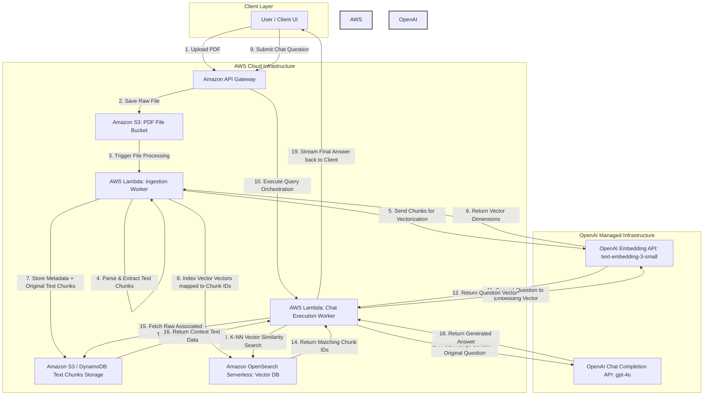

# RAG Architecture Diagram

Create an architecture diagram:
Cloud architecture for a service that can take PDF files and allow users to have AI chat sessions regarding the content of the PDF files.

- Vectorize the PDF files using OpenAI's Embedding API
- Store them on a cloud vector database
- store the text chunks in a separate storage.

During a chat session, when a user asks a question
- turn the question in to a vector using OpenAI's embedding API
- query the vector database
- Use query result vectors to retrieve the associated text chunks.
- Query OpenAI's chat API with the retrieved text chunks and the original user question
- Return results from OpenAI's chat API to the user. Use AWS and OpenAI infrastructure where applicable.

