# Amazon 16 Leadership Principles — SDM Interview Stories
**Persona**: Arjun Mehta | Senior Engineering Manager | Amazon Now India (Instant Grocery Delivery)

## Career Arc

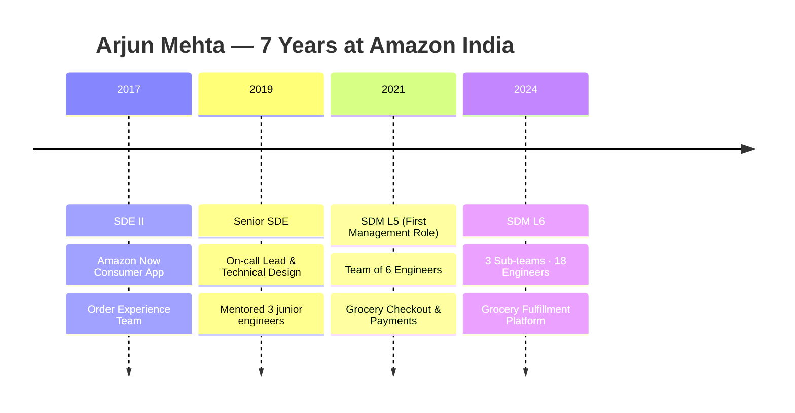

---

## 1. Customer Obsession

> Leaders start with the customer and work backwards. They work vigorously to earn and keep customer trust. Although leaders pay attention to competitors, they obsess over customers.

### STAR Story — "The Invisible Drop-off"

**Situation**: In 2022, Amazon Now India was growing rapidly in Tier 1 cities. Arjun's team owned the order placement funnel. During a routine metrics review, he noticed the cart-to-order conversion rate had been quietly declining — from 68% to 61% over 8 weeks. No alerts had fired because no single week was a dramatic drop.

**Task**: Identify the root cause and recover conversion without compromising the delivery promise Amazon Now had built its brand on.

**Action**: Arjun personally pulled session replay data and customer contact transcripts — something the team hadn't done systematically. He found a pattern: 73% of the abandonment happened the moment the app displayed a delivery estimate above 30 minutes. Further interviews revealed customers had a mental threshold — "under 30 minutes = fresh, above = might as well order from somewhere else." He drove a cross-functional war room with the logistics, dark store, and app teams. He proposed showing a confidence-adjusted estimate (showing the best-case P25 time with a note) instead of the P90 pessimistic time the system was defaulting to after a routing engine update 9 weeks ago.

**Result**: Within 3 weeks of the fix, cart-to-order conversion recovered to 67%. The routing engine's P90 default was identified as the actual bug — a parameter change that had gone unreviewed. Arjun instituted a funnel health review as a standing agenda item in every sprint review.

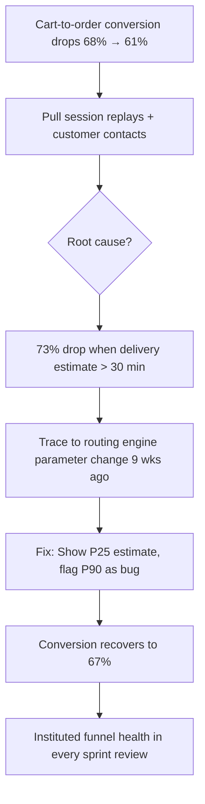

---

## 2. Ownership

> Leaders are owners. They think long term and don't sacrifice long-term value for short-term results. They act on behalf of the entire company, beyond just their own team. They never say "that's not my job."

### STAR Story — "Diwali at 2 AM"

**Situation**: On Diwali eve 2022 — Amazon Now India's single highest-demand night of the year — the order placement success rate dropped to 34% at 9 PM. Arjun's team owned the checkout service. The immediate error logs pointed to the payments gateway, which was owned by a completely separate team in a different org.

**Task**: The payments team was unreachable (it was a holiday). Arjun had no direct authority over their systems and no on-call access to their runbooks.

**Action**: Rather than filing a ticket and waiting, Arjun escalated directly to the VP of Engineering via phone — something he'd never done — framing it as a customer impact issue, not a team issue. Simultaneously, he pulled his own team's senior SDE to analyze the payment gateway's public error codes. They identified that the gateway was rejecting UPI transactions over ₹500 due to an undeployed config change from that afternoon. Arjun located the payments team's on-call rotation in the internal directory, called the engineer directly, and walked them through the fix. Service restored at 2:14 AM — 73 minutes after the incident.

**Result**: ~12,000 orders were recovered in the next two hours. Arjun authored a post-mortem that included a recommendation for cross-team on-call coverage during peak events. That recommendation became a company-wide policy for the India org.

```mermaid
timeline
    title Diwali Incident — Ownership Beyond Boundaries
    21:00 : Payments success rate drops to 34%
           : Payments team unreachable (holiday)
    21:15 : Arjun escalates to VP of Engineering
           : Team begins analyzing payment error codes
    22:30 : Root cause identified — UPI config not deployed
           : Tracked down payments on-call engineer
    02:14 : Service restored · 73 min incident
    02:15 : Post-mortem authored
           : Cross-team peak on-call policy proposed → adopted org-wide
```

---

## 3. Invent and Simplify

> Leaders expect and require innovation and invention from their teams and always find ways to simplify. They are externally aware, look for new ideas from everywhere, and are not limited by "not invented here." As we do new things, we accept that we may be misunderstood for long periods of time.

### STAR Story — "The 1-Tap Reorder"

**Situation**: In 2023, Arjun noticed that 40% of Amazon Now orders in India were repeat baskets — customers buying the same 8–12 grocery items they bought the week before. The checkout flow required 6 steps and 3 confirmation taps regardless of order type. The engineering team's instinct was to build a "saved cart" feature (similar to existing wishlist infrastructure).

**Task**: Arjun challenged the team to look at the problem differently — not "how do we speed up the existing flow" but "what if the flow didn't exist for repeat customers?"

**Action**: He ran a design sprint where he brought in a customer research analyst and a dark store ops manager alongside engineers. The insight from ops was that repeat baskets had a predictable freshness window — a customer who bought milk and vegetables weekly always bought them within a 36-hour window of their last purchase. Arjun proposed "Freshness Reorder" — a widget on the home screen that detected the pattern and offered a single-tap reorder if the user was within their predictable window. The team built an ML-light heuristic (no heavy model needed) using purchase cadence data already in the system. Total engineering effort: 3 weeks.

**Result**: 1-tap reorder was adopted by 31% of repeat customers within 60 days of launch. Average checkout time for these customers dropped from 4.2 minutes to 18 seconds. The feature was later adapted by Amazon Fresh in two other countries.

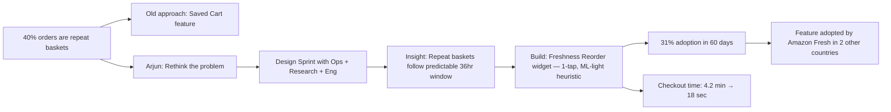

---

## 4. Are Right, A Lot

> Leaders are right a lot. They have strong judgment and good instincts. They seek diverse perspectives and work to disconfirm their beliefs.

### STAR Story — "Don't Expand, Fix First"

**Situation**: In mid-2023, Amazon Now India's leadership proposed an aggressive expansion plan — launching in 8 new Tier 2 cities in Q3. Arjun's platform team would own the fulfillment infrastructure for these cities. The business team had a strong market share thesis backed by competitor activity data.

**Task**: Arjun had a strong intuition that the existing infrastructure in Tier 1 cities had unresolved fragility — specifically around inventory sync latency between dark stores and the ordering system — that would be amplified in new markets with less reliable connectivity. He needed to either validate or disconfirm this before committing his team.

**Action**: Arjun ran a structured data pull: he mapped the 15 most-impacted customer contacts per week in existing Tier 1 cities back to their root cause. 61% traced to stale inventory data — customers ordering items that were actually out of stock. He then modeled what this failure rate would look like in Tier 2 cities (higher latency, smaller dark store staff). He presented a counter-proposal to leadership: fix inventory sync (estimated 6-week project) first, then expand — rather than in parallel. He invited the head of supply chain to review his analysis.

**Result**: Leadership agreed to delay the Tier 2 launch by 6 weeks. The inventory sync fix was delivered in 5 weeks. Post-fix, "item unavailable after order" contacts dropped by 58% in Tier 1. The Tier 2 launch ultimately had a 22% better NPS at 90 days compared to previous city launches.

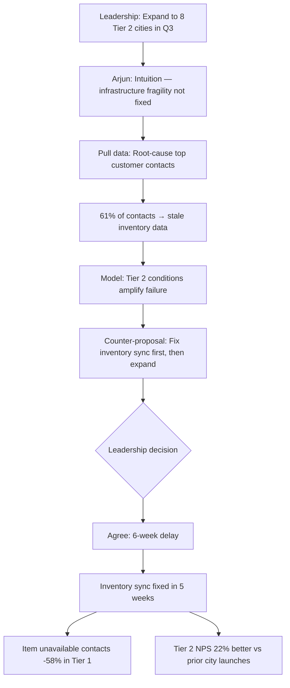

---

## 5. Learn and Be Curious

> Leaders are never done learning and always seek to improve themselves. They are curious about new possibilities and act to explore them.

### STAR Story — "The Demand Forecasting Detour"

**Situation**: In 2022, Amazon Now India's dark stores were consistently over-stocking perishables on weekends, leading to ~18% weekly wastage by value — a significant COGS problem. The existing demand forecasting model was a rules-based system built 3 years earlier. Arjun had no ML background.

**Task**: As the engineering manager for the fulfillment platform, Arjun felt responsible even though the data science team owned the model. He wanted to meaningfully contribute to the solution, not just file requirements at a team that already had a backlog.

**Action**: Arjun spent 6 weeks studying time-series forecasting on his own — reading papers, taking a fast.ai course in the evenings, and sitting in on the data science team's model review sessions uninvited (then invited after the second session). He identified a specific gap: the existing model didn't account for local festival calendars (Onam, Navratri, regional holidays vary hugely across India). He partnered with the data science team to propose enriching the feature set with a regional holiday signal. He didn't build the model — he built the business case, got it prioritized, and owned the data pipeline that fed the new feature.

**Result**: The updated model reduced weekend perishable wastage from 18% to 11% within 2 inventory cycles. Arjun's cross-functional credibility with the data science team opened a lasting collaboration model between platform engineering and ML teams.

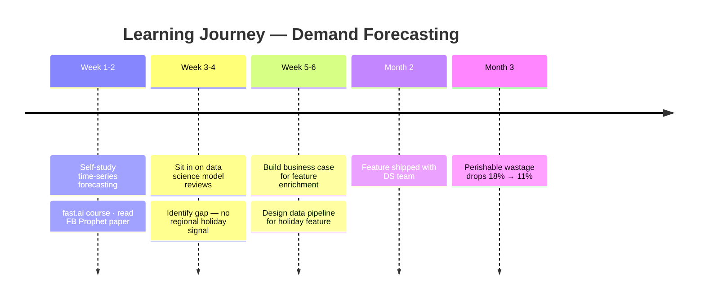

---

## 6. Hire and Develop the Best

> Leaders raise the performance bar with every hire and promotion. They recognize exceptional talent, and willingly move them throughout the organization. Leaders develop leaders and take seriously their role in coaching others.

### STAR Story — "From On-call Panic to Tech Lead"

**Situation**: When Arjun became SDM in 2021, he inherited a team of 6 engineers. One of them — Priya — was a junior SDE who had joined 8 months earlier. She was technically strong but visibly lacked confidence: she rarely spoke in design reviews, and her first solo on-call shift ended with her escalating every single page to the senior SDE.

**Task**: Arjun believed Priya had the raw capability to become a tech lead within 2 years if developed intentionally. He wanted to do this without creating a dependency or a "teacher's pet" dynamic on the team.

**Action**: Arjun restructured the on-call rotation so Priya was always paired with different senior engineers — not the same person — to broaden her exposure. He introduced a "design brief" practice: before each sprint, the team member most junior to the feature area had to write a 1-page design brief for others to critique. This made Priya the author, not the recipient, of technical decisions. Arjun also gave her two skip-level 1:1s with the senior SDM to develop her organizational awareness. He calibrated her performance narratives carefully during review cycles, advocating strongly when her impact was undersold by teammates.

**Result**: Priya was promoted to SDE II in 18 months and became the team's informal tech lead for the inventory sync project — the same project that fixed the Tier 1 city reliability issues. She is now being tracked for senior SDE.

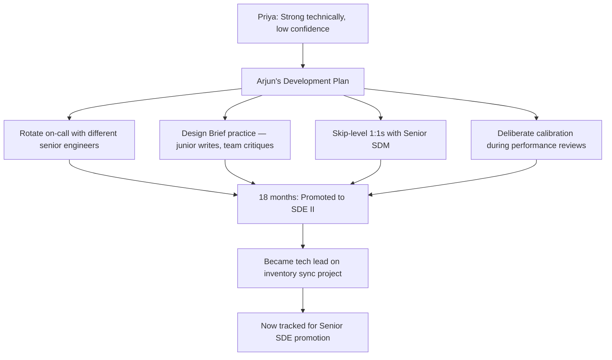

---

## 7. Insist on the Highest Standards

> Leaders have relentlessly high standards — many people may think these standards are unreasonably high. Leaders are continually raising the bar and drive their teams to deliver high quality products, services, and processes. Leaders ensure that defects do not get sent down the line and that problems are fixed so they can stay fixed.

### STAR Story — "The 'Good Enough' Release"

**Situation**: In Q4 2022, Arjun's team was building the new "Scheduled Delivery" feature for Amazon Now India — allowing customers to book a delivery slot up to 48 hours ahead. Launch was tied to a marketing campaign. Two days before release, QA flagged that the feature showed incorrect slot availability 12% of the time when a customer's location was near a dark store boundary (overlap zone between two stores).

**Task**: Product and marketing were pushing to ship on schedule. The bug affected a minority of customers, and the team had a workaround (suppress slot booking for boundary-zone customers, a 4% user population). Arjun had to decide whether to ship.

**Action**: Arjun rejected the ship-with-workaround approach. His reasoning: the 12% error rate for boundary-zone customers would be the exact customers most likely to retry and contact support — creating a disproportionate trust damage. He called a team session to re-scope the fix. The engineers identified that the slot calculation algorithm was using a store-lookup by pin code (coarse) rather than geolocation (precise). A precise fix was possible in 48 hours — but it meant a delayed launch. Arjun made the call, communicated clearly to product and marketing with data, and held the date.

**Result**: Launch was delayed by 3 days. Post-launch, slot availability accuracy was 99.3%. The feature became one of the highest-rated on the app (4.7/5 in the feature survey). Arjun shared a "Highest Standards" post-mortem with his team — not about the delay, but about why the workaround would have compounded into a bigger problem.

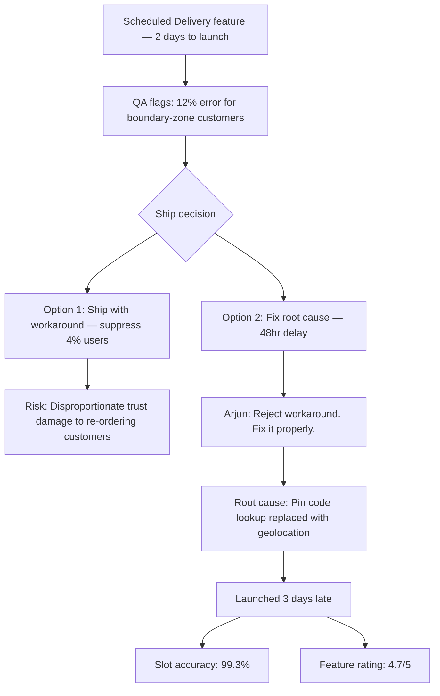

---

## 8. Think Big

> Thinking small is a self-fulfilling prophecy. Leaders create and communicate a bold direction that inspires results. They think differently and look around corners for ways to serve customers better.

### STAR Story — "The Dark Store Network, Reimagined"

**Situation**: By 2023, Amazon Now India had 40+ dark stores across 6 cities. Each store operated as an island — inventory decisions, staffing, and routing were all local. Arjun noticed that during city-wide demand spikes (cricket match nights, monsoon onset), some dark stores were overwhelmed while stores 8–10 km away were idle. Customers were getting 45+ minute delivery estimates in high-demand areas.

**Task**: Arjun's team owned fulfillment platform infrastructure. The dark store operations were owned by a separate supply chain org. He had no mandate to redesign the store network — but he saw the customer and cost opportunity.

**Action**: Arjun wrote a 6-page PR/FAQ (Amazon's standard for new ideas) proposing a "Federated Fulfillment" model: allow orders to be dynamically routed to any dark store within a 15 km radius based on real-time inventory and capacity signals, not just the nearest store. He benchmarked against how food delivery platforms handled multi-restaurant order routing. He estimated a 23% reduction in P90 delivery time and a 15% improvement in dark store utilization. He presented it at a Principal Engineers' forum, not just to his own management chain.

**Result**: The proposal was adopted as a funded initiative for 2024. Arjun was asked to co-lead it with the supply chain VP. Pilot results across 3 cities showed a 19% reduction in P90 delivery time — within range of the estimate. The initiative became a cornerstone of the India fulfillment roadmap.

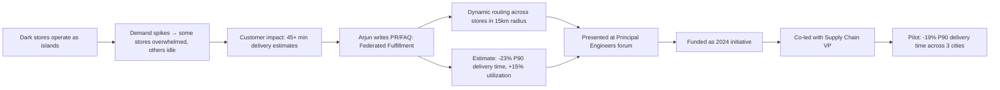

---

## 9. Bias for Action

> Speed matters in business. Many decisions and actions are reversible and do not need extensive study. We value calculated risk taking.

### STAR Story — "Roll It Back Now"

**Situation**: In November 2023, Arjun's team shipped a performance optimization to the order confirmation service — a caching layer intended to reduce DB read load by 60%. Deployment went smoothly. Six hours later, a data analyst pinged Arjun on Slack: repeat order rates looked anomalously low — a 40% drop in a metric that was usually very stable.

**Task**: The caching change was the prime suspect, but there was no direct error. The service was healthy by all operational metrics. The team wanted to spend 48 hours in analysis before acting. Arjun had to decide: investigate in place, or roll back immediately.

**Action**: Arjun made the call in 20 minutes: roll back. His reasoning was explicit — the change was fully reversible, the metric anomaly was severe and customer-facing, and the cost of a false negative (leaving a broken cache in place) was higher than the cost of a false positive (unnecessary rollback). He didn't wait for a root cause. Rollback was completed in 35 minutes. The team then spent 2 days investigating safely in a staging environment and found the cache was serving stale "already reordered" flags — suppressing the reorder prompt for customers who hadn't actually reordered.

**Result**: The metric recovered within 2 hours of rollback. The fix was re-deployed with proper cache invalidation logic 4 days later with zero recurrence. Arjun documented the decision framework — "reversible + severe customer signal = act first, analyze second" — which became a team norm.

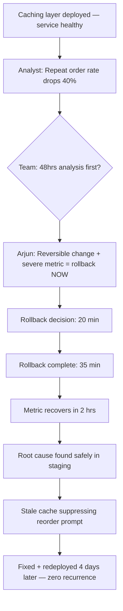

---

## 10. Frugality

> Accomplish more with less. Constraints breed resourcefulness, self-sufficiency, and invention. There are no extra points for growing headcount, budget, or fixed expense.

### STAR Story — "The AWS Bill That Woke Us Up"

**Situation**: In Q1 2023, Arjun's fulfillment platform team received a quarterly infrastructure cost review showing AWS spend had grown 67% YoY — significantly outpacing order volume growth (which was 38%). The gap had gone unnoticed because no team owned the cost-per-order metric explicitly.

**Task**: Arjun self-assigned cost ownership to his team, even though FinOps was technically a shared function. He committed to reducing AWS spend by 30% within one quarter without impacting system reliability or team velocity.

**Action**: He ran a structured "cost archaeology" sprint — two engineers dedicated for 2 weeks to instrument every service call with cost attribution. They found three major sources: (1) over-provisioned EC2 instances running at 12% average CPU utilization, (2) an audit logging pipeline writing to S3 every 5 seconds (vs. the required 60-second SLA), and (3) a geocoding API call being made per order item rather than per order. Arjun right-sized EC2, changed the logging flush interval, and batched the geocoding calls. No new infrastructure was purchased.

**Result**: AWS spend dropped 41% in one quarter — exceeding the 30% target. Cost-per-order became a permanent metric on the team's operational dashboard. The audit logging fix alone saved ~$180K annualized. Arjun shared the methodology at an internal India engineering all-hands.

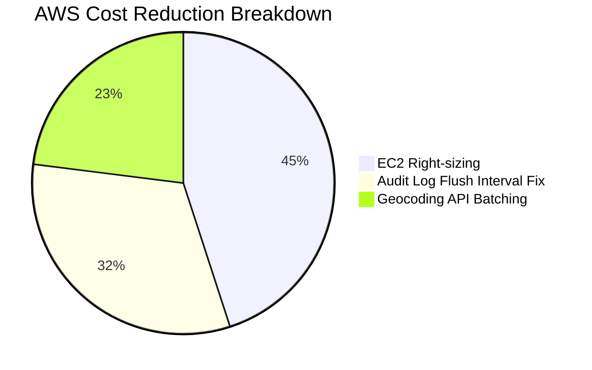

---

## 11. Earn Trust

> Leaders listen attentively, speak candidly, and treat others respectfully. They are vocally self-critical, even when it is painful or embarrassing. Leaders do not believe their or their team's body odor smells of perfume. They benchmark themselves and their teams against the best.

### STAR Story — "The Partner Team That Didn't Trust Us"

**Situation**: In 2022, Arjun's team needed to integrate with the Amazon Pay team (based in Bangalore) to support UPI AutoPay for subscriptions in Amazon Now. The Pay team had a history of a painful integration with a previous version of Arjun's team — a missed SLA had caused a major rollout delay a year earlier.

**Task**: The Pay team's lead architect was openly skeptical in the first kickoff meeting — he proposed a "minimal integration" approach that would limit Amazon Now's capabilities significantly, citing risk. Arjun needed to build trust without defensiveness.

**Action**: In the first week, Arjun did something counterintuitive: he asked the Pay team lead to walk him through what exactly had gone wrong in the previous integration — and listened without interrupting or defending his team. He then shared a candid post-mortem of his own team's failures in that project, even though the prior team pre-dated his tenure. He proposed a weekly sync with a shared incident tracker (visible to both teams), and committed to a 48-hour SLA on any API contract question. He never missed a sync for 14 weeks.

**Result**: By week 6, the Pay team lead proactively expanded the integration scope — offering capabilities he had initially withheld. The UPI AutoPay integration launched on schedule. The Pay team lead mentioned Arjun by name in a cross-org update as a "model integration partner." The shared incident tracker approach was later formalized as a standard for cross-org integrations.

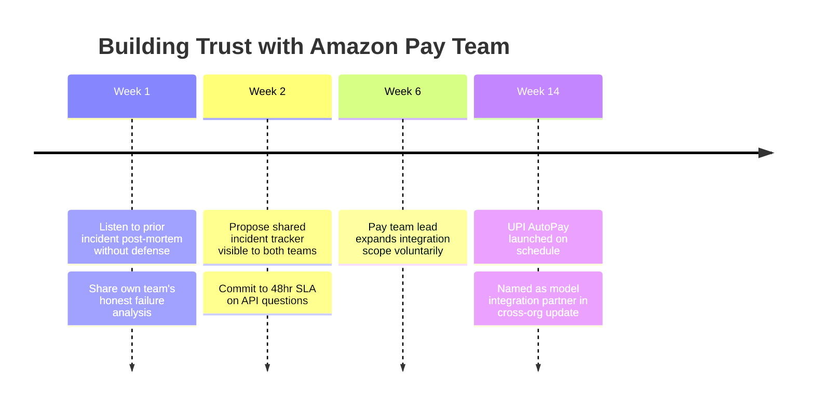

---

## 12. Dive Deep

> Leaders operate at all levels, stay connected to the details, audit frequently, and are skeptical when metrics and anecdotes don't match. No task is beneath them.

### STAR Story — "The Silent Data Rot"

**Situation**: In early 2023, Amazon Now India's delivery completion rate (orders successfully delivered / orders placed) was reporting at 97.2% — within target. Customer contacts about "order not received" were at 2.1% — also within target. However, Arjun noticed in a quarterly business review that refund rates were trending up (4.1% → 5.8% over 3 months) while both headline metrics looked healthy.

**Task**: Something didn't add up. Arjun decided to personally investigate the discrepancy rather than assign it to an analyst.

**Action**: Arjun spent three full evenings over two weeks pulling raw event logs himself — something he hadn't done since his SDE days. He traced the data pipeline for delivery completion: an order was marked "delivered" when the delivery partner app sent a delivery confirmation event. He found that the delivery partner app had a known offline mode — in low-connectivity areas, it queued events and sent them in bulk when connectivity resumed, sometimes 4–6 hours later. The system was marking orders "delivered" on receipt of the queued event — even if a customer had already reported non-delivery and received a refund. The delivery completion metric was double-counting successful events for already-refunded orders.

**Result**: The metric calculation was fixed to exclude refunded orders from the "delivered" denominator. True delivery completion rate was actually 94.6% — a significant gap from the reported 97.2%. This triggered a root-cause initiative on connectivity in Tier 2 city delivery routes, which ultimately reduced true non-delivery by 31% over two quarters.

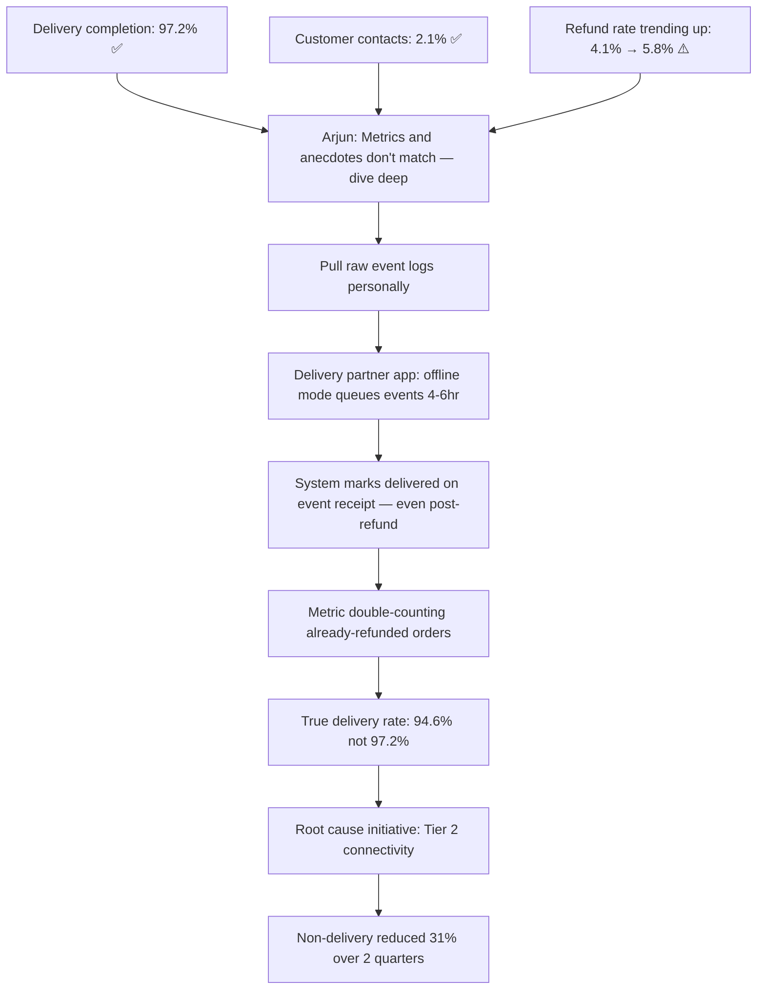

---

## 13. Have Backbone; Disagree and Commit

> Leaders are obligated to respectfully challenge decisions when they disagree, even when doing so is uncomfortable or exhausting. Leaders have conviction and are tenacious. They do not compromise for the sake of social cohesion. Once a decision is determined, they commit wholly.

### STAR Story — "The Feature I Voted Against"

**Situation**: In Q2 2023, Amazon Now India's product leadership proposed a "Surprise Bag" feature — customers could buy a discounted mystery bag of near-expiry perishables to reduce food waste. Arjun's team would build it. In the planning review, Arjun raised a concern: the feature required real-time perishable inventory visibility at the item level — infrastructure his team had flagged as unreliable (the inventory sync project was still 6 weeks from completion).

**Task**: Leadership wanted to commit to a launch in the same quarter. Arjun had to decide whether to escalate his objection formally or defer to leadership.

**Action**: Arjun requested 15 minutes at the end of the planning meeting and made his case clearly: the inventory sync fix was the dependency, the risk was a bad customer experience if the feature launched with stale inventory (customers getting bags with wrong items), and he recommended a 6-week delay. He brought data — the 61% stale inventory contact rate from his earlier analysis. Leadership heard the case, debated for 20 minutes, and decided to proceed on schedule — with a manual fallback: dark store managers would curate bags manually until the sync was fixed. Arjun disagreed with the decision but committed fully. He assigned his best engineer to the manual fallback tooling, delivered it in 2 weeks, and never surfaced his objection again to the team.

**Result**: Surprise Bag launched on schedule. The manual fallback worked — 91% of bags had correct items. When the sync fix shipped 6 weeks later, the feature shifted to fully automated inventory. Customer satisfaction with Surprise Bag was 4.5/5. Arjun's team was credited with a reliable launch despite a constrained timeline.

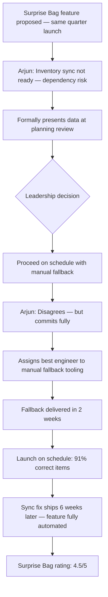

---

## 14. Deliver Results

> Leaders focus on the key inputs for their business and deliver them with the right quality and on the right timeline. Despite setbacks, they rise to the occasion and never settle.

### STAR Story — "Two Engineers Down, One Quarter to Go"

**Situation**: In September 2023, Arjun's team was mid-way through delivering the Federated Fulfillment initiative — the most complex project his team had owned. In week 6 of a 14-week project, one engineer went on medical leave and another accepted an internal transfer. The team was now 4 people for a project scoped for 6.

**Task**: The initiative had a committed Q3 delivery date tied to the India fulfillment strategy. Missing it would delay the 2024 city expansion plan. Arjun needed to deliver with a 33% reduced team.

**Action**: Arjun immediately did a scope triage — not with product, but with his engineering team first. He identified what was truly P0 for the launch (real-time store routing), what was P1 (reporting dashboard), and what could be cut entirely (admin tooling for operations teams). He negotiated with product to de-scope the admin tooling (replacing it temporarily with a manual CSV-based process). He also secured a 3-week loan of one engineer from a neighboring team by framing it as a mutual dependency (that team needed the routing APIs Arjun's team was building). He re-sequenced work so the critical path items had the two strongest engineers on them.

**Result**: The initiative delivered on time — 100% of the P0 scope, 80% of P1. The temporary CSV process for ops worked adequately for 8 weeks until the admin tooling was built in the next quarter. The pilot results were strong enough to unlock the 2024 city expansion budget.

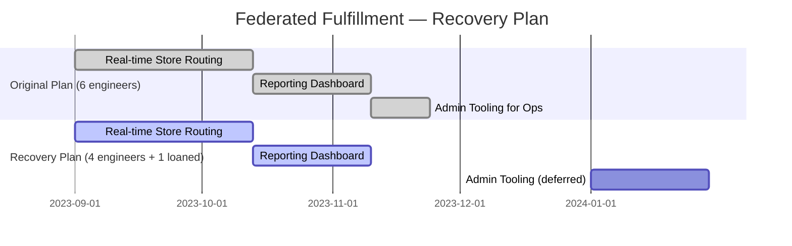

---

## 15. Strive to be Earth's Best Employer

> Leaders work every day to create a safer, more productive, higher performing, more diverse, and more just work environment. They lead with empathy, have fun at work, and make it easy for others to have fun. Leaders ask themselves: Are my fellow employees growing? Are they empowered? Are they ready for what's next?

### STAR Story — "The Attrition Wake-Up Call"

**Situation**: In 2022, Arjun's team had 40% annual attrition — two engineers left in a 6-month window. Exit interviews were brief and inconclusive ("better opportunity"). When Arjun looked more carefully, both engineers had similar feedback in their last performance reviews: they felt they were always in reactive mode, never shipping things they were proud of, and rarely heard from Arjun directly about their growth.

**Task**: Arjun recognized the attrition was a symptom of a management failure, not a market condition. He committed to reducing it — without adding headcount or changing compensation (both outside his control).

**Action**: He introduced three structural changes: (1) **10% Innovation Time** — every engineer could spend half a day per week on any improvement idea, no approval needed, presented at a monthly "Demo Friday." (2) **Career roadmap 1:1s** — once a quarter, 1:1s shifted from status to a dedicated 30-minute career conversation using a shared template Arjun designed. (3) **Shielding** — Arjun took on all stakeholder escalations himself for 3 months to reduce the team's interrupt load, until he built a rotation. He also started sharing his own mistakes openly in team retrospectives.

**Result**: In the 18 months following these changes, zero voluntary attrition. Engagement scores in the team's internal survey went from 3.2/5 to 4.4/5. Two engineers explicitly mentioned "I was about to leave but these changes made me stay" in their next career conversations. Demo Friday became a standing event other teams started attending.

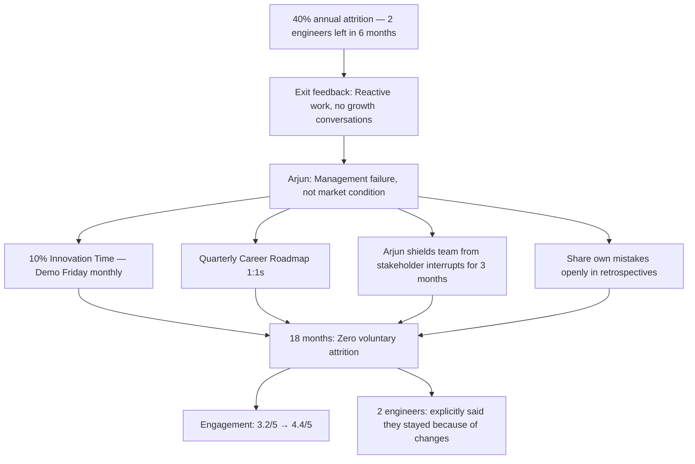

---

## 16. Success and Scale Bring Broad Responsibility

> We started in a garage, but we're not there anymore. We are big, we influence the world, and we have an obligation to act responsibly. The communities we operate in are critical to our success and we must be good stewards of the environment and the communities in which we work and live.

### STAR Story — "The Plastic Problem Nobody Owned"

**Situation**: In 2023, as Amazon Now India's order volumes scaled past 200,000 daily orders, Arjun began receiving internal feedback from a sustainability working group: packaging waste per order had grown 34% in two years — largely driven by the multi-bag approach used to maintain temperature separation for cold and ambient items. No engineering team had been formally asked to address this.

**Task**: Arjun's team had no mandate — but he felt the scale of Amazon Now's operations meant his team's decisions directly contributed to the problem. He chose to own it.

**Action**: Arjun brought together engineers, dark store ops, and the packaging procurement team for a one-day workshop. The engineering insight: the packing algorithm was always assigning items to separate bags by category (cold, ambient, fragile) — even for small orders where a single insulated bag was sufficient. A simple rule change — trigger single-bag packing for orders under 3kg and under 5 items — could reduce multi-bag usage by 28% on small orders, which represented 41% of all orders. Arjun got the algorithm change prioritized and shipped it in 3 weeks. He also proposed a "Green Order" badge — visible to customers at checkout for orders packed in a single bag — which product adopted.

**Result**: Single-bag packing increased from 22% to 47% of orders within 60 days. Packaging material usage per order dropped 18% on average. The "Green Order" badge drove a 6% increase in small-basket orders (customers consciously chose fewer items to get the badge). The initiative was shared at Amazon India's annual sustainability report.

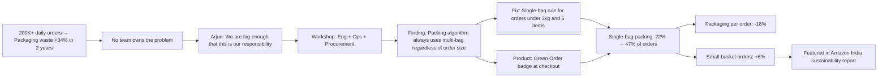

---

## Quick Reference — All 16 LPs at a Glance

| # | Leadership Principle | Arjun's Story Theme | Key Metric |
|---|---|---|---|
| 1 | Customer Obsession | Cart abandonment root-cause investigation | Conversion 61% → 67% |
| 2 | Ownership | Diwali payments outage — beyond team scope | 12K orders recovered |
| 3 | Invent and Simplify | 1-tap reorder for repeat baskets | Checkout 4.2 min → 18 sec |
| 4 | Are Right, A Lot | Blocked Tier 2 expansion until infra fixed | NPS +22% vs prior launches |
| 5 | Learn and Be Curious | Self-studied ML to fix demand forecasting | Wastage 18% → 11% |
| 6 | Hire and Develop the Best | Developed junior SDE → tech lead in 18 months | Promoted to SDE II |
| 7 | Insist on Highest Standards | Held launch for a 12% accuracy bug | Feature rating 4.7/5 |
| 8 | Think Big | Federated Fulfillment PR/FAQ across org | P90 delivery -19% |
| 9 | Bias for Action | Rolled back caching change in 20 minutes | Metric recovered in 2 hrs |
| 10 | Frugality | Cost archaeology sprint — no new infra | AWS spend -41% in 1 quarter |
| 11 | Earn Trust | Built trust with skeptical Pay team | Model integration partner |
| 12 | Dive Deep | Discovered silent 2.6% metric inflation | True delivery rate fixed |
| 13 | Have Backbone; Disagree and Commit | Raised concern, lost decision, committed fully | Launch on schedule, 4.5/5 |
| 14 | Deliver Results | Delivered 14-week project with 33% less team | P0 scope 100% on time |
| 15 | Earth's Best Employer | Reduced 40% attrition to zero in 18 months | Engagement 3.2 → 4.4/5 |
| 16 | Success & Scale → Responsibility | Packaging waste initiative, no mandate | Packaging per order -18% |
