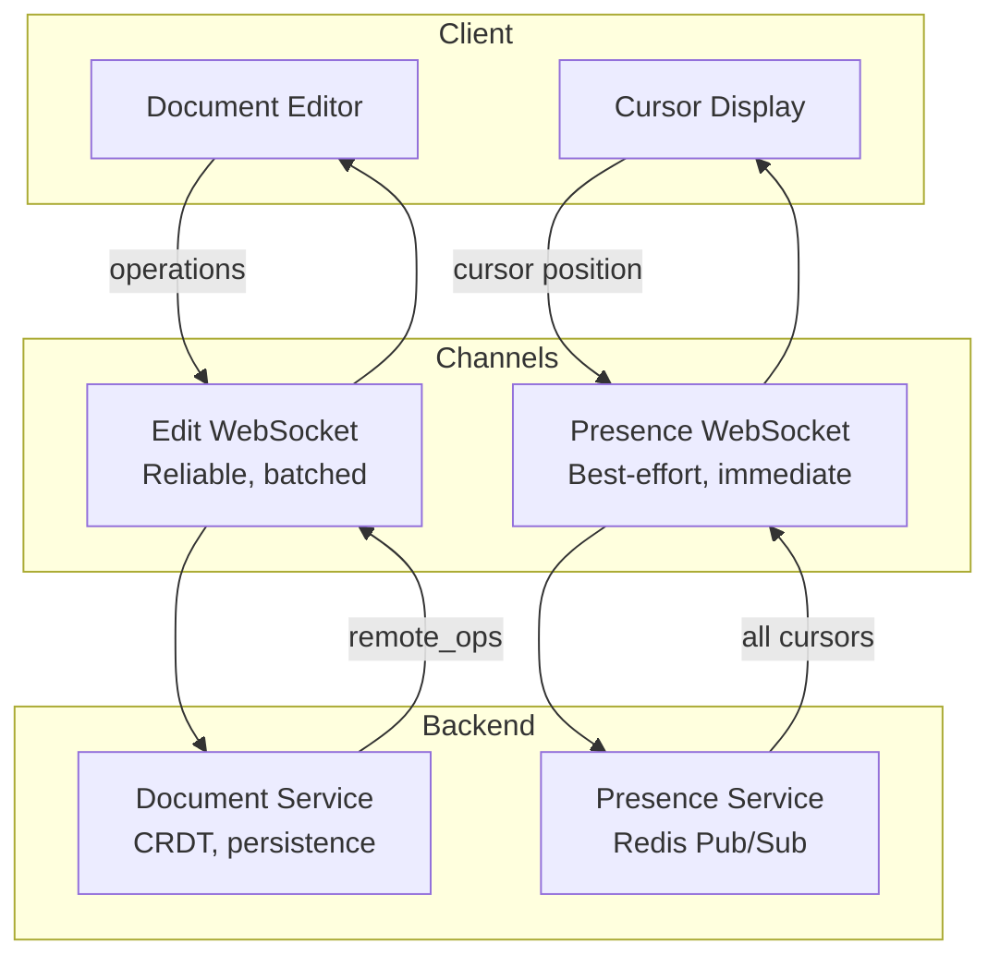

# ADR-004: Separate Presence from Edit Stream

## Status

**Accepted**

## Context

Real-time collaborative editing requires two types of information:
1. **Document edits**: Text insertions, deletions, formatting changes
2. **Presence data**: Cursor positions, selections, typing indicators, user lists

We must decide whether to handle these through:
1. **Single channel**: All data through one WebSocket/protocol
2. **Separate channels**: Different handling for edits vs presence

## Decision

We will use **separate channels** for presence and edit streams.

- **Edit stream**: Durable, reliable delivery, batched
- **Presence stream**: Ephemeral, best-effort, real-time

## Rationale

### Fundamental Differences

| Characteristic | Document Edits | Presence Data |
|---------------|----------------|---------------|
| **Durability** | Must never lose | Loss is acceptable |
| **Persistence** | Forever | Seconds (ephemeral) |
| **Latency tolerance** | Can batch 50-100ms | Must be real-time (<50ms) |
| **Delivery guarantee** | Exactly-once | Best effort |
| **Recovery on reconnect** | Full replay needed | Just current state |
| **Storage cost** | High (logs, snapshots) | Zero (in-memory only) |
| **Consistency** | Causal consistency | None required |

### Problems with Combined Channel

If we combine edits and presence in one channel:

1. **Latency conflict**
   - Edits benefit from batching (reduce overhead)
   - Presence suffers from batching (feels laggy)
   - Can't optimize for both

2. **Reliability conflict**
   - Edits need acknowledgment, retry, ordering
   - This adds latency to presence updates
   - Presence doesn't need this overhead

3. **Backpressure issues**
   - High presence update rate could delay edits
   - Slow edit processing could drop presence
   - No good priority scheme

4. **Recovery complexity**
   - On reconnect, edits need full sync from state vector
   - Presence just needs current snapshot
   - Combined: must handle both in same flow

### Benefits of Separation

1. **Independent optimization**
   ```
   Edit Channel:
     - Batch operations (50-100ms)
     - Reliable delivery with acks
     - Persist to durable log
     - Full sync on reconnect
   
   Presence Channel:
     - Stream immediately
     - Fire-and-forget
     - In-memory only
     - Just broadcast current state on reconnect
   ```

2. **Failure isolation**
   - Presence service down? Edits still work (just no cursors)
   - Edit service overloaded? Presence still shows users

3. **Scalability**
   - Can scale presence independently (more Redis pub/sub)
   - Different caching strategies
   - Different rate limits

4. **Simpler implementations**
   - Each system has clear, focused responsibility
   - Easier to test, debug, optimize

### Implementation Approach



### Same WebSocket, Different Message Types

Note: "Separate channels" doesn't require separate WebSocket connections. We use the same connection but:

```typescript
// Edit messages: reliable delivery
{
  type: "operations",
  // Includes sequence number for ack
  clientSeq: 42,
  operations: [...],
}

// Presence messages: fire-and-forget
{
  type: "presence",
  // No sequence number, no ack expected
  cursor: { blockId: "p1", offset: 10 },
}
```

The server processes these differently:
- Operations → Document Service → Kafka → Redis → broadcast with ack
- Presence → Presence Service → Redis Pub/Sub → broadcast (no ack)

## Consequences

### Positive

1. **Better UX**: Cursors update immediately, no batching delay
2. **Reliable edits**: Full delivery guarantees without presence overhead
3. **Graceful degradation**: Presence failure doesn't affect editing
4. **Simpler scaling**: Each system scales according to its needs
5. **Clear mental model**: Two distinct subsystems with different rules

### Negative

1. **More complexity**: Two systems to build and maintain
2. **Coordination**: Must handle cases where one channel works but not other
3. **Message ordering**: Presence might show cursor before edit appears
   - Mitigation: Brief reconciliation delay on client

### Risks

1. **Cursor/content desync**: User sees cursor but not the edit
   - Acceptable: Brief desync is fine, will resolve
   
2. **Increased connection overhead**: If using separate WebSockets
   - Mitigation: Use same WebSocket, different message handling

## Alternatives Considered

### Unified Channel with Priorities

Use one channel but prioritize presence. Rejected because:
- Still couples failure modes
- Complex priority logic
- Doesn't solve batching conflict

### Presence in Document CRDT

Store cursor positions in the CRDT itself. Rejected because:
- Unnecessary persistence (cursors don't need history)
- Bloats CRDT state
- Updates too frequent for CRDT overhead

### HTTP Polling for Presence

REST endpoints instead of WebSocket for presence. Rejected because:
- Too much latency for real-time feel
- Wastes bandwidth with polling
- Doesn't scale to many users

## Implementation Notes

### Throttling Presence

```typescript
const PRESENCE_THROTTLE = {
  cursorMove: 50,   // Max 20 updates/sec
  selection: 100,   // Max 10 updates/sec
  typing: 1000,     // Once per second while typing
};
```

### Presence Data Structure

```typescript
interface PresenceUpdate {
  userId: string;
  cursor?: { blockId: string; offset: number };
  selection?: { anchor: Position; focus: Position };
  isTyping: boolean;
  // No version, no clock - just latest state
}
```

### Reconnection Behavior

```typescript
// Edit channel: full sync from state vector
async function reconnectEdits() {
  const missing = await requestSync(myStateVector);
  applyOperations(missing);
}

// Presence channel: just get current state
async function reconnectPresence() {
  const current = await requestPresenceSnapshot();
  updateCursors(current);
  // No history, no sync - just now
}
```

## References

- [Figma Multiplayer Architecture](https://www.figma.com/blog/how-figmas-multiplayer-technology-works/)
- [Google Docs Presence](https://workspaceupdates.googleblog.com/)
- [Redis Pub/Sub for Presence](https://redis.io/docs/manual/pubsub/)
