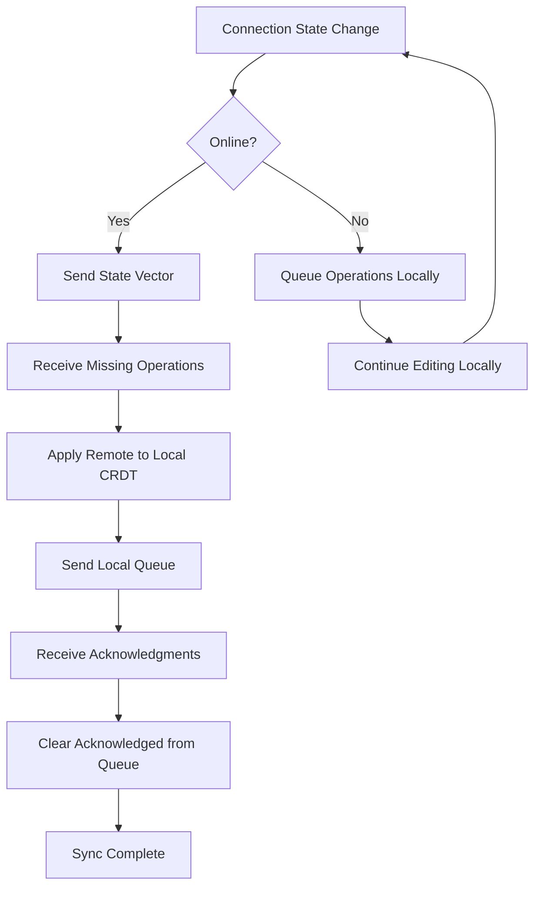

# ADR-005: Local-First Offline Architecture

## Status

**Accepted**

## Context

We need to support users editing documents without network connectivity. The key questions:

1. How much offline functionality to provide?
2. Where to store offline data?
3. How to handle sync when reconnecting?
4. What happens with conflicts from long offline periods?

Options considered:
1. **No offline**: Require constant connectivity
2. **Read-only offline**: Can view, but not edit
3. **Basic offline**: Short disconnections tolerated, limited editing
4. **Full offline**: Complete editing capability, sync whenever possible

## Decision

We will implement a **local-first** architecture with **full offline support**.

Users can edit documents completely offline for extended periods. All operations are stored locally and synchronized automatically when connectivity is restored.

## Rationale

### Why Full Offline?

| Capability | User Value | Technical Effort |
|------------|------------|------------------|
| No offline | Frustrating, unusable on planes/trains | None |
| Read-only | Limited value, can't work | Low |
| Basic (5 min) | Handles brief outages only | Medium |
| Full offline | True productivity tool | High |

**Full offline is essential** because:
1. Mobile users frequently have spotty connectivity
2. Knowledge workers often work while traveling
3. Enterprise users may have network restrictions
4. Competitive expectation (Notion, Obsidian offer this)

### Local-First Principles

We adopt the [local-first software](https://www.inkandswitch.com/local-first/) principles:

1. **No spinners**: Operations apply instantly, UI never waits for network
2. **Your data, your device**: Primary copy lives on your device
3. **Network is optional**: Full functionality without connectivity
4. **Sync is automatic**: When online, sync happens transparently
5. **Conflicts resolve automatically**: CRDT handles merge

### Architecture Decisions

#### Client-Side Storage: IndexedDB

```typescript
// Why IndexedDB:
// - Persistent across browser sessions
// - Large storage quota (GB+)
// - Structured data support
// - Async API (non-blocking)
// - Available in all modern browsers

const STORAGE_SCHEMA = {
  documents: {
    keyPath: "id",
    indexes: ["lastModified", "lastSynced"]
  },
  operations: {
    keyPath: "id",
    indexes: ["documentId", "status", "createdAt"]
  },
  metadata: {
    keyPath: "key"
  }
};
```

#### Operation Queue

All local operations go through a queue:

```typescript
// Every edit:
// 1. Apply to local CRDT (instant)
// 2. Persist to IndexedDB (fast)
// 3. Queue for network sync (async)

async function onLocalEdit(operation: Operation) {
  // Immediate - user sees change
  this.localCRDT.apply(operation);
  this.updateUI();
  
  // Durable - survives crash
  await this.indexedDB.saveState(this.localCRDT);
  await this.operationQueue.enqueue(operation);
  
  // Network - when available
  if (this.isOnline) {
    this.syncEngine.flush();
  }
}
```

#### Sync Strategy



### Handling Long Offline Periods

When a user is offline for extended time (hours, days):

1. **Local state may diverge significantly** from server state
2. **Other users have made many changes** to shared documents
3. **Queue may have thousands of operations**

Our approach:

```typescript
async function handleLongOfflineSync(docId: string) {
  const queueSize = await this.operationQueue.count(docId);
  const offlineDuration = Date.now() - this.lastSyncTime;
  
  if (queueSize > 1000 || offlineDuration > 24 * 60 * 60 * 1000) {
    // Large sync - show progress
    this.ui.showSyncProgress();
  }
  
  // Request server state
  const serverVector = await this.fetchServerVector(docId);
  const localVector = this.localCRDT.getStateVector();
  
  // Calculate what we're missing and what server is missing
  const weNeed = computeMissing(serverVector, localVector);
  const serverNeeds = computeMissing(localVector, serverVector);
  
  // Fetch and apply in batches
  for await (const batch of this.fetchBatches(weNeed)) {
    this.localCRDT.applyBatch(batch);
    this.ui.updateProgress();
  }
  
  // Send our operations in batches
  for await (const batch of this.operationQueue.getBatches(serverNeeds)) {
    await this.sendBatch(batch);
    await this.operationQueue.acknowledge(batch);
    this.ui.updateProgress();
  }
  
  // CRDT guarantees convergence
  this.ui.hideSyncProgress();
}
```

### Conflict Resolution

CRDTs resolve conflicts automatically:

```
User A (offline): "Hello World" → "Hello Beautiful World"
User B (online):  "Hello World" → "Hello Cruel World"

After A reconnects:
Result: "Hello Beautiful Cruel World" (or "Hello Cruel Beautiful World")
        Both insertions preserved, deterministic ordering
```

**Key insight**: With CRDTs, there are no "conflicts" in the traditional sense. All changes merge automatically. The question is whether the merge matches user intent.

### Intent Preservation

While CRDTs guarantee convergence, we add hints for better results:

```typescript
// For certain operations, capture intent
interface OperationIntent {
  operation: Operation;
  intent?: {
    type: "replace" | "insert" | "delete";
    originalContent?: string;
    expectedPosition?: number;
  };
}

// Use intent for UI hints (not merge logic)
function showMergeResult(result: MergeResult) {
  if (result.hasIntentConflict) {
    // Show notification: "Your edit was merged with others"
    this.ui.showMergeNotification(result.conflicts);
  }
}
```

## Consequences

### Positive

1. **True offline productivity**: Work anywhere, anytime
2. **Instant responsiveness**: Never wait for network
3. **Data resilience**: Local copy survives server outages
4. **Natural merge**: CRDT handles sync automatically
5. **Competitive feature**: Matches/exceeds alternatives

### Negative

1. **Storage requirements**: Each client stores full document state
2. **Sync complexity**: Large offline periods need careful handling
3. **User education**: Users may not understand merge behavior
4. **Testing burden**: Many more edge cases to test

### Risks

1. **IndexedDB quota**: Browser may limit storage
   - Mitigation: Monitor usage, prompt user, clear old docs

2. **Queue overflow**: Too many offline operations
   - Mitigation: Limit queue size, notify user

3. **Merge confusion**: Users surprised by merged content
   - Mitigation: Clear UI for sync status, merge notifications

4. **Data loss on clear data**: User clears browser storage
   - Mitigation: Show warning when unsynced changes exist

## Alternatives Considered

### Server-Authoritative with Offline Queue

Store offline edits, but server can reject/rebase them. Rejected because:
- User might lose work if server rejects
- Complex rebasing logic
- Poor UX (uncertainty about what's saved)

### Differential Sync (rsync-style)

Compute and send diffs rather than operations. Rejected because:
- Doesn't preserve intent well
- More complex for rich text
- CRDT operations are already efficient

### Full Document Snapshot on Every Edit

Save entire document state instead of operations. Rejected because:
- Much larger storage requirements
- Lose operation history
- Can't merge concurrent offline edits

## Implementation Checklist

- [ ] IndexedDB schema and migrations
- [ ] Operation queue with persistence
- [ ] Sync engine with state vector comparison
- [ ] Progress UI for large syncs
- [ ] Offline indicator with pending change count
- [ ] Storage quota monitoring
- [ ] Merge notification system
- [ ] Service worker for background sync
- [ ] Tests for offline scenarios

## References

- [Local-First Software](https://www.inkandswitch.com/local-first/)
- [IndexedDB API](https://developer.mozilla.org/en-US/docs/Web/API/IndexedDB_API)
- [Background Sync API](https://developer.mozilla.org/en-US/docs/Web/API/Background_Synchronization_API)
- [Notion Offline Support](https://www.notion.so/help/offline-access)
