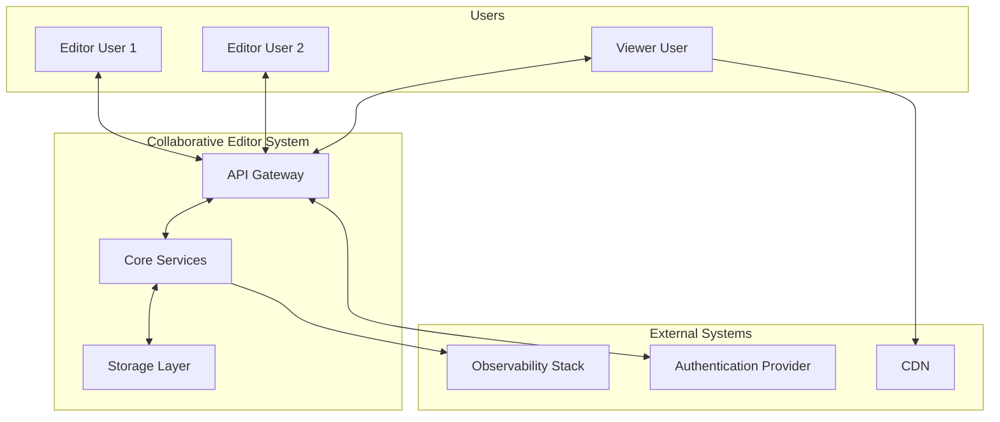
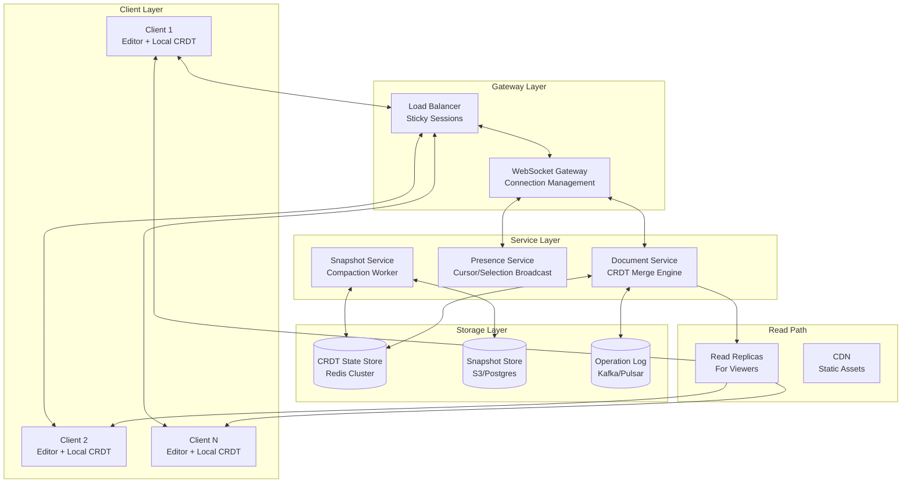
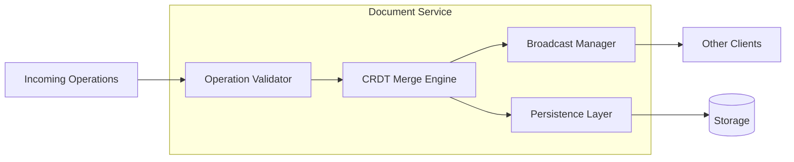
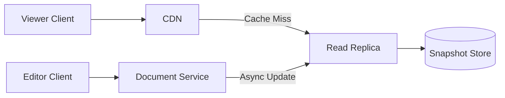
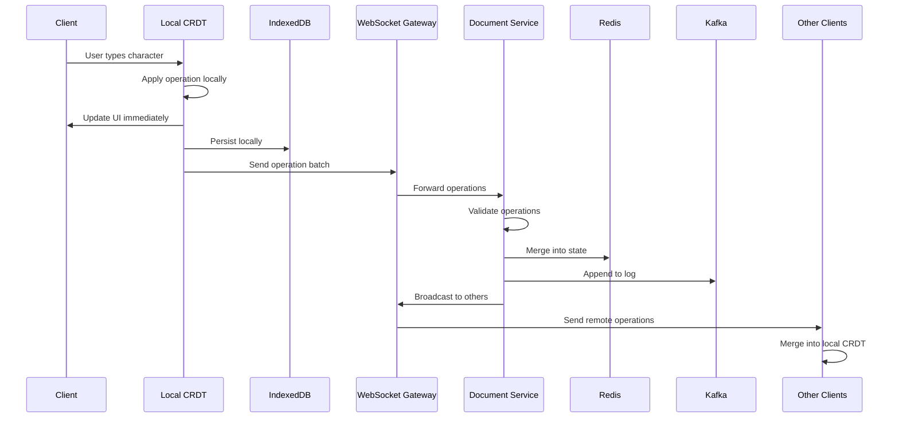
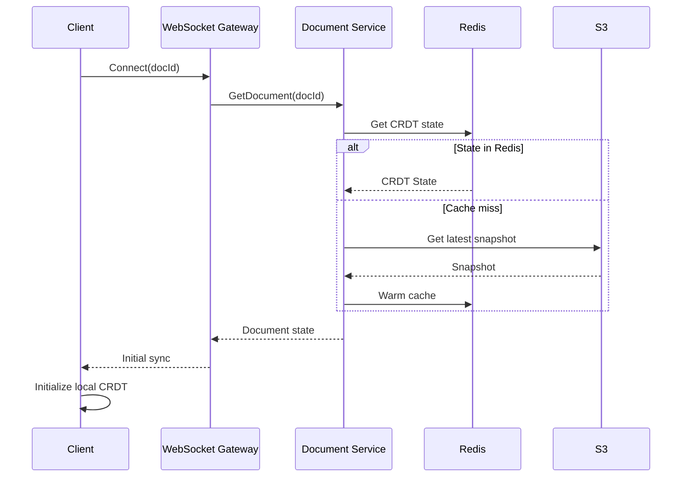

# Architecture Overview

## Executive Summary

This document describes the high-level architecture of a real-time collaborative document editor. The system enables multiple users (10-100 concurrent) to edit rich text documents simultaneously with full offline support.

## Design Philosophy

**Correctness over cleverness**: Every architectural decision prioritizes data integrity and predictable behavior. CRDTs provide mathematical guarantees that no clever optimization can invalidate.

**Local-first**: Users should never wait for the network. All operations apply locally first, then sync asynchronously.

**Graceful degradation**: The system continues functioning (possibly with reduced features) under partial failures.

## System Context



## High-Level Architecture



## Component Overview

### Client Layer

The client is a rich text editor with an embedded CRDT engine.

| Component | Responsibility |
|-----------|----------------|
| Rich Text Editor | User interface (ProseMirror, Slate, or similar) |
| Local CRDT | In-memory CRDT state for immediate operations |
| IndexedDB Store | Persistent local storage for offline support |
| Sync Engine | WebSocket client, batching, retry logic |
| Presence Manager | Cursor position tracking and display |

**Key Behavior**:
- All edits apply to local CRDT immediately (zero latency)
- Operations queue for network sync
- Full functionality maintained offline
- Automatic conflict resolution on reconnect

### Gateway Layer

Handles connection management and routing.

| Component | Responsibility |
|-----------|----------------|
| Load Balancer | Distribute connections, sticky sessions per document |
| WebSocket Gateway | Connection lifecycle, heartbeats, authentication |
| Rate Limiter | Protect against abuse, per-user operation limits |

**Key Behavior**:
- Sticky sessions ensure all clients for a document route to same gateway
- Graceful connection migration on gateway failure
- Protocol upgrade from HTTP to WebSocket

### Service Layer

Stateless services handling business logic.

#### Document Service

The core service managing document state and synchronization.



**Responsibilities**:
- Validate incoming operations (schema, permissions)
- Merge operations into document CRDT state
- Broadcast operations to other clients
- Persist operations to durable storage
- Handle sync requests (compute missing operations)

#### Presence Service

Manages ephemeral user presence information.

**Responsibilities**:
- Track cursor positions and selections
- Broadcast presence updates via Pub/Sub
- Timeout inactive users
- No persistence (purely ephemeral)

**Key Design Point**: Presence is separate from the edit stream because it has different requirements:
- Presence: Best-effort, low latency, no persistence
- Edits: Durable, can batch, must not lose data

#### Snapshot Service

Background service for state management.

**Responsibilities**:
- Create periodic snapshots of document state
- Garbage collect tombstones and old operations
- Prune operation log after snapshot
- Maintain snapshot history for recovery

### Storage Layer

#### CRDT State Store (Redis Cluster)

Hot storage for active document state.

**Data Model**:
```
doc:{docId}:state     -> Serialized CRDT state
doc:{docId}:vector    -> State vector (version clock)
doc:{docId}:ops       -> Recent operations (sorted set by sequence)
```

**Why Redis**:
- Sub-millisecond latency for hot path
- Cluster mode for horizontal scaling
- Lua scripting for atomic CRDT operations

#### Operation Log (Kafka/Pulsar)

Durable append-only log of all operations.

**Purpose**:
- Recovery if Redis state is lost
- Audit trail
- Replay for debugging

**Retention**: Operations retained until snapshot covers them.

#### Snapshot Store (S3/Postgres)

Cold storage for document snapshots.

**Data Model**:
```
snapshots/{docId}/{version}.snapshot  -> Binary CRDT snapshot
snapshots/{docId}/latest              -> Pointer to latest
```

**Why Object Storage**:
- Cost-effective for large binary blobs
- Durability (11 nines)
- No need for low-latency access

### Read Path

Optimized path for viewers (read-only users).



**Key Points**:
- Viewers don't need real-time sync
- Serve from cached snapshots (seconds stale is acceptable)
- Reduces load on core infrastructure
- CDN for static assets and document thumbnails

## Data Flow

### Write Path (Edit Operation)



### Read Path (Initial Load)



## Scalability Considerations

### Horizontal Scaling

| Component | Scaling Strategy |
|-----------|------------------|
| WebSocket Gateway | Add nodes, sticky sessions by document |
| Document Service | Stateless, add nodes freely |
| Presence Service | Stateless, Redis Pub/Sub handles fan-out |
| Redis | Cluster sharding by document ID |
| Kafka | Partition by document ID |

### Bottlenecks and Mitigations

| Bottleneck | Mitigation |
|------------|------------|
| Single hot document | Document sharding, operation batching |
| Fan-out for large rooms | Hierarchical broadcast, edge aggregation |
| CRDT state size | Compaction, snapshots |
| WebSocket connections | Connection pooling, gateway scaling |

## Security Considerations

### Authentication & Authorization

- JWT tokens for initial connection
- Token refresh via separate HTTP endpoint
- Per-document permission checks
- Operation-level authorization (some users read-only)

### Data Protection

- TLS for all connections
- Encryption at rest for stored documents
- Audit logging for compliance
- Data residency support (regional deployments)

## Monitoring Points

### Key Metrics

| Metric | Purpose |
|--------|---------|
| `ws_connections_active` | Current WebSocket connections |
| `ops_per_second` | Operation throughput |
| `sync_latency_p99` | Time from send to broadcast |
| `crdt_state_size_bytes` | Document size (triggers compaction) |
| `offline_queue_depth` | Pending operations per client |

### Alerts

| Condition | Action |
|-----------|--------|
| Sync latency > 500ms | Scale Document Service |
| CRDT state > 50MB | Trigger emergency compaction |
| WebSocket errors > 1% | Investigate gateway health |
| Kafka lag > 10s | Scale consumers or investigate |

## Next Steps

- [CRDT Design](02-crdt-design.md) - Deep dive into the data model
- [Sync Protocol](03-sync-protocol.md) - WebSocket protocol specification
- [Testing Strategy](07-testing-strategy.md) - How we verify correctness
