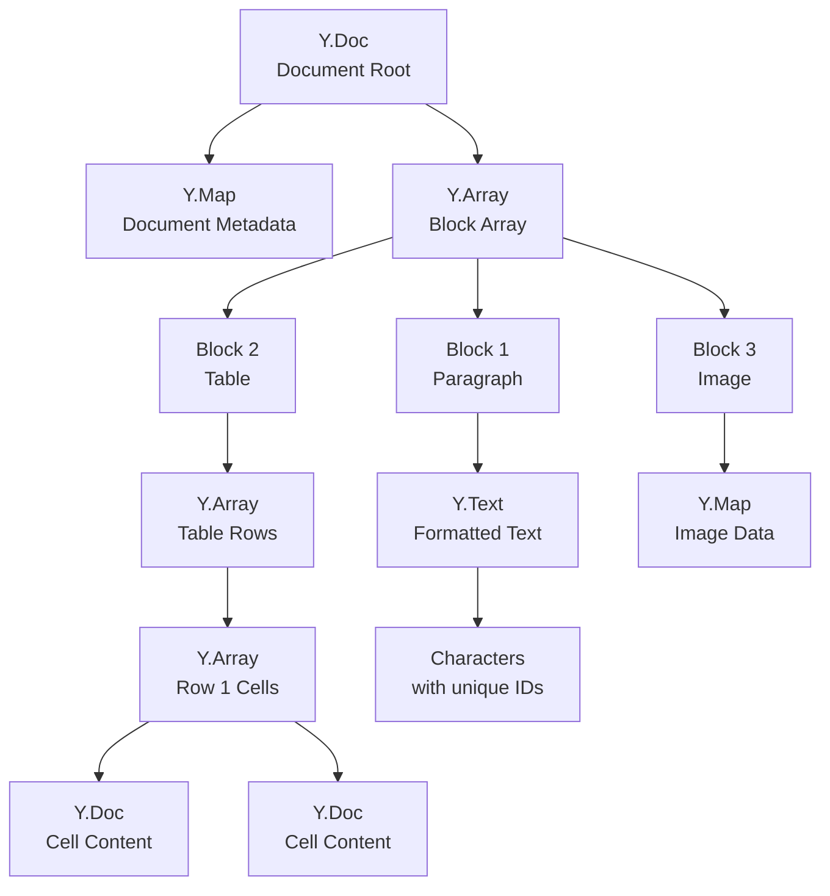

# CRDT Design

## Overview

This document specifies the CRDT (Conflict-free Replicated Data Type) data model for our collaborative editor. CRDTs enable concurrent editing without coordination by ensuring that all operations commute—the final state is the same regardless of the order operations are applied.

## Why CRDTs for Rich Text

### The Core Problem

When two users type simultaneously at the same position:
- User A types "hello" at position 5
- User B types "world" at position 5

Without coordination, we could get:
- "helloworld" (A then B)
- "worldhello" (B then A)
- Interleaved characters
- Lost characters

### CRDT Solution

CRDTs solve this by:
1. **Unique character identity**: Each character has a globally unique ID
2. **Position independence**: Operations reference character IDs, not indices
3. **Commutative merge**: Operations applied in any order yield same result

## CRDT Flavors Comparison

### Operational Transformation (OT)

```
Client A: insert("x", 5)  →  Server transforms  →  insert("x", 6)
Client B: insert("y", 5)  →  Server transforms  →  insert("y", 5)
```

**Problems**:
- Requires central server for transformation
- Transformation functions are complex (TP1, TP2 puzzles)
- Offline support is fundamentally difficult

### State-based CRDT (CvRDT)

```
Replica A: state_a
Replica B: state_b
Merged:    merge(state_a, state_b)  // Commutative, idempotent
```

**Used by**: Automerge

**Trade-off**: Must ship full state or complex delta computation

### Operation-based CRDT (CmRDT)

```
Replica A: apply(op1), apply(op2)
Replica B: apply(op2), apply(op1)  // Same result!
```

**Used by**: Yjs

**Trade-off**: Requires reliable delivery (at-least-once)

### Our Choice: Yjs-style Operation-based CRDT

We use an operation-based approach inspired by Yjs because:
- Efficient for text (small deltas)
- Proven at scale (Notion, Figma use Yjs)
- Better memory characteristics for rich text
- Excellent offline support

## Data Model

### Document Structure

A document is a tree of CRDT containers:



### Core CRDT Types

#### 1. Y.Text (Rich Text)

The primary type for text content.

**Structure**:
```typescript
interface TextItem {
  id: ItemID;           // Globally unique identifier
  content: string;      // The actual characters
  left: ItemID | null;  // Reference to left neighbor
  right: ItemID | null; // Reference to right neighbor
  origin: ItemID;       // Original left neighbor at creation
  marks: Mark[];        // Formatting (bold, italic, etc.)
  deleted: boolean;     // Tombstone flag
}

interface ItemID {
  client: number;       // Unique client identifier
  clock: number;        // Lamport clock value
}
```

**Example**:
```
Text: "Hello"

Items:
  {id: (1,0), content: "H", left: null, right: (1,1), origin: null}
  {id: (1,1), content: "e", left: (1,0), right: (1,2), origin: (1,0)}
  {id: (1,2), content: "l", left: (1,1), right: (1,3), origin: (1,1)}
  {id: (1,3), content: "l", left: (1,2), right: (1,4), origin: (1,2)}
  {id: (1,4), content: "o", left: (1,3), right: null, origin: (1,3)}
```

#### 2. Y.Array (Ordered List)

For ordered collections (blocks, table rows, list items).

**Structure**:
```typescript
interface ArrayItem<T> {
  id: ItemID;
  content: T;
  left: ItemID | null;
  right: ItemID | null;
  origin: ItemID;
  deleted: boolean;
}
```

#### 3. Y.Map (Key-Value)

For unordered key-value pairs (metadata, attributes).

**Structure**:
```typescript
interface MapEntry<T> {
  key: string;
  value: T;
  id: ItemID;          // For conflict resolution
  deleted: boolean;
}
```

**Conflict Resolution**: Last-writer-wins based on ItemID comparison.

### Character Identity

Every character has a globally unique, immutable identity:

```typescript
interface ItemID {
  client: number;  // Unique client ID (assigned on first connection)
  clock: number;   // Monotonically increasing per client
}

// Comparison for ordering
function compareIDs(a: ItemID, b: ItemID): number {
  if (a.client !== b.client) {
    return a.client - b.client;
  }
  return a.clock - b.clock;
}
```

**Properties**:
- **Globally unique**: (client, clock) pair is never reused
- **Comparable**: Total ordering for conflict resolution
- **Immutable**: ID never changes, even through merges

## Operations

### Operation Types

```typescript
type Operation = 
  | TextInsert
  | TextDelete
  | MarkAdd
  | MarkRemove
  | BlockInsert
  | BlockDelete
  | BlockUpdate
  | MapSet
  | MapDelete;

interface TextInsert {
  type: "text_insert";
  id: ItemID;
  parent: PathToContainer;  // Which Y.Text
  origin: ItemID | null;    // Left neighbor at insert time
  rightOrigin: ItemID | null; // Right neighbor at insert time
  content: string;
  marks: Mark[];
}

interface TextDelete {
  type: "text_delete";
  target: ItemID;           // Which character to delete
  parent: PathToContainer;
}

interface MarkAdd {
  type: "mark_add";
  parent: PathToContainer;
  start: ItemID;
  end: ItemID;
  mark: Mark;
}

interface MarkRemove {
  type: "mark_remove";
  parent: PathToContainer;
  start: ItemID;
  end: ItemID;
  markType: string;
}

interface BlockInsert {
  type: "block_insert";
  id: ItemID;
  parent: PathToContainer;  // Which Y.Array
  origin: ItemID | null;
  rightOrigin: ItemID | null;
  block: Block;
}

interface BlockDelete {
  type: "block_delete";
  target: ItemID;
  parent: PathToContainer;
}

interface BlockUpdate {
  type: "block_update";
  target: ItemID;
  parent: PathToContainer;
  attributes: Record<string, any>;
}
```

### Mark Types

```typescript
interface Mark {
  type: MarkType;
  attrs?: Record<string, any>;
}

type MarkType = 
  | "bold"
  | "italic"
  | "underline"
  | "strike"
  | "code"
  | "link"        // attrs: { href: string }
  | "highlight"   // attrs: { color: string }
  | "comment"     // attrs: { commentId: string }
  | "suggestion"; // attrs: { suggestionId: string, type: "insert" | "delete" }
```

### Block Types

```typescript
interface Block {
  type: BlockType;
  id: ItemID;
  attrs: Record<string, any>;
  content: Y.Text | Y.Array | null;
}

type BlockType =
  | "paragraph"
  | "heading"     // attrs: { level: 1-6 }
  | "list_item"   // attrs: { listType: "bullet" | "ordered", indent: number }
  | "code_block"  // attrs: { language: string }
  | "table"       // content: Y.Array<Row>
  | "image"       // attrs: { src: string, alt: string }
  | "embed"       // attrs: { embedType: string, data: any }
  | "divider";
```

## Merge Algorithm

### Insert Position Resolution

When inserting between two items, we must handle concurrent inserts at the same position.

```typescript
function findInsertPosition(
  doc: Document,
  origin: ItemID | null,
  rightOrigin: ItemID | null,
  newItem: Item
): Item | null {
  // Start from origin (left neighbor)
  let current = origin ? doc.getItem(origin) : null;
  let right = rightOrigin ? doc.getItem(rightOrigin) : null;
  
  // Scan right to find correct position
  while (current !== right) {
    let next = current ? current.right : doc.firstItem;
    
    if (next === null || next === right) {
      break;
    }
    
    // Conflict resolution: compare by origin, then by ID
    if (shouldInsertBefore(newItem, next)) {
      break;
    }
    
    current = next;
  }
  
  return current; // Insert after this item
}

function shouldInsertBefore(newItem: Item, existing: Item): boolean {
  // If new item's origin is to the right of existing's origin,
  // new item should come first
  if (newItem.origin !== existing.origin) {
    return compareIDs(newItem.origin, existing.origin) > 0;
  }
  
  // Same origin: order by ID (deterministic tie-breaker)
  return compareIDs(newItem.id, existing.id) < 0;
}
```

### Deletion (Tombstones)

Deleted items are not removed; they become tombstones:

```typescript
function deleteItem(doc: Document, targetId: ItemID): void {
  const item = doc.getItem(targetId);
  if (item && !item.deleted) {
    item.deleted = true;
    // Links (left, right) preserved for merge correctness
  }
  // Idempotent: deleting already-deleted item is no-op
}
```

**Why tombstones**:
- Concurrent inserts may reference deleted items
- Deletion must be idempotent
- Position information preserved for merging

### Mark Merging

Marks use a separate CRDT mechanism:

```typescript
interface MarkSpan {
  start: ItemID;
  end: ItemID;
  mark: Mark;
  id: ItemID;  // For conflict resolution
  deleted: boolean;
}

// Concurrent mark operations on same range:
// - Both add bold: idempotent, one wins
// - One adds bold, one removes: last-writer-wins by ID
```

## State Vector

Tracks what each client has seen:

```typescript
interface StateVector {
  [clientId: number]: number;  // client -> highest clock seen
}

// Example:
// { 1: 42, 2: 17, 3: 5 }
// Client 1 has produced 43 operations (0-42)
// Client 2 has produced 18 operations (0-17)
// Client 3 has produced 6 operations (0-5)
```

### Computing Missing Operations

```typescript
function getMissing(
  serverVector: StateVector,
  clientVector: StateVector
): Operation[] {
  const missing: Operation[] = [];
  
  for (const [client, serverClock] of Object.entries(serverVector)) {
    const clientClock = clientVector[client] ?? -1;
    
    if (serverClock > clientClock) {
      // Client is behind for this origin
      missing.push(...getOperations(client, clientClock + 1, serverClock));
    }
  }
  
  return missing;
}
```

## CRDT Invariants

These properties must always hold:

### 1. Convergence (Strong Eventual Consistency)

```
∀ replicas r1, r2:
  if r1.operations = r2.operations (as sets)
  then r1.state = r2.state
```

All replicas that have seen the same operations are in the same state.

### 2. Commutativity

```
∀ operations op1, op2:
  apply(apply(state, op1), op2) = apply(apply(state, op2), op1)
```

Order of applying operations doesn't affect final state.

### 3. Idempotency

```
∀ operation op:
  apply(apply(state, op), op) = apply(state, op)
```

Applying the same operation twice has same effect as once.

### 4. Causality Preservation

```
∀ operations op1, op2:
  if op1 happened-before op2
  then op1 must be applied before op2
```

Ensured by state vector comparison during sync.

## Memory Layout

### Optimized Item Storage

```typescript
// Naive: each item is an object (40+ bytes overhead)
interface NaiveItem {
  id: ItemID;
  content: string;
  left: ItemID | null;
  // ...
}

// Optimized: typed arrays for dense storage
class OptimizedTextCRDT {
  // Parallel arrays for cache efficiency
  clientIds: Uint32Array;      // Item client IDs
  clocks: Uint32Array;         // Item clocks
  contents: string;            // All characters concatenated
  contentOffsets: Uint32Array; // Start index in contents
  contentLengths: Uint16Array; // Length in contents
  leftPtrs: Int32Array;        // Index of left neighbor (-1 for null)
  rightPtrs: Int32Array;       // Index of right neighbor
  originPtrs: Int32Array;      // Index of origin
  flags: Uint8Array;           // Deleted flag, mark flags
}
```

### Memory Estimates

| Component | Size per Character |
|-----------|-------------------|
| ID (client + clock) | 8 bytes |
| Content pointer | 4 bytes |
| Links (left, right, origin) | 12 bytes |
| Flags | 1 byte |
| **Total** | ~25 bytes |

For a 100KB document (100,000 characters): ~2.5MB CRDT state

This is why compaction is essential (see [Snapshot & Compaction](06-snapshot-compaction.md)).

## Serialization

### Binary Format

```
┌─────────────────────────────────────────────┐
│ Header                                       │
│ ┌─────────────────────────────────────────┐ │
│ │ Magic: 4 bytes (0x59445254 "YDRT")      │ │
│ │ Version: 2 bytes                         │ │
│ │ Flags: 2 bytes                           │ │
│ │ StateVector length: 4 bytes              │ │
│ └─────────────────────────────────────────┘ │
├─────────────────────────────────────────────┤
│ State Vector                                │
│ ┌─────────────────────────────────────────┐ │
│ │ [clientId: varint, clock: varint] × N   │ │
│ └─────────────────────────────────────────┘ │
├─────────────────────────────────────────────┤
│ Client Table (ID → Name mapping)            │
├─────────────────────────────────────────────┤
│ Items                                       │
│ ┌─────────────────────────────────────────┐ │
│ │ Per item:                                │ │
│ │   clientId: varint (ref to table)       │ │
│ │   clock: varint                          │ │
│ │   originOffset: varint (relative)        │ │
│ │   rightOriginOffset: varint              │ │
│ │   contentLength: varint                  │ │
│ │   content: bytes                         │ │
│ │   marksBitfield: varint                  │ │
│ │   [markData if present]                  │ │
│ └─────────────────────────────────────────┘ │
└─────────────────────────────────────────────┘
```

### Delta Encoding

For sync, we send only new operations:

```typescript
interface SyncDelta {
  fromVector: StateVector;  // What client had
  toVector: StateVector;    // What client will have
  operations: Operation[];  // Only the missing ones
}
```

## Conflict Scenarios

### Scenario 1: Concurrent Insert at Same Position

```
Initial: "AB"
User 1: Insert "X" after "A" → "AXB"
User 2: Insert "Y" after "A" → "AYB"

Merge result: "AXYB" or "AYXB" (deterministic based on IDs)
```

### Scenario 2: Concurrent Delete and Insert

```
Initial: "ABC"
User 1: Delete "B" → "AC"
User 2: Insert "X" after "B" → "ABXC"

Merge result: "AXC" (X's origin is B, which becomes tombstone)
```

### Scenario 3: Concurrent Formatting

```
Initial: "Hello"
User 1: Bold "ell"
User 2: Italic "llo"

Merge result: "H" + bold("e") + bold+italic("ll") + italic("o")
```

## Testing CRDT Correctness

See [Testing Strategy](07-testing-strategy.md) for comprehensive CRDT testing approach.

Key properties to verify:
1. Convergence under all operation orderings
2. Intention preservation (user's intended change visible)
3. No data loss for non-conflicting edits
4. Deterministic conflict resolution

## References

- [Yjs Internals](https://github.com/yjs/yjs/blob/main/INTERNALS.md)
- [CRDT Literature Review](https://crdt.tech/)
- [Automerge Design](https://automerge.org/docs/how-it-works/backend/)
- [Xi Editor CRDT](https://xi-editor.io/docs/rope_science_11.html)
