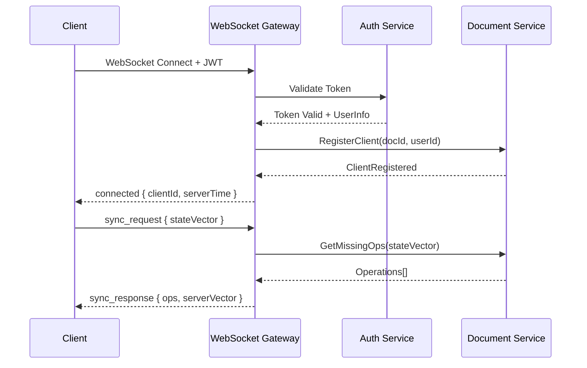
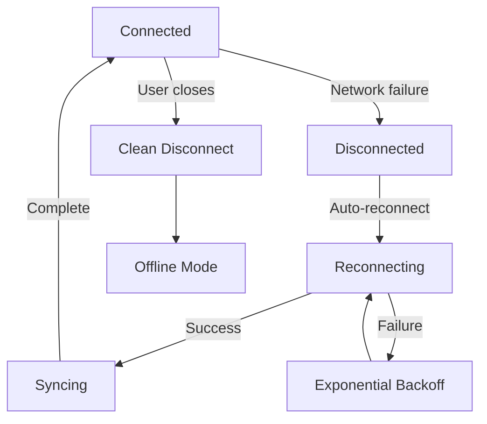
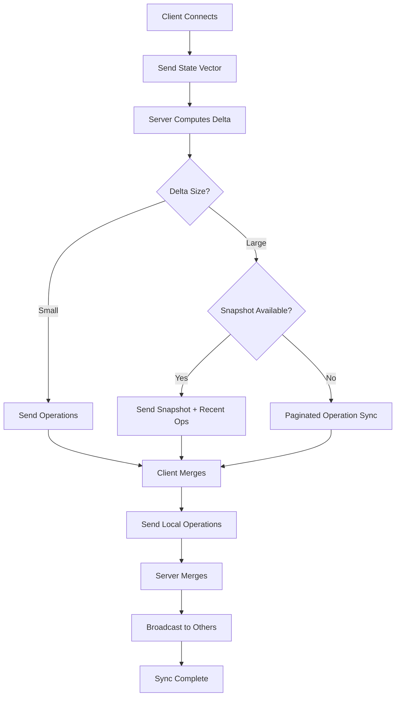
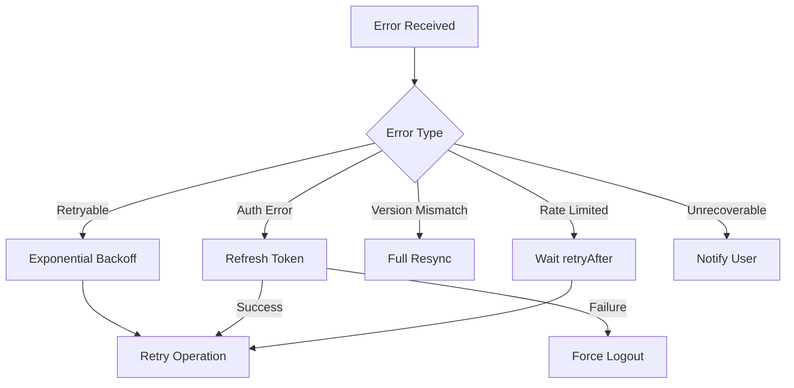

# Sync Protocol

## Overview

This document specifies the synchronization protocol between clients and the server. The protocol is designed for:
- **Efficiency**: Minimal data transfer through delta sync
- **Reliability**: Exactly-once semantics with idempotent operations
- **Offline support**: Graceful handling of disconnections

## Transport Layer

### WebSocket Connection

Primary transport for real-time bidirectional communication.

```
Client                          Server
   |                               |
   |-------- HTTP Upgrade -------->|
   |<------- 101 Switching --------|
   |                               |
   |======= WebSocket =============|
   |                               |
```

**Connection URL**: `wss://api.example.com/ws/documents/{docId}`

**Headers**:
```
Authorization: Bearer {jwt_token}
X-Client-ID: {client_uuid}
X-Protocol-Version: 1
```

### Fallback: Server-Sent Events + HTTP POST

For environments where WebSocket is blocked:
- SSE for server → client (operations, presence)
- HTTP POST for client → server (operations)

## Message Format

All messages are JSON with a common envelope:

```typescript
interface Message {
  type: MessageType;
  id?: string;        // For request-response correlation
  timestamp: number;  // Client-side timestamp (for ordering)
  payload: any;
}

type MessageType =
  // Connection lifecycle
  | "connect"
  | "connected"
  | "disconnect"
  
  // Sync
  | "sync_request"
  | "sync_response"
  
  // Operations
  | "operations"
  | "remote_ops"
  | "ack"
  
  // Presence
  | "presence"
  | "presence_update"
  
  // Control
  | "ping"
  | "pong"
  | "error";
```

## Connection Lifecycle

### Initial Connection



### Connect Message (Client → Server)

Sent implicitly via WebSocket upgrade with headers.

### Connected Message (Server → Client)

```typescript
interface ConnectedPayload {
  clientId: number;        // Assigned client ID for this session
  serverTime: number;      // Server timestamp for clock sync
  protocolVersion: number; // Negotiated protocol version
  features: string[];      // Supported features
}
```

### Disconnect Handling



**Reconnection Strategy**:
```typescript
const RECONNECT_CONFIG = {
  initialDelay: 1000,      // 1 second
  maxDelay: 30000,         // 30 seconds
  multiplier: 1.5,
  jitter: 0.3,             // ±30% randomization
  maxAttempts: Infinity,   // Never give up
};
```

## Synchronization Protocol

### State Vector

The state vector tracks what operations each client has produced:

```typescript
interface StateVector {
  [clientId: number]: number;  // client → highest clock seen
}

// Example
const clientVector: StateVector = {
  1: 42,   // Client 1: seen ops 0-42
  2: 17,   // Client 2: seen ops 0-17
  5: 100,  // Client 5: seen ops 0-100
};
```

### Sync Request (Client → Server)

Sent on connection and after any gap in connectivity.

```typescript
interface SyncRequestPayload {
  documentId: string;
  stateVector: StateVector;   // What client has
  resumeToken?: string;       // For large sync pagination
}
```

### Sync Response (Server → Client)

```typescript
interface SyncResponsePayload {
  operations: Operation[];     // Missing operations
  serverVector: StateVector;   // Server's current state
  hasMore: boolean;            // If more ops pending
  resumeToken?: string;        // For pagination
  snapshot?: {                 // If too many ops, send snapshot
    data: Uint8Array;
    vector: StateVector;
  };
}
```

### Sync Algorithm



**Server-Side Delta Computation**:

```typescript
function computeSyncDelta(
  serverVector: StateVector,
  clientVector: StateVector,
  operationLog: OperationLog
): SyncDelta {
  const missing: Operation[] = [];
  
  for (const [clientId, serverClock] of Object.entries(serverVector)) {
    const clientClock = clientVector[clientId] ?? -1;
    
    if (serverClock > clientClock) {
      // Fetch operations from (clientClock + 1) to serverClock
      const ops = operationLog.getRange(
        clientId, 
        clientClock + 1, 
        serverClock
      );
      missing.push(...ops);
    }
  }
  
  // Sort by causal order (Lamport timestamp)
  missing.sort(compareByCausalOrder);
  
  return { operations: missing, serverVector };
}
```

## Operation Messages

### Operations (Client → Server)

Client sends batched operations.

```typescript
interface OperationsPayload {
  documentId: string;
  operations: Operation[];
  clientSeq: number;          // Client-side sequence number
  expectedServerVector?: StateVector;  // For optimistic concurrency
}
```

**Batching Strategy**:
```typescript
class OperationBatcher {
  private buffer: Operation[] = [];
  private timer: number | null = null;
  
  readonly config = {
    maxBatchSize: 50,      // Max operations per batch
    maxBatchAge: 100,      // Max ms to wait
    debounceDelay: 50,     // Pause detection
  };
  
  add(op: Operation): void {
    this.buffer.push(op);
    
    // Flush if buffer full
    if (this.buffer.length >= this.config.maxBatchSize) {
      this.flush();
      return;
    }
    
    // Start/reset timer
    if (this.timer) clearTimeout(this.timer);
    this.timer = setTimeout(() => this.flush(), this.config.maxBatchAge);
  }
  
  flush(): void {
    if (this.buffer.length === 0) return;
    
    const batch = this.buffer;
    this.buffer = [];
    this.timer = null;
    
    this.send(batch);
  }
}
```

### Remote Operations (Server → Client)

Server broadcasts operations from other clients.

```typescript
interface RemoteOpsPayload {
  documentId: string;
  operations: Operation[];
  origin: number;           // ClientId that produced these ops
  serverVector: StateVector; // Updated server state vector
}
```

### Acknowledgment (Server → Client)

Confirms operations were persisted.

```typescript
interface AckPayload {
  documentId: string;
  clientSeq: number;        // Which batch was acked
  serverVector: StateVector;
  persistedAt: number;      // Server timestamp
}
```

## Presence Protocol

Separate from edit operations (different reliability requirements).

### Presence Update (Client → Server)

```typescript
interface PresencePayload {
  documentId: string;
  cursor?: {
    blockId: string;
    offset: number;
  };
  selection?: {
    anchor: { blockId: string; offset: number };
    focus: { blockId: string; offset: number };
  };
  isTyping: boolean;
}
```

**Throttling**: Max 10 updates/second per client.

### Presence Broadcast (Server → Client)

```typescript
interface PresenceUpdatePayload {
  documentId: string;
  presences: UserPresence[];
}

interface UserPresence {
  userId: string;
  name: string;
  color: string;           // Assigned color for cursor
  cursor?: CursorPosition;
  selection?: SelectionRange;
  isTyping: boolean;
  lastSeen: number;
}
```

## Error Handling

### Error Message

```typescript
interface ErrorPayload {
  code: ErrorCode;
  message: string;
  details?: any;
  retryable: boolean;
  retryAfter?: number;     // Seconds to wait before retry
}

enum ErrorCode {
  // Connection errors
  UNAUTHORIZED = 4001,
  DOCUMENT_NOT_FOUND = 4004,
  VERSION_MISMATCH = 4009,
  
  // Rate limiting
  RATE_LIMITED = 4029,
  
  // Server errors
  INTERNAL_ERROR = 5000,
  SERVICE_UNAVAILABLE = 5003,
  
  // Sync errors
  SYNC_CONFLICT = 4100,
  SNAPSHOT_REQUIRED = 4101,
}
```

### Error Recovery



## Protocol Versioning

### Version Negotiation

```
Client: X-Protocol-Version: 2
Server: Uses version 2 if supported, else highest compatible
```

### Backward Compatibility

| Version | Changes |
|---------|---------|
| 1 | Initial protocol |
| 2 | Added binary encoding, presence separation |
| 3 | Added snapshot pagination |

New clients must handle old message types gracefully.

## Binary Encoding (Optional)

For high-throughput scenarios, use binary encoding:

```typescript
// MessagePack or Protocol Buffers
interface BinaryMessage {
  header: Uint8Array;  // 4 bytes: type (2) + length (2)
  payload: Uint8Array; // Variable length
}
```

**When to use**:
- More than 50 active users on document
- High operation frequency (> 100 ops/sec)
- Mobile clients (bandwidth sensitive)

## Flow Control

### Backpressure

If client falls behind:

```typescript
interface BackpressureConfig {
  maxPendingOps: 1000,        // Max ops queued for client
  maxPendingBytes: 1048576,   // 1MB
  warningThreshold: 0.8,      // Warn at 80%
}

// Server behavior when threshold exceeded:
// 1. Send warning to client
// 2. Start dropping presence updates
// 3. If still exceeded, disconnect with BACKPRESSURE error
```

### Client-side Queue Management

```typescript
class SendQueue {
  private queue: Operation[] = [];
  private inflight: Map<number, Operation[]> = new Map();
  
  readonly MAX_INFLIGHT = 3;  // Max unacked batches
  
  canSend(): boolean {
    return this.inflight.size < this.MAX_INFLIGHT;
  }
  
  onAck(seq: number): void {
    this.inflight.delete(seq);
    this.processQueue();
  }
  
  onNack(seq: number): void {
    // Requeue failed batch
    const failed = this.inflight.get(seq);
    if (failed) {
      this.queue.unshift(...failed);
      this.inflight.delete(seq);
    }
    this.processQueue();
  }
}
```

## Security Considerations

### Message Authentication

- All WebSocket connections require valid JWT
- JWT contains: userId, documentId, permissions, expiry
- Token refresh via HTTP endpoint before expiry

### Message Validation

Server validates all incoming messages:

```typescript
function validateOperation(op: Operation, userId: string): void {
  // 1. Schema validation
  assertValidSchema(op);
  
  // 2. Permission check
  assertUserCanEdit(userId, op.documentId);
  
  // 3. Rate limit check
  assertNotRateLimited(userId);
  
  // 4. Content validation (no malicious content)
  assertSafeContent(op);
  
  // 5. Causality check (has all dependencies)
  assertCausallyReady(op);
}
```

### Replay Protection

- Each operation has unique (clientId, clock) ID
- Server rejects operations with already-seen IDs
- State vector tracks what's been processed

## Debugging and Monitoring

### Debug Mode

Clients can enable verbose logging:

```typescript
interface DebugInfo {
  messageId: string;
  latency: number;        // Round-trip time
  serverProcessing: number;
  queueDepth: number;
  stateVectorDelta: StateVector;
}
```

### Key Metrics

| Metric | Description |
|--------|-------------|
| `sync_latency_ms` | Time from send to ack |
| `ops_per_batch` | Operations per batch |
| `reconnect_count` | Reconnections per session |
| `sync_delta_size` | Bytes transferred during sync |
| `presence_update_rate` | Presence messages per second |

## Example Session

```
→ [WebSocket Connect]
← connected { clientId: 42, serverTime: 1699900000000 }

→ sync_request { stateVector: { 1: 10, 2: 5 } }
← sync_response { 
    operations: [...], 
    serverVector: { 1: 15, 2: 8, 42: -1 },
    hasMore: false 
  }

→ operations { 
    ops: [{ type: "text_insert", ... }], 
    clientSeq: 1 
  }
← ack { clientSeq: 1, serverVector: { 1: 15, 2: 8, 42: 0 } }

← remote_ops { 
    ops: [...], 
    origin: 1, 
    serverVector: { 1: 16, 2: 8, 42: 0 } 
  }

→ presence { cursor: { blockId: "p1", offset: 42 } }
← presence_update { presences: [...] }

→ ping
← pong

... (editing session continues)

→ [WebSocket Close]
```
