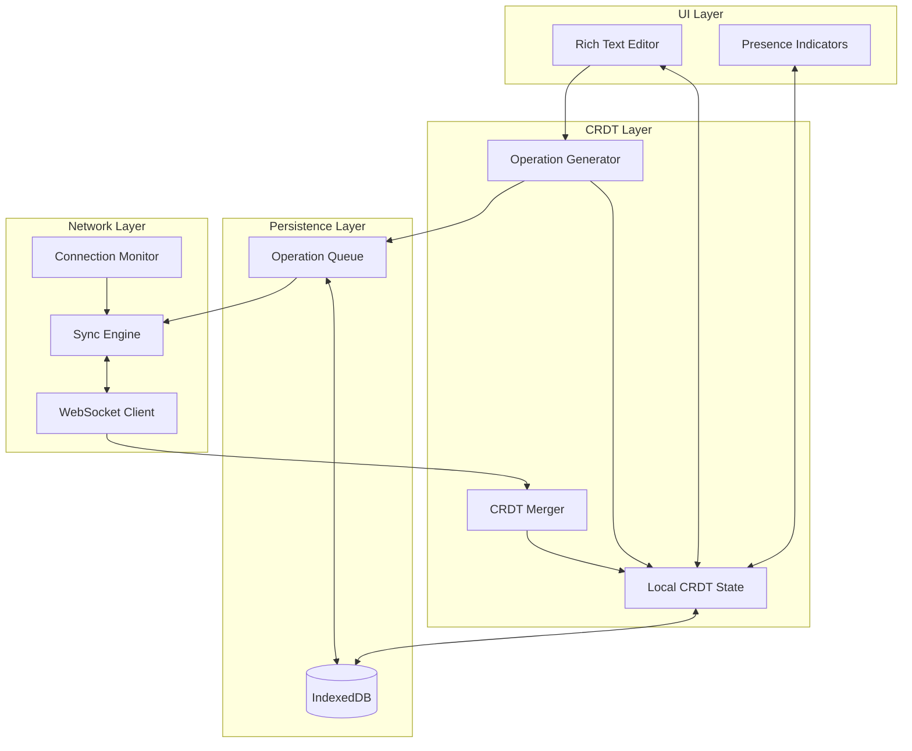
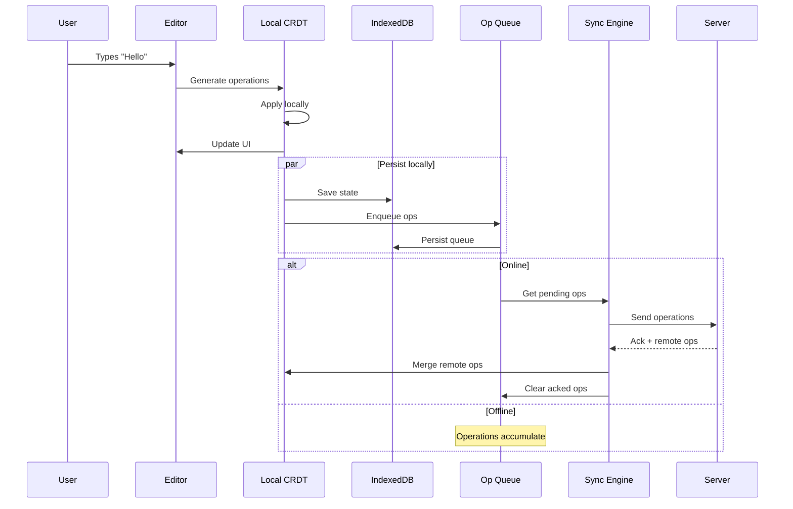
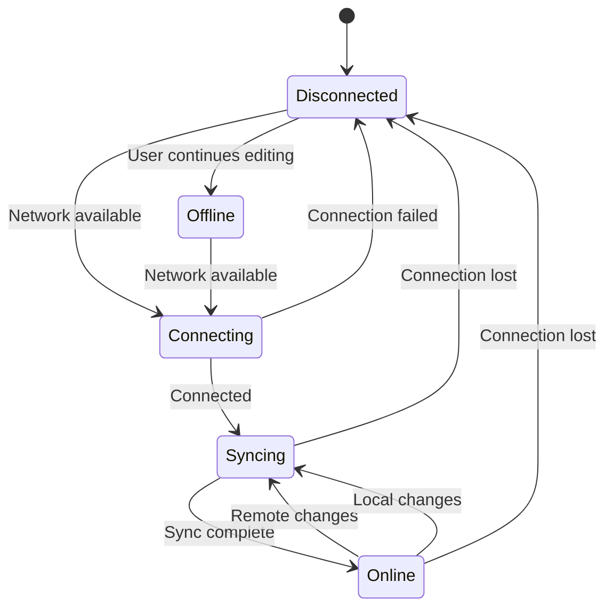
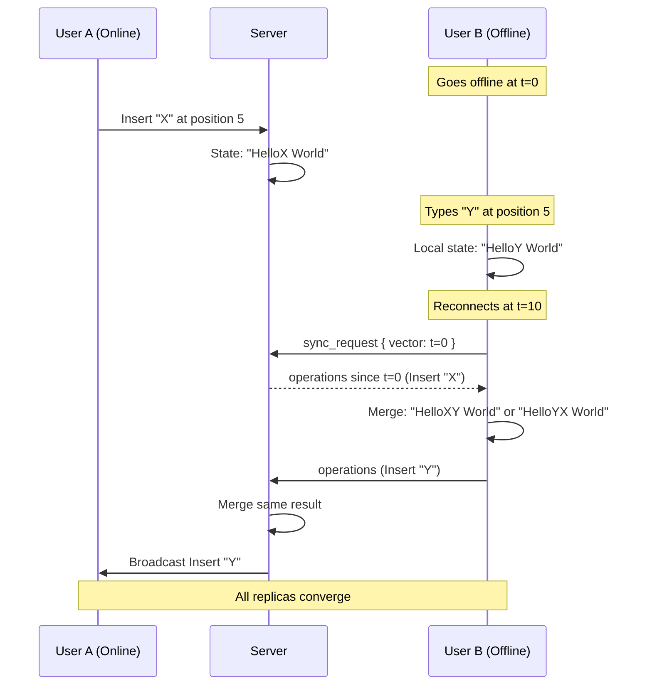
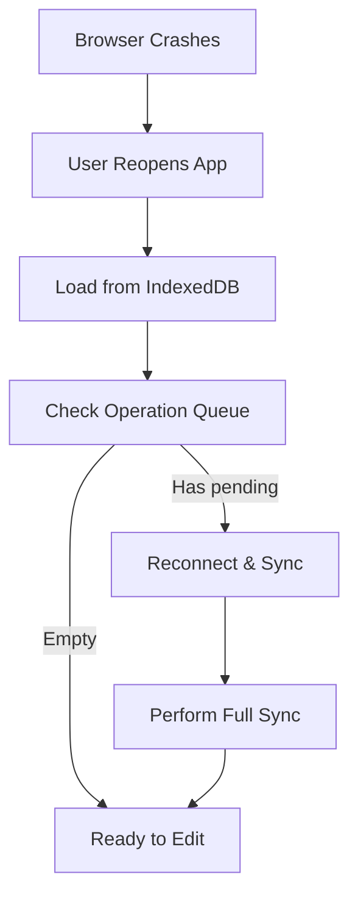

# Offline Support

## Overview

This document describes the local-first architecture that enables full offline editing. Users can edit documents without network connectivity, and changes automatically synchronize when connection is restored.

## Design Philosophy

**Local-first**: The local copy is the source of truth for the user. Network sync is an optimization, not a requirement.

**Optimistic UI**: All operations apply immediately to local state. Network failures never block the user.

**Eventual consistency**: All replicas converge to the same state given the same set of operations, regardless of network conditions.

## Architecture

### Client-Side Architecture



### Data Flow



## IndexedDB Schema

### Database Structure

```typescript
interface CollabEditorDB {
  documents: DocumentStore;
  operations: OperationStore;
  metadata: MetadataStore;
  presence: PresenceStore;  // Ephemeral, not synced
}
```

### Document Store

```typescript
interface DocumentRecord {
  id: string;                    // Document ID
  state: Uint8Array;             // Serialized CRDT state
  stateVector: StateVector;      // What's in this state
  lastModified: number;          // Timestamp
  lastSynced: number;            // Last successful sync
  snapshotVersion?: number;      // If from server snapshot
}

// IndexedDB object store
const documentStore = {
  name: "documents",
  keyPath: "id",
  indexes: [
    { name: "lastModified", keyPath: "lastModified" },
    { name: "lastSynced", keyPath: "lastSynced" },
  ],
};
```

### Operation Queue Store

```typescript
interface QueuedOperation {
  id: string;                    // Unique operation ID
  documentId: string;
  operation: Operation;
  createdAt: number;
  attempts: number;              // Retry count
  lastAttempt?: number;
  status: "pending" | "inflight" | "failed";
}

const operationStore = {
  name: "operations",
  keyPath: "id",
  indexes: [
    { name: "documentId", keyPath: "documentId" },
    { name: "status", keyPath: "status" },
    { name: "createdAt", keyPath: "createdAt" },
  ],
};
```

### Metadata Store

```typescript
interface MetadataRecord {
  key: string;
  value: any;
}

// Stored metadata:
// - "clientId": Assigned client ID
// - "serverVector:{docId}": Last known server state
// - "syncCursor:{docId}": Pagination cursor for large syncs
```

## Operation Queue

### Queue Management

```typescript
class OperationQueue {
  private db: IDBDatabase;
  
  async enqueue(docId: string, op: Operation): Promise<void> {
    const record: QueuedOperation = {
      id: `${op.id.client}-${op.id.clock}`,
      documentId: docId,
      operation: op,
      createdAt: Date.now(),
      attempts: 0,
      status: "pending",
    };
    
    await this.db.put("operations", record);
  }
  
  async getPending(docId: string): Promise<QueuedOperation[]> {
    const index = this.db
      .transaction("operations")
      .objectStore("operations")
      .index("documentId");
    
    const ops = await index.getAll(docId);
    return ops
      .filter(op => op.status !== "inflight")
      .sort((a, b) => a.createdAt - b.createdAt);
  }
  
  async markInflight(ids: string[]): Promise<void> {
    const tx = this.db.transaction("operations", "readwrite");
    for (const id of ids) {
      const op = await tx.objectStore("operations").get(id);
      if (op) {
        op.status = "inflight";
        op.lastAttempt = Date.now();
        op.attempts++;
        await tx.objectStore("operations").put(op);
      }
    }
  }
  
  async acknowledge(ids: string[]): Promise<void> {
    const tx = this.db.transaction("operations", "readwrite");
    for (const id of ids) {
      await tx.objectStore("operations").delete(id);
    }
  }
  
  async markFailed(ids: string[]): Promise<void> {
    const tx = this.db.transaction("operations", "readwrite");
    for (const id of ids) {
      const op = await tx.objectStore("operations").get(id);
      if (op) {
        op.status = "pending";  // Will retry
        await tx.objectStore("operations").put(op);
      }
    }
  }
}
```

### Queue Size Limits

```typescript
const QUEUE_LIMITS = {
  maxOperations: 10000,       // Max queued ops per document
  maxBytes: 10 * 1024 * 1024, // 10MB per document
  maxAge: 7 * 24 * 60 * 60 * 1000, // 7 days
};

async function enforceQueueLimits(docId: string): Promise<void> {
  const pending = await queue.getPending(docId);
  
  if (pending.length > QUEUE_LIMITS.maxOperations) {
    // Force sync or warn user
    notifyUser("Too many pending changes. Please reconnect.");
  }
  
  // Prune very old operations (likely stale)
  const cutoff = Date.now() - QUEUE_LIMITS.maxAge;
  const stale = pending.filter(op => op.createdAt < cutoff);
  if (stale.length > 0) {
    await queue.acknowledge(stale.map(op => op.id));
    notifyUser(`${stale.length} old changes were discarded.`);
  }
}
```

## Sync Engine

### State Machine



### Sync Engine Implementation

```typescript
class SyncEngine {
  private state: "disconnected" | "connecting" | "syncing" | "online";
  private ws: WebSocket | null = null;
  private queue: OperationQueue;
  private localCRDT: CRDT;
  
  async connect(docId: string): Promise<void> {
    this.state = "connecting";
    
    try {
      this.ws = await this.establishConnection(docId);
      await this.performSync(docId);
      this.state = "online";
      this.startHeartbeat();
    } catch (error) {
      this.state = "disconnected";
      this.scheduleReconnect();
    }
  }
  
  private async performSync(docId: string): Promise<void> {
    this.state = "syncing";
    
    // 1. Get local state vector
    const localVector = this.localCRDT.getStateVector();
    
    // 2. Request missing ops from server
    const response = await this.sendSyncRequest(localVector);
    
    // 3. Apply remote operations
    for (const op of response.operations) {
      this.localCRDT.applyRemote(op);
    }
    
    // 4. Send local pending operations
    const pending = await this.queue.getPending(docId);
    if (pending.length > 0) {
      await this.sendOperations(pending);
    }
    
    // 5. Update sync metadata
    await this.updateSyncMetadata(docId, response.serverVector);
  }
  
  async sendLocalOperation(op: Operation): Promise<void> {
    // Always persist locally first
    await this.queue.enqueue(op.documentId, op);
    
    if (this.state === "online") {
      // Try to send immediately
      this.flushQueue();
    }
    // If offline, operation waits in queue
  }
  
  private async flushQueue(): Promise<void> {
    const pending = await this.queue.getPending(this.currentDocId);
    if (pending.length === 0) return;
    
    const batch = pending.slice(0, 50); // Batch size limit
    const ids = batch.map(op => op.id);
    
    await this.queue.markInflight(ids);
    
    try {
      await this.sendOperations(batch);
      await this.queue.acknowledge(ids);
    } catch (error) {
      await this.queue.markFailed(ids);
      
      if (isNetworkError(error)) {
        this.handleDisconnect();
      }
    }
  }
}
```

## Conflict Resolution

### How CRDTs Handle Offline Edits

When a user edits offline and reconnects:



### Conflict Scenarios

#### Scenario 1: Concurrent Insert

```
Initial: "Hello"
A (online): Insert "X" after "o"  → "HelloX"
B (offline): Insert "Y" after "o" → "HelloY"

After sync: "HelloXY" or "HelloYX" (deterministic by ID)
```

Both insertions are preserved. Order determined by CRDT rules.

#### Scenario 2: Insert vs Delete

```
Initial: "Hello World"
A (online): Delete "o" → "Hell World"
B (offline): Insert "X" after "o" → "HelloX World"

After sync: "HellX World"
```

The "X" references the deleted "o" as its origin. It remains in position, with the tombstone providing anchor.

#### Scenario 3: Long Offline Period

```
Initial: "Hello"
A: Many edits over hours → "Completely different text"
B (offline for hours): Insert "X" → "HelloX"

After sync: B's "X" is integrated at the correct position
```

The CRDT's unique character IDs ensure proper placement even after extensive changes.

## Offline Indicators

### Connection Status UI

```typescript
interface ConnectionStatus {
  state: "online" | "syncing" | "offline" | "error";
  pendingChanges: number;
  lastSynced: Date | null;
  error?: string;
}

function getStatusDisplay(status: ConnectionStatus): StatusUI {
  switch (status.state) {
    case "online":
      return { icon: "✓", text: "Saved", color: "green" };
    
    case "syncing":
      return { icon: "↻", text: "Syncing...", color: "blue" };
    
    case "offline":
      return {
        icon: "○",
        text: `Offline (${status.pendingChanges} changes pending)`,
        color: "yellow",
      };
    
    case "error":
      return { icon: "!", text: status.error, color: "red" };
  }
}
```

### Offline Capabilities Banner

When offline, show what users can still do:

```
┌─────────────────────────────────────────────────────────────┐
│ ○ You're offline                                             │
│                                                              │
│ You can still:                                               │
│ • Edit this document                                         │
│ • Create new content                                         │
│                                                              │
│ When you reconnect:                                          │
│ • Your changes will sync automatically                       │
│ • You'll see others' changes                                 │
│                                                              │
│ 3 changes pending                              [Retry Now]   │
└─────────────────────────────────────────────────────────────┘
```

## Storage Management

### IndexedDB Quota

Browsers limit IndexedDB storage (typically 50% of disk space):

```typescript
async function checkStorageQuota(): Promise<StorageInfo> {
  if (navigator.storage && navigator.storage.estimate) {
    const estimate = await navigator.storage.estimate();
    return {
      used: estimate.usage || 0,
      available: estimate.quota || 0,
      percentUsed: ((estimate.usage || 0) / (estimate.quota || 1)) * 100,
    };
  }
  return { used: 0, available: Infinity, percentUsed: 0 };
}

async function handleLowStorage(): Promise<void> {
  const storage = await checkStorageQuota();
  
  if (storage.percentUsed > 90) {
    // Clear old document caches
    await clearOldDocuments(30); // Keep last 30 days
    
    // Notify user
    notifyUser("Storage is nearly full. Old documents cleared.");
  }
}
```

### Document Eviction

```typescript
interface EvictionPolicy {
  maxDocuments: 100,           // Max cached documents
  maxAgeIfSynced: 30,          // Days to keep synced docs
  maxAgeIfPending: 365,        // Days to keep docs with pending changes
  priorityField: "lastAccessed",
}

async function evictDocuments(): Promise<void> {
  const docs = await getAllDocuments();
  const now = Date.now();
  
  // Never evict documents with pending changes
  const candidates = docs.filter(doc => {
    const pending = await queue.getPending(doc.id);
    return pending.length === 0;
  });
  
  // Sort by last access, evict oldest
  candidates.sort((a, b) => a.lastAccessed - b.lastAccessed);
  
  const toEvict = candidates.slice(0, candidates.length - MAX_DOCUMENTS);
  for (const doc of toEvict) {
    await deleteDocument(doc.id);
  }
}
```

## Service Worker Integration

### Background Sync

```typescript
// service-worker.js
self.addEventListener("sync", async (event) => {
  if (event.tag === "sync-documents") {
    event.waitUntil(syncAllDocuments());
  }
});

async function syncAllDocuments(): Promise<void> {
  const docs = await getDocumentsWithPendingChanges();
  
  for (const doc of docs) {
    try {
      await syncDocument(doc.id);
    } catch (error) {
      // Will retry on next sync event
      console.error(`Failed to sync ${doc.id}:`, error);
    }
  }
}

// Register sync when going offline
async function registerBackgroundSync(): Promise<void> {
  if ("serviceWorker" in navigator && "SyncManager" in window) {
    const registration = await navigator.serviceWorker.ready;
    await registration.sync.register("sync-documents");
  }
}
```

### Periodic Sync

```typescript
// Check for updates periodically when tab is hidden
self.addEventListener("periodicsync", (event) => {
  if (event.tag === "check-updates") {
    event.waitUntil(checkForUpdates());
  }
});

async function checkForUpdates(): Promise<void> {
  const docs = await getOpenDocuments();
  
  for (const doc of docs) {
    const serverVector = await fetchServerVector(doc.id);
    const localVector = await getLocalVector(doc.id);
    
    if (hasNewChanges(serverVector, localVector)) {
      await notifyUser(`Updates available for ${doc.title}`);
    }
  }
}
```

## Recovery Scenarios

### Scenario: Browser Crash



All state is persisted to IndexedDB before acknowledging operations, so no data is lost.

### Scenario: IndexedDB Corruption

```typescript
async function handleDBCorruption(docId: string): Promise<void> {
  console.error("IndexedDB corruption detected");
  
  // 1. Try to recover from server
  if (navigator.onLine) {
    const serverState = await fetchFullDocument(docId);
    await reinitializeDB(docId, serverState);
    notifyUser("Document recovered from server");
    return;
  }
  
  // 2. If offline, try LocalStorage backup
  const backup = localStorage.getItem(`backup:${docId}`);
  if (backup) {
    await reinitializeDB(docId, JSON.parse(backup));
    notifyUser("Document recovered from backup");
    return;
  }
  
  // 3. Last resort: notify user of data loss
  notifyUser("Unable to recover document. Please reconnect.");
}
```

### Scenario: Very Long Offline Period

If a user is offline for weeks:

```typescript
async function handleLongOfflinePeriod(docId: string): Promise<void> {
  const lastSynced = await getLastSyncTime(docId);
  const daysSinceSync = (Date.now() - lastSynced) / (24 * 60 * 60 * 1000);
  
  if (daysSinceSync > 7) {
    // Warn user about potential large sync
    const proceed = await confirmWithUser(
      `You've been offline for ${Math.floor(daysSinceSync)} days. ` +
      `Syncing may take a while and could result in merged changes. ` +
      `Continue?`
    );
    
    if (!proceed) {
      // Option to export local changes
      await exportLocalChanges(docId);
      return;
    }
  }
  
  await performSync(docId);
}
```

## Testing Offline Scenarios

See [Testing Strategy](07-testing-strategy.md) for comprehensive offline testing approach.

Key scenarios to test:
1. Edit offline → reconnect → verify sync
2. Concurrent edits during partition → verify merge
3. IndexedDB failures → verify recovery
4. Queue overflow → verify graceful degradation
5. Very long offline periods → verify convergence
