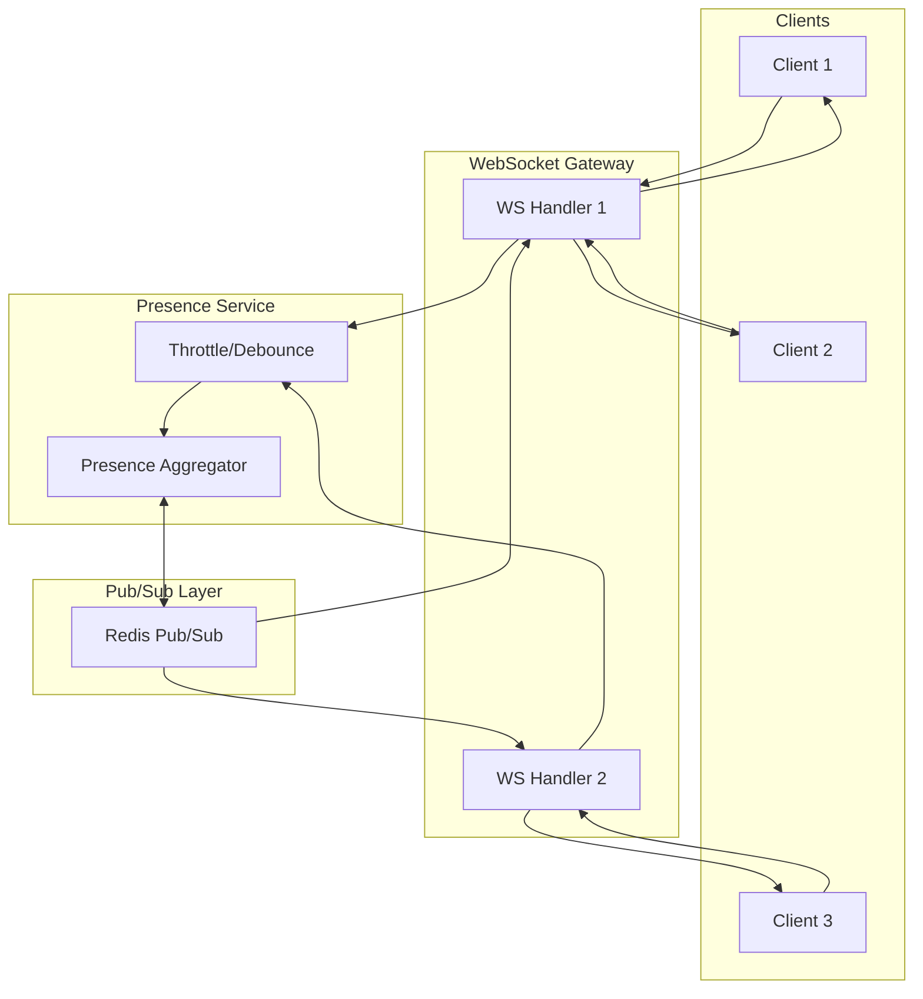

# Presence Service

## Overview

The Presence Service manages ephemeral user state—cursor positions, selections, typing indicators, and active user lists. This is intentionally separate from the edit stream because presence has fundamentally different requirements.

## Why Separate from Edit Stream?

| Aspect | Edit Stream | Presence Stream |
|--------|-------------|-----------------|
| Durability | Must never lose data | Best effort, loss is acceptable |
| Latency | Can batch (50-100ms) | Must be real-time (<50ms) |
| Persistence | Stored forever | Ephemeral (seconds) |
| Protocol | Reliable delivery, ordering | Fire-and-forget UDP-style |
| Recovery | Full replay on reconnect | Just send current state |
| Scale | O(edits) | O(users × update_rate) |

**Key Decision**: Presence is decoupled from edits to prevent presence updates from blocking or delaying edit synchronization.

## Architecture



## Data Model

### Presence State

```typescript
interface UserPresence {
  userId: string;
  documentId: string;
  
  // User identity
  name: string;
  avatar?: string;
  color: string;           // Assigned cursor color
  
  // Cursor state
  cursor?: CursorPosition;
  selection?: SelectionRange;
  
  // Activity indicators
  isTyping: boolean;
  isIdle: boolean;
  
  // Timing
  joinedAt: number;        // When user joined document
  lastActivity: number;    // Last edit/cursor move
  lastHeartbeat: number;   // Connection alive signal
}

interface CursorPosition {
  blockId: string;         // Which block (paragraph, cell, etc.)
  offset: number;          // Character offset within block
  // For rich text, position might also include:
  path?: number[];         // Path through nested structures
}

interface SelectionRange {
  anchor: CursorPosition;  // Where selection started
  focus: CursorPosition;   // Where selection ended
  isBackward: boolean;     // Selection direction
}
```

### Color Assignment

Each user gets a unique color for their cursor:

```typescript
const PRESENCE_COLORS = [
  "#F44336", // Red
  "#2196F3", // Blue
  "#4CAF50", // Green
  "#FF9800", // Orange
  "#9C27B0", // Purple
  "#00BCD4", // Cyan
  "#E91E63", // Pink
  "#8BC34A", // Light Green
  "#FF5722", // Deep Orange
  "#3F51B5", // Indigo
];

function assignColor(userId: string, activeUsers: UserPresence[]): string {
  // Try to give consistent color to same user
  const hash = hashString(userId);
  const preferredIndex = hash % PRESENCE_COLORS.length;
  
  // If preferred color is taken, find next available
  const usedColors = new Set(activeUsers.map(u => u.color));
  
  for (let i = 0; i < PRESENCE_COLORS.length; i++) {
    const index = (preferredIndex + i) % PRESENCE_COLORS.length;
    const color = PRESENCE_COLORS[index];
    if (!usedColors.has(color)) {
      return color;
    }
  }
  
  // All colors used, generate a unique one
  return generateUniqueColor(userId);
}
```

## Protocol

### Presence Update (Client → Server)

Sent when cursor/selection changes:

```typescript
interface PresenceUpdateMessage {
  type: "presence";
  documentId: string;
  cursor?: CursorPosition;
  selection?: SelectionRange;
  isTyping: boolean;
}
```

**Throttling Rules** (client-side):
```typescript
const PRESENCE_THROTTLE = {
  cursorMove: 50,      // Max one update per 50ms for cursor
  selection: 100,      // Max one update per 100ms for selection
  typing: 1000,        // Typing indicator every 1s while typing
  idle: 5000,          // Idle check every 5s
};
```

### Presence Broadcast (Server → Clients)

Server broadcasts aggregated presence to all clients in document:

```typescript
interface PresenceBroadcastMessage {
  type: "presence_update";
  documentId: string;
  presences: UserPresence[];  // Full list of active users
  // OR incremental:
  joined?: UserPresence[];
  left?: string[];            // User IDs
  updated?: UserPresence[];   // Changed presence
}
```

### Heartbeat

Clients send periodic heartbeats to confirm presence:

```typescript
// Client sends every 10 seconds
interface HeartbeatMessage {
  type: "heartbeat";
  documentId: string;
}

// Server tracks last heartbeat per user
// Users without heartbeat for 30s are evicted
```

## Server Implementation

### Presence Aggregator

```typescript
class PresenceAggregator {
  // In-memory store per document
  private presence: Map<string, Map<string, UserPresence>> = new Map();
  private redis: Redis;
  
  async updatePresence(
    docId: string, 
    userId: string, 
    update: Partial<UserPresence>
  ): Promise<void> {
    // Get or create document presence map
    let docPresence = this.presence.get(docId);
    if (!docPresence) {
      docPresence = new Map();
      this.presence.set(docId, docPresence);
    }
    
    // Get or create user presence
    let userPresence = docPresence.get(userId);
    if (!userPresence) {
      userPresence = this.createInitialPresence(userId, docId);
      docPresence.set(userId, userPresence);
      
      // Notify others of join
      await this.broadcastJoin(docId, userPresence);
    }
    
    // Apply update
    Object.assign(userPresence, update, {
      lastActivity: Date.now(),
    });
    
    // Broadcast change
    await this.broadcastUpdate(docId, userPresence);
  }
  
  async removeUser(docId: string, userId: string): Promise<void> {
    const docPresence = this.presence.get(docId);
    if (docPresence) {
      docPresence.delete(userId);
      await this.broadcastLeave(docId, userId);
      
      // Clean up empty documents
      if (docPresence.size === 0) {
        this.presence.delete(docId);
      }
    }
  }
  
  getPresences(docId: string): UserPresence[] {
    const docPresence = this.presence.get(docId);
    return docPresence ? Array.from(docPresence.values()) : [];
  }
}
```

### Redis Pub/Sub for Multi-Server

When running multiple WebSocket gateway servers:

```typescript
class DistributedPresence {
  private redis: Redis;
  private subscriber: Redis;
  private localPresence: PresenceAggregator;
  
  constructor() {
    // Subscribe to presence channel for each document
    this.subscriber.psubscribe("presence:*");
    this.subscriber.on("pmessage", this.handlePresenceMessage.bind(this));
  }
  
  async updatePresence(
    docId: string,
    userId: string,
    update: Partial<UserPresence>
  ): Promise<void> {
    // Update local state
    await this.localPresence.updatePresence(docId, userId, update);
    
    // Publish to other servers
    await this.redis.publish(`presence:${docId}`, JSON.stringify({
      type: "update",
      userId,
      presence: update,
      server: this.serverId,
    }));
  }
  
  private async handlePresenceMessage(
    pattern: string,
    channel: string,
    message: string
  ): Promise<void> {
    const data = JSON.parse(message);
    
    // Ignore messages from self
    if (data.server === this.serverId) return;
    
    const docId = channel.replace("presence:", "");
    
    switch (data.type) {
      case "update":
        await this.localPresence.updatePresence(
          docId, 
          data.userId, 
          data.presence
        );
        break;
      case "leave":
        await this.localPresence.removeUser(docId, data.userId);
        break;
    }
  }
}
```

### Heartbeat and Eviction

```typescript
class PresenceEviction {
  private readonly HEARTBEAT_INTERVAL = 10_000;  // 10s
  private readonly EVICTION_THRESHOLD = 30_000;  // 30s
  
  startEvictionLoop(): void {
    setInterval(() => this.evictStaleUsers(), 5_000);
  }
  
  private async evictStaleUsers(): Promise<void> {
    const now = Date.now();
    
    for (const [docId, docPresence] of this.presence) {
      for (const [userId, presence] of docPresence) {
        const timeSinceHeartbeat = now - presence.lastHeartbeat;
        
        if (timeSinceHeartbeat > this.EVICTION_THRESHOLD) {
          console.log(`Evicting stale user ${userId} from ${docId}`);
          await this.removeUser(docId, userId);
        }
      }
    }
  }
}
```

## Client Implementation

### Presence Manager

```typescript
class PresenceManager {
  private ws: WebSocket;
  private currentPresence: Partial<UserPresence> = {};
  private pendingUpdate: Partial<UserPresence> | null = null;
  private throttleTimer: number | null = null;
  
  readonly THROTTLE_MS = 50;
  readonly HEARTBEAT_MS = 10_000;
  
  constructor(ws: WebSocket) {
    this.ws = ws;
    this.startHeartbeat();
  }
  
  updateCursor(position: CursorPosition): void {
    this.queueUpdate({ cursor: position });
  }
  
  updateSelection(selection: SelectionRange | null): void {
    this.queueUpdate({ selection: selection || undefined });
  }
  
  setTyping(isTyping: boolean): void {
    this.queueUpdate({ isTyping });
  }
  
  private queueUpdate(update: Partial<UserPresence>): void {
    // Merge with pending update
    this.pendingUpdate = { ...this.pendingUpdate, ...update };
    
    // Throttle sends
    if (!this.throttleTimer) {
      this.throttleTimer = setTimeout(() => {
        this.flush();
      }, this.THROTTLE_MS);
    }
  }
  
  private flush(): void {
    if (this.pendingUpdate) {
      this.send(this.pendingUpdate);
      this.currentPresence = { ...this.currentPresence, ...this.pendingUpdate };
      this.pendingUpdate = null;
    }
    this.throttleTimer = null;
  }
  
  private send(presence: Partial<UserPresence>): void {
    this.ws.send(JSON.stringify({
      type: "presence",
      ...presence,
    }));
  }
  
  private startHeartbeat(): void {
    setInterval(() => {
      this.ws.send(JSON.stringify({ type: "heartbeat" }));
    }, this.HEARTBEAT_MS);
  }
}
```

### Rendering Cursors

```typescript
interface RemoteCursor {
  userId: string;
  name: string;
  color: string;
  position: CursorPosition;
}

class CursorRenderer {
  private cursors: Map<string, HTMLElement> = new Map();
  private editor: Editor;
  
  updateCursors(presences: UserPresence[]): void {
    const myUserId = getCurrentUserId();
    
    // Update existing cursors, create new ones
    for (const presence of presences) {
      if (presence.userId === myUserId) continue;  // Skip self
      if (!presence.cursor) continue;
      
      let cursorEl = this.cursors.get(presence.userId);
      
      if (!cursorEl) {
        cursorEl = this.createCursorElement(presence);
        this.cursors.set(presence.userId, cursorEl);
      }
      
      this.positionCursor(cursorEl, presence);
    }
    
    // Remove cursors for users who left
    const activeIds = new Set(presences.map(p => p.userId));
    for (const [userId, element] of this.cursors) {
      if (!activeIds.has(userId)) {
        element.remove();
        this.cursors.delete(userId);
      }
    }
  }
  
  private createCursorElement(presence: UserPresence): HTMLElement {
    const cursor = document.createElement("div");
    cursor.className = "remote-cursor";
    cursor.style.setProperty("--cursor-color", presence.color);
    
    const label = document.createElement("span");
    label.className = "cursor-label";
    label.textContent = presence.name;
    cursor.appendChild(label);
    
    this.editor.container.appendChild(cursor);
    return cursor;
  }
  
  private positionCursor(element: HTMLElement, presence: UserPresence): void {
    const coords = this.editor.positionToCoords(presence.cursor!);
    element.style.transform = `translate(${coords.x}px, ${coords.y}px)`;
    
    // Update typing indicator
    element.classList.toggle("typing", presence.isTyping);
    
    // Update selection highlight if present
    if (presence.selection) {
      this.renderSelection(presence);
    }
  }
}
```

### CSS for Cursors

```css
.remote-cursor {
  position: absolute;
  width: 2px;
  height: 1.2em;
  background-color: var(--cursor-color);
  pointer-events: none;
  z-index: 100;
  transition: transform 50ms ease-out;
}

.remote-cursor .cursor-label {
  position: absolute;
  top: -1.5em;
  left: 0;
  background-color: var(--cursor-color);
  color: white;
  font-size: 0.75em;
  padding: 2px 6px;
  border-radius: 3px;
  white-space: nowrap;
  opacity: 0;
  transition: opacity 200ms;
}

.remote-cursor:hover .cursor-label,
.remote-cursor.recently-moved .cursor-label {
  opacity: 1;
}

.remote-cursor.typing::after {
  content: "";
  position: absolute;
  bottom: -4px;
  left: -2px;
  width: 6px;
  height: 6px;
  background-color: var(--cursor-color);
  border-radius: 50%;
  animation: typing-pulse 1s infinite;
}

@keyframes typing-pulse {
  0%, 100% { transform: scale(1); opacity: 1; }
  50% { transform: scale(1.2); opacity: 0.7; }
}

/* Selection highlight */
.remote-selection {
  background-color: var(--cursor-color);
  opacity: 0.2;
  pointer-events: none;
}
```

## Typing Indicator Logic

### Debouncing Typing State

```typescript
class TypingIndicator {
  private isTyping = false;
  private typingTimeout: number | null = null;
  private readonly TYPING_TIMEOUT = 2000;  // 2s after last keystroke
  
  onKeyPress(): void {
    if (!this.isTyping) {
      this.isTyping = true;
      this.presenceManager.setTyping(true);
    }
    
    // Reset timeout
    if (this.typingTimeout) {
      clearTimeout(this.typingTimeout);
    }
    
    this.typingTimeout = setTimeout(() => {
      this.isTyping = false;
      this.presenceManager.setTyping(false);
    }, this.TYPING_TIMEOUT);
  }
}
```

## Active Users Panel

```typescript
interface ActiveUsersPanelProps {
  presences: UserPresence[];
  maxVisible: number;
}

function ActiveUsersPanel({ presences, maxVisible }: ActiveUsersPanelProps) {
  const visible = presences.slice(0, maxVisible);
  const overflow = presences.length - maxVisible;
  
  return (
    <div className="active-users">
      {visible.map(presence => (
        <div 
          key={presence.userId}
          className="user-avatar"
          style={{ borderColor: presence.color }}
          title={presence.name}
        >
          {presence.avatar ? (
            
          ) : (
            <span>{presence.name[0]}</span>
          )}
          {presence.isTyping && <span className="typing-dot" />}
        </div>
      ))}
      {overflow > 0 && (
        <div className="overflow-indicator">
          +{overflow}
        </div>
      )}
    </div>
  );
}
```

## Scalability Considerations

### Fan-out Optimization

For documents with many users:

```typescript
const FANOUT_STRATEGY = {
  // For small rooms, broadcast everything
  smallRoom: {
    maxUsers: 20,
    strategy: "full_broadcast",
  },
  
  // For medium rooms, throttle presence updates
  mediumRoom: {
    maxUsers: 100,
    strategy: "throttled_broadcast",
    throttleMs: 200,
  },
  
  // For large rooms, only show nearby cursors
  largeRoom: {
    maxUsers: Infinity,
    strategy: "spatial_filtering",
    viewportOnly: true,
  },
};
```

### Spatial Filtering

For very large documents or many users:

```typescript
function filterPresencesByViewport(
  presences: UserPresence[],
  viewport: ViewportRange,
  limit: number
): UserPresence[] {
  // Filter to users in visible area
  const inViewport = presences.filter(p => 
    p.cursor && isInViewport(p.cursor, viewport)
  );
  
  // If still too many, prioritize recent activity
  if (inViewport.length > limit) {
    return inViewport
      .sort((a, b) => b.lastActivity - a.lastActivity)
      .slice(0, limit);
  }
  
  return inViewport;
}
```

## Monitoring

### Key Metrics

| Metric | Description | Alert Threshold |
|--------|-------------|-----------------|
| `presence_update_rate` | Updates/second | > 10,000/s |
| `presence_latency_p99` | Broadcast latency | > 100ms |
| `active_users_per_doc` | Users per document | > 200 |
| `presence_memory_mb` | Memory usage | > 500MB |
| `stale_evictions` | Users evicted/minute | > 100/min |

### Logging

```typescript
// Log presence joins/leaves for debugging
logger.info("presence.join", {
  documentId,
  userId,
  userCount: docPresence.size,
});

logger.info("presence.leave", {
  documentId,
  userId,
  reason: "disconnect" | "eviction" | "explicit",
  sessionDuration: Date.now() - presence.joinedAt,
});
```

## Failure Modes

| Failure | Impact | Mitigation |
|---------|--------|------------|
| Redis Pub/Sub down | Cross-server presence fails | Fallback to local-only |
| High message rate | Presence lag | Aggressive throttling |
| Memory pressure | Service degradation | Evict idle users early |
| Network partition | Split presence views | Users see partial presence |

**Key Principle**: Presence failures should never affect editing. If presence breaks, users can still edit—they just won't see each other's cursors.
