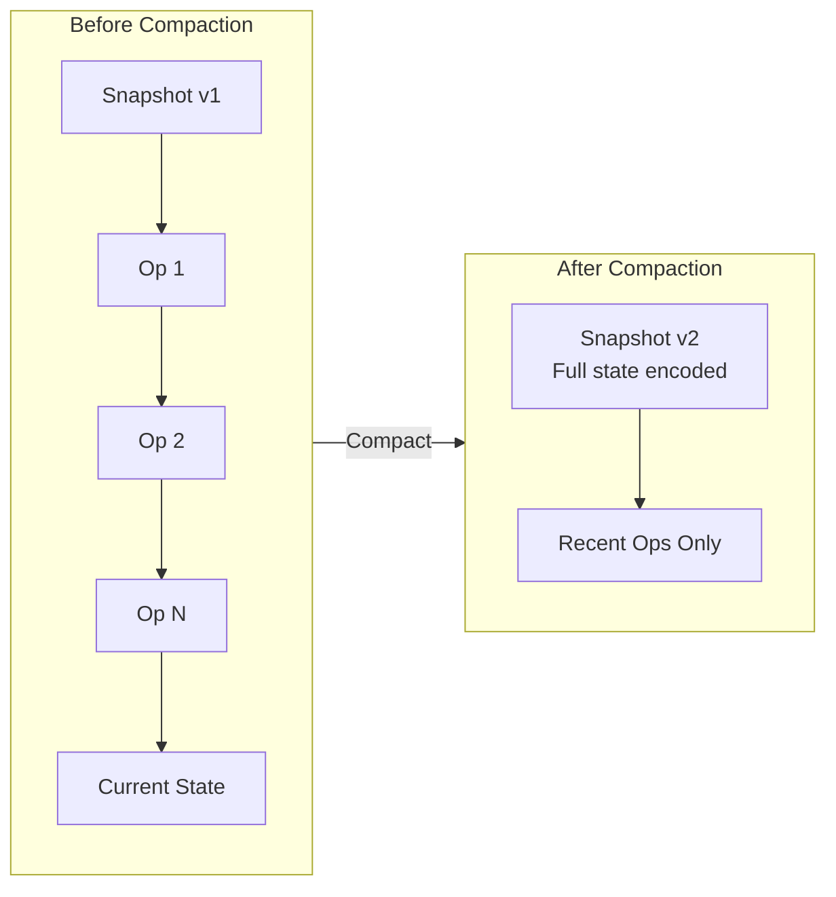
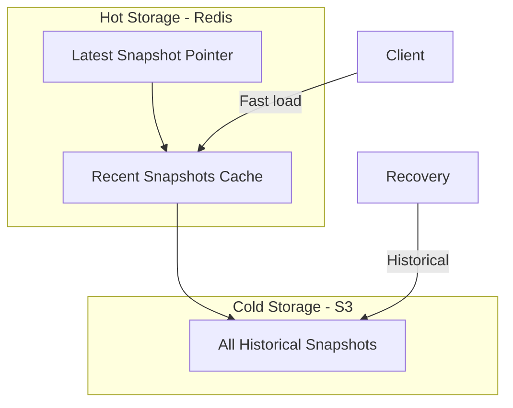
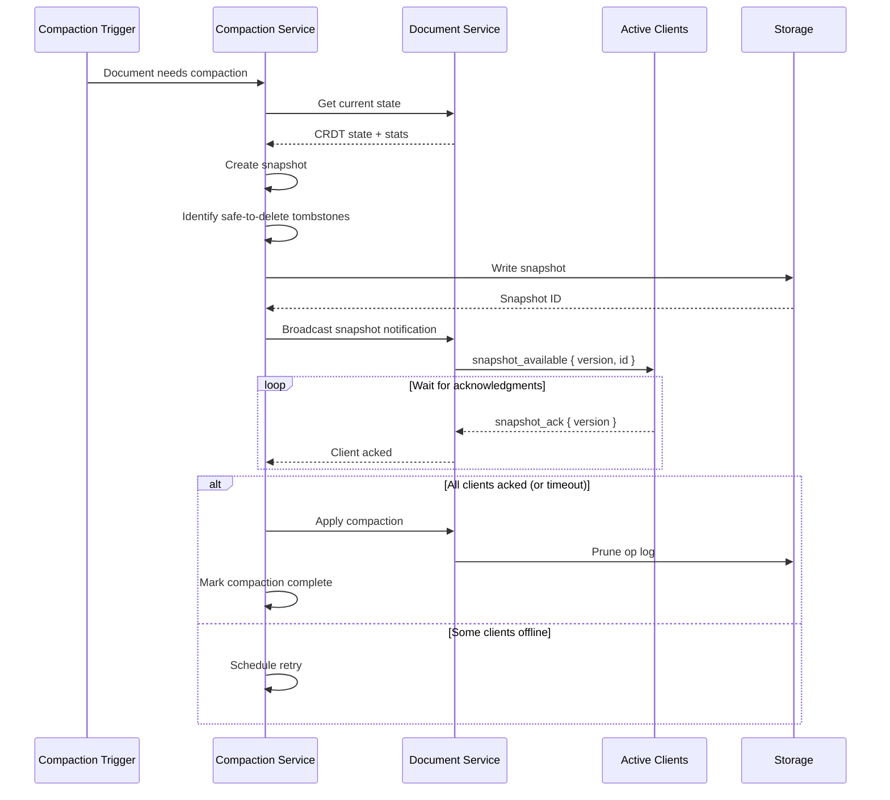
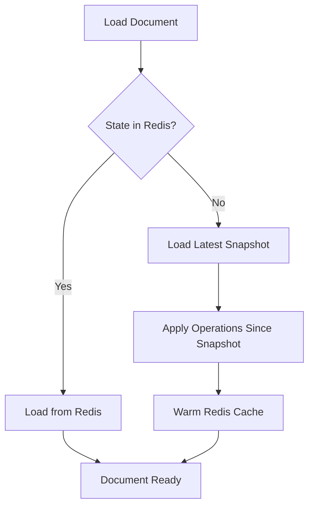
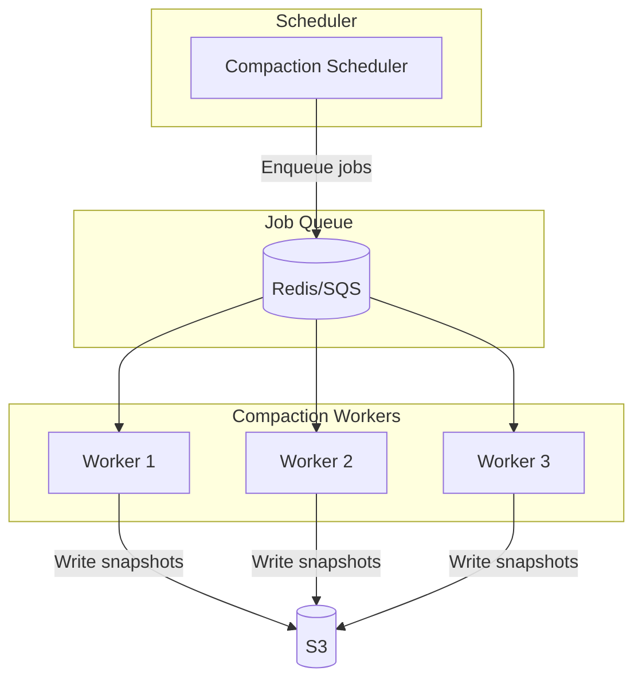

# Snapshot and Compaction

## Overview

CRDTs have a fundamental trade-off: they preserve history for correctness, which causes state to grow unbounded. This document describes how we manage state size through periodic snapshots and garbage collection.

## The Problem

### Why CRDT State Grows

```
Initial document: "Hello"
  - 5 items (H, e, l, l, o)
  - ~125 bytes

After 1000 edits (inserting and deleting):
  - 500 live items
  - 500 tombstones (deleted items)
  - ~25,000 bytes (50x the content size!)
  
After 10,000 edits:
  - Maybe 1000 live items
  - 9000 tombstones
  - ~250,000 bytes (still growing)
```

### Why We Can't Just Delete Tombstones

Tombstones serve critical purposes:
1. **Position anchors**: New inserts reference deleted items as origins
2. **Idempotency**: Duplicate delete operations must be no-ops
3. **Merge correctness**: Concurrent operations rely on tombstones

Deleting tombstones too early causes merge failures.

## Solution: Snapshot + Compaction



**Strategy**:
1. Create full snapshot of current CRDT state
2. Ensure all clients have acknowledged the snapshot
3. Garbage collect tombstones that are no longer needed
4. Prune operation log up to snapshot point

## Snapshot Design

### Snapshot Contents

```typescript
interface Snapshot {
  // Identity
  documentId: string;
  version: number;          // Monotonically increasing
  createdAt: number;
  
  // State
  stateVector: StateVector; // What operations are included
  crdtState: Uint8Array;    // Serialized CRDT (no tombstones)
  
  // Metadata
  contentHash: string;      // For integrity verification
  sizeBytes: number;
  characterCount: number;   // For quick stats
  
  // For recovery
  previousVersion?: number;
  opLogOffset?: string;     // Where to resume from op log
}
```

### Snapshot Serialization

Unlike operational state, snapshots can omit tombstones:

```typescript
function createSnapshot(crdt: CRDT): Uint8Array {
  const buffer = new ArrayBuffer(estimateSize(crdt));
  const writer = new BinaryWriter(buffer);
  
  // Header
  writer.writeUint32(SNAPSHOT_MAGIC);
  writer.writeUint16(SNAPSHOT_VERSION);
  
  // State vector
  const vector = crdt.getStateVector();
  writer.writeStateVector(vector);
  
  // Items (skip tombstones in snapshot)
  const liveItems = crdt.getAllItems().filter(item => !item.deleted);
  
  writer.writeVarUint(liveItems.length);
  for (const item of liveItems) {
    writer.writeItem(item);
  }
  
  // Marks (formatting)
  const marks = crdt.getAllMarks();
  writer.writeVarUint(marks.length);
  for (const mark of marks) {
    writer.writeMark(mark);
  }
  
  return new Uint8Array(buffer, 0, writer.position);
}
```

### Snapshot Storage



**Storage Layout**:
```
s3://snapshots/
  ├── {docId}/
  │   ├── latest.json           # Pointer to latest version
  │   ├── v0001.snapshot.zst    # Compressed snapshot
  │   ├── v0002.snapshot.zst
  │   └── v0003.snapshot.zst
```

## Compaction Process

### When to Compact

```typescript
const COMPACTION_TRIGGERS = {
  // Size-based
  maxStateSize: 10 * 1024 * 1024,      // 10MB CRDT state
  maxTombstoneRatio: 0.5,               // 50% tombstones
  
  // Count-based
  maxOperationsSinceSnapshot: 10_000,
  
  // Time-based
  maxAgeSinceSnapshot: 24 * 60 * 60 * 1000,  // 24 hours
  
  // Activity-based
  inactiveDocumentAge: 7 * 24 * 60 * 60 * 1000,  // 7 days
};

function shouldCompact(doc: DocumentState): boolean {
  const stats = doc.getStats();
  
  return (
    stats.stateSize > COMPACTION_TRIGGERS.maxStateSize ||
    stats.tombstoneRatio > COMPACTION_TRIGGERS.maxTombstoneRatio ||
    stats.opsSinceSnapshot > COMPACTION_TRIGGERS.maxOperationsSinceSnapshot ||
    stats.timeSinceSnapshot > COMPACTION_TRIGGERS.maxAgeSinceSnapshot
  );
}
```

### Compaction Algorithm



### Safe Tombstone Deletion

A tombstone can be deleted if:
1. All clients have seen the deletion (via state vector)
2. No pending operations could reference it as an origin

```typescript
function findDeletableTombstones(
  crdt: CRDT,
  minStateVector: StateVector  // Minimum across all active clients
): ItemID[] {
  const deletable: ItemID[] = [];
  
  for (const item of crdt.getAllItems()) {
    if (!item.deleted) continue;
    
    // Check if all clients have seen this deletion
    const deleteOp = crdt.getDeleteOperation(item.id);
    if (!deleteOp) continue;
    
    const allHaveSeen = isVectorGreaterOrEqual(
      minStateVector,
      { [deleteOp.id.client]: deleteOp.id.clock }
    );
    
    if (allHaveSeen) {
      // Check if any pending ops could reference this
      const couldBeReferenced = crdt.hasPendingReferenceTo(item.id);
      
      if (!couldBeReferenced) {
        deletable.push(item.id);
      }
    }
  }
  
  return deletable;
}
```

### Client Acknowledgment Protocol

```typescript
// Server → Client
interface SnapshotNotification {
  type: "snapshot_available";
  documentId: string;
  version: number;
  stateVector: StateVector;
}

// Client → Server  
interface SnapshotAck {
  type: "snapshot_ack";
  documentId: string;
  version: number;
}

// Client behavior
async function handleSnapshotNotification(
  notification: SnapshotNotification
): Promise<void> {
  const localVector = this.crdt.getStateVector();
  
  // Check if we have all operations in the snapshot
  if (isVectorGreaterOrEqual(localVector, notification.stateVector)) {
    // We're caught up, safe to acknowledge
    this.send({ 
      type: "snapshot_ack", 
      documentId: notification.documentId,
      version: notification.version 
    });
  } else {
    // Need to sync first
    await this.sync();
    this.send({ 
      type: "snapshot_ack", 
      documentId: notification.documentId,
      version: notification.version 
    });
  }
}
```

## Recovery from Snapshot

### Loading a Document



```typescript
async function loadDocument(docId: string): Promise<CRDT> {
  // Try hot cache first
  const cached = await redis.get(`doc:${docId}:state`);
  if (cached) {
    return CRDT.deserialize(cached);
  }
  
  // Load from snapshot
  const snapshot = await loadLatestSnapshot(docId);
  const crdt = CRDT.fromSnapshot(snapshot.crdtState);
  
  // Apply operations since snapshot
  const ops = await opLog.getSince(docId, snapshot.stateVector);
  for (const op of ops) {
    crdt.apply(op);
  }
  
  // Warm cache
  await redis.set(`doc:${docId}:state`, crdt.serialize(), "EX", 3600);
  
  return crdt;
}
```

### Snapshot Integrity

```typescript
async function verifySnapshot(snapshot: Snapshot): Promise<boolean> {
  // 1. Check magic number and version
  if (!isValidFormat(snapshot)) {
    return false;
  }
  
  // 2. Verify content hash
  const computedHash = await crypto.subtle.digest(
    "SHA-256",
    snapshot.crdtState
  );
  if (toHex(computedHash) !== snapshot.contentHash) {
    return false;
  }
  
  // 3. Verify CRDT can be deserialized
  try {
    const crdt = CRDT.deserialize(snapshot.crdtState);
    crdt.validate();  // Check internal consistency
  } catch (e) {
    return false;
  }
  
  return true;
}
```

## Operation Log Management

### Log Structure

```typescript
interface OperationLogEntry {
  documentId: string;
  operation: Operation;
  clientId: number;
  clock: number;
  timestamp: number;
  snapshotVersion?: number;  // Which snapshot this is relative to
}
```

### Log Pruning

After snapshot is acknowledged by all clients:

```typescript
async function pruneOperationLog(
  docId: string,
  snapshotVector: StateVector
): Promise<void> {
  // Keep some buffer for late-arriving clients
  const BUFFER_TIME = 24 * 60 * 60 * 1000;  // 24 hours
  const cutoffTime = Date.now() - BUFFER_TIME;
  
  // Delete operations that are:
  // 1. Included in snapshot (based on state vector)
  // 2. Older than buffer time
  await opLog.deleteWhere(docId, (op) => {
    const inSnapshot = snapshotVector[op.clientId] >= op.clock;
    const oldEnough = op.timestamp < cutoffTime;
    return inSnapshot && oldEnough;
  });
}
```

## Compaction Service Architecture

### Service Design

```typescript
class CompactionService {
  private scheduler: CompactionScheduler;
  private worker: CompactionWorker;
  
  async start(): Promise<void> {
    // Periodic check for documents needing compaction
    this.scheduler.start(async () => {
      const candidates = await this.findCompactionCandidates();
      
      for (const docId of candidates) {
        await this.worker.enqueue(docId);
      }
    }, COMPACTION_CHECK_INTERVAL);
    
    // Worker processes compaction jobs
    this.worker.start();
  }
  
  private async findCompactionCandidates(): Promise<string[]> {
    // Query documents with high tombstone ratio or large state
    return await this.db.query(`
      SELECT document_id 
      FROM document_stats
      WHERE 
        tombstone_ratio > 0.5
        OR state_size_bytes > 10000000
        OR ops_since_snapshot > 10000
        OR last_snapshot_at < NOW() - INTERVAL '24 hours'
      ORDER BY 
        tombstone_ratio DESC,
        state_size_bytes DESC
      LIMIT 100
    `);
  }
}
```

### Distributed Compaction

For large scale, compaction is distributed:



### Locking

Prevent concurrent compaction of same document:

```typescript
async function acquireCompactionLock(docId: string): Promise<Lock | null> {
  const lockKey = `compaction:lock:${docId}`;
  const lockValue = generateLockId();
  const ttl = 300;  // 5 minutes
  
  const acquired = await redis.set(lockKey, lockValue, "NX", "EX", ttl);
  
  if (acquired) {
    return {
      key: lockKey,
      value: lockValue,
      release: async () => {
        // Only release if we still own it
        await redis.eval(
          `if redis.call("get", KEYS[1]) == ARGV[1] then
             return redis.call("del", KEYS[1])
           end`,
          1, lockKey, lockValue
        );
      },
    };
  }
  
  return null;
}
```

## Monitoring and Alerting

### Key Metrics

| Metric | Description | Alert Threshold |
|--------|-------------|-----------------|
| `document_state_size_bytes` | CRDT state size | > 50MB |
| `document_tombstone_ratio` | Tombstones / total items | > 0.7 |
| `compaction_duration_seconds` | Time to compact | > 60s |
| `snapshot_age_hours` | Time since last snapshot | > 48h |
| `compaction_failures` | Failed compaction jobs | > 5/hour |
| `snapshot_load_time_ms` | Time to load snapshot | > 5000ms |

### Dashboard Queries

```sql
-- Documents needing urgent compaction
SELECT 
  document_id,
  state_size_bytes / 1024 / 1024 as size_mb,
  tombstone_ratio,
  ops_since_snapshot,
  NOW() - last_snapshot_at as snapshot_age
FROM document_stats
WHERE 
  state_size_bytes > 50000000  -- 50MB
  OR tombstone_ratio > 0.7
ORDER BY state_size_bytes DESC;

-- Compaction job health
SELECT 
  DATE_TRUNC('hour', completed_at) as hour,
  COUNT(*) as jobs,
  AVG(duration_seconds) as avg_duration,
  SUM(CASE WHEN status = 'failed' THEN 1 ELSE 0 END) as failures
FROM compaction_jobs
WHERE completed_at > NOW() - INTERVAL '24 hours'
GROUP BY 1
ORDER BY 1;
```

## Emergency Compaction

For documents that have grown dangerously large:

```typescript
async function emergencyCompaction(docId: string): Promise<void> {
  console.warn(`Emergency compaction triggered for ${docId}`);
  
  // 1. Block new writes temporarily
  await documentService.setReadOnly(docId, true);
  
  // 2. Force snapshot regardless of client acks
  const snapshot = await createSnapshot(docId);
  await saveSnapshot(snapshot);
  
  // 3. Aggressive tombstone cleanup (may cause issues for offline clients)
  await aggressiveCleanup(docId, snapshot.stateVector);
  
  // 4. Re-enable writes
  await documentService.setReadOnly(docId, false);
  
  // 5. Notify affected clients to resync
  await broadcastResyncRequired(docId);
}
```

## Failure Scenarios

| Scenario | Impact | Mitigation |
|----------|--------|------------|
| Snapshot write fails | Old snapshot still valid | Retry with exponential backoff |
| Snapshot corrupted | Can't load document | Keep multiple historical snapshots |
| Compaction interrupted | Partial cleanup | Idempotent operations, can retry |
| Client never acks | Can't prune old ops | Timeout, force compaction after threshold |
| Op log grows unbounded | Storage exhaustion | Emergency compaction, backpressure |

## Configuration

```yaml
compaction:
  # Triggers
  max_state_size_mb: 10
  max_tombstone_ratio: 0.5
  max_ops_since_snapshot: 10000
  max_hours_since_snapshot: 24
  
  # Behavior
  check_interval_seconds: 300
  ack_timeout_seconds: 3600
  min_ack_percentage: 0.9  # 90% of clients must ack
  
  # Retention
  snapshot_retention_days: 90
  op_log_buffer_hours: 24
  
  # Emergency
  emergency_size_mb: 50
  emergency_tombstone_ratio: 0.8
```
