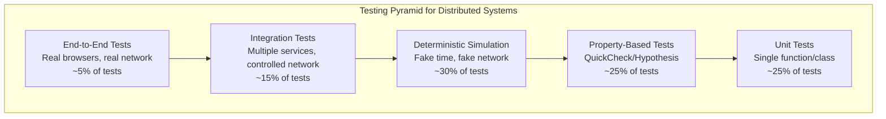
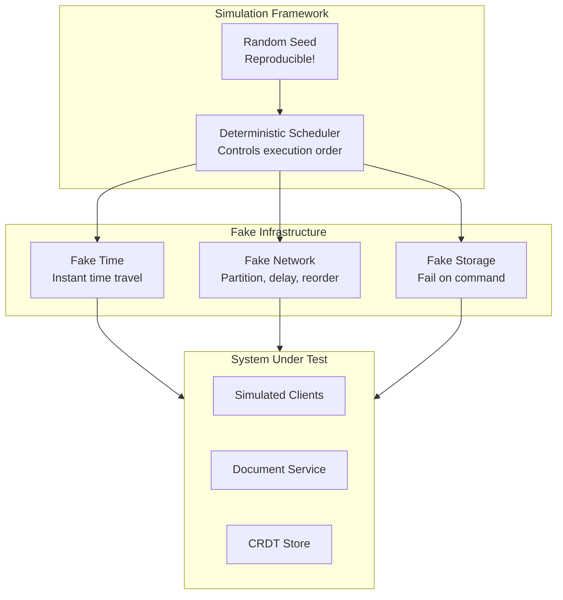

# Testing Strategy

## Overview

Testing a collaborative editor is fundamentally harder than testing typical applications because:
1. **Concurrency**: Multiple users editing simultaneously
2. **Distribution**: State spread across many machines
3. **Asynchrony**: Network delays, reordering, partitions
4. **Non-determinism**: Real-world timing is unpredictable

This document describes a comprehensive testing strategy that prioritizes **correctness over coverage** and uses techniques proven in distributed systems like FoundationDB.

## Testing Pyramid



## Unit Testing

### What to Unit Test

| Component | Tests |
|-----------|-------|
| CRDT Operations | Insert, delete, mark, merge |
| State Vector | Comparison, merging, serialization |
| Batching | Buffer management, flush triggers |
| Serialization | Encode/decode roundtrip |
| Conflict Resolution | Tie-breaking, ordering |

### Example: CRDT Insert

```typescript
describe("CRDT.insert", () => {
  it("inserts at beginning of empty document", () => {
    const crdt = new CRDT();
    crdt.insert(0, "a");
    
    expect(crdt.toString()).toBe("a");
    expect(crdt.length).toBe(1);
  });
  
  it("inserts at end", () => {
    const crdt = new CRDT();
    crdt.insert(0, "a");
    crdt.insert(1, "b");
    
    expect(crdt.toString()).toBe("ab");
  });
  
  it("inserts in middle", () => {
    const crdt = new CRDT();
    crdt.insert(0, "ac");
    crdt.insert(1, "b");
    
    expect(crdt.toString()).toBe("abc");
  });
  
  it("handles concurrent inserts at same position", () => {
    const crdt1 = new CRDT({ clientId: 1 });
    const crdt2 = new CRDT({ clientId: 2 });
    
    // Both insert at position 0 in empty doc
    const op1 = crdt1.insert(0, "a");
    const op2 = crdt2.insert(0, "b");
    
    // Apply in different orders
    crdt1.apply(op2);
    crdt2.apply(op1);
    
    // Must converge to same result
    expect(crdt1.toString()).toBe(crdt2.toString());
  });
});
```

### Example: State Vector Comparison

```typescript
describe("StateVector", () => {
  describe("isGreaterOrEqual", () => {
    it("returns true when all clocks are >=", () => {
      const a = { 1: 5, 2: 3 };
      const b = { 1: 4, 2: 2 };
      
      expect(isGreaterOrEqual(a, b)).toBe(true);
    });
    
    it("returns false when any clock is less", () => {
      const a = { 1: 5, 2: 1 };
      const b = { 1: 4, 2: 2 };
      
      expect(isGreaterOrEqual(a, b)).toBe(false);
    });
    
    it("handles missing clients", () => {
      const a = { 1: 5 };
      const b = { 1: 4, 2: 2 };
      
      // a is missing client 2, so it's behind
      expect(isGreaterOrEqual(a, b)).toBe(false);
    });
  });
});
```

## Property-Based Testing

Property-based testing (PBT) is **essential** for CRDT correctness. Instead of testing specific cases, we test invariants that must hold for all inputs.

### Key Properties

#### 1. Convergence (Strong Eventual Consistency)

```python
from hypothesis import given, strategies as st
from hypothesis.stateful import RuleBasedStateMachine, rule, invariant

class CRDTConvergence(RuleBasedStateMachine):
    def __init__(self):
        super().__init__()
        self.replica1 = CRDT(client_id=1)
        self.replica2 = CRDT(client_id=2)
        self.ops1 = []  # Ops generated by replica1
        self.ops2 = []  # Ops generated by replica2
    
    @rule(pos=st.integers(min_value=0), char=st.text(min_size=1, max_size=10))
    def insert_replica1(self, pos, char):
        pos = pos % (len(self.replica1) + 1)
        op = self.replica1.insert(pos, char)
        self.ops1.append(op)
    
    @rule(pos=st.integers(min_value=0), char=st.text(min_size=1, max_size=10))
    def insert_replica2(self, pos, char):
        pos = pos % (len(self.replica2) + 1)
        op = self.replica2.insert(pos, char)
        self.ops2.append(op)
    
    @rule()
    def sync_1_to_2(self):
        for op in self.ops1:
            self.replica2.apply(op)
    
    @rule()
    def sync_2_to_1(self):
        for op in self.ops2:
            self.replica1.apply(op)
    
    @invariant()
    def converged_after_sync(self):
        # After syncing all ops, replicas must match
        r1_synced = self.replica1.clone()
        r2_synced = self.replica2.clone()
        
        for op in self.ops2:
            r1_synced.apply(op)
        for op in self.ops1:
            r2_synced.apply(op)
        
        assert r1_synced.to_string() == r2_synced.to_string()

# Run 1000 examples
TestConvergence = CRDTConvergence.TestCase
```

#### 2. Commutativity

```python
@given(
    initial=st.text(max_size=100),
    ops_a=st.lists(operations(), min_size=1, max_size=50),
    ops_b=st.lists(operations(), min_size=1, max_size=50)
)
def test_commutativity(initial, ops_a, ops_b):
    """Operations must commute: apply(a, b) = apply(b, a)"""
    crdt1 = CRDT.from_string(initial)
    crdt2 = CRDT.from_string(initial)
    
    # Apply ops_a then ops_b
    for op in ops_a:
        crdt1.apply(op)
    for op in ops_b:
        crdt1.apply(op)
    
    # Apply ops_b then ops_a
    for op in ops_b:
        crdt2.apply(op)
    for op in ops_a:
        crdt2.apply(op)
    
    assert crdt1.to_string() == crdt2.to_string()
```

#### 3. Idempotency

```python
@given(
    initial=st.text(max_size=100),
    op=operations()
)
def test_idempotency(initial, op):
    """Applying same operation twice has same effect as once"""
    crdt = CRDT.from_string(initial)
    
    crdt.apply(op)
    state_after_one = crdt.to_string()
    
    crdt.apply(op)  # Apply again
    state_after_two = crdt.to_string()
    
    assert state_after_one == state_after_two
```

#### 4. Intention Preservation

```python
@given(
    initial=st.text(max_size=100),
    insert_pos=st.integers(min_value=0),
    insert_char=st.text(min_size=1, max_size=1),
    concurrent_ops=st.lists(operations(), max_size=20)
)
def test_intention_preservation(initial, insert_pos, insert_char, concurrent_ops):
    """User's inserted character must appear in final document"""
    insert_pos = insert_pos % (len(initial) + 1)
    
    crdt = CRDT.from_string(initial)
    
    # User inserts character
    user_op = crdt.insert(insert_pos, insert_char)
    
    # Concurrent ops from others
    for op in concurrent_ops:
        crdt.apply(op)
    
    # The inserted character must still be present
    assert insert_char in crdt.to_string()
```

### Custom Generators

```python
@st.composite
def operations(draw):
    """Generate random CRDT operations"""
    op_type = draw(st.sampled_from(["insert", "delete", "mark"]))
    
    if op_type == "insert":
        return InsertOp(
            client_id=draw(st.integers(1, 100)),
            clock=draw(st.integers(0, 10000)),
            position=draw(st.integers(0, 1000)),
            content=draw(st.text(min_size=1, max_size=10)),
        )
    elif op_type == "delete":
        return DeleteOp(
            client_id=draw(st.integers(1, 100)),
            clock=draw(st.integers(0, 10000)),
            target_id=draw(item_ids()),
        )
    else:
        return MarkOp(
            client_id=draw(st.integers(1, 100)),
            clock=draw(st.integers(0, 10000)),
            start_id=draw(item_ids()),
            end_id=draw(item_ids()),
            mark_type=draw(st.sampled_from(["bold", "italic", "underline"])),
        )

@st.composite  
def item_ids(draw):
    """Generate valid ItemIDs"""
    return ItemID(
        client=draw(st.integers(1, 100)),
        clock=draw(st.integers(0, 10000)),
    )
```

## Deterministic Simulation Testing

Inspired by FoundationDB's legendary testing approach. The key insight: **make all non-determinism controllable**.

### Architecture



### Fake Time

```typescript
class FakeTime {
  private currentTime: number = 0;
  private timers: PriorityQueue<Timer> = new PriorityQueue();
  
  now(): number {
    return this.currentTime;
  }
  
  setTimeout(callback: () => void, delay: number): number {
    const timer = {
      id: this.nextId++,
      fireAt: this.currentTime + delay,
      callback,
    };
    this.timers.push(timer);
    return timer.id;
  }
  
  advance(ms: number): void {
    const targetTime = this.currentTime + ms;
    
    while (this.timers.peek()?.fireAt <= targetTime) {
      const timer = this.timers.pop()!;
      this.currentTime = timer.fireAt;
      timer.callback();
    }
    
    this.currentTime = targetTime;
  }
  
  advanceToNextTimer(): void {
    if (this.timers.isEmpty()) return;
    const timer = this.timers.pop()!;
    this.currentTime = timer.fireAt;
    timer.callback();
  }
}
```

### Fake Network

```typescript
class FakeNetwork {
  private messages: Message[] = [];
  private partitions: Set<string> = new Set();  // "a->b" means a can't reach b
  private random: SeededRandom;
  
  constructor(seed: number) {
    this.random = new SeededRandom(seed);
  }
  
  send(from: string, to: string, message: any): void {
    if (this.isPartitioned(from, to)) {
      // Message lost
      return;
    }
    
    // Random delay (0-100ms simulated)
    const delay = this.random.nextInt(0, 100);
    
    // Random reordering (5% chance)
    const reorder = this.random.nextFloat() < 0.05;
    
    this.messages.push({
      from,
      to,
      message,
      deliverAt: fakeTime.now() + delay,
      priority: reorder ? this.random.nextFloat() : 0,
    });
  }
  
  partition(a: string, b: string): void {
    this.partitions.add(`${a}->${b}`);
    this.partitions.add(`${b}->${a}`);
  }
  
  heal(a: string, b: string): void {
    this.partitions.delete(`${a}->${b}`);
    this.partitions.delete(`${b}->${a}`);
  }
  
  deliverPendingMessages(): Message[] {
    const now = fakeTime.now();
    const ready = this.messages
      .filter(m => m.deliverAt <= now)
      .sort((a, b) => a.priority - b.priority);
    
    this.messages = this.messages.filter(m => m.deliverAt > now);
    return ready;
  }
  
  private isPartitioned(from: string, to: string): boolean {
    return this.partitions.has(`${from}->${to}`);
  }
}
```

### Simulation Test Example

```typescript
describe("Simulation: Network Partition", () => {
  it("converges after partition heals", async () => {
    const seed = 12345;
    const sim = new Simulation(seed);
    
    // Setup: 3 clients, 1 server
    const server = sim.createServer();
    const client1 = sim.createClient("user1");
    const client2 = sim.createClient("user2");
    const client3 = sim.createClient("user3");
    
    // Initial document
    await sim.connect(client1, server);
    await client1.insert(0, "Hello");
    await sim.sync();
    
    // Connect other clients
    await sim.connect(client2, server);
    await sim.connect(client3, server);
    await sim.sync();
    
    // Create partition: client1 isolated
    sim.network.partition("client1", "server");
    
    // Concurrent edits during partition
    await client1.insert(5, " World");     // Isolated edit
    await client2.insert(5, " Universe");  // Gets synced to server and client3
    
    // Advance time, sync what we can
    await sim.advanceTime(5000);
    await sim.sync();
    
    // Verify partition effects
    expect(client1.document.toString()).toBe("Hello World");
    expect(client2.document.toString()).toBe("Hello Universe");
    expect(client3.document.toString()).toBe("Hello Universe");
    
    // Heal partition
    sim.network.heal("client1", "server");
    
    // Sync everything
    await sim.advanceTime(1000);
    await sim.sync();
    
    // All must converge
    const final1 = client1.document.toString();
    const final2 = client2.document.toString();
    const final3 = client3.document.toString();
    
    expect(final1).toBe(final2);
    expect(final2).toBe(final3);
    
    // Both edits must be present
    expect(final1).toContain("World");
    expect(final1).toContain("Universe");
  });
});
```

### Chaos Scenarios

```typescript
const CHAOS_SCENARIOS = [
  {
    name: "random_partitions",
    async run(sim: Simulation) {
      for (let i = 0; i < 10; i++) {
        const [a, b] = sim.randomPair();
        sim.network.partition(a, b);
        await sim.advanceTime(sim.random.nextInt(100, 5000));
        sim.network.heal(a, b);
      }
    },
  },
  
  {
    name: "message_storm",
    async run(sim: Simulation) {
      // All clients typing furiously
      for (let i = 0; i < 100; i++) {
        const client = sim.randomClient();
        const pos = sim.random.nextInt(0, client.document.length);
        await client.insert(pos, sim.random.nextChar());
        await sim.advanceTime(sim.random.nextInt(10, 100));
      }
    },
  },
  
  {
    name: "server_restart",
    async run(sim: Simulation) {
      await sim.advanceTime(1000);
      
      // Kill server
      await sim.server.stop();
      
      // Clients continue editing offline
      for (const client of sim.clients) {
        await client.insert(0, "offline_");
      }
      
      await sim.advanceTime(5000);
      
      // Restart server
      await sim.server.start();
      
      // Reconnect all clients
      for (const client of sim.clients) {
        await sim.connect(client, sim.server);
      }
    },
  },
  
  {
    name: "slow_client",
    async run(sim: Simulation) {
      // One client has 10x latency
      const slowClient = sim.randomClient();
      sim.network.setLatency(slowClient.id, 1000);
      
      // Normal editing
      for (let i = 0; i < 50; i++) {
        const client = sim.randomClient();
        await client.insert(0, sim.random.nextChar());
        await sim.advanceTime(100);
      }
    },
  },
];

// Run all scenarios with many seeds
describe("Chaos Testing", () => {
  for (const scenario of CHAOS_SCENARIOS) {
    for (let seed = 0; seed < 1000; seed++) {
      it(`${scenario.name} (seed=${seed})`, async () => {
        const sim = new Simulation(seed);
        await sim.setup();
        await scenario.run(sim);
        await sim.sync();
        
        // Verify convergence
        sim.assertConvergence();
      });
    }
  }
});
```

## Fuzzing

### Fuzz Targets

```typescript
// 1. CRDT deserialize - corrupt binary data
fuzz("crdt_deserialize", (data: Uint8Array) => {
  try {
    const crdt = CRDT.deserialize(data);
    crdt.validate();  // Should not crash
  } catch (e) {
    // Expected for invalid data
    if (!(e instanceof DeserializationError)) {
      throw e;  // Unexpected error type
    }
  }
});

// 2. Operation merge - random operations
fuzz("crdt_merge", (ops: Operation[]) => {
  const crdt = new CRDT();
  for (const op of ops) {
    crdt.apply(op);  // Should not crash or corrupt state
  }
  crdt.validate();
});

// 3. Sync protocol - malformed messages
fuzz("sync_protocol", (messages: Uint8Array[]) => {
  const handler = new SyncProtocolHandler();
  for (const msg of messages) {
    try {
      handler.handleMessage(msg);
    } catch (e) {
      if (!(e instanceof ProtocolError)) {
        throw e;
      }
    }
  }
});

// 4. Snapshot - corrupt snapshot data
fuzz("snapshot_load", (data: Uint8Array) => {
  try {
    const snapshot = Snapshot.deserialize(data);
    const crdt = CRDT.fromSnapshot(snapshot);
    crdt.validate();
  } catch (e) {
    if (!(e instanceof SnapshotError)) {
      throw e;
    }
  }
});
```

### Structure-Aware Fuzzing

```typescript
// Generate valid-ish operations that are more likely to find bugs
function mutateOperation(op: Operation, random: Random): Operation {
  const mutation = random.choose([
    // Mutate client ID
    () => ({ ...op, id: { ...op.id, client: random.nextInt(0, 1000) } }),
    
    // Mutate clock (potentially out of order)
    () => ({ ...op, id: { ...op.id, clock: random.nextInt(0, 10000) } }),
    
    // Mutate origin to invalid ID
    () => ({ ...op, origin: { client: 999, clock: 999999 } }),
    
    // Mutate content to edge cases
    () => ({ ...op, content: random.choose(["", "\0", "\n".repeat(1000), "🎉"]) }),
  ]);
  
  return mutation();
}
```

## Integration Testing

### Test Harness

```typescript
class IntegrationTestHarness {
  private docker: DockerCompose;
  private clients: TestClient[] = [];
  
  async setup(): Promise<void> {
    // Start dependencies
    await this.docker.up({
      services: ["redis", "kafka", "postgres"],
    });
    
    // Start our services
    await this.docker.up({
      services: ["document-service", "presence-service", "ws-gateway"],
    });
    
    // Wait for health checks
    await this.waitForHealthy();
  }
  
  async teardown(): Promise<void> {
    await this.docker.down();
  }
  
  createClient(): TestClient {
    const client = new TestClient(this.wsUrl);
    this.clients.push(client);
    return client;
  }
}
```

### Integration Test Examples

```typescript
describe("Integration: Multi-client Editing", () => {
  let harness: IntegrationTestHarness;
  
  beforeAll(async () => {
    harness = new IntegrationTestHarness();
    await harness.setup();
  });
  
  afterAll(async () => {
    await harness.teardown();
  });
  
  it("three clients edit same document", async () => {
    const docId = "test-doc-" + uuid();
    
    const client1 = harness.createClient();
    const client2 = harness.createClient();
    const client3 = harness.createClient();
    
    // Connect all clients
    await Promise.all([
      client1.connect(docId),
      client2.connect(docId),
      client3.connect(docId),
    ]);
    
    // Each client inserts different text
    await client1.insert(0, "AAA");
    await client2.insert(0, "BBB");
    await client3.insert(0, "CCC");
    
    // Wait for sync
    await harness.waitForSync();
    
    // All clients should have same content
    const content1 = await client1.getContent();
    const content2 = await client2.getContent();
    const content3 = await client3.getContent();
    
    expect(content1).toBe(content2);
    expect(content2).toBe(content3);
    expect(content1).toContain("AAA");
    expect(content1).toContain("BBB");
    expect(content1).toContain("CCC");
  });
  
  it("survives server restart", async () => {
    const docId = "test-doc-" + uuid();
    const client = harness.createClient();
    
    await client.connect(docId);
    await client.insert(0, "Before restart");
    await harness.waitForSync();
    
    // Restart document service
    await harness.docker.restart("document-service");
    await harness.waitForHealthy();
    
    // Client reconnects
    await client.reconnect();
    
    // Content should be preserved
    const content = await client.getContent();
    expect(content).toBe("Before restart");
    
    // Should be able to continue editing
    await client.insert(content.length, " and after");
    await harness.waitForSync();
    
    expect(await client.getContent()).toBe("Before restart and after");
  });
});
```

## End-to-End Testing

### Browser-Based Tests

```typescript
import { test, expect } from "@playwright/test";

test.describe("Collaborative Editing E2E", () => {
  test("two browsers can edit together", async ({ browser }) => {
    // Open document in two browser contexts
    const context1 = await browser.newContext();
    const context2 = await browser.newContext();
    
    const page1 = await context1.newPage();
    const page2 = await context2.newPage();
    
    const docUrl = "http://localhost:3000/doc/test-" + Date.now();
    
    await page1.goto(docUrl);
    await page2.goto(docUrl);
    
    // Wait for editors to load
    await page1.waitForSelector(".editor-ready");
    await page2.waitForSelector(".editor-ready");
    
    // User 1 types
    await page1.click(".editor");
    await page1.keyboard.type("Hello from user 1");
    
    // Wait for sync
    await page2.waitForFunction(
      () => document.querySelector(".editor")?.textContent?.includes("Hello"),
      { timeout: 5000 }
    );
    
    // User 2 types
    await page2.click(".editor");
    await page2.keyboard.press("End");
    await page2.keyboard.type(" and user 2");
    
    // Wait for sync back
    await page1.waitForFunction(
      () => document.querySelector(".editor")?.textContent?.includes("user 2"),
      { timeout: 5000 }
    );
    
    // Verify both see same content
    const content1 = await page1.textContent(".editor");
    const content2 = await page2.textContent(".editor");
    
    expect(content1).toBe(content2);
    expect(content1).toContain("Hello from user 1 and user 2");
  });
  
  test("cursor positions are visible", async ({ browser }) => {
    const context1 = await browser.newContext();
    const context2 = await browser.newContext();
    
    const page1 = await context1.newPage();
    const page2 = await context2.newPage();
    
    const docUrl = "http://localhost:3000/doc/cursor-test-" + Date.now();
    
    await page1.goto(docUrl);
    await page2.goto(docUrl);
    
    // User 1 clicks in editor
    await page1.click(".editor");
    
    // User 2 should see user 1's cursor
    await page2.waitForSelector(".remote-cursor", { timeout: 5000 });
    
    const cursorVisible = await page2.isVisible(".remote-cursor");
    expect(cursorVisible).toBe(true);
  });
});
```

## Performance Testing

### Benchmarks

```typescript
describe("Performance Benchmarks", () => {
  it("handles 10000 sequential inserts", async () => {
    const crdt = new CRDT();
    const start = performance.now();
    
    for (let i = 0; i < 10000; i++) {
      crdt.insert(i, "x");
    }
    
    const duration = performance.now() - start;
    
    expect(duration).toBeLessThan(1000);  // Under 1 second
    expect(crdt.length).toBe(10000);
  });
  
  it("merges 1000 concurrent operations quickly", async () => {
    const crdt1 = new CRDT({ clientId: 1 });
    const crdt2 = new CRDT({ clientId: 2 });
    
    // Generate 500 ops each
    const ops1 = [];
    const ops2 = [];
    
    for (let i = 0; i < 500; i++) {
      ops1.push(crdt1.insert(i, "a"));
      ops2.push(crdt2.insert(i, "b"));
    }
    
    const start = performance.now();
    
    // Cross-merge
    for (const op of ops2) crdt1.apply(op);
    for (const op of ops1) crdt2.apply(op);
    
    const duration = performance.now() - start;
    
    expect(duration).toBeLessThan(500);  // Under 500ms
    expect(crdt1.toString()).toBe(crdt2.toString());
  });
});
```

### Soak Testing

Long-running tests to find memory leaks and degradation:

```typescript
describe("Soak Tests", () => {
  it("memory stable over 1 hour simulation", async () => {
    const sim = new Simulation(42);
    await sim.setup();
    
    const initialMemory = process.memoryUsage().heapUsed;
    const memorySnapshots = [initialMemory];
    
    // Simulate 1 hour of editing (compressed time)
    for (let minute = 0; minute < 60; minute++) {
      // Simulate 1 minute of activity
      for (let i = 0; i < 100; i++) {
        const client = sim.randomClient();
        await client.insert(0, sim.random.nextChar());
      }
      
      await sim.sync();
      
      // Periodic compaction
      if (minute % 10 === 0) {
        await sim.compact();
      }
      
      memorySnapshots.push(process.memoryUsage().heapUsed);
    }
    
    // Memory should not grow more than 2x
    const maxMemory = Math.max(...memorySnapshots);
    expect(maxMemory).toBeLessThan(initialMemory * 2);
  });
});
```

## Test Matrix

| Test Type | What | When | Duration |
|-----------|------|------|----------|
| Unit | Individual functions | Every commit | <10s |
| Property | CRDT invariants | Every commit | <1min |
| Simulation (small) | 100 seeds | Every commit | <5min |
| Simulation (full) | 10,000 seeds | Nightly | ~2hrs |
| Integration | Service contracts | Every PR | <10min |
| E2E | User flows | Every PR | <5min |
| Performance | Benchmarks | Every PR | <2min |
| Soak | Memory/stability | Weekly | ~4hrs |
| Fuzzing | Security/robustness | Continuous | Ongoing |

## CI Configuration

```yaml
# .github/workflows/test.yml
name: Tests

on: [push, pull_request]

jobs:
  unit:
    runs-on: ubuntu-latest
    steps:
      - uses: actions/checkout@v3
      - run: npm test -- --unit

  property:
    runs-on: ubuntu-latest
    steps:
      - uses: actions/checkout@v3
      - run: npm test -- --property --examples=1000

  simulation:
    runs-on: ubuntu-latest
    steps:
      - uses: actions/checkout@v3
      - run: npm test -- --simulation --seeds=100

  integration:
    runs-on: ubuntu-latest
    services:
      redis:
        image: redis:7
        ports: [6379:6379]
    steps:
      - uses: actions/checkout@v3
      - run: docker-compose up -d
      - run: npm test -- --integration

  e2e:
    runs-on: ubuntu-latest
    steps:
      - uses: actions/checkout@v3
      - run: npx playwright install
      - run: npm test -- --e2e

  nightly-simulation:
    runs-on: ubuntu-latest
    if: github.event_name == 'schedule'
    steps:
      - uses: actions/checkout@v3
      - run: npm test -- --simulation --seeds=10000
```

## Debugging Failed Tests

### Reproducing Simulation Failures

```typescript
// Every simulation test logs its seed
// To reproduce a failure:
it("reproduces seed 12345", async () => {
  const sim = new Simulation(12345);  // Use exact seed
  await sim.setup();
  
  // Run same scenario
  await chaos.messageStorm(sim);
  
  sim.assertConvergence();
});
```

### Shrinking

Property-based tests automatically shrink failing cases:

```
Original failure: 847 operations
Shrunk to: 3 operations
  1. Insert("a", 0) from client 1
  2. Insert("b", 0) from client 2  
  3. Delete(item_1) from client 1

This is the minimal case that reproduces the bug.
```
