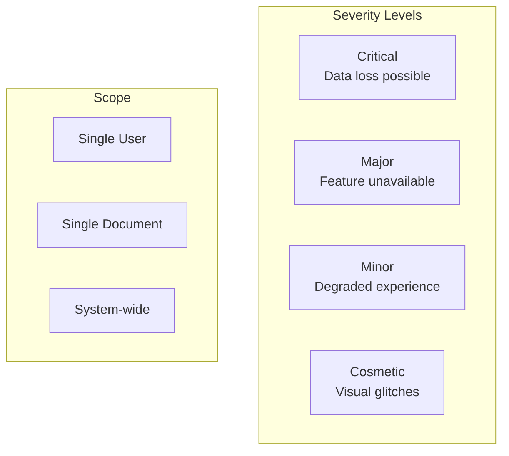
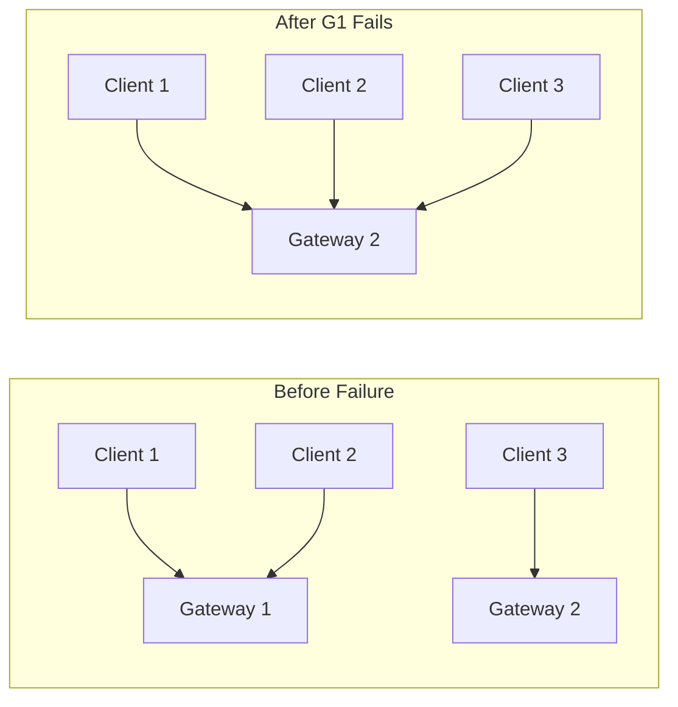
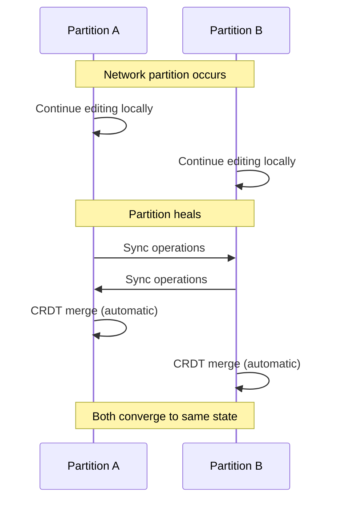

# Failure Modes and Mitigations

## Overview

This document catalogs failure modes in the collaborative editor system and their mitigations. The goal is **graceful degradation**—the system should continue providing value even when components fail.

## Failure Classification



## Client-Side Failures

### F1: Browser Tab Crash

| Aspect | Details |
|--------|---------|
| Severity | Minor |
| Scope | Single User |
| Detection | N/A (browser handles) |
| Impact | User loses unsaved work since last sync |

**Mitigation**:
```typescript
// Persist to IndexedDB before every batch send
async function onLocalOperation(op: Operation): Promise<void> {
  // 1. Apply to local CRDT
  this.crdt.apply(op);
  
  // 2. Persist immediately (before network)
  await this.indexedDB.saveState(this.crdt);
  await this.indexedDB.enqueueOperation(op);
  
  // 3. Then attempt network send
  this.syncEngine.queueOperation(op);
}

// On page load, recover from IndexedDB
async function onPageLoad(): Promise<void> {
  const savedState = await this.indexedDB.loadState(docId);
  if (savedState) {
    this.crdt = CRDT.deserialize(savedState);
    console.log("Recovered from local storage");
  }
}
```

### F2: IndexedDB Failure

| Aspect | Details |
|--------|---------|
| Severity | Major |
| Scope | Single User |
| Detection | Storage API errors |
| Impact | No offline support, potential data loss |

**Mitigation**:
```typescript
async function saveToIndexedDB(state: Uint8Array): Promise<void> {
  try {
    await this.db.put("documents", { id: docId, state });
  } catch (error) {
    if (error.name === "QuotaExceededError") {
      // Try to free space
      await this.evictOldDocuments();
      await this.db.put("documents", { id: docId, state });
    } else if (error.name === "InvalidStateError") {
      // DB closed unexpectedly, reconnect
      await this.reconnectDB();
      await this.db.put("documents", { id: docId, state });
    } else {
      // Fall back to in-memory only
      console.error("IndexedDB unavailable:", error);
      this.offlineEnabled = false;
      this.notifyUser("Offline mode unavailable. Changes saved to server only.");
    }
  }
}
```

### F3: WebSocket Connection Lost

| Aspect | Details |
|--------|---------|
| Severity | Minor |
| Scope | Single User |
| Detection | WebSocket close event, ping timeout |
| Impact | Can't sync, can't see others |

**Mitigation**:
```typescript
class ConnectionManager {
  private reconnectAttempts = 0;
  private readonly MAX_RECONNECT_DELAY = 30000;
  
  onDisconnect(event: CloseEvent): void {
    this.state = "disconnected";
    this.ui.showOfflineIndicator();
    
    // User can continue editing locally
    this.scheduleReconnect();
  }
  
  private scheduleReconnect(): void {
    const delay = Math.min(
      1000 * Math.pow(1.5, this.reconnectAttempts),
      this.MAX_RECONNECT_DELAY
    );
    
    // Add jitter to prevent thundering herd
    const jitter = delay * 0.3 * Math.random();
    
    setTimeout(() => this.attemptReconnect(), delay + jitter);
    this.reconnectAttempts++;
  }
  
  private async attemptReconnect(): Promise<void> {
    try {
      await this.connect();
      this.reconnectAttempts = 0;
      await this.performSync();
      this.ui.hideOfflineIndicator();
    } catch (error) {
      this.scheduleReconnect();
    }
  }
}
```

### F4: Client Clock Skew

| Aspect | Details |
|--------|---------|
| Severity | Minor |
| Scope | Single User |
| Detection | Server timestamp comparison |
| Impact | Incorrect causal ordering display |

**Mitigation**:
```typescript
// On connect, calculate clock offset
async function calibrateClock(serverTime: number): Promise<void> {
  const clientTime = Date.now();
  this.clockOffset = serverTime - clientTime;
  
  // Warn if severe skew
  if (Math.abs(this.clockOffset) > 60000) {  // 1 minute
    console.warn(`Clock skew detected: ${this.clockOffset}ms`);
    this.ui.showClockWarning();
  }
}

// Use adjusted time for display
function getAdjustedTime(): number {
  return Date.now() + this.clockOffset;
}
```

## Server-Side Failures

### F5: WebSocket Gateway Crash

| Aspect | Details |
|--------|---------|
| Severity | Major |
| Scope | Users on that gateway |
| Detection | Health check failure |
| Impact | Users disconnect, must reconnect |

**Mitigation**:


**Implementation**:
```typescript
// Load balancer health check
app.get("/health", (req, res) => {
  const healthy = 
    this.wsServer.isRunning() &&
    this.redis.isConnected() &&
    this.connectionCount < MAX_CONNECTIONS;
  
  res.status(healthy ? 200 : 503).json({ healthy });
});

// Graceful shutdown
process.on("SIGTERM", async () => {
  // Stop accepting new connections
  this.wsServer.stopAccepting();
  
  // Notify existing clients to reconnect elsewhere
  for (const client of this.clients) {
    client.send({ type: "reconnect_required", reason: "server_shutdown" });
  }
  
  // Wait for clients to disconnect
  await this.waitForDrain(30000);
  
  process.exit(0);
});
```

### F6: Document Service Crash

| Aspect | Details |
|--------|---------|
| Severity | Major |
| Scope | Requests to that instance |
| Detection | Service health check |
| Impact | Sync delays, potential message loss |

**Mitigation**:
```typescript
// Document service is stateless - just restart
// Operations are persisted before acknowledgment

async function handleOperations(batch: Operation[]): Promise<void> {
  // 1. Validate
  this.validate(batch);
  
  // 2. Persist to durable log FIRST
  await this.opLog.append(batch);
  
  // 3. Then update in-memory state
  await this.crdtStore.merge(batch);
  
  // 4. Then broadcast
  await this.broadcast(batch);
  
  // 5. Then acknowledge
  return { success: true };
}

// If crash after step 2 but before step 5:
// - Client will retry (operations are idempotent)
// - Recovery replays from op log
```

### F7: Redis (CRDT Store) Failure

| Aspect | Details |
|--------|---------|
| Severity | Critical |
| Scope | All documents |
| Detection | Redis connection error |
| Impact | Can't merge or sync operations |

**Mitigation**:
```typescript
// Primary mitigation: Redis Cluster with replication
const redisCluster = new Redis.Cluster([
  { host: "redis-1", port: 6379 },
  { host: "redis-2", port: 6379 },
  { host: "redis-3", port: 6379 },
], {
  scaleReads: "slave",
  retryStrategy: (times) => Math.min(times * 100, 3000),
});

// Fallback: Reconstruct from op log
async function handleRedisMiss(docId: string): Promise<CRDT> {
  // Load latest snapshot
  const snapshot = await this.s3.getLatestSnapshot(docId);
  const crdt = CRDT.fromSnapshot(snapshot);
  
  // Apply operations since snapshot
  const ops = await this.opLog.getSince(docId, snapshot.stateVector);
  for (const op of ops) {
    crdt.apply(op);
  }
  
  // Repopulate Redis
  await this.redis.set(`doc:${docId}:state`, crdt.serialize());
  
  return crdt;
}
```

### F8: Kafka (Op Log) Failure

| Aspect | Details |
|--------|---------|
| Severity | Critical |
| Scope | All documents |
| Detection | Kafka producer errors |
| Impact | Operations not durably stored |

**Mitigation**:
```typescript
// Kafka is configured for high durability
const producer = kafka.producer({
  acks: -1,  // Wait for all replicas
  retries: 10,
  idempotent: true,
});

// If Kafka is completely down, queue operations
class OperationBuffer {
  private buffer: Operation[] = [];
  private kafkaHealthy = true;
  
  async append(ops: Operation[]): Promise<void> {
    if (this.kafkaHealthy) {
      try {
        await this.kafka.send(ops);
      } catch (error) {
        this.kafkaHealthy = false;
        this.buffer.push(...ops);
        this.startHealthCheck();
      }
    } else {
      this.buffer.push(...ops);
      
      if (this.buffer.length > 10000) {
        // Apply backpressure
        throw new Error("Operation log unavailable, please retry later");
      }
    }
  }
  
  private async drainBuffer(): Promise<void> {
    while (this.buffer.length > 0) {
      const batch = this.buffer.splice(0, 100);
      await this.kafka.send(batch);
    }
  }
}
```

### F9: S3 (Snapshot Store) Failure

| Aspect | Details |
|--------|---------|
| Severity | Major |
| Scope | Document loading, compaction |
| Detection | S3 API errors |
| Impact | Slow document loads, no compaction |

**Mitigation**:
```typescript
// Document loading: Fall back to op log
async function loadDocument(docId: string): Promise<CRDT> {
  try {
    // Try snapshot first
    const snapshot = await this.s3.getSnapshot(docId);
    return CRDT.fromSnapshot(snapshot);
  } catch (error) {
    console.warn("Snapshot unavailable, reconstructing from op log");
    
    // Full reconstruction (slow but works)
    const crdt = new CRDT();
    const ops = await this.opLog.getAll(docId);
    for (const op of ops) {
      crdt.apply(op);
    }
    return crdt;
  }
}

// Compaction: Skip if S3 is down
async function maybeCompact(docId: string): Promise<void> {
  if (!this.s3.isHealthy()) {
    console.warn("Skipping compaction: S3 unavailable");
    return;
  }
  
  await this.compact(docId);
}
```

## Distributed System Failures

### F10: Network Partition

| Aspect | Details |
|--------|---------|
| Severity | Major |
| Scope | Partitioned users |
| Detection | Heartbeat timeouts |
| Impact | Divergent edits during partition |

**Mitigation**:


**Key Point**: CRDTs guarantee convergence after partition heals. No manual intervention required.

### F11: Split Brain (Document Service)

| Aspect | Details |
|--------|---------|
| Severity | Critical |
| Scope | Affected documents |
| Detection | Conflicting state vectors |
| Impact | Temporary inconsistency |

**Mitigation**:
```typescript
// Use consistent hashing to route documents to services
// Each document is owned by one service instance

const documentRing = new ConsistentHash({
  nodes: discoveredServices,
  replicas: 100,
});

async function routeRequest(docId: string): Promise<ServiceNode> {
  return documentRing.getNode(docId);
}

// On service failure, ring automatically rebalances
documentRing.on("nodeRemoved", (node) => {
  // Documents assigned to failed node get reassigned
  // Load from snapshot + op log to recover state
});
```

### F12: Message Reordering

| Aspect | Details |
|--------|---------|
| Severity | Low |
| Scope | Single user |
| Detection | State vector gaps |
| Impact | Temporary out-of-order display |

**Mitigation**:
```typescript
// Buffer out-of-order messages
class MessageOrderer {
  private buffer: Map<string, Operation[]> = new Map();
  private expectedClock: Map<number, number> = new Map();
  
  receive(op: Operation): Operation[] {
    const clientId = op.id.client;
    const expectedClock = this.expectedClock.get(clientId) ?? 0;
    
    if (op.id.clock === expectedClock) {
      // In order, apply immediately
      this.expectedClock.set(clientId, expectedClock + 1);
      
      // Check buffer for now-applicable ops
      return [op, ...this.drainBuffer(clientId)];
    } else if (op.id.clock > expectedClock) {
      // Out of order, buffer it
      this.bufferOp(op);
      return [];
    } else {
      // Already seen, ignore (idempotent)
      return [];
    }
  }
  
  private drainBuffer(clientId: number): Operation[] {
    const result: Operation[] = [];
    let expected = this.expectedClock.get(clientId)!;
    
    while (true) {
      const buffered = this.getBuffered(clientId, expected);
      if (!buffered) break;
      
      result.push(buffered);
      this.removeBuffered(clientId, expected);
      expected++;
    }
    
    this.expectedClock.set(clientId, expected);
    return result;
  }
}
```

### F13: Message Duplication

| Aspect | Details |
|--------|---------|
| Severity | Low |
| Scope | Single user |
| Detection | Duplicate operation ID |
| Impact | None (CRDT is idempotent) |

**Mitigation**:
```typescript
// CRDTs are inherently idempotent
function applyOperation(op: Operation): void {
  const existingItem = this.items.get(op.id);
  
  if (existingItem) {
    // Already applied, skip
    return;
  }
  
  // Apply the operation
  this.items.set(op.id, this.createItem(op));
  this.integrateItem(op);
}
```

## Data Integrity Failures

### F14: CRDT State Corruption

| Aspect | Details |
|--------|---------|
| Severity | Critical |
| Scope | Single document |
| Detection | Validation failures, merge errors |
| Impact | Document may become uneditable |

**Mitigation**:
```typescript
// Regular integrity checks
function validateState(): void {
  // 1. Check item connectivity
  for (const item of this.items.values()) {
    if (item.left && !this.items.has(item.left)) {
      throw new IntegrityError("Dangling left reference");
    }
    if (item.right && !this.items.has(item.right)) {
      throw new IntegrityError("Dangling right reference");
    }
  }
  
  // 2. Check no cycles
  const visited = new Set<ItemID>();
  for (const item of this.items.values()) {
    this.detectCycle(item, visited);
  }
  
  // 3. Verify state vector consistency
  for (const item of this.items.values()) {
    const clock = this.stateVector[item.id.client] ?? -1;
    if (item.id.clock > clock) {
      throw new IntegrityError("State vector inconsistent");
    }
  }
}

// Recovery: Restore from last known good snapshot
async function recoverFromCorruption(docId: string): Promise<CRDT> {
  // Try progressively older snapshots
  const snapshots = await this.s3.listSnapshots(docId, { limit: 10 });
  
  for (const snapshot of snapshots) {
    try {
      const crdt = CRDT.fromSnapshot(snapshot);
      crdt.validate();
      
      // Apply ops since this snapshot
      const ops = await this.opLog.getSince(docId, snapshot.stateVector);
      for (const op of ops) {
        crdt.apply(op);
        crdt.validate();  // Validate after each op
      }
      
      return crdt;
    } catch (error) {
      console.warn(`Snapshot ${snapshot.version} invalid, trying older`);
    }
  }
  
  throw new UnrecoverableError("All snapshots corrupt");
}
```

### F15: Snapshot Corruption

| Aspect | Details |
|--------|---------|
| Severity | Major |
| Scope | Single document |
| Detection | Checksum mismatch, deserialization error |
| Impact | Slow document loads |

**Mitigation**:
```typescript
// Snapshots include checksums
interface Snapshot {
  data: Uint8Array;
  checksum: string;  // SHA-256
  version: number;
}

async function loadSnapshot(docId: string, version: number): Promise<CRDT> {
  const snapshot = await this.s3.get(`${docId}/${version}.snapshot`);
  
  // Verify checksum
  const computed = await sha256(snapshot.data);
  if (computed !== snapshot.checksum) {
    // Try previous snapshot
    return this.loadSnapshot(docId, version - 1);
  }
  
  return CRDT.deserialize(snapshot.data);
}

// Keep multiple snapshot generations
const SNAPSHOT_RETENTION = 10;  // Keep last 10 snapshots
```

## Operational Failures

### F16: Runaway Compaction

| Aspect | Details |
|--------|---------|
| Severity | Major |
| Scope | System resources |
| Detection | CPU/memory spike |
| Impact | Performance degradation |

**Mitigation**:
```typescript
class CompactionRateLimiter {
  private activeCompactions = 0;
  private readonly MAX_CONCURRENT = 5;
  
  async compact(docId: string): Promise<void> {
    if (this.activeCompactions >= this.MAX_CONCURRENT) {
      // Queue for later
      await this.queue.push(docId);
      return;
    }
    
    this.activeCompactions++;
    try {
      await this.doCompaction(docId);
    } finally {
      this.activeCompactions--;
      this.processQueue();
    }
  }
}

// Resource limits per compaction
const COMPACTION_LIMITS = {
  maxDuration: 60000,      // 1 minute timeout
  maxMemory: 500_000_000,  // 500MB
  maxCPU: 0.5,             // 50% of one core
};
```

### F17: Operation Log Growth

| Aspect | Details |
|--------|---------|
| Severity | Critical |
| Scope | Storage costs, load times |
| Detection | Log size metrics |
| Impact | Slow recovery, high storage costs |

**Mitigation**:
```typescript
// Aggressive compaction for large logs
async function checkLogSize(docId: string): Promise<void> {
  const stats = await this.opLog.getStats(docId);
  
  if (stats.size > 100_000_000) {  // 100MB
    // Emergency compaction
    await this.compactor.compactUrgent(docId);
    
    // Alert ops team
    this.alerts.send({
      severity: "warning",
      message: `Large op log for ${docId}: ${stats.size} bytes`,
    });
  }
  
  if (stats.size > 500_000_000) {  // 500MB
    // Force compaction, may block writes temporarily
    await this.compactor.compactBlocking(docId);
    
    this.alerts.send({
      severity: "critical",
      message: `Critical op log size for ${docId}`,
    });
  }
}
```

## Failure Response Playbook

### Automated Responses

| Failure | Detection | Response |
|---------|-----------|----------|
| Gateway down | Health check | Route to healthy gateways |
| High latency | P99 > 500ms | Scale out document service |
| Redis memory high | Memory > 80% | Trigger compaction wave |
| Error rate spike | Errors > 1% | Alert + auto-scale |

### Manual Intervention Required

| Failure | Symptoms | Actions |
|---------|----------|---------|
| Data corruption | Validation errors | Restore from snapshot, investigate root cause |
| Split brain | Conflicting state vectors | Force reconciliation, may need manual merge |
| Kafka total failure | All producers failing | Switch to degraded mode (no durability) |
| DDoS | Connection flood | Enable rate limiting, block IPs |

## Monitoring and Alerting

### Key Alerts

```yaml
alerts:
  - name: sync_latency_high
    condition: p99(sync_latency) > 500ms for 5m
    severity: warning
    action: Scale document service
    
  - name: error_rate_high
    condition: error_rate > 1% for 5m
    severity: critical
    action: Page on-call
    
  - name: redis_memory_high
    condition: redis_memory_percent > 80%
    severity: warning
    action: Trigger compaction
    
  - name: kafka_lag_high
    condition: kafka_consumer_lag > 10000 for 5m
    severity: critical
    action: Scale consumers, investigate
    
  - name: document_corruption
    condition: validation_errors > 0
    severity: critical
    action: Page on-call, isolate document
```

### Dashboard Panels

1. **System Health**: Service status, connection counts
2. **Sync Performance**: Latency percentiles, throughput
3. **Storage**: Redis memory, Kafka lag, S3 usage
4. **Errors**: Error rates by type, affected documents
5. **Compaction**: Queue depth, success rate, duration

## Disaster Recovery

### RPO and RTO Targets

| Scenario | RPO | RTO |
|----------|-----|-----|
| Single node failure | 0 | <1 min |
| AZ failure | 0 | <5 min |
| Region failure | <1 min | <30 min |
| Data corruption | <1 hour | <1 hour |

### Backup Strategy

```typescript
const BACKUP_STRATEGY = {
  // Continuous backup via Kafka
  opLog: {
    retention: "7 days",
    replication: 3,
  },
  
  // Hourly snapshots
  snapshots: {
    frequency: "hourly",
    retention: "90 days",
    crossRegion: true,
  },
  
  // Daily full backups
  fullBackup: {
    frequency: "daily",
    retention: "1 year",
    encryption: "AES-256",
  },
};
```
