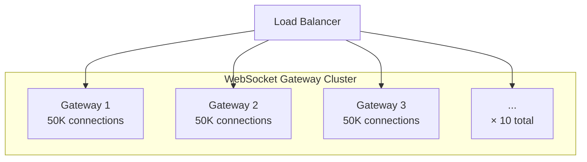
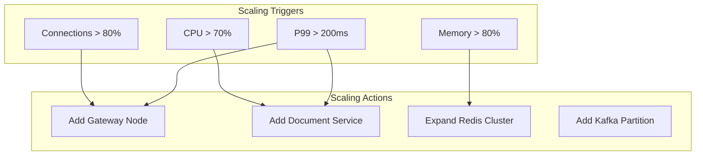
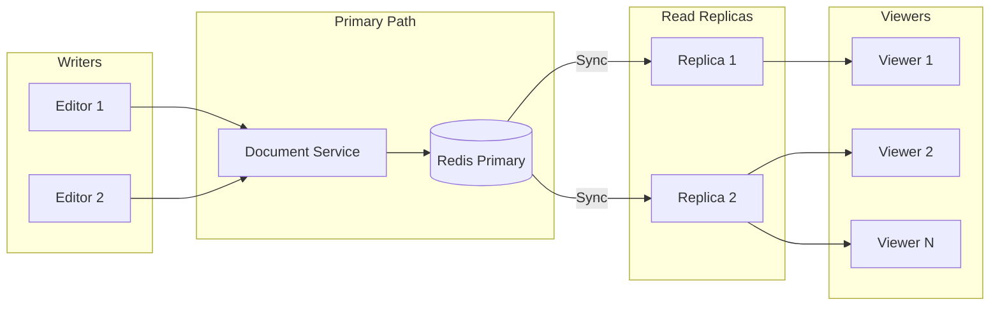

# Capacity Planning

## Overview

This document provides capacity planning estimates for the collaborative editor system at medium scale (10-100 concurrent editors per document).

## Scale Parameters

### Target Scale

| Parameter | Value | Notes |
|-----------|-------|-------|
| Active documents | 10,000 | Documents with active editors |
| Concurrent editors per doc | 50 (avg), 100 (max) | Google Docs-like scale |
| Total concurrent users | 500,000 | 10,000 × 50 |
| Operations per user | 2/second | Including cursor movements |
| Document size | 100KB (avg), 10MB (max) | Text content only |

### Growth Projections

| Timeframe | Users | Documents | Operations/sec |
|-----------|-------|-----------|----------------|
| Launch | 50,000 | 1,000 | 100,000 |
| 6 months | 200,000 | 5,000 | 400,000 |
| 1 year | 500,000 | 10,000 | 1,000,000 |
| 2 years | 2,000,000 | 50,000 | 4,000,000 |

## Traffic Estimates

### Operations

```
Operations/second = Active docs × Editors/doc × Ops/user
                  = 10,000 × 50 × 2
                  = 1,000,000 ops/sec
```

### Bandwidth

**Inbound (operations)**:
```
Op size = ~100 bytes (average)
Inbound = 1,000,000 × 100 bytes = 100 MB/sec
```

**Outbound (broadcast)**:
```
Each op is broadcast to ~49 other users in the document
Fan-out factor = 49
Outbound = 1,000,000 × 49 × 100 bytes = 4.9 GB/sec
```

### WebSocket Connections

```
Connections = Active documents × Editors/doc
            = 10,000 × 50
            = 500,000 connections
```

### Presence Updates

```
Presence updates = Users × Update rate
                 = 500,000 × 10/sec (throttled)
                 = 5,000,000 updates/sec (before throttling)
                 
With throttling (10 updates/sec max):
Actual = ~500,000 updates/sec
```

## Storage Estimates

### CRDT State (Redis)

```
Per document:
  - CRDT state: 2.5MB average (25 bytes × 100K chars)
  - State vector: ~1KB
  - Recent ops buffer: ~100KB
  Total: ~2.6MB per active document

Total Redis: 10,000 × 2.6MB = 26GB
With overhead: ~50GB
```

### Operation Log (Kafka)

```
Operations/day = 1,000,000 × 86,400 = 86.4 billion ops
Op size = 100 bytes
Daily volume = 8.64 TB

Retention: 7 days
Total Kafka storage = 8.64 × 7 = 60.5 TB
```

### Snapshots (S3)

```
Snapshots per document = 1 every 24 hours
Snapshot size = ~1MB (compressed)

Daily snapshots = 10,000 × 1MB = 10GB
90-day retention = 900GB
```

## Infrastructure Sizing

### WebSocket Gateway



**Sizing**:
```
Connections per gateway = 50,000
Total gateways needed = 500,000 / 50,000 = 10 nodes

Instance type: c6i.2xlarge (8 vCPU, 16GB RAM)
  - CPU: WebSocket handling, SSL termination
  - RAM: Connection state, buffers

With 50% headroom: 15 nodes
```

### Document Service

```
Operations per service = 100,000/sec
Service instances needed = 1,000,000 / 100,000 = 10 nodes

Instance type: c6i.4xlarge (16 vCPU, 32GB RAM)
  - CPU: CRDT merge operations
  - RAM: Document state cache

With 50% headroom: 15 nodes
```

### Presence Service

```
Updates per service = 100,000/sec
Service instances needed = 500,000 / 100,000 = 5 nodes

Instance type: c6i.xlarge (4 vCPU, 8GB RAM)
  - Lightweight, mostly passing messages

With headroom: 8 nodes
```

### Redis Cluster

```
Memory required: 50GB
Redis Cluster: 6 nodes (3 primary + 3 replica)
  - Each primary: ~20GB data
  - Instance: r6g.xlarge (32GB RAM)

Operations: ~2M reads + 1M writes per second
  - Well within Redis Cluster capacity
```

### Kafka Cluster

```
Throughput: 100 MB/sec inbound, 5 GB/sec outbound (consumers)
Storage: 60 TB (7-day retention)

Kafka Cluster:
  - 12 brokers
  - Instance: i3.2xlarge (8 vCPU, 61GB RAM, 1.9TB NVMe)
  - Replication factor: 3
  - Partitions: 100 (for parallelism)
```

### Infrastructure Summary

| Component | Nodes | Instance Type | Monthly Cost (est.) |
|-----------|-------|---------------|---------------------|
| WebSocket Gateway | 15 | c6i.2xlarge | $4,500 |
| Document Service | 15 | c6i.4xlarge | $9,000 |
| Presence Service | 8 | c6i.xlarge | $1,200 |
| Redis Cluster | 6 | r6g.xlarge | $2,400 |
| Kafka Cluster | 12 | i3.2xlarge | $12,000 |
| Load Balancer | 2 | ALB | $500 |
| S3 (snapshots) | - | - | $500 |
| **Total** | **58** | - | **~$30,000/month** |

## Performance Targets

### Latency

| Operation | P50 | P99 | Max |
|-----------|-----|-----|-----|
| Local operation apply | <1ms | <5ms | <10ms |
| Network round-trip | <50ms | <100ms | <500ms |
| Sync (reconnect) | <500ms | <2s | <10s |
| Document load (cold) | <1s | <3s | <10s |
| Document load (warm) | <100ms | <500ms | <1s |

### Throughput

| Metric | Target |
|--------|--------|
| Operations/sec (system) | 1,000,000 |
| Operations/sec (per document) | 10,000 |
| Concurrent connections | 500,000 |
| Presence updates/sec | 500,000 |

### Availability

| Metric | Target |
|--------|--------|
| Uptime | 99.9% (8.76 hours downtime/year) |
| Data durability | 99.999999999% (11 nines) |
| Recovery Time (node failure) | <1 minute |
| Recovery Time (AZ failure) | <5 minutes |

## Scaling Strategies

### Horizontal Scaling



### Document Sharding

For very hot documents (viral, company all-hands):

```typescript
// Shard large rooms across multiple servers
interface DocumentShard {
  docId: string;
  shardId: number;
  userRange: [number, number];  // User IDs in this shard
  server: string;
}

// Operations are broadcast between shards
class ShardedDocument {
  private shards: DocumentShard[];
  
  async broadcastOperation(op: Operation): Promise<void> {
    // Broadcast to all shards
    await Promise.all(
      this.shards.map(shard => 
        this.sendToShard(shard, op)
      )
    );
  }
}
```

### Read Replicas

For documents with many viewers (100+ read-only users):



## Cost Optimization

### Spot Instances

Use spot instances for:
- Compaction workers (interruptible)
- Development/staging environments
- Batch processing

**Savings**: 60-70% vs on-demand

### Reserved Instances

For steady-state workload:
- Document Service (always running)
- WebSocket Gateways (predictable load)

**Savings**: 30-40% with 1-year commitment

### Right-Sizing

Monthly review of:
- Instance CPU utilization (target: 50-70%)
- Memory utilization (target: 60-80%)
- Network bandwidth (avoid throttling)

### Data Lifecycle

```typescript
const DATA_LIFECYCLE = {
  // Hot tier (Redis): Active documents
  hot: {
    storage: "Redis",
    retention: "while active + 1 hour",
  },
  
  // Warm tier (S3 Standard): Recent snapshots
  warm: {
    storage: "S3 Standard",
    retention: "30 days",
  },
  
  // Cold tier (S3 Glacier): Archive
  cold: {
    storage: "S3 Glacier",
    retention: "7 years (compliance)",
    cost: "$0.004/GB/month",
  },
};
```

## Capacity Monitoring

### Dashboard Metrics

```sql
-- Active capacity utilization
SELECT 
  service,
  AVG(cpu_utilization) as avg_cpu,
  MAX(cpu_utilization) as max_cpu,
  AVG(memory_utilization) as avg_memory,
  COUNT(DISTINCT instance_id) as instance_count
FROM metrics
WHERE timestamp > NOW() - INTERVAL '1 hour'
GROUP BY service;

-- Scaling headroom
SELECT
  service,
  current_capacity,
  max_capacity,
  (max_capacity - current_capacity) / max_capacity * 100 as headroom_percent
FROM capacity_tracking;
```

### Capacity Alerts

```yaml
alerts:
  - name: low_headroom
    condition: headroom_percent < 20%
    action: Plan capacity expansion
    
  - name: approaching_limits
    condition: any_metric > 80% of limit
    action: Auto-scale immediately
    
  - name: cost_anomaly
    condition: daily_cost > 1.5 × expected
    action: Investigate and alert
```

## Load Testing

### Test Scenarios

| Scenario | Users | Docs | Duration | Purpose |
|----------|-------|------|----------|---------|
| Baseline | 10,000 | 200 | 1 hour | Establish baseline |
| Peak load | 100,000 | 2,000 | 30 min | Verify scaling |
| Stress | 200,000 | 5,000 | 15 min | Find breaking point |
| Soak | 50,000 | 1,000 | 24 hours | Memory leaks |

### Load Test Script

```typescript
async function loadTest(config: LoadTestConfig): Promise<void> {
  const clients: TestClient[] = [];
  
  // Ramp up
  for (let i = 0; i < config.users; i++) {
    const docId = `doc-${i % config.documents}`;
    const client = new TestClient();
    await client.connect(docId);
    clients.push(client);
    
    // Stagger connections
    await sleep(config.rampUpTime / config.users);
  }
  
  // Steady state
  const startTime = Date.now();
  while (Date.now() - startTime < config.duration) {
    for (const client of clients) {
      await client.randomEdit();
      await sleep(config.thinkTime);
    }
  }
  
  // Collect metrics
  const metrics = await collectMetrics();
  console.log(metrics);
}
```

## Growth Projections

### Scaling Milestones

| Milestone | Users | Infrastructure Changes |
|-----------|-------|------------------------|
| 100K | First scaling | Add read replicas |
| 500K | Medium scale | Full cluster setup |
| 1M | Large scale | Multi-region |
| 5M | Enterprise | Custom solutions |

### Cost Projections

| Users | Monthly Cost | Cost per User |
|-------|--------------|---------------|
| 100K | $15,000 | $0.15 |
| 500K | $30,000 | $0.06 |
| 1M | $50,000 | $0.05 |
| 5M | $150,000 | $0.03 |

Cost per user decreases with scale due to efficiency gains.
