# Architecture Diagrams

This document consolidates all Mermaid diagrams used throughout the collaborative editor system design.

## System Overview

### High-Level Architecture

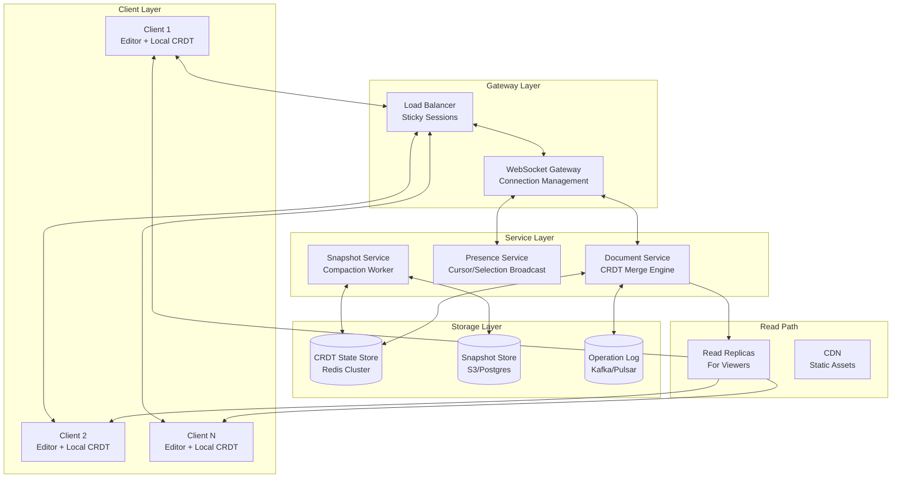

### System Context

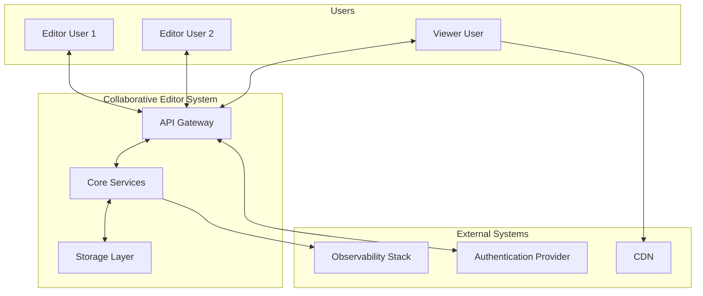

---

## CRDT Data Model

### Document Structure

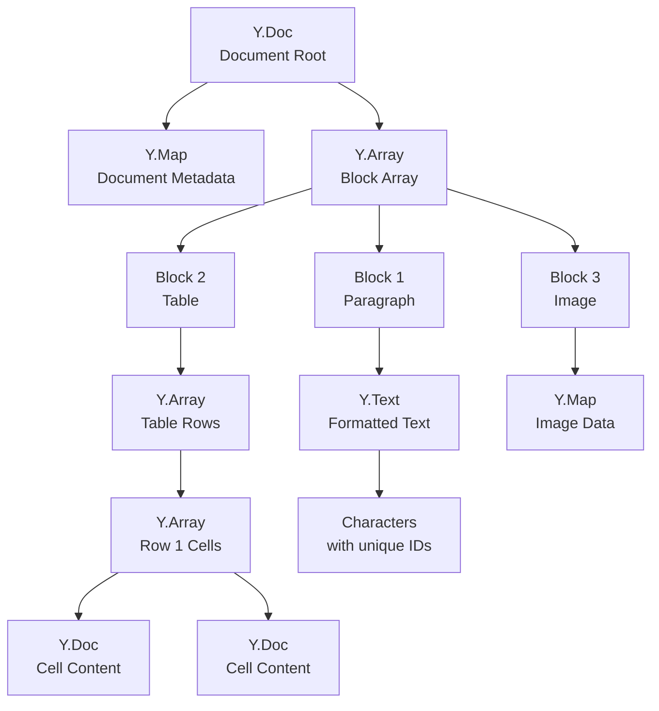

---

## Sync Protocol

### WebSocket Connection Flow

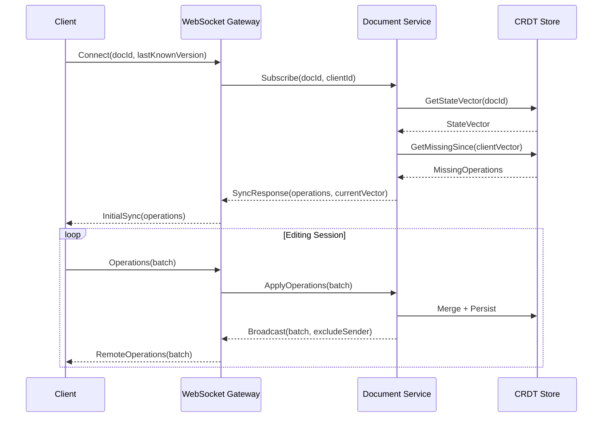

### Connection State Machine

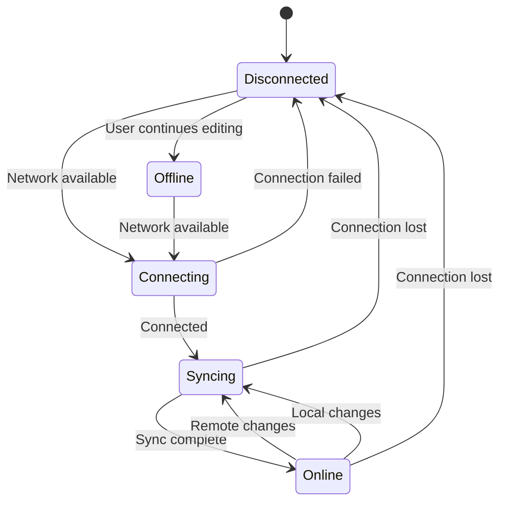

---

## Offline Support

### Client Architecture

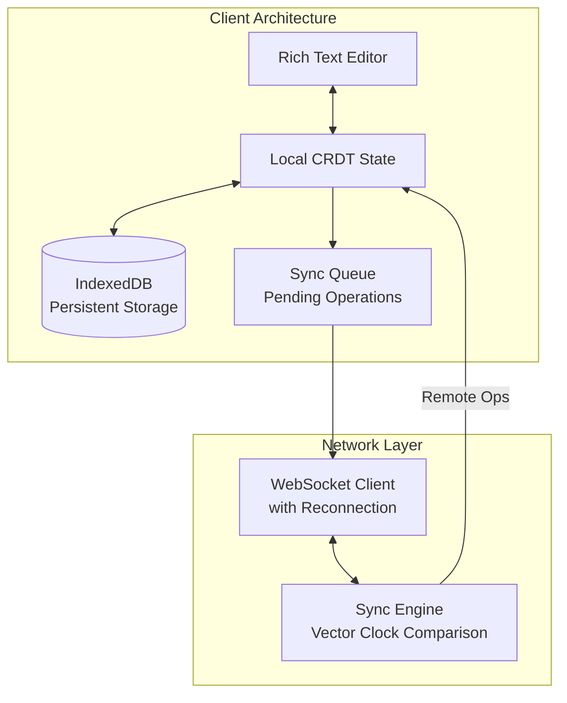

### Sync Flow

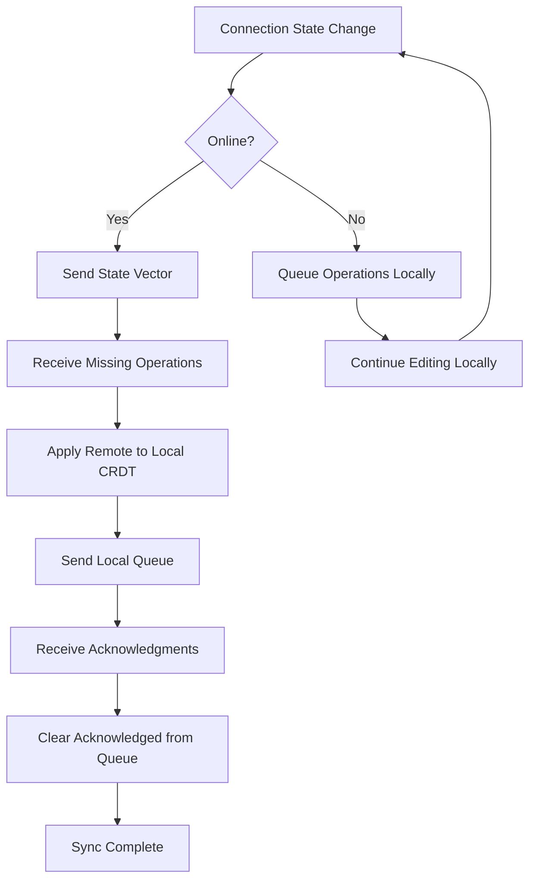

---

## Presence Service

### Presence Architecture

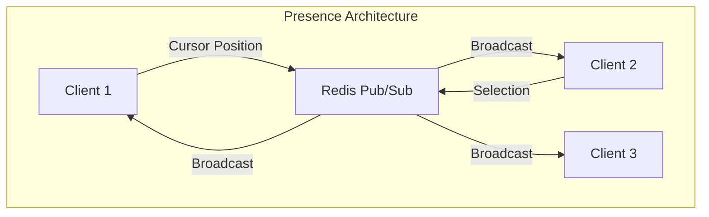

---

## Snapshot and Compaction

### Compaction Flow

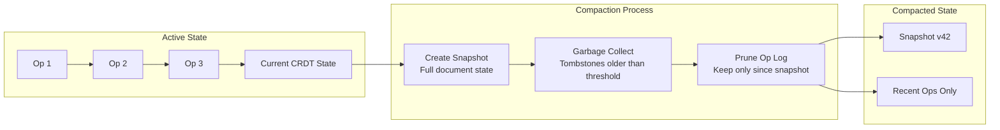

### Compaction Sequence

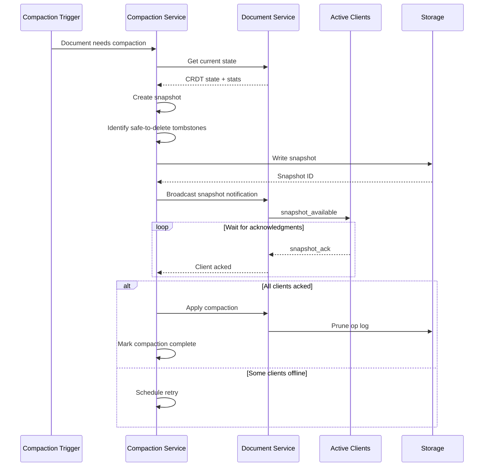

---

## Testing Strategy

### Testing Pyramid

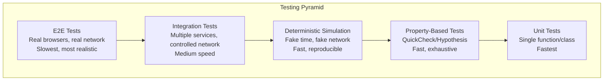

### Simulation Framework

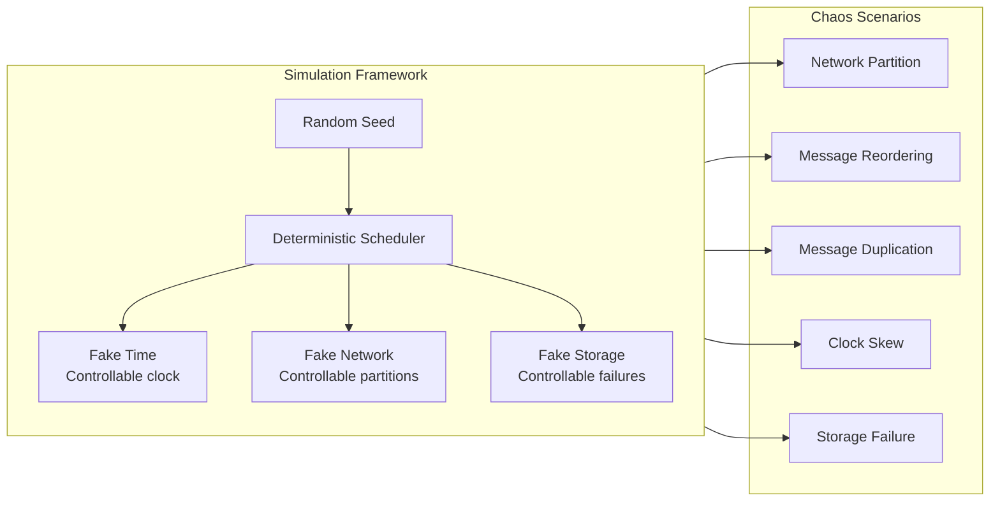

---

## Data Flow

### Write Path

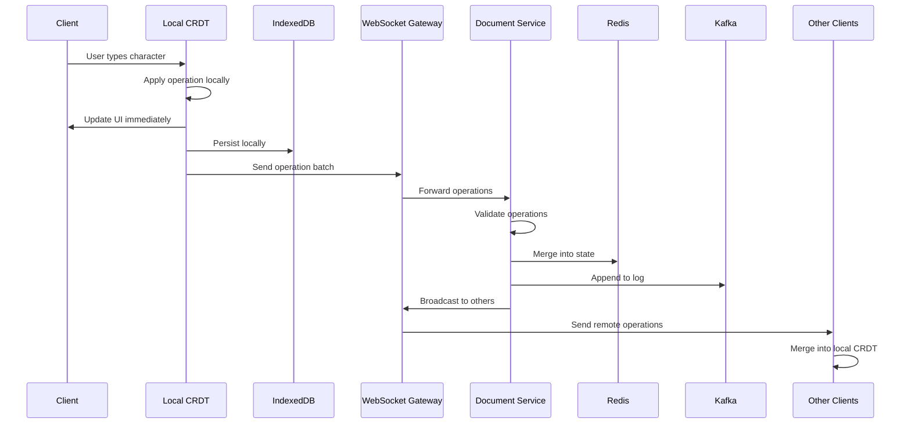

### Read Path

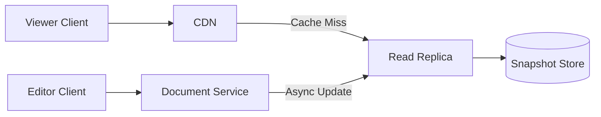

---

## Infrastructure

### Scaling Architecture

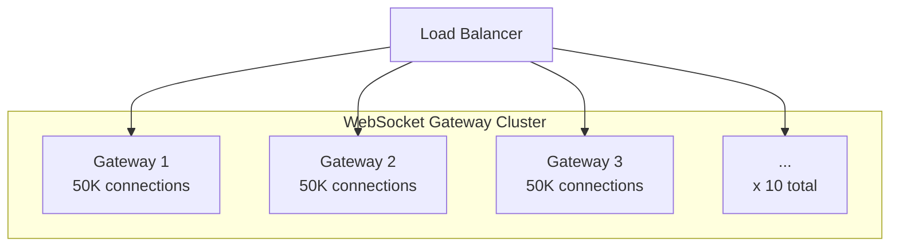

### Failure Recovery

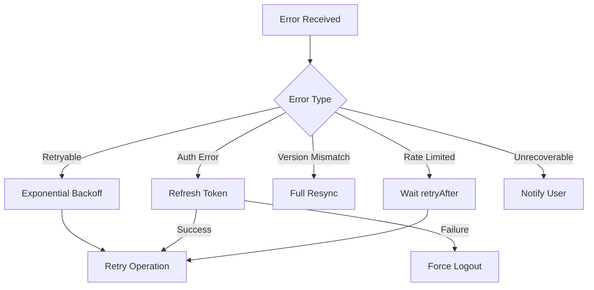

---

## Usage Notes

All diagrams in this document use Mermaid syntax. To render:

1. **GitHub/GitLab**: Renders natively in Markdown
2. **VS Code**: Use Mermaid extension
3. **Web**: Use [Mermaid Live Editor](https://mermaid.live/)
4. **Documentation sites**: Most support Mermaid (Docusaurus, MkDocs, etc.)

### Diagram Conventions

- **Rounded rectangles**: Services/components
- **Cylinders**: Databases/storage
- **Arrows**: Data flow direction
- **Subgraphs**: Logical groupings
- **Sequence diagrams**: Time-ordered interactions
- **State diagrams**: State machines
- **Flowcharts**: Decision flows
