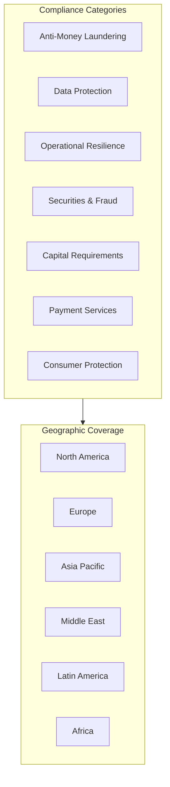
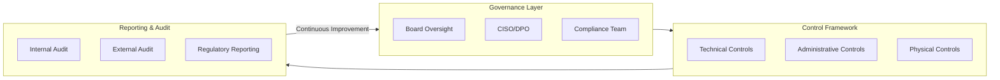
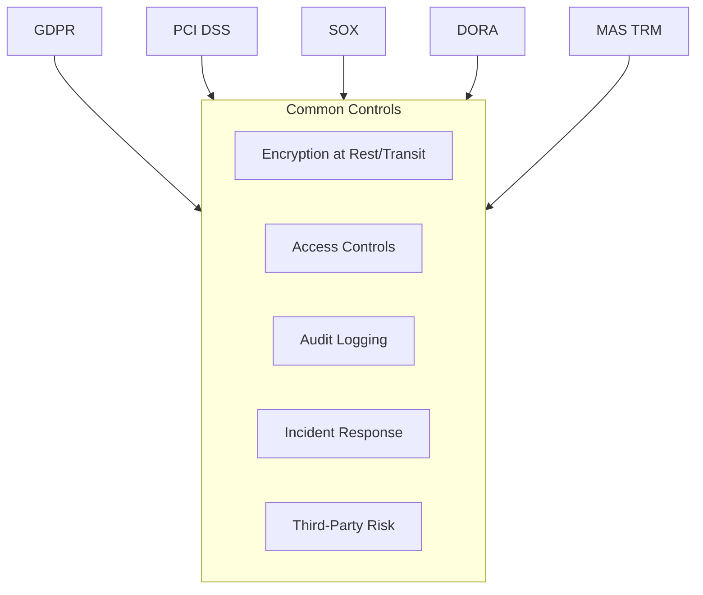
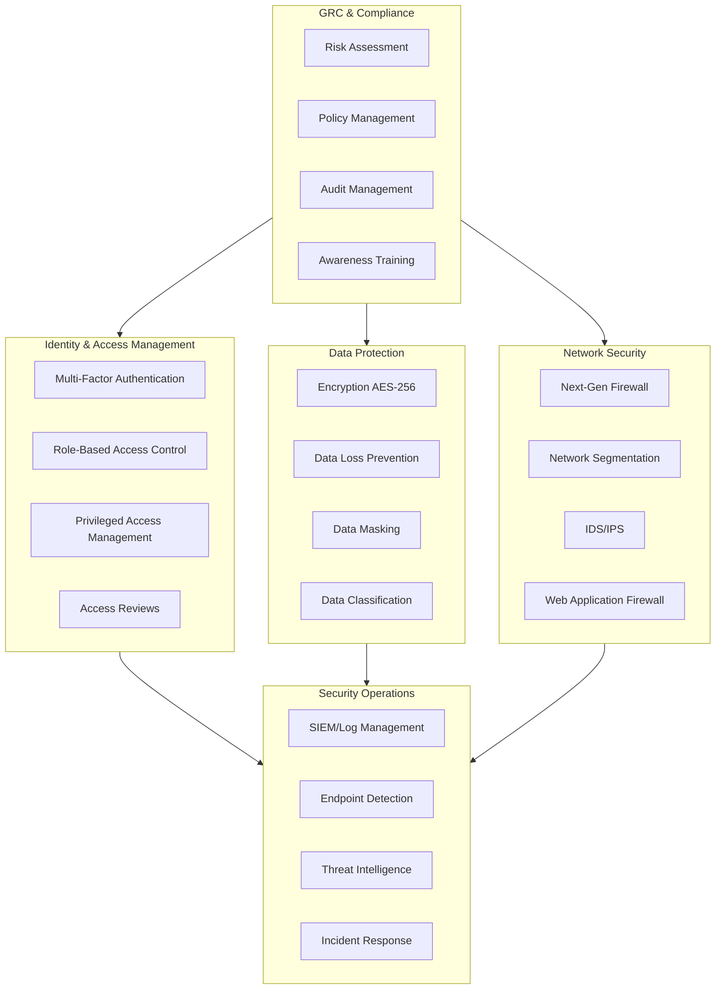

# Global Financial Services Compliance Guide

> A comprehensive reference for compliance regulations in the Financial Services & Banking sector across all major global geographies.

---

## Table of Contents

1. [Introduction](#introduction)
2. [Compliance Matrix Overview](#compliance-matrix-overview)
3. [Global Standards](#global-standards)
   - [Basel III/IV](#basel-iiiiv)
   - [FATF Recommendations](#fatf-recommendations)
   - [PCI DSS](#pci-dss)
   - [ISO 27001/27701](#iso-2700127701)
4. [North America](#north-america)
   - [SOX (Sarbanes-Oxley Act)](#sox-sarbanes-oxley-act)
   - [GLBA (Gramm-Leach-Bliley Act)](#glba-gramm-leach-bliley-act)
   - [BSA/AML (Bank Secrecy Act)](#bsaaml-bank-secrecy-act)
   - [Dodd-Frank Act](#dodd-frank-act)
   - [FCPA (Foreign Corrupt Practices Act)](#fcpa-foreign-corrupt-practices-act)
   - [CCPA/CPRA](#ccpacpra)
   - [NYDFS Cybersecurity Regulation](#nydfs-cybersecurity-regulation)
   - [OSFI B-13](#osfi-b-13)
   - [PIPEDA](#pipeda)
5. [Europe](#europe)
   - [GDPR](#gdpr)
   - [PSD2/PSD3](#psd2psd3)
   - [MiFID II/MiFIR](#mifid-iimifir)
   - [DORA](#dora)
   - [AMLD 5/6](#amld-56)
   - [SMCR](#smcr)
   - [Consumer Duty](#consumer-duty)
6. [Asia Pacific](#asia-pacific)
   - [RBI Master Directions](#rbi-master-directions)
   - [DPDP Act 2023](#dpdp-act-2023)
   - [PMLA](#pmla)
   - [CSL/DSL/PIPL (China)](#csldslpipl-china)
   - [PBOC Guidelines](#pboc-guidelines)
   - [FIEA/APPI (Japan)](#fieaappi-japan)
   - [MAS TRM/Cyber Hygiene](#mas-trmcyber-hygiene)
   - [PDPA (Singapore)](#pdpa-singapore)
   - [CPS 234/CPG 235 (Australia)](#cps-234cpg-235-australia)
   - [Privacy Act 1988](#privacy-act-1988)
7. [Middle East](#middle-east)
   - [CBUAE Regulations](#cbuae-regulations)
   - [DIFC Data Protection Law](#difc-data-protection-law)
   - [SAMA Cybersecurity Framework](#sama-cybersecurity-framework)
   - [PDPL (Saudi Arabia)](#pdpl-saudi-arabia)
8. [Latin America](#latin-america)
   - [LGPD (Brazil)](#lgpd-brazil)
   - [BCB Resolution 4893](#bcb-resolution-4893)
   - [CNBV Circular Única](#cnbv-circular-única)
   - [LFPDPPP (Mexico)](#lfpdppp-mexico)
9. [Africa](#africa)
   - [POPIA (South Africa)](#popia-south-africa)
   - [SARB Directives](#sarb-directives)
   - [NDPR (Nigeria)](#ndpr-nigeria)
   - [CBN Guidelines](#cbn-guidelines)
10. [Cross-Reference Diagrams](#cross-reference-diagrams)
11. [Appendix](#appendix)

---

## Introduction

This guide provides an exhaustive reference for compliance regulations affecting financial services and banking institutions worldwide. It covers **42 major compliance frameworks** across **6 geographic regions**, organized to help compliance officers, CISOs, legal teams, and technology leaders understand and implement required controls.

### Purpose of This Guide

- **Consolidate** fragmented compliance information into a single reference
- **Map** technical controls to regulatory requirements
- **Provide** actionable implementation checklists
- **Clarify** timelines, deadlines, and penalty structures
- **Enable** cross-jurisdictional compliance planning

### How to Use This Guide

Each compliance section follows a standardized format:
1. **Overview** - Regulatory background and objectives
2. **Who Must Comply** - Scope and applicability
3. **Key Requirements** - Core obligations with technical controls
4. **Implementation Checklist** - Step-by-step compliance actions
5. **Timelines & Deadlines** - Critical dates and reporting cycles
6. **Penalties for Non-Compliance** - Financial and operational consequences
7. **Official Resources** - Links to authoritative sources

---

## Compliance Matrix Overview

### Compliance Categories and Geographic Coverage

The following diagram illustrates the seven major compliance categories covered in this guide and their application across six geographic regions:

### Compliance Coverage Matrix

| Category | Global | North America | Europe | Asia Pacific | Middle East | Latin America | Africa |
|----------|--------|---------------|--------|--------------|-------------|---------------|--------|
| **Anti-Money Laundering** | FATF | BSA/AML | AMLD 5/6 | PMLA, CSL | CBUAE AML | BCB AML | CBN AML |
| **Data Protection** | ISO 27701 | CCPA, PIPEDA | GDPR | DPDP, PIPL, PDPA, APPI | DIFC DPL, PDPL | LGPD, LFPDPPP | POPIA, NDPR |
| **Operational Resilience** | ISO 27001 | NYDFS Cyber | DORA | MAS TRM, CPS 234 | SAMA CSF | BCB 4893 | SARB |
| **Securities & Fraud** | - | SOX, Dodd-Frank | MiFID II | FIEA, SEBI | - | CNBV | - |
| **Capital Requirements** | Basel III/IV | Basel III | Basel III/IV | Basel III | Basel III | Basel III | Basel III |
| **Payment Services** | PCI DSS | PCI DSS | PSD2/PSD3 | PBOC, MAS | CBUAE | BCB | CBN |
| **Consumer Protection** | - | GLBA, FCPA | Consumer Duty, SMCR | RBI | - | - | - |

### Financial Services Compliance Lifecycle

Understanding the continuous nature of compliance is critical. The following diagram shows the governance, control, and reporting layers that form a complete compliance lifecycle:

### Key Compliance Themes

Across all frameworks, several recurring themes emerge:

| Theme | Description | Common Requirements |
|-------|-------------|---------------------|
| **Data Encryption** | Protection of data at rest and in transit | AES-256, TLS 1.2+, key management |
| **Access Control** | Least privilege and role-based access | MFA, RBAC, privileged access management |
| **Audit Logging** | Comprehensive activity tracking | Immutable logs, 5-7 year retention, real-time monitoring |
| **Incident Response** | Breach detection and notification | 24-72 hour notification windows, documented procedures |
| **Third-Party Risk** | Vendor and supply chain management | Due diligence, contractual controls, ongoing monitoring |
| **Data Residency** | Geographic restrictions on data storage | Local data centers, cross-border transfer mechanisms |
| **Customer Due Diligence** | Know Your Customer (KYC) requirements | Identity verification, risk assessment, ongoing monitoring |

---

## Global Standards

Global standards form the foundation of financial services compliance worldwide. These frameworks are either directly adopted or serve as the basis for regional regulations.

---

### Basel III/IV

#### Overview

Basel III is a comprehensive set of reform measures developed by the Basel Committee on Banking Supervision (BCBS) to strengthen the regulation, supervision, and risk management of banks worldwide. Basel IV (officially the "finalized Basel III reforms") builds upon Basel III with additional requirements for credit risk, operational risk, and output floors.

#### Who Must Comply

- **Internationally active banks** in BCBS member jurisdictions
- **Systemically important financial institutions (SIFIs)**
- **All banks** in jurisdictions that adopt Basel standards (most G20 countries)
- **Investment firms** with significant trading books

#### Key Requirements

| Requirement | Description | Technical Controls |
|-------------|-------------|-------------------|
| **Common Equity Tier 1 (CET1)** | Minimum 4.5% of risk-weighted assets | Automated capital ratio calculation systems |
| **Tier 1 Capital** | Minimum 6% of risk-weighted assets | Real-time capital monitoring dashboards |
| **Total Capital** | Minimum 8% of risk-weighted assets | Integrated risk data aggregation |
| **Capital Conservation Buffer** | Additional 2.5% CET1 | Stress testing automation |
| **Countercyclical Buffer** | 0-2.5% based on jurisdiction | Macroprudential indicator feeds |
| **Leverage Ratio** | Minimum 3% Tier 1 capital | Exposure calculation engines |
| **Liquidity Coverage Ratio (LCR)** | ≥100% high-quality liquid assets | Liquidity stress testing tools |
| **Net Stable Funding Ratio (NSFR)** | ≥100% stable funding | Funding maturity analysis systems |
| **Credit Risk (SA-CR)** | Standardized approach for credit risk | Credit risk rating systems |
| **Operational Risk (SMA)** | Standardized Measurement Approach | Loss data collection and aggregation |
| **Market Risk (FRTB)** | Fundamental Review of Trading Book | Sensitivity-based risk measures |

#### Implementation Checklist

- [ ] Establish Basel implementation governance committee
- [ ] Conduct gap analysis against current capital positions
- [ ] Implement risk data aggregation infrastructure (BCBS 239)
- [ ] Deploy automated capital calculation systems
- [ ] Integrate liquidity monitoring tools (LCR/NSFR)
- [ ] Implement standardized credit risk models
- [ ] Deploy operational risk loss data collection
- [ ] Establish FRTB-compliant market risk systems
- [ ] Create stress testing framework
- [ ] Implement regulatory reporting automation (COREP/FINREP for EU)
- [ ] Train risk and finance teams on new methodologies
- [ ] Conduct internal audit of Basel compliance

#### Timelines & Deadlines

| Milestone | Date | Description |
|-----------|------|-------------|
| Basel III Core | January 2013 | Initial capital requirements |
| LCR Full Implementation | January 2019 | 100% LCR requirement |
| NSFR Implementation | January 2018 | Net stable funding ratio |
| Basel IV (Original) | January 2022 | Revised standardized approaches |
| Basel IV (Delayed) | January 2023 | COVID-related delay (EU) |
| Output Floor Phase-in | 2023-2028 | Gradual increase to 72.5% |
| Full Output Floor | January 2028 | 72.5% floor fully effective |

#### Penalties for Non-Compliance

| Penalty Type | Description |
|--------------|-------------|
| **Capital Add-ons** | Regulators may impose additional capital requirements (Pillar 2) |
| **Restrictions on Distributions** | Limits on dividends, share buybacks, and bonuses |
| **Enhanced Supervision** | Increased regulatory scrutiny and reporting |
| **Public Disclosure** | Required disclosure of capital shortfalls |
| **License Restrictions** | Limitations on business activities or expansion |
| **Resolution Actions** | In severe cases, resolution or wind-down procedures |

#### Official Resources

- [Basel Committee on Banking Supervision](https://www.bis.org/bcbs/)
- [Basel III: Finalising post-crisis reforms](https://www.bis.org/bcbs/publ/d424.htm)
- [BCBS 239 - Risk Data Aggregation](https://www.bis.org/publ/bcbs239.htm)

---

### FATF Recommendations

#### Overview

The Financial Action Task Force (FATF) Recommendations are the international standards for combating money laundering, terrorist financing, and proliferation financing. These 40 Recommendations provide a comprehensive framework that countries should implement through their national laws and regulations.

#### Who Must Comply

- **All financial institutions** (banks, credit unions, securities firms, insurance companies)
- **Designated non-financial businesses and professions (DNFBPs)** - casinos, real estate agents, lawyers, accountants, trust and company service providers
- **Virtual asset service providers (VASPs)**
- **Money service businesses (MSBs)**
- **Payment service providers**

#### Key Requirements

| Requirement | Description | Technical Controls |
|-------------|-------------|-------------------|
| **Risk Assessment** | Country and institutional ML/TF risk assessment | Automated risk scoring engines |
| **Customer Due Diligence (CDD)** | Identity verification and beneficial ownership | Digital identity verification (eKYC) |
| **Enhanced Due Diligence (EDD)** | Additional measures for high-risk customers | Risk-based workflow automation |
| **Politically Exposed Persons (PEPs)** | Identification and enhanced monitoring | PEP screening databases |
| **Correspondent Banking** | Due diligence on correspondent relationships | Counterparty risk assessment tools |
| **Wire Transfers** | Originator and beneficiary information | SWIFT message validation |
| **Suspicious Transaction Reporting (STR)** | Filing reports with FIU | Automated STR generation systems |
| **Record Keeping** | 5-year minimum retention | Secure document management |
| **Internal Controls** | AML/CFT programs and compliance officers | Policy management platforms |
| **Sanctions Screening** | Screening against sanctions lists | Real-time sanctions screening |
| **Transaction Monitoring** | Detection of suspicious patterns | AI/ML-powered monitoring systems |

#### Implementation Checklist

- [ ] Conduct enterprise-wide ML/TF risk assessment
- [ ] Develop and document AML/CFT policies and procedures
- [ ] Implement Customer Due Diligence (CDD) program
- [ ] Deploy identity verification and eKYC solutions
- [ ] Implement beneficial ownership identification
- [ ] Establish PEP screening processes
- [ ] Deploy real-time sanctions screening
- [ ] Implement transaction monitoring system
- [ ] Create STR filing procedures and systems
- [ ] Establish record-keeping infrastructure (5+ years)
- [ ] Appoint MLRO/Compliance Officer
- [ ] Conduct staff AML/CFT training
- [ ] Implement independent audit function
- [ ] Establish correspondent banking due diligence

#### Timelines & Deadlines

| Milestone | Requirement |
|-----------|-------------|
| **Ongoing** | Continuous transaction monitoring |
| **Immediate** | STR filing upon suspicion (typically 24-48 hours) |
| **Periodic** | Customer risk reassessment (annual for high-risk) |
| **FATF Mutual Evaluations** | Country assessments every 5-10 years |
| **Gray List/Black List** | Enhanced measures if jurisdiction listed |

#### Penalties for Non-Compliance

| Penalty Type | Typical Range |
|--------------|---------------|
| **Regulatory Fines** | $1M - $1B+ depending on severity |
| **Criminal Prosecution** | Individual liability for compliance officers |
| **License Revocation** | Banking license or operating permit withdrawal |
| **Correspondent Banking Termination** | Loss of access to international banking system |
| **Reputational Damage** | Public enforcement actions |
| **FATF Listing** | Country or institution blacklisting |

**Notable Enforcement Actions:**
- HSBC (2012): $1.9 billion for AML failures
- Danske Bank (2018): €2 billion for Estonia branch failures
- Westpac (2020): AUD 1.3 billion for 23 million breaches

#### Official Resources

- [FATF Official Website](https://www.fatf-gafi.org/)
- [FATF 40 Recommendations](https://www.fatf-gafi.org/en/topics/fatf-recommendations.html)
- [FATF Guidance on Virtual Assets](https://www.fatf-gafi.org/en/publications/Fatfrecommendations/Guidance-rba-virtual-assets-2021.html)

---

### PCI DSS

#### Overview

The Payment Card Industry Data Security Standard (PCI DSS) is a set of security standards designed to ensure that all companies that accept, process, store, or transmit credit card information maintain a secure environment. Version 4.0 became mandatory in March 2024 with full compliance required by March 2025.

#### Who Must Comply

| Merchant Level | Annual Transactions | Requirements |
|----------------|---------------------|--------------|
| **Level 1** | >6 million | Annual ROC by QSA, quarterly scans |
| **Level 2** | 1-6 million | Annual SAQ, quarterly scans |
| **Level 3** | 20,000-1 million e-commerce | Annual SAQ, quarterly scans |
| **Level 4** | <20,000 e-commerce or <1 million | Annual SAQ, quarterly scans recommended |

**Also applies to:**
- Payment processors and gateways
- Service providers handling cardholder data
- Software vendors (PA-DSS/PCI SSF)
- PIN entry device manufacturers (PCI PTS)

#### Key Requirements

PCI DSS 4.0 contains 12 requirements organized into 6 control objectives:

| Objective | Requirements | Technical Controls |
|-----------|--------------|-------------------|
| **Build & Maintain Secure Network** | 1. Install and maintain network security controls | Next-gen firewalls, network segmentation |
| | 2. Apply secure configurations | CIS benchmarks, configuration management |
| **Protect Account Data** | 3. Protect stored account data | AES-256 encryption, tokenization |
| | 4. Protect cardholder data during transmission | TLS 1.2+, secure key management |
| **Maintain Vulnerability Management** | 5. Protect from malicious software | EDR, anti-malware, application control |
| | 6. Develop secure systems and software | SDLC, code review, vulnerability scanning |
| **Implement Strong Access Control** | 7. Restrict access by business need | RBAC, least privilege, PAM |
| | 8. Identify users and authenticate access | MFA, strong passwords, identity management |
| | 9. Restrict physical access | Badges, cameras, visitor logs |
| **Monitor and Test Networks** | 10. Log and monitor all access | SIEM, log management, FIM |
| | 11. Test security regularly | Penetration testing, vulnerability scans, ASV |
| **Maintain Information Security Policy** | 12. Support security with policies | Policy management, training, risk assessment |

#### PCI DSS 4.0 New Requirements

| New Requirement | Description | Deadline |
|-----------------|-------------|----------|
| **Targeted Risk Analysis** | Document and justify control frequencies | March 2025 |
| **Automated Log Review** | Automated mechanisms to detect anomalies | March 2025 |
| **Web Application Firewall** | WAF mandatory for public-facing web apps | March 2025 |
| **MFA for CDE Access** | MFA for all access to cardholder data environment | March 2025 |
| **Authenticated Vulnerability Scans** | Internal authenticated scanning | March 2025 |
| **Security Awareness Training** | Enhanced training including phishing | March 2025 |
| **Payment Page Script Management** | Inventory and integrity monitoring of scripts | March 2025 |
| **Disk-Level Encryption Removal** | Disk encryption no longer satisfies Req 3 | March 2025 |

#### Implementation Checklist

- [ ] Define and document cardholder data environment (CDE) scope
- [ ] Implement network segmentation between CDE and other networks
- [ ] Deploy next-generation firewalls with IPS/IDS
- [ ] Implement TLS 1.2+ for all cardholder data transmission
- [ ] Deploy encryption (AES-256) or tokenization for stored data
- [ ] Implement strong key management procedures
- [ ] Deploy EDR/anti-malware on all systems
- [ ] Implement secure SDLC and code review processes
- [ ] Deploy vulnerability scanning (internal and ASV)
- [ ] Implement RBAC and least privilege access
- [ ] Deploy MFA for all CDE and administrative access
- [ ] Implement centralized logging and SIEM
- [ ] Deploy file integrity monitoring (FIM)
- [ ] Conduct annual penetration testing
- [ ] Complete quarterly ASV scans
- [ ] Document policies and conduct security awareness training
- [ ] Implement WAF for public-facing applications
- [ ] Deploy payment page script monitoring

#### Timelines & Deadlines

| Milestone | Date |
|-----------|------|
| PCI DSS 4.0 Released | March 2022 |
| PCI DSS 3.2.1 Retirement | March 31, 2024 |
| PCI DSS 4.0 Effective | March 31, 2024 |
| Future-Dated Requirements | March 31, 2025 |
| Quarterly ASV Scans | Ongoing quarterly |
| Annual Assessment | Annual ROC/SAQ |
| Penetration Testing | At least annually |

#### Penalties for Non-Compliance

| Penalty Type | Description |
|--------------|-------------|
| **Fines** | $5,000 - $100,000 per month by card brands |
| **Increased Transaction Fees** | Higher interchange rates |
| **Liability for Fraud** | Full liability for fraudulent transactions |
| **Card Brand Restrictions** | Removal from card brand programs |
| **Breach Costs** | Forensic investigation, notification, remediation |
| **Reputational Damage** | Loss of customer trust |

**Notable Breaches:**
- Target (2013): $18.5M settlement, 40M cards compromised
- Home Depot (2014): $179M total costs, 56M cards
- Equifax (2017): $700M+ settlement, 147M individuals

#### Official Resources

- [PCI Security Standards Council](https://www.pcisecuritystandards.org/)
- [PCI DSS 4.0 Document Library](https://www.pcisecuritystandards.org/document_library/)
- [PCI SSC QSA/ASV Locator](https://www.pcisecuritystandards.org/assessors_and_solutions/)

---

### ISO 27001/27701

#### Overview

**ISO 27001** is the international standard for information security management systems (ISMS), providing a systematic approach to managing sensitive information. **ISO 27701** extends ISO 27001 with a privacy information management system (PIMS), mapping to GDPR and other privacy regulations.

#### Who Must Comply

ISO 27001/27701 certifications are voluntary but often:

- **Required by contract** for financial services providers
- **Expected by regulators** as evidence of security controls
- **Required for government contracts** in many jurisdictions
- **Expected by customers** for cloud and SaaS providers
- **Used to demonstrate** GDPR, CCPA, and other compliance

#### Key Requirements

##### ISO 27001 Annex A Controls (2022 Revision)

| Control Category | Number of Controls | Examples |
|------------------|-------------------|----------|
| **Organizational Controls** | 37 | Policies, roles, threat intelligence, asset management |
| **People Controls** | 8 | Screening, awareness, responsibilities |
| **Physical Controls** | 14 | Perimeters, access, equipment |
| **Technological Controls** | 34 | Access control, cryptography, logging, network security |

##### ISO 27701 Privacy Extensions

| Requirement | Description | Technical Controls |
|-------------|-------------|-------------------|
| **PII Inventory** | Comprehensive data mapping | Data discovery and classification tools |
| **Lawful Basis** | Document legal grounds for processing | Consent management platforms |
| **Data Subject Rights** | Respond to access, deletion, portability | DSAR automation workflows |
| **Privacy by Design** | Embed privacy in system development | PIA/DPIA automation |
| **International Transfers** | Mechanisms for cross-border data flows | Transfer impact assessments |
| **Breach Management** | Detection and notification procedures | Incident response platforms |
| **Processor Management** | Vendor privacy due diligence | Third-party risk management |

#### Implementation Checklist

##### ISO 27001

- [ ] Obtain management commitment and define ISMS scope
- [ ] Conduct information security risk assessment
- [ ] Develop risk treatment plan and Statement of Applicability (SoA)
- [ ] Implement Annex A controls based on risk assessment
- [ ] Develop and approve ISMS policies and procedures
- [ ] Implement asset inventory and classification
- [ ] Deploy access control and identity management
- [ ] Implement encryption for data at rest and in transit
- [ ] Deploy logging, monitoring, and SIEM
- [ ] Implement vulnerability management program
- [ ] Establish incident management procedures
- [ ] Implement business continuity planning
- [ ] Conduct security awareness training
- [ ] Perform internal audits
- [ ] Conduct management review
- [ ] Engage certification body for Stage 1 and Stage 2 audits

##### ISO 27701 (Additional)

- [ ] Appoint Data Protection Officer (if required)
- [ ] Conduct PII inventory and data mapping
- [ ] Document lawful basis for all processing activities
- [ ] Implement data subject rights handling procedures
- [ ] Conduct Privacy Impact Assessments for new processing
- [ ] Implement privacy notices and consent mechanisms
- [ ] Establish international transfer mechanisms
- [ ] Implement data retention and deletion procedures
- [ ] Update vendor contracts with privacy requirements
- [ ] Extend internal audit to privacy controls

#### Timelines & Deadlines

| Milestone | Typical Duration |
|-----------|------------------|
| **Gap Analysis** | 2-4 weeks |
| **ISMS Design** | 1-2 months |
| **Control Implementation** | 3-6 months |
| **Internal Audit** | 2-4 weeks |
| **Management Review** | 1-2 weeks |
| **Stage 1 Audit** | 1-2 days |
| **Stage 2 Audit** | 3-5 days |
| **Certification Decision** | 2-4 weeks |
| **Surveillance Audits** | Annual |
| **Recertification** | Every 3 years |

#### Penalties for Non-Compliance

While ISO certifications are voluntary, failure to maintain them can result in:

| Consequence | Description |
|-------------|-------------|
| **Contract Breach** | Loss of contracts requiring certification |
| **Customer Loss** | RFPs often require ISO 27001 |
| **Insurance Issues** | Higher premiums or coverage denial |
| **Regulatory Expectations** | Regulators may expect ISO as baseline |
| **Certification Withdrawal** | Non-conformities can result in suspension or withdrawal |

#### Official Resources

- [ISO 27001:2022](https://www.iso.org/standard/27001)
- [ISO 27701:2019](https://www.iso.org/standard/71670.html)
- [ISO 27002:2022 Controls Reference](https://www.iso.org/standard/75652.html)
- [ISMS Certification Bodies](https://www.iaf.nu/)

---

## North America

North American financial services compliance encompasses United States federal and state regulations, as well as Canadian federal requirements. The regulatory landscape is characterized by multiple overlapping agencies and standards.

---

### SOX (Sarbanes-Oxley Act)

#### Overview

The Sarbanes-Oxley Act of 2002 (SOX) was enacted in response to major corporate scandals (Enron, WorldCom) to protect investors by improving the accuracy and reliability of corporate disclosures. Sections 302 and 404 are most relevant to IT and security controls.

#### Who Must Comply

- **All publicly traded companies** in the United States
- **Foreign companies** listed on U.S. stock exchanges
- **Subsidiaries** of covered companies
- **Auditors** of public companies (PCAOB registered)
- **Private companies** preparing for IPO

#### Key Requirements

| Section | Requirement | Technical Controls |
|---------|-------------|-------------------|
| **Section 302** | CEO/CFO certification of financial statements | Certification tracking systems |
| **Section 404(a)** | Management assessment of internal controls | Control assessment platforms |
| **Section 404(b)** | External auditor attestation (large filers) | Audit management systems |
| **Section 409** | Real-time disclosure of material changes | Event monitoring systems |
| **Section 802** | Document retention and destruction | Records management systems |
| **Section 806** | Whistleblower protections | Anonymous reporting channels |

##### IT General Controls (ITGCs)

| Control Area | Requirements | Technical Controls |
|--------------|--------------|-------------------|
| **Access Controls** | Logical access to financial systems | Identity management, RBAC, access reviews |
| **Change Management** | Controlled changes to financial applications | Change control systems, approval workflows |
| **Computer Operations** | Job scheduling, backup, recovery | Automation, monitoring, DR testing |
| **Program Development** | SDLC for financial applications | Version control, code review, testing |
| **Segregation of Duties** | Separation of incompatible functions | SoD matrices, automated monitoring |

#### Implementation Checklist

- [ ] Establish SOX compliance governance committee
- [ ] Document and map financial reporting processes
- [ ] Identify in-scope IT systems and applications
- [ ] Conduct risk assessment and scoping
- [ ] Design and document IT general controls
- [ ] Implement access control and provisioning procedures
- [ ] Establish change management processes
- [ ] Implement segregation of duties controls
- [ ] Deploy audit logging and monitoring
- [ ] Create evidence collection and documentation procedures
- [ ] Conduct control testing (design and operating effectiveness)
- [ ] Remediate identified deficiencies
- [ ] Prepare for external auditor testing
- [ ] Implement continuous monitoring

#### Timelines & Deadlines

| Milestone | Timing |
|-----------|--------|
| **Year-End Assessment** | 60-90 days before fiscal year end |
| **Management Report** | Filed with annual 10-K |
| **Auditor Attestation** | Concurrent with 10-K filing |
| **Control Testing** | Ongoing with year-end focus |
| **Deficiency Remediation** | Before fiscal year end |

#### Penalties for Non-Compliance

| Penalty Type | Description |
|--------------|-------------|
| **CEO/CFO Liability** | Up to $5M fine and 20 years imprisonment for willful violations |
| **Material Weakness Disclosure** | Public disclosure in 10-K affects stock price |
| **Restatements** | Financial statement restatements |
| **SEC Enforcement** | Investigation and enforcement actions |
| **Class Action Lawsuits** | Shareholder litigation |
| **Auditor Actions** | Qualified or adverse opinions |

**Notable Cases:**
- Enron executives: Criminal convictions
- WorldCom: $11B fraud, executive imprisonment
- Wells Fargo: $185M fine for fake accounts (Section 404 implications)

#### Official Resources

- [SEC SOX Information](https://www.sec.gov/spotlight/sarbanes-oxley.htm)
- [PCAOB Standards](https://pcaobus.org/oversight/standards)
- [COSO Framework](https://www.coso.org/)

---

### GLBA (Gramm-Leach-Bliley Act)

#### Overview

The Gramm-Leach-Bliley Act (1999), also known as the Financial Modernization Act, requires financial institutions to explain their information-sharing practices and to safeguard sensitive data. The Safeguards Rule was significantly updated in 2023 with enhanced security requirements.

#### Who Must Comply

- **Banks and credit unions**
- **Securities firms and investment advisors**
- **Insurance companies**
- **Mortgage lenders and brokers**
- **Finance companies**
- **Tax preparers**
- **Debt collectors**
- **Any company "significantly engaged" in financial activities**

#### Key Requirements

##### Privacy Rule

| Requirement | Description | Technical Controls |
|-------------|-------------|-------------------|
| **Privacy Notices** | Clear explanation of information practices | Privacy notice generation systems |
| **Opt-Out Rights** | Allow customers to opt out of sharing | Preference management platforms |
| **Information Sharing Limits** | Restrictions on sharing with non-affiliates | Data sharing controls |

##### Safeguards Rule (Updated 2023)

| Requirement | Description | Technical Controls |
|-------------|-------------|-------------------|
| **Risk Assessment** | Written risk assessment | Risk assessment tools |
| **Qualified Individual** | Designated security program head | Governance tracking |
| **Access Controls** | Limit access to customer information | IAM, MFA, least privilege |
| **Encryption** | Encrypt data in transit and at rest | TLS 1.2+, AES-256 |
| **MFA** | Multi-factor authentication for accessing customer information | MFA platforms |
| **Secure Development** | Security in application development | SDLC security tools |
| **Vendor Management** | Oversee service providers | TPRM platforms |
| **Change Management** | Continuous evaluation of changes | Change control systems |
| **Incident Response** | Written incident response plan | IR platforms |
| **Penetration Testing** | Annual pen testing or continuous monitoring | Pen testing services |
| **Board Reporting** | Annual written report to board | Reporting automation |
| **Training** | Security awareness training | LMS platforms |

#### Implementation Checklist

- [ ] Designate Qualified Individual for information security
- [ ] Conduct written risk assessment
- [ ] Implement access controls with least privilege
- [ ] Deploy multi-factor authentication for all access to customer information
- [ ] Encrypt customer information in transit and at rest
- [ ] Implement secure development practices
- [ ] Establish change management procedures
- [ ] Develop and test incident response plan
- [ ] Conduct annual penetration testing or continuous vulnerability assessments
- [ ] Implement vendor management program for service providers
- [ ] Conduct security awareness training
- [ ] Prepare and deliver annual board report
- [ ] Document privacy notices and opt-out mechanisms
- [ ] Monitor for regulatory updates

#### Timelines & Deadlines

| Milestone | Date |
|-----------|------|
| Original GLBA | 1999 |
| Safeguards Rule Update | December 2021 |
| Compliance Deadline (Large) | June 9, 2023 |
| Compliance Deadline (Small) | December 9, 2022 (original) |
| Extended Deadline (Small) | June 9, 2023 |
| Ongoing | Annual risk assessment, pen testing, board reporting |

#### Penalties for Non-Compliance

| Penalty Type | Amount/Description |
|--------------|-------------------|
| **FTC Civil Penalties** | Up to $50,120 per violation (adjusted annually) |
| **State AG Actions** | State-level enforcement and fines |
| **Individual Liability** | Up to $10,000 per violation for individuals |
| **Criminal Penalties** | Up to $100,000 and 5 years imprisonment |
| **Enforcement Orders** | FTC consent orders and monitoring |

#### Official Resources

- [FTC GLBA Information](https://www.ftc.gov/tips-advice/business-center/privacy-and-security/gramm-leach-bliley-act)
- [FTC Safeguards Rule](https://www.ftc.gov/legal-library/browse/rules/safeguards-rule)
- [FTC Compliance Resources](https://www.ftc.gov/business-guidance/resources/ftc-safeguards-rule-what-your-business-needs-know)

---

### BSA/AML (Bank Secrecy Act)

#### Overview

The Bank Secrecy Act (1970), along with subsequent amendments including the USA PATRIOT Act (2001) and the Anti-Money Laundering Act (2020), establishes requirements for U.S. financial institutions to assist government agencies in detecting and preventing money laundering and terrorist financing.

#### Who Must Comply

- **Banks and credit unions**
- **Money services businesses (MSBs)**
- **Casinos and card clubs**
- **Securities broker-dealers**
- **Mutual funds**
- **Insurance companies**
- **Loan or finance companies**
- **Virtual currency businesses**
- **Precious metals dealers**

#### Key Requirements

| Requirement | Description | Technical Controls |
|-------------|-------------|-------------------|
| **AML Program** | Written program with five pillars | Policy management systems |
| **BSA Officer** | Designated compliance officer | Governance tracking |
| **Internal Controls** | Policies, procedures, and controls | Control monitoring platforms |
| **Training** | Ongoing BSA/AML training | LMS and training tracking |
| **Independent Testing** | Audit of BSA/AML compliance | Audit management systems |
| **Customer Due Diligence (CDD)** | Identity verification and risk rating | eKYC platforms |
| **Beneficial Ownership** | Identify 25%+ owners | Ownership tracking systems |
| **CTR Filing** | Currency transactions over $10,000 | Automated CTR generation |
| **SAR Filing** | Suspicious activity reporting | SAR workflow systems |
| **Recordkeeping** | 5-year retention | Records management |
| **Information Sharing** | 314(a) and 314(b) programs | Secure data sharing platforms |
| **Enhanced Due Diligence** | High-risk customers and correspondent banking | Risk-based workflow |

#### Implementation Checklist

- [ ] Appoint qualified BSA/AML Compliance Officer
- [ ] Develop written AML program with five pillars
- [ ] Implement Customer Identification Program (CIP)
- [ ] Deploy Customer Due Diligence (CDD) program
- [ ] Implement beneficial ownership identification
- [ ] Establish risk rating methodology for customers
- [ ] Deploy transaction monitoring system
- [ ] Implement automated CTR filing for currency transactions
- [ ] Establish SAR review, investigation, and filing procedures
- [ ] Implement OFAC sanctions screening
- [ ] Establish correspondent banking due diligence
- [ ] Implement information sharing under Section 314
- [ ] Conduct ongoing BSA/AML training
- [ ] Schedule independent BSA/AML audit
- [ ] Implement recordkeeping for 5 years

#### Timelines & Deadlines

| Requirement | Timeline |
|-------------|----------|
| **CTR Filing** | Within 15 days of transaction |
| **SAR Filing** | Within 30 days of detection (60 if no suspect identified) |
| **CIP Verification** | At account opening |
| **CDD Review** | Risk-based (annual for high-risk) |
| **Independent Testing** | At least every 12-18 months |
| **Training** | At least annually |
| **Record Retention** | 5 years |

#### Penalties for Non-Compliance

| Penalty Type | Description |
|--------------|-------------|
| **Civil Money Penalties** | Up to $1M per day per violation |
| **Criminal Penalties** | Up to $500,000 and 10 years imprisonment |
| **Cease and Desist Orders** | Immediate cessation of activities |
| **License Revocation** | Loss of banking charter |
| **Personal Liability** | Individual liability for officers |
| **Enforcement Actions** | Public consent orders |

**Notable Enforcement Actions:**
- TD Bank (2024): $3B+ for AML failures
- Capital One (2021): $390M for willful BSA violations
- USAA (2022): $140M for AML program deficiencies
- Deutsche Bank (2017): $630M for Russian mirror trading

#### Official Resources

- [FinCEN BSA Resources](https://www.fincen.gov/resources/statutes-and-regulations/bank-secrecy-act)
- [FFIEC BSA/AML Manual](https://bsaaml.ffiec.gov/manual)
- [FinCEN Guidance](https://www.fincen.gov/resources/advisoriesbulletinsfact-sheets)

---

### Dodd-Frank Act

#### Overview

The Dodd-Frank Wall Street Reform and Consumer Protection Act (2010) was enacted following the 2008 financial crisis. It created the Consumer Financial Protection Bureau (CFPB), established new regulatory requirements for financial institutions, and imposed restrictions on derivatives trading.

#### Who Must Comply

- **Banks and bank holding companies** (especially SIFIs)
- **Non-bank financial companies** designated as systemically important
- **Swap dealers and major swap participants**
- **Securities-based swap dealers**
- **Investment advisers**
- **Mortgage originators**
- **Consumer financial service providers**

#### Key Requirements

| Title | Requirement | Technical Controls |
|-------|-------------|-------------------|
| **Title I - FSOC** | Systemic risk monitoring | Risk aggregation platforms |
| **Title II - OLA** | Orderly liquidation procedures | Resolution planning systems |
| **Title III - Bank Supervision** | Enhanced prudential standards | Regulatory reporting systems |
| **Title VI - Volcker Rule** | Restrictions on proprietary trading | Trade surveillance systems |
| **Title VII - Derivatives** | Swap clearing and reporting | Trade reporting infrastructure |
| **Title X - CFPB** | Consumer protection compliance | Complaint management systems |
| **Title XIV - Mortgage Reform** | Ability-to-repay requirements | Underwriting systems |

##### Volcker Rule Requirements

| Requirement | Description | Technical Controls |
|-------------|-------------|-------------------|
| **Proprietary Trading Prohibition** | Limited covered trading activity | Trade monitoring, classification systems |
| **Covered Fund Restrictions** | Limits on hedge fund/PE investments | Investment tracking |
| **Compliance Program** | Written compliance program | Policy management |
| **CEO Attestation** | Annual CEO compliance attestation | Attestation tracking |
| **Metrics Reporting** | Trading metrics for covered entities | Automated metrics reporting |

#### Implementation Checklist

- [ ] Determine applicability of various Dodd-Frank titles
- [ ] Implement Volcker Rule compliance program (if applicable)
- [ ] Deploy trade surveillance for proprietary trading restrictions
- [ ] Implement swap/derivatives reporting (if applicable)
- [ ] Establish CFPB complaint management procedures
- [ ] Implement mortgage underwriting controls (Title XIV)
- [ ] Prepare resolution plans (living wills) if required
- [ ] Deploy regulatory capital and liquidity reporting
- [ ] Implement stress testing framework (if applicable)
- [ ] Establish executive compensation governance
- [ ] Implement whistleblower program
- [ ] Monitor for regulatory updates and amendments

#### Timelines & Deadlines

| Requirement | Timeline |
|-------------|----------|
| **Living Wills** | Annual or biennial based on size |
| **Stress Testing** | Annual (DFAST/CCAR) |
| **Swap Reporting** | Real-time or T+1 |
| **Volcker Metrics** | Monthly or quarterly |
| **CEO Attestation** | Annual |
| **CFPB Complaint Response** | 15 days |

#### Penalties for Non-Compliance

| Penalty Type | Description |
|--------------|-------------|
| **Civil Money Penalties** | Tiered penalties based on violation severity |
| **Tier 1** | Up to $10,000 per day (simple violations) |
| **Tier 2** | Up to $50,000 per day (reckless violations) |
| **Tier 3** | Up to $2M per day (knowing violations) |
| **CFPB Actions** | Restitution, disgorgement, injunctions |
| **Divestiture** | Required sale of prohibited investments |
| **Consent Orders** | Ongoing monitoring and remediation |

#### Official Resources

- [Dodd-Frank Act Text](https://www.congress.gov/bill/111th-congress/house-bill/4173)
- [CFPB Regulations](https://www.consumerfinance.gov/rules-policy/)
- [SEC Dodd-Frank Implementation](https://www.sec.gov/spotlight/dodd-frank.shtml)
- [Federal Reserve Stress Testing](https://www.federalreserve.gov/supervisionreg/stress-tests-capital-planning.htm)

---

### FCPA (Foreign Corrupt Practices Act)

#### Overview

The Foreign Corrupt Practices Act (1977) prohibits U.S. persons and entities from bribing foreign government officials to obtain or retain business. It also requires issuers to maintain accurate books and records and adequate internal controls.

#### Who Must Comply

- **U.S. companies and citizens** (anywhere in the world)
- **Foreign companies listed on U.S. exchanges** (issuers)
- **Foreign persons** acting in U.S. territory
- **Agents and intermediaries** of covered entities
- **Subsidiaries** of U.S. parent companies

#### Key Requirements

| Provision | Requirement | Technical Controls |
|-----------|-------------|-------------------|
| **Anti-Bribery** | Prohibition on corrupt payments | Payment approval workflows |
| **Books and Records** | Accurate and fair financial records | Financial system controls |
| **Internal Controls** | Adequate internal accounting controls | Control frameworks |
| **Third-Party Due Diligence** | Oversight of agents and intermediaries | TPRM platforms |

#### Implementation Checklist

- [ ] Develop written FCPA compliance policy
- [ ] Implement anti-corruption risk assessment
- [ ] Establish third-party due diligence program
- [ ] Deploy gift and entertainment approval workflows
- [ ] Implement travel and expense controls
- [ ] Establish charitable donation and sponsorship controls
- [ ] Deploy payment approval processes with appropriate limits
- [ ] Implement red flag monitoring in financial systems
- [ ] Conduct FCPA-specific training
- [ ] Establish whistleblower hotline
- [ ] Implement ongoing monitoring and auditing
- [ ] Document remediation of identified issues

#### Penalties for Non-Compliance

| Penalty Type | Amount |
|--------------|--------|
| **Corporate Criminal Fines** | Up to $25M per violation |
| **Corporate Civil Fines** | Up to $16,000 per violation |
| **Individual Criminal Fines** | Up to $250,000 per violation |
| **Imprisonment** | Up to 5 years (anti-bribery), 20 years (accounting) |
| **Disgorgement** | All ill-gotten gains |
| **Monitorship** | Independent compliance monitor |

**Notable Cases:**
- Goldman Sachs (2020): $2.9B for 1MDB scandal
- Airbus (2020): $3.9B global settlement
- Walmart (2019): $282M for anti-corruption violations

#### Official Resources

- [DOJ FCPA Resources](https://www.justice.gov/criminal-fraud/foreign-corrupt-practices-act)
- [SEC FCPA Page](https://www.sec.gov/spotlight/fcpa)
- [DOJ/SEC FCPA Resource Guide](https://www.justice.gov/criminal-fraud/fcpa-guidance)

---

### CCPA/CPRA

#### Overview

The California Consumer Privacy Act (2018) and its amendment, the California Privacy Rights Act (2020), provide California residents with comprehensive privacy rights regarding their personal information. CPRA took full effect January 1, 2023, with enforcement beginning July 1, 2023.

#### Who Must Comply

Businesses that:
- Have gross annual revenue exceeding $25 million
- Buy, sell, or share personal information of 100,000+ California consumers/households
- Derive 50%+ of annual revenue from selling/sharing consumers' personal information
- Are controlled by or control a business meeting above thresholds

#### Key Requirements

| Right/Requirement | Description | Technical Controls |
|-------------------|-------------|-------------------|
| **Right to Know** | Disclosure of collected personal information | Data inventory systems |
| **Right to Delete** | Deletion of personal information | Data deletion automation |
| **Right to Correct** | Correction of inaccurate information | Data quality workflows |
| **Right to Opt-Out** | Opt-out of sale/sharing of information | Preference management |
| **Right to Limit** | Limit use of sensitive personal information | Consent management |
| **Right to Portability** | Receive information in portable format | Data export tools |
| **Non-Discrimination** | No discrimination for exercising rights | Compliance monitoring |
| **Privacy Policy** | Comprehensive privacy disclosures | Policy management |
| **Service Provider Contracts** | Written contracts with data processors | Contract management |
| **Data Minimization** | Collect only necessary information | Data governance |
| **Purpose Limitation** | Use data only for disclosed purposes | Access controls |
| **Retention Limits** | Retain only as long as necessary | Retention automation |

#### Implementation Checklist

- [ ] Conduct comprehensive data inventory and mapping
- [ ] Classify personal information and sensitive personal information
- [ ] Update privacy policy with CCPA/CPRA disclosures
- [ ] Implement "Do Not Sell or Share My Personal Information" link
- [ ] Implement "Limit the Use of My Sensitive Personal Information" link
- [ ] Deploy consumer request intake mechanisms (web forms, toll-free number)
- [ ] Implement identity verification for consumer requests
- [ ] Automate data access, deletion, correction, and portability requests
- [ ] Update service provider and contractor contracts
- [ ] Implement opt-out preference signals (GPC) recognition
- [ ] Conduct Privacy Impact Assessments for high-risk processing
- [ ] Implement data retention and deletion schedules
- [ ] Train employees on CCPA/CPRA requirements
- [ ] Register as data broker (if applicable)
- [ ] Conduct annual cybersecurity audits (if high-risk)

#### Timelines & Deadlines

| Requirement | Timeline |
|-------------|----------|
| **Consumer Requests** | 45 days (extendable by 45 days) |
| **Opt-Out Requests** | 15 business days |
| **Privacy Policy Updates** | At least annually |
| **Employee Training** | Upon hire and periodically |
| **Data Broker Registration** | Annual by January 31 |
| **Cybersecurity Audits** | Annual (for high-risk businesses) |
| **Risk Assessments** | For significant processing changes |

#### Penalties for Non-Compliance

| Penalty Type | Amount |
|--------------|--------|
| **Civil Penalties** | Up to $2,500 per violation |
| **Intentional Violations** | Up to $7,500 per violation |
| **CPRA Administrative Fines** | CPPA enforcement (similar structure) |
| **Private Right of Action** | Data breaches: $100-$750 per consumer per incident |
| **AG Enforcement** | Injunctive relief and civil penalties |

#### Official Resources

- [California Privacy Protection Agency](https://cppa.ca.gov/)
- [CCPA/CPRA Regulations](https://cppa.ca.gov/regulations/)
- [CA AG CCPA Resources](https://oag.ca.gov/privacy/ccpa)

---

### NYDFS Cybersecurity Regulation (23 NYCRR 500)

#### Overview

The New York Department of Financial Services Cybersecurity Regulation (23 NYCRR 500) establishes cybersecurity requirements for financial services companies. The regulation was significantly amended in November 2023 with enhanced requirements for larger entities.

#### Who Must Comply

- **Banks and trust companies** licensed by NYDFS
- **Insurance companies** licensed in New York
- **Mortgage brokers and bankers**
- **Licensed lenders**
- **Money transmitters**
- **Check cashers**
- **Premium finance agencies**
- **Virtual currency businesses** (BitLicense holders)

##### Entity Classifications (2023 Amendment)

| Classification | Criteria | Requirements |
|---------------|----------|--------------|
| **Class A** | ≥$20M gross revenue from NY operations AND either ≥2,000 employees (including affiliates) OR >$1B gross annual revenue | Enhanced requirements |
| **Standard** | All other covered entities not qualifying for exemptions | Standard requirements |
| **Exempt** | <10 employees AND <$5M gross revenue AND <$10M assets | Limited exemptions |

#### Key Requirements

| Requirement | Description | Technical Controls |
|-------------|-------------|-------------------|
| **Cybersecurity Program** | Written, risk-based program | GRC platforms |
| **CISO** | Qualified Chief Information Security Officer | Executive governance |
| **Risk Assessment** | Annual risk assessment | Risk management tools |
| **Cybersecurity Policy** | Written policies covering 15 areas | Policy management |
| **Access Privileges** | Periodic access review and limitation | IAM, access reviews |
| **MFA** | Multi-factor authentication | MFA platforms |
| **Penetration Testing** | Annual penetration testing | Pen testing services |
| **Vulnerability Management** | Vulnerability assessments and timely patching | Vulnerability scanners |
| **Audit Trail** | Logging of cybersecurity events | SIEM, log management |
| **Encryption** | Encryption of nonpublic information | Encryption solutions |
| **Incident Response** | Written incident response plan | IR platforms |
| **Third-Party Security** | Vendor risk management | TPRM platforms |
| **Training** | Cybersecurity awareness training | LMS platforms |
| **Asset Inventory** | Asset management and tracking | CMDB, asset management |
| **Data Retention** | Data retention and disposal | Data lifecycle management |
| **Notice to Superintendent** | 72-hour breach notification | Incident management |

##### 2023 Amendment - Enhanced Requirements for Class A

| New Requirement | Description |
|-----------------|-------------|
| **Independent Audit** | Annual independent audit of cybersecurity program |
| **Endpoint Detection** | EDR/MDR with centralized logging and alerting |
| **Privileged Access** | PAM solution with automatic blocking/alerting |
| **CISO Reporting** | Timely reporting to senior leadership on material issues |
| **Board Expertise** | Board or committee with sufficient cybersecurity expertise |

#### Implementation Checklist

- [ ] Determine classification (Class A, Standard, Exempt)
- [ ] Appoint qualified CISO (internal or external)
- [ ] Conduct comprehensive risk assessment
- [ ] Develop written cybersecurity program and policies
- [ ] Implement asset inventory and management
- [ ] Deploy multi-factor authentication
- [ ] Implement encryption for nonpublic information
- [ ] Deploy vulnerability management and patching program
- [ ] Implement audit logging and SIEM
- [ ] Conduct annual penetration testing
- [ ] Develop and test incident response plan
- [ ] Implement third-party risk management program
- [ ] Conduct cybersecurity awareness training
- [ ] File annual certification with NYDFS
- [ ] Prepare 72-hour breach notification procedures
- [ ] [Class A] Deploy EDR/MDR solution
- [ ] [Class A] Implement privileged access management
- [ ] [Class A] Conduct independent annual audit

#### Timelines & Deadlines

| Requirement | Timeline |
|-------------|----------|
| **Breach Notification** | 72 hours |
| **Ransomware Payment Notification** | 24 hours |
| **Annual Certification** | April 15 (or within 60 days of FY end) |
| **Risk Assessment** | Annual |
| **Penetration Testing** | Annual |
| **Vulnerability Assessments** | At least annually |
| **Access Reviews** | Annual |
| **Incident Response Testing** | Annual |
| **Training** | Annual |

##### 2023 Amendment Transition Timeline

| Requirement | Compliance Date |
|-------------|-----------------|
| **Initial 2023 amendments** | December 1, 2023 |
| **Governance requirements** | May 1, 2024 |
| **Class A enhanced requirements** | November 1, 2024 |
| **Vulnerability remediation timelines** | May 1, 2025 |
| **MFA for all access** | November 1, 2025 |

#### Penalties for Non-Compliance

| Penalty Type | Description |
|--------------|-------------|
| **Civil Penalties** | Up to $250,000 or 1% of assets per violation |
| **Criminal Referral** | For willful violations |
| **Consent Orders** | Enhanced supervision and remediation |
| **License Actions** | Suspension or revocation |
| **Public Disclosure** | Published enforcement actions |

**Notable Enforcement:**
- First NYDFS cyber penalty: Residential Mortgage Services - $1.5M (2021)
- Robinhood: $30M for cybersecurity and AML violations (2022)

#### Official Resources

- [NYDFS 23 NYCRR 500](https://www.dfs.ny.gov/industry_guidance/cybersecurity)
- [2023 Amendment Final Rule](https://www.dfs.ny.gov/system/files/documents/2023/10/rp23a2_text_20231101.pdf)
- [NYDFS Cybersecurity Resource Center](https://www.dfs.ny.gov/industry_guidance/cybersecurity)

---

### OSFI B-13 (Canada)

#### Overview

The Office of the Superintendent of Financial Institutions (OSFI) Guideline B-13 establishes technology and cyber risk management expectations for federally regulated financial institutions (FRFIs) in Canada. It took effect January 1, 2024.

#### Who Must Comply

- **Banks** (Schedule I, II, and III)
- **Trust and loan companies**
- **Insurance companies** (life and P&C)
- **Cooperative credit associations**
- **Pension plans** (subject to OSFI oversight)
- **Other FRFIs** as designated

#### Key Requirements

| Domain | Requirements | Technical Controls |
|--------|--------------|-------------------|
| **Governance and Risk Management** | Board oversight, risk appetite, accountability | GRC platforms |
| **Technology Operations** | IT service management, capacity, change | ITSM, monitoring |
| **Cyber Security** | Threat identification, protection, detection, response | Security stack |
| **Third-Party Risk** | Vendor due diligence and oversight | TPRM platforms |
| **Technology Resilience** | Disaster recovery, business continuity | DR/BC platforms |

##### Domain-Specific Requirements

| Domain | Key Expectations |
|--------|------------------|
| **Governance** | Clear accountability, board reporting, risk appetite, CISO role |
| **Operations** | Asset management, secure configuration, SDLC, change management |
| **Cyber Security** | Threat intelligence, vulnerability management, IAM, data security, incident response |
| **Third-Party** | Risk assessment, due diligence, monitoring, concentration risk |
| **Resilience** | BC/DR planning, testing, recovery objectives |

#### Implementation Checklist

- [ ] Establish technology and cyber risk governance framework
- [ ] Define and document technology risk appetite
- [ ] Appoint accountable executives for technology and cyber risk
- [ ] Implement comprehensive asset inventory
- [ ] Deploy secure configuration management
- [ ] Implement software development lifecycle security
- [ ] Establish change management procedures
- [ ] Deploy identity and access management
- [ ] Implement vulnerability management program
- [ ] Deploy threat detection and monitoring capabilities
- [ ] Develop and test incident response plan
- [ ] Implement data security controls (classification, encryption)
- [ ] Establish third-party technology risk management program
- [ ] Develop technology resilience and BC/DR plans
- [ ] Conduct resilience testing (including cyber scenarios)
- [ ] Implement continuous improvement processes

#### Timelines & Deadlines

| Milestone | Date |
|-----------|------|
| **Guideline Effective** | January 1, 2024 |
| **Transition Period** | Phased implementation per institution agreement |
| **Ongoing Reporting** | As required by OSFI |
| **Resilience Testing** | Annual minimum |
| **Third-Party Reviews** | Risk-based frequency |

#### Penalties for Non-Compliance

| Consequence | Description |
|-------------|-------------|
| **Supervisory Actions** | Enhanced monitoring and examination |
| **Compliance Agreements** | Remediation requirements |
| **Administrative Monetary Penalties** | Up to $25M for institutions, $1M for individuals |
| **Directions** | Restrictions on activities |
| **License Actions** | Revocation in extreme cases |

#### Official Resources

- [OSFI Guideline B-13](https://www.osfi-bsif.gc.ca/en/guidance/guidance-library/technology-cyber-security-incident-reporting)
- [OSFI Technology Risk Guidance](https://www.osfi-bsif.gc.ca/en/guidance/guidance-library)

---

### PIPEDA (Canada)

#### Overview

The Personal Information Protection and Electronic Documents Act (PIPEDA) is Canada's federal private sector privacy law, governing how organizations collect, use, and disclose personal information in the course of commercial activity. Quebec, Alberta, and British Columbia have substantially similar provincial laws.

#### Who Must Comply

- **Private sector organizations** conducting commercial activity in Canada
- **Federally regulated businesses** (banks, airlines, telecommunications)
- **Organizations transferring personal information across provincial/national borders**
- **Excluded:** Organizations operating solely within Quebec, Alberta, or BC (provincial laws apply)

#### Key Requirements

| Principle | Requirement | Technical Controls |
|-----------|-------------|-------------------|
| **Accountability** | Designated privacy officer, policies | Privacy governance |
| **Identifying Purposes** | Identify purposes before/at collection | Consent management |
| **Consent** | Knowledge and consent for collection/use/disclosure | Consent platforms |
| **Limiting Collection** | Collect only what is necessary | Data minimization |
| **Limiting Use, Disclosure, Retention** | Use only for stated purposes, retain only as needed | Access controls, retention |
| **Accuracy** | Keep personal information accurate | Data quality tools |
| **Safeguards** | Security appropriate to sensitivity | Security controls |
| **Openness** | Make policies readily available | Privacy notices |
| **Individual Access** | Provide access to personal information | Access request tools |
| **Challenging Compliance** | Ability to challenge compliance | Complaint handling |

#### Breach Notification Requirements

| Requirement | Description |
|-------------|-------------|
| **Report to OPC** | Breaches creating real risk of significant harm |
| **Notify Individuals** | As soon as feasible after determination |
| **Notify Organizations** | If may reduce risk of harm |
| **Record Keeping** | Maintain records of all breaches for 24 months |

#### Implementation Checklist

- [ ] Appoint Privacy Officer or designate accountability
- [ ] Develop privacy policies and procedures
- [ ] Implement privacy notices and consent mechanisms
- [ ] Map personal information flows
- [ ] Implement purpose limitation controls
- [ ] Deploy appropriate security safeguards
- [ ] Establish access request handling procedures
- [ ] Implement retention and disposal procedures
- [ ] Develop breach detection and notification procedures
- [ ] Establish complaint handling mechanism
- [ ] Conduct Privacy Impact Assessments for new initiatives
- [ ] Train employees on privacy obligations
- [ ] Maintain breach records for 24 months

#### Timelines & Deadlines

| Requirement | Timeline |
|-------------|----------|
| **Access Requests** | 30 days (extendable in limited circumstances) |
| **Breach Notification** | As soon as feasible |
| **OPC Breach Report** | As soon as feasible |
| **Breach Records** | 24-month retention |
| **OPC Response to Complaints** | 1 year (typical) |

#### Penalties for Non-Compliance

| Penalty Type | Description |
|--------------|-------------|
| **OPC Findings** | Public findings and recommendations |
| **Federal Court Actions** | Up to $100,000 in damages |
| **Compliance Agreements** | Binding agreements with OPC |
| **Audit Powers** | OPC audit authority |
| **Criminal Offenses** | Obstruction, retaliation: up to $100,000 fine |

**Note:** Bill C-27 (proposed Digital Charter Implementation Act) would significantly increase penalties and create new rights, but was not enacted as of 2025.

#### Official Resources

- [Office of the Privacy Commissioner of Canada](https://www.priv.gc.ca/)
- [PIPEDA Text](https://laws-lois.justice.gc.ca/eng/acts/P-8.6/)
- [OPC Guidance](https://www.priv.gc.ca/en/privacy-topics/privacy-laws-in-canada/the-personal-information-protection-and-electronic-documents-act-pipeda/)

---

## Europe

European financial services compliance is characterized by comprehensive EU-wide regulations that member states must implement, along with additional national requirements. The regulatory framework emphasizes consumer protection, operational resilience, and data protection.

---

### GDPR

#### Overview

The General Data Protection Regulation (EU 2016/679) is the European Union's comprehensive data protection law, effective since May 25, 2018. It applies to all organizations processing personal data of EU residents, regardless of where the organization is located.

#### Who Must Comply

- **Any organization** processing personal data of EU residents
- **Data controllers** determining purposes and means of processing
- **Data processors** processing data on behalf of controllers
- **Organizations with EU establishment**
- **Organizations outside EU** offering goods/services to EU residents or monitoring their behavior

#### Key Requirements

| Principle/Right | Description | Technical Controls |
|-----------------|-------------|-------------------|
| **Lawfulness, Fairness, Transparency** | Legal basis for processing, clear notices | Consent management, privacy notices |
| **Purpose Limitation** | Use data only for specified purposes | Access controls, data tagging |
| **Data Minimization** | Collect only necessary data | Data classification |
| **Accuracy** | Keep data accurate and up to date | Data quality tools |
| **Storage Limitation** | Retain only as long as necessary | Retention automation |
| **Integrity and Confidentiality** | Appropriate security measures | Encryption, access controls |
| **Accountability** | Demonstrate compliance | Audit trails, documentation |

##### Data Subject Rights

| Right | Description | Implementation |
|-------|-------------|----------------|
| **Right of Access** | Obtain copy of personal data | DSAR automation |
| **Right to Rectification** | Correct inaccurate data | Data correction workflows |
| **Right to Erasure** | Delete data ("right to be forgotten") | Deletion automation |
| **Right to Restrict Processing** | Limit processing in certain circumstances | Processing flags |
| **Right to Data Portability** | Receive data in machine-readable format | Export functionality |
| **Right to Object** | Object to certain processing | Opt-out mechanisms |
| **Rights Related to Automated Decision-Making** | Human review of automated decisions | Override workflows |

#### Implementation Checklist

- [ ] Appoint Data Protection Officer (if required)
- [ ] Conduct comprehensive data mapping and inventory
- [ ] Identify and document lawful basis for each processing activity
- [ ] Create and publish privacy notices
- [ ] Implement consent management (where consent is basis)
- [ ] Deploy data subject access request (DSAR) handling system
- [ ] Implement deletion, correction, and portability capabilities
- [ ] Conduct Data Protection Impact Assessments (DPIAs) for high-risk processing
- [ ] Implement appropriate technical and organizational measures
- [ ] Establish processor agreements (Article 28)
- [ ] Implement cross-border transfer mechanisms (SCCs, BCRs)
- [ ] Deploy breach detection and 72-hour notification capability
- [ ] Create Records of Processing Activities (RoPA)
- [ ] Train employees on GDPR requirements
- [ ] Implement privacy by design and default

#### Timelines & Deadlines

| Requirement | Timeline |
|-------------|----------|
| **Data Subject Requests** | 1 month (extendable by 2 months) |
| **Breach Notification to Authority** | 72 hours |
| **Breach Notification to Individuals** | Without undue delay (when high risk) |
| **DPIA** | Before processing begins |
| **DPO Appointment** | Before processing begins |

#### Penalties for Non-Compliance

| Penalty Tier | Maximum Fine | Violations |
|--------------|--------------|------------|
| **Lower Tier** | €10M or 2% global annual turnover | Technical/organizational measure failures |
| **Upper Tier** | €20M or 4% global annual turnover | Core principles, data subject rights violations |

**Notable Fines:**
- Amazon (2021): €746M (Luxembourg)
- Meta/Instagram (2022): €405M (Ireland) - children's data
- Meta/Facebook (2023): €1.2B (Ireland) - data transfers
- TikTok (2023): €345M (Ireland) - children's privacy

#### Official Resources

- [GDPR Text](https://eur-lex.europa.eu/eli/reg/2016/679/oj)
- [EDPB Guidelines](https://edpb.europa.eu/our-work-tools/general-guidance/guidelines-recommendations-best-practices_en)
- [National DPA List](https://edpb.europa.eu/about-edpb/about-edpb/members_en)

---

### PSD2/PSD3

#### Overview

The Payment Services Directive 2 (PSD2) regulates payment services and payment service providers throughout the EU, requiring strong customer authentication (SCA) and enabling open banking. PSD3 (proposed 2023) will update and strengthen these requirements.

#### Who Must Comply

- **Banks and credit institutions**
- **Electronic money institutions**
- **Payment institutions**
- **Account information service providers (AISPs)**
- **Payment initiation service providers (PISPs)**
- **Card issuing and acquiring service providers**
- **FinTech companies** providing payment services

#### Key Requirements

##### PSD2 Core Requirements

| Requirement | Description | Technical Controls |
|-------------|-------------|-------------------|
| **Strong Customer Authentication (SCA)** | Two-factor authentication for electronic payments | MFA, 3DS2 |
| **Dynamic Linking** | Authentication linked to transaction amount/payee | Transaction signing |
| **Secure Communication** | Security of payment transactions | TLS 1.2+, secure APIs |
| **Access to Accounts (XS2A)** | TPPs can access payment accounts with consent | Open banking APIs |
| **Incident Reporting** | Major operational/security incidents | Incident management |
| **Fraud Reporting** | Statistical fraud data reporting | Fraud analytics |
| **Operational and Security Risk** | Risk management frameworks | GRC platforms |

##### Strong Customer Authentication Elements

| Factor | Category | Examples |
|--------|----------|----------|
| **Knowledge** | Something the user knows | Password, PIN, security questions |
| **Possession** | Something the user has | Mobile device, hardware token, smart card |
| **Inherence** | Something the user is | Fingerprint, face recognition, voice |

##### SCA Exemptions

| Exemption | Conditions |
|-----------|------------|
| **Low-value transactions** | <€30 (cumulative limits apply) |
| **Contactless** | <€50 (cumulative limits apply) |
| **Trusted beneficiaries** | Customer-designated recipients |
| **Recurring transactions** | Same amount, same payee |
| **Secure corporate payments** | Dedicated processes and protocols |
| **Transaction Risk Analysis (TRA)** | Low-risk transactions based on fraud rates |

#### Implementation Checklist

- [ ] Implement Strong Customer Authentication (SCA)
- [ ] Deploy 3D Secure 2 for e-commerce transactions
- [ ] Implement dynamic linking for authentication
- [ ] Develop and publish XS2A APIs (for ASPSPs)
- [ ] Implement consent management for TPP access
- [ ] Deploy secure communication channels
- [ ] Implement fraud detection and monitoring
- [ ] Establish incident reporting procedures
- [ ] Conduct operational and security risk assessments
- [ ] Implement exemption logic and TRA
- [ ] Ensure regulatory technical standards (RTS) compliance
- [ ] Monitor for PSD3 requirements

#### Timelines & Deadlines

| Milestone | Date |
|-----------|------|
| PSD2 Effective | January 13, 2018 |
| SCA Deadline (Original) | September 14, 2019 |
| SCA Extension (EBA) | December 31, 2020 |
| UK SCA Extension | March 14, 2022 |
| PSD3 Proposal | June 28, 2023 |
| PSD3 Expected Adoption | 2024-2025 |

#### PSD3 Key Changes (Proposed)

| Change | Description |
|--------|-------------|
| **IBAN/Name Verification** | Mandatory verification before payment |
| **Enhanced SCA** | Strengthened authentication requirements |
| **Open Finance** | Expansion beyond payment accounts |
| **Fraud Data Sharing** | Mandatory fraud information exchange |
| **Consumer Rights** | Enhanced dispute resolution |
| **Payment Services Regulation (PSR)** | Directly applicable regulation for technical requirements |

#### Penalties for Non-Compliance

| Penalty Type | Description |
|--------------|-------------|
| **National Authority Fines** | Vary by member state (typically €1M-€5M+) |
| **License Revocation** | Withdrawal of payment services authorization |
| **Consumer Redress** | Refund requirements for unauthorized transactions |
| **Liability Shift** | Merchants/banks liable for SCA failures |
| **Reputational Damage** | Enforcement action publication |

#### Official Resources

- [PSD2 Directive](https://eur-lex.europa.eu/legal-content/EN/TXT/?uri=CELEX:32015L2366)
- [EBA Regulatory Technical Standards](https://www.eba.europa.eu/regulation-and-policy/payment-services-and-electronic-money)
- [PSD3 Proposal](https://finance.ec.europa.eu/publications/payment-services-package_en)

---

### MiFID II/MiFIR

#### Overview

The Markets in Financial Instruments Directive II (MiFID II) and Regulation (MiFIR) constitute the EU's framework for investment services regulation. They enhance investor protection, improve market transparency, and strengthen requirements for trading venues and investment firms.

#### Who Must Comply

- **Investment firms** providing investment services
- **Credit institutions** when providing investment services
- **Trading venues** (regulated markets, MTFs, OTFs)
- **Systematic internalisers**
- **Data reporting service providers**
- **Third-country firms** accessing EU markets
- **Market operators**

#### Key Requirements

| Category | Requirements | Technical Controls |
|----------|--------------|-------------------|
| **Investor Protection** | Suitability/appropriateness, best execution, conflicts of interest | CRM, order management |
| **Product Governance** | Target market identification, product oversight | Product management systems |
| **Transparency** | Pre- and post-trade transparency | Trade reporting systems |
| **Transaction Reporting** | Report trades to competent authorities | Regulatory reporting |
| **Best Execution** | Obtain best possible result for clients | Execution monitoring |
| **Inducements** | Restrictions on third-party payments | Payment tracking |
| **Research Unbundling** | Separate payment for research | Research payment tracking |
| **Algorithmic Trading** | Controls for algorithmic trading systems | Algo surveillance |
| **Record Keeping** | Comprehensive transaction records | Data retention |

#### Transaction Reporting Requirements

| Field Category | Examples |
|----------------|----------|
| **Transaction Details** | Date, time, price, quantity, venue |
| **Instrument Details** | ISIN, instrument type, underlying |
| **Client Details** | LEI, national ID, decision maker |
| **Firm Details** | LEI, executing trader, investment decision |
| **Order Details** | Order type, validity, capacity |

#### Implementation Checklist

- [ ] Obtain/maintain MiFID authorization
- [ ] Implement client categorization (retail, professional, ECP)
- [ ] Deploy suitability and appropriateness assessments
- [ ] Implement best execution policy and monitoring
- [ ] Establish product governance framework
- [ ] Implement conflicts of interest policies
- [ ] Deploy transaction reporting (EMIR/MiFIR)
- [ ] Implement pre- and post-trade transparency
- [ ] Establish research payment arrangements
- [ ] Implement inducements controls
- [ ] Deploy algorithmic trading controls (if applicable)
- [ ] Implement telephone and electronic communications recording
- [ ] Establish complaint handling procedures
- [ ] Implement 5-year record retention
- [ ] Monitor for MiFID III updates

#### Timelines & Deadlines

| Requirement | Timeline |
|-------------|----------|
| **Transaction Reporting** | T+1 (next business day) |
| **Client Communications Recording** | 5-year retention |
| **Record Keeping** | 5 years minimum |
| **Best Execution Reports** | Annual publication |
| **Suitability Reports** | Before/after transactions |
| **Complaint Handling** | Prompt response (national variations) |

#### Penalties for Non-Compliance

| Penalty Type | Maximum |
|--------------|---------|
| **Administrative Fines (Natural Persons)** | €5M |
| **Administrative Fines (Legal Persons)** | €5M or 10% annual turnover |
| **Public Statements** | Publication of violations |
| **Withdrawal of Authorization** | Loss of license |
| **Temporary Bans** | Prohibition on management functions |
| **Disgorgement** | Confiscation of profits |

#### Official Resources

- [MiFID II Directive](https://eur-lex.europa.eu/legal-content/EN/TXT/?uri=celex%3A32014L0065)
- [MiFIR Regulation](https://eur-lex.europa.eu/legal-content/EN/TXT/?uri=CELEX%3A32014R0600)
- [ESMA Guidelines](https://www.esma.europa.eu/policy-activities/mifid-ii-and-mifir)

---

### DORA (Digital Operational Resilience Act)

#### Overview

The Digital Operational Resilience Act (Regulation EU 2022/2554) establishes a comprehensive framework for digital operational resilience in the EU financial sector. It applies from January 17, 2025, requiring robust ICT risk management, incident reporting, resilience testing, and third-party risk management.

#### Who Must Comply

**21 categories of financial entities including:**

- Banks and credit institutions
- Investment firms
- Payment institutions and e-money institutions
- Insurance and reinsurance undertakings
- Crypto-asset service providers
- Central securities depositories
- Trade repositories
- Credit rating agencies
- Crowdfunding service providers
- Data reporting service providers

**Also applies to:**
- **Critical ICT third-party service providers (CTPPs)** - subject to direct EU oversight

#### Key Requirements

| Pillar | Requirements | Technical Controls |
|--------|--------------|-------------------|
| **ICT Risk Management** | Governance, strategy, policies, identification, protection, detection, response, recovery | GRC, security stack |
| **ICT Incident Management** | Classification, reporting, root cause analysis | Incident management platforms |
| **Digital Operational Resilience Testing** | Vulnerability assessments, TLPT (threat-led pen testing) | Testing frameworks |
| **ICT Third-Party Risk** | Register, due diligence, contractual requirements, exit strategies | TPRM platforms |
| **Information Sharing** | Threat intelligence sharing arrangements | TI platforms |

##### ICT Risk Management Framework

| Component | Requirements |
|-----------|--------------|
| **Governance** | Management body accountability, dedicated ICT risk function |
| **ICT Risk Strategy** | Comprehensive strategy aligned with business |
| **ICT Policies** | Documented policies covering all ICT domains |
| **Business Continuity** | ICT business continuity policy with RTO/RPO |
| **Backup and Recovery** | Backup policies, regular testing |
| **Learning and Evolving** | Lessons learned, continuous improvement |

##### Incident Reporting Thresholds

| Classification | Reporting Requirement |
|----------------|----------------------|
| **Major Incident** | Initial notification within 4 hours of classification |
| **Intermediate Report** | Within 72 hours with more details |
| **Final Report** | Within 1 month of resolution |

##### Resilience Testing Requirements

| Entity Type | Testing Requirement |
|-------------|---------------------|
| **All Entities** | Annual vulnerability assessments and scenario-based testing |
| **Significant Entities** | TLPT every 3 years by qualified testers |

#### Implementation Checklist

- [ ] Establish ICT risk management governance framework
- [ ] Appoint management body responsibility for ICT risk
- [ ] Develop ICT risk management strategy
- [ ] Implement comprehensive ICT policies and procedures
- [ ] Deploy ICT asset management and dependency mapping
- [ ] Implement protection measures (encryption, access control, network security)
- [ ] Deploy detection capabilities (monitoring, anomaly detection)
- [ ] Establish incident classification and reporting procedures
- [ ] Develop ICT business continuity management
- [ ] Implement backup and recovery procedures with testing
- [ ] Create ICT third-party risk register
- [ ] Implement due diligence and contractual controls for ICT providers
- [ ] Develop exit strategies for critical ICT providers
- [ ] Conduct vulnerability assessments (at least annual)
- [ ] Plan for threat-led penetration testing (TLPT) if required
- [ ] Establish information sharing arrangements
- [ ] Train staff on ICT risk management

#### Timelines & Deadlines

| Milestone | Date |
|-----------|------|
| **DORA Published** | December 27, 2022 |
| **DORA Effective** | January 16, 2023 |
| **Application Date** | January 17, 2025 |
| **RTS/ITS Final** | July 2024 |
| **Incident Initial Notification** | 4 hours |
| **Intermediate Report** | 72 hours |
| **Final Report** | 1 month |
| **TLPT Cycle** | Every 3 years (significant entities) |

#### Penalties for Non-Compliance

| Penalty Type | Maximum |
|--------------|---------|
| **Administrative Fines (Financial Entities)** | Determined by national competent authorities |
| **Critical Third-Party Penalties** | Up to 1% average daily worldwide turnover (periodic) |
| **Public Statements** | Publication of violations |
| **Remediation Orders** | Required corrective actions |
| **Temporary Bans** | Suspension of ICT services |

#### Official Resources

- [DORA Regulation](https://eur-lex.europa.eu/legal-content/EN/TXT/?uri=CELEX%3A32022R2554)
- [ESAs DORA Implementation](https://www.esma.europa.eu/esmas-activities/digital-finance-and-innovation/digital-operational-resilience-act-dora)
- [DORA RTS/ITS](https://www.eba.europa.eu/activities/single-rulebook/regulatory-activities/operational-resilience)

---

### AMLD 5/6 (Anti-Money Laundering Directives)

#### Overview

The EU Anti-Money Laundering Directives establish the framework for combating money laundering and terrorist financing. AMLD5 (2018) enhanced transparency and addressed virtual currencies, while AMLD6 (2018) harmonized criminal sanctions. The proposed AMLR (2021) will create a directly applicable regulation and establish a new EU AML Authority (AMLA).

#### Who Must Comply

**Obliged Entities:**
- Credit and financial institutions
- Auditors, external accountants, tax advisors
- Notaries and legal professionals
- Trust and company service providers
- Estate agents
- Gambling services
- Virtual asset service providers (VASPs)
- Art dealers (transactions ≥€10,000)

#### Key Requirements

| Requirement | Description | Technical Controls |
|-------------|-------------|-------------------|
| **Customer Due Diligence (CDD)** | Identity verification and risk assessment | eKYC platforms |
| **Beneficial Ownership** | Identify 25%+ owners and controllers | Ownership verification |
| **Enhanced Due Diligence (EDD)** | Additional measures for high-risk relationships | Risk-based workflows |
| **Politically Exposed Persons (PEPs)** | Identification and enhanced scrutiny | PEP screening |
| **Suspicious Transaction Reporting** | Report to Financial Intelligence Unit | STR systems |
| **Record Keeping** | 5-year retention of documents and transactions | Document management |
| **Internal Controls** | AML/CFT policies, training, audit | GRC platforms |
| **Correspondent Banking** | Due diligence on correspondent relationships | Counterparty assessment |

##### AMLD5 Enhancements

| Enhancement | Description |
|-------------|-------------|
| **Virtual Currencies** | VASPs and custodian wallet providers covered |
| **Prepaid Cards** | Lower thresholds (€150) for anonymous cards |
| **Beneficial Ownership Registers** | Public access to company ownership |
| **Enhanced EDD** | For high-risk third countries |
| **FIU Powers** | Enhanced powers and cooperation |

##### AMLD6 Criminal Provisions

| Aspect | Requirement |
|--------|-------------|
| **Predicate Offenses** | Harmonized list of 22 categories |
| **Corporate Liability** | Criminal liability for legal persons |
| **Sanctions** | Minimum 4-year imprisonment for natural persons |
| **Aiding and Abetting** | Criminalized facilitation of ML |

#### Implementation Checklist

- [ ] Conduct enterprise-wide ML/TF risk assessment
- [ ] Implement risk-based CDD procedures
- [ ] Deploy identity verification and eKYC solutions
- [ ] Implement beneficial ownership identification
- [ ] Access and verify beneficial ownership register information
- [ ] Establish PEP identification and screening
- [ ] Deploy enhanced due diligence for high-risk customers
- [ ] Implement transaction monitoring
- [ ] Establish STR filing procedures with national FIU
- [ ] Implement 5-year record retention
- [ ] Develop AML/CFT policies and procedures
- [ ] Appoint MLRO and establish governance
- [ ] Conduct staff AML training
- [ ] Implement independent audit function
- [ ] Monitor for AMLR implementation requirements

#### AMLR (Proposed Regulation) Key Changes

| Change | Description |
|--------|-------------|
| **Single Rulebook** | Directly applicable regulation replacing directive |
| **AMLA** | New EU-level AML Authority |
| **Cash Limits** | €10,000 limit on cash payments |
| **Crypto Rules** | Enhanced rules for crypto-asset transfers |
| **Beneficial Ownership** | EU-wide interconnected registers |
| **Enhanced CDD** | Harmonized EDD requirements |

#### Penalties for Non-Compliance

| Penalty Type | Description |
|--------------|-------------|
| **Administrative Fines** | Up to €5M or 10% turnover (institutions) |
| **Criminal Sanctions** | Minimum 4 years imprisonment (ML offenses) |
| **Public Statements** | Publication of enforcement actions |
| **License Withdrawal** | Revocation of authorization |
| **Management Bans** | Prohibition on holding positions |

**Notable Enforcement:**
- Danske Bank Estonia: Largest EU money laundering scandal (€200B suspicious flows)
- Various banks: Multi-billion euro fines across EU member states

#### Official Resources

- [AMLD5 Directive](https://eur-lex.europa.eu/legal-content/EN/TXT/?uri=CELEX%3A32018L0843)
- [AMLD6 Directive](https://eur-lex.europa.eu/legal-content/EN/TXT/?uri=CELEX%3A32018L1673)
- [AML Package 2021](https://ec.europa.eu/info/publications/210720-anti-money-laundering-countering-financing-terrorism_en)

---

### SMCR (Senior Managers & Certification Regime)

#### Overview

The Senior Managers and Certification Regime (SMCR) is the UK's accountability framework for financial services firms, establishing clear responsibility for senior managers, requiring certification of key employees, and setting conduct rules for all staff. Though post-Brexit it's UK-specific, it influences EU thinking on accountability.

#### Who Must Comply

- **Banks and building societies**
- **Insurance firms**
- **PRA-designated investment firms**
- **FCA solo-regulated firms** (brokers, advisors, asset managers)
- **Payment and e-money firms** (enhanced regime from 2023)
- **Claims management companies**
- **Funeral plan providers**

#### Key Requirements

##### Senior Managers Regime

| Requirement | Description | Technical Controls |
|-------------|-------------|-------------------|
| **Pre-Approval** | FCA/PRA approval before appointment | Approval tracking |
| **Statement of Responsibilities** | Clear written responsibilities | Document management |
| **Prescribed Responsibilities** | Allocation of specific regulatory responsibilities | Governance mapping |
| **Reasonable Steps** | Senior managers must take reasonable steps | Evidence documentation |
| **Handover Procedures** | Documented handover when leaving role | Transition management |

##### Certification Regime

| Requirement | Description |
|-------------|-------------|
| **Annual Certification** | Firm certifies fitness and propriety |
| **Certification Functions** | Client-dealing, algorithmic trading, material risk takers |
| **Fitness Assessment** | Honesty, integrity, reputation, competence, financial soundness |
| **Regulatory References** | Obtain references for certified persons |

##### Conduct Rules

| Tier | Applicable To | Rules |
|------|--------------|-------|
| **Tier 1** | All staff | Individual Conduct Rules 1-5 |
| **Tier 2** | Senior Managers | Senior Manager Conduct Rules SC1-SC4 |

| Rule | Description |
|------|-------------|
| **Rule 1** | Act with integrity |
| **Rule 2** | Act with due skill, care, and diligence |
| **Rule 3** | Be open and cooperative with regulators |
| **Rule 4** | Pay due regard to customer interests |
| **Rule 5** | Observe proper standards of market conduct |
| **SC1** | Take reasonable steps to ensure business is controlled effectively |
| **SC2** | Take reasonable steps to ensure compliance |
| **SC3** | Take reasonable steps to ensure delegation is appropriate |
| **SC4** | Disclose any information the regulators would expect |

#### Implementation Checklist

- [ ] Identify all Senior Management Functions (SMFs)
- [ ] Prepare Statements of Responsibilities for each SMF
- [ ] Allocate all Prescribed Responsibilities
- [ ] Submit Senior Manager applications to FCA/PRA
- [ ] Identify all Certification Functions
- [ ] Implement fitness and propriety assessment process
- [ ] Conduct initial certification for all certified persons
- [ ] Establish annual re-certification process
- [ ] Implement regulatory reference procedures
- [ ] Deploy training on Conduct Rules for all staff
- [ ] Implement breach reporting procedures
- [ ] Maintain Directory Persons data (FCA Register)
- [ ] Establish handover procedures for departing Senior Managers
- [ ] Document evidence of reasonable steps
- [ ] Monitor for regime updates

#### Timelines & Deadlines

| Requirement | Timeline |
|-------------|----------|
| **SMF Pre-Approval** | Before appointment |
| **Certification** | Annual |
| **Conduct Rules Training** | Upon joining, annual refresh |
| **Directory Persons Update** | Within specified timeframes |
| **Regulatory References** | Before appointment, retained 6 years |
| **Breach Notification** | 7 business days (conduct rules) |
| **Statement of Responsibilities** | Upon appointment, updated as needed |

#### Penalties for Non-Compliance

| Penalty Type | Description |
|--------------|-------------|
| **Individual Fines** | Unlimited (based on seriousness) |
| **Prohibition Orders** | Ban from performing functions |
| **Public Censure** | Publication of enforcement |
| **Criminal Prosecution** | For serious misconduct |
| **Firm Fines** | For failure to allocate responsibilities |

**Notable Enforcement:**
- James Staley (Barclays CEO): £642,430 fine, prohibition for whistleblowing failures
- Various individuals: Significant fines for conduct rule breaches

#### Official Resources

- [FCA SMCR Page](https://www.fca.org.uk/firms/senior-managers-certification-regime)
- [PRA SMCR Page](https://www.bankofengland.co.uk/prudential-regulation/key-initiatives/senior-managers-and-certification-regime)
- [FCA Handbook SUP 10C](https://www.handbook.fca.org.uk/handbook/SUP/10C/)

---

### Consumer Duty

#### Overview

The FCA's Consumer Duty (PS22/9) sets a higher standard of consumer protection in UK retail financial markets. It requires firms to act to deliver good outcomes for retail customers. The Duty applies from July 31, 2023, for new and existing products, and July 31, 2024, for closed products.

#### Who Must Comply

- **All FCA-regulated firms** with retail customers
- **Firms in the distribution chain** for retail products
- **Product manufacturers** and distributors
- **Appointed representatives** (through principal)
- **Payment and e-money firms**

#### Key Requirements

| Outcome | Description | Implementation |
|---------|-------------|----------------|
| **Products and Services** | Products designed to meet needs of target market | Target market assessment, product testing |
| **Price and Value** | Fair relationship between price and benefits | Value assessments, pricing governance |
| **Consumer Understanding** | Communications enable understanding | Clear communications, testing |
| **Consumer Support** | Appropriate support throughout lifecycle | Service standards, accessibility |

##### Consumer Principle (Principle 12)

"A firm must act to deliver good outcomes for retail customers."

##### Cross-Cutting Rules

| Rule | Description |
|------|-------------|
| **Act in good faith** | Honest and fair dealing |
| **Avoid foreseeable harm** | Prevent harm where reasonably possible |
| **Enable and support** | Help customers pursue financial objectives |

#### Implementation Checklist

- [ ] Establish Consumer Duty governance framework
- [ ] Appoint Consumer Duty Champion (board level)
- [ ] Review and update target market definitions
- [ ] Conduct value assessments for all products
- [ ] Review pricing structures for fair value
- [ ] Assess and improve customer communications
- [ ] Test communications with customers
- [ ] Review customer support processes
- [ ] Identify and address vulnerabilities in customer base
- [ ] Implement outcome monitoring and metrics
- [ ] Update product governance frameworks
- [ ] Review distribution arrangements
- [ ] Train staff on Consumer Duty requirements
- [ ] Prepare annual board report on Consumer Duty
- [ ] Apply to closed products (by July 2024)

#### Timelines & Deadlines

| Milestone | Date |
|-----------|------|
| **Final Rules Published** | July 27, 2022 |
| **Implementation Plan to Board** | October 31, 2022 |
| **Manufacturers Share Information** | April 30, 2023 |
| **New/Existing Products** | July 31, 2023 |
| **Closed Products** | July 31, 2024 |
| **Annual Board Report** | Annually |
| **Ongoing Monitoring** | Continuous |

#### Penalties for Non-Compliance

| Penalty Type | Description |
|--------------|-------------|
| **Regulatory Fines** | Unlimited (proportionate to harm) |
| **Redress Requirements** | Customer compensation |
| **Public Censure** | Publication of enforcement |
| **Restrictions** | Product or activity restrictions |
| **Requirements** | Additional compliance requirements |

**FCA Supervisory Focus:**
- Proactive supervision and data requests
- Multi-firm reviews by sector
- Focus on outcomes, not just processes

#### Official Resources

- [FCA Consumer Duty](https://www.fca.org.uk/firms/consumer-duty)
- [PS22/9 Final Rules](https://www.fca.org.uk/publications/policy-statements/ps22-9-new-consumer-duty)
- [FG22/5 Implementation Guidance](https://www.fca.org.uk/publications/finalised-guidance/fg22-5-consumer-duty-guidance-firms)

---

## Asia Pacific

The Asia Pacific region presents a diverse regulatory landscape with major financial centers in India, China, Japan, Singapore, and Australia each maintaining distinct compliance frameworks while increasingly aligning with international standards.

---

### RBI Master Directions (India)

#### Overview

The Reserve Bank of India (RBI) issues Master Directions that consolidate and update regulatory guidance for banks and financial institutions. Key frameworks include IT governance, cyber security, digital banking, and outsourcing requirements.

#### Who Must Comply

- **Scheduled Commercial Banks** (public and private sector)
- **Regional Rural Banks**
- **Local Area Banks**
- **All India Financial Institutions** (NABARD, NHB, SIDBI, EXIM Bank)
- **Cooperative Banks**
- **Non-Banking Financial Companies (NBFCs)**
- **Payment System Operators**
- **Account Aggregators**

#### Key Requirements

##### Master Direction on IT Governance, Risk, Controls and Assurance (2023)

| Requirement | Description | Technical Controls |
|-------------|-------------|-------------------|
| **IT Governance** | Board-approved IT strategy, IT Steering Committee | Governance frameworks |
| **IT Risk Management** | Comprehensive IT risk assessment | Risk management platforms |
| **IT Infrastructure** | Secure and resilient infrastructure | Data centers, DR |
| **IS Audit** | Regular information systems audit | Audit management |
| **Business Continuity** | BC/DR planning and testing | BC/DR platforms |
| **Vendor Management** | Outsourcing risk management | TPRM |

##### Cyber Security Framework (2016, updated)

| Requirement | Description | Technical Controls |
|-------------|-------------|-------------------|
| **CISO Appointment** | Dedicated Chief Information Security Officer | Governance |
| **Security Operations Centre** | 24x7 SOC for monitoring | SIEM, SOC |
| **Cyber Security Policy** | Board-approved policy | Policy management |
| **Network Security** | Secure network architecture | Firewalls, segmentation |
| **Application Security** | Secure development and testing | SDLC, DAST/SAST |
| **Data Security** | Encryption and data protection | Encryption, DLP |
| **Incident Response** | Cyber crisis management | IR platforms |

##### Digital Lending Guidelines (2022)

| Requirement | Description |
|-------------|-------------|
| **Disclosure Requirements** | Clear disclosure of all fees, charges, APR |
| **Data Collection** | Only need-based data collection with consent |
| **Data Storage** | Customer data stored only in India |
| **Grievance Redressal** | Nodal officer appointment |
| **Digital Infrastructure** | Robust and secure lending platform |

#### Implementation Checklist

- [ ] Establish IT Strategy Committee at Board level
- [ ] Appoint qualified CISO
- [ ] Conduct comprehensive IT risk assessment
- [ ] Implement cyber security policy and controls
- [ ] Establish 24x7 Security Operations Centre
- [ ] Implement network segmentation and security controls
- [ ] Deploy application security testing in SDLC
- [ ] Implement data encryption (at rest and in transit)
- [ ] Establish BC/DR with RPO/RTO objectives
- [ ] Conduct BC/DR testing at least annually
- [ ] Implement vendor risk management framework
- [ ] Establish cyber incident reporting procedures
- [ ] Conduct IS audit and VAPT regularly
- [ ] Implement customer data protection measures
- [ ] Store all customer data within India
- [ ] Comply with digital lending disclosures

#### Timelines & Deadlines

| Requirement | Timeline |
|-------------|----------|
| **Cyber Incident Reporting** | Within 6 hours (critical), 24 hours (major) |
| **VAPT** | At least annually |
| **IS Audit** | At least annually |
| **BC/DR Testing** | At least annually |
| **Access Review** | At least annually |
| **Policy Review** | Annual |

#### Penalties for Non-Compliance

| Penalty Type | Description |
|--------------|-------------|
| **Monetary Penalty** | As per Banking Regulation Act, up to ₹1 crore per contravention |
| **Directions** | RBI can issue specific directions |
| **Restrictions** | Restrictions on business activities |
| **Management Actions** | Removal of officials |
| **License Actions** | Cancellation of banking license (severe cases) |

#### Official Resources

- [RBI Master Directions](https://www.rbi.org.in/Scripts/BS_ViewMasDirections.aspx)
- [RBI Cyber Security Framework](https://www.rbi.org.in/Scripts/NotificationUser.aspx?Id=10435)
- [RBI Digital Lending Guidelines](https://www.rbi.org.in/Scripts/NotificationUser.aspx?Id=12382)

---

### DPDP Act 2023 (India)

#### Overview

The Digital Personal Data Protection Act, 2023 (DPDP Act) is India's comprehensive data protection law, enacted on August 11, 2023. It establishes rights for data principals, obligations for data fiduciaries, and creates the Data Protection Board of India for enforcement.

#### Who Must Comply

- **Data Fiduciaries** (equivalent to controllers) processing digital personal data in India
- **Organizations processing data** of individuals in India (even if outside India)
- **Significant Data Fiduciaries** - designated by government based on risk factors
- **Data Processors** - processing on behalf of fiduciaries

**Exemptions:** Personal/domestic use, publicly available data, approved research/statistics

#### Key Requirements

| Requirement | Description | Technical Controls |
|-------------|-------------|-------------------|
| **Lawful Purpose** | Processing only for lawful purposes | Purpose limitation controls |
| **Consent** | Free, specific, informed consent | Consent management platforms |
| **Notice** | Clear notice about processing | Privacy notice management |
| **Data Accuracy** | Maintain accurate data | Data quality tools |
| **Data Erasure** | Delete data when purpose is fulfilled | Retention automation |
| **Security Safeguards** | Reasonable security measures | Security controls |
| **Breach Notification** | Notify Board and affected persons | Incident management |
| **Grievance Redressal** | Mechanism for complaints | Complaint handling systems |

##### Data Principal Rights

| Right | Description |
|-------|-------------|
| **Right to Information** | Information about processing, recipients, etc. |
| **Right to Correction and Erasure** | Correct inaccurate data, erase data |
| **Right of Grievance Redressal** | Complaint to Data Fiduciary and Board |
| **Right to Nominate** | Nominate person to exercise rights |

##### Significant Data Fiduciary Obligations

| Obligation | Description |
|------------|-------------|
| **Data Protection Officer** | Appoint DPO in India |
| **Data Protection Impact Assessment** | Conduct DPIA before high-risk processing |
| **Audit** | Independent data audit |
| **Data Trust Score** | May be required to publish trust score |

#### Implementation Checklist

- [ ] Classify as Data Fiduciary or Significant Data Fiduciary
- [ ] Conduct data inventory and processing activity mapping
- [ ] Review and document lawful purpose for processing
- [ ] Implement consent management with verifiable consent
- [ ] Create clear and accessible privacy notices
- [ ] Implement mechanisms for data principal rights
- [ ] Establish grievance redressal mechanism
- [ ] Appoint Data Protection Officer (if SDF)
- [ ] Conduct Data Protection Impact Assessments (if SDF)
- [ ] Implement reasonable security safeguards
- [ ] Establish breach detection and notification procedures
- [ ] Review cross-border transfer mechanisms
- [ ] Implement data retention and deletion procedures
- [ ] Verify consent for processing children's data
- [ ] Conduct independent data audit (if SDF)

#### Timelines & Deadlines

| Requirement | Timeline |
|-------------|----------|
| **Act Enacted** | August 11, 2023 |
| **Rules Expected** | 2024-2025 (phased implementation) |
| **Breach Notification** | As specified in rules (expected 72 hours) |
| **Data Subject Requests** | As specified in rules (expected 30 days) |
| **Consent Refresh** | Where existing consent doesn't meet requirements |

#### Penalties for Non-Compliance

| Violation | Maximum Penalty |
|-----------|-----------------|
| **Failure to take security safeguards** | ₹250 crore (~$30M) |
| **Breach notification failure** | ₹200 crore (~$24M) |
| **Children's data violations** | ₹200 crore (~$24M) |
| **Failure to fulfill obligations** | ₹150 crore (~$18M) |
| **Other violations** | ₹50 crore (~$6M) |
| **Aggregate maximum** | ₹500 crore (~$60M) |

#### Official Resources

- [DPDP Act 2023](https://www.meity.gov.in/content/digital-personal-data-protection-bill-2023)
- [Ministry of Electronics and IT](https://www.meity.gov.in/)

---

### PMLA (India)

#### Overview

The Prevention of Money Laundering Act, 2002 (PMLA) is India's primary anti-money laundering legislation. It criminalizes money laundering, establishes the Enforcement Directorate, and mandates compliance requirements for reporting entities. Recent amendments include virtual asset service provider requirements.

#### Who Must Comply

**Reporting Entities under PMLA:**
- Banks (including cooperative banks)
- Financial institutions
- Insurance companies
- Securities market intermediaries
- Payment system operators
- Real estate agents
- Dealers in precious metals/stones
- Casinos
- Virtual Asset Service Providers (VASPs)

#### Key Requirements

| Requirement | Description | Technical Controls |
|-------------|-------------|-------------------|
| **Client Due Diligence (CDD)** | KYC at onboarding and ongoing | eKYC platforms |
| **Beneficial Ownership** | Identify beneficial owners | Ownership verification |
| **Enhanced Due Diligence** | For high-risk customers | Risk-based workflows |
| **Suspicious Transaction Reporting** | Report to FIU-IND | STR systems |
| **Cash Transaction Reporting** | Report transactions >₹10 lakh | CTR automation |
| **Record Keeping** | 5-year retention | Document management |
| **Principal Officer** | Designated compliance officer | Governance tracking |
| **Training** | Staff awareness program | LMS platforms |

##### PML Rules Key Provisions

| Provision | Requirement |
|-----------|-------------|
| **Customer Identification** | Officially Valid Documents (OVDs) or Aadhaar eKYC |
| **Risk Categorization** | Low, Medium, High risk categories |
| **Updated KYC** | Periodic updates based on risk |
| **Wire Transfers** | Originator and beneficiary information |
| **Correspondent Banking** | Due diligence on correspondent relationships |

#### Implementation Checklist

- [ ] Appoint Principal Officer at senior management level
- [ ] Appoint Designated Director at board level
- [ ] Develop and approve AML/CFT policy
- [ ] Implement Customer Due Diligence (CDD) program
- [ ] Deploy Aadhaar-based eKYC (where permitted)
- [ ] Implement beneficial ownership identification
- [ ] Establish customer risk categorization
- [ ] Implement enhanced due diligence for high-risk
- [ ] Deploy transaction monitoring system
- [ ] Automate CTR filing (transactions >₹10 lakh)
- [ ] Establish STR review and filing procedures
- [ ] Implement OFAC and domestic sanctions screening
- [ ] Maintain 5-year records of transactions and CDD
- [ ] Conduct staff AML/CFT training
- [ ] Conduct internal audit/independent testing
- [ ] Report to FIU-IND as required

#### Timelines & Deadlines

| Requirement | Timeline |
|-------------|----------|
| **CTR Filing** | Within 15 days of end of month |
| **STR Filing** | Within 7 days of determination |
| **Record Retention** | 5 years from transaction/termination |
| **CDD Update** | Based on risk (2/8/10 years) |
| **Training** | At least annually |

#### Penalties for Non-Compliance

| Penalty Type | Description |
|--------------|-------------|
| **Money Laundering Offense** | 3-7 years imprisonment (extendable to 10), fine |
| **Non-Reporting** | Fine ₹10,000 to ₹1 lakh per failure |
| **Record Keeping Failure** | Fine up to ₹10,000 per instance |
| **Attachment** | Provisional attachment of property |
| **License Actions** | Regulatory consequences |

#### Official Resources

- [FIU-IND](https://fiuindia.gov.in/)
- [PMLA Text](https://legislative.gov.in/sites/default/files/A2003-15.pdf)
- [RBI KYC Master Direction](https://www.rbi.org.in/Scripts/BS_ViewMasDirections.aspx?id=11566)

---

### CSL/DSL/PIPL (China)

#### Overview

China's data governance framework consists of three key laws: the **Cybersecurity Law (CSL, 2017)**, the **Data Security Law (DSL, 2021)**, and the **Personal Information Protection Law (PIPL, 2021)**. Together, they establish comprehensive requirements for data protection, cybersecurity, and cross-border data transfers.

#### Who Must Comply

- **Network operators** (any entity operating/using networks in China)
- **Critical Information Infrastructure Operators (CIIOs)** - designated sectors
- **Personal information processors** handling Chinese residents' data
- **Data processors** processing data in China
- **Foreign companies** processing data of individuals in China

#### Key Requirements

##### Cybersecurity Law (CSL)

| Requirement | Description | Technical Controls |
|-------------|-------------|-------------------|
| **Network Security** | Security protection obligations | Security infrastructure |
| **MLPS Compliance** | Multi-Level Protection Scheme certification | MLPS assessment |
| **Data Localization** | Personal information and important data in China (CIIOs) | Local data centers |
| **Security Review** | Cross-border data transfer security assessment | Security review process |
| **Incident Reporting** | Report security incidents | Incident management |
| **Real-Name Registration** | Verify user identities | Identity verification |

##### Data Security Law (DSL)

| Requirement | Description | Technical Controls |
|-------------|-------------|-------------------|
| **Data Classification** | Classify data as important/core state data | Data classification tools |
| **Data Security System** | Comprehensive data security management | Data security platforms |
| **Important Data Catalog** | Identify and catalog important data | Data inventory |
| **Security Assessment** | Assessment for cross-border transfer | Assessment workflows |
| **Data Transaction** | Regulate data trading activities | Transaction controls |

##### Personal Information Protection Law (PIPL)

| Requirement | Description | Technical Controls |
|-------------|-------------|-------------------|
| **Legal Basis** | Consent or other lawful basis | Consent management |
| **Purpose Limitation** | Clear, reasonable purposes | Access controls |
| **Minimization** | Minimum necessary collection | Data minimization |
| **Individual Rights** | Access, correction, deletion, portability | Rights automation |
| **Sensitive PI Protection** | Enhanced protection for sensitive data | Enhanced controls |
| **Cross-Border Transfers** | Security assessment, SCCs, or certification | Transfer mechanisms |
| **Designated Representative** | Foreign processors must designate local representative | Governance |

#### Cross-Border Data Transfer Mechanisms

| Mechanism | When Required |
|-----------|---------------|
| **Security Assessment (CAC)** | CIIOs, important data, large-scale personal info (>1M/100K) |
| **Standard Contractual Clauses** | Below thresholds, with filing |
| **Personal Information Protection Certification** | Alternative to SCCs |

#### Implementation Checklist

- [ ] Determine regulatory status (network operator, CIIO, PI processor)
- [ ] Conduct MLPS assessment and obtain certification
- [ ] Implement network security protection measures
- [ ] Establish data classification system
- [ ] Identify and catalog important data
- [ ] Implement data security management system
- [ ] Deploy personal information protection measures
- [ ] Obtain consent or establish lawful basis for processing
- [ ] Implement individual rights handling procedures
- [ ] Establish cross-border data transfer mechanisms
- [ ] Conduct security assessments for transfers (if required)
- [ ] Implement data localization for CIIOs
- [ ] Appoint local representative (if foreign entity)
- [ ] Appoint DPO/personal information protection officer
- [ ] Conduct privacy impact assessments
- [ ] Establish incident reporting procedures
- [ ] Conduct regular security assessments

#### Timelines & Deadlines

| Requirement | Timeline |
|-------------|----------|
| **CSL Effective** | June 1, 2017 |
| **DSL Effective** | September 1, 2021 |
| **PIPL Effective** | November 1, 2021 |
| **Cross-Border Assessment** | Transition periods apply |
| **Individual Rights** | Within 15 working days |
| **Breach Notification** | Immediately to authorities |

#### Penalties for Non-Compliance

| Law | Maximum Penalty |
|-----|-----------------|
| **CSL** | Up to RMB 1M, with suspension or license revocation |
| **DSL** | Up to RMB 10M + suspension, up to RMB 50M for core data |
| **PIPL** | Up to RMB 50M or 5% annual revenue, license revocation |
| **Individual Liability** | Up to RMB 1M, employment bans |

#### Official Resources

- [CAC Official Website](http://www.cac.gov.cn/)
- [PIPL Text (English)](http://www.npc.gov.cn/englishnpc/c23934/202112/1abd8829788946ecab270e469b13c39c.shtml)
- [DSL Text](http://www.npc.gov.cn/npc/c30834/202106/7c9af12f51334a73b56d7938f99a788a.shtml)

---

### PBOC Guidelines (China)

#### Overview

The People's Bank of China (PBOC) issues guidelines governing financial institutions' operations, including technology risk management, data protection, and payment services. Key frameworks include JR/T standards for financial industry cybersecurity.

#### Who Must Comply

- **Commercial banks**
- **Policy banks**
- **Rural credit cooperatives**
- **Payment institutions**
- **Securities and insurance companies** (for payment-related activities)
- **Non-bank payment service providers**
- **Financial infrastructure operators**

#### Key Requirements

| Requirement | Description | Technical Controls |
|-------------|-------------|-------------------|
| **Technology Risk Management** | Comprehensive IT risk framework | GRC platforms |
| **Business Continuity** | BC/DR requirements | BC/DR platforms |
| **Outsourcing Management** | Vendor risk controls | TPRM |
| **Data Security** | Financial data protection | Encryption, DLP |
| **Payment Security** | Secure payment processing | Payment security stack |
| **Customer Information Protection** | Financial privacy requirements | Access controls |

##### JR/T Standards (Financial Industry Standards)

| Standard | Description |
|----------|-------------|
| **JR/T 0068** | Online Banking System Information Security |
| **JR/T 0071** | Financial Industry Cybersecurity Level Protection |
| **JR/T 0158** | Data Security Classification for Financial Data |
| **JR/T 0223** | Financial Application Security Specification |
| **JR/T 0171** | Personal Financial Information Protection |

#### Implementation Checklist

- [ ] Implement technology risk management framework
- [ ] Conduct regular risk assessments
- [ ] Achieve required MLPS level certification
- [ ] Implement network security controls
- [ ] Deploy application security measures
- [ ] Implement data classification and protection
- [ ] Establish business continuity management
- [ ] Conduct BC/DR testing
- [ ] Implement outsourcing risk management
- [ ] Deploy payment security controls
- [ ] Implement customer information protection
- [ ] Establish incident reporting procedures
- [ ] Conduct regular security assessments
- [ ] Report to PBOC as required

#### Penalties for Non-Compliance

| Penalty Type | Description |
|--------------|-------------|
| **Administrative Penalties** | Fines and warnings |
| **License Actions** | Suspension or revocation |
| **Management Liability** | Individual accountability |
| **Public Disclosure** | Enforcement action publication |

#### Official Resources

- [PBOC Official Website](http://www.pbc.gov.cn/)
- [JR/T Standards](https://www.cfstc.org/)

---

### FIEA/APPI (Japan)

#### Overview

Japan's financial and privacy frameworks include the **Financial Instruments and Exchange Act (FIEA)** governing securities markets and the **Act on the Protection of Personal Information (APPI)** providing comprehensive data protection. Both have been significantly updated in recent years.

#### Who Must Comply

##### FIEA
- Securities companies
- Financial instruments business operators
- Investment trusts
- Credit rating agencies
- Listed companies

##### APPI
- All business operators handling personal information
- Foreign companies processing data of Japanese residents
- Government agencies (separate rules)

#### Key Requirements

##### FIEA Key Requirements

| Requirement | Description | Technical Controls |
|-------------|-------------|-------------------|
| **Internal Control** | Robust internal control systems | Control frameworks |
| **Information Barriers** | Chinese walls between departments | Access controls |
| **Conflict of Interest** | Conflict management | Conflict tracking |
| **Customer Protection** | Best execution, suitability | Order management |
| **Disclosure** | Fair disclosure requirements | Disclosure systems |
| **Record Keeping** | Comprehensive records | Document management |

##### APPI Key Requirements (2022 Amendments)

| Requirement | Description | Technical Controls |
|-------------|-------------|-------------------|
| **Purpose Specification** | Specific and concrete purposes | Privacy notices |
| **Consent** | Consent for certain processing | Consent platforms |
| **Security Management** | Appropriate security measures | Security controls |
| **Third-Party Provision** | Consent for third-party transfers | Transfer management |
| **Cross-Border Transfers** | Enhanced requirements for foreign transfers | Transfer assessment |
| **Individual Rights** | Access, correction, deletion, suspension | Rights automation |
| **Breach Notification** | Report to PPC and individuals | Incident management |
| **Pseudonymized Data** | New category with specific rules | Data processing |
| **Cookies** | Cookie consent requirements (2022) | Consent management |

#### Implementation Checklist

##### FIEA
- [ ] Register with Financial Services Agency (FSA)
- [ ] Implement internal control framework
- [ ] Establish information barriers
- [ ] Implement conflict of interest management
- [ ] Deploy best execution and suitability processes
- [ ] Implement disclosure compliance
- [ ] Maintain required records

##### APPI
- [ ] Identify and document purposes of use
- [ ] Implement privacy notices
- [ ] Establish consent mechanisms where required
- [ ] Implement security management measures
- [ ] Establish individual rights handling
- [ ] Assess cross-border transfer requirements
- [ ] Implement breach notification procedures
- [ ] Appoint responsible person for personal information
- [ ] Create records of third-party transfers
- [ ] Conduct staff training

#### Timelines & Deadlines

| Requirement | Timeline |
|-------------|----------|
| **APPI 2022 Amendments** | April 1, 2022 |
| **Breach Notification (Major)** | 3-5 days to PPC, prompt to individuals |
| **Individual Rights Response** | 2 weeks (simple), 1 month (complex) |
| **Third-Party Transfer Records** | 3-year retention |
| **Cookie Consent** | April 2022 |

#### Penalties for Non-Compliance

| Law | Penalty |
|-----|---------|
| **FIEA** | Fines, license revocation, imprisonment (up to 10 years for fraud) |
| **APPI (2022)** | Up to ¥100M for legal entities, ¥1M individuals, imprisonment up to 1 year |
| **PPC Orders** | Recommendations, orders, public disclosure |

#### Official Resources

- [Personal Information Protection Commission (PPC)](https://www.ppc.go.jp/en/)
- [Financial Services Agency (FSA)](https://www.fsa.go.jp/en/)
- [APPI Text](https://www.ppc.go.jp/en/legal/)

---

### MAS TRM/Cyber Hygiene (Singapore)

#### Overview

The Monetary Authority of Singapore (MAS) issues Technology Risk Management (TRM) Guidelines and the Notice on Cyber Hygiene, establishing comprehensive requirements for technology and cybersecurity in financial institutions. The 2021 TRM update includes enhanced requirements for cloud computing and APIs.

#### Who Must Comply

- **Banks** licensed in Singapore
- **Merchant banks**
- **Finance companies**
- **Insurance companies**
- **Securities dealers and fund managers**
- **Payment service providers**
- **Other MAS-regulated entities**

#### Key Requirements

##### MAS TRM Guidelines (2021)

| Domain | Requirements | Technical Controls |
|--------|--------------|-------------------|
| **IT Governance** | Board oversight, IT strategy | Governance frameworks |
| **IT Risk Management** | Risk assessment, third-party | GRC platforms |
| **IT Project Management** | Secure development, testing | SDLC security |
| **Software Application Development** | Secure coding, testing | SAST/DAST |
| **IT Service Management** | ITSM processes | ITSM platforms |
| **IT Infrastructure Security** | Network, endpoint, data center | Security stack |
| **Data and Infrastructure Security** | Data classification, protection | Data security |
| **Access Control** | Identity, authentication, authorization | IAM, MFA |
| **Cyber Security Operations** | Monitoring, incident response | SIEM, SOC |
| **Cyber Security Assessment** | Penetration testing, vulnerability | Testing tools |
| **Online Financial Services** | Internet banking security | Web security |
| **IT Audit** | Audit function, findings | Audit management |

##### Notice on Cyber Hygiene (2019)

| Requirement | Description |
|-------------|-------------|
| **Admin Account Security** | Secure administrative accounts |
| **Security Patching** | Timely application of patches |
| **Security Hardening** | Secure baseline configurations |
| **Network Perimeter Defense** | Malicious network connection protection |
| **Malware Protection** | Anti-malware on endpoints |

##### Cloud Computing Requirements

| Requirement | Description |
|-------------|-------------|
| **Cloud Risk Assessment** | Comprehensive risk evaluation |
| **Access Controls** | Strong authentication, authorization |
| **Data Protection** | Encryption, key management |
| **Vendor Management** | Due diligence, contractual controls |
| **Exit Strategy** | Cloud exit planning |

#### Implementation Checklist

- [ ] Establish IT governance structure with board oversight
- [ ] Conduct comprehensive IT risk assessment
- [ ] Implement secure software development lifecycle
- [ ] Deploy network security controls
- [ ] Implement endpoint protection
- [ ] Deploy identity and access management
- [ ] Implement multi-factor authentication
- [ ] Establish 24x7 security monitoring
- [ ] Deploy SIEM and log management
- [ ] Implement incident response procedures
- [ ] Conduct penetration testing (at least annually)
- [ ] Implement vulnerability management
- [ ] Secure online banking/financial services
- [ ] Implement cloud security controls
- [ ] Establish IT audit function
- [ ] Comply with Cyber Hygiene Notice requirements
- [ ] Implement data loss prevention
- [ ] Establish third-party risk management

#### Timelines & Deadlines

| Requirement | Timeline |
|-------------|----------|
| **TRM 2021** | January 18, 2021 |
| **Cyber Hygiene** | August 6, 2019 |
| **Penetration Testing** | At least annually |
| **Vulnerability Assessment** | Regularly (risk-based) |
| **Security Patching** | Based on criticality |
| **IT Risk Assessment** | At least annually |
| **Incident Notification** | As soon as practicable (major) |

#### Penalties for Non-Compliance

| Penalty Type | Description |
|--------------|-------------|
| **Supervisory Actions** | Enhanced supervision, directions |
| **Civil Penalties** | Financial penalties under relevant acts |
| **Composition Fines** | Up to S$1M per offense (banking) |
| **License Actions** | Restrictions, revocation |
| **Public Reprimand** | Enforcement publication |

#### Official Resources

- [MAS TRM Guidelines](https://www.mas.gov.sg/regulation/guidelines/technology-risk-management-guidelines)
- [MAS Cyber Hygiene Notice](https://www.mas.gov.sg/regulation/notices/notice-655)
- [MAS Technology and Cyber Risk](https://www.mas.gov.sg/regulation/Banking/technology-and-cyber-risk)

---

### PDPA (Singapore)

#### Overview

The Personal Data Protection Act 2012 (PDPA) is Singapore's comprehensive data protection law, governing the collection, use, and disclosure of personal data. The 2020 amendments introduced mandatory breach notification, enhanced consent framework, and increased penalties.

#### Who Must Comply

- **All organizations** collecting, using, or disclosing personal data in Singapore
- **Foreign organizations** collecting data of Singapore individuals
- **Data intermediaries** processing data on behalf of others

**Exemptions:** Personal/domestic use, certain government agencies, specific excluded purposes

#### Key Requirements

| Obligation | Description | Technical Controls |
|------------|-------------|-------------------|
| **Consent** | Obtain consent for collection, use, disclosure | Consent management |
| **Purpose Limitation** | Use only for notified purposes | Access controls |
| **Notification** | Notify purposes at or before collection | Privacy notices |
| **Access and Correction** | Provide access, allow correction | Rights automation |
| **Accuracy** | Ensure data accuracy | Data quality tools |
| **Protection** | Reasonable security arrangements | Security controls |
| **Retention Limitation** | Retain only as long as necessary | Retention automation |
| **Transfer Limitation** | Ensure protection for overseas transfers | Transfer mechanisms |
| **Data Breach Notification** | Notify PDPC and individuals | Incident management |
| **Data Portability** | Transmit data to other organizations | Data export |

##### 2020 Amendment Enhancements

| Enhancement | Description |
|-------------|-------------|
| **Mandatory Breach Notification** | Notify significant breaches within 3 days |
| **Enhanced Consent** | Deemed consent for business improvement |
| **Offenses by Individuals** | Individual criminal liability |
| **Increased Penalties** | Up to 10% of turnover or S$1M |
| **Data Portability** | New portability obligation |

#### Implementation Checklist

- [ ] Appoint Data Protection Officer
- [ ] Conduct personal data inventory
- [ ] Develop Data Protection Management Programme
- [ ] Implement consent collection mechanisms
- [ ] Create privacy notices/policies
- [ ] Implement access and correction request handling
- [ ] Deploy appropriate security measures
- [ ] Establish data retention and disposal procedures
- [ ] Implement overseas transfer safeguards
- [ ] Establish breach detection and notification procedures
- [ ] Create data portability processes
- [ ] Conduct Data Protection Impact Assessments
- [ ] Train employees on PDPA requirements
- [ ] Manage Do Not Call Registry compliance
- [ ] Conduct regular PDPA audits

#### Timelines & Deadlines

| Requirement | Timeline |
|-------------|----------|
| **Access Request** | 30 days |
| **Correction Request** | 30 days |
| **Breach Notification to PDPC** | 3 calendar days (notifiable breaches) |
| **Breach Notification to Individuals** | As soon as practicable |
| **Data Portability** | As prescribed |
| **Retention** | Business/legal necessity only |

#### Penalties for Non-Compliance

| Penalty Type | Maximum |
|--------------|---------|
| **Financial Penalty (Organizations)** | Up to S$1M or 10% annual turnover |
| **Financial Penalty (Individuals)** | Up to S$200,000 |
| **Criminal Liability (Individuals)** | Up to S$5,000 fine or 2 years imprisonment |
| **Egregious Cases** | Up to S$1M fine or 5 years imprisonment |
| **Directions** | PDPC directions with specific requirements |

#### Official Resources

- [PDPC Singapore](https://www.pdpc.gov.sg/)
- [PDPA Text](https://sso.agc.gov.sg/Act/PDPA2012)
- [PDPC Advisory Guidelines](https://www.pdpc.gov.sg/guidelines-and-consultation)

---

### CPS 234/CPG 235 (Australia)

#### Overview

The Australian Prudential Regulation Authority (APRA) prudential standards **CPS 234 (Information Security)** and guidance **CPG 235 (Data Risk Management)** establish mandatory requirements for APRA-regulated entities regarding information security and data management.

#### Who Must Comply

- **Authorised deposit-taking institutions (ADIs)** - banks, credit unions, building societies
- **General insurers**
- **Life insurers**
- **Private health insurers**
- **Registrable superannuation entity (RSE) licensees**
- **Non-operating holding companies (NOHCs)**

#### Key Requirements

##### CPS 234 - Information Security

| Requirement | Description | Technical Controls |
|-------------|-------------|-------------------|
| **Board Oversight** | Board responsibility for information security | Governance |
| **Roles and Responsibilities** | Clear accountability framework | RACI matrices |
| **Information Security Capability** | Commensurate with size and threat | Security stack |
| **Policy Framework** | Information security policies | Policy management |
| **Information Asset Management** | Classify and manage information assets | Asset management |
| **Third-Party Management** | Related party and third-party controls | TPRM |
| **Vulnerability Management** | Systematic identification and remediation | Vulnerability scanners |
| **Testing** | Systematic testing program | Pen testing, assessments |
| **Incident Management** | Detection, response, recovery | IR platforms |
| **Internal Audit** | Independent assurance | Audit function |
| **APRA Notification** | Notify material information security incidents | Incident management |

##### CPG 235 - Data Risk Management

| Requirement | Description |
|-------------|-------------|
| **Data Risk Governance** | Board oversight of data risk |
| **Data Risk Strategy** | Clear data risk appetite and strategy |
| **Data Quality** | Ensure accuracy, completeness, timeliness |
| **Data Management** | Full lifecycle management |
| **Data Security** | Protection throughout lifecycle |
| **Third-Party Data** | Data provided to/from third parties |

#### Implementation Checklist

- [ ] Establish board-level information security oversight
- [ ] Define roles and responsibilities framework
- [ ] Develop information security policies
- [ ] Conduct information asset classification
- [ ] Implement security controls commensurate with risks
- [ ] Deploy threat identification and protection measures
- [ ] Implement detection capabilities
- [ ] Establish incident response procedures
- [ ] Implement third-party/related party security controls
- [ ] Deploy vulnerability management program
- [ ] Conduct systematic security testing
- [ ] Establish internal audit assurance
- [ ] Implement APRA notification procedures
- [ ] Develop data governance framework
- [ ] Implement data quality management
- [ ] Deploy data security controls throughout lifecycle

#### Timelines & Deadlines

| Requirement | Timeline |
|-------------|----------|
| **CPS 234 Effective** | July 1, 2019 |
| **Third-Party Transition** | July 1, 2020 |
| **APRA Incident Notification** | 72 hours (material incident) |
| **Vulnerability Remediation** | Based on criticality |
| **Testing** | Systematic and ongoing |
| **Internal Audit** | Risk-based frequency |

#### Penalties for Non-Compliance

| Consequence | Description |
|-------------|-------------|
| **Supervisory Actions** | Enhanced supervision, directions |
| **Capital Add-ons** | Increased capital requirements |
| **License Conditions** | Additional conditions on license |
| **Civil Penalties** | Financial penalties |
| **Disqualification** | Director/officer disqualification |
| **Enforceable Undertakings** | Binding remediation agreements |

#### Official Resources

- [APRA CPS 234](https://www.apra.gov.au/information-security)
- [APRA CPG 235](https://www.apra.gov.au/data-risk-management)
- [APRA Prudential Standards](https://www.apra.gov.au/prudential-standards)

---

### Privacy Act 1988 (Australia)

#### Overview

The Privacy Act 1988 is Australia's primary privacy legislation, establishing the Australian Privacy Principles (APPs) governing the handling of personal information. The Act applies to Australian Government agencies and private sector organizations meeting turnover thresholds, with significant reforms proposed following the 2022 Privacy Act Review.

#### Who Must Comply

- **Australian Government agencies**
- **Private sector organizations** with annual turnover >$3M
- **All private health service providers**
- **Businesses trading in personal information**
- **Credit reporting bodies and credit providers**
- **Organizations that have opted-in**

**Exemptions:** Small businesses (<$3M turnover unless handling health info), employee records, political parties

#### Key Requirements

##### Australian Privacy Principles (APPs)

| Principle | Description | Technical Controls |
|-----------|-------------|-------------------|
| **APP 1** | Open and transparent management | Privacy policies |
| **APP 2** | Anonymity and pseudonymity option | ID management |
| **APP 3** | Collection of solicited personal information | Collection controls |
| **APP 4** | Dealing with unsolicited personal information | Data handling |
| **APP 5** | Notification of collection | Privacy notices |
| **APP 6** | Use and disclosure limitations | Access controls |
| **APP 7** | Direct marketing restrictions | Marketing controls |
| **APP 8** | Cross-border disclosure | Transfer mechanisms |
| **APP 9** | Adoption, use, disclosure of government identifiers | ID management |
| **APP 10** | Quality of personal information | Data quality |
| **APP 11** | Security of personal information | Security controls |
| **APP 12** | Access to personal information | Access request tools |
| **APP 13** | Correction of personal information | Correction workflows |

##### Notifiable Data Breaches (NDB) Scheme

| Requirement | Description |
|-------------|-------------|
| **Assessment** | Assess suspected breaches within 30 days |
| **Eligible Breach** | Likely to result in serious harm |
| **Notification** | Notify OAIC and affected individuals |
| **Contents** | Description, information types, recommendations |
| **Timing** | As soon as practicable |

#### Implementation Checklist

- [ ] Develop and publish privacy policy (APP 1)
- [ ] Allow anonymity/pseudonymity where practicable (APP 2)
- [ ] Collect only necessary personal information (APP 3)
- [ ] Implement processes for unsolicited information (APP 4)
- [ ] Provide collection notices (APP 5)
- [ ] Control use and disclosure of information (APP 6)
- [ ] Implement direct marketing controls and opt-out (APP 7)
- [ ] Establish cross-border transfer mechanisms (APP 8)
- [ ] Control use of government identifiers (APP 9)
- [ ] Implement data quality measures (APP 10)
- [ ] Deploy reasonable security measures (APP 11)
- [ ] Establish access request handling (APP 12)
- [ ] Implement correction request procedures (APP 13)
- [ ] Establish breach assessment and notification procedures
- [ ] Train employees on privacy obligations
- [ ] Conduct privacy impact assessments for new projects
- [ ] Monitor for Privacy Act Review reforms

#### Timelines & Deadlines

| Requirement | Timeline |
|-------------|----------|
| **Access Request** | 30 days |
| **Breach Assessment** | 30 days maximum |
| **Breach Notification** | As soon as practicable |
| **Privacy Policy** | Current and available |
| **Direct Marketing Opt-Out** | Promptly implement |

#### Penalties for Non-Compliance

| Penalty Type | Maximum |
|--------------|---------|
| **Civil Penalty (Serious Interference - Body Corporate)** | Greater of $50M, 30% adjusted turnover, or 3x benefit |
| **Civil Penalty (Serious Interference - Individual)** | $2.5M |
| **Infringement Notice** | Up to $63,000 per contravention |
| **Enforceable Undertakings** | OAIC-accepted undertakings |
| **Injunctions** | Federal Court orders |
| **Compensation** | Awards to affected individuals |

**Note:** Penalties significantly increased in 2022 (Privacy Legislation Amendment Act 2022)

#### Privacy Act Review (Proposed Reforms)

| Proposed Change | Description |
|-----------------|-------------|
| **Small Business Exemption** | Potential removal |
| **Fair and Reasonable** | New overarching obligation |
| **Children's Privacy** | Enhanced protections |
| **Right to Erasure** | New deletion right |
| **Direct Right of Action** | Individual enforcement |
| **Automated Decision-Making** | New transparency requirements |

#### Official Resources

- [OAIC - Office of the Australian Information Commissioner](https://www.oaic.gov.au/)
- [Privacy Act 1988](https://www.legislation.gov.au/Details/C2022C00361)
- [Australian Privacy Principles Guidelines](https://www.oaic.gov.au/privacy/australian-privacy-principles-guidelines)

---

## Middle East

The Middle East financial sector is characterized by rapid digital transformation and evolving regulatory frameworks, with major financial centers in the UAE and Saudi Arabia implementing comprehensive data protection and cybersecurity requirements.

---

### CBUAE Regulations (UAE)

#### Overview

The Central Bank of the UAE (CBUAE) issues regulations governing banks, insurance companies, finance companies, and other financial institutions. Key frameworks include the Consumer Protection Regulation, AML/CFT regulations, and technology risk guidelines.

#### Who Must Comply

- **Banks** (national and foreign)
- **Insurance companies**
- **Finance companies**
- **Exchange houses**
- **Payment service providers**
- **Stored value facilities (SVF)**
- **Registered hawala providers**
- **Other licensed financial institutions**

#### Key Requirements

##### Consumer Protection Regulation (2021)

| Requirement | Description | Technical Controls |
|-------------|-------------|-------------------|
| **Product Governance** | Product design and distribution | Product management |
| **Disclosure** | Clear information provision | Communication systems |
| **Suitability** | Appropriateness assessment | Assessment tools |
| **Complaint Handling** | Effective complaint resolution | Complaint management |
| **Staff Training** | Consumer protection training | LMS platforms |

##### AML/CFT Regulations

| Requirement | Description | Technical Controls |
|-------------|-------------|-------------------|
| **Risk Assessment** | Institutional AML risk assessment | Risk platforms |
| **Customer Due Diligence** | KYC and ongoing monitoring | eKYC, monitoring |
| **Enhanced Due Diligence** | High-risk customer measures | Risk workflows |
| **Transaction Monitoring** | Suspicious activity detection | TM systems |
| **Reporting** | STR/SAR to FIU | Reporting systems |
| **Record Keeping** | 5-year retention | Document management |
| **MLRO** | Designated officer | Governance |

##### Technology and Cybersecurity

| Requirement | Description | Technical Controls |
|-------------|-------------|-------------------|
| **IT Governance** | Board oversight of technology | Governance framework |
| **Cybersecurity** | Security controls and monitoring | Security stack |
| **Cloud Computing** | Cloud security requirements | Cloud security |
| **Outsourcing** | Third-party risk management | TPRM |
| **Business Continuity** | BC/DR requirements | BC/DR platforms |

#### Implementation Checklist

- [ ] Implement consumer protection framework
- [ ] Establish product governance and suitability processes
- [ ] Deploy customer complaint management system
- [ ] Conduct institutional AML risk assessment
- [ ] Implement Customer Due Diligence program
- [ ] Deploy transaction monitoring
- [ ] Appoint MLRO
- [ ] Establish STR filing procedures with UAE FIU
- [ ] Implement IT governance framework
- [ ] Deploy cybersecurity controls
- [ ] Implement cloud security measures (if applicable)
- [ ] Establish outsourcing risk management
- [ ] Develop and test BC/DR plans
- [ ] Conduct staff training on regulations
- [ ] Report to CBUAE as required

#### Timelines & Deadlines

| Requirement | Timeline |
|-------------|----------|
| **STR Filing** | Within 24 hours of suspicion |
| **Complaint Acknowledgment** | 5 business days |
| **Complaint Resolution** | 30 days (or notify of delay) |
| **Record Retention** | 5 years minimum |
| **BC/DR Testing** | At least annually |

#### Penalties for Non-Compliance

| Penalty Type | Description |
|--------------|-------------|
| **Financial Penalties** | Graduated based on severity |
| **Administrative Measures** | Warnings, directions |
| **License Actions** | Restrictions, suspension, revocation |
| **Management Actions** | Removal of individuals |
| **Public Disclosure** | Publication of violations |

#### Official Resources

- [CBUAE Official Website](https://www.centralbank.ae/)
- [CBUAE Consumer Protection](https://www.centralbank.ae/en/consumer-protection)
- [UAE FIU](https://www.uaefiu.gov.ae/)

---

### DIFC Data Protection Law

#### Overview

The Dubai International Financial Centre (DIFC) Data Protection Law (Law No. 5 of 2020) is a comprehensive data protection framework applicable within the DIFC free zone. It closely aligns with GDPR while addressing regional considerations.

#### Who Must Comply

- **DIFC-registered entities** processing personal data
- **DIFC-based data processors**
- **Entities outside DIFC** processing data of DIFC individuals
- **Data controllers and processors** within DIFC jurisdiction

#### Key Requirements

| Principle | Description | Technical Controls |
|-----------|-------------|-------------------|
| **Lawfulness** | Legal basis for processing | Basis documentation |
| **Purpose Limitation** | Specific, explicit purposes | Access controls |
| **Data Minimization** | Adequate, relevant, limited | Collection controls |
| **Accuracy** | Accurate and up to date | Data quality |
| **Storage Limitation** | Retain only as necessary | Retention automation |
| **Security** | Appropriate security measures | Security controls |
| **Accountability** | Demonstrate compliance | Audit trails |

##### Data Subject Rights

| Right | Description |
|-------|-------------|
| **Right of Access** | Obtain copy of personal data |
| **Right to Rectification** | Correct inaccurate data |
| **Right to Erasure** | Delete data in certain circumstances |
| **Right to Restrict Processing** | Limit processing |
| **Right to Data Portability** | Receive data in portable format |
| **Right to Object** | Object to certain processing |
| **Rights re: Automated Decisions** | Human review of automated decisions |

#### Implementation Checklist

- [ ] Appoint Data Protection Officer (if required)
- [ ] Conduct personal data mapping
- [ ] Identify and document legal basis for processing
- [ ] Implement privacy notices
- [ ] Establish data subject rights handling
- [ ] Implement appropriate security measures
- [ ] Establish breach notification procedures
- [ ] Implement data retention and deletion
- [ ] Register with Commissioner (if required)
- [ ] Conduct Data Protection Impact Assessments
- [ ] Implement processor agreements
- [ ] Establish cross-border transfer mechanisms
- [ ] Train employees on requirements

#### Timelines & Deadlines

| Requirement | Timeline |
|-------------|----------|
| **Data Subject Requests** | 30 days |
| **Breach Notification to Commissioner** | 72 hours |
| **Breach Notification to Individuals** | Without undue delay |
| **Record Keeping** | Throughout processing |

#### Penalties for Non-Compliance

| Violation Level | Maximum Fine |
|-----------------|--------------|
| **Minor Infringement** | $25,000 |
| **Serious Infringement** | $75,000 |
| **Severe Infringement** | $100,000 |
| **Aggravating Factors** | Increased penalties |
| **Commissioner Powers** | Audits, inspections, directions |

#### Official Resources

- [DIFC Data Protection Commissioner](https://www.difc.ae/business/registrar-of-companies/data-protection/)
- [DIFC Data Protection Law](https://www.difc.ae/business/laws-regulations/legal-database/)
- [DIFC DP Guidance](https://www.difc.ae/business/registrar-of-companies/data-protection/guidance/)

---

### SAMA Cybersecurity Framework (Saudi Arabia)

#### Overview

The Saudi Arabian Monetary Authority (now SAMA - Saudi Central Bank) Cybersecurity Framework establishes mandatory cybersecurity requirements for financial institutions in Saudi Arabia. The framework is structured around four domains and references international standards.

#### Who Must Comply

- **Banks** operating in Saudi Arabia
- **Insurance companies**
- **Finance companies**
- **Credit bureaus**
- **Payment service providers**
- **Other SAMA-regulated entities**

#### Key Requirements

##### Framework Domains

| Domain | Sub-Domains | Controls |
|--------|-------------|----------|
| **Cybersecurity Governance** | Governance, compliance, strategy | Governance frameworks |
| **Cybersecurity Risk Management & Compliance** | Risk management, regulatory compliance | GRC platforms |
| **Cybersecurity Operations & Technology** | Asset management, security architecture, operations | Security stack |
| **Third-Party Cybersecurity** | Contract, due diligence, monitoring | TPRM |

##### Control Categories

| Category | Description | Technical Controls |
|----------|-------------|-------------------|
| **Asset Management** | Inventory and classification | Asset management |
| **Access Control** | Identity and access management | IAM, MFA |
| **Cryptography** | Encryption and key management | Encryption |
| **Physical Security** | Physical protection | Physical controls |
| **Operations Security** | Operational security | SecOps |
| **Application Security** | Secure development | SDLC security |
| **Network Security** | Network protection | Network security |
| **Data Security** | Data protection | DLP, encryption |
| **Incident Management** | Response and recovery | IR platforms |
| **Business Continuity** | BC/DR planning | BC/DR |
| **Compliance** | Regulatory compliance | Compliance management |

#### Maturity Levels

| Level | Description |
|-------|-------------|
| **1 - Initial** | Ad-hoc, reactive |
| **2 - Repeatable** | Documented but inconsistent |
| **3 - Defined** | Standardized processes |
| **4 - Managed** | Measured and controlled |
| **5 - Optimized** | Continuous improvement |

**Target:** Level 3 minimum for all institutions

#### Implementation Checklist

- [ ] Conduct gap assessment against SAMA framework
- [ ] Establish cybersecurity governance structure
- [ ] Appoint CISO and cybersecurity team
- [ ] Develop cybersecurity strategy and policies
- [ ] Implement asset inventory and classification
- [ ] Deploy identity and access management
- [ ] Implement encryption and key management
- [ ] Deploy network security controls
- [ ] Implement application security program
- [ ] Establish data protection measures
- [ ] Deploy security monitoring and SIEM
- [ ] Implement incident response procedures
- [ ] Establish third-party cybersecurity program
- [ ] Develop and test BC/DR plans
- [ ] Conduct cybersecurity awareness training
- [ ] Perform regular assessments and audits
- [ ] Report to SAMA as required

#### Timelines & Deadlines

| Requirement | Timeline |
|-------------|----------|
| **Framework Compliance** | Ongoing (phased based on gap) |
| **Maturity Assessment** | Annual |
| **Incident Notification** | Immediate for major incidents |
| **BC/DR Testing** | At least annually |
| **Vulnerability Assessments** | Regular (risk-based) |
| **Penetration Testing** | At least annually |

#### Penalties for Non-Compliance

| Consequence | Description |
|-------------|-------------|
| **Supervisory Actions** | Enhanced monitoring, directions |
| **Financial Penalties** | Based on severity |
| **Operational Restrictions** | Limitations on activities |
| **License Actions** | Suspension or revocation |
| **Management Actions** | Individual accountability |

#### Official Resources

- [SAMA Official Website](https://www.sama.gov.sa/)
- [SAMA Cybersecurity Framework](https://www.sama.gov.sa/en-US/Laws/BankingRules/SAMA%20Cyber%20Security%20Framework.pdf)
- [SAMA Regulations](https://www.sama.gov.sa/en-US/Laws/Pages/default.aspx)

---

### PDPL (Saudi Arabia)

#### Overview

The Saudi Personal Data Protection Law (PDPL) was issued by Royal Decree M/19 in 2021 and represents Saudi Arabia's first comprehensive data protection law. It establishes requirements for the processing of personal data and creates the Saudi Data and AI Authority (SDAIA) as the regulatory body.

#### Who Must Comply

- **All entities** processing personal data in Saudi Arabia
- **Entities outside Saudi Arabia** processing data of Saudi residents
- **Government agencies** (with some exemptions)
- **Private sector organizations**

**Exemptions:** Personal/family use, security/judicial purposes, anonymized/aggregated data, public interest processing

#### Key Requirements

| Principle | Description | Technical Controls |
|-----------|-------------|-------------------|
| **Lawful Processing** | Legal basis required | Basis documentation |
| **Purpose Specification** | Clear, specific purposes | Purpose tracking |
| **Purpose Limitation** | Use only for specified purposes | Access controls |
| **Data Minimization** | Collect only necessary data | Collection controls |
| **Accuracy** | Accurate and updated | Data quality |
| **Retention Limitation** | Retain only as necessary | Retention automation |
| **Confidentiality** | Protect confidentiality | Security controls |
| **Consent** | Explicit consent (primary basis) | Consent management |

##### Data Subject Rights

| Right | Description |
|-------|-------------|
| **Right to be Informed** | Know about processing activities |
| **Right of Access** | Obtain copy of personal data |
| **Right to Correction** | Correct inaccurate data |
| **Right to Deletion** | Request data destruction |
| **Right to Data Portability** | Receive data in usable format |
| **Right to Object** | Object to processing for direct marketing |
| **Right to Withdraw Consent** | Withdraw previously given consent |

##### Cross-Border Transfer Requirements

| Mechanism | Description |
|-----------|-------------|
| **Adequate Countries** | Transfer to countries deemed adequate |
| **Contractual Safeguards** | Standard contractual clauses |
| **Binding Corporate Rules** | For intra-group transfers |
| **Consent** | Explicit consent for transfer |
| **Regulatory Approval** | SDAIA approval for other cases |

#### Implementation Checklist

- [ ] Appoint Data Protection Officer
- [ ] Conduct personal data inventory and mapping
- [ ] Identify and document legal basis for processing
- [ ] Implement consent collection mechanisms
- [ ] Create privacy notices in Arabic
- [ ] Establish data subject rights procedures
- [ ] Implement appropriate security measures
- [ ] Establish data breach notification procedures
- [ ] Implement data retention and deletion
- [ ] Review cross-border transfer mechanisms
- [ ] Implement vendor contracts for data processors
- [ ] Conduct Privacy Impact Assessments
- [ ] Train employees on PDPL requirements
- [ ] Register with SDAIA (if required)
- [ ] Implement data localization (if required)

#### Timelines & Deadlines

| Requirement | Timeline |
|-------------|----------|
| **PDPL Issued** | September 2021 |
| **Regulations Issued** | 2023 |
| **Grace Period** | 12-18 months from regulations |
| **Data Subject Requests** | As specified in regulations |
| **Breach Notification** | Without undue delay |

#### Penalties for Non-Compliance

| Violation | Maximum Penalty |
|-----------|-----------------|
| **General Violations** | SAR 5 million (~$1.3M) |
| **Cross-Border Transfer Violations** | SAR 5 million |
| **Sensitive Data Violations** | Enhanced penalties |
| **Repeated Violations** | Doubled penalties |
| **Criminal Penalties** | Imprisonment up to 2 years |
| **Regulatory Powers** | Warnings, suspension, prohibition |

#### Official Resources

- [SDAIA Official Website](https://sdaia.gov.sa/)
- [PDPL Text](https://sdaia.gov.sa/ndmo/Files/PDPL-En.pdf)
- [National Data Management Office](https://sdaia.gov.sa/ndmo/)

---

## Latin America

Latin America has seen significant development in data protection and financial services regulation, with Brazil and Mexico leading comprehensive frameworks that increasingly align with international standards.

---

### LGPD (Brazil)

#### Overview

The Lei Geral de Proteção de Dados (LGPD - General Data Protection Law) is Brazil's comprehensive data protection law, enacted in 2018 and effective since September 2020. It is enforced by the Autoridade Nacional de Proteção de Dados (ANPD) and closely aligns with GDPR principles while reflecting Brazilian legal traditions.

#### Who Must Comply

- **Any organization** processing personal data in Brazil
- **Organizations processing data** of individuals located in Brazil
- **Organizations offering goods/services** to individuals in Brazil
- **Foreign organizations** with data processing activities in Brazil

**Exemptions:** Personal/domestic use, journalism/artistic/academic purposes, public security, national defense

#### Key Requirements

| Principle | Description | Technical Controls |
|-----------|-------------|-------------------|
| **Purpose** | Specific, explicit, legitimate purposes | Purpose tracking |
| **Adequacy** | Compatible with declared purposes | Access controls |
| **Necessity** | Limited to minimum necessary | Data minimization |
| **Free Access** | Easy and free consultation | Access portals |
| **Quality** | Accurate, clear, relevant | Data quality |
| **Transparency** | Clear information about processing | Privacy notices |
| **Security** | Technical and administrative measures | Security controls |
| **Prevention** | Prevent damage from processing | Risk assessments |
| **Non-Discrimination** | No discriminatory processing | Compliance monitoring |
| **Accountability** | Demonstrate compliance | Audit trails |

##### Legal Bases for Processing

| Legal Basis | Description |
|-------------|-------------|
| **Consent** | Free, informed, unambiguous consent |
| **Legal Obligation** | Compliance with legal or regulatory obligation |
| **Public Policy** | Execution by public administration |
| **Research** | By research entities (anonymized when possible) |
| **Contract** | Performance of contract |
| **Legal Process** | Exercise of rights in judicial/administrative proceedings |
| **Life Protection** | Protection of life or physical safety |
| **Health Protection** | Health protection by healthcare professionals |
| **Legitimate Interest** | Legitimate interests of controller or third party |
| **Credit Protection** | Credit protection |

##### Data Subject Rights

| Right | Description |
|-------|-------------|
| **Confirmation** | Confirm existence of processing |
| **Access** | Access personal data |
| **Correction** | Correct incomplete/inaccurate data |
| **Anonymization/Blocking/Deletion** | For unnecessary or excessive data |
| **Portability** | Transfer data to other service provider |
| **Deletion** | Delete data processed with consent |
| **Information** | Know about sharing with third parties |
| **Information About Consent** | Information about denying consent |
| **Revocation** | Revoke consent |
| **Review Automated Decisions** | Request review of automated decisions |

#### Implementation Checklist

- [ ] Appoint Data Protection Officer (Encarregado)
- [ ] Conduct personal data mapping and inventory
- [ ] Identify and document legal basis for each processing
- [ ] Implement consent management (where applicable)
- [ ] Create and publish privacy notices
- [ ] Establish data subject rights handling procedures
- [ ] Implement appropriate technical and administrative measures
- [ ] Establish security incident detection and response
- [ ] Implement data breach notification procedures
- [ ] Review and update processor agreements
- [ ] Implement international transfer safeguards
- [ ] Conduct Privacy Impact Assessments (RIPD)
- [ ] Train employees on LGPD requirements
- [ ] Maintain processing records
- [ ] Respond to ANPD requests

#### Timelines & Deadlines

| Requirement | Timeline |
|-------------|----------|
| **LGPD Effective** | September 18, 2020 |
| **Sanctions Effective** | August 1, 2021 |
| **Data Subject Requests** | 15 days (confirmation), reasonable for others |
| **Breach Notification** | Reasonable time (to be specified by ANPD) |
| **DPO Appointment** | Before processing begins |

#### Penalties for Non-Compliance

| Penalty Type | Maximum |
|--------------|---------|
| **Warning** | With deadline for corrective measures |
| **Simple Fine** | Up to 2% of revenue in Brazil, max R$50M per violation |
| **Daily Fine** | For non-compliance with warnings |
| **Publicization** | Publication of the violation |
| **Blocking** | Blocking of personal data |
| **Deletion** | Deletion of personal data |
| **Suspension** | Partial suspension of database (6 months) |
| **Prohibition** | Partial or total prohibition of processing activities |

#### Official Resources

- [ANPD Official Website](https://www.gov.br/anpd/)
- [LGPD Text](http://www.planalto.gov.br/ccivil_03/_ato2015-2018/2018/lei/l13709.htm)
- [ANPD Guides and Orientations](https://www.gov.br/anpd/pt-br/documentos-e-publicacoes)

---

### BCB Resolution 4893 (Brazil)

#### Overview

Central Bank of Brazil (BCB) Resolution 4893/2021 establishes cybersecurity policy requirements and cybersecurity incident reporting obligations for financial institutions. It consolidates and updates previous technology and security requirements.

#### Who Must Comply

- **Banks** and financial institutions
- **Payment institutions**
- **Credit cooperatives**
- **Consortium administrators**
- **Other BCB-regulated entities**

#### Key Requirements

| Requirement | Description | Technical Controls |
|-------------|-------------|-------------------|
| **Cybersecurity Policy** | Board-approved policy | Policy management |
| **Cybersecurity Governance** | Clear roles and responsibilities | Governance framework |
| **Risk Assessment** | Periodic cybersecurity risk assessment | Risk platforms |
| **Incident Response** | Detection, response, recovery | IR platforms |
| **Awareness** | Cybersecurity training programs | LMS platforms |
| **Outsourcing** | Cloud and third-party requirements | TPRM |
| **Data Classification** | Classify information assets | Data classification |
| **Access Control** | Identity and access management | IAM |
| **Incident Reporting** | Report relevant incidents to BCB | Incident management |

##### Cybersecurity Policy Requirements

| Element | Description |
|---------|-------------|
| **Objectives** | Cybersecurity objectives |
| **Scope** | Systems and data covered |
| **Roles** | Responsibilities of employees and management |
| **Risk Management** | Approach to cybersecurity risk |
| **Controls** | Technical and organizational controls |
| **Incident Response** | Detection and response procedures |
| **Business Continuity** | Continuity and recovery |
| **Training** | Awareness and training programs |

##### Cloud Computing Requirements

| Requirement | Description |
|-------------|-------------|
| **Risk Assessment** | Cloud-specific risk assessment |
| **Due Diligence** | Provider due diligence |
| **Contractual Controls** | Security requirements in contracts |
| **Data Location** | Know where data is processed |
| **BCB Notification** | Notify BCB of cloud contracts |
| **Audit Rights** | Ensure audit access |

#### Implementation Checklist

- [ ] Develop board-approved cybersecurity policy
- [ ] Establish cybersecurity governance structure
- [ ] Appoint cybersecurity officer
- [ ] Conduct comprehensive risk assessment
- [ ] Implement data classification scheme
- [ ] Deploy identity and access management
- [ ] Implement network and endpoint security
- [ ] Establish incident detection and response
- [ ] Develop cybersecurity awareness program
- [ ] Assess and manage third-party risks
- [ ] Implement cloud security controls (if applicable)
- [ ] Notify BCB of cloud computing arrangements
- [ ] Establish incident reporting to BCB
- [ ] Conduct periodic security testing
- [ ] Review and update policy annually

#### Timelines & Deadlines

| Requirement | Timeline |
|-------------|----------|
| **Resolution 4893** | July 1, 2021 |
| **Cloud Notification** | Before contracting |
| **Policy Review** | At least annually |
| **Risk Assessment** | At least annually |
| **Incident Reporting** | As per BCB guidelines |
| **Training** | Ongoing |

#### Penalties for Non-Compliance

| Penalty Type | Description |
|--------------|-------------|
| **Warnings** | Formal warnings |
| **Fines** | Financial penalties |
| **Restrictions** | Activity limitations |
| **Intervention** | Regulatory intervention |
| **License Actions** | Suspension or revocation |

#### Official Resources

- [BCB Official Website](https://www.bcb.gov.br/)
- [Resolution 4893/2021](https://www.bcb.gov.br/estabilidadefinanceira/exibenormativo?tipo=Resolu%C3%A7%C3%A3o%20BCB&numero=4893)
- [BCB Cybersecurity Requirements](https://www.bcb.gov.br/estabilidadefinanceira/cybersecurity)

---

### CNBV Circular Única (Mexico)

#### Overview

The Comisión Nacional Bancaria y de Valores (CNBV) Circular Única de Bancos (CUB) is the consolidated regulatory framework for banks in Mexico, containing comprehensive requirements for technology, cybersecurity, operations, and risk management.

#### Who Must Comply

- **Commercial banks**
- **Development banks**
- **Financial groups**
- **Credit institutions**
- **Other CNBV-regulated entities**

#### Key Requirements

##### Technology and Cybersecurity

| Requirement | Description | Technical Controls |
|-------------|-------------|-------------------|
| **IT Governance** | Technology governance framework | Governance platforms |
| **IT Risk Management** | Technology risk assessment | Risk management |
| **Cybersecurity** | Security controls and monitoring | Security stack |
| **Business Continuity** | BC/DR requirements | BC/DR platforms |
| **Information Security** | Information protection | Security controls |
| **Outsourcing** | Third-party risk management | TPRM |
| **Incident Management** | Detection and response | IR platforms |

##### Cybersecurity Requirements

| Control Area | Requirements |
|--------------|--------------|
| **Access Control** | Authentication, authorization, access management |
| **Network Security** | Perimeter protection, segmentation |
| **Application Security** | Secure development, testing |
| **Data Protection** | Encryption, data loss prevention |
| **Monitoring** | Security monitoring and logging |
| **Incident Response** | Detection, response, recovery |
| **Awareness** | Security training programs |

##### AML/CFT Requirements

| Requirement | Description |
|-------------|-------------|
| **Customer Identification** | KYC at onboarding |
| **Simplified CDD** | For low-risk relationships |
| **Enhanced CDD** | For high-risk relationships |
| **Transaction Monitoring** | Suspicious activity detection |
| **Reporting** | STR to UIF (FIU) |
| **Record Keeping** | 10-year retention |

#### Implementation Checklist

- [ ] Establish IT governance structure
- [ ] Conduct IT risk assessment
- [ ] Implement cybersecurity policy and controls
- [ ] Deploy identity and access management
- [ ] Implement network security controls
- [ ] Establish application security program
- [ ] Deploy data protection measures
- [ ] Implement security monitoring and SIEM
- [ ] Establish incident detection and response
- [ ] Develop and test BC/DR plans
- [ ] Implement third-party risk management
- [ ] Conduct security awareness training
- [ ] Implement KYC/CDD program
- [ ] Deploy transaction monitoring
- [ ] Establish STR filing with UIF
- [ ] Maintain 10-year records

#### Timelines & Deadlines

| Requirement | Timeline |
|-------------|----------|
| **IT Risk Assessment** | At least annually |
| **Penetration Testing** | At least annually |
| **BC/DR Testing** | At least annually |
| **STR Filing** | 24 hours of detection |
| **Record Retention** | 10 years |
| **Regulatory Reporting** | As specified by CNBV |

#### Penalties for Non-Compliance

| Penalty Type | Description |
|--------------|-------------|
| **Fines** | Based on UMA (daily measurement unit) |
| **Observations** | Corrective action requirements |
| **Restrictions** | Limitations on operations |
| **Intervention** | CNBV intervention |
| **License Actions** | Revocation in severe cases |

#### Official Resources

- [CNBV Official Website](https://www.gob.mx/cnbv)
- [Circular Única de Bancos](https://www.cnbv.gob.mx/Normatividad/Disposiciones)
- [UIF (FIU) Mexico](https://www.gob.mx/uif)

---

### LFPDPPP (Mexico)

#### Overview

The Ley Federal de Protección de Datos Personales en Posesión de los Particulares (LFPDPPP) is Mexico's comprehensive data protection law for the private sector, enacted in 2010. It establishes requirements for personal data processing and is enforced by the Instituto Nacional de Transparencia, Acceso a la Información y Protección de Datos Personales (INAI).

#### Who Must Comply

- **Private sector entities** processing personal data in Mexico
- **Foreign organizations** processing data of Mexican residents
- **Data controllers** determining purposes of processing
- **Data processors** processing on behalf of controllers

**Note:** Public sector entities are covered by separate law (LGPDPPSO)

#### Key Requirements

| Principle | Description | Technical Controls |
|-----------|-------------|-------------------|
| **Lawfulness** | Process data lawfully | Legal basis tracking |
| **Consent** | Obtain valid consent | Consent management |
| **Information** | Provide privacy notices | Privacy notices |
| **Quality** | Accurate, complete, relevant data | Data quality |
| **Purpose** | Specific, justified purposes | Purpose limitation |
| **Loyalty** | Process in good faith | Compliance monitoring |
| **Proportionality** | Minimum necessary data | Data minimization |
| **Responsibility** | Demonstrate compliance | Accountability |

##### ARCO Rights

| Right | Spanish | Description |
|-------|---------|-------------|
| **Access** | Acceso | Access personal data held |
| **Rectification** | Rectificación | Correct inaccurate data |
| **Cancellation** | Cancelación | Request deletion |
| **Opposition** | Oposición | Object to processing |

##### Privacy Notice Requirements

| Element | Description |
|---------|-------------|
| **Controller Identity** | Name and address of controller |
| **Purposes** | Purposes of processing |
| **Data Categories** | Types of data processed |
| **Transfers** | Third parties receiving data |
| **ARCO Rights** | How to exercise rights |
| **Consent Revocation** | How to revoke consent |
| **Security** | Security measures implemented |

##### Sensitive Data

Mexico defines sensitive data broadly:
- Racial/ethnic origin
- Health information
- Genetic data
- Religious beliefs
- Union membership
- Political opinions
- Sexual preferences

**Requirement:** Express written consent for sensitive data processing

#### Implementation Checklist

- [ ] Appoint data protection officer or responsible person
- [ ] Conduct personal data inventory
- [ ] Create and publish privacy notices (comprehensive and simplified)
- [ ] Implement consent collection mechanisms
- [ ] Establish ARCO rights handling procedures
- [ ] Implement data security measures
- [ ] Establish breach notification procedures
- [ ] Implement data retention and deletion
- [ ] Review third-party data transfers
- [ ] Implement international transfer mechanisms
- [ ] Update processor contracts
- [ ] Train employees on LFPDPPP
- [ ] Register ARCO response system
- [ ] Respond to INAI requests

#### Timelines & Deadlines

| Requirement | Timeline |
|-------------|----------|
| **ARCO Request Acknowledgment** | 20 business days for decision |
| **ARCO Data Delivery** | 15 business days after decision |
| **Breach Notification** | Immediately upon detection |
| **INAI Investigation Response** | As specified by INAI |
| **Record Retention** | As specified in privacy notice |

#### Penalties for Non-Compliance

| Violation Type | Penalty Range |
|----------------|---------------|
| **Minor Violations** | 100-160,000 UMAs |
| **Administrative Violations** | 200-320,000 UMAs |
| **Aggravated Violations** | Double the applicable penalty |

**Note:** UMA (Unidad de Medida y Actualización) is approximately MXN 103 (~$6 USD) as of 2024

| Maximum | Approximately |
|---------|---------------|
| **Standard Maximum** | ~$1.9M USD |
| **Aggravated Maximum** | ~$3.8M USD |

#### Official Resources

- [INAI Official Website](https://home.inai.org.mx/)
- [LFPDPPP Text](https://www.diputados.gob.mx/LeyesBiblio/pdf/LFPDPPP.pdf)
- [LFPDPPP Regulations](https://www.diputados.gob.mx/LeyesBiblio/regley/Reg_LFPDPPP.pdf)

---

## Africa

Africa's regulatory landscape is developing rapidly, with South Africa and Nigeria leading the adoption of comprehensive data protection and financial services regulations that balance local needs with international standards.

---

### POPIA (South Africa)

#### Overview

The Protection of Personal Information Act (POPIA) is South Africa's comprehensive data protection law, signed in 2013 and fully effective from July 1, 2021. It is enforced by the Information Regulator and closely aligns with GDPR principles while reflecting South African constitutional values.

#### Who Must Comply

- **Responsible parties** (data controllers) processing personal information
- **Public and private sector organizations** in South Africa
- **Foreign organizations** processing data of South African residents
- **Operators** (data processors) processing on behalf of responsible parties

**Exemptions:** Personal/household use, journalistic/literary/artistic purposes, judicial functions, national security

#### Key Requirements

| Condition | Description | Technical Controls |
|-----------|-------------|-------------------|
| **Accountability** | Responsible party ensures compliance | Governance framework |
| **Processing Limitation** | Lawful, adequate, relevant processing | Access controls |
| **Purpose Specification** | Collect for specific, explicit purpose | Purpose tracking |
| **Further Processing Limitation** | Compatible with original purpose | Processing controls |
| **Information Quality** | Complete, accurate, up to date | Data quality |
| **Openness** | Document and notify processing | Privacy notices |
| **Security Safeguards** | Appropriate technical and organizational measures | Security controls |
| **Data Subject Participation** | Enable data subject rights | Rights automation |

##### Data Subject Rights

| Right | Description |
|-------|-------------|
| **Access** | Access personal information held |
| **Correction** | Correct or delete inaccurate information |
| **Deletion** | Request destruction of information |
| **Object** | Object to processing for direct marketing |
| **Automated Decisions** | Not be subject to automated decisions |
| **Complaint** | Submit complaint to Information Regulator |
| **Civil Action** | Institute civil proceedings |

##### Special Personal Information

Enhanced protection for:
- Race, ethnic origin
- Religious/philosophical beliefs
- Trade union membership
- Political persuasion
- Health, sex life, biometric data
- Criminal behavior allegations

**Requirement:** Consent or specific exemptions required

#### Implementation Checklist

- [ ] Appoint Information Officer (and Deputy if required)
- [ ] Register with Information Regulator
- [ ] Conduct personal information inventory
- [ ] Develop POPIA compliance framework
- [ ] Document lawful basis for processing
- [ ] Create and publish privacy notices
- [ ] Implement consent mechanisms where required
- [ ] Establish data subject rights procedures
- [ ] Implement appropriate security safeguards
- [ ] Establish breach detection and notification
- [ ] Review and update operator contracts
- [ ] Implement cross-border transfer mechanisms
- [ ] Conduct Privacy Impact Assessments
- [ ] Train employees on POPIA
- [ ] Implement direct marketing compliance
- [ ] Establish complaint handling

#### Timelines & Deadlines

| Requirement | Timeline |
|-------------|----------|
| **POPIA Effective** | July 1, 2021 |
| **Access Request** | Acknowledge within 10 days, complete in reasonable time |
| **Breach Notification to Regulator** | As soon as reasonably possible |
| **Breach Notification to Subjects** | As soon as reasonably possible |
| **Information Officer Registration** | Ongoing |

#### Penalties for Non-Compliance

| Penalty Type | Maximum |
|--------------|---------|
| **Administrative Fines** | Up to R10 million (~$550,000) |
| **Imprisonment** | Up to 10 years (serious offenses) |
| **Civil Damages** | Actual damages plus aggravated/punitive damages |
| **Enforcement Notices** | Information Regulator directions |
| **Interdict** | Court orders to stop processing |

#### Official Resources

- [Information Regulator South Africa](https://inforegulator.org.za/)
- [POPIA Text](https://www.gov.za/documents/protection-personal-information-act)
- [POPIA Regulations](https://www.justice.gov.za/inforeg/docs/InfoRegSA-POPIA-act2013-004.pdf)

---

### SARB Directives (South Africa)

#### Overview

The South African Reserve Bank (SARB) issues directives and guidance governing banks and financial institutions, including requirements for technology risk, cybersecurity, and operational resilience. The Prudential Authority (PA) within SARB handles prudential regulation.

#### Who Must Comply

- **Banks** registered under the Banks Act
- **Mutual banks**
- **Cooperative banks**
- **Insurance companies** (via PA)
- **Other financial institutions** regulated by PA

#### Key Requirements

##### Directive 1/2018 - Technology Risk

| Requirement | Description | Technical Controls |
|-------------|-------------|-------------------|
| **IT Governance** | Board responsibility for technology risk | Governance framework |
| **IT Risk Management** | Comprehensive IT risk framework | Risk management |
| **IT Security** | Security policies and controls | Security stack |
| **Business Continuity** | BC/DR requirements | BC/DR platforms |
| **Outsourcing** | Third-party risk management | TPRM |
| **Incident Management** | Detection and response | IR platforms |

##### Directive 8/2021 - Sound Cloud Computing

| Requirement | Description |
|-------------|-------------|
| **Cloud Strategy** | Board-approved cloud strategy |
| **Risk Assessment** | Cloud-specific risk assessment |
| **Due Diligence** | Provider due diligence |
| **Contractual Controls** | Security and audit requirements |
| **Data Location** | Know data processing locations |
| **Exit Planning** | Cloud exit strategy |
| **PA Notification** | Notify PA of material arrangements |

##### Cybersecurity Requirements

| Control Area | Requirements |
|--------------|--------------|
| **Access Control** | Identity and access management |
| **Network Security** | Network segmentation and protection |
| **Data Security** | Encryption and data protection |
| **Application Security** | Secure development |
| **Monitoring** | Security event monitoring |
| **Incident Response** | Cyber incident response |
| **Awareness** | Security training |

#### Implementation Checklist

- [ ] Establish IT governance at board level
- [ ] Develop IT risk management framework
- [ ] Implement IT security policy and controls
- [ ] Deploy identity and access management
- [ ] Implement network security controls
- [ ] Establish data security measures
- [ ] Implement secure development practices
- [ ] Deploy security monitoring
- [ ] Establish incident detection and response
- [ ] Develop and test BC/DR plans
- [ ] Implement third-party risk management
- [ ] Develop cloud strategy and controls (if applicable)
- [ ] Notify PA of material cloud arrangements
- [ ] Conduct regular security assessments
- [ ] Report to PA as required

#### Timelines & Deadlines

| Requirement | Timeline |
|-------------|----------|
| **IT Risk Assessment** | At least annually |
| **Penetration Testing** | At least annually |
| **BC/DR Testing** | At least annually |
| **Security Assessments** | Regular, risk-based |
| **PA Notification** | As required by specific directives |

#### Penalties for Non-Compliance

| Consequence | Description |
|-------------|-------------|
| **Supervisory Actions** | Enhanced supervision, directions |
| **Administrative Penalties** | Financial penalties |
| **Restrictions** | Operational limitations |
| **License Actions** | Conditions or revocation |
| **Management Actions** | Individual accountability |

#### Official Resources

- [South African Reserve Bank](https://www.resbank.co.za/)
- [Prudential Authority](https://www.resbank.co.za/en/home/what-we-do/prudential-authority)
- [PA Directives and Guidance](https://www.resbank.co.za/en/home/what-we-do/prudential-authority/prudential-authority-legislation-and-guidelines)

---

### NDPR (Nigeria)

#### Overview

The Nigeria Data Protection Regulation (NDPR) was issued in 2019 by the National Information Technology Development Agency (NITDA) as an interim measure pending comprehensive data protection legislation. It establishes requirements for the processing of personal data in Nigeria.

**Note:** The Nigeria Data Protection Act (NDPA) 2023 has been signed into law, superseding NDPR with a more comprehensive framework.

#### Who Must Comply

- **Data controllers** processing personal data in Nigeria
- **Data processors** processing on behalf of controllers
- **Foreign organizations** processing data of Nigerians
- **Both public and private sector** entities

#### Key Requirements

| Principle | Description | Technical Controls |
|-----------|-------------|-------------------|
| **Lawful Processing** | Legal basis for processing | Basis documentation |
| **Purpose Limitation** | Specific, explicit purposes | Access controls |
| **Data Minimization** | Adequate, relevant, limited | Collection controls |
| **Accuracy** | Accurate and kept up to date | Data quality |
| **Storage Limitation** | Retain only as necessary | Retention automation |
| **Security** | Appropriate security measures | Security controls |
| **Accountability** | Demonstrate compliance | Audit trails |

##### Data Subject Rights

| Right | Description |
|-------|-------------|
| **Information** | Be informed about processing |
| **Access** | Access personal data |
| **Rectification** | Correct inaccurate data |
| **Erasure** | Request deletion |
| **Data Portability** | Receive data in portable format |
| **Objection** | Object to processing |
| **Automated Decision Review** | Human review of automated decisions |
| **Compensation** | Claim compensation for violations |

##### Data Protection Compliance Organizations (DPCOs)

NDPR introduced licensed DPCOs to assist organizations:
- Conduct compliance audits
- Provide training
- Assist with implementation
- Submit compliance reports to NITDA

#### Implementation Checklist

- [ ] Appoint Data Protection Officer
- [ ] Register with NITDA (if processing >2000 records)
- [ ] Engage licensed DPCO for audit (if required)
- [ ] Conduct personal data inventory
- [ ] Document lawful basis for processing
- [ ] Create and publish privacy notices
- [ ] Implement consent mechanisms
- [ ] Establish data subject rights procedures
- [ ] Implement appropriate security measures
- [ ] Establish breach notification procedures
- [ ] Review and update processor contracts
- [ ] Implement data localization (sensitive data)
- [ ] Conduct staff training
- [ ] Submit annual audit report to NITDA
- [ ] Transition to NDPA 2023 requirements

#### Timelines & Deadlines

| Requirement | Timeline |
|-------------|----------|
| **NDPR Issued** | January 2019 |
| **NDPA 2023 Enacted** | June 2023 |
| **Data Subject Requests** | Within 30 days |
| **Breach Notification** | Within 72 hours |
| **Annual Compliance Audit** | By March 15 of following year |
| **Registration** | Before processing (>2000 records) |

#### Penalties for Non-Compliance

| Violation | Penalty |
|-----------|---------|
| **Data Controller Violations** | 2% of annual gross revenue or N10M, whichever is greater |
| **Data Processor Violations** | 1% of annual gross revenue or N2M, whichever is greater |
| **Non-Registration** | Administrative penalties |
| **Non-Filing of Audit** | Administrative penalties |
| **Criminal Liability** | For serious violations |

#### Official Resources

- [NITDA Official Website](https://nitda.gov.ng/)
- [NDPR Text](https://nitda.gov.ng/document/nigeria-data-protection-regulation-ndpr/)
- [NDPA 2023](https://ndpc.gov.ng/Files/Nigeria_Data_Protection_Act_2023.pdf)
- [Nigeria Data Protection Commission](https://ndpc.gov.ng/)

---

### CBN Guidelines (Nigeria)

#### Overview

The Central Bank of Nigeria (CBN) issues guidelines and frameworks governing banks and other financial institutions, including requirements for technology risk, cybersecurity, and risk management. Key frameworks include the Risk-Based Cybersecurity Framework and IT Standards.

#### Who Must Comply

- **Commercial banks**
- **Merchant banks**
- **Microfinance banks**
- **Development finance institutions**
- **Payment service providers**
- **Other CBN-regulated entities**

#### Key Requirements

##### Risk-Based Cybersecurity Framework (2018)

| Domain | Requirements | Technical Controls |
|--------|--------------|-------------------|
| **Governance** | Board oversight, policies, risk appetite | Governance framework |
| **Cybersecurity Program** | Comprehensive security program | Security stack |
| **Risk Assessment** | Regular risk assessments | Risk platforms |
| **Risk Management** | Identification, protection, detection, response | Security controls |
| **Third-Party** | Vendor security management | TPRM |
| **Awareness** | Training and awareness | LMS platforms |

##### IT Standards (2013)

| Standard Area | Requirements |
|---------------|--------------|
| **IT Governance** | Strategic alignment, value delivery |
| **Risk Management** | IT risk assessment and management |
| **Information Security** | Security policies and controls |
| **Application Development** | Secure development lifecycle |
| **IT Operations** | Operational procedures and monitoring |
| **Business Continuity** | BC/DR planning and testing |
| **Outsourcing** | Third-party management |

##### AML/CFT Requirements

| Requirement | Description |
|-------------|-------------|
| **Customer Due Diligence** | KYC at onboarding |
| **Transaction Monitoring** | Suspicious activity detection |
| **Reporting** | STR to NFIU |
| **Record Keeping** | 5-year retention |
| **Training** | Staff AML training |
| **MLRO** | Designated compliance officer |

#### Implementation Checklist

- [ ] Establish IT/Cybersecurity governance at board level
- [ ] Appoint Chief Information Security Officer
- [ ] Develop cybersecurity policy and program
- [ ] Conduct comprehensive risk assessment
- [ ] Implement security controls (identification, protection, detection, response)
- [ ] Deploy identity and access management
- [ ] Implement network security controls
- [ ] Establish data security measures
- [ ] Deploy security monitoring and SIEM
- [ ] Establish incident detection and response
- [ ] Develop and test BC/DR plans
- [ ] Implement third-party risk management
- [ ] Conduct security awareness training
- [ ] Implement AML/CFT program
- [ ] Report to CBN as required

#### Timelines & Deadlines

| Requirement | Timeline |
|-------------|----------|
| **Risk Assessment** | At least annually |
| **Penetration Testing** | At least annually |
| **BC/DR Testing** | At least annually |
| **STR Filing** | Within 24 hours of detection |
| **CTR Filing** | Within 24 hours |
| **Record Retention** | 5 years minimum |

#### Penalties for Non-Compliance

| Consequence | Description |
|-------------|-------------|
| **Monetary Penalties** | Fines based on severity |
| **Restrictions** | Operational limitations |
| **License Actions** | Suspension or revocation |
| **Management Actions** | Removal of officers |
| **Public Disclosure** | Publication of violations |

#### Official Resources

- [Central Bank of Nigeria](https://www.cbn.gov.ng/)
- [CBN Risk-Based Cybersecurity Framework](https://www.cbn.gov.ng/out/2018/ccd/risk-based%20cybersecurity%20framework%20and%20guidelines.pdf)
- [Nigeria Financial Intelligence Unit (NFIU)](https://nfiu.gov.ng/)

---

## Cross-Reference Diagrams

This section provides visual representations of compliance overlaps, common control frameworks, and regulatory relationships to help organizations develop efficient, unified compliance programs.

### Compliance Overlap Matrix

The following diagram illustrates how major compliance frameworks share common control requirements, enabling organizations to implement controls once while satisfying multiple regulations:

### Data Protection Regulatory Alignment

The following table shows how various data protection laws align on key requirements:

| Requirement | GDPR | CCPA/CPRA | LGPD | PIPL | PDPA (SG) | DPDP | POPIA |
|-------------|------|-----------|------|------|-----------|------|-------|
| **Legal Basis Required** | ✓ | Implicit | ✓ | ✓ | ✓ | ✓ | ✓ |
| **Consent Requirements** | ✓ | ✓ | ✓ | ✓ | ✓ | ✓ | ✓ |
| **Right of Access** | ✓ | ✓ | ✓ | ✓ | ✓ | ✓ | ✓ |
| **Right to Deletion** | ✓ | ✓ | ✓ | ✓ | ✓ | ✓ | ✓ |
| **Right to Portability** | ✓ | ✓ | ✓ | ✓ | ✓ | - | ✓ |
| **Breach Notification** | 72 hrs | ASAP | Reasonable | Immediate | 3 days | TBD | ASAP |
| **DPO Required** | Conditional | No | Yes | Yes | Yes | Conditional | Yes |
| **Cross-Border Restrictions** | SCCs/Adequacy | Disclosure | SCCs/Adequacy | Assessment | Contractual | TBD | Adequacy |
| **Maximum Penalty** | 4% revenue | $7,500/violation | 2% revenue | 5% revenue | 10% revenue | ₹250 crore | R10M |

### AML/CFT Regulatory Alignment

| Requirement | FATF | BSA (US) | AMLD 6 | PMLA (India) | CBN (Nigeria) |
|-------------|------|----------|--------|--------------|---------------|
| **Risk Assessment** | ✓ | ✓ | ✓ | ✓ | ✓ |
| **CDD/KYC** | ✓ | ✓ | ✓ | ✓ | ✓ |
| **Beneficial Ownership** | ✓ | ✓ | ✓ | ✓ | ✓ |
| **Enhanced Due Diligence** | ✓ | ✓ | ✓ | ✓ | ✓ |
| **Transaction Monitoring** | ✓ | ✓ | ✓ | ✓ | ✓ |
| **STR/SAR Filing** | ✓ | ✓ | ✓ | ✓ | ✓ |
| **Record Retention** | 5 years | 5 years | 5 years | 5 years | 5 years |
| **Training** | ✓ | ✓ | ✓ | ✓ | ✓ |
| **Independent Audit** | ✓ | ✓ | ✓ | ✓ | ✓ |

### Cybersecurity Framework Alignment

| Control Domain | NIST CSF | ISO 27001 | NYDFS | MAS TRM | CPS 234 | DORA |
|----------------|----------|-----------|-------|---------|---------|------|
| **Identify** | ✓ | A.5, A.8 | ✓ | ✓ | ✓ | ✓ |
| **Protect** | ✓ | A.6-A.9 | ✓ | ✓ | ✓ | ✓ |
| **Detect** | ✓ | A.12 | ✓ | ✓ | ✓ | ✓ |
| **Respond** | ✓ | A.16 | ✓ | ✓ | ✓ | ✓ |
| **Recover** | ✓ | A.17 | ✓ | ✓ | ✓ | ✓ |
| **Governance** | ✓ | A.5 | ✓ | ✓ | ✓ | ✓ |
| **Third-Party** | ✓ | A.15 | ✓ | ✓ | ✓ | ✓ |
| **Testing** | ✓ | A.18 | ✓ | ✓ | ✓ | ✓ |

### Common Technical Control Categories

The following represents a unified control framework that can satisfy multiple regulatory requirements:

### Regulatory Body Quick Reference

| Region | Data Protection | Financial Services | AML/CFT |
|--------|-----------------|-------------------|---------|
| **United States** | FTC, State AGs | SEC, OCC, FDIC, Fed | FinCEN, OFAC |
| **European Union** | National DPAs, EDPB | EBA, ESMA, EIOPA | National FIUs |
| **United Kingdom** | ICO | FCA, PRA | NCA |
| **India** | DPDP Board (TBD) | RBI, SEBI, IRDAI | FIU-IND |
| **China** | CAC | PBOC, CBIRC | PBOC |
| **Singapore** | PDPC | MAS | MAS |
| **Australia** | OAIC | APRA, ASIC | AUSTRAC |
| **UAE** | Various | CBUAE, DFSA, FSRA | UAE FIU |
| **Saudi Arabia** | SDAIA | SAMA | SAMA |
| **Brazil** | ANPD | BCB, CVM | COAF |
| **South Africa** | Information Regulator | SARB (PA), FSCA | FIC |
| **Nigeria** | NDPC | CBN, SEC | NFIU |

### Compliance Implementation Roadmap

For organizations building a multi-jurisdictional compliance program, the following phased approach is recommended:

```mermaid
flowchart LR
    subgraph Phase1 [Phase 1: Foundation]
        Gov[Governance Framework]
        Risk[Risk Assessment]
        Inventory[Data/Asset Inventory]
    end
    
    subgraph Phase2 [Phase 2: Core Controls]
        IAM[Identity Management]
        Encrypt2[Encryption]
        Logging2[Logging/Monitoring]
    end
    
    subgraph Phase3 [Phase 3: Operations]
        IR2[Incident Response]
        TPRM2[Third-Party Risk]
        BCDR[Business Continuity]
    end
    
    subgraph Phase4 [Phase 4: Continuous]
        Audit2[Audit/Assessment]
        Training2[Training]
        Improve[Continuous Improvement]
    end
    
    Phase1 --> Phase2 --> Phase3 --> Phase4
    Phase4 --> |Feedback Loop| Phase1
```

### Penalty Comparison Summary

| Framework | Maximum Financial Penalty | Other Consequences |
|-----------|--------------------------|-------------------|
| **GDPR** | €20M or 4% global revenue | Operations suspension |
| **CCPA/CPRA** | $7,500 per intentional violation | Injunctions |
| **PCI DSS** | $100,000/month + increased fees | Card acceptance loss |
| **SOX** | $5M + 20 years imprisonment | Stock delisting |
| **NYDFS** | $250,000 per violation | License revocation |
| **DORA** | National authority determined | Operations restrictions |
| **PIPL** | RMB 50M or 5% revenue | License revocation |
| **MAS** | S$1M composition | License revocation |
| **LGPD** | R$50M per violation | Processing prohibition |
| **POPIA** | R10M + 10 years imprisonment | Civil damages |

---

## Appendix

### Glossary of Terms

| Term | Definition |
|------|------------|
| **AML** | Anti-Money Laundering |
| **APT** | Advanced Persistent Threat |
| **ASV** | Approved Scanning Vendor (PCI DSS) |
| **BCR** | Binding Corporate Rules |
| **CDD** | Customer Due Diligence |
| **CFT** | Countering the Financing of Terrorism |
| **CISO** | Chief Information Security Officer |
| **DPA** | Data Protection Authority |
| **DPO** | Data Protection Officer |
| **DPIA** | Data Protection Impact Assessment |
| **DSAR** | Data Subject Access Request |
| **EDD** | Enhanced Due Diligence |
| **EDR** | Endpoint Detection and Response |
| **FIU** | Financial Intelligence Unit |
| **GRC** | Governance, Risk, and Compliance |
| **IAM** | Identity and Access Management |
| **IR** | Incident Response |
| **KYC** | Know Your Customer |
| **MFA** | Multi-Factor Authentication |
| **MLRO** | Money Laundering Reporting Officer |
| **PAM** | Privileged Access Management |
| **PEP** | Politically Exposed Person |
| **PII** | Personally Identifiable Information |
| **RBAC** | Role-Based Access Control |
| **SAR** | Suspicious Activity Report |
| **SCC** | Standard Contractual Clauses |
| **SDLC** | Software Development Lifecycle |
| **SIEM** | Security Information and Event Management |
| **SOC** | Security Operations Center |
| **STR** | Suspicious Transaction Report |
| **TLPT** | Threat-Led Penetration Testing |
| **TPRM** | Third-Party Risk Management |
| **VASP** | Virtual Asset Service Provider |

### Compliance Calendar Template

| Frequency | Activity |
|-----------|----------|
| **Daily** | Transaction monitoring review |
| **Weekly** | Security event review |
| **Monthly** | Access review, compliance metrics |
| **Quarterly** | Risk assessment update, training |
| **Semi-Annual** | Penetration testing, BC/DR testing |
| **Annual** | Full risk assessment, audit, policy review, certification renewal |
| **As Needed** | Breach notification, regulatory reporting |

### Recommended Frameworks and Standards

| Framework | Publisher | Use Case |
|-----------|-----------|----------|
| **NIST CSF** | NIST | Cybersecurity program design |
| **ISO 27001** | ISO | Information security management |
| **COBIT** | ISACA | IT governance |
| **COSO** | COSO | Internal control framework |
| **CIS Controls** | CIS | Security control prioritization |
| **FAIR** | FAIR Institute | Risk quantification |
| **SOC 2** | AICPA | Service organization controls |

### Document Version History

| Version | Date | Author | Changes |
|---------|------|--------|---------|
| 1.0 | January 2026 | Compliance Team | Initial comprehensive guide |

---

*This document is intended for informational purposes only and does not constitute legal advice. Organizations should consult with qualified legal and compliance professionals for specific guidance on regulatory requirements. Regulations change frequently; verify current requirements with official sources.*

---

**End of Document**

