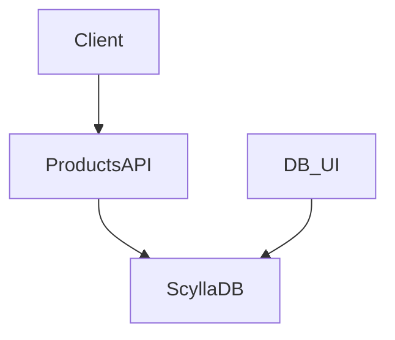

# ScyllaDB Quickstart for Products API

## How to run locally
- Build and start everything: `docker compose up -d --build`
- Services:
  - REST API: http://localhost:8080
  - Scylla CQL: localhost:9042
  - UI (cassandra-web): http://localhost:3000 (host: `scylla`, port: `9042`)

## Schema & seed
- Keyspace: `products`
- Table: `products(id uuid PRIMARY KEY, name text, description text, price decimal, stock int, created_at timestamp)`
- Seed data is loaded from `cql/init.cql` via the `scylla-init` job at startup.

## Handy cqlsh commands
```bash
# open shell (inside Scylla container)
docker compose exec scylla cqlsh

# list keyspaces
DESCRIBE KEYSPACES;

# use keyspace
USE products;

# inspect table
DESCRIBE TABLE products;

# query data
SELECT * FROM products LIMIT 20;

# insert a row
INSERT INTO products (id, name, description, price, stock, created_at)
VALUES (uuid(), 'Keyboard', 'Mechanical keyboard', 89.99, 50, toTimestamp(now()));
```

## API smoke tests
```bash
# list products
curl -s http://localhost:8080/api/products | jq

# create product
curl -s -X POST http://localhost:8080/api/products \
  -H 'Content-Type: application/json' \
  -d '{"name":"Headphones","description":"ANC","price":149.99,"stock":25}' | jq
```

## Flow

