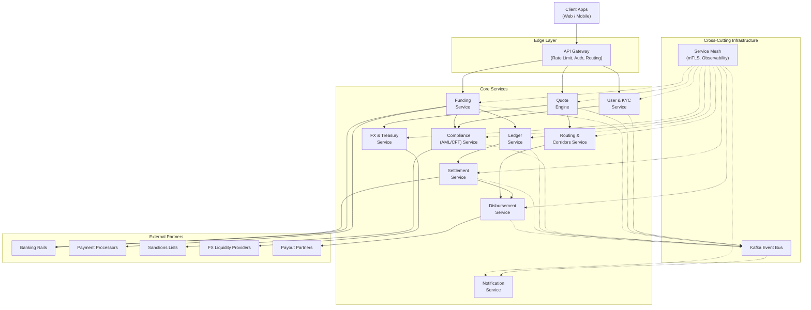

# Digital Remittance Platform — System Design

## Problem Statement

Design a **cross-border money transfer platform** (comparable to Wise or Remitly) that enables users to send money internationally with transparent pricing, regulatory compliance, and fast delivery. The system must handle diverse payment corridors, multiple currencies, varying regulatory regimes, and heterogeneous payout rails — all at scale.

## Scale Targets

| Metric | Target |
|---|---|
| Transfers per day | 1M+ |
| Active corridors | 50+ |
| Quote creation latency | < 200 ms (p99) |
| Transfer completion (major corridors) | < 1 hour |
| Availability | 99.95% |
| Concurrent users | 100K+ |

## High-Level Architecture

### Transfer Flow Summary

1. **User onboards** via User & KYC Service (identity verification, document checks).
2. **Quote Engine** fetches live FX rates and fees, locks a quote for a configurable window.
3. **Funding Service** collects money from the sender via bank transfer, card, or wallet.
4. **Compliance Service** runs AML/CFT screening and sanctions checks.
5. **Ledger Service** records double-entry bookkeeping entries for every state transition.
6. **FX & Treasury Service** executes the currency conversion against hedged positions.
7. **Routing & Corridors Service** selects the optimal payout rail for the destination.
8. **Settlement Service** batches and reconciles settlements with banking partners.
9. **Disbursement Service** delivers funds to the recipient via the chosen rail.
10. **Notification Service** keeps sender and recipient informed at every stage.

## Tech Stack

| Layer | Technology | Rationale |
|---|---|---|
| Latency-sensitive services (Quote, Routing, Gateway) | **Go** | Low-latency, efficient concurrency |
| Compliance & Settlement services | **Java / Kotlin** | Mature ecosystem for financial logic, strong typing |
| Primary datastore | **PostgreSQL** | ACID transactions, JSONB flexibility |
| Event streaming | **Apache Kafka** | Durable, ordered event log for async workflows |
| Caching | **Redis** | Sub-ms reads for FX rates, quote locks, sessions |
| Time-series metrics & rate history | **TimescaleDB** | Efficient time-range queries on FX and transfer data |
| Object storage | **S3-compatible** | KYC documents, compliance artifacts |
| Service mesh | **Istio / Linkerd** | mTLS, traffic management, observability |
| Orchestration | **Kubernetes** | Auto-scaling, rolling deploys, self-healing |
| Observability | **Prometheus + Grafana + Jaeger** | Metrics, dashboards, distributed tracing |

## Design Documents

| # | Document | Description |
|---|---|---|
| 1 | [System Architecture](design/system-architecture.md) | Service decomposition, tech stack, deployment topology |
| 2 | [Data Flow](design/data-flow.md) | Transfer lifecycle and state machine |
| 3 | [API Contracts](design/api-contracts.md) | API design, versioning, and contract specifications |
| 4 | [Data Modeling](design/data-modeling.md) | Database schema and entity relationships |
| 5 | [KYC & Compliance](design/kyc-compliance.md) | KYC, AML, and sanctions screening |
| 6 | [Quote Engine](design/quote-engine.md) | FX rates, fees, and quote locking |
| 7 | [Funding & Collection](design/funding-and-collection.md) | Payment collection rails |
| 8 | [FX & Treasury](design/fx-treasury.md) | Currency conversion and hedging |
| 9 | [Routing & Corridors](design/routing-and-corridors.md) | Payout rail selection |
| 10 | [Settlement & Reconciliation](design/settlement-reconciliation.md) | Batch settlement and reconciliation |
| 11 | [Disbursement](design/disbursement.md) | Payout delivery |
| 12 | [Observability](design/observability.md) | Metrics, logging, tracing, and alerting |
| 13 | [Security](design/security.md) | Encryption, auth, fraud prevention, and PCI compliance |
| 14 | [Fault Tolerance](design/fault-tolerance.md) | Saga orchestration, retries, circuit breakers, and DR |
| 15 | [Performance](design/performance.md) | Caching, scaling, and optimization strategies |
| 16 | [Cost Model](design/cost-model.md) | Infrastructure and per-transaction cost analysis |
| 17 | [Happy Flow](design/happy-flow.md) | End-to-end transfer walkthrough |
