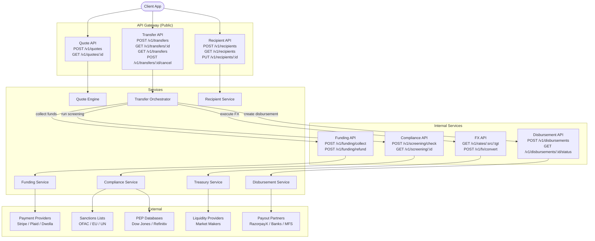

# Digital Remittance Platform -- API Contracts

## Overview

All APIs follow RESTful conventions with versioned paths (`/v1/`). Public APIs are exposed through the API Gateway. Internal APIs are accessed over the service mesh (mTLS, no public exposure).

---

## Common Patterns

### Authentication & Authorization

- Public APIs: Bearer token (JWT) in `Authorization` header. Tokens issued by Auth Service, scoped per user.
- Internal APIs: mTLS certificates issued per service. No user-level auth -- the calling service is trusted.

### Idempotency

All mutating endpoints (POST, PUT) accept an `X-Idempotency-Key` header. The server stores the key and its associated response for 24 hours. Duplicate requests with the same key return the original response with HTTP 200 (not 201).

```
X-Idempotency-Key: ik_a1b2c3d4e5f6
```

### Correlation

Every request generates or propagates a correlation ID for distributed tracing:

```
X-Request-Id: req_m4n5o6p7q8r9
```

This ID is included in all downstream service calls, Kafka events, and log entries.

### Standard Error Envelope

All errors follow this structure:

```json
{
  "error": {
    "code": "QUOTE_EXPIRED",
    "message": "The quote has expired. Please create a new quote.",
    "retry_after": 0
  }
}
```

| Field | Type | Description |
|-------|------|-------------|
| `code` | string | Machine-readable error code (uppercase, underscore-separated) |
| `message` | string | Human-readable explanation |
| `retry_after` | integer | Seconds to wait before retrying (0 = do not retry) |

### Common Error Codes

| Code | HTTP Status | Description |
|------|-------------|-------------|
| `VALIDATION_ERROR` | 400 | Request body failed validation |
| `UNAUTHORIZED` | 401 | Missing or invalid auth token |
| `FORBIDDEN` | 403 | Insufficient permissions |
| `NOT_FOUND` | 404 | Resource does not exist |
| `IDEMPOTENCY_CONFLICT` | 409 | Idempotency key reused with different payload |
| `QUOTE_EXPIRED` | 409 | Quote TTL exceeded |
| `RATE_LIMITED` | 429 | Too many requests |
| `INTERNAL_ERROR` | 500 | Unexpected server error |
| `SERVICE_UNAVAILABLE` | 503 | Dependency is down |

### Rate Limiting

| Tier | Limit | Scope |
|------|-------|-------|
| Public API (per user) | 100 req/s | Keyed on user_id from JWT |
| Public API (per IP, unauthenticated) | 20 req/s | Keyed on client IP |
| Internal service-to-service | 10,000 req/s | Keyed on service identity |

Rate limit headers are included in every response:

```
X-RateLimit-Limit: 100
X-RateLimit-Remaining: 87
X-RateLimit-Reset: 1705312800
```

### Pagination

List endpoints use cursor-based pagination:

```
GET /v1/transfers?cursor=eyJpZCI6MTAwfQ&limit=20
```

Response includes:

```json
{
  "data": [...],
  "pagination": {
    "next_cursor": "eyJpZCI6MTIwfQ",
    "has_more": true
  }
}
```

---

## Public APIs

### Quote API

Exposed via API Gateway. Used by the client to get a guaranteed exchange rate and fee breakdown.

#### POST /v1/quotes -- Create Quote

Creates a locked quote for a specific corridor and amount.

**Request:**

```json
{
  "source_currency": "USD",
  "target_currency": "INR",
  "source_amount": 1000.00,
  "fixed_side": "source"
}
```

| Field | Type | Required | Description |
|-------|------|----------|-------------|
| `source_currency` | string | Yes | ISO 4217 currency code |
| `target_currency` | string | Yes | ISO 4217 currency code |
| `source_amount` | decimal | Conditional | Amount in source currency (required if `fixed_side` = "source") |
| `target_amount` | decimal | Conditional | Amount in target currency (required if `fixed_side` = "target") |
| `fixed_side` | string | Yes | Which side is fixed: "source" or "target" |

**Response (201 Created):**

```json
{
  "data": {
    "quote_id": "qt_x1y2z3a4",
    "source_currency": "USD",
    "target_currency": "INR",
    "source_amount": 1000.00,
    "target_amount": 83150.00,
    "exchange_rate": 83.52,
    "mid_market_rate": 83.90,
    "fee": {
      "total": 3.99,
      "currency": "USD",
      "breakdown": {
        "transfer_fee": 2.99,
        "payment_method_fee": 1.00
      }
    },
    "total_cost": 1003.99,
    "expires_at": "2025-01-15T10:31:00Z",
    "created_at": "2025-01-15T10:30:00Z"
  }
}
```

#### GET /v1/quotes/{quote_id} -- Get Quote

**Response (200 OK):**

```json
{
  "data": {
    "quote_id": "qt_x1y2z3a4",
    "source_currency": "USD",
    "target_currency": "INR",
    "source_amount": 1000.00,
    "target_amount": 83150.00,
    "exchange_rate": 83.52,
    "fee": {
      "total": 3.99,
      "currency": "USD"
    },
    "total_cost": 1003.99,
    "expired": false,
    "expires_at": "2025-01-15T10:31:00Z",
    "created_at": "2025-01-15T10:30:00Z"
  }
}
```

---

### Transfer API

Core API for initiating and tracking money transfers.

#### POST /v1/transfers -- Initiate Transfer

**Headers:**

```
Authorization: Bearer <jwt>
X-Idempotency-Key: ik_user123_transfer_20250115_001
```

**Request:**

```json
{
  "quote_id": "qt_x1y2z3a4",
  "recipient_id": "rcp_b5c6d7e8",
  "payment_method": {
    "type": "card",
    "id": "pm_f9g0h1i2"
  },
  "purpose": "family_support",
  "reference": "Monthly allowance"
}
```

| Field | Type | Required | Description |
|-------|------|----------|-------------|
| `quote_id` | string | Yes | Valid, unexpired quote |
| `recipient_id` | string | Yes | Previously created recipient |
| `payment_method.type` | string | Yes | "card", "ach", "bank_transfer", "wallet" |
| `payment_method.id` | string | Yes | Stored payment method ID |
| `purpose` | string | Yes | Transfer purpose code (regulatory requirement) |
| `reference` | string | No | Sender's note (max 140 chars) |

**Response (201 Created):**

```json
{
  "data": {
    "transfer_id": "txn_j3k4l5m6",
    "quote_id": "qt_x1y2z3a4",
    "status": "CREATED",
    "source_amount": 1000.00,
    "source_currency": "USD",
    "target_amount": 83150.00,
    "target_currency": "INR",
    "fee": 3.99,
    "exchange_rate": 83.52,
    "recipient": {
      "id": "rcp_b5c6d7e8",
      "name": "Priya Sharma"
    },
    "payment_method": {
      "type": "card",
      "last_four": "4242"
    },
    "estimated_delivery": "2025-01-15T11:00:00Z",
    "created_at": "2025-01-15T10:30:15Z"
  }
}
```

#### GET /v1/transfers/{transfer_id} -- Get Transfer

**Response (200 OK):**

```json
{
  "data": {
    "transfer_id": "txn_j3k4l5m6",
    "status": "DELIVERED",
    "source_amount": 1000.00,
    "source_currency": "USD",
    "target_amount": 83150.00,
    "target_currency": "INR",
    "fee": 3.99,
    "exchange_rate": 83.52,
    "recipient": {
      "id": "rcp_b5c6d7e8",
      "name": "Priya Sharma"
    },
    "payment_method": {
      "type": "card",
      "last_four": "4242"
    },
    "timeline": [
      { "status": "CREATED", "at": "2025-01-15T10:30:15Z" },
      { "status": "FUNDED", "at": "2025-01-15T10:30:18Z" },
      { "status": "SCREENING", "at": "2025-01-15T10:30:19Z" },
      { "status": "PROCESSING", "at": "2025-01-15T10:30:20Z" },
      { "status": "CONVERTING", "at": "2025-01-15T10:30:21Z" },
      { "status": "ROUTING", "at": "2025-01-15T10:30:21Z" },
      { "status": "DISBURSING", "at": "2025-01-15T10:30:22Z" },
      { "status": "DELIVERED", "at": "2025-01-15T10:32:45Z" }
    ],
    "estimated_delivery": "2025-01-15T11:00:00Z",
    "delivered_at": "2025-01-15T10:32:45Z",
    "created_at": "2025-01-15T10:30:15Z"
  }
}
```

#### GET /v1/transfers -- List Transfers

**Query Parameters:**

| Parameter | Type | Description |
|-----------|------|-------------|
| `status` | string | Filter by status (comma-separated for multiple) |
| `recipient_id` | string | Filter by recipient |
| `created_after` | datetime | ISO 8601 timestamp |
| `created_before` | datetime | ISO 8601 timestamp |
| `cursor` | string | Pagination cursor |
| `limit` | integer | Page size (default 20, max 100) |

**Response (200 OK):**

```json
{
  "data": [
    {
      "transfer_id": "txn_j3k4l5m6",
      "status": "DELIVERED",
      "source_amount": 1000.00,
      "source_currency": "USD",
      "target_amount": 83150.00,
      "target_currency": "INR",
      "recipient": {
        "id": "rcp_b5c6d7e8",
        "name": "Priya Sharma"
      },
      "created_at": "2025-01-15T10:30:15Z"
    }
  ],
  "pagination": {
    "next_cursor": "eyJ0cmFuc2Zlcl9pZCI6InR4bl9qM2s0bDVtNiJ9",
    "has_more": false
  }
}
```

#### POST /v1/transfers/{transfer_id}/cancel -- Cancel Transfer

Can only cancel transfers in `CREATED` or `FUNDED` state. Transfers past compliance screening cannot be cancelled via API (requires support ticket).

**Response (200 OK):**

```json
{
  "data": {
    "transfer_id": "txn_j3k4l5m6",
    "status": "FAILED",
    "cancellation": {
      "reason": "user_requested",
      "cancelled_at": "2025-01-15T10:30:45Z",
      "refund_status": "REFUNDING",
      "refund_eta": "2025-01-18T00:00:00Z"
    }
  }
}
```

**Error (409 Conflict -- transfer too far along):**

```json
{
  "error": {
    "code": "CANCELLATION_NOT_ALLOWED",
    "message": "Transfer in DISBURSING state cannot be cancelled. Please contact support.",
    "retry_after": 0
  }
}
```

---

### Recipient API

Manages saved recipient (beneficiary) records.

#### POST /v1/recipients -- Create Recipient

**Request:**

```json
{
  "name": "Priya Sharma",
  "country": "IN",
  "currency": "INR",
  "type": "bank_account",
  "details": {
    "account_number": "1234567890",
    "ifsc_code": "HDFC0001234",
    "bank_name": "HDFC Bank"
  },
  "relationship": "family",
  "email": "priya@example.com",
  "phone": "+919876543210"
}
```

| Field | Type | Required | Description |
|-------|------|----------|-------------|
| `name` | string | Yes | Full legal name |
| `country` | string | Yes | ISO 3166-1 alpha-2 |
| `currency` | string | Yes | ISO 4217 |
| `type` | string | Yes | "bank_account", "mobile_wallet", "cash_pickup" |
| `details` | object | Yes | Type-specific fields (bank: account_number, routing; wallet: phone; cash: none) |
| `relationship` | string | Yes | Relationship to sender (regulatory requirement) |
| `email` | string | No | Recipient email for notifications |
| `phone` | string | No | Recipient phone (E.164 format) |

**Response (201 Created):**

```json
{
  "data": {
    "recipient_id": "rcp_b5c6d7e8",
    "name": "Priya Sharma",
    "country": "IN",
    "currency": "INR",
    "type": "bank_account",
    "details": {
      "account_number_masked": "******7890",
      "ifsc_code": "HDFC0001234",
      "bank_name": "HDFC Bank"
    },
    "relationship": "family",
    "created_at": "2025-01-15T09:00:00Z"
  }
}
```

#### GET /v1/recipients -- List Recipients

**Response (200 OK):**

```json
{
  "data": [
    {
      "recipient_id": "rcp_b5c6d7e8",
      "name": "Priya Sharma",
      "country": "IN",
      "currency": "INR",
      "type": "bank_account",
      "details": {
        "account_number_masked": "******7890",
        "bank_name": "HDFC Bank"
      },
      "created_at": "2025-01-15T09:00:00Z"
    }
  ],
  "pagination": {
    "next_cursor": null,
    "has_more": false
  }
}
```

#### PUT /v1/recipients/{recipient_id} -- Update Recipient

**Request:**

```json
{
  "email": "priya.new@example.com",
  "phone": "+919876543211"
}
```

Only mutable fields can be updated (email, phone, relationship). Changing bank details requires creating a new recipient (compliance audit trail).

**Response (200 OK):**

```json
{
  "data": {
    "recipient_id": "rcp_b5c6d7e8",
    "name": "Priya Sharma",
    "country": "IN",
    "currency": "INR",
    "type": "bank_account",
    "details": {
      "account_number_masked": "******7890",
      "bank_name": "HDFC Bank"
    },
    "email": "priya.new@example.com",
    "phone": "+919876543211",
    "relationship": "family",
    "updated_at": "2025-01-15T12:00:00Z"
  }
}
```

---

## Internal APIs

These APIs are only accessible within the service mesh. They are called by the Transfer Orchestrator or triggered by Kafka event consumers.

### Funding API

#### POST /v1/funding/collect -- Collect Funds

**Request:**

```json
{
  "transfer_id": "txn_j3k4l5m6",
  "amount": 1003.99,
  "currency": "USD",
  "payment_method": {
    "type": "card",
    "token": "tok_stripe_abc123"
  },
  "metadata": {
    "sender_id": "usr_n7o8p9",
    "idempotency_key": "ik_user123_transfer_20250115_001"
  }
}
```

**Response (200 OK):**

```json
{
  "data": {
    "funding_id": "fund_p1q2r3",
    "transfer_id": "txn_j3k4l5m6",
    "status": "COMPLETED",
    "amount": 1003.99,
    "currency": "USD",
    "psp": "stripe",
    "psp_reference": "pi_stripe_xyz789",
    "funded_at": "2025-01-15T10:30:18Z"
  }
}
```

**Response (200 OK -- failure):**

```json
{
  "data": {
    "funding_id": "fund_p1q2r3",
    "transfer_id": "txn_j3k4l5m6",
    "status": "FAILED",
    "failure_reason": "insufficient_funds",
    "psp": "stripe",
    "psp_reference": "pi_stripe_xyz789"
  }
}
```

#### POST /v1/funding/refund -- Refund Funds

**Request:**

```json
{
  "transfer_id": "txn_j3k4l5m6",
  "funding_id": "fund_p1q2r3",
  "amount": 1003.99,
  "currency": "USD",
  "reason": "user_cancelled"
}
```

**Response (200 OK):**

```json
{
  "data": {
    "refund_id": "ref_s4t5u6",
    "transfer_id": "txn_j3k4l5m6",
    "funding_id": "fund_p1q2r3",
    "status": "PROCESSING",
    "amount": 1003.99,
    "currency": "USD",
    "estimated_completion": "2025-01-18T00:00:00Z",
    "initiated_at": "2025-01-15T10:31:00Z"
  }
}
```

---

### Compliance API

#### POST /v1/screening/check -- Run Compliance Check

**Request:**

```json
{
  "transfer_id": "txn_j3k4l5m6",
  "sender": {
    "id": "usr_n7o8p9",
    "full_name": "John Smith",
    "date_of_birth": "1985-03-15",
    "country": "US",
    "address": {
      "line1": "123 Main St",
      "city": "New York",
      "state": "NY",
      "postal_code": "10001",
      "country": "US"
    }
  },
  "recipient": {
    "id": "rcp_b5c6d7e8",
    "full_name": "Priya Sharma",
    "country": "IN"
  },
  "transaction": {
    "source_amount": 1000.00,
    "source_currency": "USD",
    "target_amount": 83150.00,
    "target_currency": "INR",
    "corridor": "US-IN",
    "purpose": "family_support"
  }
}
```

**Response (200 OK):**

```json
{
  "data": {
    "check_id": "chk_v7w8x9",
    "transfer_id": "txn_j3k4l5m6",
    "outcome": "PASS",
    "checks": [
      {
        "type": "sanctions",
        "result": "CLEAR",
        "lists_checked": ["OFAC_SDN", "EU_CONSOLIDATED", "UN_SANCTIONS"],
        "duration_ms": 145
      },
      {
        "type": "pep",
        "result": "CLEAR",
        "provider": "dow_jones",
        "duration_ms": 320
      },
      {
        "type": "transaction_pattern",
        "result": "CLEAR",
        "fraud_score": 0.12,
        "threshold": 0.70,
        "duration_ms": 210
      },
      {
        "type": "velocity",
        "result": "CLEAR",
        "counters": {
          "daily_count": 2,
          "daily_limit": 10,
          "monthly_volume_usd": 3500.00,
          "monthly_limit_usd": 50000.00
        },
        "duration_ms": 15
      }
    ],
    "completed_at": "2025-01-15T10:30:20Z"
  }
}
```

**Response (200 OK -- flagged for review):**

```json
{
  "data": {
    "check_id": "chk_v7w8x9",
    "transfer_id": "txn_j3k4l5m6",
    "outcome": "REVIEW",
    "checks": [
      {
        "type": "sanctions",
        "result": "POSSIBLE_MATCH",
        "matches": [
          {
            "list": "OFAC_SDN",
            "matched_name": "Priya Sharma",
            "score": 0.82,
            "entry_id": "OFAC-12345"
          }
        ],
        "duration_ms": 145
      },
      {
        "type": "pep",
        "result": "CLEAR"
      },
      {
        "type": "transaction_pattern",
        "result": "CLEAR",
        "fraud_score": 0.15
      },
      {
        "type": "velocity",
        "result": "CLEAR"
      }
    ],
    "review_reason": "Possible sanctions match on recipient name (score: 0.82)",
    "completed_at": "2025-01-15T10:30:20Z"
  }
}
```

#### GET /v1/screening/{check_id} -- Get Check Status

**Response (200 OK):**

```json
{
  "data": {
    "check_id": "chk_v7w8x9",
    "transfer_id": "txn_j3k4l5m6",
    "outcome": "PASS",
    "review": {
      "required": true,
      "analyst_id": "analyst_42",
      "decision": "APPROVED",
      "notes": "False positive. Recipient verified against passport.",
      "decided_at": "2025-01-15T11:15:00Z"
    },
    "completed_at": "2025-01-15T10:30:20Z"
  }
}
```

---

### FX API

#### GET /v1/rates/{source}/{target} -- Get Live Rate

**Example:** `GET /v1/rates/USD/INR`

**Response (200 OK):**

```json
{
  "data": {
    "source_currency": "USD",
    "target_currency": "INR",
    "mid_market_rate": 83.90,
    "buy_rate": 83.52,
    "sell_rate": 84.28,
    "margin_pct": 0.45,
    "timestamp": "2025-01-15T10:30:00Z",
    "source": "aggregated",
    "stale": false
  }
}
```

#### POST /v1/fx/convert -- Execute FX Conversion

**Request:**

```json
{
  "transfer_id": "txn_j3k4l5m6",
  "source_currency": "USD",
  "target_currency": "INR",
  "source_amount": 1000.00,
  "locked_rate": 83.52,
  "max_slippage_pct": 0.50
}
```

**Response (200 OK):**

```json
{
  "data": {
    "conversion_id": "conv_y1z2a3",
    "transfer_id": "txn_j3k4l5m6",
    "source_currency": "USD",
    "target_currency": "INR",
    "source_amount": 1000.00,
    "target_amount": 83520.00,
    "rate_applied": 83.52,
    "liquidity_source": "INTERNAL",
    "ledger_entries": [
      {
        "account": "USD_POOL",
        "direction": "DEBIT",
        "amount": 1000.00,
        "currency": "USD"
      },
      {
        "account": "INR_POOL",
        "direction": "CREDIT",
        "amount": 83520.00,
        "currency": "INR"
      }
    ],
    "converted_at": "2025-01-15T10:30:21Z"
  }
}
```

---

### Disbursement API

#### POST /v1/disbursements -- Create Disbursement

**Request:**

```json
{
  "transfer_id": "txn_j3k4l5m6",
  "partner": "razorpayx",
  "fallback_partner": "yes_bank_direct",
  "amount": 83520.00,
  "currency": "INR",
  "recipient": {
    "name": "Priya Sharma",
    "account_number": "1234567890",
    "ifsc_code": "HDFC0001234",
    "type": "bank_account"
  },
  "reference": "txn_j3k4l5m6"
}
```

**Response (201 Created):**

```json
{
  "data": {
    "disbursement_id": "disb_b4c5d6",
    "transfer_id": "txn_j3k4l5m6",
    "status": "SUBMITTED",
    "partner": "razorpayx",
    "partner_reference": "rpx_payout_abc789",
    "amount": 83520.00,
    "currency": "INR",
    "estimated_delivery": "2025-01-15T10:35:00Z",
    "submitted_at": "2025-01-15T10:30:22Z"
  }
}
```

#### GET /v1/disbursements/{disbursement_id}/status -- Get Disbursement Status

**Response (200 OK):**

```json
{
  "data": {
    "disbursement_id": "disb_b4c5d6",
    "transfer_id": "txn_j3k4l5m6",
    "status": "DELIVERED",
    "partner": "razorpayx",
    "partner_reference": "rpx_payout_abc789",
    "amount": 83520.00,
    "currency": "INR",
    "partner_status": "processed",
    "utr": "HDFC25011500001234",
    "submitted_at": "2025-01-15T10:30:22Z",
    "delivered_at": "2025-01-15T10:32:45Z"
  }
}
```

---

## Service API Map & Call Flow

The following diagram shows which services own which APIs and how calls flow between them during a transfer.



### Call Flow Summary

| Step | Caller | API Called | Purpose |
|------|--------|-----------|---------|
| 1 | Client | `POST /v1/quotes` | Get guaranteed rate |
| 2 | Client | `POST /v1/transfers` | Start transfer with quote |
| 3 | Transfer Orchestrator | `POST /v1/funding/collect` | Charge sender |
| 4 | Transfer Orchestrator | `POST /v1/screening/check` | Compliance verification |
| 5 | Transfer Orchestrator | `POST /v1/fx/convert` | Currency conversion |
| 6 | Transfer Orchestrator | `POST /v1/disbursements` | Send to recipient |
| 7 | Client | `GET /v1/transfers/{id}` | Poll for status updates |

Note: Steps 3-6 are triggered by Kafka events in the actual flow. The Transfer Orchestrator does not make synchronous calls to all downstream services. Each service consumes its trigger event, performs its work, and emits the next event. The "orchestration" is choreography-based, driven by the event stream.

---

## Webhook Callbacks (Partner -> Platform)

Payout partners send delivery confirmations via webhooks. Each partner has a dedicated webhook endpoint:

```
POST /v1/webhooks/partners/{partner_name}
```

**Example payload (RazorpayX):**

```json
{
  "event": "payout.processed",
  "payload": {
    "payout": {
      "id": "rpx_payout_abc789",
      "status": "processed",
      "utr": "HDFC25011500001234",
      "amount": 8352000,
      "currency": "INR"
    }
  }
}
```

Webhook security:
- Signature verification via `X-Razorpay-Signature` header (HMAC-SHA256).
- IP allowlisting per partner.
- Idempotent processing keyed on partner event ID.
