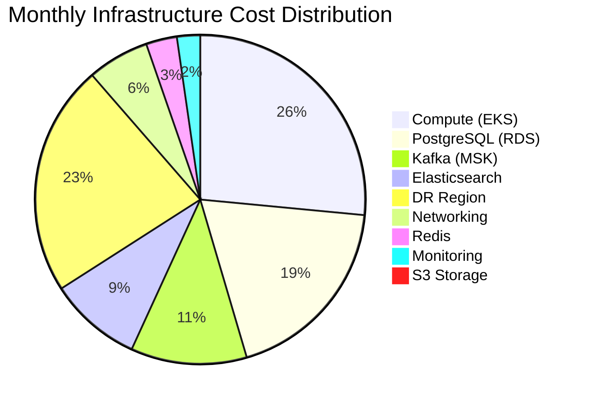
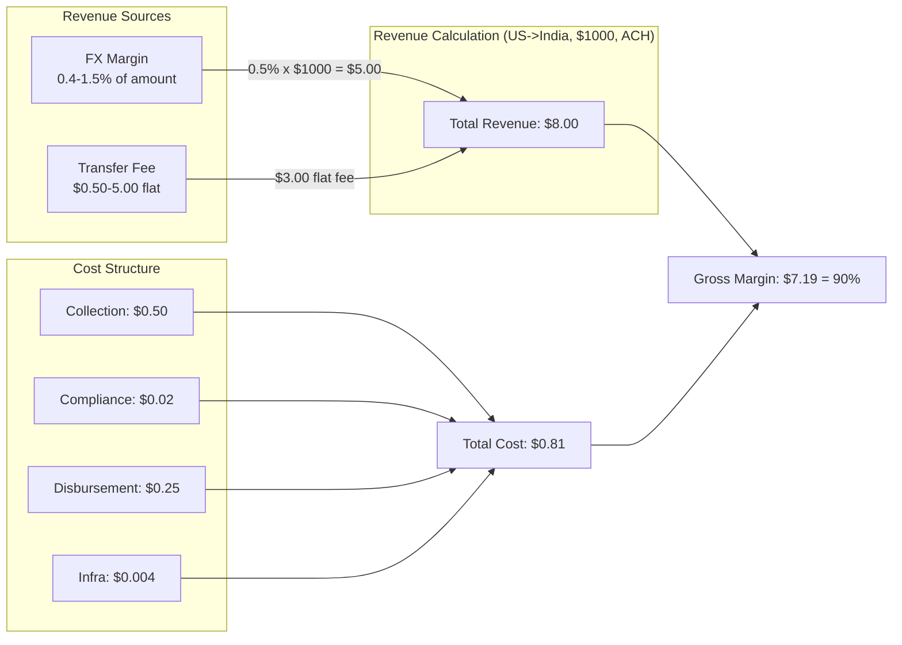
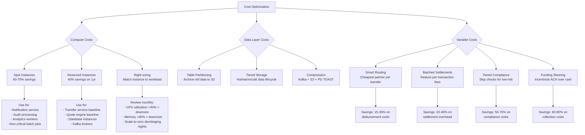

# Cost Model & Economics

## Infrastructure Costs (Monthly, ~1M transfers/day)

### Compute & Storage

| Component | Sizing | Monthly Cost |
|---|---|---|
| **Compute (EKS)** | 40 nodes c6g.2xlarge (8 vCPU, 16GB each) | $35,000 |
| **PostgreSQL (RDS)** | 3 clusters Multi-AZ r6g.4xlarge + 2 read replicas each | $25,000 |
| **Kafka (MSK)** | 6 brokers kafka.m5.4xlarge, 3TB retention storage | $15,000 |
| **Redis (ElastiCache)** | 3-node r6g.xlarge cluster (Multi-AZ) | $4,000 |
| **Elasticsearch** | 6 data nodes r6g.2xlarge + 3 master nodes | $12,000 |
| **S3** | 50TB archival (transfers, ledger, audit logs) | $1,200 |
| **Networking** | NAT Gateway, inter-AZ transfer, API Gateway | $8,000 |
| **DR Region** | ~40% of primary (warm standby) | $30,000 |
| **Monitoring** | Grafana Cloud, PagerDuty, Jaeger tracing | $3,000 |
| **Total** | | **~$133,000/month** |

### Cost Breakdown



### Scaling Cost Projections

| Scale | Transfers/Day | Monthly Infra Cost | Cost/Transfer |
|---|---|---|---|
| Startup | 10K | ~$15,000 | $0.050 |
| Growth | 100K | ~$45,000 | $0.015 |
| **Current target** | **1M** | **~$133,000** | **$0.004** |
| Scale-up | 5M | ~$450,000 | $0.003 |

Infrastructure cost per transfer decreases significantly with scale due to fixed costs (DR, monitoring, base compute) being amortized across more transactions.

## Per-Transaction Cost Breakdown

### Variable Costs

| Component | Per Transfer | Notes |
|---|---|---|
| **Infrastructure** | $0.004 | $133K / 30M monthly transfers |
| **Payment collection** | $0.50 - $3.00 | Card ~2.5% (min $0.50), ACH ~$0.50 flat, bank debit ~$0.30 |
| **Compliance screening** | $0.02 - $0.10 | Sanctions check $0.02, full AML $0.10 |
| **KYC verification** | $1.50 - $3.00 | One-time cost, amortized over user lifetime (~20 transfers) = $0.08-0.15 |
| **FX execution** | $0.00 | No per-trade fee; cost embedded in spread from liquidity provider |
| **Disbursement** | $0.25 - $5.00 | Bank $0.25-1.00, mobile money $0.50-2.00, cash pickup $2.00-5.00 |
| **Notifications** | $0.01 | ~3 SMS per transfer at $0.003/SMS |
| **Total variable** | **$0.78 - $11.13** | Highly corridor and payment method dependent |

### Cost by Corridor Example

| Corridor | Amount | Fund Method | Payout Rail | Collection | Compliance | Disbursement | Infra | Total Cost | Revenue | Margin |
|---|---|---|---|---|---|---|---|---|---|---|
| US -> India | $1,000 | ACH | Bank transfer | $0.50 | $0.02 | $0.25 | $0.004 | **$0.81** | $8.00 | **90%** |
| US -> India | $1,000 | Card | Bank transfer | $2.50 | $0.02 | $0.25 | $0.004 | **$2.81** | $8.00 | **65%** |
| US -> Philippines | $500 | ACH | Mobile money | $0.50 | $0.05 | $1.50 | $0.004 | **$2.09** | $6.50 | **68%** |
| UK -> Nigeria | $200 | Bank debit | Cash pickup | $0.30 | $0.10 | $4.00 | $0.004 | **$4.44** | $5.00 | **11%** |
| US -> Mexico | $300 | Card | Bank transfer | $1.50 | $0.02 | $0.50 | $0.004 | **$2.06** | $4.50 | **54%** |

## Revenue Model

### Revenue Streams



### Pricing Strategy

| Component | Range | Logic |
|---|---|---|
| **FX margin** | 0.4% - 1.5% | Varies by corridor liquidity, competition, and transfer size. High-volume corridors (US-India, US-Mexico) have tighter margins. |
| **Transfer fee** | $0.50 - $5.00 | Flat fee per corridor. Lower for ACH/bank, higher for card-funded. Zero-fee promotions for first transfer. |
| **Premium speed** | +$2.00 - $5.00 | Optional instant delivery surcharge (where available). |

### Unit Economics at Scale

| Metric | Value |
|---|---|
| Average transfer size | $500 |
| Average revenue per transfer | $5.50 |
| Average variable cost per transfer | $1.80 |
| Gross margin per transfer | $3.70 (67%) |
| Monthly transfers (1M/day) | 30M |
| Monthly gross revenue | $165M |
| Monthly variable costs | $54M |
| Monthly infrastructure costs | $0.133M |
| **Monthly gross profit** | **$110.9M** |

## Cost Optimization Levers

### Cost Optimization Decision Tree



### Optimization Details

#### Compute Optimization

| Strategy | Applicable To | Savings | Risk |
|---|---|---|---|
| **Spot instances** | Notification, audit, analytics, batch workers | 60-70% | Interruption (mitigated by Kafka reprocessing) |
| **Reserved instances (1yr)** | Database, Kafka brokers, baseline compute | 40% | Commitment; review quarterly |
| **Savings Plans (3yr)** | Stable baseline compute | 50-55% | Longer commitment |
| **Right-sizing** | All services | 10-30% | Under-provisioning risk |
| **Scale-to-zero** | Dev/staging environments nights & weekends | 50-60% of non-prod | None |

**Projected compute savings:** $35K -> ~$22K/month with spot + RI mix.

#### Smart Routing

When multiple partners serve the same corridor and rail, the routing engine selects based on a **cost-quality score:**

```
score = (1 - cost_weight) * quality_score + cost_weight * (1 - normalized_cost)
```

- `cost_weight`: 0.3 by default (quality-biased), tunable per corridor.
- `quality_score`: composite of success rate, speed, and reconciliation accuracy.
- `normalized_cost`: partner cost as fraction of max cost in corridor.

This steers traffic toward cheaper partners when quality is comparable, saving 15-30% on disbursement costs without degrading user experience.

#### Batched Settlements

Instead of settling with partners per-transaction:
- **Hourly net settlement** for high-volume partners.
- **Daily net settlement** for lower-volume partners.
- **Netting** reduces the number of settlement transactions by 80-90%, saving on bank wire fees ($15-25 per wire).

#### Tiered Compliance

| Risk Tier | Criteria | Screening | Cost |
|---|---|---|---|
| Low | KYC Tier 3, amount < $500, known corridor | Sanctions only (automated) | $0.02 |
| Medium | KYC Tier 2, amount $500-5000 | Sanctions + basic AML | $0.05 |
| High | KYC Tier 1, amount > $5000, high-risk corridor | Full screening + manual review | $0.10-0.50 |

**Projected savings:** 70% of transfers qualify as low-risk, reducing average compliance cost from $0.06 to $0.03.

#### Funding Method Steering

Card-funded transfers cost 5-10x more to collect than ACH/bank transfers. Incentivize cheaper methods:
- Default to ACH/bank transfer in the UI.
- Show card as an option with a "premium speed" label.
- Offer $1-2 discount for bank-funded transfers on certain corridors.

**Projected savings:** Shifting 20% of card-funded transfers to ACH saves ~$0.40/transfer average across the portfolio.

### Total Optimization Impact

| Category | Before | After | Monthly Savings |
|---|---|---|---|
| Compute | $35,000 | $22,000 | $13,000 |
| Data layer | $57,200 | $48,000 | $9,200 |
| DR region | $30,000 | $22,000 | $8,000 |
| **Infrastructure total** | **$133,000** | **$103,000** | **$30,000** |
| Disbursement (per-transfer) | $1.20 avg | $0.95 avg | $7.5M/month |
| Collection (per-transfer) | $1.50 avg | $1.20 avg | $9.0M/month |
| Compliance (per-transfer) | $0.06 avg | $0.03 avg | $0.9M/month |
