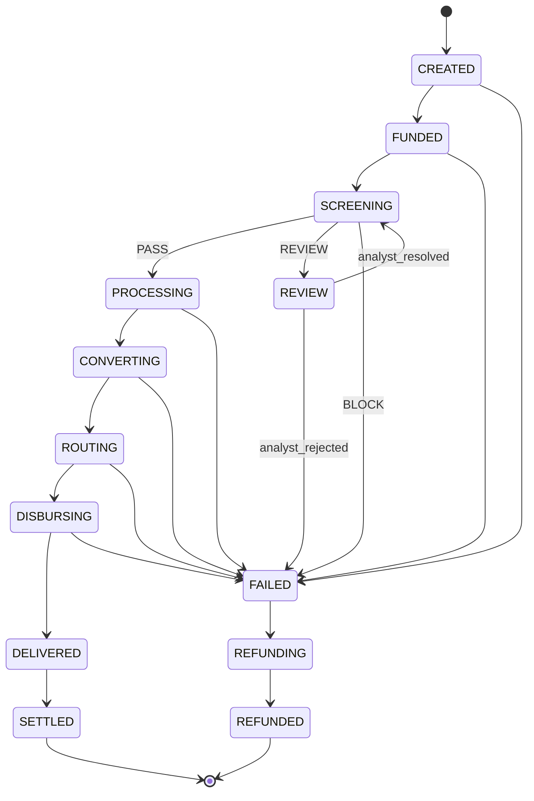
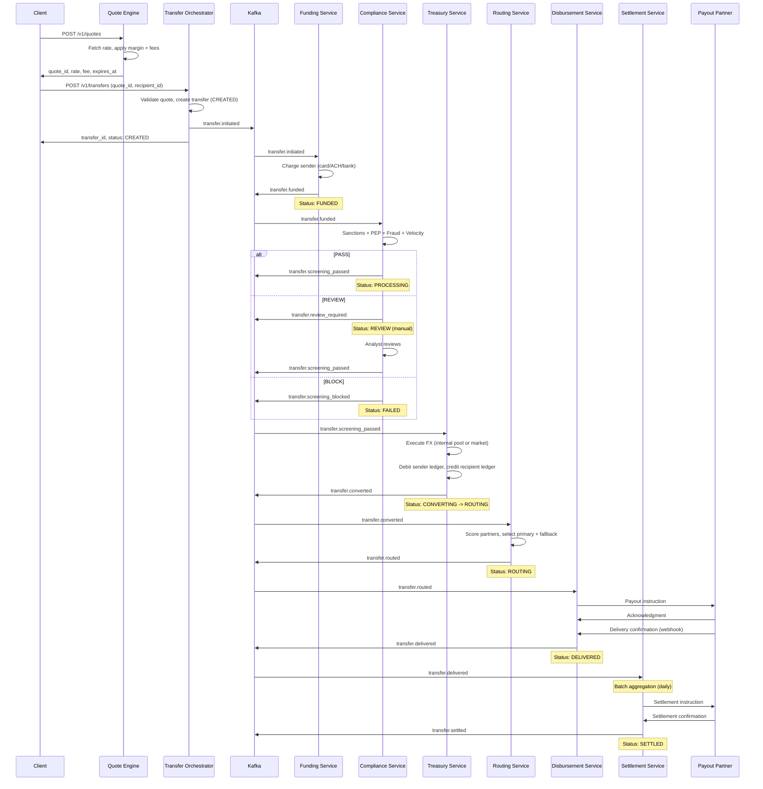
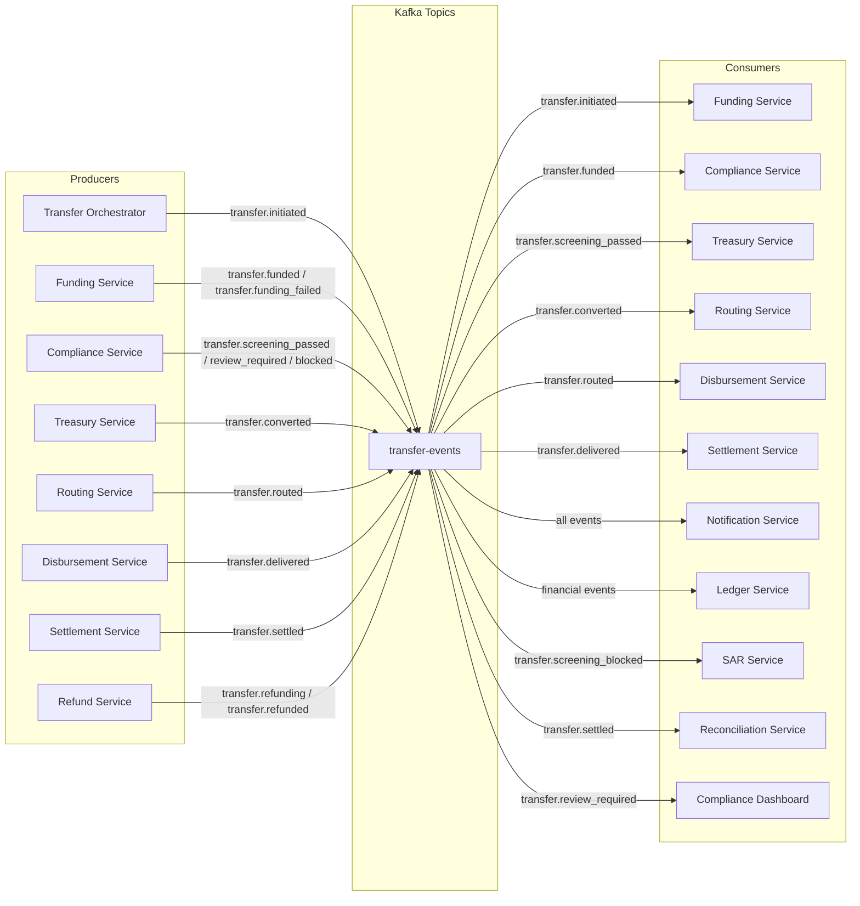

# Digital Remittance Platform -- Data Flow & Transfer Lifecycle

## Overview

This document describes the end-to-end lifecycle of a money transfer on the platform, from quote creation through final settlement. Each transfer passes through eight discrete stages, each owned by a dedicated service, with Kafka events providing the connective tissue between them.

---

## Transfer State Machine

Every transfer record carries a `status` field that follows this state machine. Transitions are enforced at the database level via CHECK constraints and at the application level via the Transfer Orchestrator.

### States

| State | Description |
|-------|-------------|
| `CREATED` | Transfer record exists, awaiting funding |
| `FUNDED` | Sender funds collected successfully |
| `SCREENING` | Compliance checks in progress |
| `REVIEW` | Flagged for manual compliance review |
| `PROCESSING` | Post-compliance processing |
| `CONVERTING` | FX conversion in progress |
| `ROUTING` | Selecting optimal payout rail |
| `DISBURSING` | Payout instruction sent to partner |
| `DELIVERED` | Recipient has received funds |
| `SETTLED` | Intercompany settlement complete |
| `FAILED` | Terminal failure at any stage |
| `REFUNDING` | Refund in progress back to sender |
| `REFUNDED` | Refund completed |

### Transition Rules

- Happy path: `CREATED -> FUNDED -> SCREENING -> PROCESSING -> CONVERTING -> ROUTING -> DISBURSING -> DELIVERED -> SETTLED`
- Manual review branch: `SCREENING -> REVIEW -> SCREENING` (analyst resolves, re-enters screening pipeline)
- Failure from any active state: `{any} -> FAILED -> REFUNDING -> REFUNDED`
- Only `DELIVERED` and `SETTLED` are terminal success states
- `REFUNDED` is a terminal compensation state

### State Machine Diagram



---

## Stage-by-Stage Data Flow

### Stage 1: Create Quote

**Owner:** Quote Engine

The sender selects a corridor (e.g., USD -> INR) and an amount. The Quote Engine:

1. Fetches the live mid-market rate from the Rate Feed Service (aggregates Reuters, ECB, partner feeds).
2. Applies the corridor-specific margin (e.g., 0.45% for USD->INR) and any fixed/variable fees from the Fee Configuration store.
3. Computes the guaranteed receive amount.
4. Stores the quote in Redis with a TTL of 30-60 seconds (configurable per corridor). The quote is immutable once created.
5. Returns the quote to the client.

**Key data:**
- `quote_id`, `source_currency`, `target_currency`, `source_amount`, `target_amount`, `exchange_rate`, `fee`, `expires_at`

**Failure handling:** Quotes are stateless and ephemeral. If the rate feed is unavailable, the service returns a cached rate with a `stale: true` flag and a shorter lock window (15s).

---

### Stage 2: Initiate Transfer

**Owner:** Transfer Orchestrator

When the sender confirms, the client submits the `quote_id` along with recipient details and an `X-Idempotency-Key` header.

1. The Orchestrator validates the quote has not expired.
2. Creates a transfer record in the `transfers` table with status `CREATED`. The idempotency key is stored as a unique index -- duplicate submissions return the existing transfer.
3. Emits `transfer.initiated` to Kafka (topic: `transfer-events`).
4. Returns the `transfer_id` and status to the client.

**Key data:**
- `transfer_id`, `quote_id`, `sender_id`, `recipient_id`, `idempotency_key`, `status: CREATED`, `created_at`

**Failure handling:** If the quote is expired, return `409 QUOTE_EXPIRED`. The client must create a new quote.

---

### Stage 3: Fund Collection

**Owner:** Funding Service

Triggered by the `transfer.initiated` event.

1. Resolves the sender's selected payment method (card, ACH, bank debit, wallet).
2. Calls the appropriate Payment Service Provider (PSP) adapter (Stripe for cards, Plaid+Dwolla for ACH, etc.).
3. Awaits confirmation (synchronous for cards, async webhook for ACH/bank transfers).
4. On success: updates transfer status to `FUNDED`, emits `transfer.funded`.
5. On failure: triggers compensation flow.

**Compensation on failure:**
- Release the quote lock (delete from Redis or mark expired).
- Update transfer status to `FAILED`.
- Emit `transfer.funding_failed` event.
- Push notification to sender: "Payment failed. Please try again."

**Key data:**
- `funding_id`, `transfer_id`, `payment_method`, `psp_reference`, `amount`, `currency`, `status`, `funded_at`

---

### Stage 4: Compliance Screening

**Owner:** Compliance Service

Triggered by the `transfer.funded` event. Runs parallel checks, all of which must pass:

| Check | Source | SLA |
|-------|--------|-----|
| Sanctions screening (OFAC, EU, UN lists) | Internal sanctions DB (daily refresh from official feeds) | < 200ms |
| PEP screening | Dow Jones / Refinitiv API | < 500ms |
| Transaction pattern analysis | Internal ML model (fraud scoring) | < 300ms |
| Velocity checks | Redis counters (transfers per day/week/month per user, per corridor) | < 50ms |

**Outcomes:**
- `PASS` -- All checks clear. Transfer moves to `PROCESSING`. Emits `transfer.screening_passed`.
- `REVIEW` -- One or more checks flagged (e.g., fuzzy name match on sanctions list, fraud score > threshold). Transfer enters `REVIEW` state. Emits `transfer.review_required`. Compliance analyst queue is populated.
- `BLOCK` -- Hard match on sanctions list or confirmed fraud pattern. Transfer moves to `FAILED`. Emits `transfer.screening_blocked`. Suspicious Activity Report (SAR) filed automatically.

**Manual review flow:**
1. Analyst sees the case in the compliance dashboard.
2. Reviews supporting documents, source of funds, prior history.
3. Decision: `APPROVE` (transfer re-enters screening pipeline at `SCREENING` for a final automated pass) or `REJECT` (transfer -> `FAILED`).

---

### Stage 5: FX Conversion

**Owner:** Treasury Service

Triggered by `transfer.screening_passed`.

1. Checks internal liquidity pool for the corridor. If sufficient balance exists in the target currency, executes internally at the locked quote rate.
2. If internal pool is insufficient, executes against market via LP (liquidity provider) API -- applies slippage protection (reject if market rate deviates > 0.5% from quote rate).
3. Double-entry ledger updates:
   - Debit: sender-currency ledger (e.g., USD pool) for `source_amount`
   - Credit: recipient-currency ledger (e.g., INR pool) for `target_amount`
4. Updates transfer status to `CONVERTING` then `ROUTING`. Emits `transfer.converted`.

**Key data:**
- `conversion_id`, `transfer_id`, `source_currency`, `target_currency`, `rate_applied`, `source_amount`, `target_amount`, `liquidity_source` (INTERNAL | MARKET), `converted_at`

**Failure handling:** If market execution fails (LP timeout, slippage breach), retry with secondary LP. If all LPs fail, hold in `CONVERTING` and alert treasury ops. Do not auto-fail -- human intervention preferred for FX failures.

---

### Stage 6: Route Selection

**Owner:** Routing Service

Triggered by `transfer.converted`.

The Routing Service maintains a registry of payout partners per corridor (e.g., for USD->INR: RazorpayX, Yes Bank direct, SWIFT). It selects the optimal rail using a weighted scoring model:

| Factor | Weight | Source |
|--------|--------|--------|
| Corridor availability | Required | Partner registry |
| Partner health score | 30% | Circuit breaker metrics (last 1hr success rate) |
| Cost per transaction | 25% | Partner fee schedule |
| Estimated delivery speed | 25% | Historical P95 delivery time |
| Current queue depth | 20% | Partner capacity tracker |

**Logic:**
1. Filter partners by corridor and recipient type (bank account, mobile wallet, cash pickup).
2. Score remaining partners.
3. Select highest score. Record as `primary_rail`.
4. Designate second-highest as `fallback_rail`.
5. Update transfer status to `ROUTING`. Emits `transfer.routed` with selected partner.

**Failure handling:** If no partners are available for the corridor, hold transfer in `ROUTING` and alert operations. Do not fail automatically -- the partner may recover.

---

### Stage 7: Disbursement

**Owner:** Disbursement Service

Triggered by `transfer.routed`.

1. Constructs the payout instruction per the selected partner's API contract (account number, IFSC, amount in target currency, reference ID).
2. Submits the instruction to the partner API.
3. Receives acknowledgment (sync) with a partner reference ID.
4. Polls or receives webhook for delivery confirmation.
5. On confirmed delivery: updates transfer to `DELIVERED`. Emits `transfer.delivered`.
6. On partner rejection/failure: attempts `fallback_rail`. If fallback also fails -> `FAILED`.

**Timeout handling:**
- If no confirmation within the corridor's SLA (e.g., 30 min for instant, 2 business days for SWIFT), escalate to operations.
- Automated retry with exponential backoff (max 3 attempts per rail).

**Key data:**
- `disbursement_id`, `transfer_id`, `partner`, `partner_reference`, `amount`, `currency`, `recipient_account`, `status`, `submitted_at`, `delivered_at`

---

### Stage 8: Settlement

**Owner:** Settlement Service

Runs as a batch process, typically once or twice daily.

1. Aggregates all `DELIVERED` transfers per partner, per currency, for the settlement window.
2. Computes net obligations:
   - If we owe the partner: prepare outbound settlement via nostro account.
   - If the partner owes us: expect inbound to our vostro account.
3. Generates settlement files in the partner's required format (CSV, ISO 20022 XML, etc.).
4. Submits settlement instructions to the banking partner.
5. On confirmation: updates all included transfers to `SETTLED`. Emits `transfer.settled` for each.

**Reconciliation:**
- Daily reconciliation job compares our ledger against partner statements.
- Discrepancies are flagged in the reconciliation dashboard for finance ops.

**Key data:**
- `settlement_id`, `partner`, `currency`, `total_amount`, `transfer_count`, `net_direction` (PAY | RECEIVE), `settlement_date`, `bank_reference`

---

## Sequence Diagram -- Full Transfer Lifecycle



---

## Kafka Event Flow

Every stage transition emits an event to the `transfer-events` Kafka topic. Downstream services consume events relevant to their stage. This decouples the services and provides a complete audit trail.

### Events Emitted Per Stage

| Stage | Event | Producer | Consumers |
|-------|-------|----------|-----------|
| Initiate Transfer | `transfer.initiated` | Transfer Orchestrator | Funding Service, Notification Service |
| Fund Collection (success) | `transfer.funded` | Funding Service | Compliance Service, Ledger Service |
| Fund Collection (failure) | `transfer.funding_failed` | Funding Service | Notification Service, Quote Engine |
| Compliance (pass) | `transfer.screening_passed` | Compliance Service | Treasury Service |
| Compliance (review) | `transfer.review_required` | Compliance Service | Compliance Dashboard, Notification Service |
| Compliance (block) | `transfer.screening_blocked` | Compliance Service | Notification Service, SAR Service |
| FX Conversion | `transfer.converted` | Treasury Service | Routing Service, Ledger Service |
| Route Selection | `transfer.routed` | Routing Service | Disbursement Service |
| Disbursement | `transfer.delivered` | Disbursement Service | Settlement Service, Notification Service |
| Settlement | `transfer.settled` | Settlement Service | Ledger Service, Reconciliation Service |
| Failure | `transfer.failed` | Any Service | Refund Service, Notification Service |
| Refund initiated | `transfer.refunding` | Refund Service | Funding Service, Notification Service |
| Refund complete | `transfer.refunded` | Funding Service | Ledger Service, Notification Service |

### Event Schema (common envelope)

```json
{
  "event_id": "evt_a1b2c3d4",
  "event_type": "transfer.funded",
  "transfer_id": "txn_x9y8z7",
  "timestamp": "2025-01-15T10:30:00Z",
  "version": 1,
  "source_service": "funding-service",
  "correlation_id": "req_m4n5o6",
  "payload": {
    "funding_id": "fund_p1q2r3",
    "amount": 1000.00,
    "currency": "USD",
    "payment_method": "card",
    "psp_reference": "pi_stripe_abc123"
  }
}
```

### Event Flow Diagram



---

## Key Design Decisions

### Why event-driven over synchronous orchestration?

- **Resilience:** If the Compliance Service is down, funded transfers queue in Kafka and are processed when it recovers. No data loss.
- **Auditability:** Every event is persisted in Kafka (retention: 30 days) and archived to S3. The complete history of every transfer is reconstructable.
- **Scalability:** Each service scales independently based on its throughput needs. Disbursement Service may need 10x the instances of Quote Engine.
- **Decoupling:** Adding a new consumer (e.g., analytics, fraud model retraining) requires zero changes to producers.

### Why a locked quote instead of real-time rate at execution?

- **Transparency:** The sender sees exactly what the recipient will get before committing. Regulatory requirement in many jurisdictions (e.g., EU PSD2).
- **Risk management:** The 30-60s lock window is short enough that FX risk is minimal. The margin already accounts for expected volatility in the corridor.

### Why batch settlement instead of real-time?

- **Cost efficiency:** Netting reduces the number of banking transactions. If we send 5,000 transfers to Partner X in INR in a day, we settle with one wire, not 5,000.
- **Liquidity management:** Treasury can plan cash positions based on known settlement obligations.
- **Partner requirements:** Most payout partners operate on T+0 or T+1 batch settlement cycles.

### Idempotency guarantees

- Transfer creation uses an idempotency key (unique per sender + intent). The key is stored as a unique index on the `transfers` table.
- Kafka consumers use consumer group offsets plus deduplication on `event_id` to handle redeliveries.
- Funding PSP calls use the `transfer_id` as the PSP's idempotency key, preventing double charges on retries.
