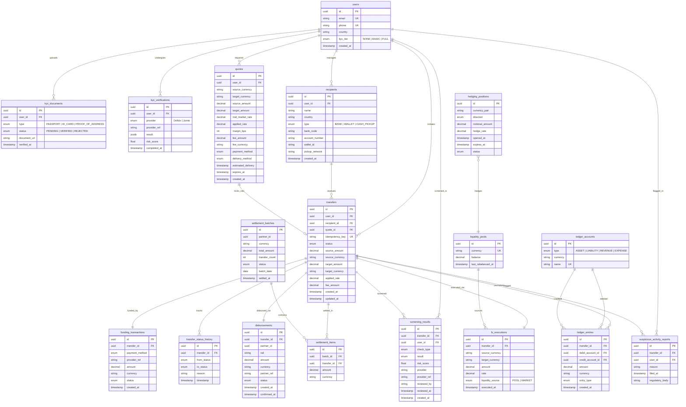

# Data Modeling -- Digital Remittance Platform

## Entity-Relationship Diagram

---

## Indexing Strategy

| Table | Index Columns | Type | Rationale |
|---|---|---|---|
| `users` | `email` | Unique B-tree | Login lookups, uniqueness enforcement |
| `users` | `phone` | Unique B-tree | Phone-based auth, uniqueness |
| `users` | `country, kyc_tier` | Composite B-tree | Regulatory reporting filtered by country and tier |
| `kyc_documents` | `user_id, status` | Composite B-tree | Fetch pending docs for a user during KYC flow |
| `kyc_verifications` | `user_id, completed_at DESC` | Composite B-tree | Latest verification result per user |
| `kyc_verifications` | `provider_ref` | B-tree | Webhook callback lookups from Onfido/Jumio |
| `recipients` | `user_id` | B-tree | List recipients for a user |
| `quotes` | `user_id, created_at DESC` | Composite B-tree | Recent quotes for a user |
| `quotes` | `expires_at` | B-tree | Cleanup job for expired quotes |
| `transfers` | `idempotency_key` | Unique B-tree | Deduplication on retry |
| `transfers` | `user_id, created_at DESC` | Composite B-tree | User transfer history |
| `transfers` | `status` | B-tree (partial, exclude COMPLETED/FAILED) | Operational dashboards tracking in-flight transfers |
| `transfers` | `recipient_id` | B-tree | Lookup transfers for a recipient |
| `transfer_status_history` | `transfer_id, timestamp` | Composite B-tree | Ordered audit trail per transfer |
| `funding_transactions` | `transfer_id` | B-tree | Funding status check during transfer processing |
| `funding_transactions` | `provider_ref` | B-tree | Payment provider webhook reconciliation |
| `screening_results` | `transfer_id` | B-tree | Fetch all checks for a transfer |
| `screening_results` | `user_id, created_at DESC` | Composite B-tree | User screening history for compliance review |
| `screening_results` | `result` | B-tree (partial, REVIEW/FAIL only) | Compliance queue: surface items needing attention |
| `suspicious_activity_reports` | `user_id` | B-tree | All SARs for a user |
| `suspicious_activity_reports` | `filed_at` | B-tree | Regulatory reporting by date window |
| `fx_executions` | `transfer_id` | B-tree | FX lookup per transfer |
| `fx_executions` | `executed_at` | B-tree | Treasury reconciliation and reporting |
| `liquidity_pools` | `currency` | Unique B-tree | Pool balance lookups |
| `hedging_positions` | `currency_pair, status` | Composite B-tree | Active hedges per pair |
| `ledger_entries` | `transfer_id` | B-tree | All journal entries for a transfer |
| `ledger_entries` | `debit_account_id, created_at` | Composite B-tree | Account statement generation |
| `ledger_entries` | `credit_account_id, created_at` | Composite B-tree | Account statement generation |
| `settlement_batches` | `partner_id, batch_date` | Composite B-tree | Partner settlement lookups |
| `settlement_batches` | `status` | B-tree (partial, exclude SETTLED) | Pending settlement tracking |
| `settlement_items` | `batch_id` | B-tree | Items in a batch |
| `settlement_items` | `transfer_id` | B-tree | Settlement status of a specific transfer |
| `disbursements` | `transfer_id` | B-tree | Disbursement status per transfer |
| `disbursements` | `partner_ref` | B-tree | Partner webhook/callback reconciliation |
| `disbursements` | `status, created_at` | Composite B-tree | Track pending disbursements for retry/alerting |

---

## Data Isolation Architecture

The platform segregates data across three physically separate database clusters to satisfy regulatory, security, and operational requirements.

### 1. PII Database (Encrypted at Rest + Column-Level Encryption)

**Purpose:** Store all personally identifiable information. Subject to GDPR right-to-erasure and data residency constraints.

**Tables:**
- `users` (email, phone, country, hashed_password)
- `kyc_documents` (document_url points to encrypted blob storage; metadata here)
- `kyc_verifications` (provider results containing PII extracts)
- `recipients` (name, account_number, wallet_id)

**Security controls:**
- AES-256 column-level encryption for email, phone, name, account_number
- Envelope encryption with AWS KMS (or Vault transit engine) -- data encryption key (DEK) encrypted by a key encryption key (KEK)
- Dedicated IAM roles; only the user-service and kyc-service can access this cluster
- All queries logged to an immutable audit trail
- Separate encryption keys per data residency region (EU keys stay in EU HSMs)

### 2. Financial Database (Strong Consistency, No Deletes)

**Purpose:** Immutable financial records. Source of truth for money movement.

**Tables:**
- `transfers`
- `transfer_status_history` (append-only, no UPDATE or DELETE)
- `funding_transactions`
- `fx_executions`
- `ledger_accounts`
- `ledger_entries` (append-only, no UPDATE or DELETE)
- `settlement_batches`
- `settlement_items`
- `disbursements`
- `liquidity_pools`
- `hedging_positions`

**Guarantees:**
- Strict serializable isolation for ledger writes (double-entry invariant: sum of debits = sum of credits per entry)
- No DELETE permission at the database role level for ledger_entries and transfer_status_history
- Write-ahead log (WAL) shipped to cold storage for disaster recovery
- Synchronous replication to a hot standby in the same region

### 3. Operational / Compliance Database

**Purpose:** Screening, monitoring, and compliance workflow data.

**Tables:**
- `quotes`
- `screening_results`
- `suspicious_activity_reports`

**Characteristics:**
- Read-heavy workload (compliance analysts querying review queues)
- Read replicas for dashboard and reporting queries
- screening_results retained for regulatory audit periods (7+ years) then archived

### Cross-Database References

Tables reference entities in other databases by UUID only. No foreign key constraints across databases. Referential integrity is enforced at the application layer via:
- Saga/orchestration patterns for distributed transactions
- Eventual consistency checks via reconciliation jobs running every 5 minutes
- Dead-letter queues for failed cross-database operations

---

## Partitioning Strategy

### Operational Partitioning (Monthly)

High-write, high-read tables partitioned by month on their timestamp column to keep partition sizes manageable and enable efficient range scans.

| Table | Partition Key | Strategy |
|---|---|---|
| `transfers` | `created_at` | Monthly range partitions |
| `transfer_status_history` | `timestamp` | Monthly range partitions |
| `funding_transactions` | `created_at` | Monthly range partitions |
| `ledger_entries` | `created_at` | Monthly range partitions |
| `screening_results` | `created_at` | Monthly range partitions |
| `fx_executions` | `executed_at` | Monthly range partitions |
| `disbursements` | `created_at` | Monthly range partitions |
| `quotes` | `created_at` | Monthly range partitions |

Partition creation is automated: a cron job creates partitions 3 months ahead. Partitions older than 12 months are detached from the active table and moved to the archival tier.

### Archival Partitioning (Yearly)

Detached monthly partitions are merged into yearly partitions and stored in a read-only archival database (e.g., PostgreSQL on cheaper storage or exported to Parquet in S3).

| Table | Archival Partition Key | Storage |
|---|---|---|
| `transfers` | `created_at` year | S3 Parquet + Athena for ad-hoc queries |
| `transfer_status_history` | `timestamp` year | S3 Parquet |
| `ledger_entries` | `created_at` year | S3 Parquet (immutable, never deleted) |
| `screening_results` | `created_at` year | S3 Parquet (7-year regulatory hold) |

### Hot/Warm/Cold Tiers

| Tier | Age | Storage | Access Pattern |
|---|---|---|---|
| Hot | 0-3 months | Primary PostgreSQL on NVMe SSD | Full read/write, all indexes active |
| Warm | 3-12 months | Primary PostgreSQL on standard SSD | Read-mostly, some indexes dropped |
| Cold | 12+ months | S3 Parquet via Athena | Ad-hoc analytical queries, regulatory audits |

---

## Data Retention Policies

| Data Category | Retention Period | Rationale | Deletion Method |
|---|---|---|---|
| User PII | Duration of account + 5 years post-closure | GDPR Art. 17 balanced with AML record-keeping (5AMLD) | Crypto-shredding: destroy the per-user DEK, rendering ciphertext unrecoverable |
| KYC documents | 5 years after relationship ends | 5AMLD / BSA record-keeping requirement | Delete from encrypted blob storage after retention window |
| KYC verifications | 5 years after relationship ends | Same as above | Purge from PII database |
| Transfer records | 7 years | BSA/AML regulatory requirement; tax reporting | Move to cold archive after 12 months, purge after 7 years |
| Ledger entries | 10 years | Financial audit requirements; SOX-like controls | Cold archive only, never truly deleted during retention |
| Screening results | 7 years | AML/CTF regulatory requirement | Cold archive after 12 months, purge after 7 years |
| SARs | 7 years after filing | FinCEN/FCA regulatory requirement | Cold archive, purge after retention window |
| Quotes | 90 days | No regulatory requirement; operational use only | Hard delete expired quotes nightly |
| Hedging positions | 7 years | Financial audit trail | Cold archive after positions close |
| Settlement batches | 7 years | Partner reconciliation and audit | Cold archive after 12 months |
| Audit logs | 7 years | Regulatory and internal compliance | Immutable append-only storage, archived yearly |

### GDPR Right-to-Erasure Implementation

When a user requests deletion:
1. Verify no open transfers or pending regulatory holds exist
2. Destroy the user-specific DEK in KMS (crypto-shredding) -- all PII in the PII database becomes unrecoverable
3. Anonymize the `user_id` in the financial database by replacing it with a tombstone UUID (financial records must be retained but can be de-identified)
4. Delete KYC documents from blob storage
5. Retain screening_results and SARs with anonymized references (regulatory obligation overrides erasure right)
6. Log the erasure event itself to the immutable audit trail
