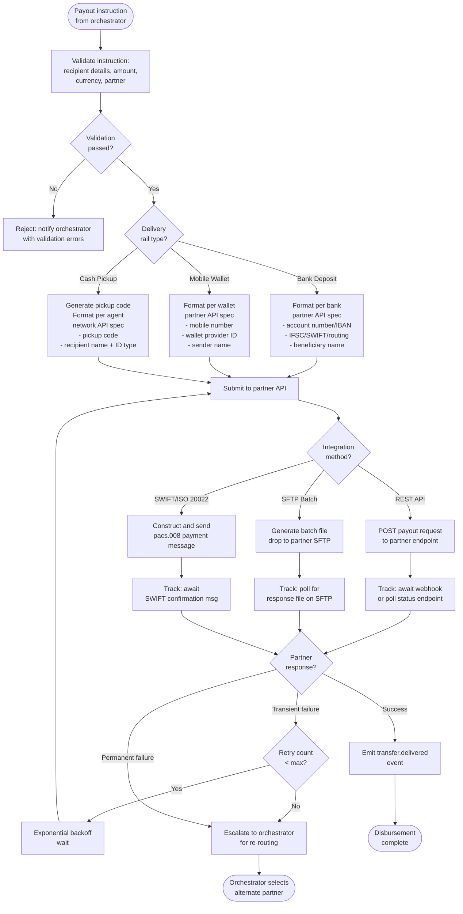
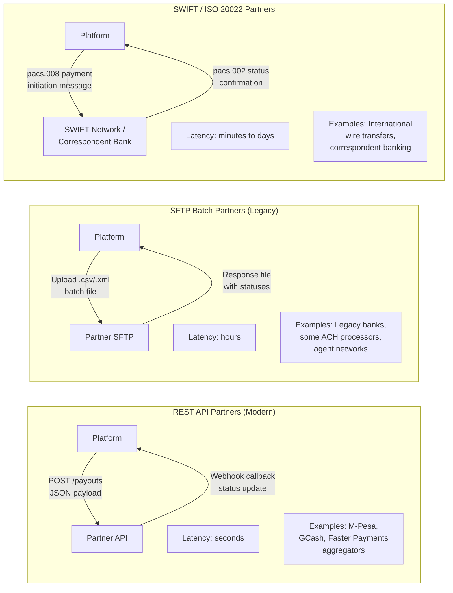
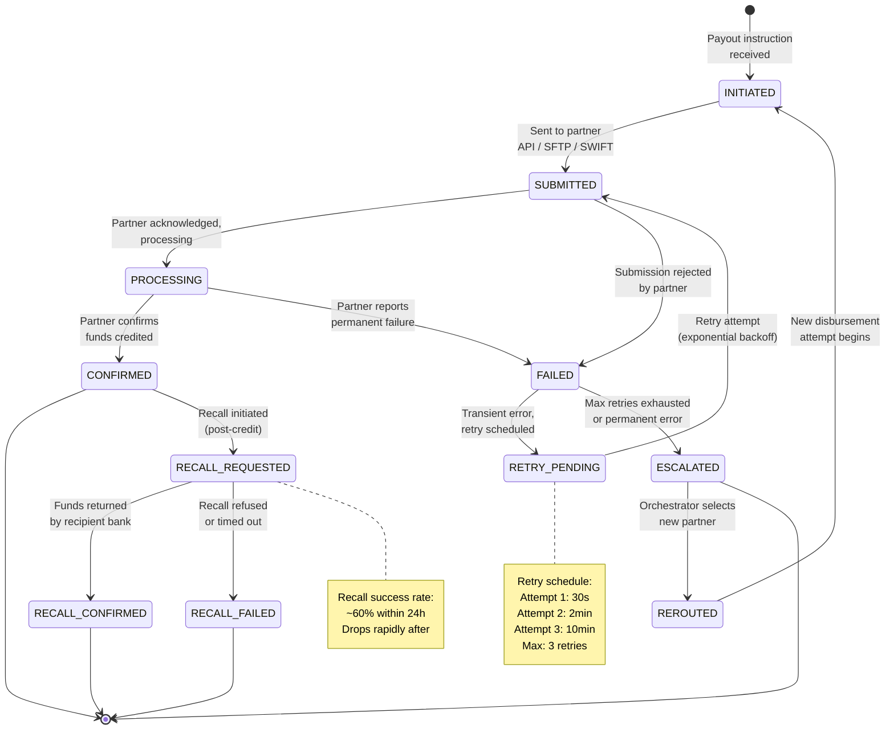

# Disbursement Service

The Disbursement Service is responsible for the "last mile" of a remittance transfer: getting money into the recipient's hands via the selected payout rail and partner. It handles partner-specific API integrations, status tracking, retries, and recall/reversal flows.

---

## Payout Rails

Each payout rail has distinct characteristics that affect cost, speed, availability, and integration complexity.

### Rail Comparison

| Rail | Examples | Speed | Cost | Typical Limits | Availability |
|---|---|---|---|---|---|
| **Bank Deposit** | IMPS/NEFT (India), ACH (US), Faster Payments (UK), SEPA (EU) | Minutes to 1 day | Low | Up to $50K+ | 24/7 for real-time; business hours for batch |
| **Mobile Wallet** | M-Pesa (Kenya/Tanzania), GCash (Philippines), bKash (Bangladesh) | Seconds to minutes | Medium | $500-$5K | 24/7 |
| **Cash Pickup** | Western Union agents, local bank branches, post offices | Instant (at agent) | High | $1K-$10K | Agent operating hours |

### Rail Details

**Bank Deposit** (most common, ~70% of volume):
- Connects via local payment network APIs or through aggregator partners
- India: IMPS (instant, 24/7, up to INR 5L), NEFT (batch, 30min cycles), RTGS (real-time, high value)
- US: ACH (batch, same-day or next-day), Fedwire (real-time, high value)
- UK: Faster Payments (instant, up to GBP 1M), BACS (3-day batch)

**Mobile Wallet**:
- Direct API integration with wallet providers
- M-Pesa: REST API, real-time credit, webhook confirmation
- GCash: REST API, supports both real-time and batch
- Often requires pre-registration of the platform as a disbursement partner

**Cash Pickup**:
- Platform generates a unique **pickup code** (8-12 digit alphanumeric)
- Recipient presents pickup code + valid ID at agent location
- Agent network confirms identity, disburses cash, confirms via API
- Pickup codes typically expire after 30 days

---

## Disbursement Flow

### Step-by-Step Process

1. **Receive payout instruction** from the orchestrator containing: `transfer_id`, `rail`, `partner_id`, `recipient_details`, `amount`, `currency`, `delivery_method`
2. **Format instruction** per the selected partner's API specification (each partner has a unique integration with different field names, formats, and validation rules)
3. **Submit to partner API** (or drop file to SFTP for batch partners)
4. **Track status**: poll the partner's status API on a schedule OR receive asynchronous webhook callbacks
5. **On confirmation**: emit `transfer.delivered` event to the event bus; update transfer status to `DELIVERED`
6. **On failure**: classify as transient (retry with exponential backoff) or permanent (escalate to orchestrator for re-routing to an alternate partner)

### Disbursement Flow Per Rail Type



---

## Partner Integration Patterns

Different partners require different integration approaches depending on their technical maturity.

### Pattern Comparison



### Integration Details

| Aspect | REST API | SFTP Batch | SWIFT / ISO 20022 |
|---|---|---|---|
| **Submission** | Synchronous POST, immediate acknowledgment | File upload, batch processed on partner schedule | Message via SWIFT network or ISO 20022 channel |
| **Status tracking** | Webhook callback or poll endpoint | Response file dropped to SFTP (check every 15-30 min) | SWIFT confirmation message (pacs.002) |
| **Latency** | Seconds to minutes | Hours (depends on partner batch cycle) | Minutes to 1-2 business days |
| **Error handling** | Real-time error codes in response | Errors in response file per row | SWIFT rejection messages |
| **Idempotency** | Platform-generated idempotency key in header | Unique file naming + dedup by transfer_id in file | Unique end-to-end transaction ID (UETR) |
| **Typical partners** | Fintech wallet providers, modern payment processors | Traditional banks, older agent networks | Correspondent banks, cross-border wires |

### Adapter Architecture

Each partner integration is implemented as a **Partner Adapter** behind a common interface:

```
interface PayoutAdapter {
    submit(instruction: PayoutInstruction): SubmissionResult
    checkStatus(reference: string): StatusResult
    cancel(reference: string): CancelResult
}
```

- New partners are onboarded by implementing this interface
- The disbursement service selects the appropriate adapter based on `partner_id`
- Each adapter handles the partner-specific serialization, authentication, error mapping, and retry semantics

---

## Disbursement State Machine

Each individual disbursement (payout attempt) tracks its own lifecycle:



### State Descriptions

| State | Description | Next Steps |
|---|---|---|
| `INITIATED` | Payout instruction received, adapter selected, payload formatted | Submit to partner |
| `SUBMITTED` | Request sent to partner; awaiting acknowledgment | Wait for partner response |
| `PROCESSING` | Partner acknowledged receipt, processing the payout | Wait for final status |
| `CONFIRMED` | Partner confirms funds were credited to recipient | Emit `transfer.delivered` |
| `FAILED` | Partner reported a failure | Classify and retry or escalate |
| `RETRY_PENDING` | Transient failure; retry scheduled with backoff | Auto-retry after delay |
| `ESCALATED` | All retries exhausted or permanent failure | Orchestrator re-routes |
| `REROUTED` | Orchestrator assigned a new partner; new disbursement created | New INITIATED state |
| `RECALL_REQUESTED` | Post-credit recall initiated (e.g., fraud, user request) | Await bank response |
| `RECALL_CONFIRMED` | Recall successful, funds returned | Refund to sender |
| `RECALL_FAILED` | Recall unsuccessful (recipient bank refused/no response) | Manual resolution |

---

## Recall / Reversal

Recalls are the most operationally complex part of disbursement. The process differs depending on whether funds have been credited to the recipient.

### Pre-Credit Cancellation

- If the payout is still in `SUBMITTED` or `PROCESSING` state, a cancellation request can be sent to the partner
- Success depends on whether the partner's API supports cancellation and whether the payment has already been executed on their side
- REST API partners: `DELETE /payouts/{ref}` or `POST /payouts/{ref}/cancel`
- SFTP partners: cancellation file upload (may not be processed until next batch cycle)
- SWIFT: `camt.056` cancellation request message

### Post-Credit Recall

- Once funds are confirmed as credited to the recipient's account, the platform initiates a **recall request**
- This is a best-effort process: the recipient's bank must cooperate, and the recipient must have sufficient funds
- Average success rates:
  - Within 1 hour: ~80% success
  - Within 24 hours: ~60% success
  - After 24 hours: ~20% success (drops rapidly)
  - After 7 days: < 5% success
- Recall reasons: fraud detection, compliance hold, sender request, duplicate payment
- If recall fails, the platform may need to absorb the loss or pursue recovery through other channels

---

## Key Design Decisions

1. **Why a common adapter interface?** The platform integrates with dozens of partners across different countries and technical standards. A uniform interface lets the disbursement service remain partner-agnostic while each adapter encapsulates partner-specific complexity.

2. **Why separate disbursement states from transfer states?** A single transfer may have multiple disbursement attempts (initial attempt fails, re-routed to a new partner). Tracking disbursement lifecycle independently provides clear audit trails and simplifies retry/re-route logic.

3. **Why exponential backoff with a low retry cap (3)?** Payout failures are often not transient. Retrying aggressively wastes time and delays re-routing to an alternate partner that might succeed immediately. Three retries over ~12 minutes strikes a balance.

4. **Why track recall success rates?** Recall is a business-critical capability for fraud response. Understanding empirical success rates by corridor and time window helps the fraud team make informed decisions about whether to attempt a recall or pursue other recovery mechanisms.
