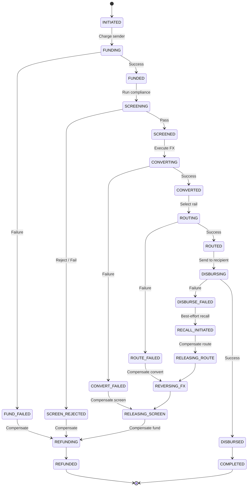
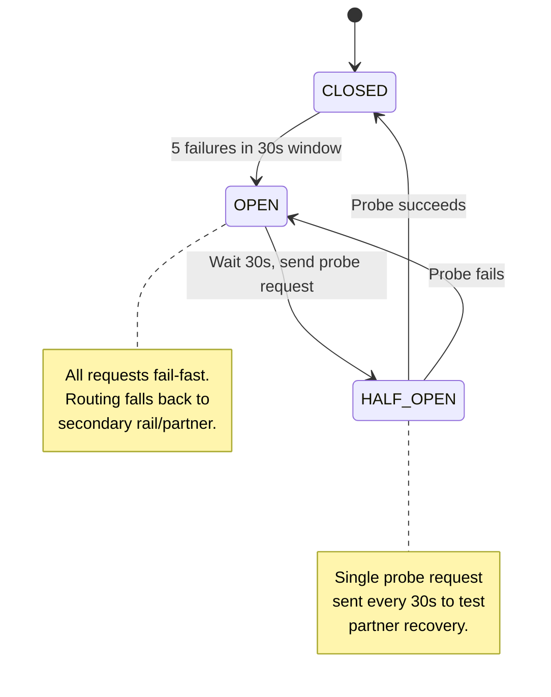
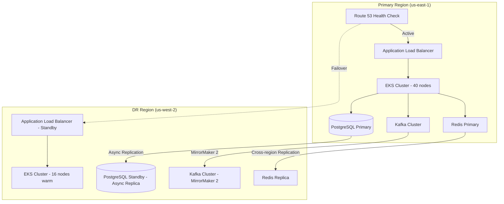

# Fault Tolerance & Resilience

## Saga Orchestration & Compensation

A cross-border transfer is a distributed transaction spanning multiple external partners (payment processors, compliance providers, FX desks, payout rails). We use an **orchestrator-based saga** to coordinate stages and guarantee compensation on failure.

### Saga Stages

| Stage | Action | Compensation |
|---|---|---|
| **Fund** | Charge sender (card, ACH, bank debit) | Refund to original payment method |
| **Screen** | Run compliance checks (sanctions, fraud, AML) | Release hold, log screening result |
| **Convert** | Execute FX at locked rate | Reverse conversion, credit back source currency |
| **Route** | Select payout rail and reserve capacity | Release routing reservation |
| **Disburse** | Send funds to recipient via partner | Initiate recall (best-effort, partner-dependent) |

**Key design decisions:**

- **Post-disbursement failures are the hardest** -- once funds leave the platform to a partner rail, recalls are not guaranteed. Some corridors (e.g., mobile money in Sub-Saharan Africa) have no recall mechanism at all. This is why compliance screening runs *before* conversion and disbursement.
- **Compensation is ordered** -- stages compensate in reverse order of execution. If conversion fails, we refund the charge but do not need to reverse routing (it never happened).
- **Each stage is idempotent** -- replaying a stage with the same idempotency key produces the same result without side effects.
- **Saga state is persisted** -- the orchestrator writes each stage transition to a `saga_events` table in PostgreSQL, enabling recovery after orchestrator crashes.

### Saga Orchestration Flow



## Idempotency

Every mutating API endpoint accepts an `X-Idempotency-Key` header (client-generated UUID v4).

**Implementation:**

```
Client -> API Gateway -> Check Redis(idempotency:{key})
  - HIT  -> return stored {status, response_body}
  - MISS -> acquire lock, process request, store result, release lock
```

- **Storage:** Redis with 24h TTL per key. Schema: `idempotency:{key}` -> `{status: "processing|completed|failed", response_body: {...}, created_at: timestamp}`
- **Lock:** Redis `SET NX` with 30s TTL to prevent concurrent duplicate processing.
- **Critical paths:**
  - **Funding** -- prevents double-charge to sender's payment method.
  - **Disbursement** -- prevents double-payout to recipient.
  - **FX execution** -- prevents duplicate conversions locking unnecessary liquidity.

## Retry & Circuit Breakers

### Retry Policy

- **Algorithm:** Exponential backoff with full jitter.
  - Base delay: 100ms, multiplier: 2x, max delay: 10s, max attempts: 3.
- **Non-retryable conditions:**
  - HTTP 4xx responses (client error, bad request).
  - Compliance rejections (hard deny from screening provider).
  - Duplicate detection (idempotency hit with completed status).
- **Retryable conditions:**
  - HTTP 5xx, timeouts, connection resets, Kafka produce failures.

### Circuit Breakers (Resilience4j)

Circuit breakers are configured **per-partner, per-rail** to isolate failures.



**Configuration per integration:**

| Parameter | Value |
|---|---|
| Failure rate threshold | 50% (sliding window of 20 calls) |
| Slow call threshold | 80% of calls exceeding timeout |
| Wait duration in open state | 30 seconds |
| Permitted calls in half-open | 3 |
| Sliding window type | COUNT_BASED, size 20 |

### Timeout Budgets

| Operation | Timeout | Rationale |
|---|---|---|
| Quote creation | 500ms | User-facing, must feel instant |
| Funding (payment collection) | 30s | External PSP webhook-based |
| Compliance screening | 5s | Per-provider SLA |
| FX execution | 1s | Rate may drift if slower |
| Disbursement initiation | 30s | External partner API |
| End-to-end API gateway | 60s | Aggregate budget |

## Partner Failover

Each corridor is configured with a **primary and secondary partner** for every rail type (bank, mobile money, cash pickup).

```
corridor: US -> IN
  rail: bank_transfer
    primary: partner_a (health_score: 98, circuit: CLOSED)
    secondary: partner_b (health_score: 95, circuit: CLOSED)
  rail: cash_pickup
    primary: partner_c (health_score: 92, circuit: CLOSED)
    secondary: partner_d (health_score: 88, circuit: CLOSED)
```

- **Health score** is computed from: success rate (70% weight), p95 latency (20% weight), and reconciliation accuracy (10% weight). Updated every 60 seconds.
- **Auto-failover:** When a partner's circuit breaker opens, routing immediately switches to the secondary partner. No manual intervention required.
- **Daily rebalancing alerts:** If a secondary partner is carrying >20% of traffic for 24h, an alert fires for the ops team to investigate the primary.
- **Corridor lockout:** If *all* partners for a corridor are in OPEN state, the corridor is temporarily disabled. New transfers are accepted but held in `ROUTING_PENDING` with automatic retry every 5 minutes.

## Data Durability

### PostgreSQL

- **Synchronous replication** to a standby instance in the same region (same AZ or adjacent AZ). Guarantees zero data loss for committed transactions.
- **Asynchronous replication** to the DR region standby. Replication lag monitored; alert if >5 seconds.
- **RPO:** < 1 second (same region), < 5 seconds (cross-region).
- **RTO:** < 30 seconds (same region failover via RDS Multi-AZ).

### Kafka

- **Replication factor:** 3 (each message stored on 3 brokers).
- **min.insync.replicas:** 2 (a write is acknowledged only when 2 of 3 replicas confirm).
- **acks:** `all` (producer waits for all in-sync replicas).
- **unclean.leader.election.enable:** `false` (never elect an out-of-sync replica as leader).
- **Retention:** 7 days for operational topics, 30 days for audit topics.

### Ledger

- **Append-only** -- no UPDATE or DELETE operations are ever performed on ledger entries.
- **Corrections** are handled by posting a **reversal entry** (a new row that offsets the original).
- **Double-entry bookkeeping** -- every transaction creates at minimum two entries (debit + credit) that must sum to zero.
- **Checksums** -- each entry includes a SHA-256 hash of the previous entry, forming a hash chain for tamper detection.

## Disaster Recovery

### Architecture



### Failover Strategy

- **Active-passive** across two regions. Primary handles all traffic; DR region runs warm (reduced capacity, receiving replicated data).
- **Automated DNS failover** via Route 53:
  - Health checks probe the primary ALB every 10 seconds.
  - After 3 consecutive failures (30 seconds), Route 53 updates DNS to point to the DR region ALB.
  - TTL on DNS records: 60 seconds.
- **DR region auto-scales** from warm (40% capacity) to full capacity within 3-5 minutes using pre-configured HPA and cluster autoscaler.

### Recovery Objectives

| Metric | Target | Mechanism |
|---|---|---|
| RPO (critical data) | < 5 seconds | Async replication lag monitoring |
| RPO (operational data) | < 30 seconds | Kafka MirrorMaker 2 lag |
| RTO | < 5 minutes | Automated DNS failover + auto-scaling |

### DR Drills

- **Quarterly full-failover drill** -- simulate primary region outage, validate all services recover in DR.
- **Monthly partial drill** -- fail over a single service (e.g., database) and validate saga recovery.
- **Automated chaos testing** -- weekly Chaos Monkey runs targeting random pod termination, network partitions, and Kafka broker failures.

## Graceful Degradation

| Scenario | Degraded Behavior | User Impact |
|---|---|---|
| Quote Engine degraded | Serve cached rates with wider spread (+0.5%) | Slightly worse rate, transfer still possible |
| Compliance provider slow | Queue transfers, process screening async | Transfer accepted, confirmation delayed by minutes |
| All corridor partners down | Accept transfer, hold in `ROUTING_PENDING`, auto-retry every 5 min | Transfer accepted, delivery delayed |
| Kafka unavailable | Write to PostgreSQL outbox table, drain when Kafka recovers | No user impact, slight processing delay |
| Redis unavailable | Fall through to PostgreSQL for idempotency checks, skip non-critical caches | Higher latency, system remains functional |
| Payment provider degraded | Offer alternative payment methods (e.g., bank transfer instead of card) | User chooses different funding method |
