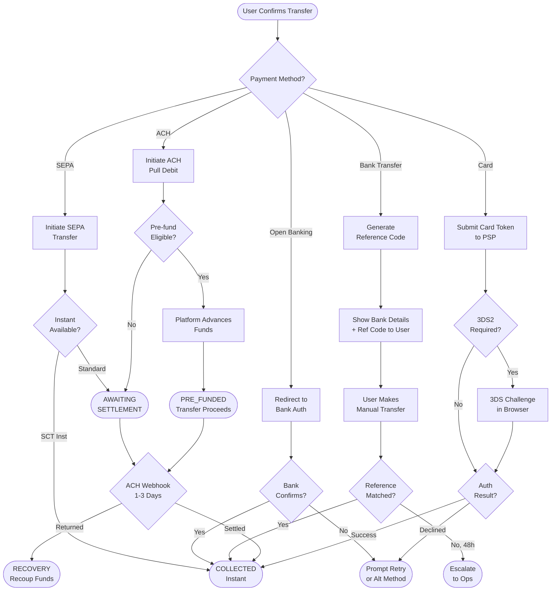
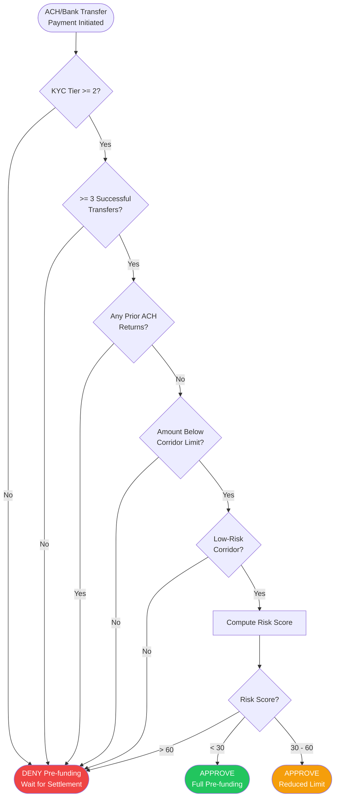
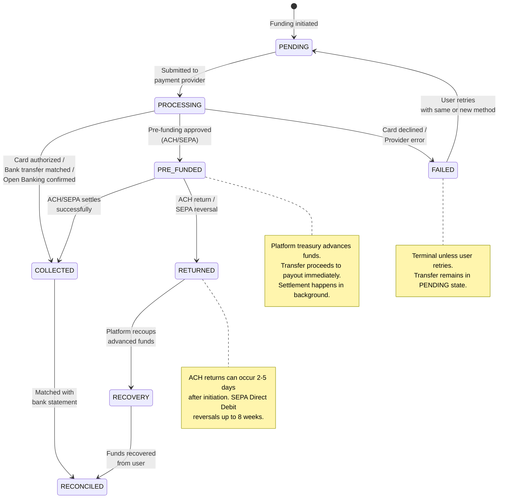

# Funding and Collection Service

## Overview

The Funding Service is responsible for collecting money from the sender. It abstracts over multiple payment methods, handles asynchronous settlement flows, manages pre-funding decisions for trusted users, and ensures that every dollar collected is accounted for before a transfer proceeds to payout.

This is one of the most operationally complex services in the platform because each payment method has its own latency, failure modes, cost structure, and reconciliation requirements.

---

## Supported Payment Methods

### Credit / Debit Card

| Attribute | Detail |
|---|---|
| Provider | Stripe, Adyen (multi-PSP for redundancy) |
| Authentication | 3D Secure 2 (3DS2) required for EU/UK, adaptive for US |
| Settlement | Instant authorization; funds settled to platform in 1-2 days |
| Cost to platform | ~2.5% interchange + scheme fees |
| User experience | Instant confirmation |
| Risk | Chargebacks; mitigated by 3DS2 liability shift |

### ACH (US)

| Attribute | Detail |
|---|---|
| Provider | Stripe ACH, Plaid + Dwolla |
| Mechanism | Pull debit from user's bank account |
| Settlement | 1-3 business days |
| Cost to platform | ~$0.50 flat |
| User experience | Slow unless pre-funded |
| Risk | NSF returns (insufficient funds); can occur days after initiation |

### SEPA (EU)

| Attribute | Detail |
|---|---|
| Provider | Adyen, Banking Circle |
| Mechanism | SEPA Direct Debit or SEPA Credit Transfer |
| Settlement | 1 business day (SCT Inst for instant) |
| Cost to platform | EUR 0.20 - 0.50 |
| User experience | Moderate; fast with SEPA Instant |
| Risk | Direct Debit can be reversed up to 8 weeks (13 months if unauthorized) |

### Bank Transfer / Wire

| Attribute | Detail |
|---|---|
| Provider | Platform's bank accounts (Citibank, JPMorgan) |
| Mechanism | User initiates manual transfer with a unique reference code |
| Settlement | 1-2 business days |
| Cost to platform | $1.00 - $2.00 |
| User experience | Requires user action; slowest method |
| Risk | Unmatched transfers if user omits or mistypes reference code |

### Open Banking (UK / EU)

| Attribute | Detail |
|---|---|
| Provider | TrueLayer, Yapily |
| Mechanism | Bank-to-bank via PSD2 APIs; user authenticates with their bank |
| Settlement | Instant (Faster Payments in UK) or same-day |
| Cost to platform | GBP 0.10 - 0.30 |
| User experience | Instant; no card details needed |
| Risk | Low; irrevocable once confirmed |

---

## Pre-funding Model

### Concept

ACH and bank transfers take 1-3 days to settle. Without pre-funding, the recipient waits days. With pre-funding, the platform **advances** the transfer from its own treasury while the sender's payment settles in the background. The sender sees "delivered in minutes" even though collection takes days.

### Eligibility Decision

Pre-funding is a credit risk decision. The platform is lending money until the sender's payment clears.

**Eligibility Factors:**

| Factor | Weight | Criteria |
|---|---|---|
| KYC tier | High | Must be Tier 2+ (government ID verified) |
| Transfer history | High | At least 3 successful transfers with no returns |
| Amount | Medium | Below corridor-specific threshold (e.g., $5,000 for US-India) |
| Corridor risk | Medium | Low-risk corridors only (no sanctioned or high-fraud destinations) |
| Account age | Low | Account older than 30 days |
| Payment method history | Medium | No prior ACH returns or chargebacks on this payment method |

**Risk Score Calculation:**

Each factor contributes to a 0-100 risk score. Pre-funding is approved if the score is below 30 (low risk).

```
risk_score = w1 * kyc_risk + w2 * history_risk + w3 * amount_risk
           + w4 * corridor_risk + w5 * account_age_risk + w6 * payment_risk

if risk_score < 30 → APPROVE pre-funding
if risk_score 30-60 → APPROVE with reduced limit
if risk_score > 60 → DENY pre-funding (user waits for settlement)
```

### Pre-funding Limits

- Per-user daily limit: $5,000 (adjustable by risk tier)
- Per-user outstanding limit: $10,000 (total unsettled pre-funded amount)
- Platform-wide daily limit: monitored by treasury (circuit breaker if ACH return rate spikes)

---

## Collection Flow

### Per Payment Method

**Card Payment:**
1. Client submits card token (from Stripe.js / Adyen Drop-in).
2. Funding Service calls PSP `charges.create` with 3DS2 if required.
3. PSP returns synchronous result: `succeeded`, `requires_action` (3DS challenge), or `failed`.
4. On success, Funding Service marks collection as `COLLECTED` and emits `FundingCompleted` event.

**ACH Payment:**
1. Client selects linked bank account (connected via Plaid).
2. Funding Service initiates ACH pull debit via provider.
3. Provider returns `pending` status.
4. Funding Service checks pre-funding eligibility.
   - If eligible: marks transfer as `PRE_FUNDED`, emits `FundingCompleted` (transfer proceeds immediately).
   - If not eligible: transfer waits in `AWAITING_SETTLEMENT` state.
5. 1-3 days later, provider sends webhook: `succeeded` or `returned`.
6. On success: collection confirmed, pre-funding advance reconciled.
7. On return (NSF): recoup funds, flag user, potentially restrict account.

**SEPA Payment:**
1. Client authorizes SEPA Direct Debit mandate or initiates SEPA Credit Transfer.
2. Flow similar to ACH: async settlement with webhook confirmation.
3. SEPA Instant (SCT Inst) provides same-day confirmation.

**Bank Transfer:**
1. Funding Service generates a unique reference code (e.g., `WR-8F3A9B`).
2. User is shown platform bank details + reference code.
3. User manually transfers funds from their bank.
4. Platform's bank feeds incoming transactions to a **reconciliation service**.
5. Service matches by reference code + amount + sender name.
6. On match: collection marked as `COLLECTED`, transfer proceeds.
7. Unmatched after 48 hours: escalated to operations team.

**Open Banking:**
1. Client initiates Open Banking flow; redirected to bank's auth page.
2. User authenticates and authorizes payment.
3. Provider confirms payment initiation.
4. Funds arrive via Faster Payments (UK) or SEPA Instant (EU) within seconds to minutes.
5. Webhook confirms receipt; collection marked as `COLLECTED`.

---

## Failure Handling

### Card Declined

| Decline Reason | Action |
|---|---|
| Insufficient funds | Prompt user to retry with different card or payment method |
| 3DS2 authentication failed | Prompt user to retry; possible issuer block |
| Fraud suspected (by issuer) | Suggest user contacts their bank; offer alternative payment method |
| Card expired | Prompt card update |
| PSP outage | Failover to secondary PSP (Stripe down, route to Adyen) |

### ACH Return

ACH returns can occur 2-5 business days after initiation.

| Return Code | Meaning | Action |
|---|---|---|
| R01 | Insufficient funds | If pre-funded: recoup from user's account balance or next transfer. Flag user. |
| R02 | Account closed | Remove payment method. If pre-funded: initiate recovery. |
| R03 | No account found | Remove payment method. Likely user error during setup. |
| R10 | Customer advises unauthorized | Investigate. Potential fraud. Restrict account pending review. |
| R29 | Corporate customer advises not authorized | Similar to R10; escalate to compliance. |

**If pre-funded and ACH returns:**
1. Debit the user's platform wallet/balance.
2. If no balance: create a receivable; notify user they owe the platform.
3. Block further transfers until resolved.
4. After 3 ACH returns: permanently revoke pre-funding eligibility.
5. If unrecoverable: escalate to collections.

### Unmatched Bank Transfer

1. Incoming transfer with no matching reference code is placed in a **suspense account**.
2. Auto-matching retries run every hour with fuzzy matching on amount + sender name.
3. If still unmatched after 48 hours: ops team receives a ticket with transaction details.
4. If unmatched after 30 days: funds returned to sender's bank via reverse wire.

---

## Collection State Machine

Each funding attempt follows a state machine tracked in the `funding_events` table.

```
State Transitions:

PENDING → PROCESSING → COLLECTED → RECONCILED
                    ↘ FAILED
                    ↘ RETURNED (post-settlement reversal)

PENDING → PROCESSING → PRE_FUNDED → COLLECTED → RECONCILED
                                  ↘ RETURNED → RECOVERY
```

| State | Description |
|---|---|
| PENDING | Funding initiated but not yet submitted to provider |
| PROCESSING | Submitted to payment provider; awaiting response |
| COLLECTED | Funds confirmed received (or pre-funded) |
| PRE_FUNDED | Platform advanced funds; awaiting actual settlement |
| FAILED | Payment failed (declined, error); terminal state unless retried |
| RETURNED | Previously collected payment reversed (ACH return, SEPA reversal) |
| RECOVERY | Pre-funded transfer returned; platform recovering advanced funds |
| RECONCILED | Payment settled and reconciled with bank statement; final state |

---

## Diagrams

### 1. Funding Flow per Payment Method



### 2. Pre-funding Decision Tree



### 3. Collection State Machine



---

## Reconciliation

Every collected payment must eventually be reconciled against actual bank settlement records.

**Daily Reconciliation Process:**
1. Bank statement feeds (MT940 / CAMT.053) are ingested each business day.
2. Reconciliation engine matches statement entries to internal funding records by amount, date, and reference.
3. Matched records transition from `COLLECTED` to `RECONCILED`.
4. Unmatched statement entries → suspense account for manual review.
5. Unreconciled funding records after 5 business days → alert to finance team.

**Metrics:**
- Auto-match rate target: > 98%
- Manual review queue: < 50 items/day
- Suspense account balance: monitored daily, target < $10,000 outstanding

---

## Idempotency and Safety

- Every funding request carries an **idempotency key** (generated client-side, typically the quote ID).
- The Funding Service checks for an existing record with the same idempotency key before initiating a new charge.
- This prevents double-charging on retry (network timeout, user double-click, etc.).
- PSP-level idempotency keys are also passed through to Stripe/Adyen.

---

## Multi-PSP Routing

The platform integrates with multiple payment service providers for redundancy and cost optimization.

| Routing Logic | Detail |
|---|---|
| Primary routing | Route to lowest-cost PSP for the payment method and region |
| Failover | If primary PSP returns 5xx or timeout, automatically retry with secondary PSP |
| A/B testing | Route a percentage of traffic to evaluate a new PSP's approval rates |
| Smart routing | ML model predicts approval probability per PSP based on card BIN, amount, and country; routes to maximize approval rate |
