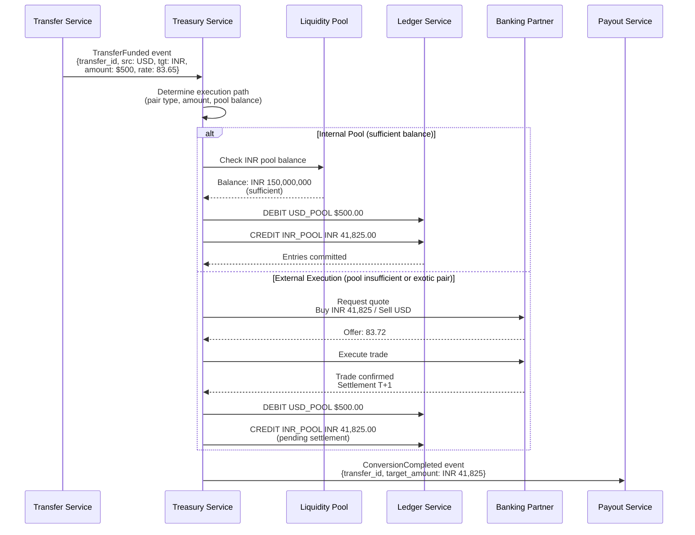
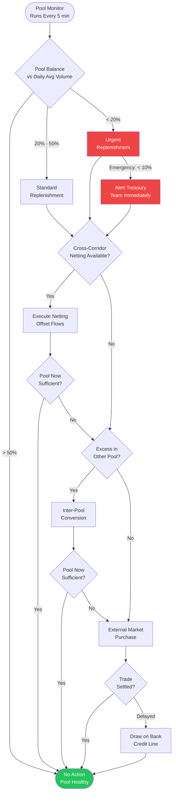
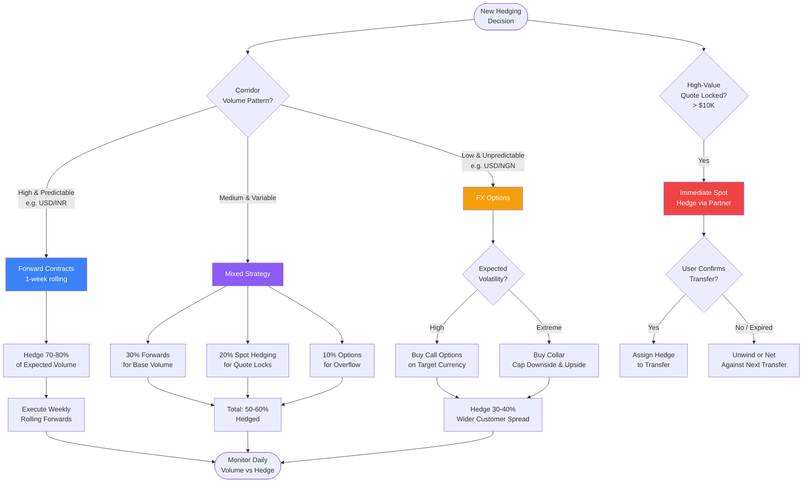

# FX and Treasury Service

## Overview

The FX and Treasury Service manages the platform's currency positions, executes conversions, maintains liquidity pools, and hedges FX risk. It sits between the Funding Service (which collects sender currency) and the Payout Service (which disburses recipient currency). Its goal is to convert currencies at the lowest cost while limiting the platform's exposure to exchange rate fluctuations.

---

## Currency Conversion

### Execution Strategy

When a transfer is confirmed and funded, the Treasury Service must convert the source currency to the target currency. The execution strategy depends on the currency pair and amount.

**Decision Matrix:**

| Condition | Execution Path |
|---|---|
| Major pair (e.g., USD/EUR, USD/GBP) + amount < $50K | Internal liquidity pool |
| Major pair + amount >= $50K | Split: partial internal pool + external market |
| Exotic pair (e.g., USD/NGN, EUR/BDT) | External execution via banking partner |
| Large amount (> $100K) regardless of pair | External execution with best-price algo |
| Corridor with forward contract coverage | Draw from hedged position |

### Internal Pool Execution

For high-volume corridors where the platform maintains liquidity pools, conversion executes internally:

1. Transfer Service emits `TransferFunded` event.
2. Treasury Service checks the target currency pool balance.
3. If sufficient: debit source pool, credit target pool at the locked quote rate.
4. Double-entry ledger entries are created atomically.
5. Payout Service is notified that target currency is available.

Internal execution is essentially free (no external transaction costs) and instant.

### External Market Execution

For exotic pairs, large amounts, or when internal pools are depleted:

1. Treasury Service queries multiple banking partners for live quotes.
2. Best price is selected (lowest ask for buying target currency).
3. Trade is executed via FIX protocol or partner API.
4. Settlement occurs T+1 or T+2 depending on the pair.
5. Ledger entries reflect the actual execution rate (any difference from the customer rate is platform margin or loss).

### Double-Entry Ledger

Every conversion creates a pair of ledger entries ensuring the books always balance:

```
Transfer T-12345, Conversion C-98765:

DEBIT   USD_POOL        $500.00     (source currency out)
CREDIT  INR_POOL     INR 41,825.00  (target currency in)

Metadata:
  customer_rate: 83.65
  execution_rate: 83.72 (internal pool rate)
  margin_captured: $0.035/USD = $17.50
```

All ledger entries are append-only and immutable. Corrections are made via compensating entries, never by mutation.

---

## Liquidity Pool Management

### Pool Structure

The platform maintains currency pools (pre-funded balances) in major currencies to enable instant internal conversions without hitting external markets for every transfer.

| Currency | Typical Pool Size | Daily Volume | Pool / Volume Ratio |
|---|---|---|---|
| USD | $5,000,000 | $2,000,000 | 2.5x |
| EUR | EUR 3,000,000 | EUR 1,200,000 | 2.5x |
| GBP | GBP 2,000,000 | GBP 800,000 | 2.5x |
| INR | INR 200,000,000 | INR 100,000,000 | 2.0x |
| PHP | PHP 50,000,000 | PHP 25,000,000 | 2.0x |
| MXN | MXN 30,000,000 | MXN 15,000,000 | 2.0x |

Pools are held in accounts at banking partners in each currency's home country (e.g., INR pool at ICICI Bank, GBP pool at Barclays).

### Auto-Rebalancing

Pools are continuously monitored. When a pool drops below its rebalancing threshold, automatic replenishment is triggered.

**Rebalancing Rules:**

| Trigger | Action |
|---|---|
| Pool balance < 20% of daily average volume | Trigger urgent replenishment |
| Pool balance < 50% of daily average volume | Trigger standard replenishment |
| Pool balance > 300% of daily average volume | Excess flagged; consider reallocation |
| Pool draining faster than forecast | Alert treasury team; increase replenishment cadence |

**Replenishment Sources (in priority order):**

1. **Netting** -- Incoming funds in the same currency from other corridors (e.g., INR received from India-to-US transfers offsets INR needed for US-to-India).
2. **Inter-pool conversion** -- Convert excess from an overfunded pool (e.g., excess EUR converted to GBP if GBP is low).
3. **External market purchase** -- Buy the needed currency on the spot market from a banking partner.
4. **Bank credit line** -- Draw on a pre-arranged credit facility for emergency liquidity.

### Netting Optimization

Netting is the most cost-effective rebalancing mechanism. The platform analyzes bidirectional flows for each currency pair and offsets them.

Example:
- US-to-India corridor sends $2M/day (needs INR).
- India-to-US corridor sends INR equivalent of $800K/day (needs USD).
- Net INR requirement = only $1.2M equivalent must be purchased externally.
- Netting ratio of 40% saves significant FX transaction costs.

A netting engine runs every 15 minutes, computing optimal cross-corridor offsets.

---

## Hedging Strategy

### Objective

The platform quotes customers a guaranteed exchange rate (via quote locking). Between when the rate is quoted and when the conversion executes, the market can move. Hedging protects the platform from adverse FX movements.

### Hedging Instruments

| Instrument | Use Case | Cost |
|---|---|---|
| Forward contracts | Predictable daily volume per corridor | Low (embedded in forward points) |
| Spot trades | Quote-lock hedging for high-value transfers | Spread only |
| FX options | Volatile corridors with unpredictable volume | Premium (0.5-2%) |

### Strategy per Scenario

**1. Forward Contracts for Base Volume**

For corridors with consistent daily volume (e.g., USD-to-INR averages $2M/day), the treasury desk executes rolling forward contracts:

- 1-week rolling forwards covering 70-80% of expected daily volume.
- Contracts are settled daily; new contracts rolled forward.
- This locks in the conversion rate for the bulk of transfers, eliminating most FX risk.

**2. Spot Hedging for Quote Locks**

When the Quote Engine locks a high-value quote (> $10K):

1. `QuoteLocked` event is published to Kafka.
2. Treasury Service consumes the event.
3. A spot hedge is executed with a banking partner for the quoted amount at the quoted rate.
4. If the user confirms the transfer: the hedge is assigned to this transfer.
5. If the quote expires: the hedge is unwound or netted against the next transfer in the same corridor.

**3. Options for Volatile Corridors**

Some corridors (e.g., USD/NGN, USD/ARS) experience high volatility and unpredictable volume. Forwards are risky if volume doesn't materialize (unused forward = loss). Options provide the right but not obligation to convert:

- Buy call options on target currency for expected volume.
- If volume materializes: exercise the option at the strike price.
- If volume is lower than expected: let the option expire; only premium is lost.
- Premium cost is factored into the corridor's spread.

### Hedge Ratio Target

| Corridor Type | Target Hedge Ratio | Instrument Mix |
|---|---|---|
| High-volume, stable (USD/INR, USD/PHP) | 70-80% | 60% forwards + 20% spot |
| Medium-volume, moderate volatility | 50-60% | 30% forwards + 20% spot + 10% options |
| Low-volume, high volatility | 30-40% | 10% forwards + 20% options + rest unhedged (wider spread) |

---

## FX Risk Management

### Real-Time Exposure Monitoring

The Treasury Service maintains a real-time view of the platform's net FX exposure per currency pair.

**Exposure Calculation:**

```
net_exposure(CCY) = pool_balance(CCY)
                  + pending_inflows(CCY)
                  - pending_outflows(CCY)
                  - hedged_amount(CCY)
```

A positive net exposure means the platform profits if the currency appreciates and loses if it depreciates. A negative net exposure is the inverse.

### Position Limits

Each currency has a maximum unhedged exposure limit, set by the treasury team based on the currency's volatility and the platform's risk appetite.

| Currency | Max Unhedged Exposure | Rationale |
|---|---|---|
| EUR | $500,000 | Low volatility, deep market |
| GBP | $400,000 | Moderate volatility |
| INR | $300,000 | Moderate volatility, capital controls |
| PHP | $200,000 | Higher volatility |
| NGN | $50,000 | High volatility, illiquid |
| ARS | $25,000 | Extreme volatility |

When exposure approaches the limit (80% threshold), an alert fires. At 100%, new transfers in that corridor are paused until exposure is reduced (via hedging or netting).

### P&L Tracking

The Treasury Service tracks profitability across multiple dimensions:

| Metric | Calculation | Target |
|---|---|---|
| Gross FX margin | (customer_rate - mid_market_rate) * volume | Positive; varies by corridor |
| Hedging cost | Forward points + option premiums + spot spreads | < 30% of gross margin |
| Net FX margin | Gross margin - hedging cost | > 0 on every corridor |
| Slippage | (execution_rate - expected_rate) * volume | < 0.01% of volume |
| Netting savings | Avoided external conversion costs | Track monthly |

Daily P&L reports are generated per corridor, per currency pair, and in aggregate. Weekly reviews with the treasury team identify underperforming corridors.

### Alerts and Circuit Breakers

| Condition | Action |
|---|---|
| Unhedged exposure > 80% of limit | Alert treasury team |
| Unhedged exposure > 100% of limit | Pause new transfers in corridor |
| Daily P&L loss on any corridor > $10K | Alert treasury + leadership |
| Execution slippage > 0.05% | Alert treasury; review execution partners |
| Pool balance < emergency threshold (10% of daily volume) | Emergency replenishment; alert treasury |
| Hedging counterparty unavailable | Failover to secondary partner; widen corridor spread |

---

## Diagrams

### 1. Currency Conversion Flow



### 2. Liquidity Pool Rebalancing Cycle



### 3. Hedging Strategy Decision Tree



---

## Settlement and Reconciliation

### Settlement with Banking Partners

External FX trades settle on standard market timelines:

| Settlement Type | Timeline | Currencies |
|---|---|---|
| T+0 (same day) | Same business day | Domestic transfers, some Faster Payments |
| T+1 | Next business day | Major pairs (USD/EUR, USD/GBP) |
| T+2 | Two business days | Most other pairs, standard for spot FX |

The Treasury Service tracks every pending settlement and reconciles against actual bank confirmations (SWIFT MT300 messages or partner API confirmations).

### Nostro Account Management

The platform maintains **nostro accounts** (accounts held at foreign banks) for each currency. The Treasury Service monitors:

- Expected balance = current balance + pending inflows - pending outflows.
- Actual balance from daily bank statements.
- Discrepancies trigger immediate investigation.

---

## Disaster Recovery and Failover

| Scenario | Response |
|---|---|
| Primary banking partner unavailable | Route to secondary partner; may have wider spread |
| Liquidity pool depleted unexpectedly | Emergency credit line draw; pause corridor if needed |
| Hedging system down | Widen customer spreads to absorb unhedged risk; manual hedging by treasury desk |
| Ledger service unavailable | Queue conversion events; process when restored (conversions are idempotent by transfer_id) |
| Market halt (currency controls imposed) | Pause affected corridors; notify affected users; treasury team manages position unwind |
