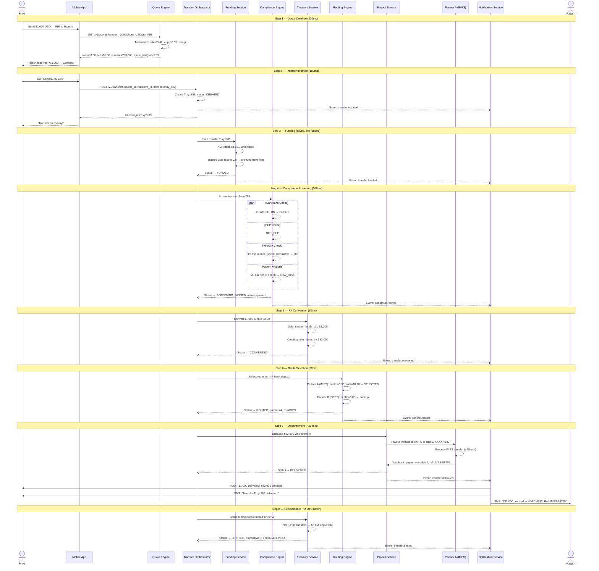
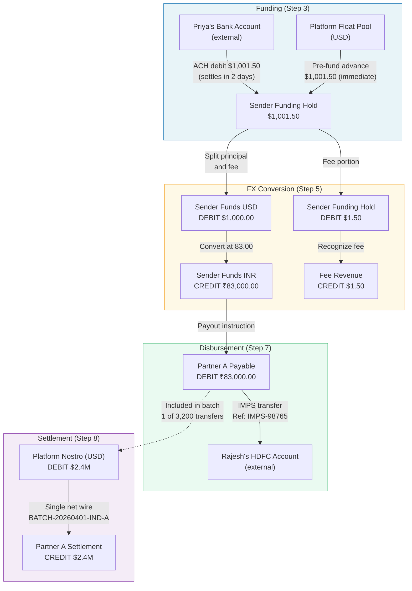
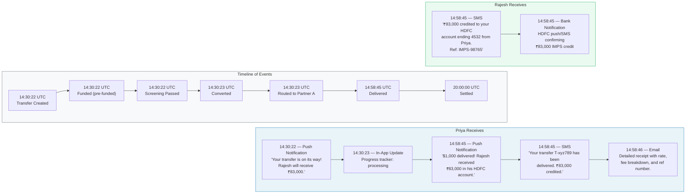

# Happy Flow: End-to-End Successful Transfer

> **Scenario:** Priya (verified user in the US) sends **$1,000 USD** to her father **Rajesh's HDFC bank account** in India.  
> She opens the app on a Tuesday afternoon, taps a few buttons, and 30 minutes later Rajesh gets an SMS confirming the money has landed.  
> Here is everything that happens in between.

---

## Step 1 -- Quote Creation (200ms)

Priya opens the app and fills in the transfer form:

| Field | Value |
|---|---|
| Send amount | $1,000.00 USD |
| Receive currency | INR |
| Recipient | Rajesh Sharma (saved) |
| Funding method | ACH (linked Bank of America account) |

The **Quote Engine** springs into action:

1. Fetches the cached mid-market rate: **83.42 INR/USD** (sourced from Reuters, cached < 5s ago).
2. Applies the corridor margin of 0.5%: **applied rate = 83.00 INR/USD**.
3. Calculates the fee: **$1.50** (ACH funding $0.50 + India bank deposit corridor fee $1.00).
4. Estimates delivery: **~4 hours** (IMPS rail available, partner healthy).

**Response to Priya's screen:**

```
Rajesh receives:  ₹83,000.00
Exchange rate:    1 USD = 83.00 INR
Fee:              $1.50
You pay:          $1,001.50
Arrives:          ~4 hours
```

The quote is locked for **45 seconds** with `quote_id: Q-abc123`. A countdown timer appears on Priya's screen. She has 45 seconds to confirm before the rate expires.

---

## Step 2 -- Transfer Initiation (100ms)

Priya taps **"Send $1,001.50"**. Her app fires:

```
POST /v1/transfers
{
  "quote_id": "Q-abc123",
  "recipient_id": "R-rajesh-456",
  "funding_source_id": "FS-boa-789",
  "idempotency_key": "priya-20260401-143022-abc"
}
```

The **Transfer Orchestrator** validates the quote hasn't expired (it's been 12 seconds -- plenty of time), confirms the recipient is active, and creates the transfer record:

| Field | Value |
|---|---|
| `transfer_id` | `T-xyz789` |
| `status` | `CREATED` |
| `created_at` | `2026-04-01T14:30:22Z` |

**Event published:** `transfer.initiated`

Priya sees a confirmation screen: *"Your transfer is on its way!"* with a progress tracker showing Step 1 of 4 lit up.

---

## Step 3 -- Funding via ACH (async, pre-funded for trusted users)

The **Funding Service** initiates an ACH debit of **$1,001.50** from Priya's linked Bank of America checking account.

Normally ACH takes 1-3 business days to settle. But Priya is a **trusted user** -- she has completed 12 previous transfers over 8 months, all without chargebacks. Her trust score is 92/100.

So the platform **pre-funds** this transfer: it advances the $1,001.50 from its own float pool, allowing the transfer to proceed immediately. When the ACH settles in 2 days, the float is replenished.

| Field | Value |
|---|---|
| `transfer_id` | `T-xyz789` |
| `status` | `FUNDED` |
| `funding_method` | `ACH_PREFUNDED` |

**Event published:** `transfer.funded`

> If Priya were a new user, the transfer would pause here until the ACH clears -- adding 1-3 business days to delivery. Trust scoring is what makes "instant" transfers possible for repeat customers.

---

## Step 4 -- Compliance Screening (300ms)

The **Compliance Engine** runs four checks in parallel against the transfer:

| Check | Result | Detail |
|---|---|---|
| Sanctions (OFAC, EU, UN) | CLEAR | Neither Priya nor Rajesh appear on any watchlist |
| PEP screening | NOT_PEP | No politically exposed person match |
| Velocity check | WITHIN_LIMITS | 3rd transfer this month, $2,800 cumulative (limit: $10,000/month) |
| Pattern analysis (ML) | LOW_RISK | Risk score: 0.08 (threshold: 0.65) |

All four checks pass. The transfer is **auto-approved** -- no manual review needed.

| Field | Value |
|---|---|
| `transfer_id` | `T-xyz789` |
| `status` | `SCREENING_PASSED` |
| `risk_score` | `0.08` |
| `review_type` | `AUTO_APPROVED` |

**Event published:** `transfer.screened`

> Transfers with a risk score above 0.65 get routed to a human compliance analyst. About 2-3% of transfers hit that threshold. Priya's straightforward recurring transfer to a family member scores well below it.

---

## Step 5 -- FX Conversion (50ms)

The **Treasury Service** executes the currency conversion from the platform's pre-funded USD liquidity pool.

No market order is placed for this individual transfer -- the platform batches its FX exposure and hedges at the portfolio level. Priya's $1,000 is converted at the locked rate of 83.00.

**Ledger entries (double-entry bookkeeping):**

| Entry | Account | Direction | Amount |
|---|---|---|---|
| 1 | `sender_funds_usd` | DEBIT | $1,000.00 |
| 2 | `sender_funds_inr` | CREDIT | ₹83,000.00 |
| 3 | `fee_revenue` | CREDIT | $1.50 |
| 4 | `sender_funding_hold` | DEBIT | $1.50 |

Every dollar in, every rupee out -- the books always balance.

| Field | Value |
|---|---|
| `transfer_id` | `T-xyz789` |
| `status` | `CONVERTED` |
| `fx_rate_applied` | `83.00` |
| `converted_amount` | `₹83,000.00` |

**Event published:** `transfer.converted`

---

## Step 6 -- Route Selection (30ms)

The **Routing Engine** evaluates available disbursement partners for the India corridor:

| Partner | Rail | Health Score | Cost | Estimated Time | Decision |
|---|---|---|---|---|---|
| Partner A | IMPS | 0.95 | $0.20 | ~30 min | **SELECTED** |
| Partner B | NEFT | 0.88 | $0.15 | ~2 hours | Backup |
| Partner C | UPI | 0.91 | $0.10 | ~5 min | Ineligible (bank deposit only) |

Partner A wins: strong health score, reasonable cost, and fast delivery via IMPS (Immediate Payment Service -- India's real-time payment rail).

Partner B is tagged as the **automatic failover**. If Partner A doesn't confirm delivery within 45 minutes, the system retries through Partner B on NEFT.

| Field | Value |
|---|---|
| `transfer_id` | `T-xyz789` |
| `status` | `ROUTED` |
| `partner` | `partner_a` |
| `rail` | `IMPS` |
| `failover_partner` | `partner_b` |

**Event published:** `transfer.routed`

---

## Step 7 -- Disbursement (~30 minutes)

The **Payout Service** sends the disbursement instruction to Partner A:

```json
{
  "partner_ref": "PAY-T-xyz789",
  "beneficiary_name": "RAJESH SHARMA",
  "beneficiary_account": "HDFC-XXXX-XXXX-4532",
  "beneficiary_ifsc": "HDFC0001234",
  "amount": 8300000,
  "currency": "INR",
  "rail": "IMPS"
}
```

Partner A queues the IMPS transfer to Rajesh's HDFC account. **28 minutes later**, the webhook fires back:

```json
{
  "event": "payout.completed",
  "partner_ref": "IMPS-98765",
  "status": "SUCCESS",
  "completed_at": "2026-04-01T14:58:45Z"
}
```

The money has landed in Rajesh's account.

| Field | Value |
|---|---|
| `transfer_id` | `T-xyz789` |
| `status` | `DELIVERED` |
| `partner_ref` | `IMPS-98765` |
| `delivered_at` | `2026-04-01T14:58:45Z` |

**Event published:** `transfer.delivered`

**Notifications triggered:**

- **Priya** receives a push notification: *"$1,000 delivered! Rajesh received ₹83,000 in his HDFC account."*
- **Priya** receives an SMS: *"Your transfer T-xyz789 has been delivered. ₹83,000 credited to Rajesh's account."*
- **Rajesh** receives an SMS: *"₹83,000 has been credited to your HDFC account ending 4532 from Priya via [Platform]. Ref: IMPS-98765."*

Priya's progress tracker now shows all four steps complete with a green checkmark.

---

## Step 8 -- Settlement (end of day, batch)

At **8:00 PM UTC**, the **Settlement Engine** kicks off the daily batch for the India corridor via Partner A:

| Metric | Value |
|---|---|
| Total transfers today | 3,200 |
| Total INR disbursed | ₹19.92 Cr (~$2.4M) |
| Priya's transfer | 1 of 3,200 |
| Settlement method | Single wire from nostro account |

Instead of 3,200 individual wires, the platform sends **one net settlement** of $2.4M from its USD nostro account to Partner A's settlement account. Partner A already disbursed the funds from its own float (just like our platform pre-funded Priya's ACH).

| Field | Value |
|---|---|
| `transfer_id` | `T-xyz789` |
| `status` | `SETTLED` |
| `settlement_batch` | `BATCH-20260401-IND-A` |
| `settled_at` | `2026-04-01T20:00:00Z` |

**Event published:** `transfer.settled`

Priya never sees this step. It's invisible infrastructure -- but it's what makes the unit economics work.

---

## Timing Summary

| Phase | Duration | Cumulative |
|---|---|---|
| Quote creation | 200ms | 200ms |
| Transfer initiation | 100ms | 300ms |
| Funding (pre-funded) | ~0ms (async) | 300ms |
| Compliance screening | 300ms | 600ms |
| FX conversion | 50ms | 650ms |
| Route selection | 30ms | 680ms |
| Disbursement | ~28 min | ~28 min |
| Settlement | EOD batch | EOD |

- **System processing time:** ~680ms (everything the platform controls)
- **Partner processing time:** ~28 minutes (IMPS through Partner A)
- **User-perceived time:** ~30 minutes from tap to delivery
- **Settlement:** Same-day batch at 8 PM UTC

---

## Sequence Diagram



---

## Ledger Entries Flow



---

## Notification Timeline



---

## What Made This Transfer Fast

Looking back at Priya's transfer, a few design decisions kept the experience under 30 minutes:

1. **Pre-funding for trusted users** skipped the 1-3 day ACH wait. Priya's trust score of 92 (built over 12 clean transfers) unlocked this.
2. **Parallel compliance checks** ran all four screens simultaneously in 300ms instead of sequentially (~1.2s).
3. **Pre-funded liquidity pools** meant no real-time market order for the FX conversion -- just an internal ledger move in 50ms.
4. **Smart routing** picked IMPS (real-time rail) over NEFT (batch rail), shaving hours off delivery.
5. **Batch settlement** decoupled the partner payment from the user experience -- Rajesh got his money at 2:58 PM, but the platform settled with Partner A at 8:00 PM.

The result: 680ms of system processing, ~28 minutes of partner processing, and a father in India who can see ₹83,000 in his account before his daughter in the US has finished her afternoon coffee.
