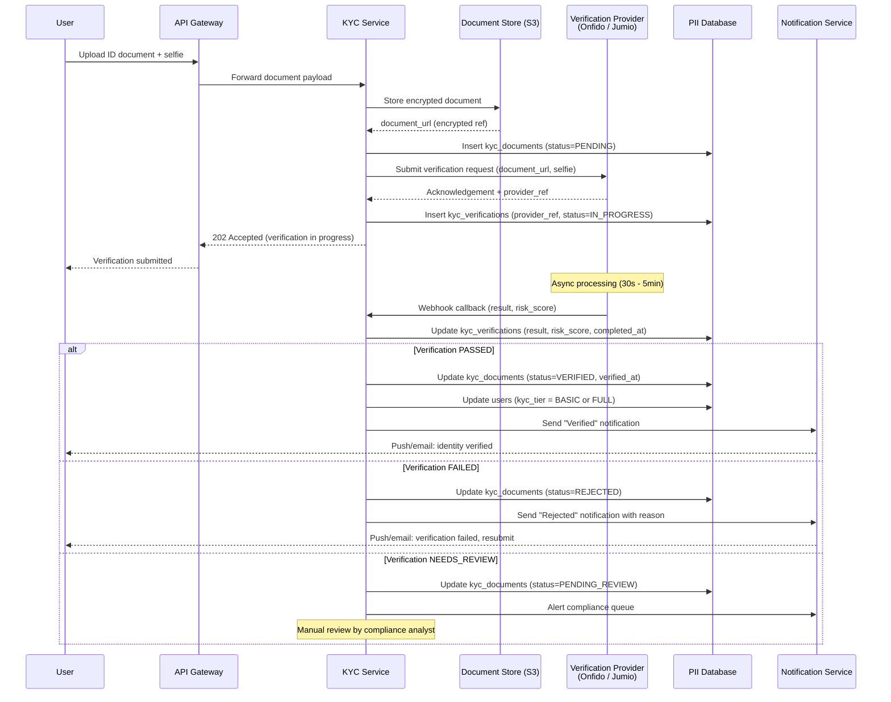
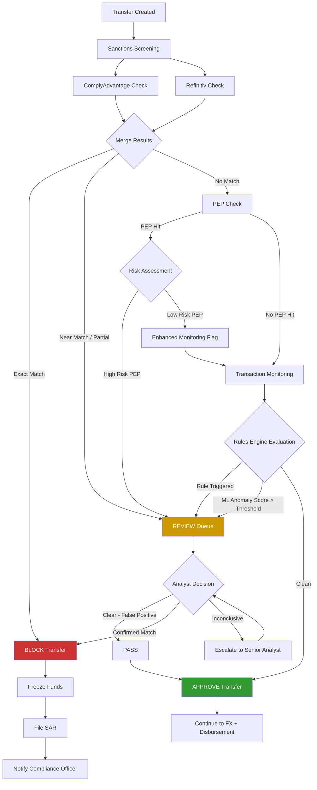
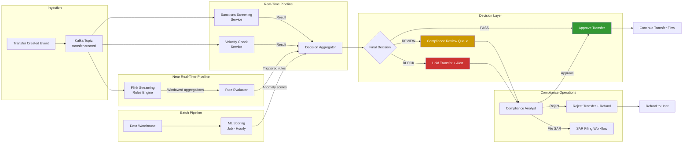

# KYC, AML, and Compliance -- Digital Remittance Platform

## KYC Tier Model

| Tier | Requirements | Transfer Limits | Monthly Limits | Allowed Actions |
|---|---|---|---|---|
| **NONE** | Account created, no verification | $0 | $0 | Browse quotes, add recipients |
| **BASIC** | Email verified + phone verified + ID scan initiated | $500 / transfer | $2,000 / month | Send transfers within limits |
| **FULL** | Government ID verified + proof of address verified via Onfido/Jumio | $50,000 / transfer | $200,000 / month | Full platform access, business corridors |

Tier transitions are one-directional upgrades. A user can be **downgraded** only by a compliance action (e.g., failed re-verification, adverse screening result), which freezes the account pending manual review rather than silently reducing limits.

### Limit Enforcement

Limits are checked at transfer creation time against a rolling window:
- **Per-transfer limit:** compared against `source_amount` at quote lock
- **Monthly limit:** sum of `source_amount` for all transfers with `created_at` in the current calendar month, grouped by `user_id`
- Corridor-specific limits may further restrict certain country pairs (e.g., US-to-Cuba blocked entirely)

---

## KYC Verification Flow



### Provider Failover

The platform integrates two KYC providers for resilience:
- **Primary:** Onfido (global coverage, strong document verification)
- **Secondary:** Jumio (fallback when Onfido is degraded or for specific document types)

Failover logic:
1. If the primary provider returns an error or times out (>30s), retry once
2. On second failure, automatically route to the secondary provider
3. Log the failover event for operational monitoring
4. Both providers write to the same `kyc_verifications` table with distinct `provider` values

---

## Sanctions and Screening Architecture

### Data Sources

| List | Source | Update Frequency | Coverage |
|---|---|---|---|
| OFAC SDN | US Treasury | Daily | US-sanctioned persons, entities, vessels |
| EU Consolidated List | European Commission | Daily | EU-sanctioned persons and entities |
| UN Sanctions | UN Security Council | As published | Global sanctions |
| PEP Database | Provider-maintained | Weekly | Politically exposed persons, relatives, close associates |
| Adverse Media | Provider-maintained | Continuous | Negative news screening |

### Dual-Provider Screening

Two providers run in parallel for every check to eliminate single points of failure and reduce false negatives:

- **ComplyAdvantage:** Real-time API, strong PEP and adverse media coverage
- **Refinitiv World-Check:** Deep sanctions and enforcement data

A match from **either** provider triggers a review. Results are merged and deduplicated before reaching the compliance queue.

### Fuzzy Name Matching

Name matching uses configurable thresholds to balance false positives against missed hits:

| Parameter | Value | Notes |
|---|---|---|
| Algorithm | Jaro-Winkler + phonetic (Double Metaphone) | Handles transliteration and spelling variants |
| Match threshold | 0.85 | Scores above this are flagged |
| Exact match | 1.0 | Automatic FAIL, immediate block |
| Near match (0.85-0.99) | REVIEW | Routed to compliance analyst |
| Below threshold (<0.85) | PASS | Logged but not flagged |

Additional matching dimensions:
- Date of birth (when available) used to disambiguate common names
- Country of residence/nationality cross-referenced with sanctioned jurisdictions
- Known aliases expanded from sanctions lists during matching

---

## Compliance Screening Decision Tree



---

## Transaction Monitoring

### Rules Engine

The rules engine evaluates every transfer against a set of deterministic rules before the ML scoring layer. Rules are version-controlled and auditable.

#### Structuring (Smurfing) Detection

| Rule | Trigger Condition | Action |
|---|---|---|
| Single-user structuring | 3+ transfers within 24h where each amount is within 10% of the reporting threshold | REVIEW |
| Multi-account structuring | Multiple users sending to the same recipient, total exceeding threshold within 7 days | REVIEW |
| Just-under-threshold | Transfer amount is between 90-100% of the per-transfer or reporting threshold | Flag for monitoring |

#### Rapid Movement

| Rule | Trigger Condition | Action |
|---|---|---|
| Velocity spike | User sends 5+ transfers in 1 hour | BLOCK + REVIEW |
| Fund pass-through | Funds received and sent out within 30 minutes | REVIEW |
| New account burst | Account less than 7 days old with 3+ transfers | REVIEW |

#### Round-Trip Patterns

| Rule | Trigger Condition | Action |
|---|---|---|
| Circular flow | User A sends to User B, User B sends equivalent amount back within 7 days | REVIEW |
| Self-send detection | Same beneficial owner on both sides (matched by name + DOB + country) | BLOCK + REVIEW |

#### Unusual Corridor Activity

| Rule | Trigger Condition | Action |
|---|---|---|
| High-risk corridor volume | User sends more than 3x their historical average to a high-risk corridor in a week | REVIEW |
| New corridor for user | First-ever transfer to a country flagged as high-risk by FATF | Enhanced due diligence required |
| Corridor mismatch | User's country of residence has no obvious connection to destination (no prior history, no nationality match) | Flag for monitoring |

### Velocity Checks

Enforced as hard limits, separate from the rules engine:

| Check | Limit | Window | On Breach |
|---|---|---|---|
| Max transfers per day per user | 10 | Rolling 24h | BLOCK new transfers |
| Max transfers per week per user | 30 | Rolling 7 days | BLOCK new transfers |
| Max cumulative amount per corridor per user | 2x monthly limit | Rolling 30 days | REVIEW |
| Max unique recipients per day | 5 | Rolling 24h | REVIEW |
| Max unique new recipients per week | 10 | Rolling 7 days | REVIEW |

### ML-Based Behavioral Scoring

A supervised model trained on historical SAR data and confirmed fraud cases:

**Features:**
- Transfer amount relative to user's historical average
- Time since last transfer
- Recipient country risk score (FATF grey/black list weighting)
- Device fingerprint consistency
- Login location vs. declared country of residence
- Cumulative 30-day volume vs. peer group (same corridor, same tier)

**Output:** Anomaly score 0.0 - 1.0

| Score Range | Action |
|---|---|
| 0.0 - 0.3 | PASS (no additional friction) |
| 0.3 - 0.7 | Enhanced monitoring (logged, reviewed in daily batch) |
| 0.7 - 0.9 | REVIEW (routed to compliance queue in real-time) |
| 0.9 - 1.0 | BLOCK + REVIEW (transfer held, analyst must approve) |

Model is retrained monthly on the latest labeled data. Shadow mode for new model versions runs in parallel for 2 weeks before promotion.

---

## Transaction Monitoring Architecture



---

## Compliance Operations

### Manual Review Queue

When a transfer or user receives a REVIEW outcome, it enters the compliance review queue with priority-based SLAs:

| Priority | Criteria | SLA | Escalation |
|---|---|---|---|
| **P1 - Critical** | Sanctions near-match, amount > $10,000, blocked transfer | 4 hours | Auto-escalate to senior analyst at 3h |
| **P2 - High** | ML score > 0.7, multiple rules triggered | 8 hours | Auto-escalate at 6h |
| **P3 - Standard** | Single rule trigger, PEP hit on low-risk individual | 24 hours | Auto-escalate at 20h |
| **P4 - Low** | Enhanced monitoring flag, informational review | 72 hours | Batch review acceptable |

Queue management:
- Analysts are assigned cases based on expertise (sanctions specialist vs. transaction monitoring)
- Cases include full context: user profile, transfer details, all screening results, historical transfer patterns, device/IP info
- Every action in the review UI generates an immutable audit event
- Two-person rule for P1 cases: a second analyst must confirm the decision

### SAR Filing Workflow

```
1. Analyst determines suspicious activity
2. Draft SAR in internal system (pre-populated from case data)
3. Senior compliance officer reviews and approves SAR
4. SAR filed with appropriate regulatory body:
   - FinCEN (US)
   - NCA via SAR Online (UK)
   - FIU of relevant jurisdiction
5. Transfer blocked/frozen if not already
6. User NOT notified of SAR filing (tipping-off prohibition)
7. SAR record stored with 7-year retention
8. Ongoing monitoring flag placed on user account
```

### Audit Trail

Every compliance decision is recorded in an immutable, append-only event log:

| Field | Description |
|---|---|
| `event_id` | UUID |
| `timestamp` | Microsecond precision, UTC |
| `actor` | System service name or analyst user ID |
| `action` | Enum: SCREEN, REVIEW_ASSIGN, REVIEW_DECISION, ESCALATE, SAR_DRAFT, SAR_APPROVE, SAR_FILE, BLOCK, UNBLOCK, TIER_CHANGE |
| `entity_type` | USER, TRANSFER, SCREENING_RESULT, SAR |
| `entity_id` | UUID of the affected entity |
| `details` | JSON payload with before/after state, reason, supporting evidence |
| `ip_address` | For analyst actions, the IP of the reviewer |

Storage: append-only table in a dedicated audit database. No UPDATE or DELETE permissions granted to any role. Replicated to immutable object storage (S3 Object Lock in compliance mode) daily.

Retention: 7 years minimum, aligned with the longest regulatory requirement across operating jurisdictions.

### Regulatory Reporting

| Report | Frequency | Recipient | Content |
|---|---|---|---|
| SAR filings | As needed | FinCEN / NCA / relevant FIU | Individual suspicious activity reports |
| CTR (Currency Transaction Report) | Per transaction > $10,000 | FinCEN (US) | Transaction details for large transfers |
| Threshold-based reports | Per transaction > local threshold | Local FIU | Varies by jurisdiction |
| Periodic compliance summary | Quarterly | Board / Compliance Committee | Aggregate statistics: SARs filed, blocks, review volumes, false positive rates |
| Sanctions screening effectiveness | Monthly | Internal compliance | Match rates, false positive rates, provider comparison |
