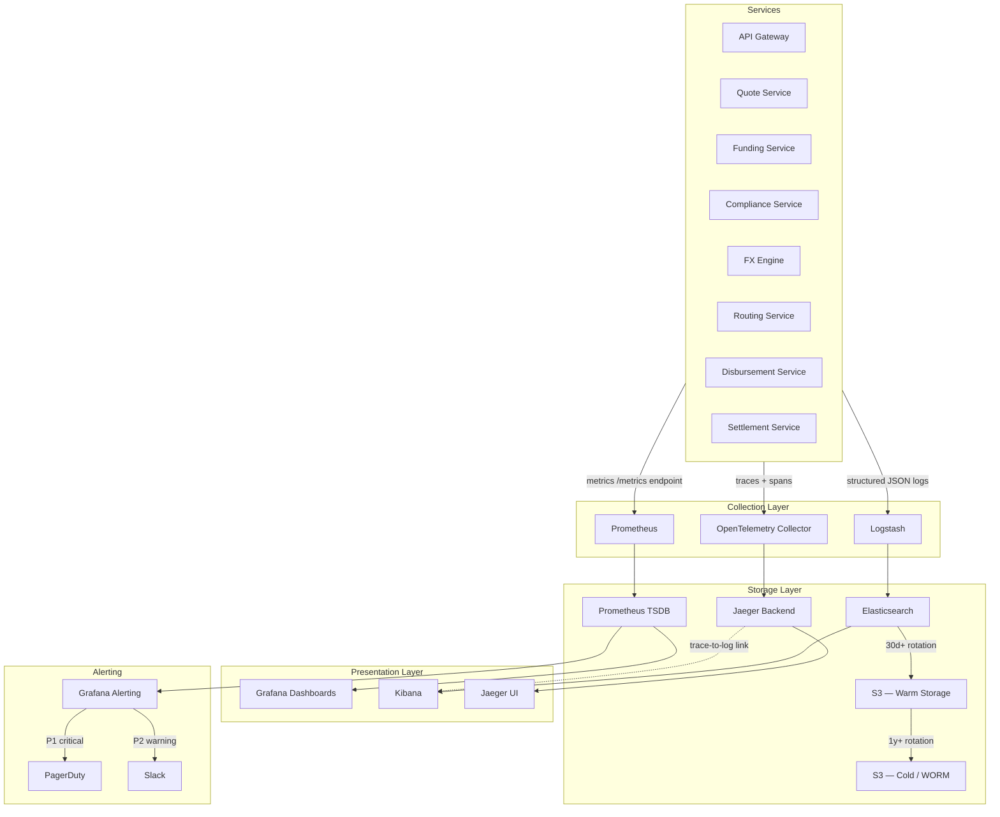
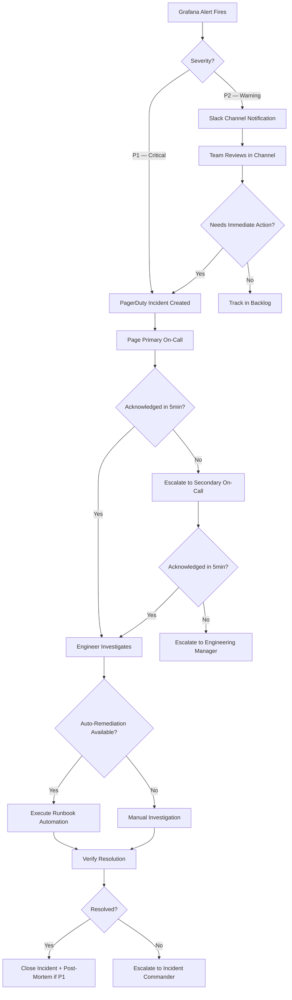
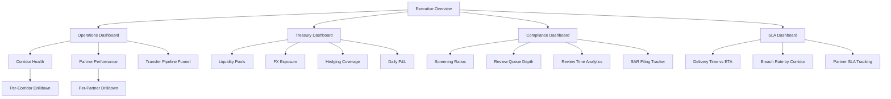

# Observability — Digital Remittance Platform

## Overview

Observability is critical for a remittance platform where money movement must be tracked end-to-end, compliance requires auditability, and failures directly impact customer trust. The observability stack is built on three pillars — metrics, logging, and distributed tracing — unified by a shared `trace_id` that correlates signals across all systems.

---

## Architecture



---

## Three Pillars

### 1. Metrics (Prometheus + Grafana)

#### Business Metrics

| Metric | Description | Labels | Alert Threshold |
|--------|-------------|--------|-----------------|
| `transfer_success_rate` | Ratio of completed transfers to initiated | `corridor`, `payment_method` | < 95% over 5min |
| `transfer_completion_time_seconds` | Time from initiation to delivery | `corridor`, `speed_tier` | p95 > promised ETA |
| `quote_to_transfer_conversion_rate` | Ratio of transfers created to quotes generated | `corridor`, `channel` | < 5% (investigate UX) |
| `revenue_per_transfer_usd` | Fee + FX markup revenue per transfer | `corridor`, `tier` | Margin < cost threshold |
| `daily_volume_usd` | Total transfer volume aggregated daily | `currency_pair`, `direction` | Deviation > 2 stddev |

#### Service Metrics (RED Method)

Every service exposes:

- **Rate**: `http_requests_total` — request count per service, endpoint, method, status code
- **Errors**: `http_errors_total` — 4xx and 5xx counts, broken down by error category
- **Duration**: `http_request_duration_seconds` histogram — p50, p95, p99 per service per endpoint

```
# Example Prometheus metric
http_request_duration_seconds_bucket{service="quote-service", endpoint="/v1/quotes", method="POST", le="0.1"} 45230
http_request_duration_seconds_bucket{service="quote-service", endpoint="/v1/quotes", method="POST", le="0.5"} 49800
http_request_duration_seconds_bucket{service="quote-service", endpoint="/v1/quotes", method="POST", le="1.0"} 49950
```

#### Infrastructure Metrics

| Metric | Source | Purpose |
|--------|--------|---------|
| CPU / Memory utilization | cAdvisor / node-exporter | Capacity planning, autoscaling signals |
| Pod restart count | kube-state-metrics | Crash loop detection |
| Kafka consumer lag | Kafka exporter | Processing backlog detection |
| DB connection pool utilization | HikariCP metrics | Connection exhaustion prevention |
| Redis hit rate / eviction rate | Redis exporter | Cache effectiveness |
| Vault token renewal failures | Vault metrics | Secrets availability |

#### FX-Specific Metrics

| Metric | Description | Alert Condition |
|--------|-------------|-----------------|
| `fx_rate_spread_bps` | Spread vs mid-market rate in basis points | Spread exceeds configured max per corridor |
| `liquidity_pool_utilization` | Current balance / daily average volume | < 20% triggers treasury notification |
| `hedging_pnl_usd` | Daily P&L from FX hedging positions | Loss exceeds daily risk limit |
| `rate_staleness_seconds` | Time since last rate update from provider | > 60s triggers quoting pause |

---

### 2. Logging (ELK Stack)

#### Structured Log Format

All services emit structured JSON logs with mandatory fields:

```json
{
  "timestamp": "2026-04-01T10:23:45.123Z",
  "service": "compliance-service",
  "instance": "compliance-service-7b4d9f-x2k9p",
  "trace_id": "abc123def456",
  "span_id": "span-789",
  "transfer_id": "TXN-2026-0401-00847",
  "user_id": "usr_a1b2c3d4",
  "level": "INFO",
  "message": "Sanctions screening completed",
  "screening_result": "CLEAR",
  "provider": "complyadvantage",
  "duration_ms": 342,
  "corridor": "US-IN"
}
```

#### PII Scrubbing

PII is scrubbed at the Logstash ingestion layer before data enters Elasticsearch:

- **Scrubbed fields**: Bank account numbers, routing numbers, SSNs, passport numbers, document images, raw addresses
- **Retained identifiers**: Tokenized references (`user_id`, `transfer_id`, `recipient_token`) that can be dereferenced only by authorized services via Vault
- **Implementation**: Logstash filter plugins with regex patterns + field allowlisting. Only explicitly allowed fields pass through.

#### Log Levels

| Level | Usage | Example |
|-------|-------|---------|
| **ERROR** | Failures requiring human action | Disbursement partner returned terminal failure |
| **WARN** | Degraded paths, fallbacks triggered | Primary FX provider timed out, fell back to secondary |
| **INFO** | State transitions, business events | Transfer moved from `FUNDED` to `COMPLIANCE_SCREENING` |
| **DEBUG** | Verbose diagnostics, non-prod only | Full request/response payloads for partner APIs |

#### Retention Policy

| Tier | Storage | Duration | Purpose |
|------|---------|----------|---------|
| **Hot** | Elasticsearch | 30 days | Active investigation, dashboards, search |
| **Warm** | S3 Standard-IA | 1 year | Historical analysis, incident review |
| **Cold** | S3 Glacier with WORM | 7 years | Compliance-tagged logs (BSA/AML, regulatory audit) |

Lifecycle transitions are managed by Elasticsearch ILM policies. Compliance-tagged logs (those containing `transfer_id`, `screening_result`, `sar_flag`) are automatically classified for 7-year cold retention.

---

### 3. Distributed Tracing (Jaeger + OpenTelemetry)

#### Trace Propagation

- `trace_id` is assigned at the API Gateway when a request enters the system
- Propagated via **W3C Trace Context** headers (`traceparent`, `tracestate`) through all synchronous HTTP/gRPC calls
- For Kafka messages, `trace_id` is embedded in message headers so consumers continue the same trace
- OpenTelemetry SDK is instrumented in every service; the OTel Collector aggregates and exports to Jaeger

#### Key Spans

A typical transfer trace includes these spans:

```
transfer.create [API Gateway]
  |-- quote.create [Quote Service]
  |     |-- fx.get_rate [FX Engine]
  |     |-- fee.calculate [Fee Service]
  |-- funding.collect [Funding Service]
  |     |-- payment.charge_card [Payment Processor]
  |-- compliance.screen [Compliance Service]
  |     |-- sanctions.check [ComplyAdvantage]
  |     |-- sanctions.check [Refinitiv]
  |     |-- rules.evaluate [Rules Engine]
  |-- fx.convert [FX Engine]
  |     |-- liquidity.reserve [Treasury]
  |-- routing.select [Routing Service]
  |     |-- partner.check_availability [Partner Gateway]
  |-- disbursement.initiate [Disbursement Service]
        |-- partner.send [Payout Partner API]
```

#### Trace-to-Log Correlation

Clicking a span in the Jaeger UI links directly to the corresponding log lines in Kibana via shared `trace_id`:

- Jaeger UI includes a "View Logs" button per span that opens Kibana filtered by `trace_id` AND `span_id`
- Kibana log entries include clickable `trace_id` links that open the full trace in Jaeger
- Grafana dashboards embed both Jaeger and Kibana panels for unified investigation

---

## Alerting (PagerDuty + Grafana Alerting)

### Alert Definitions

| Alert | Condition | Severity | Action |
|-------|-----------|----------|--------|
| Transfer success rate drop | < 95% over 5min per corridor | **P1** | Page on-call engineer |
| Compliance screening latency | p99 > 5s | **P2** | Slack alert to compliance-eng channel |
| Funding failure spike | > 10% failure rate in 5min window | **P1** | Page on-call engineer |
| Disbursement partner down | Health check failures > 3 consecutive | **P1** | Auto-failover to backup partner + page |
| Kafka consumer lag | > 10,000 messages on compliance topic | **P2** | Slack alert to platform-eng channel |
| FX rate staleness | No rate update in > 60s from any provider | **P1** | Auto-pause quoting + page treasury |
| Liquidity pool low | Balance < 20% of daily average volume | **P2** | Notify treasury team via Slack |
| Settlement recon mismatch | Delta > $100 between expected and actual | **P1** | Page finance ops on-call |

### Alert Escalation Flow



---

## Dashboards

### Dashboard Hierarchy



### Dashboard Details

#### Operations Dashboard
- **Transfer pipeline funnel**: Real-time counts at each stage (Quoted, Funded, Screening, Converting, Routing, Disbursing, Delivered)
- **Per-stage latency heatmaps**: Time spent in each pipeline stage, color-coded by percentile
- **Error breakdown**: Top failure reasons by stage, partner, and corridor
- **Throughput**: Transfers per second, current vs historical baseline

#### Corridor Health Dashboard
- **Per-corridor success rate**: Last 1h, 24h, 7d with trend lines
- **Delivery time distribution**: Histogram per corridor with promised ETA overlay
- **Partner performance**: Latency and success rate per disbursement partner per corridor
- **Volume trends**: Transfer count and USD volume per corridor over time

#### Compliance Dashboard
- **Screening ratios**: Clear vs hit vs pending review, by provider
- **Review queue depth**: Current backlog of manual reviews, aging analysis
- **Average review time**: Time from screening hit to analyst resolution
- **SAR filing tracker**: Suspicious activity reports filed, by corridor and reason

#### Treasury Dashboard
- **Liquidity pool balances**: Real-time balances per currency with min/max thresholds
- **FX exposure**: Net open position per currency pair
- **Hedging coverage**: Percentage of exposure hedged, hedge effectiveness
- **Daily P&L**: Revenue (fees + FX markup) minus costs (partner fees + hedging losses)

#### SLA Dashboard
- **Delivery time vs promised ETA**: Scatter plot per corridor, highlighting breaches
- **Breach rate tracking**: Percentage of transfers exceeding promised delivery time
- **Partner SLA compliance**: Per-partner delivery within contracted SLA
- **Customer impact**: Number of customers affected by SLA breaches, repeat offenders

---

## Operational Runbooks

Each P1 alert has an associated runbook linked from the PagerDuty incident:

| Alert | Runbook Actions |
|-------|----------------|
| Transfer success rate drop | 1. Check corridor health dashboard. 2. Identify failing stage via funnel. 3. Check partner status. 4. If partner down, trigger failover. |
| Funding failure spike | 1. Check payment processor status page. 2. Review error codes in Kibana. 3. If processor-wide, pause funding for affected method. 4. Notify customers. |
| Disbursement partner down | 1. Auto-failover executes. 2. Verify failover partner is processing. 3. Monitor queue drain. 4. Contact partner for ETA. |
| FX rate staleness | 1. Quoting auto-paused. 2. Check FX provider connectivity. 3. Switch to backup provider. 4. Resume quoting after rate freshness confirmed. |
| Settlement recon mismatch | 1. Pause auto-settlement for corridor. 2. Pull transaction-level detail. 3. Identify mismatched records. 4. Escalate to partner if their-side error. |

---

## Key Design Decisions

1. **Unified trace_id across sync and async boundaries**: Kafka messages carry trace context so a transfer's entire lifecycle (including async compliance screening and disbursement) is a single trace.

2. **PII never in logs**: Scrubbing at ingestion (not at query time) ensures raw PII never persists in Elasticsearch. Investigators use tokenized IDs and dereference via Vault-protected APIs when needed.

3. **Separate alert channels by severity**: P1 alerts page immediately via PagerDuty; P2 alerts go to Slack. This prevents alert fatigue while ensuring critical issues get immediate attention.

4. **Auto-remediation for known failure modes**: Disbursement partner failures and FX rate staleness trigger automatic failover/pause before a human is paged. The human validates the automated action rather than performing it.

5. **Compliance log retention**: 7-year cold storage with WORM (Write Once Read Many) policy satisfies BSA/AML record-keeping requirements and ensures audit trail immutability.
