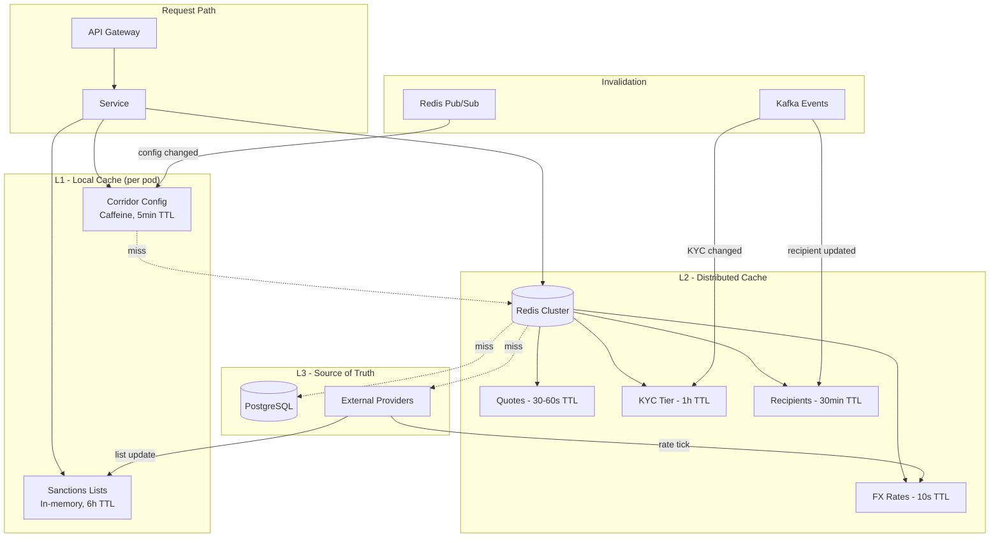
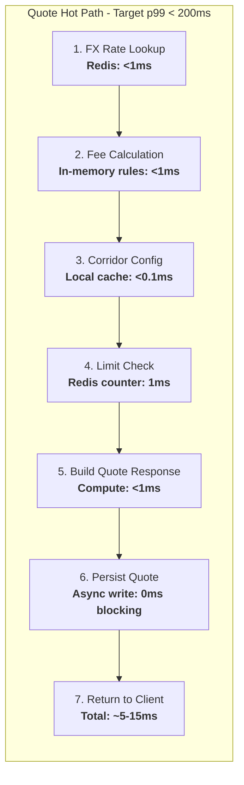
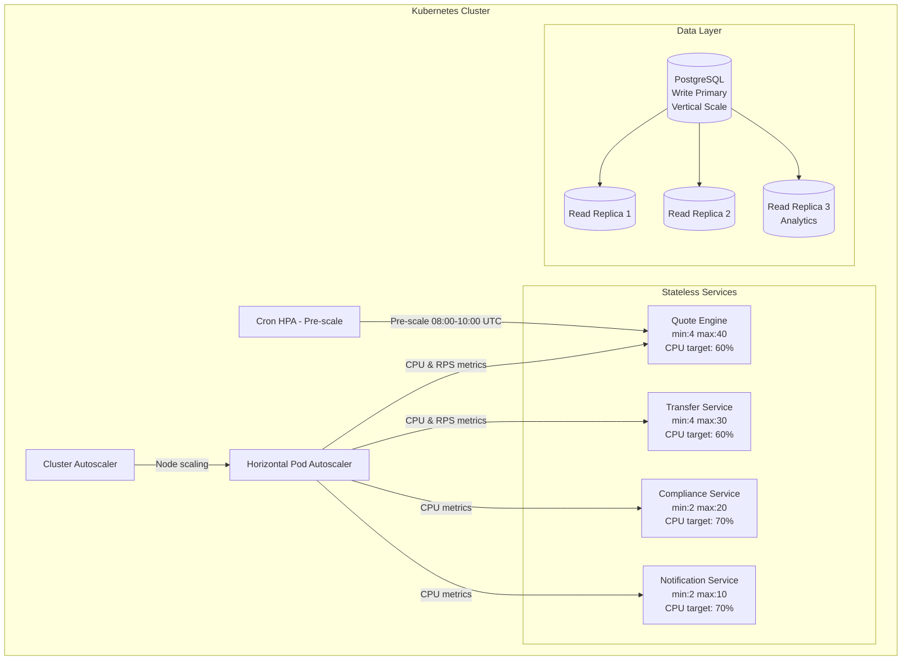

# Performance & Optimization

## Caching Strategy

### Cache Layers

| Cache | What | TTL | Invalidation | Storage |
|---|---|---|---|---|
| **FX Rate Cache** | Mid-market rates per currency pair | 10s | Overwritten on every rate tick from provider | Redis |
| **Quote Cache** | Locked quotes (rate, fee, amount) | 30-60s | Auto-expire; deleted on quote acceptance | Redis |
| **Corridor Config** | Corridors, partners, fees, limits | 5min | Pub/sub invalidation on admin change | Local (Caffeine) + Redis |
| **User KYC Tier** | KYC verification level (1/2/3) | 1h | Event-driven invalidation on KYC status change | Redis |
| **Sanctions List** | OFAC, EU, UN consolidated lists | 6h | Full refresh triggered by list update webhook | Local (in-memory) |
| **Recipient Details** | Frequent recipients per user | 30min | Invalidated on recipient update/delete | Redis |

### Caching Architecture



### Cache Hit Rate Targets

| Cache | Target Hit Rate | Impact of Miss |
|---|---|---|
| FX Rate | >99% | Extra 5-10ms (Redis fallback to provider) |
| Corridor Config | >99.9% | Extra 2-5ms (Redis L2 hit) |
| Sanctions List | 100% (preloaded) | N/A -- always in memory |
| KYC Tier | >95% | Extra 10-20ms (DB query) |
| Quote | >90% | 404 -- user must re-quote |

## Hot Path Optimization (Quote Creation)

Quote creation is the most latency-sensitive operation -- it is user-facing and directly affects conversion rates.

### Optimized Flow



### Design Decisions

1. **FX rate from Redis** -- sub-millisecond. Rates are pushed to Redis by a dedicated rate-ingestion service every time the provider sends a tick. No synchronous call to the FX provider.
2. **Fee calculation via in-memory rules engine** -- fees are expressed as rules (corridor + payment method + tier -> fee structure). Rules are loaded into memory at startup and refreshed via pub/sub. No database call.
3. **Corridor config from local cache** -- Caffeine cache with 5-minute TTL. Config changes are rare (a few times per week), so the local cache has a near-100% hit rate.
4. **Quote persistence is async** -- the quote object is returned to the client immediately. A Kafka message triggers async persistence to PostgreSQL. If the user accepts the quote within the TTL, the acceptance handler reads from Redis.
5. **No compliance check on quote** -- screening runs only after the user confirms the transfer. This keeps the quote path fast and avoids unnecessary screening costs.

### Latency Budget

| Step | p50 | p95 | p99 |
|---|---|---|---|
| FX rate lookup | 0.2ms | 0.5ms | 1ms |
| Fee calculation | 0.1ms | 0.2ms | 0.5ms |
| Corridor config | 0.05ms | 0.1ms | 0.2ms |
| Limit check | 0.5ms | 1ms | 2ms |
| Serialization + network | 2ms | 5ms | 10ms |
| **Total** | **~3ms** | **~7ms** | **~14ms** |

Target: **p99 < 200ms** (generous budget accounts for GC pauses, network jitter, and degraded scenarios).

## Database Optimizations

### Connection Pooling

- **PgBouncer** in transaction-mode pooling, deployed as a sidecar per service pod.
- 200 connections per service instance (PgBouncer manages the pool; actual PostgreSQL connections are ~50 per service).
- Prevents connection exhaustion during traffic spikes.

### Read Replicas

- **Dashboards and admin UI** -- always read from replicas.
- **Transfer status checks** -- read from replica with `statement_timeout = 2s`. Fall back to primary if replica lag >1s (for recently created transfers).
- **Reporting and analytics** -- dedicated read replica with higher `work_mem` and `shared_buffers` tuned for analytical queries.

### Table Partitioning

```sql
-- Transfers partitioned by month
CREATE TABLE transfers (
    id UUID PRIMARY KEY,
    created_at TIMESTAMPTZ NOT NULL,
    ...
) PARTITION BY RANGE (created_at);

CREATE TABLE transfers_2026_01 PARTITION OF transfers
    FOR VALUES FROM ('2026-01-01') TO ('2026-02-01');

-- Ledger entries partitioned by month
CREATE TABLE ledger_entries (
    id UUID PRIMARY KEY,
    posted_at TIMESTAMPTZ NOT NULL,
    ...
) PARTITION BY RANGE (posted_at);

-- Status history partitioned by month
CREATE TABLE transfer_status_history (
    id UUID PRIMARY KEY,
    changed_at TIMESTAMPTZ NOT NULL,
    ...
) PARTITION BY RANGE (changed_at);
```

- **Active partitions:** Current month + previous month kept on fast storage.
- **Archival:** Partitions older than 1 year are detached and moved to archive tables backed by cheaper storage (S3 via pg_partman + aws_s3 extension).
- **Partition pruning** eliminates scanning irrelevant months for date-ranged queries.

### Indexing Strategy

| Table | Index | Purpose |
|---|---|---|
| transfers | `(sender_id, created_at DESC)` | User's transfer history |
| transfers | `(status, corridor)` | Operational dashboards |
| transfers | `(idempotency_key)` UNIQUE | Duplicate detection |
| ledger_entries | `(account_id, posted_at DESC)` | Account balance queries |
| ledger_entries | `(transfer_id)` | Ledger entries for a transfer |

## Async Processing

| Operation | Mechanism | Rationale |
|---|---|---|
| Funding webhooks | Dedicated Kafka consumer group | Decouple webhook receipt from transfer processing |
| Low-risk compliance screening | Async via Kafka after transfer creation | Transfers from Tier 3 KYC users under $500 can proceed while screening completes |
| Settlement with partners | Batch job (hourly/daily per partner) | Partners settle in batches, not per-transaction |
| Notifications (email, SMS, push) | Fire-and-forget via Kafka | Notification failure should never block transfer processing |
| Quote persistence | Async write via Kafka | Quote response returned immediately to user |
| Audit logging | Async via Kafka to Elasticsearch | High-volume, not on critical path |

## Rate Limiting & Backpressure

### API Gateway Rate Limits

| Endpoint Category | Burst | Sustained | Scope |
|---|---|---|---|
| Quote creation | 100 req/s | 20 req/s | Per user |
| Transfer creation | 20 req/s | 5 req/s | Per user |
| Status check | 200 req/s | 50 req/s | Per user |
| Auth endpoints | 10 req/s | 3 req/s | Per IP |
| Admin APIs | 50 req/s | 20 req/s | Per role |

Algorithm: **Token bucket** with sliding window for sustained rate.

### Kafka Consumer Parallelism

| Consumer Group | Partitions | Concurrency | Rationale |
|---|---|---|---|
| Compliance screening | 50 | 50 consumers | High volume, independent per transfer |
| Settlement processing | 5 | 5 consumers | Low volume, partner-serialized |
| Notification dispatch | 20 | 20 consumers | Medium volume, fire-and-forget |
| Audit logging | 10 | 10 consumers | Bulk writes to Elasticsearch |

### Partner API Backpressure

- Each partner has a configured rate limit (e.g., Partner A: 100 req/s, Partner B: 50 req/s).
- A **token bucket per partner** gates outbound calls. Excess requests are queued in Kafka with priority ordering (higher-value transfers first).
- Queue depth is monitored; alert if >1000 pending requests for a single partner.

## Scaling Strategy

### Auto-Scaling Architecture



### Scaling Policies

| Component | Scaling Approach | Details |
|---|---|---|
| Stateless services | HPA on CPU (60%) and custom request-rate metric | Scale-up: 30s evaluation, scale-down: 5min stabilization |
| Quote Engine | Cron HPA pre-scales during peak hours (08:00-10:00 UTC, 18:00-20:00 UTC) | Pre-warms pods before traffic surge |
| PostgreSQL writes | Vertical scaling (larger instance) | Write-primary is a single node; scale up instance class |
| PostgreSQL reads | Horizontal read replicas | Add replicas for dashboard/reporting load |
| Kafka | Partition count matched to consumer group size | Add partitions + consumers together |
| Redis | Vertical for memory, cluster mode for throughput | Shard if >100K ops/s |

### Peak Hour Handling

- Peak traffic typically 3-5x baseline (correlated with business hours in major corridors: US, UK, India).
- **Cron HPA** pre-scales Quote Engine and Transfer Service 15 minutes before predicted peak.
- **Cluster Autoscaler** provisions new nodes from a warm pool (pre-configured ASG with 5 standby nodes).
- **Scale-down stabilization:** 5 minutes to prevent flapping during traffic oscillation.
