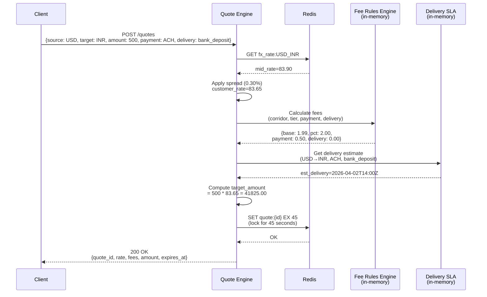
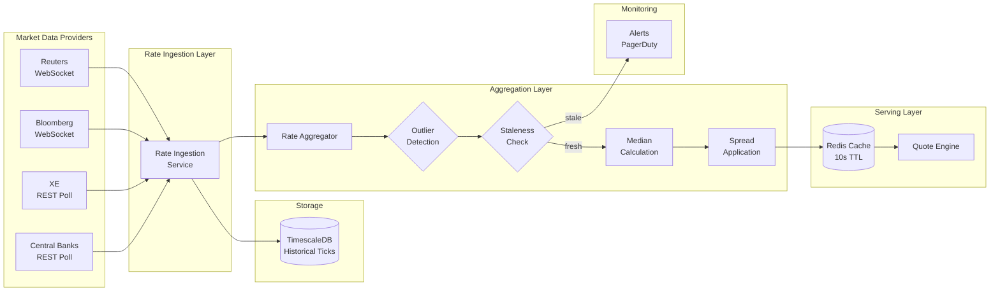
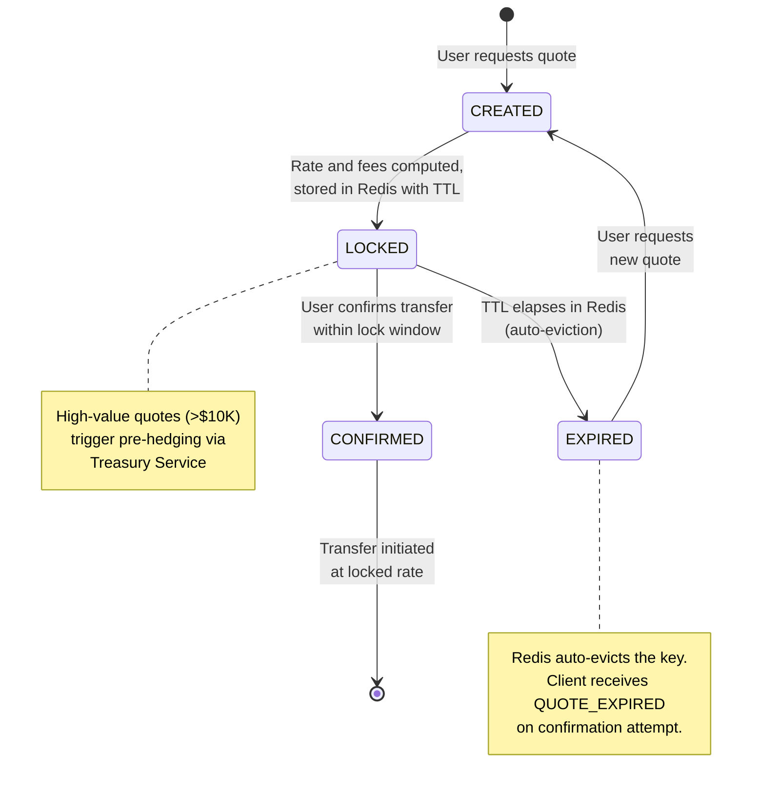

# Quote Engine Service

## Overview

The Quote Engine is the customer-facing pricing service responsible for computing the total cost of a remittance transfer in real time. It answers the question: "If I send X in currency A, how much does the recipient get in currency B, what are the fees, and how long will it take?"

The service must be fast (p99 < 200ms), accurate (rates reflect live market within seconds), and reliable (a locked quote is a binding commitment from the platform).

---

## Responsibilities

| Responsibility | Description |
|---|---|
| Real-time FX rate management | Ingest, aggregate, and serve exchange rates from multiple market data providers |
| Fee calculation | Compute corridor-specific fees, payment method surcharges, and delivery method costs |
| Delivery time estimation | Estimate arrival time based on corridor, payment method, and delivery method |
| Quote locking | Guarantee a rate for a fixed window so the user can confirm the transfer |

---

## FX Rate Pipeline

### Market Data Ingestion

The platform consumes live FX rate feeds from multiple providers to avoid single-source dependency and to improve accuracy.

| Provider | Protocol | Update Frequency | Coverage |
|---|---|---|---|
| Reuters Refinitiv | WebSocket | Sub-second ticks | 150+ currency pairs |
| Bloomberg B-PIPE | WebSocket | Sub-second ticks | 150+ currency pairs |
| XE | REST polling | Every 5-10s | 170+ currency pairs |
| Central bank feeds | REST polling | Daily/hourly | Official rates for regulated corridors |

Raw ticks are written to **TimescaleDB** (a time-series extension of PostgreSQL) for historical analysis, audit, and replay. Each tick record includes: `provider`, `currency_pair`, `bid`, `ask`, `mid`, `timestamp`, `sequence_id`.

### Rate Aggregation

Raw provider rates are aggregated into a single authoritative mid-market rate per currency pair:

1. **Outlier detection** -- If a provider's rate deviates more than 2 standard deviations from the rolling 5-minute mean across providers, it is flagged and excluded from aggregation.
2. **Staleness check** -- If no update is received from any provider for a given pair within 60 seconds, an alert fires. If a single provider goes stale, the remaining providers are used. If all providers are stale, the last known rate is served with a `STALE` flag and ops is notified.
3. **Median calculation** -- The mid-market rate is computed as the median of non-outlier provider mid-rates. Median is preferred over mean for robustness against a single erratic feed.
4. **Spread application** -- The customer-facing rate is the mid-market rate minus the platform spread (configurable per corridor, typically 0.3-0.8%).

### Rate Caching and Serving

- The computed mid-market rate is written to **Redis** with a **10-second TTL**, refreshed on every incoming tick.
- Quote creation reads exclusively from Redis -- no database queries on the hot path.
- If the Redis key is missing (cache miss), the service falls back to a direct TimescaleDB read of the latest aggregated rate and repopulates the cache. This should be rare and triggers a monitoring alert.

```
┌─────────────────────────────────────────────────────────┐
│                   FX Rate Pipeline                       │
│                                                         │
│  Reuters ──┐                                            │
│  Bloomberg ─┼──▶ Rate Ingestion ──▶ TimescaleDB         │
│  XE ────────┘        │                                  │
│                      ▼                                  │
│              Rate Aggregation                           │
│           (outlier, staleness,                          │
│            median, spread)                              │
│                      │                                  │
│                      ▼                                  │
│              Redis (10s TTL)  ◀── refreshed per tick    │
│                      │                                  │
│                      ▼                                  │
│              Quote Engine reads                         │
└─────────────────────────────────────────────────────────┘
```

---

## Fee Calculation

### Fee Components

The total fee is the sum of several components, each independently configurable per corridor.

**1. Base Fee + Percentage Fee (tiered by volume)**

| Monthly Volume Tier | Base Fee (USD-equivalent) | Percentage Fee |
|---|---|---|
| $0 - $1,000 | $2.99 | 0.50% |
| $1,001 - $5,000 | $1.99 | 0.40% |
| $5,001 - $25,000 | $0.99 | 0.30% |
| $25,001+ | $0.00 | 0.20% |

**2. Payment Method Surcharge**

| Method | Surcharge | Reason |
|---|---|---|
| Credit/Debit Card | +1.5% of send amount | Card network interchange + fraud risk |
| ACH (US) | Flat $0.50 | Low-cost rail |
| SEPA (EU) | Flat EUR 0.30 | Low-cost rail |
| Bank Transfer / Wire | $1.00 - $2.00 | Manual reconciliation overhead |
| Open Banking (UK/EU) | Flat GBP 0.20 | Low cost, instant |

**3. Delivery Method Impact**

| Delivery Method | Additional Cost |
|---|---|
| Bank deposit | $0 (base) |
| Mobile wallet | $0 - $0.50 |
| Cash pickup | $2.00 - $5.00 (agent network fees) |
| Home delivery | $5.00 - $10.00 (courier costs) |

### Fee Rules Engine

Fee rules are stored in a configuration service (backed by a database) and cached in-memory with a short TTL. This allows product and operations teams to update fees per corridor, payment method, or delivery method **without a code deployment**.

The rules engine evaluates in order:
1. Look up corridor-specific override (e.g., USD-to-INR has a promotional zero base fee).
2. Fall back to default tier-based rules.
3. Apply payment method surcharge.
4. Apply delivery method surcharge.
5. Apply any promotional discount codes.

---

## Delivery Time Estimation

Estimated delivery time is computed from a matrix of factors:

| Factor | Impact |
|---|---|
| Payment method | Card = instant funding; ACH = 1-3 days (unless pre-funded) |
| Pre-funding eligibility | If approved, ACH delay is absorbed by the platform |
| Corridor processing time | Some corridors have banking hours cutoffs |
| Delivery method | Bank deposit = hours; cash pickup = minutes after payout |
| Compliance holds | First-time senders or flagged transfers add delay |

The estimate is returned as a range (e.g., "arrives in 1-2 hours" or "arrives by April 3, 2026") and is computed from a corridor-specific SLA table maintained by operations.

---

## Quote Locking

### Mechanism

When a user requests a quote, the Quote Engine returns a **quote object** with a guaranteed rate, locked for a configurable window (30-60 seconds depending on corridor volatility).

- The quote is stored in **Redis** with a TTL equal to the lock duration.
- The quote ID is a UUID returned to the client.
- If the user confirms the transfer within the window, the Transfer Service reads the quote from Redis and honors the locked rate.
- If the quote expires (TTL elapses), Redis evicts it automatically. Any attempt to confirm returns a `QUOTE_EXPIRED` error, and the client must request a fresh quote.

### Quote Data Structure

```json
{
  "quote_id": "q_8f3a9b2c-4d5e-6f7a-8b9c-0d1e2f3a4b5c",
  "source_currency": "USD",
  "target_currency": "INR",
  "source_amount": 500.00,
  "target_amount": 41825.00,
  "exchange_rate": 83.65,
  "mid_market_rate": 83.90,
  "platform_spread": 0.0030,
  "fee_breakdown": {
    "base_fee": 1.99,
    "percentage_fee": 2.00,
    "payment_surcharge": 0.50,
    "delivery_surcharge": 0.00,
    "total_fee": 4.49
  },
  "total_cost": 504.49,
  "payment_method": "ACH",
  "delivery_method": "bank_deposit",
  "estimated_delivery": "2026-04-02T14:00:00Z",
  "locked_at": "2026-04-01T10:30:00Z",
  "expires_at": "2026-04-01T10:30:45Z",
  "status": "LOCKED"
}
```

### Hedging on Lock

For high-value quotes (above $10,000), the platform cannot afford to absorb FX movement during the lock window. When such a quote is locked:

1. The Quote Engine publishes a `QuoteLocked` event to Kafka.
2. The Treasury Service consumes the event and executes a **spot hedge** with a banking partner to lock in the rate.
3. If the user confirms, the hedge is assigned to the transfer.
4. If the quote expires, the hedge is unwound (or netted against the next high-value transfer in the same corridor).

This limits the platform's FX exposure on large transfers while keeping the user experience instant.

---

## Performance Design

**Target: p99 < 200ms for quote creation**

All data required for quote creation is served from cache or in-memory stores:

| Data | Source | Latency |
|---|---|---|
| FX rate | Redis | < 1ms |
| Fee rules | In-memory cache (refreshed every 30s) | < 0.1ms |
| Delivery SLA | In-memory cache (refreshed every 60s) | < 0.1ms |
| User volume tier | Redis (precomputed on transfer completion) | < 1ms |
| Quote write (lock) | Redis SET with TTL | < 1ms |

No database reads occur on the hot path. TimescaleDB and the configuration database are only read during cache refresh cycles and for historical queries.

---

## Diagrams

### 1. Quote Creation Flow



### 2. FX Rate Pipeline Architecture



### 3. Quote Lifecycle State Diagram



---

## Failure Modes and Mitigations

| Failure | Impact | Mitigation |
|---|---|---|
| All FX providers down | Cannot produce fresh rates | Serve last known rate with STALE flag; alert ops; widen spread as buffer |
| Redis down | Cannot read rates or lock quotes | Circuit breaker; fallback to direct TimescaleDB read (degraded latency); disable quote locking temporarily |
| Fee rules cache stale | Incorrect fee calculation | Short cache TTL (30s); versioned config with change notifications via pub/sub |
| Quote confirmed after server-side expiry but before client-side | Race condition | Server always checks Redis for quote existence; if missing, return QUOTE_EXPIRED |
| Hedge failure on high-value quote | Platform absorbs FX risk | Widen spread for unhedged quotes; alert treasury team; set exposure limits |

---

## API Contract

### POST /v1/quotes

**Request:**
```json
{
  "source_currency": "USD",
  "target_currency": "INR",
  "source_amount": 500.00,
  "payment_method": "ACH",
  "delivery_method": "bank_deposit",
  "recipient_country": "IN",
  "promo_code": null
}
```

**Response (200 OK):**
```json
{
  "quote_id": "q_8f3a9b2c-4d5e-6f7a-8b9c-0d1e2f3a4b5c",
  "source_currency": "USD",
  "target_currency": "INR",
  "source_amount": 500.00,
  "target_amount": 41825.00,
  "exchange_rate": 83.65,
  "fee_breakdown": {
    "base_fee": 1.99,
    "percentage_fee": 2.00,
    "payment_surcharge": 0.50,
    "delivery_surcharge": 0.00,
    "total_fee": 4.49
  },
  "total_cost": 504.49,
  "estimated_delivery": "2026-04-02T14:00:00Z",
  "expires_at": "2026-04-01T10:30:45Z"
}
```

### GET /v1/quotes/{quote_id}

Returns the quote if still valid; 404 if expired and evicted from Redis.
