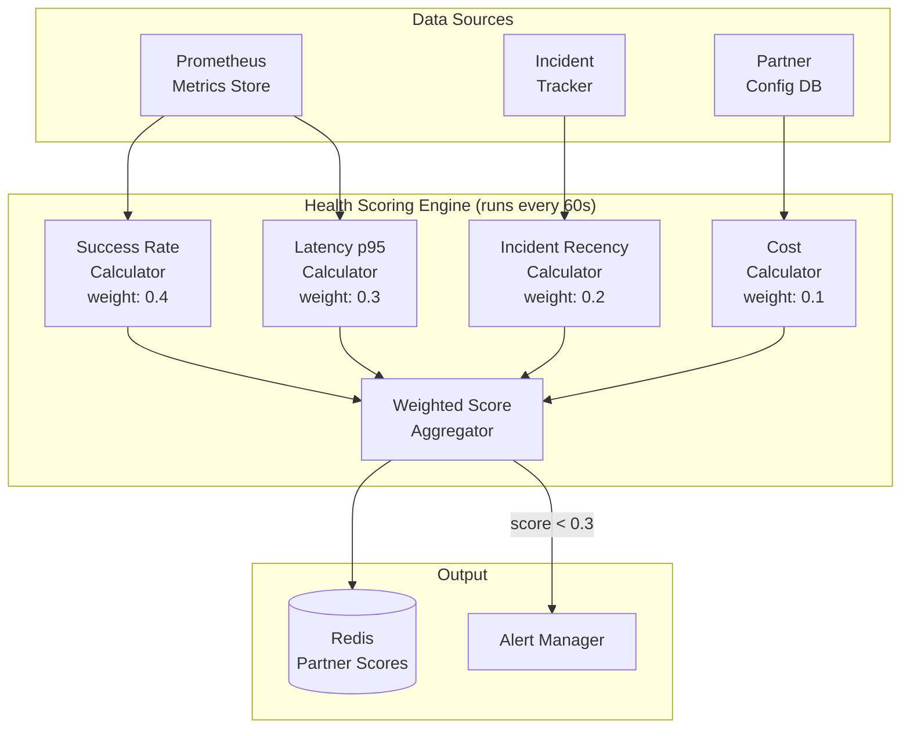
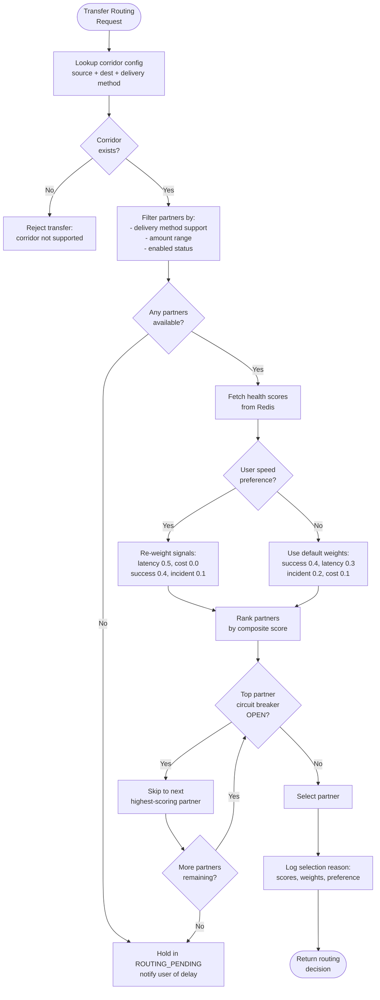
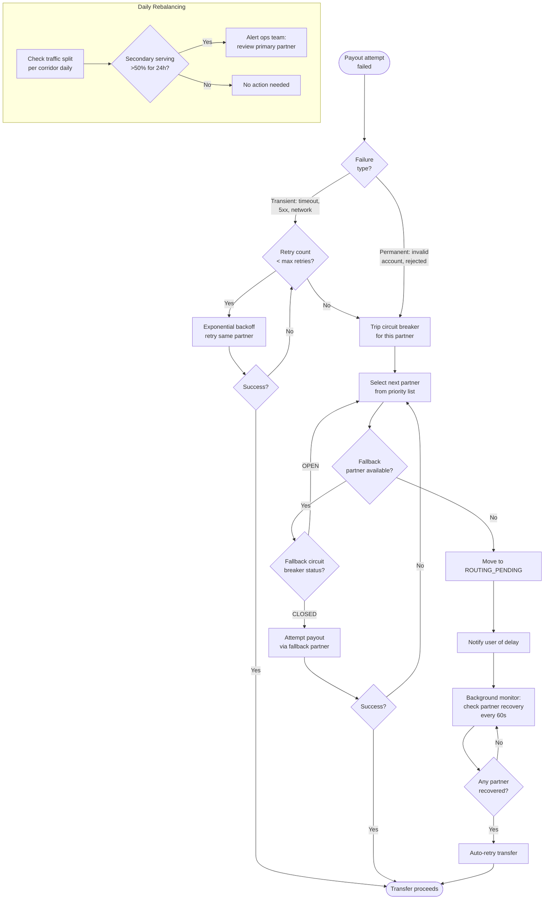

# Routing & Corridors Service

The Routing & Corridors Service is responsible for determining how a remittance transfer moves from the source country to the destination country. It selects the optimal payout partner for each transfer based on corridor availability, partner health, user preferences, and cost.

---

## Corridor Definition

A **corridor** is the fundamental routing unit, defined as:

```
corridor = source_country + destination_country + delivery_method
```

For example: `US → IN → BANK_DEPOSIT` or `UK → KE → MOBILE_WALLET`.

Each corridor has one or more **payout partners** configured:

- **Primary partner**: default route, typically best cost/speed combination
- **Fallback partners**: ordered list of alternatives activated on primary failure

### Corridor Configuration

Corridor config is stored in a relational database (PostgreSQL) and cached for fast lookup:

| Field | Type | Example |
|---|---|---|
| `corridor_id` | UUID | `c-us-in-bank` |
| `source_country` | ISO 3166-1 | `US` |
| `destination_country` | ISO 3166-1 | `IN` |
| `delivery_method` | ENUM | `BANK_DEPOSIT` |
| `partners` | JSONB | `[{id: "p1", priority: 1}, {id: "p2", priority: 2}]` |
| `min_amount` | DECIMAL | `10.00` |
| `max_amount` | DECIMAL | `50000.00` |
| `currency_pair` | STRING | `USD/INR` |
| `enabled` | BOOLEAN | `true` |

### Caching Strategy

- **Local in-process cache** with a **5-minute TTL** on each service instance
- **Pub/sub invalidation**: when corridor config changes in DB, a `corridor.config.updated` event is published to Redis Pub/Sub (or Kafka)
- All service instances subscribe and evict stale entries immediately on event receipt
- This provides near-real-time config propagation while keeping the hot path entirely in-memory

---

## Partner Health Scoring

Every payout partner is continuously scored on a **0 to 1.0 scale**. The score is a weighted combination of four signals:

| Signal | Weight | Source | Calculation |
|---|---|---|---|
| Success rate (last 1h) | **0.4** | Metrics store (Prometheus) | `successful_payouts / total_payouts` over sliding 1h window |
| Latency p95 (last 1h) | **0.3** | Metrics store | Normalized: `1.0 - (p95_ms / max_acceptable_ms)`, clamped to [0, 1] |
| Last incident recency | **0.2** | Incident tracker | `1.0` if no incident in 24h, decays linearly to `0.0` at incident time |
| Cost | **0.1** | Partner config | Normalized against cheapest partner in the corridor |

- Scores are **recomputed every 60 seconds** via a background job that queries the sliding window metrics
- Scores are written to a shared store (Redis) so all routing instances see consistent data
- A partner with score below **0.3** triggers an automatic alert to the on-call team

### Partner Health Scoring Component Diagram



---

## Route Selection Algorithm

When a transfer needs routing, the following algorithm executes:

### Steps

1. **Filter**: identify all partners that support the corridor (source country + destination country + delivery method) AND the transfer amount falls within their `[min_amount, max_amount]` range
2. **Score**: retrieve current health scores for each eligible partner from Redis
3. **Preference**: if the user has specified a speed preference (e.g., "instant"), re-weight the latency signal higher (0.5 instead of 0.3, reducing cost weight to compensate)
4. **Select**: pick the partner with the highest composite score; record the selection reason (scores, weights used, preferences applied) in an audit log for compliance and debugging

### Route Selection Flowchart



---

## Failover

Failover handles situations where the selected partner cannot process the payout.

### Rules

1. **Circuit breaker OPEN on primary**: automatic failover to the next partner in priority order. The circuit breaker trips after 5 consecutive failures or error rate > 50% in the last 5 minutes (half-open after 30 seconds, testing with a single request).

2. **All partners for a corridor down**: the transfer enters `ROUTING_PENDING` state. A background job monitors partner recovery and auto-retries pending transfers when any partner's circuit breaker returns to CLOSED. The user is notified of the delay via push notification and email.

3. **Daily rebalancing check**: if a secondary (fallback) partner has been serving more than 50% of corridor traffic for 24 consecutive hours, an alert is raised to the operations team. This indicates the primary may need investigation or the partner priority should be formally re-evaluated.

### Failover Decision Tree



---

## Key Design Decisions

1. **Why local cache + pub/sub instead of a distributed cache only?** Local cache eliminates network hops on the critical path. Pub/sub ensures we don't serve stale config for more than a few seconds. The 5-min TTL is a safety net in case a pub/sub message is lost.

2. **Why 1-minute score refresh?** Balances freshness with computational cost. Partner health rarely changes faster than this, and the circuit breaker provides sub-second failover for acute failures.

3. **Why record selection reasons?** Regulatory requirement in many jurisdictions to explain why a particular route was chosen. Also invaluable for debugging when transfers are delayed or fail.

4. **Why weighted scoring instead of simple priority?** Static priority doesn't adapt to runtime conditions. A partner may be cheapest but currently experiencing degraded performance. Weighted scoring automatically routes around problems without manual intervention.
