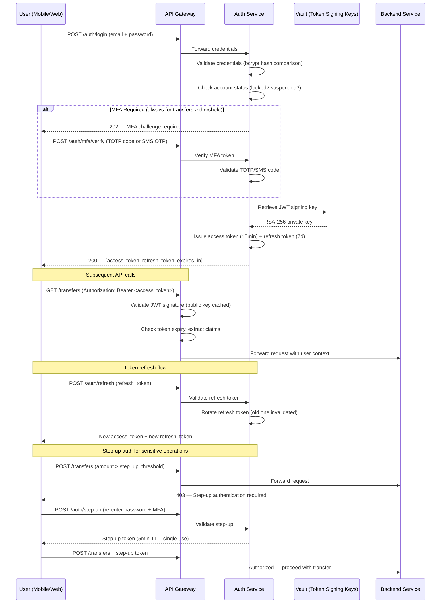
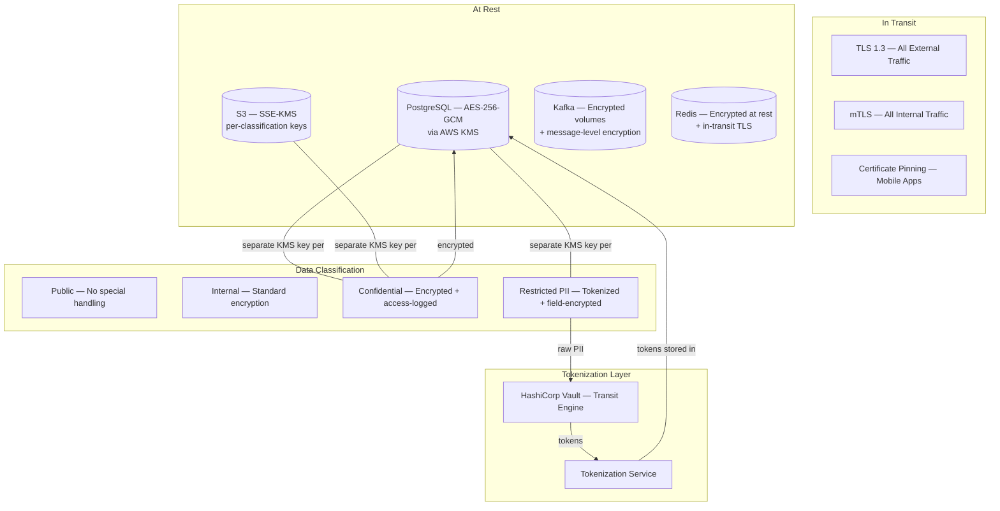

# Security — Digital Remittance Platform

## Overview

A digital remittance platform handles sensitive financial data, personally identifiable information, and cross-border money movement. Security is not a bolt-on — it is embedded at every layer: authentication, data protection, fraud prevention, compliance, and infrastructure. This document covers the security architecture end-to-end.

---

## Authentication & Authorization

### External API Authentication (OAuth 2.0 + JWT)



#### Token Details

| Token | TTL | Storage | Rotation |
|-------|-----|---------|----------|
| Access token (JWT) | 15 minutes | Client memory only (never localStorage) | Issued fresh on refresh |
| Refresh token | 7 days | HttpOnly secure cookie / secure storage | Rotated on every use; old token invalidated |
| Step-up token | 5 minutes | Client memory | Single-use, tied to specific operation |

#### MFA Policy

- **Mandatory**: All transfers above a configurable threshold (default: $500)
- **Mandatory**: Adding new recipients, changing payout method, updating bank details
- **Supported methods**: TOTP (Google Authenticator, Authy), SMS OTP (fallback only)
- **Step-up auth**: Re-authentication required for sensitive operations even within an active session

### Service-to-Service Authentication (mTLS)

- All inter-service communication is authenticated via mutual TLS through the Istio service mesh
- Each service has a unique SPIFFE identity (`spiffe://remittance.internal/service-name`)
- Certificates auto-rotated every 24 hours by Istio Citadel
- No service can communicate with another without a valid mTLS certificate — enforced by Istio authorization policies

### Role-Based Access Control (RBAC)

| Role | Permissions | Access Scope |
|------|-------------|--------------|
| `customer` | Create transfers, view own history, manage recipients, manage profile | Own data only |
| `compliance_analyst` | View transfers for review, approve/reject flagged transfers, access screening results | All transfers in review queue |
| `ops_admin` | View all transfers, trigger retries, manage partner configurations, view dashboards | All operational data |
| `treasury_admin` | Manage liquidity pools, configure FX parameters, view treasury dashboards | Treasury and FX systems |
| `super_admin` | All permissions, user management, system configuration | Full system access |

RBAC is enforced at the API Gateway (coarse-grained) and within each service (fine-grained). Permissions are encoded in JWT claims and validated on every request.

---

## Data Protection

### Encryption Architecture



### Encryption at Rest

| Data Store | Encryption | Key Management |
|------------|-----------|----------------|
| PostgreSQL (all clusters) | AES-256-GCM | AWS KMS — separate CMK per data classification |
| S3 (documents, archives) | SSE-KMS | Per-bucket CMK, auto-rotation every 365 days |
| Kafka (event logs) | Volume encryption + message-level for PII topics | Dedicated CMK for compliance topics |
| Redis (cache) | At-rest encryption enabled | Managed KMS key |
| Elasticsearch (logs) | Encrypted at rest | Dedicated CMK, PII scrubbed before storage |

### Encryption in Transit

- **External**: TLS 1.3 enforced on all API endpoints. TLS 1.2 accepted only for legacy partner connections with documented exceptions.
- **Mobile**: Certificate pinning prevents MITM attacks. Pin list updated via app config, with backup pins for rotation.
- **Internal**: mTLS via Istio service mesh. All inter-service, service-to-database, and service-to-Kafka traffic encrypted.

### PII Tokenization

Sensitive data is tokenized via HashiCorp Vault's Transit secrets engine:

```
Raw PII                          Token (stored in DB)
─────────────────────────────    ─────────────────────────────
"John Smith"                  →  "tok_name_a8f3e2b1c4d5"
"US-SSN-123-45-6789"          →  "tok_ssn_9e7d6c5b4a32"
"GB-SORT-12-34-56 / 12345678" → "tok_bank_f1e2d3c4b5a6"
```

- **Tokenization is one-way by default**: Only services with explicit Vault policies can detokenize
- **Authorized detokenizers**: KYC Service (for identity verification), Compliance Service (for screening), Disbursement Service (for payout execution)
- **All detokenization is audit-logged** in Vault's audit backend

### Field-Level Encryption

Recipient bank details receive an additional layer of encryption beyond database-level:

- Each user has a unique data encryption key (DEK) stored encrypted (wrapped) in Vault
- Recipient bank account numbers, routing numbers, and IBAN are encrypted with the user's DEK before database storage
- Even a full database dump is useless without Vault access to unwrap the DEKs

---

## Fraud Prevention

### Velocity Checks

| Rule | Threshold | Action |
|------|-----------|--------|
| Max transfers per day per user | 5 (configurable per tier) | Block + alert user |
| Max transfers per week per user | 15 | Block + require manual review |
| Cumulative daily amount per user | $10,000 | Block + step-up auth + compliance review |
| Max recipients added per day | 3 | Block + require verification |
| Same-amount same-recipient in 1h | 2 | Block second transfer + alert |

### Device Fingerprinting

- Device fingerprint captured on every session (device model, OS, screen resolution, installed apps hash, IP geolocation)
- Device trust score maintained: known devices = trusted, new devices = elevated scrutiny
- High-value transfer from new device triggers: mandatory MFA + 24h hold + compliance review
- Device binding: Users can register up to 5 trusted devices

### Behavioral Scoring (ML)

- Real-time ML model evaluates every transfer against user's historical pattern
- Features: transfer amount vs historical average, recipient country frequency, time-of-day pattern, funding method consistency
- Risk score (0-100) determines action:
  - 0-30: Proceed normally
  - 31-70: Additional verification (step-up auth)
  - 71-100: Block and route to manual review

### Strong Customer Authentication (SCA)

- **3DS2 for card funding**: All card-funded transfers go through 3D Secure 2.0
- **Exemptions applied** where regulation allows (low-value, trusted beneficiary, recurring)
- **Fallback**: If 3DS2 fails or is unavailable, transaction is declined rather than falling back to insecure path

---

## Compliance & Regulatory

### Sanctions Screening

- **Dual-provider approach**: Every transfer is screened against both ComplyAdvantage and Refinitiv World-Check
- **Screened entities**: Sender, recipient, and recipient's bank/institution
- **Lists covered**: OFAC SDN, UN Consolidated, EU Sanctions, UK HMT, plus country-specific lists per corridor
- **Hit resolution**: Automated clear for exact non-matches. Fuzzy matches (score > threshold) routed to compliance analyst queue.
- **SLA**: Screening must complete within 5 seconds (p99). If either provider times out, transfer is held pending manual screen.

### Transaction Monitoring

Post-transaction rules engine evaluates completed transfers for suspicious patterns:

- Structuring detection (multiple transfers just below reporting thresholds)
- Rapid movement (funds received and sent out within minutes)
- Geographic risk (transfers to/from high-risk jurisdictions)
- Network analysis (shared recipients across seemingly unrelated accounts)

Alerts generated are reviewed by compliance analysts. Suspicious Activity Reports (SARs) filed as required by regulation.

### Audit Trail

- **Immutable event log**: Every state change, every access to PII, every compliance decision is published to Kafka and persisted to an append-only event store
- **Kafka retention**: 30 days in Kafka, then archived to S3
- **S3 archival**: WORM (Write Once Read Many) policy via S3 Object Lock — compliance events cannot be deleted or modified for 7 years
- **Tamper detection**: SHA-256 hash chain on event batches; integrity verified on archival and on any audit retrieval

### Data Retention & GDPR

| Data Category | Retention Period | Legal Basis |
|---------------|-----------------|-------------|
| Financial transaction records | 7 years | BSA/AML, tax reporting |
| KYC documents | 7 years after account closure | BSA/AML |
| Compliance screening results | 7 years | Regulatory requirement |
| User profile data | Account lifetime + 30 days | Contract performance |
| Marketing preferences | Until withdrawal of consent | GDPR consent |

**GDPR Right to Erasure**: Handled via tokenization architecture. When a user requests deletion:
1. PII tokens in Vault are destroyed (irreversible)
2. Tokenized references in the database become permanently unresolvable
3. Financial records are retained (legal obligation) but can no longer be linked to an identifiable person
4. Deletion is logged as a compliance event in the audit trail

---

## Infrastructure Security

### Security Architecture

```mermaid
flowchart TB
    subgraph Internet
        USER[Users — Mobile / Web]
        PARTNER[Partner APIs]
    end

    subgraph Edge
        CDN[CloudFront CDN]
        WAF[AWS WAF]
        DDOS[AWS Shield Advanced]
    end

    subgraph Public Subnet
        ALB[Application Load Balancer]
        AG[API Gateway — Istio Ingress]
    end

    subgraph Private Subnet — Application
        MESH[Istio Service Mesh — mTLS]
        SVC1[Transfer Services]
        SVC2[Compliance Services]
        SVC3[FX / Treasury Services]
    end

    subgraph Private Subnet — Data
        PG[(PostgreSQL — Multi-AZ)]
        KFK[(Kafka Cluster)]
        RDS[(Redis Cluster)]
        ES[(Elasticsearch)]
    end

    subgraph Isolated Subnet — PCI Scope
        PCI[Card Funding Service]
        PCIPG[(PCI PostgreSQL)]
    end

    subgraph Security Services
        VLT[HashiCorp Vault]
        KMS[AWS KMS]
        SEC[AWS Secrets Manager]
        SCAN[Container Image Scanner]
        SIEM[SIEM — Security Event Aggregation]
    end

    USER --> CDN --> WAF --> DDOS --> ALB
    PARTNER --> WAF
    ALB --> AG
    AG --> MESH
    MESH --> SVC1 & SVC2 & SVC3
    SVC1 & SVC2 & SVC3 --> PG & KFK & RDS & ES
    SVC1 -.->|isolated network| PCI
    PCI --> PCIPG
    SVC1 & SVC2 & SVC3 --> VLT
    VLT --> KMS
    MESH --> SIEM
    SCAN -.->|CI pipeline| SVC1 & SVC2 & SVC3
```

### Network Security

- **VPC isolation**: All resources in a dedicated VPC. No public IPs on any application or data resource.
- **Subnet tiers**: Public (load balancers only), Private (application services), Private (data stores), Isolated (PCI-scoped)
- **Security groups**: Least-privilege. Each service can only reach the specific ports/services it needs.
- **WAF rules**: OWASP Top 10 protection, rate limiting (per-IP and per-user), geo-blocking for sanctioned countries, custom rules for API abuse patterns
- **DDoS protection**: AWS Shield Advanced on all public-facing endpoints

### Secrets Management

- **HashiCorp Vault** is the single source of truth for all secrets
- Database credentials: Dynamic secrets via Vault database engine (short-lived, auto-rotated)
- API keys (partner integrations): Stored in Vault KV engine, accessed via service identity
- Encryption keys: Vault Transit engine for application-level encryption, AWS KMS for infrastructure encryption
- **No secrets in environment variables, config files, or container images**
- Vault access is authenticated via Kubernetes service account tokens (Vault K8s auth method)

### Container Security

| Control | Implementation |
|---------|---------------|
| Base images | Distroless (gcr.io/distroless) — no shell, no package manager |
| Filesystem | Read-only root filesystem; writable tmpfs only where needed |
| User | Non-root user enforced via PodSecurityPolicy / PodSecurityStandards |
| Image scanning | Trivy in CI pipeline — blocks deployment on HIGH/CRITICAL CVEs |
| Runtime security | Falco for anomaly detection (unexpected process execution, network connections) |
| Image signing | Cosign signatures verified before deployment via admission controller |
| Registry | Private ECR with image immutability enabled |

### PCI DSS Compliance

Card funding flows are isolated in a PCI-scoped environment:

- **Network isolation**: Separate subnet with dedicated security groups. Only the card funding service can communicate with the payment processor.
- **Dedicated database**: Card data (if stored, which is minimized via tokenization with processor) in a separate PostgreSQL instance within the PCI subnet.
- **Access control**: Only PCI-trained personnel have access to PCI-scoped infrastructure. Access requires MFA + VPN + jump host.
- **Quarterly ASV scans**: Automated quarterly scans by an Approved Scanning Vendor. Results tracked and remediated within SLA.
- **Annual audit**: PCI DSS Level 1 assessment (SAQ-D or ROC depending on volume).
- **Scope minimization**: Card numbers are tokenized at the processor level. The platform stores processor tokens, not raw PANs.

---

## Security Testing & Incident Response

### Security Testing

| Activity | Frequency | Scope |
|----------|-----------|-------|
| SAST (static analysis) | Every PR | All application code |
| DAST (dynamic analysis) | Weekly | All API endpoints |
| Dependency scanning | Daily | All dependencies (Dependabot + Snyk) |
| Penetration testing | Annually + after major changes | Full platform |
| Bug bounty | Continuous | Public-facing surfaces |

### Incident Response

- **Security incidents** are classified by severity (S1-S4) and handled per the incident response plan
- **S1 (data breach, active exploitation)**: Immediate containment, executive notification within 1 hour, regulatory notification within 72 hours (GDPR)
- **Communication**: Dedicated Slack channel per incident, bridge call for S1/S2
- **Post-incident**: Root cause analysis, remediation tracking, lessons learned shared across engineering

---

## Key Design Decisions

1. **Short-lived tokens with rotation**: 15-minute access tokens limit the blast radius of token theft. Refresh token rotation means a stolen refresh token can only be used once before invalidation.

2. **PII tokenization over encryption alone**: Tokenization provides stronger access control than encryption — there is no key to steal. Destroying tokens achieves irreversible anonymization for GDPR compliance while maintaining financial records for regulatory requirements.

3. **Dual sanctions screening providers**: Eliminates single-provider blind spots. If one provider misses a match, the other catches it. Also provides resilience if one provider has an outage.

4. **PCI scope minimization**: By tokenizing card data at the processor level and isolating the card funding flow, the vast majority of the platform is outside PCI scope, dramatically reducing compliance burden and attack surface.

5. **Immutable audit trail with WORM**: Using S3 Object Lock with WORM policy ensures that even administrators cannot tamper with compliance records. This satisfies regulatory requirements and provides strong evidence in case of disputes or audits.
