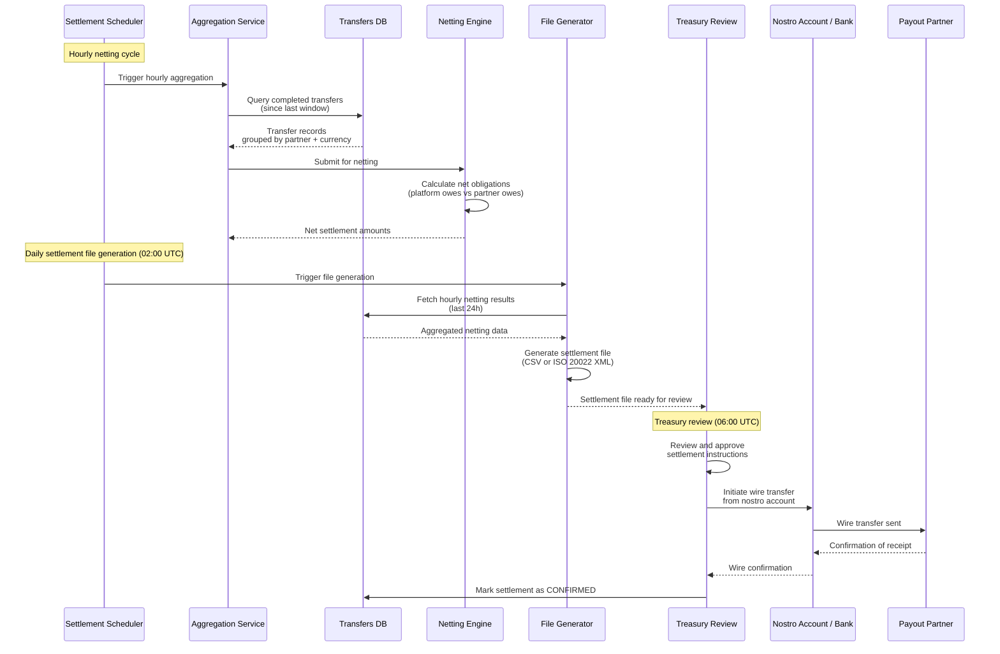
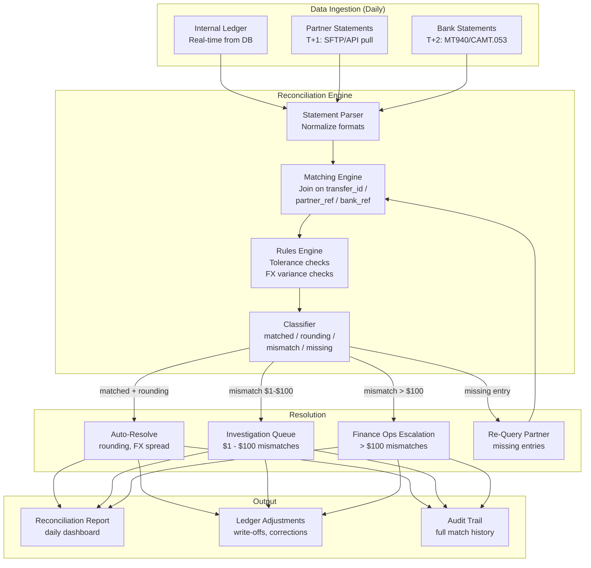
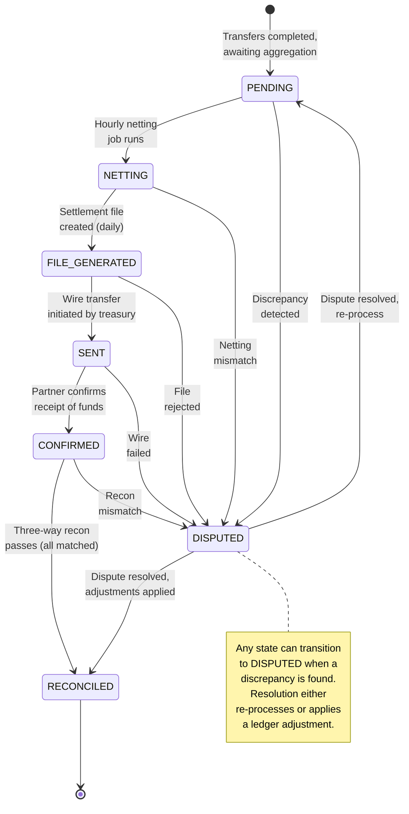

# Settlement & Reconciliation

Settlement and reconciliation ensure that money actually moves between the remittance platform and its payout partners, and that all parties agree on the amounts transferred. This is the financial backbone of the platform -- errors here mean real money lost.

---

## Settlement Process

Settlement converts individual completed transfers into aggregated financial obligations between the platform and each payout partner.

### Batch Cadence

| Operation | Frequency | Timing |
|---|---|---|
| Netting | Hourly | On the hour |
| Settlement file generation | Daily | 02:00 UTC |
| Settlement wire initiation | Daily | 06:00 UTC (after treasury review) |
| Reconciliation (partner) | Daily | T+1 |
| Reconciliation (bank) | Daily | T+2 |

### How Settlement Works

1. **Aggregate**: collect all transfers completed since the last settlement window, grouped by `(partner_id, currency)`
2. **Net**: if bidirectional traffic exists (e.g., the platform both sends to and receives from a partner), calculate the net obligation. For example, if we owe Partner A $100K and they owe us $30K, the net settlement is $70K
3. **Generate settlement instruction**: produce a settlement file (CSV or ISO 20022 XML) specifying the net amount, currency, beneficiary account (partner's account), and reference IDs for all included transfers
4. **Execute**: treasury team reviews and approves; wire transfer is initiated from the appropriate nostro account to the partner
5. **Confirm**: partner confirms receipt; settlement moves to CONFIRMED state

### Settlement Batch Process Flow

---

## Nostro/Vostro Accounts

**Nostro accounts** ("our account at their bank") are held at correspondent banks in each destination currency. They are the source of funds for outbound settlements.

### Account Structure

| Currency | Correspondent Bank | Account Type | Purpose |
|---|---|---|---|
| INR | HDFC Bank, Mumbai | Nostro | Fund India payouts |
| KES | Equity Bank, Nairobi | Nostro | Fund Kenya payouts |
| PHP | BDO, Manila | Nostro | Fund Philippines payouts |
| GBP | Barclays, London | Nostro | Fund UK payouts |
| USD | JP Morgan, New York | Operating | Collection account |

### Balance Management

- Each nostro account is **pre-funded** with working capital based on projected daily volume (calculated from 30-day rolling average with 20% buffer)
- Balance is monitored in **real-time** via bank API feeds or SWIFT MT940 statements
- **Alert thresholds**:
  - Below 2-day runway: WARNING alert to treasury
  - Below 1-day runway: CRITICAL alert, escalate to CFO
  - Below 4-hour runway: EMERGENCY, pause new transfers for this corridor until funded
- **Top-up**: treasury initiates top-up wire from the main operating account when balance drops below 3-day runway

---

## Reconciliation

Reconciliation is a **three-way match** ensuring consistency across three independent records of the same transactions:

| Source | Description | Availability |
|---|---|---|
| **Internal ledger** | Platform's own record of each transfer | Real-time |
| **Partner statement** | Payout partner's report of transactions processed | T+1 (daily file or API) |
| **Bank statement** | Correspondent bank's record of debits/credits | T+2 (MT940/CAMT.053) |

### Matching Logic

1. **Primary key matching**: match by `transfer_id` (internal) to `partner_reference` (partner) to `bank_reference` (bank)
2. **Amount matching**: amounts must match across all three sources
3. **Date matching**: execution dates should align within the expected settlement lag

### Discrepancy Handling

| Discrepancy Type | Tolerance | Action |
|---|---|---|
| Rounding difference | <= $0.01 | Auto-match, log for audit |
| Small FX variance | <= $1.00 | Auto-match if within expected FX spread |
| Amount mismatch > $1 and <= $100 | -- | Flag for automated investigation (check for partial payouts, fees) |
| Amount mismatch > $100 | -- | Escalate to finance ops immediately |
| Missing from partner statement | -- | Re-query partner API; if still missing after 48h, escalate |
| Missing from bank statement | -- | Wait for T+3; if still missing, raise with correspondent bank |
| Extra entry in partner statement | -- | Investigate: possible duplicate payout (critical) |

### Three-Way Reconciliation Architecture

---

## Settlement States

A settlement batch progresses through the following states:

### State Descriptions

| State | Description | Typical Duration |
|---|---|---|
| `PENDING` | Transfers completed, waiting for next netting window | Up to 1 hour |
| `NETTING` | Hourly aggregation and netting in progress | Minutes |
| `FILE_GENERATED` | Settlement instruction file created, awaiting treasury review | Hours (overnight) |
| `SENT` | Wire transfer initiated from nostro account | Hours to 1 business day |
| `CONFIRMED` | Partner has confirmed receipt of settlement funds | -- |
| `RECONCILED` | Three-way reconciliation completed, all entries matched | T+2 to T+3 |
| `DISPUTED` | A discrepancy was found at any stage; under investigation | Variable (hours to weeks) |

---

## Key Design Decisions

1. **Why hourly netting instead of per-transaction settlement?** Per-transaction settlement would mean thousands of individual wire transfers daily, each incurring bank fees. Netting reduces the number of wires to one per partner per currency per day, saving significant costs.

2. **Why three-way reconciliation?** Two-way recon (internal vs partner) misses bank-level issues like failed wires, partial credits, or unauthorized debits. The bank statement is the ultimate source of truth for actual money movement.

3. **Why T+1 and T+2 delays?** Partners and banks don't provide real-time statements. Partner files typically arrive the next business day; bank statements (MT940) arrive the day after that. The reconciliation schedule aligns with data availability.

4. **Why pre-fund nostro accounts?** Payout partners in most corridors require the platform to have funds available before disbursement. Pre-funding ensures transfers aren't blocked by insufficient corridor liquidity.
