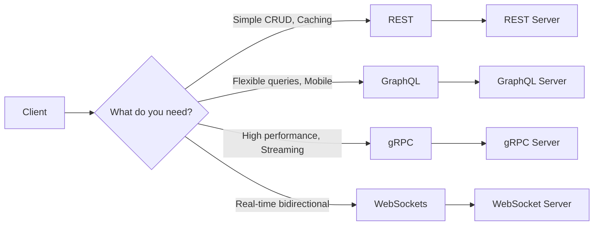
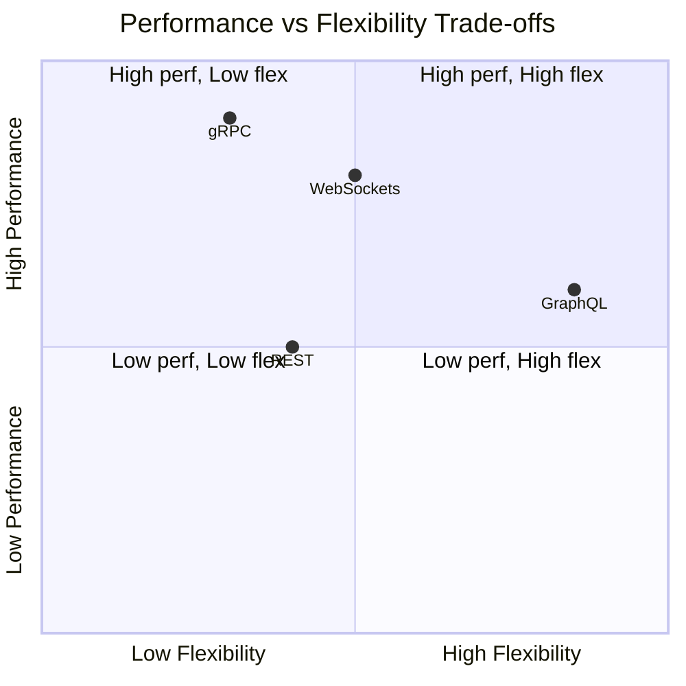
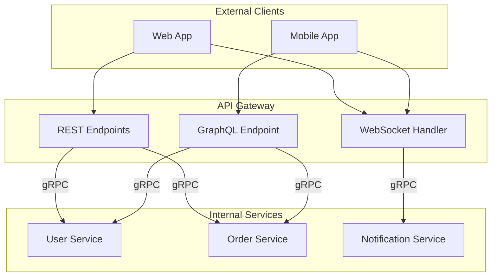

# API Communication Styles

This section covers the fundamental patterns for how services communicate in distributed systems. The choice of communication style significantly impacts performance, developer experience, and system architecture.

## Overview

## Patterns in This Category

| Pattern | Document | Best For |
|---------|----------|----------|
| REST API | [rest-api.md](./rest-api.md) | Public APIs, CRUD operations, web applications |
| GraphQL | [graphql.md](./graphql.md) | Complex data requirements, mobile apps, flexible queries |
| gRPC | [grpc.md](./grpc.md) | Internal microservices, high-performance, streaming |
| WebSockets | [websockets.md](./websockets.md) | Real-time bidirectional communication |

## Comparison Matrix

| Aspect | REST | GraphQL | gRPC | WebSockets |
|--------|------|---------|------|------------|
| **Protocol** | HTTP/1.1, HTTP/2 | HTTP | HTTP/2 | TCP (upgraded from HTTP) |
| **Data Format** | JSON, XML | JSON | Protocol Buffers | Any (typically JSON) |
| **Type Safety** | Optional (OpenAPI) | Built-in schema | Built-in (protobuf) | None by default |
| **Caching** | Excellent (HTTP native) | Complex | Limited | Not applicable |
| **Real-time** | Polling/SSE | Subscriptions | Streaming | Native |
| **Browser Support** | Excellent | Excellent | Limited (grpc-web) | Excellent |
| **Learning Curve** | Low | Medium | Medium-High | Low |
| **Tooling** | Mature | Growing | Mature | Mature |

## Performance Characteristics

## Decision Guide

### Choose REST when:
- Building public-facing APIs
- CRUD operations dominate your use cases
- HTTP caching is important
- You need maximum interoperability
- Team is new to API development

### Choose GraphQL when:
- Clients have diverse data requirements
- Over-fetching/under-fetching is a problem
- Building for mobile with bandwidth constraints
- Rapid frontend iteration is needed
- You have a complex, interconnected data model

### Choose gRPC when:
- Building internal microservices
- Performance is critical
- You need bidirectional streaming
- Strong typing and code generation is valuable
- Polyglot environment (multiple languages)

### Choose WebSockets when:
- Real-time updates are essential
- Bidirectional communication is needed
- Low latency is critical
- Building chat, gaming, or collaborative apps
- Server needs to push data to clients

## Hybrid Approaches

Many production systems combine multiple styles:

**Common Combinations:**
- **REST + WebSockets**: REST for CRUD, WebSockets for real-time updates
- **GraphQL + gRPC**: GraphQL for external, gRPC for internal
- **REST + gRPC**: REST for public API, gRPC between microservices

## Related Patterns

- [API Gateway](../02-api-gateway-patterns/api-gateway.md) - Unified entry point for all API styles
- [Backend for Frontend](../02-api-gateway-patterns/backend-for-frontend.md) - Optimize APIs per client type
- [Circuit Breaker](../03-resilience-patterns/circuit-breaker.md) - Handle communication failures
