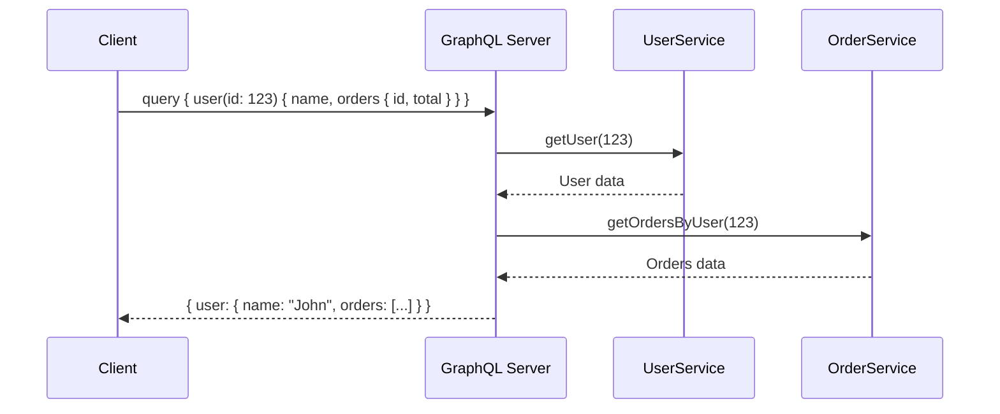
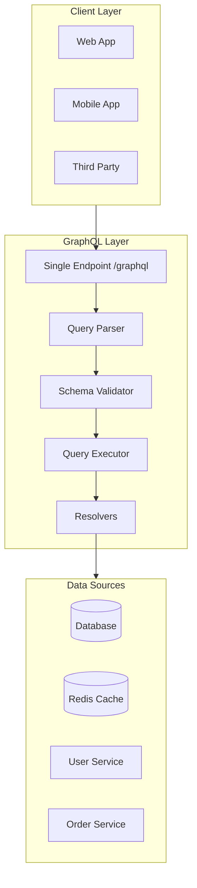
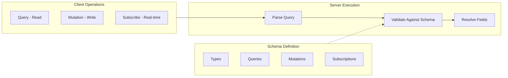

# GraphQL Pattern

## Overview

**GraphQL** is a query language for APIs and a runtime for executing those queries. Developed by Facebook in 2012 and open-sourced in 2015, GraphQL provides a complete and understandable description of the data in your API, gives clients the power to ask for exactly what they need, and makes it easier to evolve APIs over time.

Unlike REST where the server defines the response structure, in GraphQL the client specifies exactly what data it needs through a strongly-typed query.



---

## Why Use It

### Problems It Solves

1. **Over-fetching**: REST returns fixed data structures; GraphQL returns only what's requested
2. **Under-fetching**: Single GraphQL query can replace multiple REST calls
3. **API versioning pain**: Schema evolution without breaking changes
4. **Frontend-backend coupling**: Frontend teams can iterate without backend changes
5. **Documentation drift**: Schema is self-documenting and always current

### Key Benefits

- **Precise data fetching** - Request exactly the fields you need
- **Single endpoint** - All operations through one URL
- **Strong typing** - Schema provides type safety
- **Introspection** - API is self-documenting
- **Real-time support** - Subscriptions for live updates
- **Tooling** - GraphiQL, Apollo DevTools, code generation

---

## When to Use

### Ideal Scenarios

- **Mobile applications**: Minimize bandwidth with precise queries
- **Complex UIs**: Dashboard-style interfaces with diverse data needs
- **Microservices aggregation**: Single API over multiple services
- **Rapid frontend development**: Teams can iterate independently
- **Multi-platform clients**: Web, mobile, IoT with different data needs

### Use Case Examples

| Use Case | Why GraphQL Works Well |
|----------|------------------------|
| Social media feeds | Complex nested data (posts → comments → users) |
| E-commerce product pages | Related data (product → reviews → seller → shipping) |
| Admin dashboards | Flexible queries for different views |
| Mobile apps | Bandwidth optimization, reduce round trips |
| API gateway | Aggregate multiple backend services |

---

## When NOT to Use

### Avoid GraphQL When

| Scenario | Better Alternative |
|----------|-------------------|
| Simple CRUD operations | REST (simpler) |
| File uploads | REST with multipart |
| Public APIs for third parties | REST (more familiar) |
| Heavy caching requirements | REST (HTTP caching) |
| Real-time streaming | WebSockets, gRPC |

### Anti-Patterns

- **N+1 Query Problem**: Naive resolvers causing database explosion
- **Deeply nested queries**: Can create performance issues
- **No query complexity limits**: DoS vulnerability
- **Monolithic schema**: Everything in one schema becomes unmanageable

---

## How It Works

### Architecture



### Core Concepts



### Schema Example

```graphql
# Type definitions
type User {
  id: ID!
  name: String!
  email: String!
  orders: [Order!]!
  createdAt: DateTime!
}

type Order {
  id: ID!
  total: Float!
  status: OrderStatus!
  items: [OrderItem!]!
  user: User!
}

enum OrderStatus {
  PENDING
  PROCESSING
  SHIPPED
  DELIVERED
}

# Queries
type Query {
  user(id: ID!): User
  users(limit: Int, offset: Int): [User!]!
  order(id: ID!): Order
}

# Mutations
type Mutation {
  createUser(input: CreateUserInput!): User!
  updateUser(id: ID!, input: UpdateUserInput!): User!
  deleteUser(id: ID!): Boolean!
}

# Subscriptions
type Subscription {
  orderStatusChanged(orderId: ID!): Order!
}

# Input types
input CreateUserInput {
  name: String!
  email: String!
}
```

---

## Pros and Cons

### Pros

| Advantage | Description |
|-----------|-------------|
| **No over-fetching** | Clients get exactly what they request |
| **No under-fetching** | Single query for complex data needs |
| **Strong typing** | Compile-time validation, better tooling |
| **Self-documenting** | Schema introspection |
| **Versionless** | Add fields without breaking clients |
| **Aggregation** | Combine multiple data sources |
| **Developer experience** | GraphiQL, code generation, type safety |

### Cons

| Disadvantage | Description | Mitigation |
|--------------|-------------|------------|
| **Caching complexity** | No HTTP caching out of the box | Persisted queries, Apollo Cache |
| **N+1 problem** | Naive resolvers cause DB explosion | DataLoader, batch loading |
| **Query complexity** | Deeply nested queries are expensive | Depth limiting, cost analysis |
| **Learning curve** | New paradigm for teams | Training, gradual adoption |
| **File uploads** | Not natively supported | Multipart spec, presigned URLs |
| **Error handling** | Always returns 200 OK | Custom error extensions |

---

## Implementation Example

### Python (Strawberry)

```python
import strawberry
from strawberry.fastapi import GraphQLRouter
from fastapi import FastAPI
from typing import Optional
from datetime import datetime
from dataclasses import dataclass
from enum import Enum

# Enums
@strawberry.enum
class OrderStatus(Enum):
    PENDING = "PENDING"
    PROCESSING = "PROCESSING"
    SHIPPED = "SHIPPED"
    DELIVERED = "DELIVERED"

# Types
@strawberry.type
class User:
    id: strawberry.ID
    name: str
    email: str
    created_at: datetime

    @strawberry.field
    def orders(self) -> list["Order"]:
        # In production, use DataLoader to avoid N+1
        return [o for o in orders_db.values() if o.user_id == self.id]

@strawberry.type
class Order:
    id: strawberry.ID
    total: float
    status: OrderStatus
    user_id: strawberry.ID

    @strawberry.field
    def user(self) -> Optional[User]:
        return users_db.get(self.user_id)

# Inputs
@strawberry.input
class CreateUserInput:
    name: str
    email: str

@strawberry.input
class UpdateUserInput:
    name: Optional[str] = None
    email: Optional[str] = None

# In-memory storage
users_db: dict[str, User] = {}
orders_db: dict[str, Order] = {}
user_counter = 1

# Query resolver
@strawberry.type
class Query:
    @strawberry.field
    def user(self, id: strawberry.ID) -> Optional[User]:
        return users_db.get(id)

    @strawberry.field
    def users(self, limit: int = 10, offset: int = 0) -> list[User]:
        all_users = list(users_db.values())
        return all_users[offset:offset + limit]

    @strawberry.field
    def order(self, id: strawberry.ID) -> Optional[Order]:
        return orders_db.get(id)

# Mutation resolver
@strawberry.type
class Mutation:
    @strawberry.mutation
    def create_user(self, input: CreateUserInput) -> User:
        global user_counter
        user_id = str(user_counter)
        user = User(
            id=strawberry.ID(user_id),
            name=input.name,
            email=input.email,
            created_at=datetime.utcnow()
        )
        users_db[user_id] = user
        user_counter += 1
        return user

    @strawberry.mutation
    def update_user(self, id: strawberry.ID, input: UpdateUserInput) -> Optional[User]:
        if id not in users_db:
            return None

        user = users_db[id]
        if input.name:
            user.name = input.name
        if input.email:
            user.email = input.email
        return user

    @strawberry.mutation
    def delete_user(self, id: strawberry.ID) -> bool:
        if id in users_db:
            del users_db[id]
            return True
        return False

# Schema
schema = strawberry.Schema(query=Query, mutation=Mutation)

# FastAPI integration
app = FastAPI()
graphql_app = GraphQLRouter(schema)
app.include_router(graphql_app, prefix="/graphql")
```

### Node.js (Apollo Server)

```typescript
import { ApolloServer } from '@apollo/server';
import { startStandaloneServer } from '@apollo/server/standalone';
import DataLoader from 'dataloader';

// Type definitions
const typeDefs = `#graphql
  type User {
    id: ID!
    name: String!
    email: String!
    orders: [Order!]!
    createdAt: String!
  }

  type Order {
    id: ID!
    total: Float!
    status: OrderStatus!
    user: User!
  }

  enum OrderStatus {
    PENDING
    PROCESSING
    SHIPPED
    DELIVERED
  }

  type Query {
    user(id: ID!): User
    users(limit: Int, offset: Int): [User!]!
  }

  input CreateUserInput {
    name: String!
    email: String!
  }

  type Mutation {
    createUser(input: CreateUserInput!): User!
    deleteUser(id: ID!): Boolean!
  }
`;

// In-memory data
interface User {
  id: string;
  name: string;
  email: string;
  createdAt: string;
}

interface Order {
  id: string;
  total: number;
  status: string;
  userId: string;
}

const users: Map<string, User> = new Map();
const orders: Map<string, Order> = new Map();
let userIdCounter = 1;

// DataLoader for batching (prevents N+1)
const createOrderLoader = () => new DataLoader<string, Order[]>(async (userIds) => {
  const allOrders = Array.from(orders.values());
  return userIds.map(userId =>
    allOrders.filter(order => order.userId === userId)
  );
});

// Resolvers
const resolvers = {
  Query: {
    user: (_: any, { id }: { id: string }) => users.get(id),
    users: (_: any, { limit = 10, offset = 0 }: { limit?: number; offset?: number }) => {
      return Array.from(users.values()).slice(offset, offset + limit);
    },
  },

  Mutation: {
    createUser: (_: any, { input }: { input: { name: string; email: string } }) => {
      const id = String(userIdCounter++);
      const user: User = {
        id,
        name: input.name,
        email: input.email,
        createdAt: new Date().toISOString(),
      };
      users.set(id, user);
      return user;
    },
    deleteUser: (_: any, { id }: { id: string }) => {
      return users.delete(id);
    },
  },

  User: {
    orders: (user: User, _: any, { orderLoader }: { orderLoader: DataLoader<string, Order[]> }) => {
      return orderLoader.load(user.id);
    },
  },

  Order: {
    user: (order: Order) => users.get(order.userId),
  },
};

// Server setup
const server = new ApolloServer({
  typeDefs,
  resolvers,
});

const startServer = async () => {
  const { url } = await startStandaloneServer(server, {
    listen: { port: 4000 },
    context: async () => ({
      orderLoader: createOrderLoader(),
    }),
  });
  console.log(`🚀 Server ready at ${url}`);
};

startServer();
```

### Example Queries

```graphql
# Query: Get user with orders
query GetUserWithOrders {
  user(id: "1") {
    name
    email
    orders {
      id
      total
      status
    }
  }
}

# Mutation: Create user
mutation CreateUser {
  createUser(input: { name: "John Doe", email: "john@example.com" }) {
    id
    name
    createdAt
  }
}

# Query with variables
query GetUsers($limit: Int!, $offset: Int!) {
  users(limit: $limit, offset: $offset) {
    id
    name
  }
}
```

---

## Real-World Examples

| Company | Use Case | Notable Implementation |
|---------|----------|----------------------|
| **Facebook** | News Feed, Messenger | Invented GraphQL, massive scale |
| **GitHub** | GitHub API v4 | Public GraphQL API |
| **Shopify** | Storefront API | E-commerce at scale |
| **Netflix** | Studio applications | Federated GraphQL |
| **Airbnb** | Internal tools | Gradual REST → GraphQL migration |
| **Twitter** | TweetDeck | Client-specific queries |

### Architecture Patterns

1. **GitHub**: Single monolithic schema for public API
2. **Netflix**: Apollo Federation for distributed ownership
3. **Shopify**: GraphQL for external, REST for internal

---

## Related Patterns

- [REST API](./rest-api.md) - Simpler alternative for basic CRUD
- [Backend for Frontend](../02-api-gateway-patterns/backend-for-frontend.md) - GraphQL as BFF layer
- [API Gateway](../02-api-gateway-patterns/api-gateway.md) - GraphQL behind gateway
- [CQRS](../04-data-patterns/cqrs.md) - Separate read/write with GraphQL queries/mutations

---

## Further Reading

- [GraphQL Specification](https://spec.graphql.org/)
- [Apollo Federation](https://www.apollographql.com/docs/federation/)
- [GraphQL Best Practices](https://graphql.org/learn/best-practices/)
- [Principled GraphQL](https://principledgraphql.com/)
