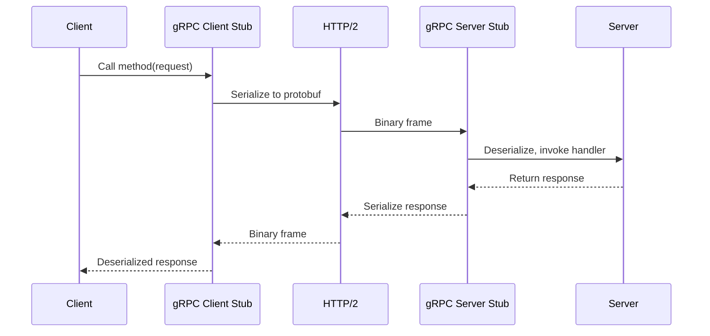
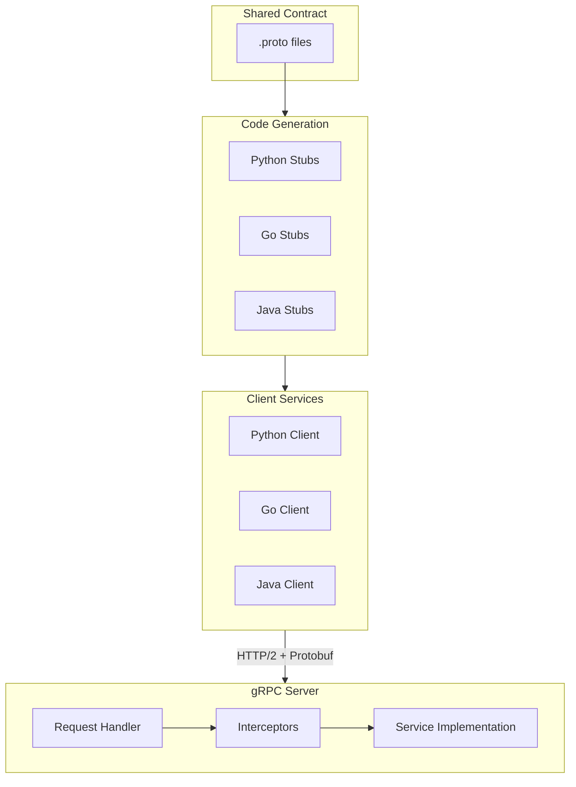
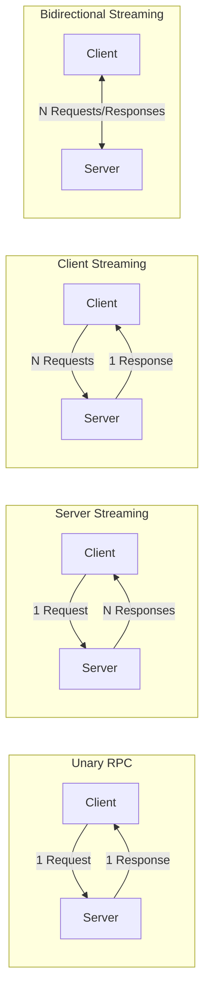

# gRPC Pattern

## Overview

**gRPC (gRPC Remote Procedure Calls)** is a high-performance, open-source RPC framework developed by Google. It uses HTTP/2 for transport, Protocol Buffers (protobuf) as the interface definition language and serialization format, and provides features like authentication, load balancing, and bidirectional streaming.

gRPC is designed for efficient communication between services, especially in microservices architectures where low latency and high throughput are critical.



---

## Why Use It

### Problems It Solves

1. **Performance overhead**: JSON/REST has parsing overhead; protobuf is 3-10x faster
2. **Contract enforcement**: Loose REST contracts lead to integration issues
3. **Streaming limitations**: REST doesn't natively support streaming
4. **Code generation**: Manual client libraries are error-prone
5. **Cross-language communication**: Different serialization in different languages

### Key Benefits

- **High performance** - Binary serialization, HTTP/2 multiplexing
- **Strong typing** - Protobuf enforces schema at compile time
- **Code generation** - Auto-generate clients in 10+ languages
- **Streaming** - Unary, server, client, and bidirectional streaming
- **Deadlines** - Built-in timeout propagation
- **Interoperability** - Same interface across languages

---

## When to Use

### Ideal Scenarios

- **Microservices communication**: High-performance internal APIs
- **Polyglot environments**: Services in different languages
- **Real-time streaming**: Video, audio, telemetry data
- **Low-latency requirements**: Financial systems, gaming
- **Mobile to backend**: Efficient binary protocol saves bandwidth

### Use Case Examples

| Use Case | Why gRPC Works Well |
|----------|---------------------|
| Inter-microservice calls | Low latency, strong contracts |
| Real-time data pipelines | Streaming support |
| IoT telemetry | Efficient binary format |
| Gaming backends | Bidirectional streaming |
| Financial trading | Microsecond latency |
| Mobile backends | Bandwidth efficiency |

---

## When NOT to Use

### Avoid gRPC When

| Scenario | Better Alternative |
|----------|-------------------|
| Public APIs | REST (better browser support) |
| Web browser clients | REST, GraphQL (grpc-web has limitations) |
| Simple CRUD | REST (simpler tooling) |
| Human debugging needed | REST (readable JSON) |
| Firewall restrictions | REST (standard HTTP) |

### Anti-Patterns

- **Exposing directly to browsers**: Use grpc-web or gateway translation
- **Overly large messages**: Protobuf has message size limits (default 4MB)
- **Ignoring deadlines**: Leads to resource exhaustion
- **Not using streaming when appropriate**: Missing optimization opportunities

---

## How It Works

### Architecture



### Communication Patterns



### Protocol Buffer Example

```protobuf
// user_service.proto
syntax = "proto3";

package user;

option go_package = "github.com/example/user";

// Service definition
service UserService {
  // Unary RPC
  rpc GetUser(GetUserRequest) returns (User);

  // Server streaming
  rpc ListUsers(ListUsersRequest) returns (stream User);

  // Client streaming
  rpc CreateUsers(stream CreateUserRequest) returns (CreateUsersResponse);

  // Bidirectional streaming
  rpc Chat(stream ChatMessage) returns (stream ChatMessage);
}

// Messages
message User {
  int64 id = 1;
  string name = 2;
  string email = 3;
  UserStatus status = 4;
  google.protobuf.Timestamp created_at = 5;
}

message GetUserRequest {
  int64 id = 1;
}

message ListUsersRequest {
  int32 page_size = 1;
  string page_token = 2;
}

message CreateUserRequest {
  string name = 1;
  string email = 2;
}

message CreateUsersResponse {
  int32 created_count = 1;
  repeated int64 user_ids = 2;
}

message ChatMessage {
  string sender_id = 1;
  string content = 2;
  google.protobuf.Timestamp timestamp = 3;
}

enum UserStatus {
  USER_STATUS_UNSPECIFIED = 0;
  USER_STATUS_ACTIVE = 1;
  USER_STATUS_INACTIVE = 2;
  USER_STATUS_SUSPENDED = 3;
}
```

---

## Pros and Cons

### Pros

| Advantage | Description |
|-----------|-------------|
| **Performance** | 3-10x faster than JSON/REST |
| **Type safety** | Compile-time schema validation |
| **Code generation** | Consistent clients across languages |
| **Streaming** | All four streaming patterns supported |
| **HTTP/2** | Multiplexing, header compression |
| **Deadlines** | Built-in timeout propagation |
| **Backward compatibility** | Protobuf field numbering |

### Cons

| Disadvantage | Description | Mitigation |
|--------------|-------------|------------|
| **Browser support** | Not native, needs grpc-web | Use REST/GraphQL gateway for web |
| **Human readability** | Binary format not debuggable | Use grpcurl, Bloom RPC |
| **Learning curve** | Protobuf syntax, streaming concepts | Gradual adoption, training |
| **Load balancer support** | L7 aware LB required | Use Envoy, service mesh |
| **Debugging** | Hard to inspect payloads | Logging interceptors |

---

## Implementation Example

### Protocol Buffer Definition

```protobuf
// proto/user.proto
syntax = "proto3";

package user.v1;

option go_package = "example.com/user/v1";

import "google/protobuf/timestamp.proto";
import "google/protobuf/empty.proto";

service UserService {
  rpc GetUser(GetUserRequest) returns (User);
  rpc CreateUser(CreateUserRequest) returns (User);
  rpc UpdateUser(UpdateUserRequest) returns (User);
  rpc DeleteUser(DeleteUserRequest) returns (google.protobuf.Empty);
  rpc ListUsers(ListUsersRequest) returns (stream User);
}

message User {
  int64 id = 1;
  string name = 2;
  string email = 3;
  google.protobuf.Timestamp created_at = 4;
}

message GetUserRequest {
  int64 id = 1;
}

message CreateUserRequest {
  string name = 1;
  string email = 2;
}

message UpdateUserRequest {
  int64 id = 1;
  optional string name = 2;
  optional string email = 3;
}

message DeleteUserRequest {
  int64 id = 1;
}

message ListUsersRequest {
  int32 limit = 1;
  int32 offset = 2;
}
```

### Go Server Implementation

```go
package main

import (
    "context"
    "log"
    "net"
    "sync"
    "time"

    "google.golang.org/grpc"
    "google.golang.org/grpc/codes"
    "google.golang.org/grpc/status"
    "google.golang.org/protobuf/types/known/emptypb"
    "google.golang.org/protobuf/types/known/timestamppb"

    pb "example.com/user/v1"
)

type userServer struct {
    pb.UnimplementedUserServiceServer
    mu        sync.RWMutex
    users     map[int64]*pb.User
    idCounter int64
}

func NewUserServer() *userServer {
    return &userServer{
        users:     make(map[int64]*pb.User),
        idCounter: 1,
    }
}

func (s *userServer) GetUser(ctx context.Context, req *pb.GetUserRequest) (*pb.User, error) {
    s.mu.RLock()
    defer s.mu.RUnlock()

    user, ok := s.users[req.Id]
    if !ok {
        return nil, status.Errorf(codes.NotFound, "user %d not found", req.Id)
    }
    return user, nil
}

func (s *userServer) CreateUser(ctx context.Context, req *pb.CreateUserRequest) (*pb.User, error) {
    s.mu.Lock()
    defer s.mu.Unlock()

    user := &pb.User{
        Id:        s.idCounter,
        Name:      req.Name,
        Email:     req.Email,
        CreatedAt: timestamppb.New(time.Now()),
    }
    s.users[s.idCounter] = user
    s.idCounter++

    return user, nil
}

func (s *userServer) UpdateUser(ctx context.Context, req *pb.UpdateUserRequest) (*pb.User, error) {
    s.mu.Lock()
    defer s.mu.Unlock()

    user, ok := s.users[req.Id]
    if !ok {
        return nil, status.Errorf(codes.NotFound, "user %d not found", req.Id)
    }

    if req.Name != nil {
        user.Name = *req.Name
    }
    if req.Email != nil {
        user.Email = *req.Email
    }

    return user, nil
}

func (s *userServer) DeleteUser(ctx context.Context, req *pb.DeleteUserRequest) (*emptypb.Empty, error) {
    s.mu.Lock()
    defer s.mu.Unlock()

    if _, ok := s.users[req.Id]; !ok {
        return nil, status.Errorf(codes.NotFound, "user %d not found", req.Id)
    }

    delete(s.users, req.Id)
    return &emptypb.Empty{}, nil
}

// Server streaming example
func (s *userServer) ListUsers(req *pb.ListUsersRequest, stream pb.UserService_ListUsersServer) error {
    s.mu.RLock()
    defer s.mu.RUnlock()

    count := 0
    for _, user := range s.users {
        if count >= int(req.Offset) && count < int(req.Offset+req.Limit) {
            if err := stream.Send(user); err != nil {
                return err
            }
        }
        count++
    }
    return nil
}

func main() {
    lis, err := net.Listen("tcp", ":50051")
    if err != nil {
        log.Fatalf("failed to listen: %v", err)
    }

    // Create server with interceptors
    s := grpc.NewServer(
        grpc.UnaryInterceptor(loggingInterceptor),
    )
    pb.RegisterUserServiceServer(s, NewUserServer())

    log.Println("gRPC server listening on :50051")
    if err := s.Serve(lis); err != nil {
        log.Fatalf("failed to serve: %v", err)
    }
}

// Logging interceptor
func loggingInterceptor(
    ctx context.Context,
    req interface{},
    info *grpc.UnaryServerInfo,
    handler grpc.UnaryHandler,
) (interface{}, error) {
    start := time.Now()
    resp, err := handler(ctx, req)
    log.Printf("method=%s duration=%v err=%v", info.FullMethod, time.Since(start), err)
    return resp, err
}
```

### Python Client Implementation

```python
import grpc
from concurrent import futures
import user_pb2
import user_pb2_grpc

def run_client():
    # Create channel with options
    channel = grpc.insecure_channel(
        'localhost:50051',
        options=[
            ('grpc.max_receive_message_length', 4 * 1024 * 1024),
            ('grpc.keepalive_time_ms', 30000),
        ]
    )

    # Create stub
    stub = user_pb2_grpc.UserServiceStub(channel)

    # Unary call
    try:
        response = stub.GetUser(
            user_pb2.GetUserRequest(id=1),
            timeout=5.0  # Deadline
        )
        print(f"User: {response.name}, {response.email}")
    except grpc.RpcError as e:
        print(f"RPC failed: {e.code()}: {e.details()}")

    # Create user
    user = stub.CreateUser(
        user_pb2.CreateUserRequest(
            name="John Doe",
            email="john@example.com"
        )
    )
    print(f"Created user: {user.id}")

    # Server streaming
    print("Listing users:")
    for user in stub.ListUsers(user_pb2.ListUsersRequest(limit=10, offset=0)):
        print(f"  - {user.name}")

if __name__ == '__main__':
    run_client()
```

---

## Real-World Examples

| Company | Use Case | Scale |
|---------|----------|-------|
| **Google** | Internal services | Billions of RPCs/second |
| **Netflix** | Inter-service communication | Replaced REST for internal |
| **Uber** | Real-time location | Low-latency streaming |
| **Slack** | Backend services | Migrated from REST |
| **Square** | Payment processing | High-throughput transactions |
| **Dropbox** | File sync | Bidirectional streaming |

### Production Patterns

1. **Google**: gRPC for all internal services, REST only at edge
2. **Netflix**: gRPC with custom load balancing
3. **Uber**: gRPC for real-time services, REST for public API

---

## Related Patterns

- [REST API](./rest-api.md) - Simpler alternative for public APIs
- [Service Mesh](../06-service-discovery-mesh/service-mesh.md) - gRPC-native load balancing
- [Circuit Breaker](../03-resilience-patterns/circuit-breaker.md) - Handle gRPC failures
- [API Gateway](../02-api-gateway-patterns/api-gateway.md) - Translate REST to gRPC

---

## Further Reading

- [gRPC Official Documentation](https://grpc.io/docs/)
- [Protocol Buffers Guide](https://protobuf.dev/programming-guides/proto3/)
- [gRPC Performance Best Practices](https://grpc.io/docs/guides/performance/)
- [Google API Design Guide](https://cloud.google.com/apis/design)
