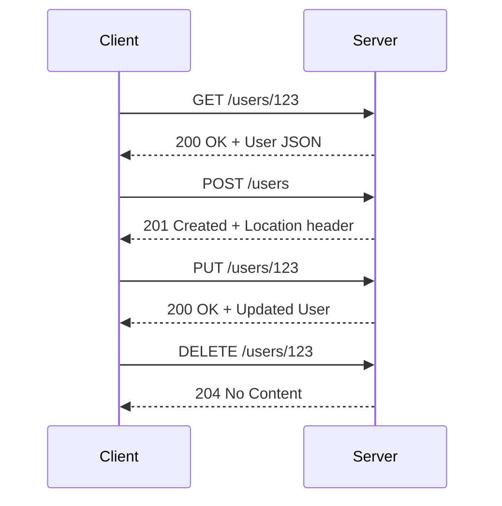

# REST API Pattern

## Overview

**REST (Representational State Transfer)** is an architectural style for designing networked applications. It uses HTTP methods and status codes to perform CRUD operations on resources, treating everything as a resource that can be accessed via a unique URI.

REST was introduced by Roy Fielding in his 2000 doctoral dissertation and has become the de facto standard for web APIs due to its simplicity and alignment with HTTP.



---

## Why Use It

### Problems It Solves

1. **Interoperability**: Works with any programming language or platform that supports HTTP
2. **Simplicity**: Leverages well-understood HTTP semantics
3. **Scalability**: Stateless nature allows horizontal scaling
4. **Caching**: Native HTTP caching reduces server load and improves performance
5. **Discoverability**: Resources can link to related resources (HATEOAS)

### Key Benefits

- **Universal client support** - Every platform has HTTP libraries
- **Mature tooling** - OpenAPI/Swagger, Postman, curl
- **CDN-friendly** - Static resources cache efficiently
- **Debuggable** - Human-readable JSON/XML payloads
- **Firewall-friendly** - Uses standard HTTP ports (80/443)

---

## When to Use

### Ideal Scenarios

- **Public APIs**: Third-party developers expect REST
- **CRUD-dominant applications**: Natural mapping to HTTP methods
- **Web applications**: Browser-native support
- **Content delivery**: Cacheable resources (images, documents)
- **Simple integrations**: Minimal setup required

### Use Case Examples

| Use Case | Why REST Works Well |
|----------|---------------------|
| E-commerce catalog API | CRUD operations, HTTP caching for product data |
| User management | Standard resource operations |
| Content management systems | Document-oriented, cacheable |
| Payment gateways | Wide client support, well-understood security patterns |
| Mobile backends | JSON parsing is lightweight |

---

## When NOT to Use

### Avoid REST When

| Scenario | Better Alternative |
|----------|-------------------|
| Real-time updates needed | WebSockets, SSE |
| Complex nested data queries | GraphQL |
| High-performance internal services | gRPC |
| Bidirectional streaming | gRPC, WebSockets |
| Bandwidth-constrained clients | gRPC (binary), GraphQL (precise fetching) |

### Anti-Patterns

- **Over-fetching**: Returning more data than needed
- **Under-fetching**: Requiring multiple calls for related data
- **Chatty APIs**: Many small requests instead of batch operations
- **RPC-style endpoints**: Using POST for everything (e.g., `/doAction`)

---

## How It Works

### Architecture

```mermaid
flowchart TB
    subgraph Client[Client Applications]
        Web[Web Browser]
        Mobile[Mobile App]
        CLI[CLI Tool]
    end

    subgraph REST[REST API Layer]
        Router[URL Router]
        Auth[Authentication]
        Validation[Request Validation]
        Controller[Controllers]
    end

    subgraph Resources[Resource Layer]
        Users[/users]
        Orders[/orders]
        Products[/products]
    end

    subgraph Data[Data Layer]
        DB[(Database)]
        Cache[(Cache)]
    end

    Client --> Router
    Router --> Auth
    Auth --> Validation
    Validation --> Controller
    Controller --> Resources
    Resources --> Cache
    Resources --> DB
```

### REST Constraints

1. **Client-Server**: Separation of concerns
2. **Stateless**: Each request contains all needed information
3. **Cacheable**: Responses must define cacheability
4. **Uniform Interface**: Consistent resource identification
5. **Layered System**: Client can't tell if connected directly to server
6. **Code on Demand** (optional): Server can extend client functionality

### HTTP Methods Mapping

| HTTP Method | CRUD Operation | Idempotent | Safe |
|-------------|---------------|------------|------|
| GET | Read | Yes | Yes |
| POST | Create | No | No |
| PUT | Update (full) | Yes | No |
| PATCH | Update (partial) | No | No |
| DELETE | Delete | Yes | No |

### HTTP Status Codes

```
2xx Success
├── 200 OK - Request succeeded
├── 201 Created - Resource created
├── 204 No Content - Success with no body

4xx Client Error
├── 400 Bad Request - Invalid syntax
├── 401 Unauthorized - Authentication required
├── 403 Forbidden - No permission
├── 404 Not Found - Resource doesn't exist
├── 409 Conflict - State conflict
├── 422 Unprocessable Entity - Validation failed
├── 429 Too Many Requests - Rate limited

5xx Server Error
├── 500 Internal Server Error - Generic error
├── 502 Bad Gateway - Upstream error
├── 503 Service Unavailable - Temporarily down
├── 504 Gateway Timeout - Upstream timeout
```

---

## Pros and Cons

### Pros

| Advantage | Description |
|-----------|-------------|
| **Simplicity** | Easy to understand and implement |
| **Ubiquity** | Supported everywhere |
| **Caching** | Native HTTP caching mechanisms |
| **Scalability** | Stateless design enables horizontal scaling |
| **Tooling** | Rich ecosystem of tools and documentation |
| **Security** | Well-established patterns (OAuth, JWT) |
| **Debugging** | Human-readable payloads |

### Cons

| Disadvantage | Description | Mitigation |
|--------------|-------------|------------|
| **Over-fetching** | Returns more data than needed | Use sparse fieldsets, GraphQL for complex cases |
| **Under-fetching** | Multiple requests for related data | Compound documents, includes |
| **No real-time** | Request-response only | Combine with WebSockets/SSE |
| **Versioning complexity** | Breaking changes are painful | URL versioning, header versioning |
| **N+1 problem** | Nested resources require multiple calls | Eager loading, pagination |

---

## Implementation Example

### Python (FastAPI)

```python
from fastapi import FastAPI, HTTPException, status
from pydantic import BaseModel
from typing import Optional
from datetime import datetime

app = FastAPI()

# Models
class UserCreate(BaseModel):
    name: str
    email: str

class User(BaseModel):
    id: int
    name: str
    email: str
    created_at: datetime

class UserUpdate(BaseModel):
    name: Optional[str] = None
    email: Optional[str] = None

# In-memory store (use database in production)
users_db: dict[int, User] = {}
user_id_counter = 1

# REST Endpoints
@app.get("/users", response_model=list[User])
def list_users(skip: int = 0, limit: int = 10):
    """GET /users - List all users with pagination"""
    users = list(users_db.values())
    return users[skip:skip + limit]

@app.get("/users/{user_id}", response_model=User)
def get_user(user_id: int):
    """GET /users/{id} - Get a specific user"""
    if user_id not in users_db:
        raise HTTPException(
            status_code=status.HTTP_404_NOT_FOUND,
            detail="User not found"
        )
    return users_db[user_id]

@app.post("/users", response_model=User, status_code=status.HTTP_201_CREATED)
def create_user(user: UserCreate):
    """POST /users - Create a new user"""
    global user_id_counter

    new_user = User(
        id=user_id_counter,
        name=user.name,
        email=user.email,
        created_at=datetime.utcnow()
    )
    users_db[user_id_counter] = new_user
    user_id_counter += 1

    return new_user

@app.put("/users/{user_id}", response_model=User)
def update_user(user_id: int, user: UserCreate):
    """PUT /users/{id} - Full update of a user"""
    if user_id not in users_db:
        raise HTTPException(
            status_code=status.HTTP_404_NOT_FOUND,
            detail="User not found"
        )

    existing = users_db[user_id]
    updated_user = User(
        id=user_id,
        name=user.name,
        email=user.email,
        created_at=existing.created_at
    )
    users_db[user_id] = updated_user
    return updated_user

@app.patch("/users/{user_id}", response_model=User)
def partial_update_user(user_id: int, user: UserUpdate):
    """PATCH /users/{id} - Partial update of a user"""
    if user_id not in users_db:
        raise HTTPException(
            status_code=status.HTTP_404_NOT_FOUND,
            detail="User not found"
        )

    existing = users_db[user_id]
    update_data = user.model_dump(exclude_unset=True)

    updated_user = User(
        id=existing.id,
        name=update_data.get("name", existing.name),
        email=update_data.get("email", existing.email),
        created_at=existing.created_at
    )
    users_db[user_id] = updated_user
    return updated_user

@app.delete("/users/{user_id}", status_code=status.HTTP_204_NO_CONTENT)
def delete_user(user_id: int):
    """DELETE /users/{id} - Delete a user"""
    if user_id not in users_db:
        raise HTTPException(
            status_code=status.HTTP_404_NOT_FOUND,
            detail="User not found"
        )
    del users_db[user_id]
```

### Go (Gin)

```go
package main

import (
    "net/http"
    "strconv"
    "time"

    "github.com/gin-gonic/gin"
)

type User struct {
    ID        int       `json:"id"`
    Name      string    `json:"name"`
    Email     string    `json:"email"`
    CreatedAt time.Time `json:"created_at"`
}

type UserCreate struct {
    Name  string `json:"name" binding:"required"`
    Email string `json:"email" binding:"required,email"`
}

var (
    usersDB       = make(map[int]User)
    userIDCounter = 1
)

func main() {
    r := gin.Default()

    // REST endpoints
    r.GET("/users", listUsers)
    r.GET("/users/:id", getUser)
    r.POST("/users", createUser)
    r.PUT("/users/:id", updateUser)
    r.DELETE("/users/:id", deleteUser)

    r.Run(":8080")
}

func listUsers(c *gin.Context) {
    users := make([]User, 0, len(usersDB))
    for _, u := range usersDB {
        users = append(users, u)
    }
    c.JSON(http.StatusOK, users)
}

func getUser(c *gin.Context) {
    id, _ := strconv.Atoi(c.Param("id"))
    user, exists := usersDB[id]
    if !exists {
        c.JSON(http.StatusNotFound, gin.H{"error": "User not found"})
        return
    }
    c.JSON(http.StatusOK, user)
}

func createUser(c *gin.Context) {
    var input UserCreate
    if err := c.ShouldBindJSON(&input); err != nil {
        c.JSON(http.StatusBadRequest, gin.H{"error": err.Error()})
        return
    }

    user := User{
        ID:        userIDCounter,
        Name:      input.Name,
        Email:     input.Email,
        CreatedAt: time.Now(),
    }
    usersDB[userIDCounter] = user
    userIDCounter++

    c.JSON(http.StatusCreated, user)
}

func updateUser(c *gin.Context) {
    id, _ := strconv.Atoi(c.Param("id"))
    if _, exists := usersDB[id]; !exists {
        c.JSON(http.StatusNotFound, gin.H{"error": "User not found"})
        return
    }

    var input UserCreate
    if err := c.ShouldBindJSON(&input); err != nil {
        c.JSON(http.StatusBadRequest, gin.H{"error": err.Error()})
        return
    }

    user := usersDB[id]
    user.Name = input.Name
    user.Email = input.Email
    usersDB[id] = user

    c.JSON(http.StatusOK, user)
}

func deleteUser(c *gin.Context) {
    id, _ := strconv.Atoi(c.Param("id"))
    if _, exists := usersDB[id]; !exists {
        c.JSON(http.StatusNotFound, gin.H{"error": "User not found"})
        return
    }
    delete(usersDB, id)
    c.Status(http.StatusNoContent)
}
```

---

## Real-World Examples

| Company | API | Notable Features |
|---------|-----|------------------|
| **Stripe** | Payment API | Excellent documentation, idempotency keys |
| **Twilio** | Communication API | Versioning in URL, consistent error format |
| **GitHub** | Developer API | HATEOAS links, rich pagination |
| **Shopify** | E-commerce API | GraphQL + REST coexistence |
| **Twitter/X** | Social API | Rate limiting, OAuth 2.0 |

### Best Practices from Industry

1. **Stripe**: Uses idempotency keys for POST requests
2. **GitHub**: Implements hypermedia links for discoverability
3. **Twilio**: Consistent error response format with error codes
4. **Google**: Uses field masks for partial responses

---

## Related Patterns

- [GraphQL](./graphql.md) - Alternative when REST over/under-fetches
- [API Gateway](../02-api-gateway-patterns/api-gateway.md) - Centralized REST API management
- [Rate Limiting](../03-resilience-patterns/rate-limiting.md) - Protect REST APIs from abuse
- [Circuit Breaker](../03-resilience-patterns/circuit-breaker.md) - Handle downstream failures

---

## Further Reading

- [Roy Fielding's Dissertation](https://www.ics.uci.edu/~fielding/pubs/dissertation/rest_arch_style.htm)
- [OpenAPI Specification](https://spec.openapis.org/oas/latest.html)
- [JSON:API Specification](https://jsonapi.org/)
- [Richardson Maturity Model](https://martinfowler.com/articles/richardsonMaturityModel.html)
