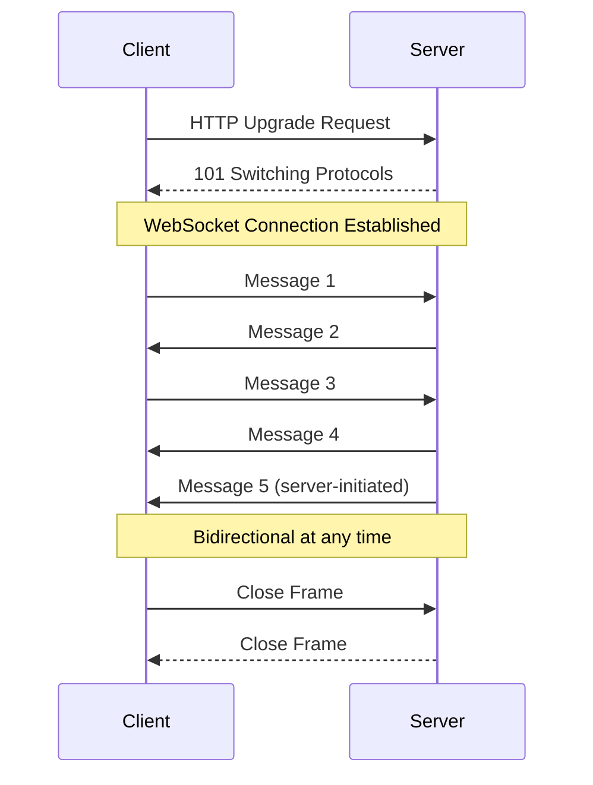
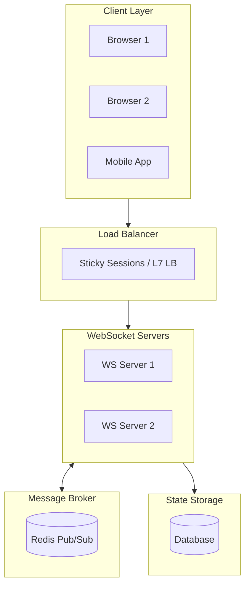
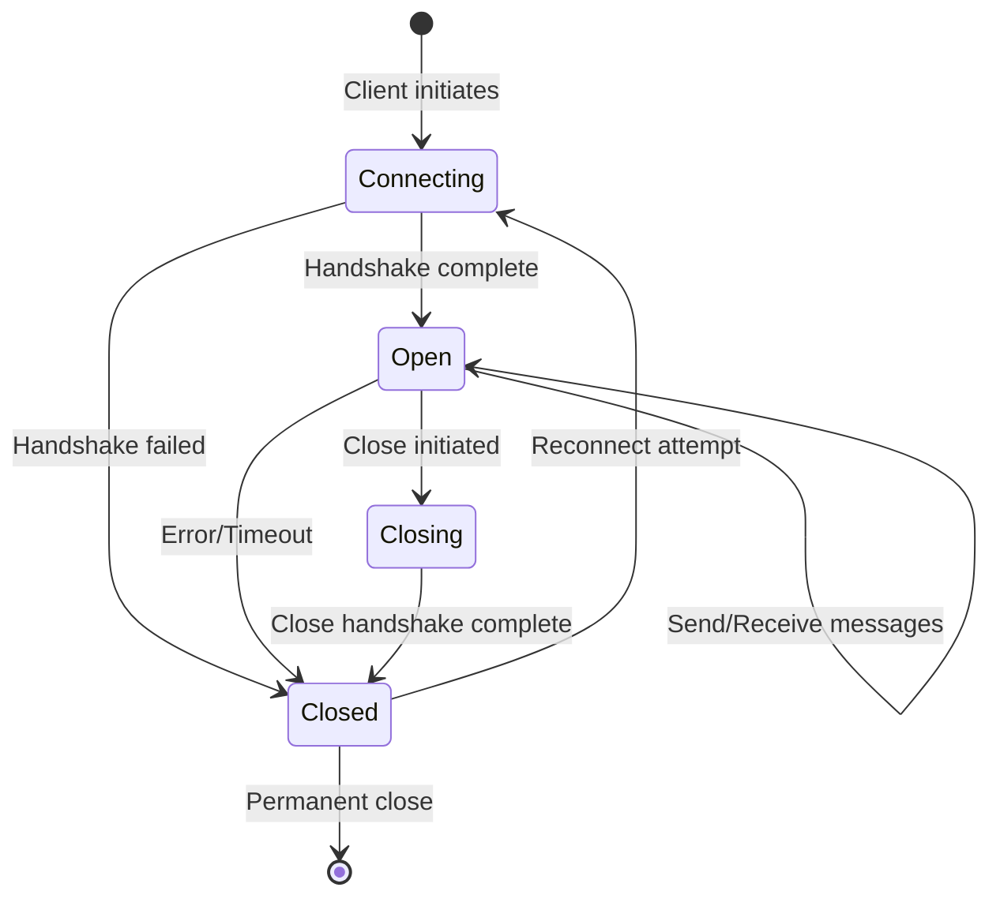

# WebSockets Pattern

## Overview

**WebSockets** is a communication protocol providing full-duplex, bidirectional communication channels over a single TCP connection. Unlike HTTP's request-response model, WebSockets enable both client and server to send messages independently at any time, making it ideal for real-time applications.

The protocol starts with an HTTP handshake (upgrade request) and then maintains a persistent connection for ongoing communication.



---

## Why Use It

### Problems It Solves

1. **Polling overhead**: HTTP polling wastes bandwidth and increases latency
2. **Half-duplex limitation**: HTTP request-response doesn't allow server push
3. **Connection overhead**: Each HTTP request requires new connection setup
4. **Real-time latency**: HTTP isn't designed for instant updates
5. **Scalability of long-polling**: Holding connections is resource-intensive

### Key Benefits

- **Full duplex** - Both parties can send messages simultaneously
- **Low latency** - No connection overhead per message
- **Server push** - Server can initiate messages to client
- **Efficient** - Minimal framing overhead (2-14 bytes)
- **Native browser support** - Available in all modern browsers
- **Stateful** - Connection maintains context

---

## When to Use

### Ideal Scenarios

- **Real-time applications**: Chat, notifications, live feeds
- **Collaborative tools**: Document editing, whiteboards
- **Gaming**: Multiplayer game state synchronization
- **Financial data**: Stock tickers, trading platforms
- **IoT dashboards**: Live sensor data visualization
- **Live streaming**: Comments, reactions, viewer counts

### Use Case Examples

| Use Case | Why WebSockets Works Well |
|----------|---------------------------|
| Chat applications | Instant message delivery both ways |
| Live notifications | Server pushes updates immediately |
| Multiplayer games | Real-time state sync, low latency |
| Stock trading | Live price updates, order status |
| Collaborative editing | Real-time cursor, change propagation |
| Sports scores | Instant score updates to millions |

---

## When NOT to Use

### Avoid WebSockets When

| Scenario | Better Alternative |
|----------|-------------------|
| Request-response patterns | REST, GraphQL |
| Infrequent updates | Long-polling, SSE |
| One-way server updates only | Server-Sent Events (SSE) |
| Short-lived interactions | REST |
| Heavy caching needs | REST with HTTP caching |

### Anti-Patterns

- **Using for CRUD operations**: HTTP is more appropriate
- **Not implementing reconnection**: Connections drop; handle gracefully
- **Ignoring backpressure**: Fast producers can overwhelm slow consumers
- **No heartbeat/ping**: Connections can silently die
- **Storing state only in memory**: Horizontal scaling becomes problematic

---

## How It Works

### Architecture



### Connection Lifecycle



### WebSocket Handshake

```
# Client Request
GET /chat HTTP/1.1
Host: server.example.com
Upgrade: websocket
Connection: Upgrade
Sec-WebSocket-Key: dGhlIHNhbXBsZSBub25jZQ==
Sec-WebSocket-Version: 13

# Server Response
HTTP/1.1 101 Switching Protocols
Upgrade: websocket
Connection: Upgrade
Sec-WebSocket-Accept: s3pPLMBiTxaQ9kYGzzhZRbK+xOo=
```

### Message Frame Format

```
 0                   1                   2                   3
 0 1 2 3 4 5 6 7 8 9 0 1 2 3 4 5 6 7 8 9 0 1 2 3 4 5 6 7 8 9 0 1
+-+-+-+-+-------+-+-------------+-------------------------------+
|F|R|R|R| opcode|M| Payload len |    Extended payload length    |
|I|S|S|S|  (4)  |A|     (7)     |             (16/64)           |
|N|V|V|V|       |S|             |   (if payload len==126/127)   |
| |1|2|3|       |K|             |                               |
+-+-+-+-+-------+-+-------------+-------------------------------+
|                    Masking-key (if MASK set)                  |
+-------------------------------+-------------------------------+
|                    Payload Data                               |
+---------------------------------------------------------------+
```

---

## Pros and Cons

### Pros

| Advantage | Description |
|-----------|-------------|
| **Low latency** | No HTTP overhead per message |
| **Bidirectional** | Both client and server can initiate |
| **Efficient** | Minimal framing, persistent connection |
| **Real-time** | Instant message delivery |
| **Browser native** | Supported in all modern browsers |
| **Stateful** | Connection maintains context |

### Cons

| Disadvantage | Description | Mitigation |
|--------------|-------------|------------|
| **Stateful connections** | Complicates horizontal scaling | Use pub/sub for cross-server messaging |
| **No caching** | Can't leverage HTTP caching | Implement application-level caching |
| **Load balancing** | Need sticky sessions or L7 LB | Use Redis pub/sub for broadcast |
| **Firewall issues** | Some proxies don't support | Use wss:// (TLS), fallback to polling |
| **Connection limits** | OS file descriptor limits | Connection pooling, tune ulimits |
| **Reconnection handling** | Must implement retry logic | Exponential backoff, heartbeats |

---

## Implementation Example

### Python (FastAPI + WebSockets)

```python
from fastapi import FastAPI, WebSocket, WebSocketDisconnect
from typing import Dict, Set
import asyncio
import json
from datetime import datetime
from dataclasses import dataclass, asdict
import redis.asyncio as redis

app = FastAPI()

@dataclass
class Message:
    type: str
    sender: str
    content: str
    timestamp: str
    room: str

class ConnectionManager:
    """Manages WebSocket connections per room"""

    def __init__(self):
        # room_id -> set of websockets
        self.active_connections: Dict[str, Set[WebSocket]] = {}
        self.redis_client = None

    async def init_redis(self):
        """Initialize Redis for cross-server messaging"""
        self.redis_client = await redis.from_url("redis://localhost")

    async def connect(self, websocket: WebSocket, room: str, user_id: str):
        await websocket.accept()
        if room not in self.active_connections:
            self.active_connections[room] = set()
        self.active_connections[room].add(websocket)

        # Notify room of new user
        await self.broadcast(room, Message(
            type="user_joined",
            sender="system",
            content=f"{user_id} joined the room",
            timestamp=datetime.utcnow().isoformat(),
            room=room
        ))

    async def disconnect(self, websocket: WebSocket, room: str, user_id: str):
        if room in self.active_connections:
            self.active_connections[room].discard(websocket)
            if not self.active_connections[room]:
                del self.active_connections[room]

        await self.broadcast(room, Message(
            type="user_left",
            sender="system",
            content=f"{user_id} left the room",
            timestamp=datetime.utcnow().isoformat(),
            room=room
        ))

    async def broadcast(self, room: str, message: Message):
        """Broadcast message to all connections in a room"""
        if room in self.active_connections:
            message_json = json.dumps(asdict(message))

            # Send to local connections
            disconnected = set()
            for connection in self.active_connections[room]:
                try:
                    await connection.send_text(message_json)
                except Exception:
                    disconnected.add(connection)

            # Clean up disconnected
            self.active_connections[room] -= disconnected

            # Publish to Redis for other servers
            if self.redis_client:
                await self.redis_client.publish(f"room:{room}", message_json)

    async def send_personal(self, websocket: WebSocket, message: Message):
        """Send message to a specific connection"""
        await websocket.send_text(json.dumps(asdict(message)))

manager = ConnectionManager()

@app.on_event("startup")
async def startup():
    await manager.init_redis()
    # Start Redis subscription listener
    asyncio.create_task(redis_listener())

async def redis_listener():
    """Listen for messages from other servers via Redis"""
    if manager.redis_client:
        pubsub = manager.redis_client.pubsub()
        await pubsub.psubscribe("room:*")

        async for message in pubsub.listen():
            if message["type"] == "pmessage":
                room = message["channel"].decode().split(":")[1]
                # Broadcast to local connections (already handled by sender)
                pass

@app.websocket("/ws/{room}/{user_id}")
async def websocket_endpoint(websocket: WebSocket, room: str, user_id: str):
    await manager.connect(websocket, room, user_id)

    try:
        while True:
            # Receive message from client
            data = await websocket.receive_text()
            message_data = json.loads(data)

            message = Message(
                type="message",
                sender=user_id,
                content=message_data.get("content", ""),
                timestamp=datetime.utcnow().isoformat(),
                room=room
            )

            # Broadcast to room
            await manager.broadcast(room, message)

    except WebSocketDisconnect:
        await manager.disconnect(websocket, room, user_id)

# Health check for load balancer
@app.get("/health")
async def health():
    return {"status": "healthy", "connections": sum(
        len(conns) for conns in manager.active_connections.values()
    )}
```

### JavaScript Client

```javascript
class WebSocketClient {
  constructor(url, options = {}) {
    this.url = url;
    this.options = {
      reconnectInterval: 1000,
      maxReconnectInterval: 30000,
      reconnectDecay: 1.5,
      maxReconnectAttempts: null,
      heartbeatInterval: 30000,
      ...options
    };

    this.ws = null;
    this.reconnectAttempts = 0;
    this.heartbeatTimer = null;
    this.handlers = new Map();
  }

  connect() {
    return new Promise((resolve, reject) => {
      this.ws = new WebSocket(this.url);

      this.ws.onopen = () => {
        console.log('WebSocket connected');
        this.reconnectAttempts = 0;
        this.startHeartbeat();
        resolve(this);
      };

      this.ws.onmessage = (event) => {
        const message = JSON.parse(event.data);
        this.handleMessage(message);
      };

      this.ws.onerror = (error) => {
        console.error('WebSocket error:', error);
        reject(error);
      };

      this.ws.onclose = (event) => {
        console.log('WebSocket closed:', event.code, event.reason);
        this.stopHeartbeat();
        this.handleReconnect();
      };
    });
  }

  handleMessage(message) {
    // Handle pong
    if (message.type === 'pong') {
      return;
    }

    // Call registered handlers
    const handler = this.handlers.get(message.type);
    if (handler) {
      handler(message);
    }

    // Call wildcard handler
    const wildcardHandler = this.handlers.get('*');
    if (wildcardHandler) {
      wildcardHandler(message);
    }
  }

  on(type, handler) {
    this.handlers.set(type, handler);
    return this;
  }

  send(type, content) {
    if (this.ws?.readyState === WebSocket.OPEN) {
      this.ws.send(JSON.stringify({ type, content }));
    } else {
      console.warn('WebSocket not connected');
    }
  }

  startHeartbeat() {
    this.heartbeatTimer = setInterval(() => {
      this.send('ping', {});
    }, this.options.heartbeatInterval);
  }

  stopHeartbeat() {
    if (this.heartbeatTimer) {
      clearInterval(this.heartbeatTimer);
      this.heartbeatTimer = null;
    }
  }

  handleReconnect() {
    const { maxReconnectAttempts, reconnectInterval, maxReconnectInterval, reconnectDecay } = this.options;

    if (maxReconnectAttempts && this.reconnectAttempts >= maxReconnectAttempts) {
      console.error('Max reconnection attempts reached');
      return;
    }

    const delay = Math.min(
      reconnectInterval * Math.pow(reconnectDecay, this.reconnectAttempts),
      maxReconnectInterval
    );

    console.log(`Reconnecting in ${delay}ms...`);

    setTimeout(() => {
      this.reconnectAttempts++;
      this.connect().catch(() => {});
    }, delay);
  }

  close() {
    this.stopHeartbeat();
    if (this.ws) {
      this.ws.close(1000, 'Client closed');
      this.ws = null;
    }
  }
}

// Usage example
const chat = new WebSocketClient('wss://api.example.com/ws/room123/user456');

chat
  .on('message', (msg) => {
    console.log(`${msg.sender}: ${msg.content}`);
  })
  .on('user_joined', (msg) => {
    console.log(`System: ${msg.content}`);
  })
  .on('user_left', (msg) => {
    console.log(`System: ${msg.content}`);
  });

await chat.connect();
chat.send('message', { content: 'Hello, everyone!' });
```

### Go Server (Gorilla WebSocket)

```go
package main

import (
    "encoding/json"
    "log"
    "net/http"
    "sync"
    "time"

    "github.com/gorilla/websocket"
)

var upgrader = websocket.Upgrader{
    ReadBufferSize:  1024,
    WriteBufferSize: 1024,
    CheckOrigin: func(r *http.Request) bool {
        return true // Configure properly in production
    },
}

type Message struct {
    Type      string `json:"type"`
    Sender    string `json:"sender"`
    Content   string `json:"content"`
    Timestamp string `json:"timestamp"`
    Room      string `json:"room"`
}

type Client struct {
    conn   *websocket.Conn
    send   chan []byte
    room   string
    userID string
}

type Hub struct {
    rooms      map[string]map[*Client]bool
    broadcast  chan *Message
    register   chan *Client
    unregister chan *Client
    mu         sync.RWMutex
}

func newHub() *Hub {
    return &Hub{
        rooms:      make(map[string]map[*Client]bool),
        broadcast:  make(chan *Message),
        register:   make(chan *Client),
        unregister: make(chan *Client),
    }
}

func (h *Hub) run() {
    for {
        select {
        case client := <-h.register:
            h.mu.Lock()
            if h.rooms[client.room] == nil {
                h.rooms[client.room] = make(map[*Client]bool)
            }
            h.rooms[client.room][client] = true
            h.mu.Unlock()

        case client := <-h.unregister:
            h.mu.Lock()
            if clients, ok := h.rooms[client.room]; ok {
                if _, ok := clients[client]; ok {
                    delete(clients, client)
                    close(client.send)
                }
            }
            h.mu.Unlock()

        case message := <-h.broadcast:
            h.mu.RLock()
            if clients, ok := h.rooms[message.Room]; ok {
                data, _ := json.Marshal(message)
                for client := range clients {
                    select {
                    case client.send <- data:
                    default:
                        close(client.send)
                        delete(clients, client)
                    }
                }
            }
            h.mu.RUnlock()
        }
    }
}

func (c *Client) readPump(hub *Hub) {
    defer func() {
        hub.unregister <- c
        c.conn.Close()
    }()

    c.conn.SetReadLimit(512)
    c.conn.SetReadDeadline(time.Now().Add(60 * time.Second))
    c.conn.SetPongHandler(func(string) error {
        c.conn.SetReadDeadline(time.Now().Add(60 * time.Second))
        return nil
    })

    for {
        _, data, err := c.conn.ReadMessage()
        if err != nil {
            break
        }

        var incoming map[string]interface{}
        if err := json.Unmarshal(data, &incoming); err != nil {
            continue
        }

        message := &Message{
            Type:      "message",
            Sender:    c.userID,
            Content:   incoming["content"].(string),
            Timestamp: time.Now().UTC().Format(time.RFC3339),
            Room:      c.room,
        }
        hub.broadcast <- message
    }
}

func (c *Client) writePump() {
    ticker := time.NewTicker(30 * time.Second)
    defer func() {
        ticker.Stop()
        c.conn.Close()
    }()

    for {
        select {
        case message, ok := <-c.send:
            c.conn.SetWriteDeadline(time.Now().Add(10 * time.Second))
            if !ok {
                c.conn.WriteMessage(websocket.CloseMessage, []byte{})
                return
            }
            c.conn.WriteMessage(websocket.TextMessage, message)

        case <-ticker.C:
            c.conn.SetWriteDeadline(time.Now().Add(10 * time.Second))
            if err := c.conn.WriteMessage(websocket.PingMessage, nil); err != nil {
                return
            }
        }
    }
}

func serveWs(hub *Hub, w http.ResponseWriter, r *http.Request) {
    room := r.URL.Query().Get("room")
    userID := r.URL.Query().Get("user")

    conn, err := upgrader.Upgrade(w, r, nil)
    if err != nil {
        log.Println(err)
        return
    }

    client := &Client{
        conn:   conn,
        send:   make(chan []byte, 256),
        room:   room,
        userID: userID,
    }
    hub.register <- client

    go client.writePump()
    go client.readPump(hub)
}

func main() {
    hub := newHub()
    go hub.run()

    http.HandleFunc("/ws", func(w http.ResponseWriter, r *http.Request) {
        serveWs(hub, w, r)
    })

    log.Println("WebSocket server starting on :8080")
    log.Fatal(http.ListenAndServe(":8080", nil))
}
```

---

## Real-World Examples

| Company | Use Case | Scale |
|---------|----------|-------|
| **Slack** | Real-time messaging | Millions of concurrent connections |
| **Discord** | Voice + text chat | 10M+ concurrent users |
| **Figma** | Collaborative design | Real-time cursor sync |
| **Robinhood** | Stock prices | Sub-second updates |
| **Notion** | Collaborative docs | Multi-user editing |
| **Twitch** | Live chat | Millions of messages/second |

### Scaling Patterns Used

1. **Slack**: WebSocket gateways + Kafka for cross-server messaging
2. **Discord**: Elixir-based WebSocket servers + distributed state
3. **Figma**: CRDT-based conflict resolution over WebSocket

---

## Related Patterns

- [REST API](./rest-api.md) - Combine REST for CRUD, WebSockets for real-time
- [Pub/Sub](../05-messaging-patterns/pub-sub.md) - Backend fan-out for WebSocket messages
- [API Gateway](../02-api-gateway-patterns/api-gateway.md) - WebSocket routing and authentication
- [Circuit Breaker](../03-resilience-patterns/circuit-breaker.md) - Handle WebSocket server failures

---

## Further Reading

- [RFC 6455 - The WebSocket Protocol](https://tools.ietf.org/html/rfc6455)
- [WebSocket API (MDN)](https://developer.mozilla.org/en-US/docs/Web/API/WebSocket)
- [Scaling WebSockets](https://ably.com/topic/scaling-websockets)
- [Socket.IO Documentation](https://socket.io/docs/v4/)
