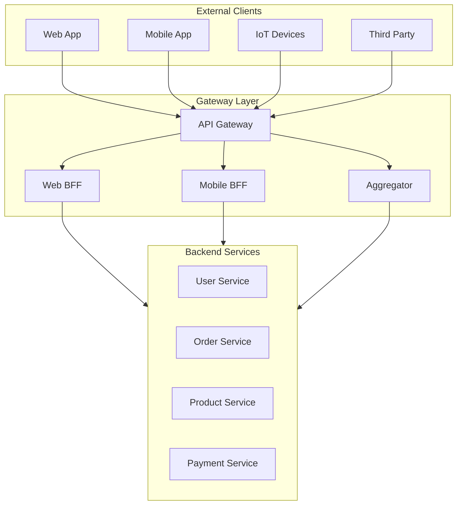
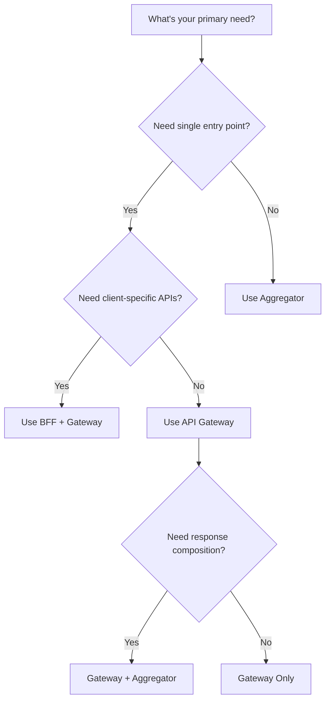
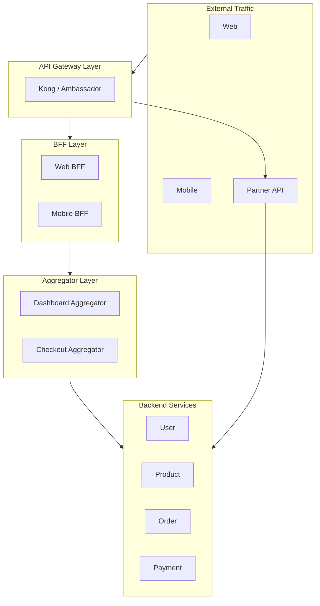

# API Gateway Patterns

This section covers patterns for managing how external clients access your microservices ecosystem. These patterns provide a unified entry point, aggregate responses, and handle cross-cutting concerns like authentication and rate limiting.

## Overview

## Patterns in This Category

| Pattern | Document | Best For |
|---------|----------|----------|
| API Gateway | [api-gateway.md](./api-gateway.md) | Centralized entry point, cross-cutting concerns |
| Backend for Frontend | [backend-for-frontend.md](./backend-for-frontend.md) | Multi-platform clients with different needs |
| Aggregator Pattern | [aggregator-pattern.md](./aggregator-pattern.md) | Composing responses from multiple services |

## Comparison Matrix

| Aspect | API Gateway | Backend for Frontend | Aggregator |
|--------|-------------|---------------------|------------|
| **Primary Purpose** | Single entry point | Client-specific optimization | Response composition |
| **Number of Endpoints** | One per service | One per client type | One per aggregate |
| **Ownership** | Platform/Infra team | Frontend teams | Backend teams |
| **Complexity** | Medium | High (multiple BFFs) | Medium |
| **Client Coupling** | Loose | Tight (per client) | Loose |
| **Use Case** | Cross-cutting concerns | Mobile/Web optimization | Dashboard APIs |

## Pattern Selection Guide

## Decision Framework

### Choose API Gateway when:
- You need a single entry point for all clients
- Cross-cutting concerns (auth, rate limiting, logging) are important
- You want to decouple clients from service topology
- Service discovery and load balancing are needed

### Choose Backend for Frontend when:
- You have multiple client types (web, mobile, IoT)
- Each client has significantly different data/performance needs
- Frontend teams want autonomy over their APIs
- Mobile needs optimized payloads for bandwidth

### Choose Aggregator when:
- Single requests need data from multiple services
- You want to reduce client round trips
- Building dashboard or composite views
- Need to join data at the API layer

## Combined Patterns

Most production systems combine these patterns:

**Common Combinations:**

| Pattern Combination | Use Case |
|---------------------|----------|
| Gateway + BFF | Consumer apps with web and mobile |
| Gateway + Aggregator | Complex dashboard applications |
| Gateway + BFF + Aggregator | Enterprise platforms |

## Cross-Cutting Concerns

All gateway patterns typically handle:

| Concern | Description |
|---------|-------------|
| **Authentication** | Validate tokens, API keys |
| **Authorization** | Check permissions, scopes |
| **Rate Limiting** | Protect backend services |
| **Request Logging** | Audit trail, debugging |
| **Request/Response Transform** | Protocol translation |
| **Caching** | Response caching |
| **Circuit Breaking** | Fail-fast on unhealthy services |
| **Load Balancing** | Distribute traffic |

## Related Patterns

- [REST API](../01-api-communication-styles/rest-api.md) - Common protocol behind gateways
- [gRPC](../01-api-communication-styles/grpc.md) - Backend protocol translation
- [Circuit Breaker](../03-resilience-patterns/circuit-breaker.md) - Resilience at gateway
- [Rate Limiting](../03-resilience-patterns/rate-limiting.md) - Traffic control
- [Service Discovery](../06-service-discovery-mesh/service-registry.md) - Finding backend services
