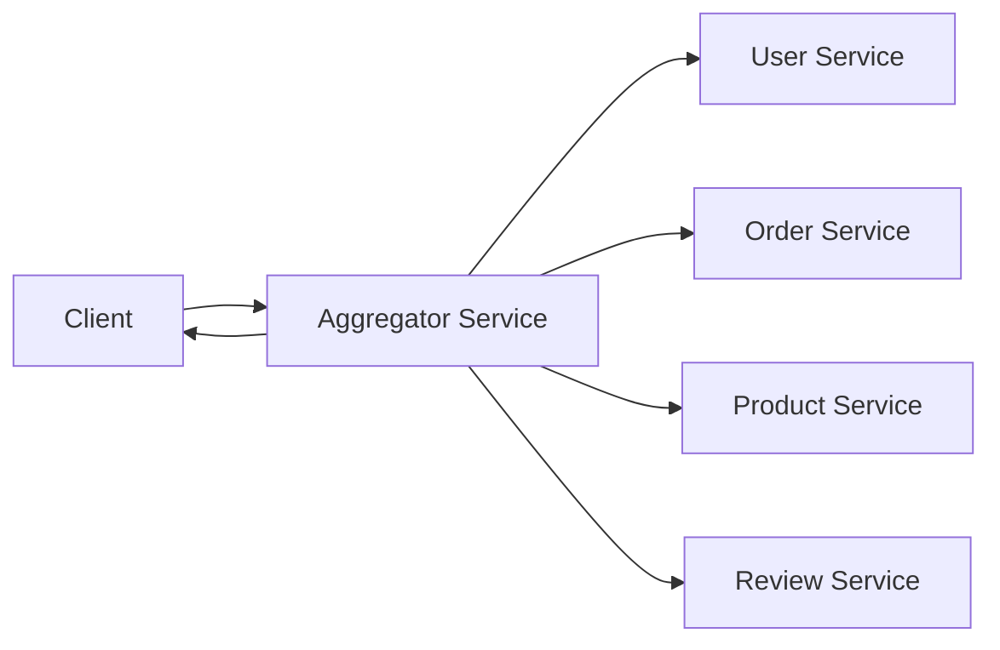
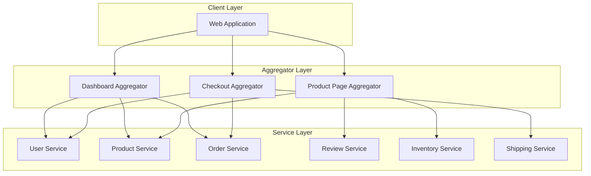
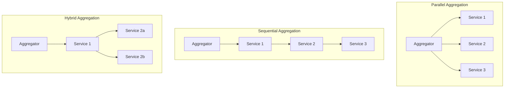
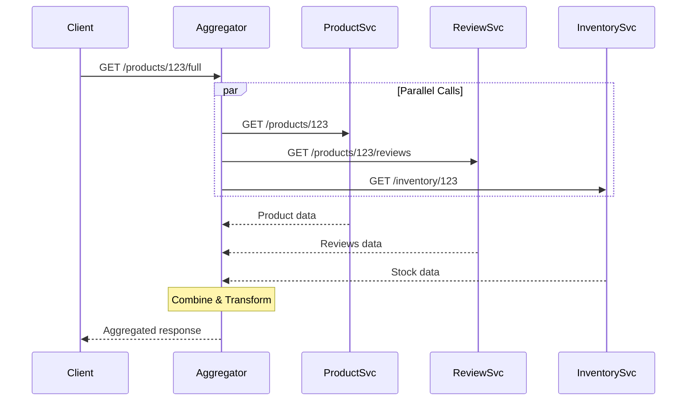

# Aggregator Pattern

## Overview

The **Aggregator Pattern** is a service composition pattern where a single service (the aggregator) collects data from multiple backend services, combines them into a unified response, and returns it to the client. This reduces the number of client round trips and moves composition logic to the server side.

Unlike a simple proxy, an aggregator actively transforms, joins, and enriches data from multiple sources into a cohesive response tailored for specific use cases.



---

## Why Use It

### Problems It Solves

1. **Multiple round trips**: Clients calling many services independently
2. **Client complexity**: Business logic for joining data in clients
3. **Network latency**: Mobile clients suffer from many sequential calls
4. **Data consistency**: Different services may have stale data
5. **Protocol differences**: Services using different formats/protocols

### Key Benefits

- **Reduced latency** - Single request instead of multiple
- **Simplified clients** - Aggregation logic server-side
- **Optimized responses** - Return exactly what's needed
- **Backend abstraction** - Hide service topology from clients
- **Parallel fetching** - Aggregator can call services concurrently
- **Consistent joins** - Server-side data combination

---

## When to Use

### Ideal Scenarios

- **Dashboard views**: Combining data from multiple domains
- **Detail pages**: Product page with reviews, recommendations, inventory
- **Checkout flows**: User, cart, payment, shipping combined
- **Reports**: Aggregating metrics from multiple systems
- **Search results**: Enriching search with additional context

### Use Case Examples

| Use Case | Services Aggregated |
|----------|---------------------|
| E-commerce product page | Product + Reviews + Inventory + Related |
| User profile dashboard | User + Orders + Wishlist + Recommendations |
| Order confirmation | Order + Products + Shipping + Payment |
| Admin analytics | Sales + Users + Inventory + Traffic |
| Social feed | Posts + Users + Likes + Comments |

---

## When NOT to Use

### Avoid Aggregator When

| Scenario | Better Alternative |
|----------|-------------------|
| Single service call | Direct service call |
| Real-time streaming | WebSockets, SSE |
| Simple CRUD | REST to individual services |
| High write operations | Direct service calls |

### Anti-Patterns

- **Business logic in aggregator**: Keep it to data composition
- **Synchronous chains**: Aggregator calling aggregator calling aggregator
- **No timeout handling**: Slow service blocks entire response
- **Ignoring partial failures**: Return what you can, degrade gracefully

---

## How It Works

### Architecture



### Aggregation Strategies



### Request Flow



---

## Pros and Cons

### Pros

| Advantage | Description |
|-----------|-------------|
| **Reduced latency** | Parallel backend calls, single client request |
| **Simplified clients** | No client-side data joining |
| **Optimized responses** | Return exactly what's needed |
| **Backend changes isolated** | Services can change independently |
| **Caching opportunities** | Cache aggregated responses |
| **Error handling** | Graceful degradation server-side |

### Cons

| Disadvantage | Description | Mitigation |
|--------------|-------------|------------|
| **Single point of failure** | Aggregator down = feature down | Multiple instances, circuit breakers |
| **Increased complexity** | Another service to maintain | Clear ownership, good monitoring |
| **Latency of slowest** | Response waits for slowest service | Timeouts, partial responses |
| **Data freshness** | Aggregated data may be inconsistent | Cache invalidation, timestamps |
| **Testing complexity** | Need to mock multiple services | Contract testing, service virtualization |

---

## Implementation Example

### Python Aggregator (FastAPI + asyncio)

```python
from fastapi import FastAPI, HTTPException
from pydantic import BaseModel
from typing import Optional, List
import httpx
import asyncio
from datetime import datetime

app = FastAPI(title="Product Page Aggregator")

# Service URLs
PRODUCT_SERVICE = "http://product-service:8080"
REVIEW_SERVICE = "http://review-service:8080"
INVENTORY_SERVICE = "http://inventory-service:8080"
RECOMMENDATION_SERVICE = "http://recommendation-service:8080"

# Response Models
class Product(BaseModel):
    id: str
    name: str
    description: str
    price: float
    images: List[str]
    category: str

class Review(BaseModel):
    id: str
    user_name: str
    rating: int
    comment: str
    created_at: datetime

class Inventory(BaseModel):
    sku: str
    in_stock: bool
    quantity: int
    warehouse_location: str

class RecommendedProduct(BaseModel):
    id: str
    name: str
    price: float
    image: str

class ProductPageResponse(BaseModel):
    product: Product
    reviews: Optional[List[Review]] = None
    review_summary: Optional[dict] = None
    inventory: Optional[Inventory] = None
    recommendations: Optional[List[RecommendedProduct]] = None
    aggregated_at: datetime
    partial_response: bool = False
    errors: List[str] = []


async def fetch_with_timeout(
    client: httpx.AsyncClient,
    url: str,
    timeout: float = 3.0,
    service_name: str = ""
) -> tuple[Optional[dict], Optional[str]]:
    """Fetch with timeout, return (data, error)"""
    try:
        response = await client.get(url, timeout=timeout)
        response.raise_for_status()
        return response.json(), None
    except httpx.TimeoutException:
        return None, f"{service_name} timeout"
    except httpx.HTTPStatusError as e:
        return None, f"{service_name} error: {e.response.status_code}"
    except Exception as e:
        return None, f"{service_name} error: {str(e)}"


@app.get("/products/{product_id}/full", response_model=ProductPageResponse)
async def get_product_page(product_id: str):
    """
    Aggregate product page data from multiple services.
    Uses parallel fetching with graceful degradation.
    """
    errors = []

    async with httpx.AsyncClient() as client:
        # Product is required - fail if not available
        product_data, product_error = await fetch_with_timeout(
            client,
            f"{PRODUCT_SERVICE}/products/{product_id}",
            timeout=5.0,
            service_name="Product"
        )

        if product_error:
            raise HTTPException(status_code=404, detail="Product not found")

        product = Product(**product_data)

        # Fetch optional data in parallel
        results = await asyncio.gather(
            fetch_with_timeout(
                client,
                f"{REVIEW_SERVICE}/products/{product_id}/reviews?limit=10",
                timeout=3.0,
                service_name="Reviews"
            ),
            fetch_with_timeout(
                client,
                f"{INVENTORY_SERVICE}/products/{product_id}",
                timeout=2.0,
                service_name="Inventory"
            ),
            fetch_with_timeout(
                client,
                f"{RECOMMENDATION_SERVICE}/products/{product_id}/related?limit=4",
                timeout=3.0,
                service_name="Recommendations"
            ),
            return_exceptions=True
        )

        reviews_data, reviews_error = results[0]
        inventory_data, inventory_error = results[1]
        recommendations_data, recommendations_error = results[2]

        # Process reviews
        reviews = None
        review_summary = None
        if reviews_data:
            reviews = [Review(**r) for r in reviews_data.get("reviews", [])]
            if reviews:
                ratings = [r.rating for r in reviews]
                review_summary = {
                    "average_rating": sum(ratings) / len(ratings),
                    "total_reviews": reviews_data.get("total", len(reviews)),
                    "rating_distribution": {
                        i: ratings.count(i) for i in range(1, 6)
                    }
                }
        else:
            errors.append(reviews_error)

        # Process inventory
        inventory = None
        if inventory_data:
            inventory = Inventory(**inventory_data)
        else:
            errors.append(inventory_error)

        # Process recommendations
        recommendations = None
        if recommendations_data:
            recommendations = [
                RecommendedProduct(**r)
                for r in recommendations_data.get("products", [])
            ]
        else:
            errors.append(recommendations_error)

        return ProductPageResponse(
            product=product,
            reviews=reviews,
            review_summary=review_summary,
            inventory=inventory,
            recommendations=recommendations,
            aggregated_at=datetime.utcnow(),
            partial_response=len(errors) > 0,
            errors=[e for e in errors if e]
        )


# Checkout aggregator example
class CartItem(BaseModel):
    product_id: str
    quantity: int
    price: float

class ShippingOption(BaseModel):
    id: str
    name: str
    price: float
    estimated_days: int

class CheckoutResponse(BaseModel):
    cart_items: List[CartItem]
    subtotal: float
    shipping_options: List[ShippingOption]
    estimated_tax: float
    user_addresses: List[dict]
    payment_methods: List[dict]


@app.get("/checkout/{user_id}", response_model=CheckoutResponse)
async def get_checkout_data(user_id: str):
    """Aggregate all data needed for checkout page"""

    async with httpx.AsyncClient() as client:
        # All these are required for checkout
        cart_task = client.get(f"http://cart-service:8080/users/{user_id}/cart")
        user_task = client.get(f"http://user-service:8080/users/{user_id}")
        shipping_task = client.get("http://shipping-service:8080/options")
        payment_task = client.get(f"http://payment-service:8080/users/{user_id}/methods")

        try:
            cart_resp, user_resp, shipping_resp, payment_resp = await asyncio.gather(
                cart_task, user_task, shipping_task, payment_task
            )

            cart_data = cart_resp.json()
            user_data = user_resp.json()
            shipping_data = shipping_resp.json()
            payment_data = payment_resp.json()

        except Exception as e:
            raise HTTPException(
                status_code=500,
                detail="Failed to load checkout data"
            )

        # Calculate derived values
        subtotal = sum(item["price"] * item["quantity"] for item in cart_data["items"])
        estimated_tax = subtotal * 0.08  # Simplified tax calculation

        return CheckoutResponse(
            cart_items=[CartItem(**item) for item in cart_data["items"]],
            subtotal=subtotal,
            shipping_options=[ShippingOption(**opt) for opt in shipping_data["options"]],
            estimated_tax=estimated_tax,
            user_addresses=user_data.get("addresses", []),
            payment_methods=payment_data.get("methods", [])
        )
```

### Go Aggregator with Context and Cancellation

```go
package main

import (
    "context"
    "encoding/json"
    "fmt"
    "net/http"
    "sync"
    "time"
)

type Product struct {
    ID          string   `json:"id"`
    Name        string   `json:"name"`
    Description string   `json:"description"`
    Price       float64  `json:"price"`
    Images      []string `json:"images"`
}

type Review struct {
    ID        string    `json:"id"`
    UserName  string    `json:"user_name"`
    Rating    int       `json:"rating"`
    Comment   string    `json:"comment"`
    CreatedAt time.Time `json:"created_at"`
}

type Inventory struct {
    SKU      string `json:"sku"`
    InStock  bool   `json:"in_stock"`
    Quantity int    `json:"quantity"`
}

type ProductPageResponse struct {
    Product         *Product   `json:"product"`
    Reviews         []Review   `json:"reviews,omitempty"`
    AverageRating   float64    `json:"average_rating,omitempty"`
    Inventory       *Inventory `json:"inventory,omitempty"`
    AggregatedAt    time.Time  `json:"aggregated_at"`
    PartialResponse bool       `json:"partial_response"`
    Errors          []string   `json:"errors,omitempty"`
}

type Aggregator struct {
    httpClient *http.Client
    services   map[string]string
}

func NewAggregator() *Aggregator {
    return &Aggregator{
        httpClient: &http.Client{Timeout: 10 * time.Second},
        services: map[string]string{
            "product":   "http://product-service:8080",
            "review":    "http://review-service:8080",
            "inventory": "http://inventory-service:8080",
        },
    }
}

func (a *Aggregator) fetchWithTimeout(
    ctx context.Context,
    url string,
    timeout time.Duration,
) ([]byte, error) {
    ctx, cancel := context.WithTimeout(ctx, timeout)
    defer cancel()

    req, err := http.NewRequestWithContext(ctx, "GET", url, nil)
    if err != nil {
        return nil, err
    }

    resp, err := a.httpClient.Do(req)
    if err != nil {
        return nil, err
    }
    defer resp.Body.Close()

    if resp.StatusCode != http.StatusOK {
        return nil, fmt.Errorf("status: %d", resp.StatusCode)
    }

    var data []byte
    // Read response body (simplified)
    return data, nil
}

func (a *Aggregator) GetProductPage(ctx context.Context, productID string) (*ProductPageResponse, error) {
    response := &ProductPageResponse{
        AggregatedAt: time.Now().UTC(),
        Errors:       []string{},
    }

    var wg sync.WaitGroup
    var mu sync.Mutex

    // Fetch product (required)
    productURL := fmt.Sprintf("%s/products/%s", a.services["product"], productID)
    productData, err := a.fetchWithTimeout(ctx, productURL, 5*time.Second)
    if err != nil {
        return nil, fmt.Errorf("product not found: %w", err)
    }

    var product Product
    if err := json.Unmarshal(productData, &product); err != nil {
        return nil, err
    }
    response.Product = &product

    // Fetch optional data in parallel
    wg.Add(2)

    // Reviews
    go func() {
        defer wg.Done()
        reviewURL := fmt.Sprintf("%s/products/%s/reviews", a.services["review"], productID)
        data, err := a.fetchWithTimeout(ctx, reviewURL, 3*time.Second)

        mu.Lock()
        defer mu.Unlock()

        if err != nil {
            response.Errors = append(response.Errors, "reviews: "+err.Error())
            response.PartialResponse = true
            return
        }

        var reviewsResp struct {
            Reviews []Review `json:"reviews"`
        }
        if err := json.Unmarshal(data, &reviewsResp); err == nil {
            response.Reviews = reviewsResp.Reviews

            // Calculate average
            if len(response.Reviews) > 0 {
                var sum float64
                for _, r := range response.Reviews {
                    sum += float64(r.Rating)
                }
                response.AverageRating = sum / float64(len(response.Reviews))
            }
        }
    }()

    // Inventory
    go func() {
        defer wg.Done()
        inventoryURL := fmt.Sprintf("%s/products/%s", a.services["inventory"], productID)
        data, err := a.fetchWithTimeout(ctx, inventoryURL, 2*time.Second)

        mu.Lock()
        defer mu.Unlock()

        if err != nil {
            response.Errors = append(response.Errors, "inventory: "+err.Error())
            response.PartialResponse = true
            return
        }

        var inventory Inventory
        if err := json.Unmarshal(data, &inventory); err == nil {
            response.Inventory = &inventory
        }
    }()

    wg.Wait()
    return response, nil
}

func (a *Aggregator) handleProductPage(w http.ResponseWriter, r *http.Request) {
    productID := r.URL.Query().Get("id")
    if productID == "" {
        http.Error(w, "product id required", http.StatusBadRequest)
        return
    }

    response, err := a.GetProductPage(r.Context(), productID)
    if err != nil {
        http.Error(w, err.Error(), http.StatusNotFound)
        return
    }

    w.Header().Set("Content-Type", "application/json")

    // Add cache headers based on completeness
    if response.PartialResponse {
        w.Header().Set("Cache-Control", "no-cache")
    } else {
        w.Header().Set("Cache-Control", "max-age=60")
    }

    json.NewEncoder(w).Encode(response)
}

func main() {
    aggregator := NewAggregator()

    http.HandleFunc("/products/full", aggregator.handleProductPage)

    fmt.Println("Aggregator listening on :8080")
    http.ListenAndServe(":8080", nil)
}
```

---

## Real-World Examples

| Company | Aggregator Use Case |
|---------|---------------------|
| **Amazon** | Product page combines catalog, pricing, reviews, inventory |
| **Netflix** | Home page aggregates watch history, recommendations, trending |
| **Uber** | Ride request combines driver matching, pricing, ETA |
| **LinkedIn** | Feed aggregates posts, connections, job suggestions |
| **Airbnb** | Listing page combines property, host, reviews, availability |

### Patterns in Production

1. **Amazon**: GraphQL-based aggregation for product pages
2. **Netflix**: Falcor for efficient data fetching and aggregation
3. **Uber**: Domain-specific aggregators per feature area

---

## Related Patterns

- [API Gateway](./api-gateway.md) - Often hosts aggregators
- [Backend for Frontend](./backend-for-frontend.md) - BFFs often aggregate
- [Circuit Breaker](../03-resilience-patterns/circuit-breaker.md) - Protect against slow services
- [CQRS](../04-data-patterns/cqrs.md) - Read-optimized aggregation

---

## Further Reading

- [Microservices Patterns: Aggregator - Chris Richardson](https://microservices.io/patterns/data/api-composition.html)
- [GraphQL as an Aggregation Layer](https://graphql.org/learn/)
- [Netflix Falcor](https://netflix.github.io/falcor/)
- [Facebook Relay](https://relay.dev/)
