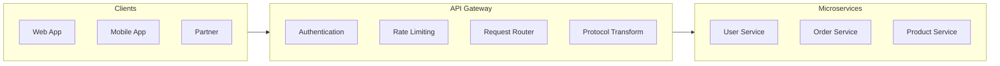
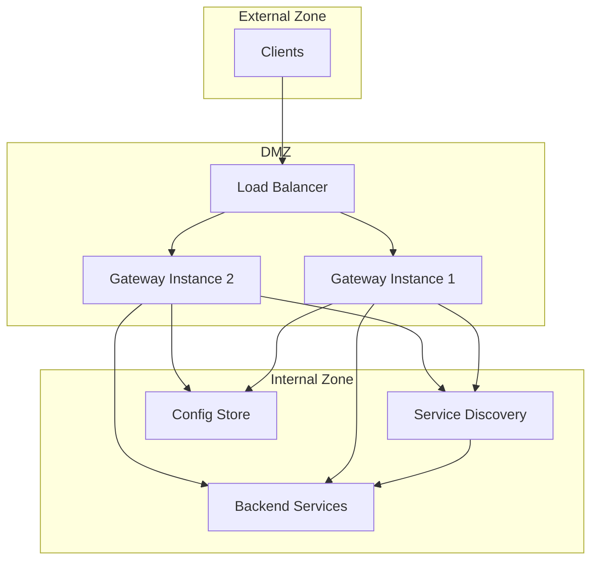
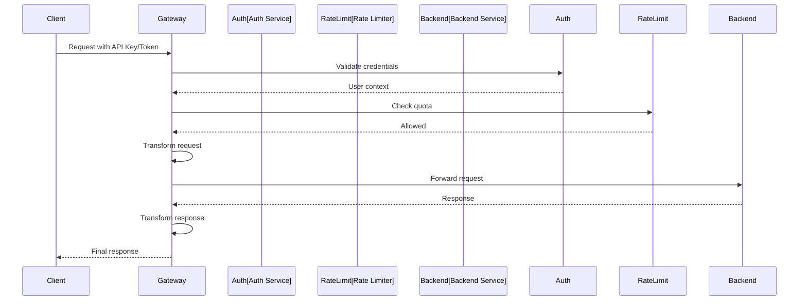
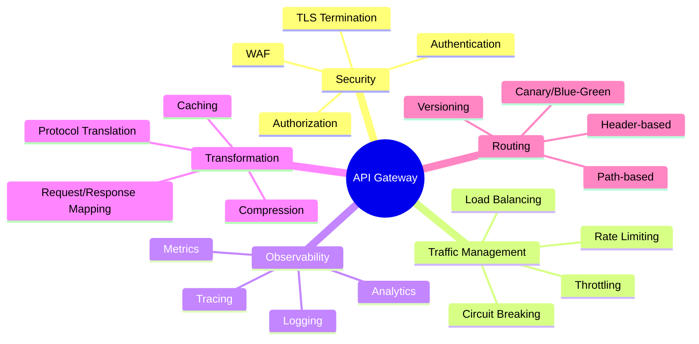

# API Gateway Pattern

## Overview

The **API Gateway** pattern provides a single entry point for all clients accessing backend microservices. It acts as a reverse proxy, routing requests to appropriate services while handling cross-cutting concerns like authentication, rate limiting, logging, and protocol translation.

Instead of clients calling multiple services directly, they interact with one gateway that abstracts the complexity of the service landscape.



---

## Why Use It

### Problems It Solves

1. **Client complexity**: Clients need to know about many service endpoints
2. **Cross-cutting concerns**: Auth, logging, rate limiting duplicated across services
3. **Protocol translation**: Different clients need different protocols
4. **Service discovery**: Clients shouldn't manage service locations
5. **Security exposure**: Don't expose internal services directly

### Key Benefits

- **Single entry point** - Simplified client integration
- **Encapsulation** - Hide internal service topology
- **Cross-cutting concerns** - Centralized auth, logging, rate limiting
- **Protocol translation** - REST ↔ gRPC, HTTP ↔ WebSocket
- **Response aggregation** - Combine multiple service calls
- **API versioning** - Manage API evolution

---

## When to Use

### Ideal Scenarios

- **Microservices architecture**: Many services need unified access
- **Public APIs**: Need security, rate limiting, documentation
- **Multi-protocol support**: Different clients, different protocols
- **Legacy modernization**: Facade over legacy systems
- **Third-party integrations**: Partner API management

### Use Case Examples

| Use Case | Why API Gateway Works Well |
|----------|---------------------------|
| E-commerce platform | Unified access to catalog, cart, checkout |
| Banking API | Security, compliance, audit logging |
| SaaS multi-tenant | Tenant isolation, quota management |
| Mobile backend | Protocol optimization, response aggregation |
| Partner API program | Key management, usage tracking |

---

## When NOT to Use

### Avoid API Gateway When

| Scenario | Better Alternative |
|----------|-------------------|
| Simple monolith | Direct access |
| Single service | Overkill |
| Internal service-to-service | Service mesh |
| Real-time streaming only | Direct WebSocket |

### Anti-Patterns

- **Business logic in gateway**: Keep it infrastructure-focused
- **Single point of failure**: Always deploy HA configuration
- **Monolithic gateway**: Use modular/federated approach at scale
- **Over-aggregation**: Gateway shouldn't replace backend composition

---

## How It Works

### Architecture



### Request Flow



### Gateway Capabilities



---

## Pros and Cons

### Pros

| Advantage | Description |
|-----------|-------------|
| **Simplified clients** | Single endpoint, consistent interface |
| **Security** | Centralized authentication and authorization |
| **Encapsulation** | Hide service topology changes |
| **Cross-cutting concerns** | One place for logging, metrics, rate limiting |
| **Protocol flexibility** | Translate between protocols |
| **API versioning** | Manage multiple versions |

### Cons

| Disadvantage | Description | Mitigation |
|--------------|-------------|------------|
| **Single point of failure** | Gateway down = system down | HA deployment, multiple instances |
| **Latency overhead** | Extra network hop | Edge deployment, caching |
| **Complexity** | Additional component to manage | Use managed services |
| **Bottleneck risk** | All traffic funnels through | Horizontal scaling |
| **Team coupling** | Gateway team becomes bottleneck | Federated gateway, self-service |

---

## Implementation Example

### Kong Gateway Configuration (Declarative)

```yaml
# kong.yml - Declarative configuration
_format_version: "3.0"

services:
  - name: user-service
    url: http://user-service:8080
    routes:
      - name: user-routes
        paths:
          - /api/v1/users
        strip_path: false
    plugins:
      - name: rate-limiting
        config:
          minute: 100
          policy: local
      - name: jwt
        config:
          secret_is_base64: false
          claims_to_verify:
            - exp

  - name: order-service
    url: http://order-service:8080
    routes:
      - name: order-routes
        paths:
          - /api/v1/orders
        strip_path: false
    plugins:
      - name: rate-limiting
        config:
          minute: 50
          policy: local

  - name: product-service
    url: http://product-service:8080
    routes:
      - name: product-routes
        paths:
          - /api/v1/products
        strip_path: false
    plugins:
      - name: proxy-cache
        config:
          response_code:
            - 200
          request_method:
            - GET
          content_type:
            - application/json
          cache_ttl: 300
          strategy: memory

# Global plugins
plugins:
  - name: correlation-id
    config:
      header_name: X-Correlation-ID
      generator: uuid
  - name: prometheus
  - name: file-log
    config:
      path: /var/log/kong/access.log
```

### Python Custom Gateway (FastAPI)

```python
from fastapi import FastAPI, Request, HTTPException, Depends
from fastapi.responses import JSONResponse
import httpx
import time
from typing import Optional
from functools import lru_cache
from pydantic import BaseModel
import asyncio
from collections import defaultdict
import jwt

app = FastAPI(title="API Gateway")

# Configuration
SERVICES = {
    "users": "http://user-service:8080",
    "orders": "http://order-service:8080",
    "products": "http://product-service:8080",
}

JWT_SECRET = "your-secret-key"
RATE_LIMIT_PER_MINUTE = 100

# Rate limiter (in-memory, use Redis in production)
rate_limit_store = defaultdict(lambda: {"count": 0, "reset_at": 0})

class RateLimiter:
    def __init__(self, requests_per_minute: int):
        self.rpm = requests_per_minute

    async def check(self, client_id: str) -> bool:
        now = time.time()
        bucket = rate_limit_store[client_id]

        if now > bucket["reset_at"]:
            bucket["count"] = 0
            bucket["reset_at"] = now + 60

        if bucket["count"] >= self.rpm:
            return False

        bucket["count"] += 1
        return True

rate_limiter = RateLimiter(RATE_LIMIT_PER_MINUTE)

# Authentication middleware
async def verify_token(request: Request) -> dict:
    auth_header = request.headers.get("Authorization")
    if not auth_header or not auth_header.startswith("Bearer "):
        raise HTTPException(status_code=401, detail="Missing or invalid token")

    token = auth_header.split(" ")[1]
    try:
        payload = jwt.decode(token, JWT_SECRET, algorithms=["HS256"])
        return payload
    except jwt.ExpiredSignatureError:
        raise HTTPException(status_code=401, detail="Token expired")
    except jwt.InvalidTokenError:
        raise HTTPException(status_code=401, detail="Invalid token")

# Rate limiting middleware
async def check_rate_limit(request: Request, user: dict = Depends(verify_token)):
    client_id = user.get("sub", request.client.host)

    if not await rate_limiter.check(client_id):
        raise HTTPException(
            status_code=429,
            detail="Rate limit exceeded",
            headers={"Retry-After": "60"}
        )

    return user

# Circuit breaker (simplified)
class CircuitBreaker:
    def __init__(self, failure_threshold: int = 5, reset_timeout: int = 30):
        self.failure_threshold = failure_threshold
        self.reset_timeout = reset_timeout
        self.failures = defaultdict(int)
        self.last_failure_time = defaultdict(float)
        self.state = defaultdict(lambda: "closed")  # closed, open, half-open

    def can_execute(self, service: str) -> bool:
        if self.state[service] == "closed":
            return True
        elif self.state[service] == "open":
            if time.time() - self.last_failure_time[service] > self.reset_timeout:
                self.state[service] = "half-open"
                return True
            return False
        else:  # half-open
            return True

    def record_success(self, service: str):
        self.failures[service] = 0
        self.state[service] = "closed"

    def record_failure(self, service: str):
        self.failures[service] += 1
        self.last_failure_time[service] = time.time()
        if self.failures[service] >= self.failure_threshold:
            self.state[service] = "open"

circuit_breaker = CircuitBreaker()

# Proxy request to backend service
async def proxy_request(
    service: str,
    path: str,
    request: Request,
    user: dict
) -> JSONResponse:
    if service not in SERVICES:
        raise HTTPException(status_code=404, detail="Service not found")

    if not circuit_breaker.can_execute(service):
        raise HTTPException(status_code=503, detail="Service temporarily unavailable")

    backend_url = f"{SERVICES[service]}{path}"

    # Forward headers
    headers = dict(request.headers)
    headers["X-User-ID"] = user.get("sub", "")
    headers["X-Correlation-ID"] = request.headers.get(
        "X-Correlation-ID",
        str(time.time_ns())
    )

    try:
        async with httpx.AsyncClient(timeout=30.0) as client:
            response = await client.request(
                method=request.method,
                url=backend_url,
                headers=headers,
                content=await request.body() if request.method in ["POST", "PUT", "PATCH"] else None,
                params=dict(request.query_params),
            )

        circuit_breaker.record_success(service)

        return JSONResponse(
            content=response.json() if response.headers.get("content-type", "").startswith("application/json") else response.text,
            status_code=response.status_code,
            headers={
                "X-Correlation-ID": headers["X-Correlation-ID"],
                "X-Response-Time": str(time.time()),
            }
        )

    except httpx.TimeoutException:
        circuit_breaker.record_failure(service)
        raise HTTPException(status_code=504, detail="Backend timeout")
    except httpx.RequestError as e:
        circuit_breaker.record_failure(service)
        raise HTTPException(status_code=502, detail=f"Backend error: {str(e)}")

# Gateway routes
@app.api_route(
    "/api/v1/{service}/{path:path}",
    methods=["GET", "POST", "PUT", "PATCH", "DELETE"]
)
async def gateway_proxy(
    service: str,
    path: str,
    request: Request,
    user: dict = Depends(check_rate_limit)
):
    return await proxy_request(service, f"/{path}", request, user)

# Health check
@app.get("/health")
async def health():
    return {
        "status": "healthy",
        "services": {
            name: circuit_breaker.state[name]
            for name in SERVICES
        }
    }

# Metrics endpoint
@app.get("/metrics")
async def metrics():
    return {
        "rate_limits": dict(rate_limit_store),
        "circuit_breaker_states": dict(circuit_breaker.state),
    }
```

### Go Gateway with Traefik-like Routing

```go
package main

import (
    "context"
    "encoding/json"
    "fmt"
    "io"
    "log"
    "net/http"
    "net/http/httputil"
    "net/url"
    "strings"
    "sync"
    "time"

    "github.com/golang-jwt/jwt/v5"
)

type Gateway struct {
    services     map[string]*url.URL
    rateLimiter  *RateLimiter
    circuitBreaker *CircuitBreaker
    jwtSecret    []byte
}

type RateLimiter struct {
    mu       sync.RWMutex
    buckets  map[string]*bucket
    limit    int
    window   time.Duration
}

type bucket struct {
    count    int
    resetAt  time.Time
}

type CircuitBreaker struct {
    mu              sync.RWMutex
    failures        map[string]int
    lastFailure     map[string]time.Time
    state           map[string]string
    failureThreshold int
    resetTimeout    time.Duration
}

func NewGateway() *Gateway {
    services := map[string]*url.URL{
        "users":    mustParseURL("http://user-service:8080"),
        "orders":   mustParseURL("http://order-service:8080"),
        "products": mustParseURL("http://product-service:8080"),
    }

    return &Gateway{
        services: services,
        rateLimiter: &RateLimiter{
            buckets: make(map[string]*bucket),
            limit:   100,
            window:  time.Minute,
        },
        circuitBreaker: &CircuitBreaker{
            failures:         make(map[string]int),
            lastFailure:      make(map[string]time.Time),
            state:            make(map[string]string),
            failureThreshold: 5,
            resetTimeout:     30 * time.Second,
        },
        jwtSecret: []byte("your-secret-key"),
    }
}

func mustParseURL(rawURL string) *url.URL {
    u, err := url.Parse(rawURL)
    if err != nil {
        panic(err)
    }
    return u
}

func (g *Gateway) authenticate(r *http.Request) (map[string]interface{}, error) {
    auth := r.Header.Get("Authorization")
    if !strings.HasPrefix(auth, "Bearer ") {
        return nil, fmt.Errorf("missing or invalid token")
    }

    tokenString := strings.TrimPrefix(auth, "Bearer ")
    token, err := jwt.Parse(tokenString, func(token *jwt.Token) (interface{}, error) {
        return g.jwtSecret, nil
    })

    if err != nil || !token.Valid {
        return nil, fmt.Errorf("invalid token")
    }

    claims, ok := token.Claims.(jwt.MapClaims)
    if !ok {
        return nil, fmt.Errorf("invalid claims")
    }

    return claims, nil
}

func (rl *RateLimiter) allow(clientID string) bool {
    rl.mu.Lock()
    defer rl.mu.Unlock()

    now := time.Now()
    b, exists := rl.buckets[clientID]

    if !exists || now.After(b.resetAt) {
        rl.buckets[clientID] = &bucket{
            count:   1,
            resetAt: now.Add(rl.window),
        }
        return true
    }

    if b.count >= rl.limit {
        return false
    }

    b.count++
    return true
}

func (cb *CircuitBreaker) canExecute(service string) bool {
    cb.mu.RLock()
    defer cb.mu.RUnlock()

    state := cb.state[service]
    if state == "" || state == "closed" {
        return true
    }

    if state == "open" {
        if time.Since(cb.lastFailure[service]) > cb.resetTimeout {
            cb.mu.RUnlock()
            cb.mu.Lock()
            cb.state[service] = "half-open"
            cb.mu.Unlock()
            cb.mu.RLock()
            return true
        }
        return false
    }

    return true // half-open
}

func (cb *CircuitBreaker) recordSuccess(service string) {
    cb.mu.Lock()
    defer cb.mu.Unlock()
    cb.failures[service] = 0
    cb.state[service] = "closed"
}

func (cb *CircuitBreaker) recordFailure(service string) {
    cb.mu.Lock()
    defer cb.mu.Unlock()
    cb.failures[service]++
    cb.lastFailure[service] = time.Now()
    if cb.failures[service] >= cb.failureThreshold {
        cb.state[service] = "open"
    }
}

func (g *Gateway) ServeHTTP(w http.ResponseWriter, r *http.Request) {
    // Health check bypass
    if r.URL.Path == "/health" {
        json.NewEncoder(w).Encode(map[string]string{"status": "healthy"})
        return
    }

    // Authenticate
    claims, err := g.authenticate(r)
    if err != nil {
        http.Error(w, err.Error(), http.StatusUnauthorized)
        return
    }

    clientID, _ := claims["sub"].(string)
    if clientID == "" {
        clientID = r.RemoteAddr
    }

    // Rate limit
    if !g.rateLimiter.allow(clientID) {
        w.Header().Set("Retry-After", "60")
        http.Error(w, "Rate limit exceeded", http.StatusTooManyRequests)
        return
    }

    // Parse route: /api/v1/{service}/{path}
    parts := strings.SplitN(strings.TrimPrefix(r.URL.Path, "/api/v1/"), "/", 2)
    if len(parts) < 1 {
        http.Error(w, "Invalid path", http.StatusBadRequest)
        return
    }

    service := parts[0]
    path := "/"
    if len(parts) > 1 {
        path = "/" + parts[1]
    }

    target, exists := g.services[service]
    if !exists {
        http.Error(w, "Service not found", http.StatusNotFound)
        return
    }

    // Circuit breaker check
    if !g.circuitBreaker.canExecute(service) {
        http.Error(w, "Service temporarily unavailable", http.StatusServiceUnavailable)
        return
    }

    // Proxy request
    proxy := httputil.NewSingleHostReverseProxy(target)
    proxy.ErrorHandler = func(w http.ResponseWriter, r *http.Request, err error) {
        g.circuitBreaker.recordFailure(service)
        http.Error(w, "Backend error", http.StatusBadGateway)
    }

    r.URL.Path = path
    r.Header.Set("X-User-ID", clientID)
    r.Header.Set("X-Correlation-ID", fmt.Sprintf("%d", time.Now().UnixNano()))

    proxy.ServeHTTP(w, r)
    g.circuitBreaker.recordSuccess(service)
}

func main() {
    gateway := NewGateway()

    server := &http.Server{
        Addr:         ":8080",
        Handler:      gateway,
        ReadTimeout:  15 * time.Second,
        WriteTimeout: 15 * time.Second,
    }

    log.Println("API Gateway listening on :8080")
    log.Fatal(server.ListenAndServe())
}
```

---

## Real-World Examples

| Company | Gateway | Features Used |
|---------|---------|---------------|
| **Netflix** | Zuul → Spring Cloud Gateway | Dynamic routing, canary releases |
| **Amazon** | AWS API Gateway | Serverless, usage plans |
| **Uber** | Custom + Envoy | Request routing, rate limiting |
| **Stripe** | Custom | API versioning, idempotency |
| **Shopify** | Custom | GraphQL + REST translation |

### Popular Gateway Solutions

| Solution | Type | Best For |
|----------|------|----------|
| **Kong** | Open Source | Full-featured, plugin ecosystem |
| **AWS API Gateway** | Managed | Serverless, AWS integration |
| **Apigee** | Managed | Enterprise, analytics |
| **Ambassador** | Kubernetes | Cloud-native, Envoy-based |
| **Traefik** | Open Source | Container-native, auto-discovery |
| **NGINX** | Open Source | High performance, simple |

---

## Related Patterns

- [Backend for Frontend](./backend-for-frontend.md) - Client-specific gateways
- [Aggregator](./aggregator-pattern.md) - Response composition at gateway
- [Circuit Breaker](../03-resilience-patterns/circuit-breaker.md) - Protect gateway from failures
- [Rate Limiting](../03-resilience-patterns/rate-limiting.md) - Traffic control
- [Service Discovery](../06-service-discovery-mesh/service-registry.md) - Dynamic backend routing

---

## Further Reading

- [API Gateway Pattern - Microsoft](https://docs.microsoft.com/en-us/azure/architecture/microservices/design/gateway)
- [Kong Gateway Documentation](https://docs.konghq.com/)
- [AWS API Gateway Documentation](https://docs.aws.amazon.com/apigateway/)
- [Netflix Zuul](https://github.com/Netflix/zuul)
