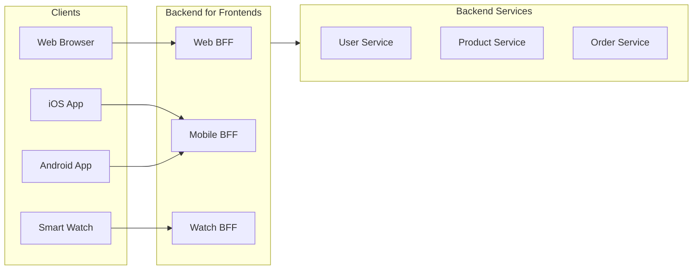
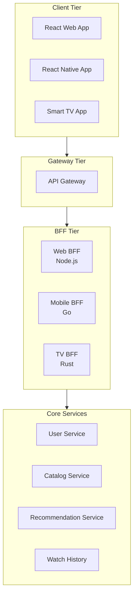
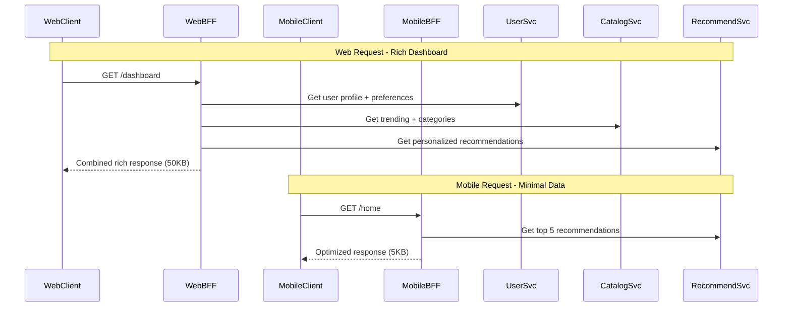
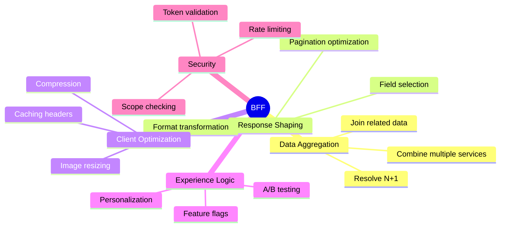
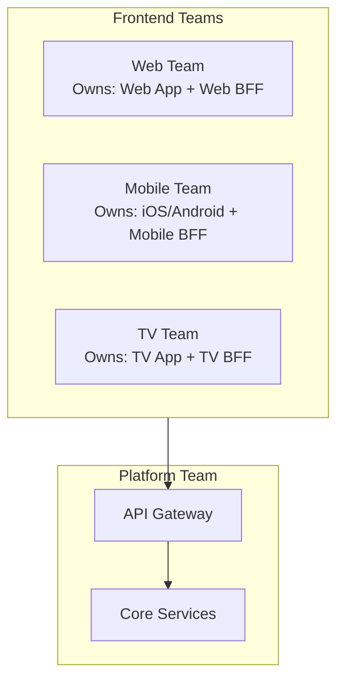

# Backend for Frontend (BFF) Pattern

## Overview

The **Backend for Frontend (BFF)** pattern creates dedicated backend services for each type of frontend client (web, mobile, IoT, etc.). Instead of a single API serving all clients, each client type gets an API optimized for its specific needs, performance constraints, and user experience requirements.

Coined by Phil Calçado at SoundCloud, BFF addresses the mismatch between general-purpose APIs and client-specific requirements.



---

## Why Use It

### Problems It Solves

1. **One-size-fits-all API**: Generic APIs poorly serve diverse clients
2. **Over-fetching on mobile**: Mobile apps receive unnecessary data
3. **Under-fetching on web**: Web apps need multiple calls for rich UIs
4. **Frontend-backend coupling**: Changes affect all clients
5. **Team bottlenecks**: Backend team blocks all frontend teams
6. **Performance variations**: Different clients need different optimizations

### Key Benefits

- **Client optimization** - Tailored responses for each platform
- **Team autonomy** - Frontend teams own their BFF
- **Independent evolution** - Clients evolve without affecting each other
- **Performance tuning** - Optimize for specific client constraints
- **Security customization** - Different auth flows per client
- **Technology freedom** - Each BFF can use optimal tech stack

---

## When to Use

### Ideal Scenarios

- **Multi-platform products**: Web + mobile + watch + TV
- **Diverse data requirements**: Rich web UI vs. minimal mobile UI
- **Different update cycles**: Mobile app store delays vs. web instant deploy
- **Varied performance needs**: Low-bandwidth mobile vs. fast desktop
- **Multiple frontend teams**: Parallel development without conflicts

### Use Case Examples

| Use Case | Why BFF Works Well |
|----------|-------------------|
| Spotify | Different UIs for desktop, mobile, car, watch |
| Netflix | TV, mobile, web have vastly different UX |
| Banking app | Web has full dashboard, mobile has quick actions |
| E-commerce | Mobile optimized checkout, web rich browsing |
| IoT dashboard | Minimal data for sensors, rich UI for admin |

---

## When NOT to Use

### Avoid BFF When

| Scenario | Better Alternative |
|----------|-------------------|
| Single client type | Standard API Gateway |
| Similar client needs | Shared API with field selection |
| Small team | Added complexity not justified |
| Simple CRUD | Over-engineering |

### Anti-Patterns

- **Logic duplication**: Core business logic shouldn't be in BFFs
- **BFF as database proxy**: BFFs should aggregate, not just pass through
- **Shared BFF code**: Defeats the purpose of independence
- **BFF bloat**: BFF shouldn't become a monolith

---

## How It Works

### Architecture



### Request Flow Comparison



### BFF Responsibilities



---

## Pros and Cons

### Pros

| Advantage | Description |
|-----------|-------------|
| **Optimized responses** | Each client gets exactly what it needs |
| **Team autonomy** | Frontend teams own their backend |
| **Independent deployment** | Change one client without affecting others |
| **Performance tuning** | Optimize for specific client constraints |
| **Simpler clients** | Complex aggregation happens server-side |
| **Technology freedom** | Choose best stack per client |

### Cons

| Disadvantage | Description | Mitigation |
|--------------|-------------|------------|
| **Code duplication** | Similar logic across BFFs | Shared libraries for common logic |
| **Increased complexity** | More services to maintain | Clear ownership, good tooling |
| **Operational overhead** | Multiple services to deploy/monitor | CI/CD automation, shared observability |
| **Potential inconsistency** | Different BFFs may diverge | Strong API contracts for core services |
| **Team coordination** | Need alignment on core service APIs | API governance, documentation |

---

## Implementation Example

### Web BFF (Node.js/TypeScript)

```typescript
// web-bff/src/server.ts
import express from 'express';
import axios from 'axios';

const app = express();

const SERVICES = {
  user: process.env.USER_SERVICE_URL || 'http://user-service:8080',
  catalog: process.env.CATALOG_SERVICE_URL || 'http://catalog-service:8080',
  recommendations: process.env.RECOMMEND_SERVICE_URL || 'http://recommend-service:8080',
  orders: process.env.ORDER_SERVICE_URL || 'http://order-service:8080',
};

interface User {
  id: string;
  name: string;
  email: string;
  preferences: Record<string, unknown>;
}

interface Product {
  id: string;
  name: string;
  price: number;
  images: string[];
  description: string;
}

interface WebDashboardResponse {
  user: {
    id: string;
    name: string;
    membershipLevel: string;
  };
  recommendations: Product[];
  recentOrders: Array<{
    id: string;
    total: number;
    status: string;
    itemCount: number;
  }>;
  trending: Product[];
  categories: Array<{ id: string; name: string; productCount: number }>;
}

// Web Dashboard - Rich aggregated response
app.get('/api/dashboard', async (req, res) => {
  const userId = req.headers['x-user-id'] as string;

  try {
    // Parallel fetching for performance
    const [userRes, recommendRes, ordersRes, trendingRes, categoriesRes] = await Promise.all([
      axios.get(`${SERVICES.user}/users/${userId}`),
      axios.get(`${SERVICES.recommendations}/users/${userId}/recommendations?limit=20`),
      axios.get(`${SERVICES.orders}/users/${userId}/orders?limit=5`),
      axios.get(`${SERVICES.catalog}/products/trending?limit=10`),
      axios.get(`${SERVICES.catalog}/categories`),
    ]);

    // Shape response for web client
    const response: WebDashboardResponse = {
      user: {
        id: userRes.data.id,
        name: userRes.data.name,
        membershipLevel: userRes.data.preferences?.membershipLevel || 'standard',
      },
      recommendations: recommendRes.data.map((p: Product) => ({
        id: p.id,
        name: p.name,
        price: p.price,
        image: p.images[0], // Full-size for web
        description: p.description,
      })),
      recentOrders: ordersRes.data.map((o: any) => ({
        id: o.id,
        total: o.total,
        status: o.status,
        itemCount: o.items.length,
      })),
      trending: trendingRes.data,
      categories: categoriesRes.data,
    };

    // Long cache for web - can invalidate via CDN
    res.set('Cache-Control', 'private, max-age=300');
    res.json(response);
  } catch (error) {
    console.error('Dashboard fetch error:', error);
    res.status(500).json({ error: 'Failed to load dashboard' });
  }
});

// Product detail - Full information for web
app.get('/api/products/:id', async (req, res) => {
  const { id } = req.params;
  const userId = req.headers['x-user-id'] as string;

  try {
    const [productRes, reviewsRes, relatedRes] = await Promise.all([
      axios.get(`${SERVICES.catalog}/products/${id}`),
      axios.get(`${SERVICES.catalog}/products/${id}/reviews?limit=10`),
      axios.get(`${SERVICES.recommendations}/products/${id}/related?limit=6`),
    ]);

    res.json({
      ...productRes.data,
      reviews: reviewsRes.data,
      relatedProducts: relatedRes.data,
      // Include all images for web gallery
      images: productRes.data.images,
    });
  } catch (error) {
    res.status(500).json({ error: 'Failed to load product' });
  }
});

app.listen(3000, () => {
  console.log('Web BFF listening on port 3000');
});
```

### Mobile BFF (Go)

```go
// mobile-bff/main.go
package main

import (
    "encoding/json"
    "fmt"
    "log"
    "net/http"
    "sync"
)

type MobileHomeResponse struct {
    UserName        string             `json:"userName"`
    Recommendations []MobileProduct    `json:"recommendations"`
    QuickActions    []QuickAction      `json:"quickActions"`
}

type MobileProduct struct {
    ID        string  `json:"id"`
    Name      string  `json:"name"`
    Price     float64 `json:"price"`
    Thumbnail string  `json:"thumbnail"` // Small image for mobile
}

type QuickAction struct {
    Type  string `json:"type"`
    Label string `json:"label"`
    Count int    `json:"count,omitempty"`
}

var (
    userServiceURL      = getEnv("USER_SERVICE_URL", "http://user-service:8080")
    recommendServiceURL = getEnv("RECOMMEND_SERVICE_URL", "http://recommend-service:8080")
    orderServiceURL     = getEnv("ORDER_SERVICE_URL", "http://order-service:8080")
)

func getEnv(key, fallback string) string {
    // Implementation omitted for brevity
    return fallback
}

// Mobile Home - Minimal, optimized response
func homeHandler(w http.ResponseWriter, r *http.Request) {
    userID := r.Header.Get("X-User-ID")

    var (
        wg           sync.WaitGroup
        userName     string
        recommendations []MobileProduct
        pendingOrders   int
    )

    wg.Add(3)

    // Fetch user name only (not full profile)
    go func() {
        defer wg.Done()
        resp, err := http.Get(fmt.Sprintf("%s/users/%s?fields=name", userServiceURL, userID))
        if err != nil {
            return
        }
        defer resp.Body.Close()

        var user struct{ Name string `json:"name"` }
        json.NewDecoder(resp.Body).Decode(&user)
        userName = user.Name
    }()

    // Fetch only 5 recommendations for mobile
    go func() {
        defer wg.Done()
        resp, err := http.Get(fmt.Sprintf("%s/users/%s/recommendations?limit=5", recommendServiceURL, userID))
        if err != nil {
            return
        }
        defer resp.Body.Close()

        var products []struct {
            ID     string   `json:"id"`
            Name   string   `json:"name"`
            Price  float64  `json:"price"`
            Images []string `json:"images"`
        }
        json.NewDecoder(resp.Body).Decode(&products)

        // Transform to mobile format with thumbnails
        for _, p := range products {
            thumbnail := ""
            if len(p.Images) > 0 {
                // Use thumbnail version for mobile bandwidth
                thumbnail = p.Images[0] + "?w=200&h=200&fit=crop"
            }
            recommendations = append(recommendations, MobileProduct{
                ID:        p.ID,
                Name:      p.Name,
                Price:     p.Price,
                Thumbnail: thumbnail,
            })
        }
    }()

    // Get pending order count for badge
    go func() {
        defer wg.Done()
        resp, err := http.Get(fmt.Sprintf("%s/users/%s/orders?status=pending&count_only=true", orderServiceURL, userID))
        if err != nil {
            return
        }
        defer resp.Body.Close()

        var result struct{ Count int `json:"count"` }
        json.NewDecoder(resp.Body).Decode(&result)
        pendingOrders = result.Count
    }()

    wg.Wait()

    response := MobileHomeResponse{
        UserName:        userName,
        Recommendations: recommendations,
        QuickActions: []QuickAction{
            {Type: "orders", Label: "My Orders", Count: pendingOrders},
            {Type: "wishlist", Label: "Wishlist"},
            {Type: "support", Label: "Help"},
        },
    }

    // Short cache for mobile - data changes more frequently
    w.Header().Set("Cache-Control", "private, max-age=60")
    w.Header().Set("Content-Type", "application/json")
    json.NewEncoder(w).Encode(response)
}

// Mobile Product - Minimal details
func productHandler(w http.ResponseWriter, r *http.Request) {
    productID := r.URL.Query().Get("id")

    resp, err := http.Get(fmt.Sprintf("%s/products/%s", catalogServiceURL, productID))
    if err != nil {
        http.Error(w, "Product not found", http.StatusNotFound)
        return
    }
    defer resp.Body.Close()

    var product struct {
        ID          string   `json:"id"`
        Name        string   `json:"name"`
        Price       float64  `json:"price"`
        Images      []string `json:"images"`
        Description string   `json:"description"`
    }
    json.NewDecoder(resp.Body).Decode(&product)

    // Return mobile-optimized response
    mobileProduct := map[string]interface{}{
        "id":    product.ID,
        "name":  product.Name,
        "price": product.Price,
        // Single optimized image for mobile
        "image": product.Images[0] + "?w=400&h=400&fit=crop",
        // Truncated description for mobile
        "description": truncate(product.Description, 200),
    }

    w.Header().Set("Content-Type", "application/json")
    json.NewEncoder(w).Encode(mobileProduct)
}

func truncate(s string, maxLen int) string {
    if len(s) <= maxLen {
        return s
    }
    return s[:maxLen] + "..."
}

var catalogServiceURL = getEnv("CATALOG_SERVICE_URL", "http://catalog-service:8080")

func main() {
    http.HandleFunc("/api/home", homeHandler)
    http.HandleFunc("/api/product", productHandler)

    log.Println("Mobile BFF listening on port 3001")
    log.Fatal(http.ListenAndServe(":3001", nil))
}
```

### Shared Library for Core Service Clients

```python
# shared/service_clients.py
"""
Shared service client library used by all BFFs.
Contains HTTP clients, retry logic, and common data types.
BFFs use this but add their own response shaping.
"""

import httpx
from typing import Optional, List
from dataclasses import dataclass
from tenacity import retry, stop_after_attempt, wait_exponential

@dataclass
class User:
    id: str
    name: str
    email: str
    preferences: dict

@dataclass
class Product:
    id: str
    name: str
    price: float
    images: List[str]
    description: str

class ServiceClient:
    def __init__(self, base_url: str, timeout: float = 5.0):
        self.base_url = base_url
        self.timeout = timeout
        self.client = httpx.AsyncClient(
            base_url=base_url,
            timeout=timeout,
        )

    @retry(
        stop=stop_after_attempt(3),
        wait=wait_exponential(multiplier=1, min=1, max=10)
    )
    async def get(self, path: str, **kwargs) -> dict:
        response = await self.client.get(path, **kwargs)
        response.raise_for_status()
        return response.json()

class UserServiceClient(ServiceClient):
    async def get_user(self, user_id: str, fields: Optional[List[str]] = None) -> User:
        params = {}
        if fields:
            params["fields"] = ",".join(fields)
        data = await self.get(f"/users/{user_id}", params=params)
        return User(**data)

class CatalogServiceClient(ServiceClient):
    async def get_product(self, product_id: str) -> Product:
        data = await self.get(f"/products/{product_id}")
        return Product(**data)

    async def get_trending(self, limit: int = 10) -> List[Product]:
        data = await self.get(f"/products/trending", params={"limit": limit})
        return [Product(**p) for p in data]
```

---

## Real-World Examples

| Company | Implementation | Details |
|---------|----------------|---------|
| **SoundCloud** | Originated BFF | Separate BFFs for web, mobile, embedded |
| **Netflix** | Node.js BFFs | Different optimizations for TV, mobile, web |
| **Spotify** | Multiple BFFs | Desktop, mobile, car, Alexa, watch |
| **Airbnb** | GraphQL BFFs | Client-specific GraphQL schemas |
| **Uber** | BFF per platform | Driver app, rider app, web dashboard |

### Team Structure



---

## Related Patterns

- [API Gateway](./api-gateway.md) - Often used in front of BFFs
- [Aggregator](./aggregator-pattern.md) - BFFs often aggregate data
- [GraphQL](../01-api-communication-styles/graphql.md) - Alternative approach to client-specific queries
- [CQRS](../04-data-patterns/cqrs.md) - BFFs often implement query-side optimization

---

## Further Reading

- [Pattern: Backends For Frontends - Sam Newman](https://samnewman.io/patterns/architectural/bff/)
- [BFF @ SoundCloud - Phil Calçado](https://philcalcado.com/2015/09/18/the_back_end_for_front_end_pattern_bff.html)
- [Netflix API Gateway Evolution](https://netflixtechblog.com/)
- [Micro Frontends](https://micro-frontends.org/)
