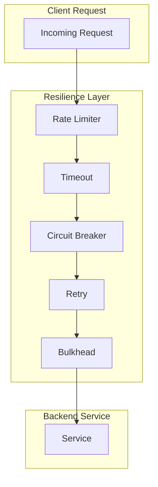
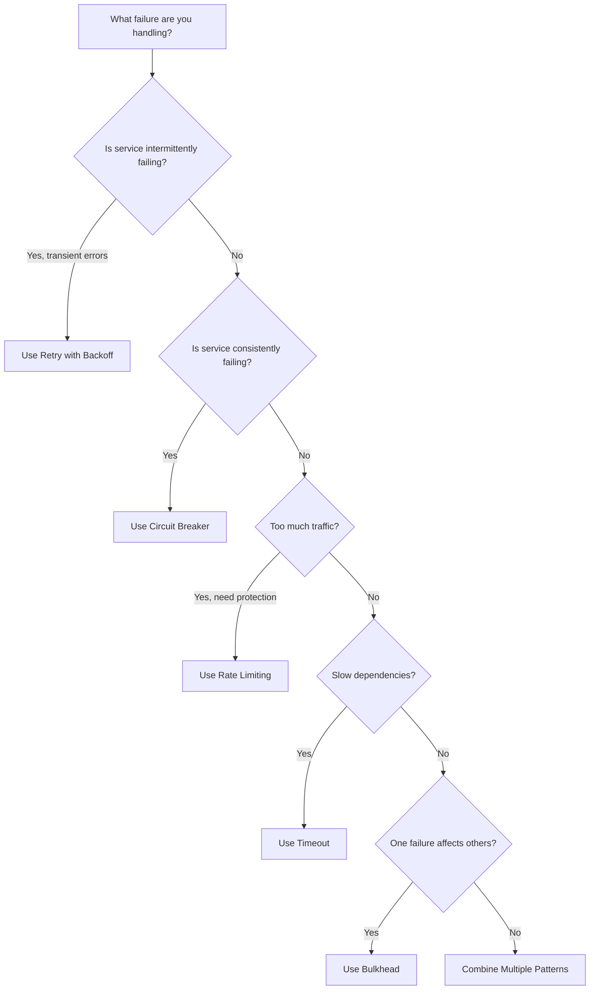
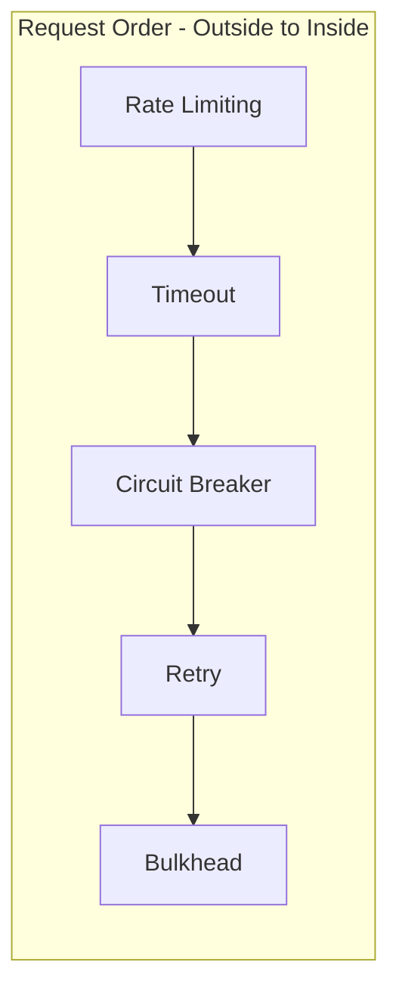
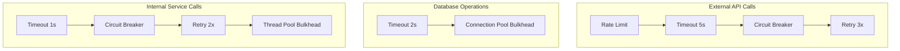

# Resilience Patterns

This section covers patterns for building fault-tolerant distributed systems. These patterns help your system gracefully handle failures, prevent cascading outages, and maintain availability even when individual components fail.

## Overview

## Patterns in This Category

| Pattern | Document | Best For |
|---------|----------|----------|
| Circuit Breaker | [circuit-breaker.md](./circuit-breaker.md) | Preventing cascading failures |
| Retry with Backoff | [retry-with-backoff.md](./retry-with-backoff.md) | Handling transient failures |
| Bulkhead | [bulkhead.md](./bulkhead.md) | Isolating failure domains |
| Rate Limiting | [rate-limiting.md](./rate-limiting.md) | Protecting against traffic spikes |
| Timeout | [timeout-pattern.md](./timeout-pattern.md) | Preventing hung operations |

## Comparison Matrix

| Aspect | Circuit Breaker | Retry | Bulkhead | Rate Limiting | Timeout |
|--------|-----------------|-------|----------|---------------|---------|
| **Problem Solved** | Cascading failures | Transient errors | Resource exhaustion | Traffic overload | Hung connections |
| **Failure Response** | Fail fast | Retry operation | Limit concurrency | Reject excess | Abort operation |
| **Stateful** | Yes | No | Yes | Yes | No |
| **Scope** | Per dependency | Per request | Per resource pool | Per client/API | Per operation |
| **Recovery** | Automatic | Immediate | On completion | On window reset | N/A |

## Pattern Selection Guide

## The Resilience Stack

Most production systems layer these patterns together:

**Why this order:**

1. **Rate Limiting** - Reject excess traffic first
2. **Timeout** - Set maximum wait time for the request
3. **Circuit Breaker** - Check if dependency is healthy
4. **Retry** - Attempt operation with backoff
5. **Bulkhead** - Execute within isolated resource pool

## Decision Framework

### When to Use Each Pattern

| Scenario | Recommended Pattern(s) |
|----------|------------------------|
| Third-party API calls | Circuit Breaker + Retry + Timeout |
| Database connections | Bulkhead + Timeout |
| Public API protection | Rate Limiting |
| Microservice calls | All five patterns |
| Batch processing | Retry + Timeout |
| Real-time requests | Timeout + Circuit Breaker |

### Pattern Combinations

## Failure Scenarios and Responses

| Failure Type | Pattern | System Response |
|--------------|---------|-----------------|
| Network timeout | Timeout | Return error after limit |
| Service down | Circuit Breaker | Fail fast, don't attempt |
| Temporary glitch | Retry | Retry with exponential backoff |
| Traffic spike | Rate Limiting | Queue or reject excess |
| Thread exhaustion | Bulkhead | Fail isolated pool only |
| DDoS attack | Rate Limiting | Reject at edge |
| Slow dependency | Timeout + Circuit Breaker | Timeout, then open circuit |

## Metrics to Monitor

All resilience patterns should expose metrics:

| Metric | Description | Alert Threshold |
|--------|-------------|-----------------|
| `circuit_breaker_state` | Open/Closed/Half-Open | State changes |
| `retry_attempts` | Number of retries | > 2x baseline |
| `timeout_count` | Requests that timed out | > 5% of traffic |
| `rate_limit_rejected` | Rejected requests | > 10% of traffic |
| `bulkhead_rejected` | Rejected due to full pool | Any rejections |

## Library Support

| Language | Library | Patterns Supported |
|----------|---------|-------------------|
| Java | Resilience4j | All 5 patterns |
| Python | tenacity, pybreaker | Retry, Circuit Breaker |
| Go | sony/gobreaker, hashicorp/go-retryablehttp | Circuit Breaker, Retry |
| Node.js | opossum, cockatiel | All 5 patterns |
| .NET | Polly | All 5 patterns |

## Related Patterns

- [API Gateway](../02-api-gateway-patterns/api-gateway.md) - Apply resilience at gateway
- [Service Mesh](../06-service-discovery-mesh/service-mesh.md) - Infrastructure-level resilience
- [Message Queue](../05-messaging-patterns/message-queue.md) - Decouple for resilience
- [CQRS](../04-data-patterns/cqrs.md) - Separate read/write for availability
