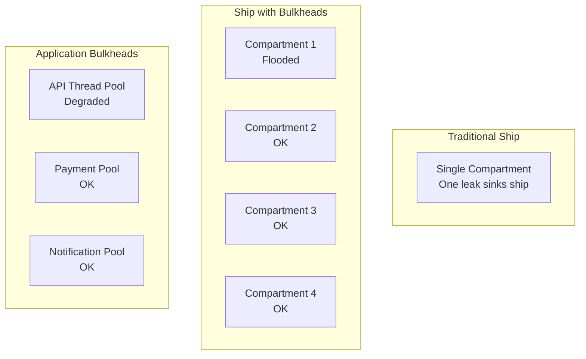
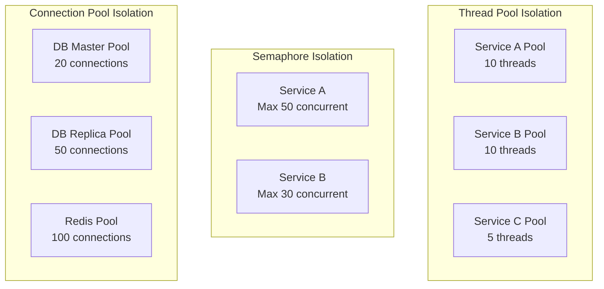
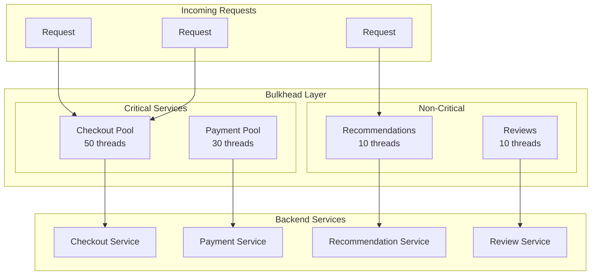
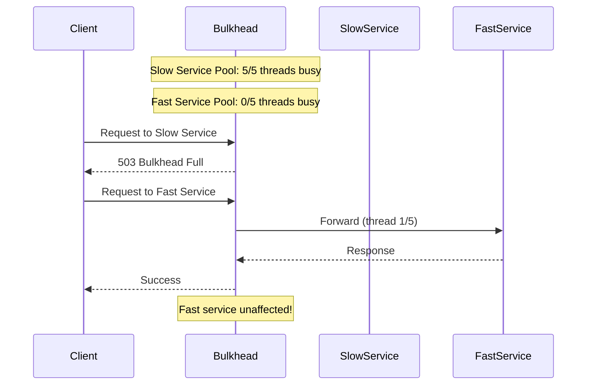

# Bulkhead Pattern

## Overview

The **Bulkhead Pattern** isolates elements of an application into pools so that if one fails, the others continue to function. Named after the watertight compartments (bulkheads) in ships that prevent flooding from sinking the entire vessel, this pattern prevents a failure in one part of the system from cascading to other parts.

By limiting the resources (threads, connections, memory) available to each component, bulkheads ensure that a struggling or failing component cannot exhaust shared resources.



---

## Why Use It

### Problems It Solves

1. **Thread pool exhaustion**: One slow service blocking all threads
2. **Connection pool starvation**: One DB query hogging all connections
3. **Memory exhaustion**: One feature consuming all memory
4. **Cascading failures**: One component failure affecting all
5. **Noisy neighbor**: One tenant impacting others in multi-tenant systems

### Key Benefits

- **Fault isolation** - Failures contained to their compartment
- **Predictable behavior** - Known resource limits per component
- **Graceful degradation** - Other features work when one fails
- **Fair resource allocation** - Prevents resource hogging
- **Better observability** - Clear resource usage per component

---

## When to Use

### Ideal Scenarios

- **Critical vs. non-critical paths**: Isolate checkout from recommendations
- **Multiple external dependencies**: Separate pools per service
- **Multi-tenant systems**: Isolate tenants from each other
- **Mixed workloads**: Separate fast reads from slow writes
- **Different SLAs**: Higher limits for premium services

### Use Case Examples

| Use Case | Bulkhead Strategy |
|----------|-------------------|
| E-commerce | Separate pools for checkout, browse, search |
| Multi-tenant SaaS | Per-tenant connection pools |
| Microservices | Thread pool per downstream service |
| Database | Separate pools for OLTP vs. analytics |
| API Gateway | Per-route or per-client rate pools |

---

## When NOT to Use

### Avoid Bulkhead When

| Scenario | Why | Alternative |
|----------|-----|-------------|
| Single dependency | No isolation benefit | Circuit breaker |
| Very small services | Overhead not justified | Simple concurrency limits |
| Stateless operations | No shared resources | Horizontal scaling |
| Uniform workloads | All requests similar | Global limits |

### Anti-Patterns

- **Too many bulkheads**: Increases complexity, fragments resources
- **Too small pools**: Artificial bottlenecks
- **No monitoring**: Can't see when bulkheads are saturated
- **Static sizing**: Doesn't adapt to traffic patterns

---

## How It Works

### Types of Bulkheads



### Architecture



### Bulkhead Behavior



---

## Pros and Cons

### Pros

| Advantage | Description |
|-----------|-------------|
| **Fault isolation** | Failures don't cascade |
| **Predictable limits** | Known capacity per component |
| **Fair sharing** | Prevents resource hogging |
| **Graceful degradation** | Partial functionality maintained |
| **Clear ownership** | Resources tied to components |

### Cons

| Disadvantage | Description | Mitigation |
|--------------|-------------|------------|
| **Resource fragmentation** | Unused capacity in one pool | Dynamic sizing |
| **Complexity** | More pools to manage | Good tooling, automation |
| **Tuning difficulty** | Wrong sizes cause issues | Monitor and adjust |
| **Cold start** | Pools need initialization | Pre-warming |

---

## Implementation Example

### Python (Thread Pool Bulkhead)

```python
import threading
from concurrent.futures import ThreadPoolExecutor, TimeoutError as FuturesTimeoutError
from typing import Callable, TypeVar, Dict, Optional
from dataclasses import dataclass
import time

T = TypeVar('T')

@dataclass
class BulkheadConfig:
    max_concurrent_calls: int = 10
    max_wait_duration: float = 1.0  # seconds
    name: str = "default"

class BulkheadFullError(Exception):
    """Raised when bulkhead cannot accept more requests."""
    pass

class Bulkhead:
    """Thread pool based bulkhead for resource isolation."""

    def __init__(self, config: BulkheadConfig):
        self.config = config
        self.executor = ThreadPoolExecutor(
            max_workers=config.max_concurrent_calls,
            thread_name_prefix=f"bulkhead-{config.name}"
        )
        self.semaphore = threading.Semaphore(config.max_concurrent_calls)
        self._active_calls = 0
        self._lock = threading.Lock()

    @property
    def active_calls(self) -> int:
        with self._lock:
            return self._active_calls

    @property
    def available_permits(self) -> int:
        return self.config.max_concurrent_calls - self.active_calls

    def execute(
        self,
        func: Callable[[], T],
        timeout: Optional[float] = None
    ) -> T:
        """Execute function within bulkhead limits."""

        # Try to acquire permit with timeout
        acquired = self.semaphore.acquire(
            blocking=True,
            timeout=self.config.max_wait_duration
        )

        if not acquired:
            raise BulkheadFullError(
                f"Bulkhead '{self.config.name}' is full. "
                f"Max concurrent calls: {self.config.max_concurrent_calls}"
            )

        with self._lock:
            self._active_calls += 1

        try:
            future = self.executor.submit(func)
            return future.result(timeout=timeout)
        except FuturesTimeoutError:
            raise TimeoutError(f"Operation timed out in bulkhead '{self.config.name}'")
        finally:
            with self._lock:
                self._active_calls -= 1
            self.semaphore.release()

    def get_metrics(self) -> dict:
        return {
            "name": self.config.name,
            "max_concurrent": self.config.max_concurrent_calls,
            "active_calls": self.active_calls,
            "available_permits": self.available_permits,
        }

# Bulkhead registry for managing multiple bulkheads
class BulkheadRegistry:
    def __init__(self):
        self._bulkheads: Dict[str, Bulkhead] = {}
        self._lock = threading.Lock()

    def get_or_create(
        self,
        name: str,
        config: Optional[BulkheadConfig] = None
    ) -> Bulkhead:
        with self._lock:
            if name not in self._bulkheads:
                if config is None:
                    config = BulkheadConfig(name=name)
                self._bulkheads[name] = Bulkhead(config)
            return self._bulkheads[name]

    def get_all_metrics(self) -> Dict[str, dict]:
        return {
            name: bulkhead.get_metrics()
            for name, bulkhead in self._bulkheads.items()
        }

# Global registry
registry = BulkheadRegistry()

# Decorator for bulkhead protection
def bulkhead(
    name: str,
    max_concurrent: int = 10,
    max_wait: float = 1.0,
    timeout: Optional[float] = None
):
    """Decorator to wrap function in bulkhead."""
    config = BulkheadConfig(
        name=name,
        max_concurrent_calls=max_concurrent,
        max_wait_duration=max_wait
    )
    bh = registry.get_or_create(name, config)

    def decorator(func: Callable):
        def wrapper(*args, **kwargs):
            return bh.execute(
                lambda: func(*args, **kwargs),
                timeout=timeout
            )
        return wrapper
    return decorator

# Usage example
@bulkhead(name="payment-service", max_concurrent=5, max_wait=2.0)
def process_payment(order_id: str) -> dict:
    # Simulate slow payment processing
    time.sleep(2)
    return {"order_id": order_id, "status": "paid"}

@bulkhead(name="recommendation-service", max_concurrent=20, max_wait=0.5)
def get_recommendations(user_id: str) -> list:
    # Fast recommendations
    time.sleep(0.1)
    return [{"product_id": "123"}, {"product_id": "456"}]

# Service with multiple bulkheads
class OrderService:
    def __init__(self):
        self.payment_bulkhead = registry.get_or_create(
            "payment",
            BulkheadConfig(max_concurrent_calls=5, max_wait_duration=2.0, name="payment")
        )
        self.inventory_bulkhead = registry.get_or_create(
            "inventory",
            BulkheadConfig(max_concurrent_calls=10, max_wait_duration=1.0, name="inventory")
        )

    def process_order(self, order: dict) -> dict:
        # Check inventory (fast, higher concurrency)
        try:
            inventory = self.inventory_bulkhead.execute(
                lambda: self._check_inventory(order["items"])
            )
        except BulkheadFullError:
            return {"status": "error", "message": "Inventory check unavailable"}

        # Process payment (slow, lower concurrency)
        try:
            payment = self.payment_bulkhead.execute(
                lambda: self._process_payment(order["payment_info"]),
                timeout=5.0
            )
        except BulkheadFullError:
            return {"status": "error", "message": "Payment processing busy"}

        return {"status": "success", "payment": payment, "inventory": inventory}

    def _check_inventory(self, items: list) -> dict:
        time.sleep(0.1)
        return {"available": True}

    def _process_payment(self, payment_info: dict) -> dict:
        time.sleep(2)
        return {"transaction_id": "txn_123"}
```

### Go (Semaphore Bulkhead)

```go
package main

import (
    "context"
    "errors"
    "fmt"
    "sync"
    "sync/atomic"
    "time"
)

var ErrBulkheadFull = errors.New("bulkhead is full")

type BulkheadConfig struct {
    Name               string
    MaxConcurrentCalls int
    MaxWaitDuration    time.Duration
}

type Bulkhead struct {
    config      BulkheadConfig
    semaphore   chan struct{}
    activeCalls int64
}

func NewBulkhead(config BulkheadConfig) *Bulkhead {
    return &Bulkhead{
        config:    config,
        semaphore: make(chan struct{}, config.MaxConcurrentCalls),
    }
}

func (b *Bulkhead) Execute(ctx context.Context, fn func() (interface{}, error)) (interface{}, error) {
    // Try to acquire permit with timeout
    select {
    case b.semaphore <- struct{}{}:
        // Acquired permit
        atomic.AddInt64(&b.activeCalls, 1)
        defer func() {
            <-b.semaphore
            atomic.AddInt64(&b.activeCalls, -1)
        }()

        return fn()

    case <-time.After(b.config.MaxWaitDuration):
        return nil, fmt.Errorf("%w: %s", ErrBulkheadFull, b.config.Name)

    case <-ctx.Done():
        return nil, ctx.Err()
    }
}

func (b *Bulkhead) ActiveCalls() int64 {
    return atomic.LoadInt64(&b.activeCalls)
}

func (b *Bulkhead) AvailablePermits() int {
    return b.config.MaxConcurrentCalls - int(b.ActiveCalls())
}

type Metrics struct {
    Name             string
    MaxConcurrent    int
    ActiveCalls      int64
    AvailablePermits int
}

func (b *Bulkhead) GetMetrics() Metrics {
    return Metrics{
        Name:             b.config.Name,
        MaxConcurrent:    b.config.MaxConcurrentCalls,
        ActiveCalls:      b.ActiveCalls(),
        AvailablePermits: b.AvailablePermits(),
    }
}

// BulkheadRegistry manages multiple bulkheads
type BulkheadRegistry struct {
    bulkheads map[string]*Bulkhead
    mu        sync.RWMutex
}

func NewBulkheadRegistry() *BulkheadRegistry {
    return &BulkheadRegistry{
        bulkheads: make(map[string]*Bulkhead),
    }
}

func (r *BulkheadRegistry) GetOrCreate(name string, config BulkheadConfig) *Bulkhead {
    r.mu.RLock()
    if b, exists := r.bulkheads[name]; exists {
        r.mu.RUnlock()
        return b
    }
    r.mu.RUnlock()

    r.mu.Lock()
    defer r.mu.Unlock()

    // Double-check after acquiring write lock
    if b, exists := r.bulkheads[name]; exists {
        return b
    }

    config.Name = name
    b := NewBulkhead(config)
    r.bulkheads[name] = b
    return b
}

func (r *BulkheadRegistry) GetAllMetrics() map[string]Metrics {
    r.mu.RLock()
    defer r.mu.RUnlock()

    metrics := make(map[string]Metrics)
    for name, b := range r.bulkheads {
        metrics[name] = b.GetMetrics()
    }
    return metrics
}

// OrderService using bulkheads
type OrderService struct {
    paymentBulkhead   *Bulkhead
    inventoryBulkhead *Bulkhead
}

func NewOrderService(registry *BulkheadRegistry) *OrderService {
    return &OrderService{
        paymentBulkhead: registry.GetOrCreate("payment", BulkheadConfig{
            MaxConcurrentCalls: 5,
            MaxWaitDuration:    2 * time.Second,
        }),
        inventoryBulkhead: registry.GetOrCreate("inventory", BulkheadConfig{
            MaxConcurrentCalls: 20,
            MaxWaitDuration:    500 * time.Millisecond,
        }),
    }
}

func (s *OrderService) ProcessOrder(ctx context.Context, orderID string) (map[string]interface{}, error) {
    result := make(map[string]interface{})

    // Check inventory (bulkheaded)
    inventoryResult, err := s.inventoryBulkhead.Execute(ctx, func() (interface{}, error) {
        return s.checkInventory(orderID)
    })
    if err != nil {
        if errors.Is(err, ErrBulkheadFull) {
            return nil, fmt.Errorf("inventory service busy, please retry")
        }
        return nil, err
    }
    result["inventory"] = inventoryResult

    // Process payment (bulkheaded)
    paymentResult, err := s.paymentBulkhead.Execute(ctx, func() (interface{}, error) {
        return s.processPayment(orderID)
    })
    if err != nil {
        if errors.Is(err, ErrBulkheadFull) {
            return nil, fmt.Errorf("payment processing busy, please retry")
        }
        return nil, err
    }
    result["payment"] = paymentResult

    return result, nil
}

func (s *OrderService) checkInventory(orderID string) (map[string]bool, error) {
    time.Sleep(100 * time.Millisecond) // Simulate fast check
    return map[string]bool{"available": true}, nil
}

func (s *OrderService) processPayment(orderID string) (map[string]string, error) {
    time.Sleep(2 * time.Second) // Simulate slow payment
    return map[string]string{"transaction_id": "txn_" + orderID}, nil
}

func main() {
    registry := NewBulkheadRegistry()
    service := NewOrderService(registry)

    ctx := context.Background()

    // Simulate concurrent requests
    var wg sync.WaitGroup
    for i := 0; i < 10; i++ {
        wg.Add(1)
        go func(id int) {
            defer wg.Done()
            result, err := service.ProcessOrder(ctx, fmt.Sprintf("order_%d", id))
            if err != nil {
                fmt.Printf("Order %d failed: %v\n", id, err)
            } else {
                fmt.Printf("Order %d succeeded: %v\n", id, result)
            }
        }(i)
    }

    wg.Wait()

    // Print metrics
    fmt.Println("\nBulkhead Metrics:")
    for name, metrics := range registry.GetAllMetrics() {
        fmt.Printf("  %s: active=%d, available=%d\n",
            name, metrics.ActiveCalls, metrics.AvailablePermits)
    }
}
```

---

## Real-World Examples

| Company | Implementation | Use Case |
|---------|----------------|----------|
| **Netflix** | Hystrix (thread pools) | Isolate each external dependency |
| **Amazon** | Per-service connection pools | Database isolation |
| **Uber** | Separate thread pools | Driver matching vs. pricing |
| **LinkedIn** | Feed vs. notifications | Critical path isolation |

### Netflix's Approach

1. Thread pool per external service call
2. Semaphore for in-memory operations
3. Configurable queue sizes
4. Real-time monitoring of pool saturation

---

## Related Patterns

- [Circuit Breaker](./circuit-breaker.md) - Fail fast when bulkhead is saturated
- [Rate Limiting](./rate-limiting.md) - External protection
- [Timeout](./timeout-pattern.md) - Prevent thread blocking
- [Retry](./retry-with-backoff.md) - Retry on bulkhead rejection
- [CQRS](../04-data-patterns/cqrs.md) - Separate read/write resource pools

---

## Further Reading

- [Release It! - Michael Nygard](https://pragprog.com/titles/mnee2/release-it-second-edition/)
- [Resilience4j Bulkhead](https://resilience4j.readme.io/docs/bulkhead)
- [Hystrix Isolation](https://github.com/Netflix/Hystrix/wiki/How-it-Works#isolation)
- [Bulkhead Pattern - Microsoft](https://docs.microsoft.com/en-us/azure/architecture/patterns/bulkhead)
