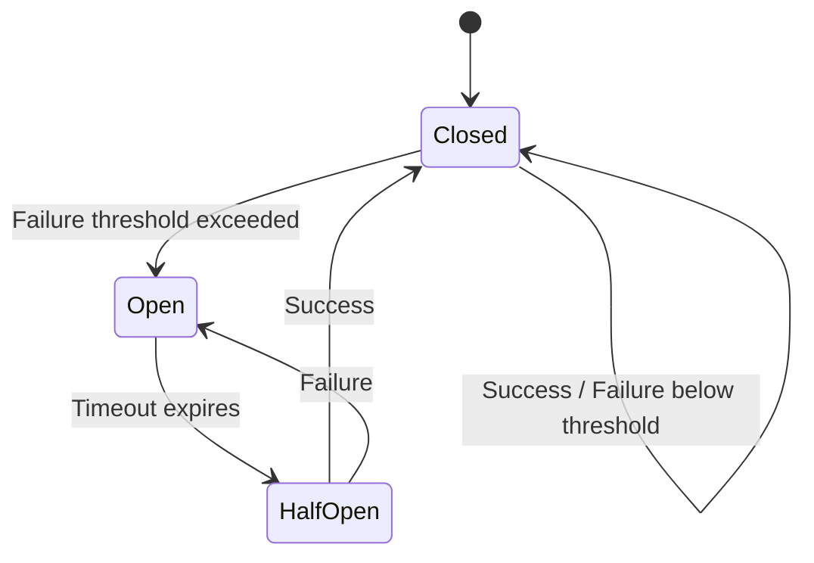
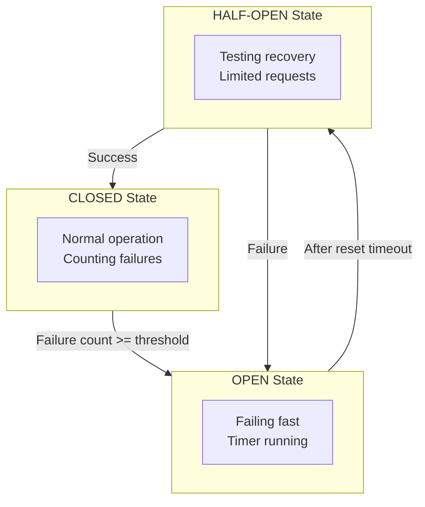
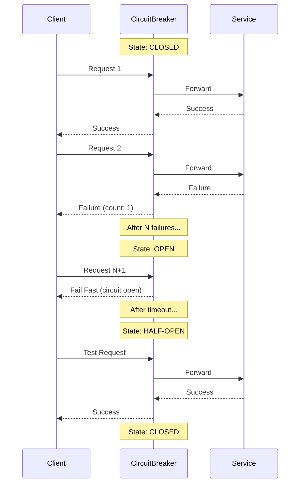

# Circuit Breaker Pattern

## Overview

The **Circuit Breaker** pattern prevents an application from repeatedly trying to execute an operation that's likely to fail. Like an electrical circuit breaker, it "trips" when failures exceed a threshold, causing subsequent calls to fail immediately without attempting the operation. After a timeout period, it allows a test request through to see if the underlying problem is resolved.

This pattern prevents cascading failures across distributed systems and allows failing services time to recover.



---

## Why Use It

### Problems It Solves

1. **Cascading failures**: One failing service brings down others
2. **Resource exhaustion**: Threads/connections blocked on failing calls
3. **Slow failures**: Waiting for timeouts on every request
4. **Recovery prevention**: Overwhelming a recovering service with requests
5. **User experience**: Long waits before errors

### Key Benefits

- **Fail fast** - Immediate failure instead of waiting
- **Resource protection** - Free threads/connections during outages
- **Self-healing** - Automatic recovery detection
- **Graceful degradation** - Return cached/default data when open
- **Observability** - Clear visibility into system health

---

## When to Use

### Ideal Scenarios

- **External API calls**: Third-party services may be unreliable
- **Database connections**: Prevent connection pool exhaustion
- **Microservice calls**: Protect against downstream failures
- **File system access**: Handle disk I/O failures
- **Network operations**: Any remote call that can fail

### Use Case Examples

| Use Case | Why Circuit Breaker Works Well |
|----------|-------------------------------|
| Payment gateway | Fail fast when provider is down |
| Inventory service | Don't block orders on slow inventory |
| Email service | Allow checkout even if emails fail |
| Search service | Return cached results when search fails |
| Recommendation engine | Show default recommendations if service down |

---

## When NOT to Use

### Avoid Circuit Breaker When

| Scenario | Better Alternative |
|----------|-------------------|
| Local operations | Direct error handling |
| Idempotent fire-and-forget | Message queue |
| Static resources | Caching |
| Critical path that must complete | Retry with queue |

### Anti-Patterns

- **Circuit breaker per request**: Should be per dependency
- **Too short timeout**: Opens during normal latency spikes
- **Too long timeout**: Slow to recover
- **No fallback**: Should provide degraded response when open

---

## How It Works

### State Machine



### Request Flow



### Configuration Parameters

| Parameter | Description | Typical Value |
|-----------|-------------|---------------|
| `failure_threshold` | Failures before opening | 5-10 |
| `success_threshold` | Successes to close in half-open | 2-5 |
| `reset_timeout` | Time before trying half-open | 30-60 seconds |
| `monitoring_window` | Sliding window for failure count | 10 seconds - 1 minute |
| `slow_call_threshold` | Calls slower than X count as failures | 5 seconds |

---

## Pros and Cons

### Pros

| Advantage | Description |
|-----------|-------------|
| **Fail fast** | No waiting for doomed requests |
| **Self-healing** | Automatically detects recovery |
| **Resource protection** | Prevents thread/connection exhaustion |
| **Graceful degradation** | Fallback responses possible |
| **Visibility** | Clear state for monitoring |

### Cons

| Disadvantage | Description | Mitigation |
|--------------|-------------|------------|
| **State management** | Need to share state in distributed systems | Centralized state (Redis) or per-instance |
| **Tuning complexity** | Wrong thresholds cause issues | Start conservative, tune with data |
| **False positives** | May open during normal spikes | Use sliding windows, slow call detection |
| **Cascading opens** | One circuit opening triggers others | Independent circuits per dependency |

---

## Implementation Example

### Python (Custom Implementation)

```python
import time
from enum import Enum
from threading import Lock
from typing import Callable, Optional, TypeVar, Generic
from dataclasses import dataclass, field
from collections import deque

T = TypeVar('T')

class CircuitState(Enum):
    CLOSED = "closed"
    OPEN = "open"
    HALF_OPEN = "half_open"

@dataclass
class CircuitBreakerConfig:
    failure_threshold: int = 5
    success_threshold: int = 2
    reset_timeout_seconds: float = 30.0
    slow_call_threshold_seconds: float = 5.0
    monitoring_window_seconds: float = 60.0

class CircuitBreaker(Generic[T]):
    def __init__(
        self,
        name: str,
        config: Optional[CircuitBreakerConfig] = None
    ):
        self.name = name
        self.config = config or CircuitBreakerConfig()

        self._state = CircuitState.CLOSED
        self._failure_count = 0
        self._success_count = 0
        self._last_failure_time: Optional[float] = None
        self._lock = Lock()

        # Sliding window for failure rate
        self._call_history: deque = deque()

    @property
    def state(self) -> CircuitState:
        with self._lock:
            if self._state == CircuitState.OPEN:
                if self._should_attempt_reset():
                    self._state = CircuitState.HALF_OPEN
                    self._success_count = 0
            return self._state

    def _should_attempt_reset(self) -> bool:
        if self._last_failure_time is None:
            return True
        elapsed = time.time() - self._last_failure_time
        return elapsed >= self.config.reset_timeout_seconds

    def _record_success(self):
        with self._lock:
            self._call_history.append(('success', time.time()))
            self._cleanup_old_history()

            if self._state == CircuitState.HALF_OPEN:
                self._success_count += 1
                if self._success_count >= self.config.success_threshold:
                    self._state = CircuitState.CLOSED
                    self._failure_count = 0
                    print(f"Circuit {self.name}: CLOSED (recovered)")

    def _record_failure(self):
        with self._lock:
            self._call_history.append(('failure', time.time()))
            self._cleanup_old_history()
            self._last_failure_time = time.time()

            if self._state == CircuitState.HALF_OPEN:
                self._state = CircuitState.OPEN
                print(f"Circuit {self.name}: OPEN (half-open test failed)")
            elif self._state == CircuitState.CLOSED:
                self._failure_count = sum(
                    1 for call_type, _ in self._call_history
                    if call_type == 'failure'
                )
                if self._failure_count >= self.config.failure_threshold:
                    self._state = CircuitState.OPEN
                    print(f"Circuit {self.name}: OPEN (threshold exceeded)")

    def _cleanup_old_history(self):
        cutoff = time.time() - self.config.monitoring_window_seconds
        while self._call_history and self._call_history[0][1] < cutoff:
            self._call_history.popleft()

    def call(
        self,
        func: Callable[[], T],
        fallback: Optional[Callable[[], T]] = None
    ) -> T:
        """Execute function with circuit breaker protection."""

        current_state = self.state

        if current_state == CircuitState.OPEN:
            if fallback:
                return fallback()
            raise CircuitBreakerOpenError(
                f"Circuit {self.name} is OPEN"
            )

        start_time = time.time()

        try:
            result = func()

            # Check for slow calls
            elapsed = time.time() - start_time
            if elapsed > self.config.slow_call_threshold_seconds:
                self._record_failure()
            else:
                self._record_success()

            return result

        except Exception as e:
            self._record_failure()

            if fallback:
                return fallback()
            raise

class CircuitBreakerOpenError(Exception):
    pass

# Decorator version
def circuit_breaker(
    name: str,
    config: Optional[CircuitBreakerConfig] = None,
    fallback: Optional[Callable] = None
):
    breaker = CircuitBreaker(name, config)

    def decorator(func: Callable[[], T]) -> Callable[[], T]:
        def wrapper(*args, **kwargs):
            return breaker.call(
                lambda: func(*args, **kwargs),
                fallback=lambda: fallback(*args, **kwargs) if fallback else None
            )
        wrapper.circuit_breaker = breaker
        return wrapper
    return decorator

# Usage example
@circuit_breaker(
    name="payment-service",
    config=CircuitBreakerConfig(
        failure_threshold=3,
        reset_timeout_seconds=30
    ),
    fallback=lambda order_id: {"status": "pending", "message": "Payment processing delayed"}
)
def process_payment(order_id: str) -> dict:
    # Make actual payment call
    import requests
    response = requests.post(
        "http://payment-service/process",
        json={"order_id": order_id},
        timeout=5
    )
    response.raise_for_status()
    return response.json()

# Manual usage
payment_circuit = CircuitBreaker[dict](
    "payment-service",
    CircuitBreakerConfig(failure_threshold=5)
)

def get_payment_status(order_id: str) -> dict:
    return payment_circuit.call(
        func=lambda: make_api_call(order_id),
        fallback=lambda: {"status": "unknown"}
    )
```

### Go (Using gobreaker)

```go
package main

import (
    "context"
    "errors"
    "fmt"
    "net/http"
    "time"

    "github.com/sony/gobreaker"
)

// PaymentService with circuit breaker
type PaymentService struct {
    cb     *gobreaker.CircuitBreaker
    client *http.Client
}

func NewPaymentService() *PaymentService {
    settings := gobreaker.Settings{
        Name:        "payment-service",
        MaxRequests: 3,                // Max requests in half-open state
        Interval:    10 * time.Second, // Clearing counts interval in closed state
        Timeout:     30 * time.Second, // Time to wait before moving from open to half-open
        ReadyToTrip: func(counts gobreaker.Counts) bool {
            // Open circuit if failure ratio > 50% and at least 5 requests
            failureRatio := float64(counts.TotalFailures) / float64(counts.Requests)
            return counts.Requests >= 5 && failureRatio >= 0.5
        },
        OnStateChange: func(name string, from gobreaker.State, to gobreaker.State) {
            fmt.Printf("Circuit breaker %s: %s -> %s\n", name, from, to)
        },
        IsSuccessful: func(err error) bool {
            // Define what counts as success
            if err == nil {
                return true
            }
            // Certain errors shouldn't count as failures
            var validationErr *ValidationError
            return errors.As(err, &validationErr)
        },
    }

    return &PaymentService{
        cb:     gobreaker.NewCircuitBreaker(settings),
        client: &http.Client{Timeout: 5 * time.Second},
    }
}

type ValidationError struct {
    Message string
}

func (e *ValidationError) Error() string {
    return e.Message
}

func (ps *PaymentService) ProcessPayment(ctx context.Context, orderID string) (map[string]interface{}, error) {
    result, err := ps.cb.Execute(func() (interface{}, error) {
        req, err := http.NewRequestWithContext(
            ctx,
            "POST",
            fmt.Sprintf("http://payment-service/process?order_id=%s", orderID),
            nil,
        )
        if err != nil {
            return nil, err
        }

        resp, err := ps.client.Do(req)
        if err != nil {
            return nil, err
        }
        defer resp.Body.Close()

        if resp.StatusCode >= 500 {
            return nil, fmt.Errorf("server error: %d", resp.StatusCode)
        }

        // Parse response (simplified)
        return map[string]interface{}{"status": "success"}, nil
    })

    if err != nil {
        // Check if circuit is open
        if errors.Is(err, gobreaker.ErrOpenState) || errors.Is(err, gobreaker.ErrTooManyRequests) {
            // Return fallback
            return map[string]interface{}{
                "status":  "pending",
                "message": "Payment processing delayed",
            }, nil
        }
        return nil, err
    }

    return result.(map[string]interface{}), nil
}

// Get circuit breaker state for monitoring
func (ps *PaymentService) GetState() gobreaker.State {
    return ps.cb.State()
}

func (ps *PaymentService) GetCounts() gobreaker.Counts {
    return ps.cb.Counts()
}

// Health endpoint
func (ps *PaymentService) HealthHandler(w http.ResponseWriter, r *http.Request) {
    state := ps.GetState()
    counts := ps.GetCounts()

    status := "healthy"
    httpStatus := http.StatusOK

    if state != gobreaker.StateClosed {
        status = "degraded"
        httpStatus = http.StatusServiceUnavailable
    }

    w.WriteHeader(httpStatus)
    fmt.Fprintf(w, `{
        "status": "%s",
        "circuit_breaker": {
            "state": "%s",
            "requests": %d,
            "failures": %d,
            "successes": %d
        }
    }`, status, state, counts.Requests, counts.TotalFailures, counts.TotalSuccesses)
}

func main() {
    service := NewPaymentService()

    http.HandleFunc("/health", service.HealthHandler)
    http.HandleFunc("/process", func(w http.ResponseWriter, r *http.Request) {
        orderID := r.URL.Query().Get("order_id")
        result, err := service.ProcessPayment(r.Context(), orderID)
        if err != nil {
            http.Error(w, err.Error(), http.StatusInternalServerError)
            return
        }
        fmt.Fprintf(w, "%v", result)
    })

    fmt.Println("Server listening on :8080")
    http.ListenAndServe(":8080", nil)
}
```

### Java (Resilience4j)

```java
import io.github.resilience4j.circuitbreaker.CircuitBreaker;
import io.github.resilience4j.circuitbreaker.CircuitBreakerConfig;
import io.github.resilience4j.circuitbreaker.CircuitBreakerRegistry;
import io.github.resilience4j.decorators.Decorators;

import java.time.Duration;
import java.util.function.Supplier;

public class PaymentServiceWithCircuitBreaker {

    private final CircuitBreaker circuitBreaker;
    private final PaymentClient paymentClient;

    public PaymentServiceWithCircuitBreaker() {
        // Configure circuit breaker
        CircuitBreakerConfig config = CircuitBreakerConfig.custom()
            .failureRateThreshold(50)                    // 50% failure rate threshold
            .slowCallRateThreshold(50)                   // 50% slow call rate threshold
            .slowCallDurationThreshold(Duration.ofSeconds(5))
            .waitDurationInOpenState(Duration.ofSeconds(30))
            .permittedNumberOfCallsInHalfOpenState(3)
            .minimumNumberOfCalls(5)
            .slidingWindowType(CircuitBreakerConfig.SlidingWindowType.COUNT_BASED)
            .slidingWindowSize(10)
            .recordExceptions(RuntimeException.class, TimeoutException.class)
            .ignoreExceptions(ValidationException.class)
            .build();

        CircuitBreakerRegistry registry = CircuitBreakerRegistry.of(config);
        this.circuitBreaker = registry.circuitBreaker("payment-service");
        this.paymentClient = new PaymentClient();

        // Add event listeners for monitoring
        circuitBreaker.getEventPublisher()
            .onStateTransition(event ->
                System.out.println("Circuit state changed: " + event.getStateTransition()))
            .onFailureRateExceeded(event ->
                System.out.println("Failure rate exceeded: " + event.getFailureRate()))
            .onSlowCallRateExceeded(event ->
                System.out.println("Slow call rate exceeded: " + event.getSlowCallRate()));
    }

    public PaymentResult processPayment(String orderId) {
        Supplier<PaymentResult> decoratedSupplier = Decorators
            .ofSupplier(() -> paymentClient.process(orderId))
            .withCircuitBreaker(circuitBreaker)
            .withFallback(throwable -> getFallbackPaymentResult(orderId, throwable))
            .decorate();

        return decoratedSupplier.get();
    }

    private PaymentResult getFallbackPaymentResult(String orderId, Throwable throwable) {
        // Log the failure
        System.err.println("Payment failed for " + orderId + ": " + throwable.getMessage());

        // Return degraded response
        return new PaymentResult(
            orderId,
            "PENDING",
            "Payment processing delayed. We'll process it shortly."
        );
    }

    // Metrics for monitoring
    public CircuitBreakerMetrics getMetrics() {
        CircuitBreaker.Metrics metrics = circuitBreaker.getMetrics();
        return new CircuitBreakerMetrics(
            circuitBreaker.getState().name(),
            metrics.getNumberOfSuccessfulCalls(),
            metrics.getNumberOfFailedCalls(),
            metrics.getFailureRate(),
            metrics.getSlowCallRate()
        );
    }

    public record PaymentResult(String orderId, String status, String message) {}

    public record CircuitBreakerMetrics(
        String state,
        int successfulCalls,
        int failedCalls,
        float failureRate,
        float slowCallRate
    ) {}
}
```

---

## Real-World Examples

| Company | Implementation | Details |
|---------|----------------|---------|
| **Netflix** | Hystrix (now Resilience4j) | Pioneered the pattern at scale |
| **Amazon** | Custom implementation | Per-service circuit breakers |
| **Uber** | Go circuit breaker | Ride matching protection |
| **Stripe** | Ruby circuit breaker | Payment processing resilience |
| **Shopify** | Semian | Ruby circuit breaker for MySQL, Redis |

### Netflix's Approach

1. Circuit breaker per external dependency
2. Fallback to cache, default values, or degraded functionality
3. Real-time dashboard showing all circuit states
4. Automatic chaos engineering to test circuits

---

## Related Patterns

- [Retry](./retry-with-backoff.md) - Often used inside circuit breaker
- [Timeout](./timeout-pattern.md) - Triggers circuit breaker failures
- [Bulkhead](./bulkhead.md) - Complements circuit breaker isolation
- [Rate Limiting](./rate-limiting.md) - External protection vs internal protection
- [API Gateway](../02-api-gateway-patterns/api-gateway.md) - Apply at gateway level

---

## Further Reading

- [Release It! - Michael Nygard](https://pragprog.com/titles/mnee2/release-it-second-edition/)
- [Circuit Breaker - Martin Fowler](https://martinfowler.com/bliki/CircuitBreaker.html)
- [Resilience4j Documentation](https://resilience4j.readme.io/)
- [Netflix Hystrix (Archived)](https://github.com/Netflix/Hystrix)
