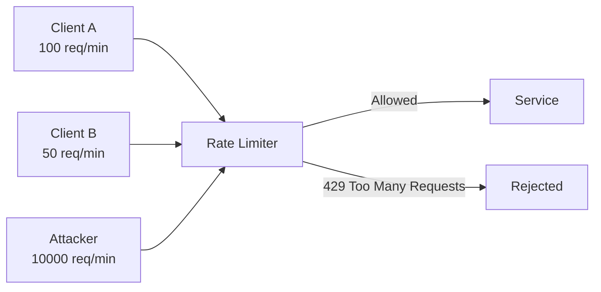
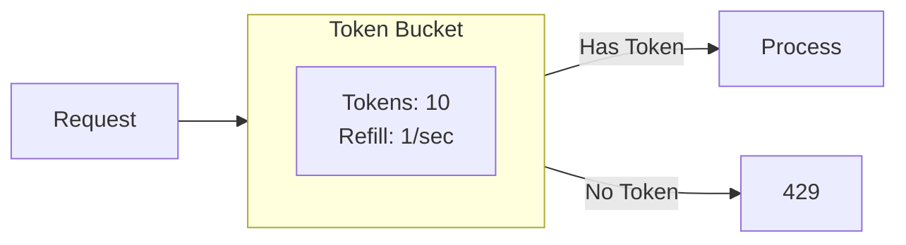
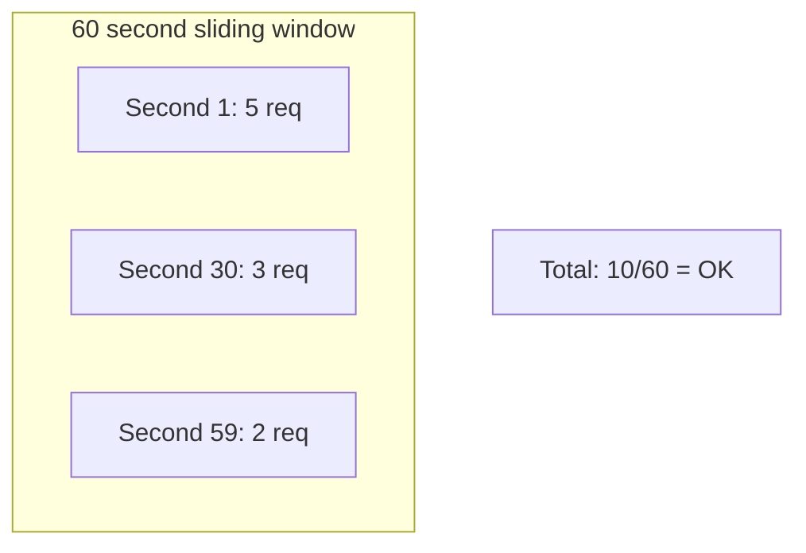

# Rate Limiting Pattern

## Overview

**Rate Limiting** controls the number of requests a client can make to a service within a specified time window. It protects services from being overwhelmed by too many requests, whether from legitimate high traffic, misbehaving clients, or malicious attacks.



---

## Why Use It

### Problems It Solves

1. **DDoS protection**: Limit impact of attack traffic
2. **Service overload**: Prevent legitimate traffic spikes from crashing services
3. **Fair usage**: Ensure all clients get fair access
4. **Cost control**: Limit expensive operations
5. **API monetization**: Enforce paid tier limits

### Key Benefits

- **Service protection** - Prevents overload
- **Predictable performance** - Consistent response times
- **Cost control** - Limit resource consumption
- **Fair access** - Equal opportunity for all clients
- **SLA enforcement** - Different limits per tier

---

## When to Use

### Ideal Scenarios

| Use Case | Rate Limiting Strategy |
|----------|----------------------|
| Public APIs | Per API key, tiered limits |
| Authentication | Prevent brute force (5/min) |
| Expensive operations | Low limits (10/hour) |
| Multi-tenant SaaS | Per-tenant quotas |
| Real-time features | Prevent spam (messages/min) |

---

## Rate Limiting Algorithms

### 1. Token Bucket



**Pros**: Allows bursts, smooth rate over time
**Cons**: More complex implementation

### 2. Sliding Window



**Pros**: Accurate rate limiting, no boundary issues
**Cons**: Memory overhead for tracking

### 3. Fixed Window

Simple counter reset at window boundaries.

**Pros**: Simple, low memory
**Cons**: Boundary burst problem (2x limit possible)

### 4. Leaky Bucket

Requests processed at fixed rate, excess queued/dropped.

**Pros**: Smooth output rate
**Cons**: Latency for queued requests

---

## Pros and Cons

### Pros

| Advantage | Description |
|-----------|-------------|
| **Protection** | Prevents service overload |
| **Fairness** | Equal access for all clients |
| **Cost control** | Limits resource usage |
| **Flexibility** | Different limits per tier |

### Cons

| Disadvantage | Mitigation |
|--------------|------------|
| **User friction** | Clear error messages, Retry-After headers |
| **Distributed complexity** | Use Redis for shared state |
| **Configuration tuning** | Monitor and adjust limits |

---

## Implementation Example

### Python (Token Bucket with Redis)

```python
import time
import redis
from typing import Tuple

class RateLimiter:
    def __init__(self, redis_client: redis.Redis):
        self.redis = redis_client

    def is_allowed(
        self,
        key: str,
        max_tokens: int,
        refill_rate: float,  # tokens per second
        tokens_requested: int = 1
    ) -> Tuple[bool, dict]:
        """Token bucket rate limiter using Redis."""

        now = time.time()
        bucket_key = f"ratelimit:{key}"

        # Lua script for atomic token bucket
        lua_script = """
        local key = KEYS[1]
        local max_tokens = tonumber(ARGV[1])
        local refill_rate = tonumber(ARGV[2])
        local now = tonumber(ARGV[3])
        local requested = tonumber(ARGV[4])

        local bucket = redis.call('HMGET', key, 'tokens', 'last_update')
        local tokens = tonumber(bucket[1]) or max_tokens
        local last_update = tonumber(bucket[2]) or now

        -- Refill tokens
        local elapsed = now - last_update
        tokens = math.min(max_tokens, tokens + (elapsed * refill_rate))

        local allowed = 0
        if tokens >= requested then
            tokens = tokens - requested
            allowed = 1
        end

        redis.call('HMSET', key, 'tokens', tokens, 'last_update', now)
        redis.call('EXPIRE', key, 3600)

        return {allowed, tokens, max_tokens}
        """

        result = self.redis.eval(
            lua_script, 1, bucket_key,
            max_tokens, refill_rate, now, tokens_requested
        )

        allowed = result[0] == 1
        remaining = int(result[1])
        limit = int(result[2])

        return allowed, {
            "remaining": remaining,
            "limit": limit,
            "reset": int(now + (max_tokens - remaining) / refill_rate)
        }

# FastAPI middleware
from fastapi import FastAPI, Request, HTTPException
from starlette.middleware.base import BaseHTTPMiddleware

class RateLimitMiddleware(BaseHTTPMiddleware):
    def __init__(self, app, limiter: RateLimiter, requests_per_minute: int = 60):
        super().__init__(app)
        self.limiter = limiter
        self.rpm = requests_per_minute

    async def dispatch(self, request: Request, call_next):
        # Get client identifier
        client_id = request.headers.get("X-API-Key") or request.client.host

        allowed, info = self.limiter.is_allowed(
            key=client_id,
            max_tokens=self.rpm,
            refill_rate=self.rpm / 60  # tokens per second
        )

        if not allowed:
            raise HTTPException(
                status_code=429,
                detail="Rate limit exceeded",
                headers={
                    "X-RateLimit-Limit": str(info["limit"]),
                    "X-RateLimit-Remaining": "0",
                    "Retry-After": str(info["reset"] - int(time.time()))
                }
            )

        response = await call_next(request)
        response.headers["X-RateLimit-Limit"] = str(info["limit"])
        response.headers["X-RateLimit-Remaining"] = str(info["remaining"])
        return response

# Usage
app = FastAPI()
redis_client = redis.Redis(host='localhost', port=6379)
limiter = RateLimiter(redis_client)
app.add_middleware(RateLimitMiddleware, limiter=limiter, requests_per_minute=100)
```

### Go (Sliding Window)

```go
package main

import (
    "context"
    "fmt"
    "time"

    "github.com/redis/go-redis/v9"
)

type SlidingWindowLimiter struct {
    redis      *redis.Client
    limit      int
    windowSize time.Duration
}

func (l *SlidingWindowLimiter) IsAllowed(ctx context.Context, key string) (bool, int) {
    now := time.Now().UnixMilli()
    windowStart := now - l.windowSize.Milliseconds()
    redisKey := fmt.Sprintf("ratelimit:%s", key)

    pipe := l.redis.Pipeline()

    // Remove old entries
    pipe.ZRemRangeByScore(ctx, redisKey, "0", fmt.Sprintf("%d", windowStart))

    // Count current window
    countCmd := pipe.ZCard(ctx, redisKey)

    // Add current request
    pipe.ZAdd(ctx, redisKey, redis.Z{Score: float64(now), Member: now})

    // Set expiry
    pipe.Expire(ctx, redisKey, l.windowSize)

    pipe.Exec(ctx)

    count := int(countCmd.Val())
    allowed := count < l.limit
    remaining := l.limit - count - 1
    if remaining < 0 {
        remaining = 0
    }

    return allowed, remaining
}
```

---

## Real-World Examples

| Company | Implementation |
|---------|----------------|
| **GitHub** | 5000 req/hour authenticated |
| **Twitter** | Per-endpoint limits |
| **Stripe** | 100 req/sec per key |
| **AWS API Gateway** | Token bucket |

---

## Related Patterns

- [Circuit Breaker](./circuit-breaker.md) - Internal vs external protection
- [Bulkhead](./bulkhead.md) - Resource isolation
- [API Gateway](../02-api-gateway-patterns/api-gateway.md) - Rate limit at edge

---

## Further Reading

- [Rate Limiting Algorithms](https://blog.cloudflare.com/counting-things-a-lot-of-different-things/)
- [Stripe Rate Limiting](https://stripe.com/docs/rate-limits)
- [Token Bucket Algorithm](https://en.wikipedia.org/wiki/Token_bucket)
