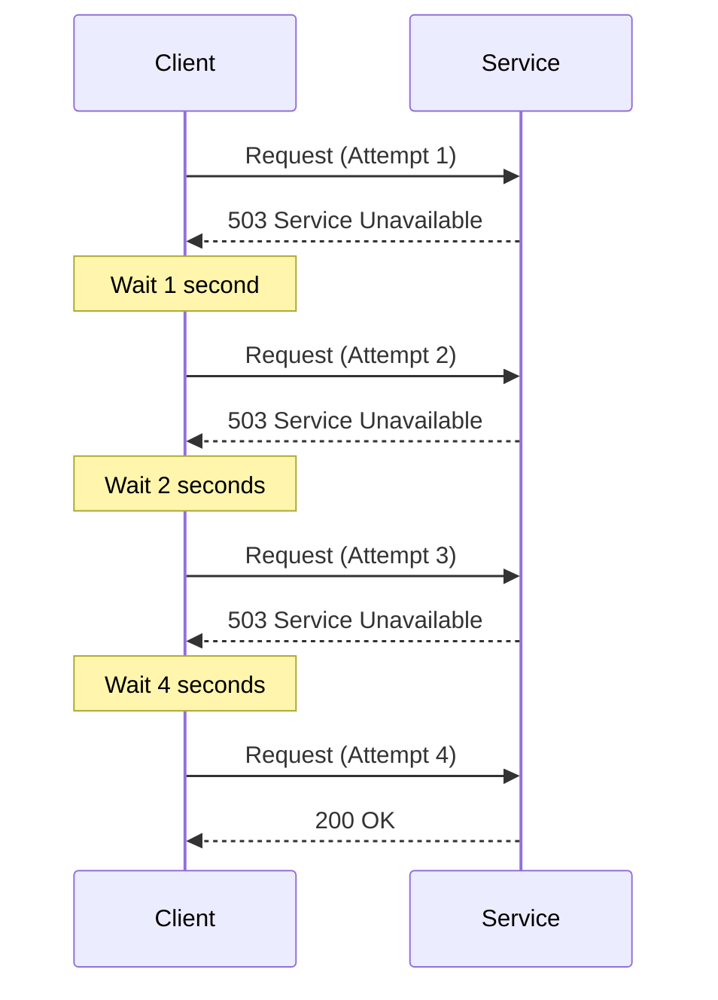
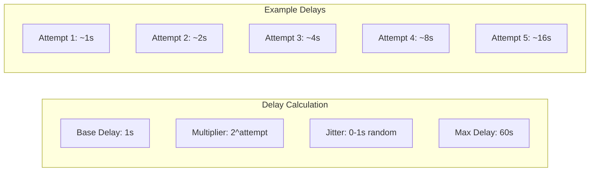
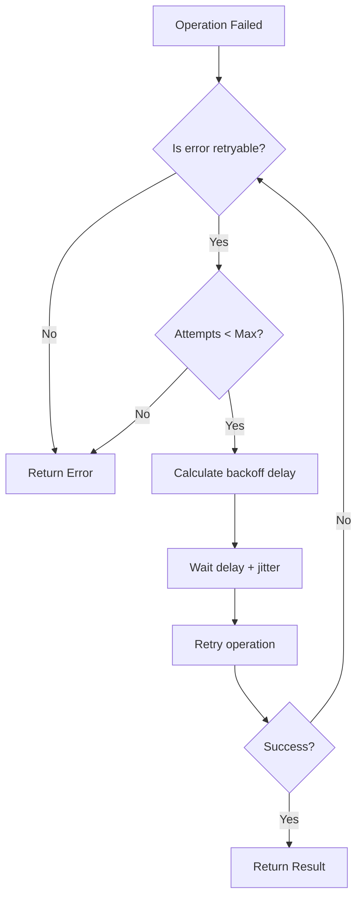
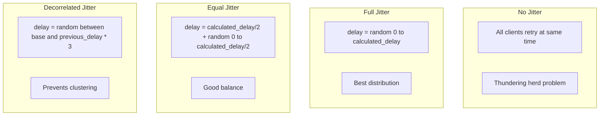

# Retry with Exponential Backoff Pattern

## Overview

The **Retry with Exponential Backoff** pattern automatically retries failed operations with progressively increasing wait times between attempts. This handles transient failures (temporary network issues, brief service unavailability) while avoiding overwhelming a struggling service with immediate retries.

Exponential backoff typically doubles the wait time with each retry, often with added "jitter" (randomness) to prevent synchronized retry storms.



---

## Why Use It

### Problems It Solves

1. **Transient failures**: Network blips, momentary overload
2. **Service restarts**: Brief unavailability during deployments
3. **Race conditions**: Resources becoming available shortly after request
4. **Throttling**: API rate limits with retry-after hints
5. **Load spikes**: Temporary capacity issues

### Key Benefits

- **Automatic recovery** - No manual intervention for transient issues
- **Service protection** - Increasing delays prevent overwhelming struggling services
- **Improved reliability** - Higher success rate for operations
- **Better UX** - Automatic retry is transparent to users
- **Cloud-native** - Essential for distributed systems

---

## When to Use

### Ideal Scenarios

- **HTTP requests**: 5xx errors, 429 (rate limited)
- **Database connections**: Connection pool exhaustion
- **Message queue**: Temporary broker unavailability
- **File operations**: Temporary locks, I/O errors
- **External APIs**: Third-party service hiccups

### Use Case Examples

| Use Case | Retry Strategy |
|----------|----------------|
| Payment processing | 3 retries, 2s base, idempotency key |
| Email sending | 5 retries, 1s base, long max (1 hour) |
| Database writes | 3 retries, 100ms base |
| S3 uploads | 5 retries, 1s base, multipart resume |
| API calls | 3 retries, exponential with jitter |

---

## When NOT to Use

### Avoid Retry When

| Scenario | Why | Alternative |
|----------|-----|-------------|
| 4xx client errors | Won't succeed without fix | Fix request |
| Authentication failures | Retrying won't help | Re-authenticate |
| Validation errors | Data is wrong | Fix data |
| Non-idempotent operations | May cause duplicates | Idempotency keys |
| Circuit open | Service is down | Circuit breaker fallback |

### Anti-Patterns

- **Immediate retries**: Creates retry storms
- **Infinite retries**: Eventually must give up
- **Same delay**: No backoff leads to thundering herd
- **No jitter**: Synchronized retries overload service
- **Retrying non-retryable errors**: Wastes resources

---

## How It Works

### Exponential Backoff Formula

```
delay = min(base_delay * (2 ^ attempt) + jitter, max_delay)
```



### Retry Decision Flow



### Jitter Strategies



---

## Pros and Cons

### Pros

| Advantage | Description |
|-----------|-------------|
| **Handles transient failures** | Automatic recovery from temporary issues |
| **Service protection** | Backoff prevents overwhelming services |
| **Improved reliability** | Higher eventual success rate |
| **Configurable** | Tune for different scenarios |
| **Transparent** | Users don't see retries |

### Cons

| Disadvantage | Description | Mitigation |
|--------------|-------------|------------|
| **Increased latency** | Wait times add up | Set reasonable max delay |
| **Resource consumption** | Holding connections during retries | Timeouts, connection limits |
| **Complexity** | Idempotency requirements | Use idempotency keys |
| **False hope** | May delay ultimate failure | Combine with circuit breaker |
| **Log noise** | Many logged failures | Aggregate retry logs |

---

## Implementation Example

### Python (tenacity library)

```python
import random
import time
from functools import wraps
from typing import Callable, Type, Tuple, Optional
import httpx

# Custom implementation
class RetryConfig:
    def __init__(
        self,
        max_attempts: int = 3,
        base_delay: float = 1.0,
        max_delay: float = 60.0,
        exponential_base: float = 2.0,
        jitter: bool = True,
        retryable_exceptions: Tuple[Type[Exception], ...] = (Exception,),
        retryable_status_codes: Tuple[int, ...] = (429, 500, 502, 503, 504),
    ):
        self.max_attempts = max_attempts
        self.base_delay = base_delay
        self.max_delay = max_delay
        self.exponential_base = exponential_base
        self.jitter = jitter
        self.retryable_exceptions = retryable_exceptions
        self.retryable_status_codes = retryable_status_codes

def calculate_delay(
    attempt: int,
    base_delay: float,
    max_delay: float,
    exponential_base: float,
    jitter: bool
) -> float:
    """Calculate delay with exponential backoff and optional jitter."""
    delay = min(base_delay * (exponential_base ** attempt), max_delay)

    if jitter:
        # Full jitter: random between 0 and calculated delay
        delay = random.uniform(0, delay)

    return delay

def retry_with_backoff(config: Optional[RetryConfig] = None):
    """Decorator for retry with exponential backoff."""
    if config is None:
        config = RetryConfig()

    def decorator(func: Callable):
        @wraps(func)
        def wrapper(*args, **kwargs):
            last_exception = None

            for attempt in range(config.max_attempts):
                try:
                    result = func(*args, **kwargs)

                    # Check for retryable HTTP status codes
                    if hasattr(result, 'status_code'):
                        if result.status_code in config.retryable_status_codes:
                            raise RetryableError(
                                f"Retryable status code: {result.status_code}"
                            )

                    return result

                except config.retryable_exceptions as e:
                    last_exception = e

                    if attempt < config.max_attempts - 1:
                        delay = calculate_delay(
                            attempt,
                            config.base_delay,
                            config.max_delay,
                            config.exponential_base,
                            config.jitter
                        )
                        print(f"Attempt {attempt + 1} failed: {e}. "
                              f"Retrying in {delay:.2f}s...")
                        time.sleep(delay)

            raise last_exception

        return wrapper
    return decorator

class RetryableError(Exception):
    pass

# Using the tenacity library (recommended for production)
from tenacity import (
    retry,
    stop_after_attempt,
    wait_exponential,
    wait_random_exponential,
    retry_if_exception_type,
    retry_if_result,
    before_sleep_log,
)
import logging

logging.basicConfig(level=logging.INFO)
logger = logging.getLogger(__name__)

# Basic retry with exponential backoff
@retry(
    stop=stop_after_attempt(5),
    wait=wait_exponential(multiplier=1, min=1, max=60),
    before_sleep=before_sleep_log(logger, logging.WARNING),
)
def fetch_with_retry(url: str) -> dict:
    response = httpx.get(url, timeout=10)
    response.raise_for_status()
    return response.json()

# Retry with jitter (AWS style)
@retry(
    stop=stop_after_attempt(5),
    wait=wait_random_exponential(multiplier=1, max=60),
    retry=retry_if_exception_type((httpx.HTTPStatusError, httpx.TimeoutException)),
)
def fetch_with_jitter(url: str) -> dict:
    response = httpx.get(url, timeout=10)
    response.raise_for_status()
    return response.json()

# Retry based on result (e.g., empty response)
def is_empty_result(result):
    return result is None or len(result) == 0

@retry(
    stop=stop_after_attempt(3),
    wait=wait_exponential(multiplier=1, min=1, max=10),
    retry=retry_if_result(is_empty_result),
)
def fetch_until_data(url: str) -> list:
    response = httpx.get(url)
    return response.json().get("data", [])

# HTTP client with built-in retry
class RetryingHTTPClient:
    def __init__(
        self,
        base_url: str,
        max_retries: int = 3,
        base_delay: float = 1.0,
    ):
        self.base_url = base_url
        self.max_retries = max_retries
        self.base_delay = base_delay
        self.client = httpx.Client(timeout=30)

    def request(
        self,
        method: str,
        path: str,
        idempotency_key: Optional[str] = None,
        **kwargs
    ) -> httpx.Response:
        url = f"{self.base_url}{path}"

        if idempotency_key:
            headers = kwargs.get("headers", {})
            headers["Idempotency-Key"] = idempotency_key
            kwargs["headers"] = headers

        last_exception = None

        for attempt in range(self.max_retries):
            try:
                response = self.client.request(method, url, **kwargs)

                # Check for retryable status codes
                if response.status_code in (429, 500, 502, 503, 504):
                    # Check for Retry-After header
                    retry_after = response.headers.get("Retry-After")
                    if retry_after:
                        delay = float(retry_after)
                    else:
                        delay = self._calculate_delay(attempt)

                    if attempt < self.max_retries - 1:
                        time.sleep(delay)
                        continue

                return response

            except (httpx.TimeoutException, httpx.ConnectError) as e:
                last_exception = e
                if attempt < self.max_retries - 1:
                    delay = self._calculate_delay(attempt)
                    time.sleep(delay)

        raise last_exception or Exception("Max retries exceeded")

    def _calculate_delay(self, attempt: int) -> float:
        delay = self.base_delay * (2 ** attempt)
        jitter = random.uniform(0, delay * 0.1)
        return min(delay + jitter, 60)

# Usage example
client = RetryingHTTPClient("https://api.example.com")

# Idempotent request with automatic retry
import uuid
response = client.request(
    "POST",
    "/payments",
    idempotency_key=str(uuid.uuid4()),
    json={"amount": 100, "currency": "USD"}
)
```

### Go Implementation

```go
package main

import (
    "context"
    "errors"
    "fmt"
    "math"
    "math/rand"
    "net/http"
    "time"
)

type RetryConfig struct {
    MaxAttempts    int
    BaseDelay      time.Duration
    MaxDelay       time.Duration
    Multiplier     float64
    Jitter         bool
    RetryableFunc  func(error) bool
}

func DefaultRetryConfig() RetryConfig {
    return RetryConfig{
        MaxAttempts: 3,
        BaseDelay:   1 * time.Second,
        MaxDelay:    60 * time.Second,
        Multiplier:  2.0,
        Jitter:      true,
        RetryableFunc: func(err error) bool {
            return err != nil
        },
    }
}

func calculateDelay(attempt int, config RetryConfig) time.Duration {
    delay := float64(config.BaseDelay) * math.Pow(config.Multiplier, float64(attempt))
    if delay > float64(config.MaxDelay) {
        delay = float64(config.MaxDelay)
    }

    if config.Jitter {
        // Full jitter
        delay = rand.Float64() * delay
    }

    return time.Duration(delay)
}

func Retry[T any](
    ctx context.Context,
    config RetryConfig,
    operation func() (T, error),
) (T, error) {
    var lastErr error
    var zero T

    for attempt := 0; attempt < config.MaxAttempts; attempt++ {
        result, err := operation()

        if err == nil {
            return result, nil
        }

        lastErr = err

        if !config.RetryableFunc(err) {
            return zero, err
        }

        if attempt < config.MaxAttempts-1 {
            delay := calculateDelay(attempt, config)

            fmt.Printf("Attempt %d failed: %v. Retrying in %v...\n",
                attempt+1, err, delay)

            select {
            case <-ctx.Done():
                return zero, ctx.Err()
            case <-time.After(delay):
            }
        }
    }

    return zero, fmt.Errorf("max retries exceeded: %w", lastErr)
}

// HTTP-specific retry
type RetryableHTTPClient struct {
    client *http.Client
    config RetryConfig
}

func NewRetryableHTTPClient(config RetryConfig) *RetryableHTTPClient {
    return &RetryableHTTPClient{
        client: &http.Client{Timeout: 30 * time.Second},
        config: config,
    }
}

func (c *RetryableHTTPClient) Do(ctx context.Context, req *http.Request) (*http.Response, error) {
    config := c.config
    config.RetryableFunc = func(err error) bool {
        if err != nil {
            return true
        }
        return false
    }

    return Retry(ctx, config, func() (*http.Response, error) {
        // Clone request for retry
        reqCopy := req.Clone(ctx)

        resp, err := c.client.Do(reqCopy)
        if err != nil {
            return nil, err
        }

        // Check for retryable status codes
        if resp.StatusCode == 429 || resp.StatusCode >= 500 {
            resp.Body.Close()
            return nil, &RetryableHTTPError{StatusCode: resp.StatusCode}
        }

        return resp, nil
    })
}

type RetryableHTTPError struct {
    StatusCode int
}

func (e *RetryableHTTPError) Error() string {
    return fmt.Sprintf("retryable HTTP error: %d", e.StatusCode)
}

// Usage example
func main() {
    ctx := context.Background()

    config := DefaultRetryConfig()
    config.MaxAttempts = 5

    result, err := Retry(ctx, config, func() (string, error) {
        // Simulated API call
        resp, err := http.Get("https://api.example.com/data")
        if err != nil {
            return "", err
        }
        defer resp.Body.Close()

        if resp.StatusCode >= 500 {
            return "", fmt.Errorf("server error: %d", resp.StatusCode)
        }

        return "success", nil
    })

    if err != nil {
        fmt.Printf("Failed after retries: %v\n", err)
    } else {
        fmt.Printf("Result: %s\n", result)
    }
}
```

---

## Real-World Examples

| Company | Implementation | Strategy |
|---------|----------------|----------|
| **AWS SDK** | Built-in retry | Exponential backoff with full jitter |
| **Google Cloud** | Client libraries | Truncated exponential backoff |
| **Stripe** | API client | Automatic retry with idempotency |
| **Twilio** | SDK | Configurable retry policies |
| **GitHub** | API | Rate limit aware retry |

### AWS Recommended Strategy

```
Full Jitter: delay = random_between(0, min(cap, base * 2 ** attempt))
```

This provides the best distribution of retry attempts across clients.

---

## Related Patterns

- [Circuit Breaker](./circuit-breaker.md) - Stop retrying when circuit opens
- [Timeout](./timeout-pattern.md) - Limit how long each retry attempt runs
- [Rate Limiting](./rate-limiting.md) - Avoid triggering with retries
- [Idempotency](../04-data-patterns/saga-pattern.md) - Essential for safe retries
- [Message Queue](../05-messaging-patterns/message-queue.md) - Alternative for async retry

---

## Further Reading

- [Exponential Backoff And Jitter - AWS](https://aws.amazon.com/blogs/architecture/exponential-backoff-and-jitter/)
- [Retry Storm Anti-Pattern](https://docs.microsoft.com/en-us/azure/architecture/antipatterns/retry-storm/)
- [Tenacity Documentation (Python)](https://tenacity.readthedocs.io/)
- [Google API Client Retry](https://cloud.google.com/storage/docs/retry-strategy)
